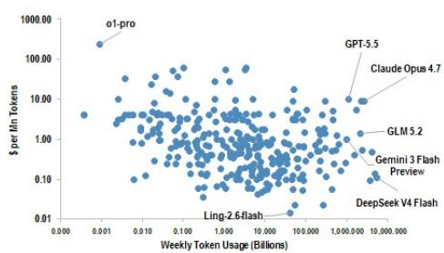
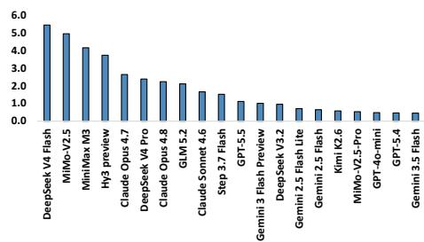
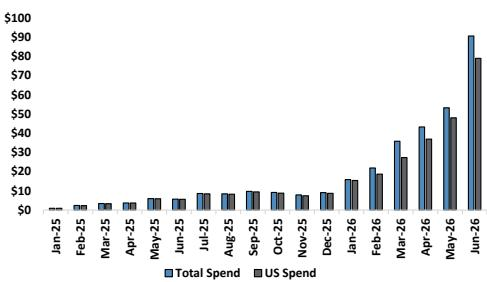

# The AI Infrastructure Cycle Is Not Peaking — It Is Restructuring Around Usage Economics and Pricing Dispersion

The prevailing narrative that AI infrastructure demand is cyclical and approaching a peak misses the most important signal in the data. Based on the latest monthly tracking across token volumes, GPU rental pricing, and memory costs, the evidence points not to a plateau but to a structural recomposition of demand drivers. Token volumes on OpenRouter accelerated 70% month-over-month in June, GPU rental prices rose across all tiers for the seventh consecutive month, and DRAM spot prices surged more than 8x year-over-year. These are not the hallmarks of a topping cycle. They are the signatures of a market where usage is expanding faster than price compression can erode revenue, where compute scarcity is persisting even as new hardware enters the market, and where memory supply chains are bifurcating in ways that reward selective positioning.

The strategic question for investors is no longer whether AI demand is real. It is whether the current pricing and volume dynamics are sustainable, and which parts of the infrastructure stack will capture the most value as the market matures. The data from June offers a nuanced but constructive picture: token economics are improving for model providers, GPU rental spreads are normalizing in a healthy way, and memory markets are signaling that not all demand is created equal. Each of these trends carries distinct implications for capital allocation.

## Token Volume Acceleration and Pricing Resilience Suggest Model Providers Are Winning the Unit Economics Battle

The most underappreciated development in the June data is that token spending growth re-accelerated to 70% month-over-month and 16x year-over-year, even as average token pricing continued to decline year-over-year. This is not a contradiction. It is the arithmetic of elastic demand. Volume expanded 20x year-over-year, more than offsetting the 5% year-over-year decline in average pricing. The implied price elasticity of demand is well above one, meaning that as inference costs fall, usage grows disproportionately. For model providers, this is a favorable dynamic: total revenue is rising even as the unit price of inference declines.

What makes this trend strategically significant is the divergence between U.S.-based models and the rest of the market. U.S. models captured only 35% of token volume in June, down from 56% in April, yet they commanded over 85% of total spending. Volume-weighted average pricing for U.S. models rose 27% month-over-month and 77% year-over-year, while the broader market saw pricing decline 20% year-over-year. This suggests that U.S. frontier models are sustaining premium pricing because they deliver differentiated capability, particularly in agentic coding and complex reasoning tasks. The implication is clear: commoditization is occurring at the low end, but the high end of the model market is exhibiting pricing power.

For infrastructure investors, this means that demand for compute is increasingly concentrated among a small number of high-value model providers. The risk is not that total demand falls, but that the distribution of demand shifts away from hyperscaler-scale training clusters toward more fragmented, specialized inference workloads. The OpenRouter data, which skews toward developer and startup traffic, may understate enterprise demand, but it captures the edge where pricing dynamics are most informative.

## GPU Rental Prices Are Rising Across All Tiers, But the Compression of Inter-Tier Spreads Points to a Maturing Market

The GPU rental market in June showed uniform price increases: A100s rose 6.3% month-over-month, H100s rose 3.7%, and B200s rose 2.7%. This broad-based strength is consistent with a market where demand exceeds available supply at every performance level. However, the more important signal is in the relative pricing. The H100-to-A100 ratio fell to 1.67x from 1.77x in April, and the B200-to-H100 ratio fell to 1.96x from 2.58x at the index launch in September 2025.

These compression trends suggest that the market is becoming more efficient at valuing compute. Early adopters of next-generation hardware pay a steep premium for access, but as supply normalizes, the premium narrows. This is not a bearish signal. It is the natural evolution of a market moving from scarcity-driven pricing to utility-driven pricing. The fact that absolute prices are still rising while spreads are compressing indicates that demand is broad enough to absorb additional supply without causing price degradation.

The strategic implication is that the most attractive risk-adjusted returns in GPU infrastructure may no longer come from owning the newest hardware at launch. Instead, the value is shifting toward operators who can optimize utilization across multiple vintages, matching workload characteristics to the appropriate compute tier. Investors should be asking not just which GPU is in highest demand, but how quickly the installed base of each tier is expanding relative to workload growth.

## Memory Markets Are Sending a Mixed Signal That Demands Deeper Analysis

DRAM and NAND spot prices moved in opposite directions in June, with DRAM rising 10% month-over-month to more than 8x year-over-year levels, while NAND declined modestly for the third consecutive month. This divergence is unusual and warrants scrutiny. Both memory types benefited from the same AI-driven demand surge through early 2026, but the supply dynamics are diverging.

DRAM, particularly DDR5, is tightly coupled to HBM production, which consumes significant wafer capacity and limits the supply of commodity DRAM. The sustained price increases suggest that HBM demand is still absorbing a disproportionate share of DRAM output, constraining the availability of standard memory modules. NAND, by contrast, has a more elastic supply chain, and the sequential declines may reflect either inventory normalization or a shift in demand mix toward higher-capacity drives that exert downward pressure on per-gigabyte pricing.

For infrastructure investors, the memory divergence creates a tactical opportunity. Companies with exposure to DRAM pricing are benefiting from a supply-constrained environment that shows no immediate signs of easing. NAND-exposed players face a more uncertain outlook, where the direction of pricing depends on whether the current softness is a temporary digestion or the beginning of a more prolonged correction. The year-over-year comparisons for both remain extreme, but the month-over-month trend is the more actionable signal.

## What the Report Does Not Fully Answer: The Sustainability of Pricing Power in a Multi-Cloud, Multi-Model World

The data in this report is invaluable for understanding the current state of AI infrastructure demand, but it leaves several critical questions unresolved. First, the token pricing data comes from OpenRouter, which aggregates API traffic but excludes direct first-party volumes from OpenAI, Anthropic, and hyperscaler-hosted endpoints. If the pricing dynamics on direct channels differ materially from the aggregation platform, the conclusions about model provider economics may be skewed. Second, the GPU rental data covers non-hyperscaler capacity only. Hyperscalers negotiate long-term contracts at different pricing structures, and their capacity expansion plans may not be captured by spot rental indices. Third, the memory data reflects spot prices, which can be volatile and may not represent the contract pricing that drives revenue for memory manufacturers.

The most consequential open question is whether the current trajectory of token volume growth can persist as the base expands. A 20x year-over-year growth rate is extraordinary, but it will eventually decelerate as the market matures. The question is whether the deceleration is gradual or abrupt, and whether it coincides with a shift in the mix from training to inference that changes the hardware requirements. The report provides directional comfort but does not model the inflection point.

## A Decision Framework for Investors Navigating the AI Infrastructure Cycle

For investors trying to position portfolios around the trends identified in this report, a structured decision framework is more useful than a directional bet. The framework should consider three dimensions: demand trajectory, pricing power, and supply constraints.

First, assess demand trajectory by tracking token volume growth rates and the mix between U.S. and non-U.S. models. If volume growth remains above 50% month-over-month and U.S. model spending share stays above 80%, the demand environment is supportive for infrastructure. If volume growth decelerates below 30% month-over-month for two consecutive months, that is a caution signal.

Second, evaluate pricing power by monitoring GPU rental spreads and memory price trends. Rising absolute prices with compressing inter-tier spreads indicate healthy demand. Falling absolute prices with widening spreads would suggest oversupply in the high end. For memory, the divergence between DRAM and NAND should be watched closely; a reversal of the current pattern would change the relative attractiveness of memory stocks.

Third, analyze supply constraints by looking at lead times for GPU deployment and the availability of HBM capacity. The memory data already suggests that DRAM supply is constrained. If GPU rental prices continue to rise while lead times extend, the supply-demand imbalance is worsening. If prices rise while lead times shorten, the market is absorbing new supply efficiently.

The most actionable insight from this framework is that the current environment favors companies with exposure to DRAM pricing and multi-vintage GPU fleets, while rewarding caution in NAND-exposed positions and pure-play next-generation hardware leasing.

## Join the community to read the full report and review the original charts.

*This article is for learning and discussion only and does not constitute investment advice.*

Personal reading notes and learning share only. Not investment advice.

