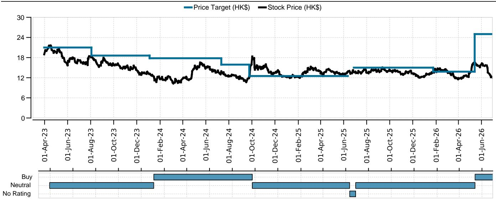
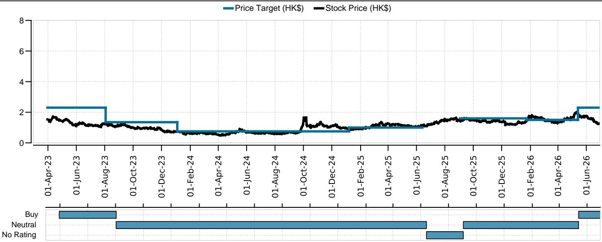
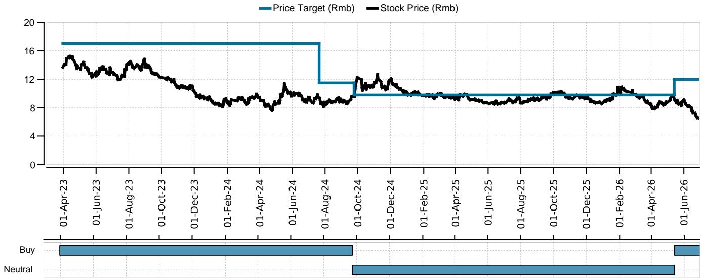

# China’s Property Market Is Not Recovering Evenly — It Is Re-Structuring Around State-Owned Winners

The headline numbers from June 2026 tell a story that is easy to misinterpret. Top 100 developers saw contract sales decline 12% year-on-year, a sharp widening from May’s 2% decline. Month-on-month growth of just 5% was far below the historical average of 26%. On the surface, this looks like a recovery that is stalling. But that reading misses the real transformation underway. The property market in China is not simply weak or strong. It is undergoing a structural re-allocation of market share, capital, and buyer confidence toward a narrow group of state-owned enterprise (SOE) developers, while the rest of the industry continues to contract. The data from June 2026 does not signal a broad-based recovery. It signals the end of the old market structure and the emergence of a two-tier system where access to land, financing, and demand is increasingly determined by ownership type.

The critical insight from the June sales data is not the aggregate decline, but the divergence beneath it. SOE developers as a group saw sales decline only 8% year-on-year, outperforming the top 100 average by 4 percentage points. Within that group, a handful of names are now growing in absolute terms. China Overseas Land & Investment (COLI) moved to the number one position in monthly contract sales, posting RMB 31.4 billion, a 5% year-on-year increase. CMSK, Jinmao, and CR Land also recorded positive sales growth in the first half of 2026. At the same time, private developers such as Vanke and Longfor saw sales collapse by 49% and 53% respectively. This is not a market where demand has disappeared. It is a market where demand has become highly concentrated in the hands of developers that buyers trust — and those are overwhelmingly SOEs.

The land market in June provides the clearest confirmation of this re-structuring. In Shenzhen, three land parcels sold for a total consideration of RMB 20 billion at premiums of 99% to 151% above base price. In Shanghai, C&D International acquired a parcel at a 30% premium, and Greentown China won two parcels at roughly 20% premiums. Developers are not bidding aggressively for land because they are optimistic about the overall market. They are bidding because they are confident in the specific, high-end segments of tier 1 cities where sell-through rates remain strong. COLI’s two new launches in Shenzhen — Antiyayuan with 100% sell-through and Yunsongjiuzhang with 83% sell-through — illustrate the pattern. The market is not recovering broadly. It is polarizing around prime locations, premium products, and SOE developers.

## The Aggregate Sales Decline Masks a Fundamental Shift in Market Share from Private to State-Owned Developers

The most important number in the June data is not the 12% year-on-year decline. It is the gap between SOE and private developer performance. SOE developers recorded an 8% decline, while the broader market fell 12%. That 4-point gap may seem modest, but it represents a continuation of a trend that has been accelerating for two years. In the first half of 2026, COLI posted 12% sales growth, CMSK 8%, Jinmao 8%, and CR Land 6%. These are not merely defensive results. They are offensive gains in a shrinking market. Meanwhile, Vanke’s sales fell 49% and Longfor’s fell 53%. The gap between the best-performing SOEs and the worst-performing private developers is now more than 60 percentage points.

This divergence is not a temporary phenomenon driven by a single month’s project launches. It reflects a structural shift in buyer psychology. Homebuyers in China have become acutely sensitive to developer risk. They are no longer willing to purchase off-plan properties from private developers whose financial stability is uncertain. Instead, they are gravitating toward SOE developers, which they perceive — correctly — as having implicit state backing and lower risk of project delays or defaults. This shift in demand is self-reinforcing. As SOE developers capture more sales, they generate more cash flow, which allows them to bid aggressively for the best land. As they acquire prime land, they launch projects with higher sell-through rates, which further strengthens their reputation and market position. Private developers, by contrast, are trapped in a negative spiral of declining sales, constrained land acquisition, and weakening brand equity.

The implication for investors is clear. The old approach of evaluating Chinese property developers on a common set of valuation metrics — price-to-book, price-to-earnings, net asset value — no longer works. The market is no longer pricing developers based on their asset quality alone. It is pricing them based on ownership type and the implied probability of state support. COLI, CMSK, Jinmao, and CR Land are trading at valuations that reflect a different risk profile than Vanke or Longfor, and that gap is likely to persist as long as buyer sentiment remains risk-averse.

## Secondary Market Data Confirms That Demand Is Shifting Toward Quality, Not Vanishing

One of the most common misinterpretations of the primary sales data is that weak developer sales imply weak housing demand overall. The secondary market data for June 2026 directly refutes this. Secondary transaction volumes across 12 major cities remained strong, with year-on-year growth of 11% as of the week of June 28. More importantly, secondary listings across 50 cities grew only 2.3% year-on-year, and in tier 1 cities, listings actually declined by 9.7% year-on-year. This is a positive signal. It means that homeowners are not rushing to sell, which would indicate panic or distress. Instead, they are holding onto their properties, which suggests confidence in the value of their assets.

The decline in secondary listings in tier 1 cities is particularly significant. It implies that supply in the secondary market is tightening, which should provide support for prices. Indeed, the secondary property price index in tier 1 cities increased by 0.2% month-on-month in May 2026. That is a small number, but it represents a turning point after a prolonged period of price declines. The rental market, while still weak, is also showing signs of stabilization. Rental prices in tier 1 cities declined 2.0% year-on-year in May, narrowing from 2.7% in April.

Taken together, the secondary market data paints a picture that is far more nuanced than the primary sales numbers suggest. End-user demand in major cities remains resilient. The problem is not that people do not want to buy housing. It is that they only want to buy housing from developers they trust. This is why secondary transactions are strong while primary sales are weak. Buyers who are unwilling to purchase off-plan from private developers are turning to the secondary market, where they can inspect the physical unit and complete the transaction without developer risk.

For investors, this distinction is critical. A recovery in secondary transaction volumes and a tightening of secondary supply are leading indicators for a potential stabilization in housing prices. If secondary prices stabilize and begin to rise, it will gradually rebuild confidence in the primary market. But that process will take time, and it will benefit SOE developers first. The secondary market data suggests that the floor for housing demand in tier 1 cities is firmer than many investors assume. The question is not whether demand exists, but which developers will capture it.

## The Land Market Reveals That Developer Confidence Is Hyper-Localized, Not Broad-Based

The land market in June 2026 is the most instructive data point for understanding where the property cycle is heading. In Shenzhen, three land parcels sold at premiums of 99% to 151%. In Shanghai, C&D International paid a 30% premium for a parcel, and Greentown China paid roughly 20% premiums for two parcels. These are not the actions of developers who are pessimistic about the market. They are the actions of developers who are highly confident in specific micro-markets.

But it is equally important to note what is not happening. Land auctions in tier 2 and tier 3 cities are not generating the same level of interest. The premiums are concentrated in tier 1 cities, and within those cities, they are concentrated in prime locations. Developers are not making a broad bet on the Chinese property market. They are making a narrow bet on the most liquid, most desirable segments of the market.

This hyper-localization of developer confidence has important implications for portfolio construction. The traditional approach of investing in a diversified basket of developers across multiple cities no longer works. The returns are being generated by a small number of developers who have the balance sheet strength and the strategic focus to compete for prime land in tier 1 cities. COLI, CMSK, Jinmao, and CR Land are the names that appear consistently in these auctions. Their ability to win prime land at reasonable premiums gives them a structural advantage that will compound over time.

The land market also raises an unresolved question that the report does not fully answer: How sustainable are these land premiums? Paying 151% above base price for a land parcel implies very aggressive assumptions about future selling prices. If the broader economy weakens or if policy support is withdrawn, developers could find themselves holding high-cost land in a declining price environment. The report notes that the strong land premiums reflect confidence in tier 1 cities’ prime locations, but it does not stress-test what happens if that confidence proves overextended. Investors should watch the sell-through rates of these high-premium projects closely. If sell-through rates remain above 80%, the premiums are justified. If they begin to slip, the land market could become a source of risk rather than a signal of strength.

## The Report Leaves a Critical Question Unanswered: What Happens When Policy Support Peaks?

The report documents a market that is improving in specific segments — tier 1 secondary transactions, SOE developer sales, land premiums in Shenzhen and Shanghai. But it does not fully address the sustainability of the policy environment that has enabled this improvement. The narrowing of rental price declines, the tightening of secondary listings, and the stabilization of secondary prices have all occurred in an environment of significant policy relaxation. Mortgage rates have been cut, down payment requirements have been reduced, and purchase restrictions have been eased in most cities.

The open question is what happens when the pace of policy easing slows or reverses. If the economy stabilizes and policymakers shift their focus back to financial stability and debt reduction, the property market could lose its primary catalyst. The report’s data shows that the market is improving, but it does not show that the improvement is self-sustaining. Secondary transaction volumes are strong, but they are supported by low mortgage rates. Land premiums are high, but they are supported by developer confidence that policy will remain accommodative.

Investors need to distinguish between a market that is recovering because of policy and a market that is recovering because of fundamental demand. The current data suggests it is more of the former than the latter. The narrowing of rental price declines is encouraging, but rental prices are still falling. Secondary listings are tightening, but they are still growing in aggregate across 50 cities. The improvement is real, but it is fragile. A sustained recovery will require not just policy support, but a genuine improvement in household income expectations and employment confidence. The report does not provide data on those variables, which means investors must form their own judgment.

## A Decision Framework for Investors Navigating the Two-Tier Market

Given the structural divergence between SOE and private developers, and between tier 1 and lower-tier cities, a one-size-fits-all investment approach is no longer viable. Investors need a decision framework that accounts for the new market reality. The following three-step framework is designed to help allocate capital in this environment.

First, screen for ownership type. In the current market, ownership is the single most important determinant of developer performance. SOE developers have access to cheaper financing, stronger buyer trust, and implicit state backing. Private developers face a structural disadvantage that is unlikely to reverse in the near term. Investors should prioritize developers that are state-owned or have clear state-linked backing. COLI, CMSK, Jinmao, and CR Land are the names that consistently appear in the report’s top performers list. They should form the core of any China property allocation.

Second, focus on land acquisition strategy. The developers that are winning in the current market are those that are selectively acquiring prime land in tier 1 cities at reasonable premiums. Developers that are forced to acquire land in lower-tier cities or that are priced out of tier 1 auctions are at a structural disadvantage. Investors should evaluate developers based on the quality and location of their land banks, not just the aggregate size. A developer with a concentrated land bank in Shenzhen and Shanghai is in a stronger position than a developer with a diversified land bank across 30 cities.

Third, monitor secondary market indicators as leading signals. Secondary transaction volumes, secondary listings growth, and secondary price trends are more reliable indicators of underlying demand than primary sales data. If secondary transactions remain strong and listings continue to decline, it suggests that end-user demand is healthy and that the primary market will eventually benefit. If secondary transactions begin to weaken, it would be a warning sign that the recovery is losing momentum. Investors should track these indicators on a weekly basis and adjust their exposure accordingly.

This framework is not static. As the market evolves, the relative importance of these factors will shift. But in the current environment, ownership, land strategy, and secondary market trends are the three variables that matter most.

## The Full Report Contains the Charts and Granular Data That Make These Trends Actionable

The analysis above is based on the aggregate data and key trends from the June 2026 property sales report. But the report contains much more detail than can be covered in a single article. The charts on secondary transaction volumes by city, the breakdown of SOE versus private developer performance by month, and the detailed land auction data for Shenzhen and Shanghai all provide additional layers of insight that are essential for making informed investment decisions.

The original report also includes the analysts’ specific ratings and price targets for the developers covered, as well as the valuation methodology and risk statements that underpin those ratings. For investors who want to build a position in Chinese property developers, this level of detail is not optional. It is the foundation of a rigorous investment process.

Join the community to read the full report and review the original charts.

*This article is for learning and discussion only and does not constitute investment advice.*

Personal reading notes and learning share only. Not investment advice.

