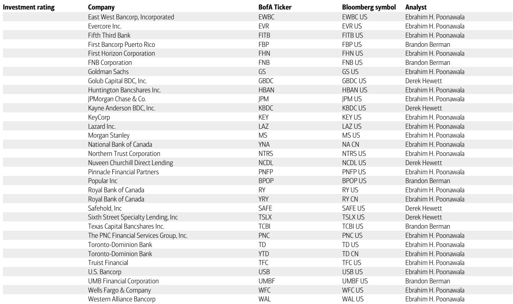
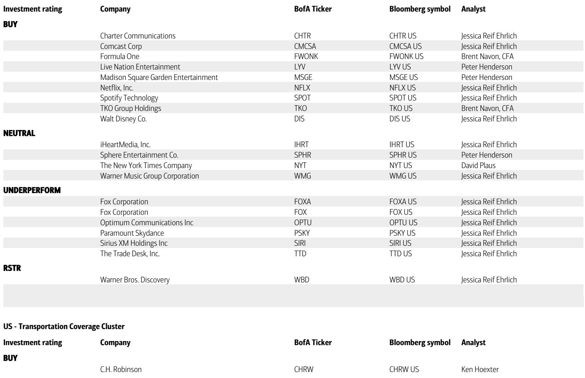
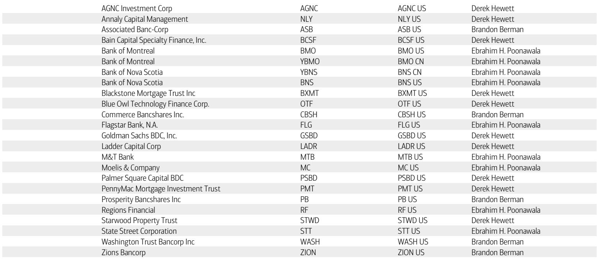

# JPM：BofAQ3十大选股：福特、IBM、沃尔玛，和一个被低估的“新工业周期”

这并非一份普通的季度选股清单。

当市场仍在消化AI叙事分化、关税余波和消费者信心摇摆时，BofA（BofA）在7月1日发布了其2026年第三季度“Top 10 US Ideas”名单。这份清单的独特之处不在于它列出了哪些股票，而在于它背后的宏观判断：BofA的RIC（研究投资委员会）展望明确指出，美国经济和全球股市的“新工业周期”仍然完好，盈利动能正在加强，全球盈利修正比率已升至六个月高位。

换句话说，当一部分投资者还在争论衰退是否来临，BofA认为，真正的机会在于识别出那些在这一轮结构性周期中，拥有独特护城河和催化剂的公司。这份清单不是被动防御，而是主动进攻。

九只买入，一只跑输。覆盖十个子行业。从传统车企到量子计算，从支付网络到生物科技。如果你把它当作一份简单的“抄作业”名单，你可能错过了这份报告最核心的价值——它揭示了BofA分析师眼中，哪些公司在2026年下半年拥有最清晰的、可量化的股价催化剂。

以下是我们从这份报告中提炼出的五个核心洞察，以及一个尚未被充分讨论的关键问题。

## 1. 福特：这不是汽车股，这是北美工业保护主义下的结构性赢家

将福特列为Q3首选，表面上看是逆周期押注——市场对传统车企的估值长期低迷，福特目前市盈率仅6.8倍，只有21%的卖方分析师给予买入评级。但BofA汽车分析师Alexander Perry的逻辑并非“便宜”，而是“结构性地更好”。

核心论点有三层。第一，福特的北美主场在保护主义贸易议程下反而受益。没有中国电动车品牌的直接冲击，排放标准的松绑允许福特生产其利润率最高的燃油车。第二，产品组合正在向高利润车型倾斜，包括Ranger Raptor、Explorer Tremor以及F-150中V8发动机渗透率的提升。第三，被市场忽视的新增长曲线：电池储能系统（BESS）和软件服务。福特新成立的能源业务，瞄准公用事业和数据中心客户，凭借品牌认知度和本土制造优势，有望在硬件差异化的市场中占据一席之地。

> **KC评论：** 市场习惯把福特看成周期股，但BofA的分析框架实际上在讲一个“结构性的利润池转移”故事。如果你只看汽车销量，你会错过福特在软件（BlueCruise）、储能（BESS）和售后零部件这些高利润领域的成长性。这份报告里有一个关键假设——Novelis铝厂火灾后的复产进度，这是福特F系列产能能否恢复的变量。完整报告对复产节奏和成本影响有更详细的拆解。

## 2. IBM：被AI叙事误伤的价值股，量子计算是隐藏的期权

IBM是这份清单中争议可能最大的选择。71%的卖方分析师已经给予买入评级，但近期软件板块的普遍回调——尤其是围绕“Agentic AI”可能颠覆传统应用软件的担忧——让IBM股价承压。BofA分析师Wamsi Mohan认为，这种担忧在IBM身上被过度放大了。

关键区别在于，IBM的软件组合主要集中在基础设施层：混合云平台、数据治理、自动化和安全交易处理。AI代理的普及，非但不会替代这些需求，反而会因为模型、代理、工作流和数据在混合环境中的复杂性增加，而推高对IBM核心产品的需求。咨询业务仅占IBM收入的约15%，且订单在2026年第一季度已恢复增长。更重要的是，量子计算正在成为一条越来越可见的催化剂。IBM计划在未来五年投资超过100亿美元于量子计算，并与美国商务部达成合作建设量子芯片代工厂。在近期量子计算纯玩家IPO的背景下，IBM的量子业务尚未获得市场充分定价。

> **KC评论：** BofA给IBM 315美元的目标价是基于21倍2027年EV/FCF。这个估值倍数在当前软件股中并不便宜，但分析师认为市场忽略了两个关键点：一是IBM自由现金流的韧性（受生产力改善和产品组合驱动），二是量子计算带来的“期权价值”。完整报告对比了IBM与纯量子计算公司的估值差异，以及IBM在混合云和AI基础设施中不可替代的角色。

## 3. 沃尔玛：防御中的进攻，消费降级与份额集中的双重受益者

沃尔玛的入选，呼应了BofA宏观团队对“消费者韧性但分化”的判断。在持续的通胀压力和更高的汽油价格背景下，沃尔玛作为低价零售商，正在经历客流和市场份额的双重增长。但BofA的推荐理由不止于此。

报告指出，沃尔玛正在将其庞大的规模和客流量转化为新的利润引擎：高利润率的广告业务（Walmart Connect）和第三方市场（Marketplace）。这些业务的扩张正在改变沃尔玛的利润结构，使其从一家低利润率的零售商，向一家拥有强大零售飞轮的平台型公司演进。此外，沃尔玛在供应链自动化和AI驱动的库存管理上的投入，正在持续改善运营效率。

> **KC评论：** 沃尔玛的故事听起来很熟悉，但BofA这次强调的催化剂是“广告和市场的利润率爬坡速度”。如果你只看同店销售增长，你可能会低估沃尔玛未来几年的每股收益增长潜力。完整报告中有详细的广告业务营收预测和利润率模型。

## 4. JPM：利率环境下的“规模溢价”，但监管是未解之谜

作为美国最大的银行，JPM入选Q3首选并不令人意外。BofA分析师Ebrahim Poonawala认为，JPM在当前的利率环境下拥有独特的“规模溢价”：更高的净利息收入（NII）指引、强劲的投资银行业务收费、以及持续的成本控制能力。

但值得注意的是，BofA对JPM的评级为“买入”，目标价362美元，隐含约10.6%的上行空间。这个上行空间在10只股票中并不算最大，反映出市场对大型银行股已有了相当程度的定价。真正的悬念在于监管环境的变化——巴塞尔III终局规则的不确定性，以及资本金要求可能的变化，仍是悬在银行股头上的达摩克利斯之剑。

## 5. 报告尚未完全回答的关键问题：这些催化剂在什么宏观情景下会失效？

BofA的这份清单建立在“新工业周期”和“盈利动能加强”的宏观假设之上。但报告本身也坦诚地指出了每个股票的下行风险。将这些风险汇总，我们可以清晰地看到这份选股清单的脆弱点：

如果美国消费者信心出现实质性恶化，沃尔玛和福特将同时承压。如果企业IT支出因经济不确定性而突然收缩，IBM和Snowflake的成长故事将面临挑战。如果利率环境出现超预期变化，JPM的NII指引和Lennar的跑输逻辑都将被重新审视。

换句话说，这份清单的有效性高度依赖于一个“软着陆”或“不着陆”的宏观背景。一旦衰退风险显著上升，这些高确信度的公司可能也会面临估值和盈利的双重压力。报告没有深入探讨的是，如果这些宏观假设被证伪，投资者应该如何动态调整仓位——而这恰恰是季度选股策略最需要关注的“二阶效应”。

## 6. 一个被低估的观察框架：从“催化剂”到“催化剂密度”

这份报告最实用的价值，或许不是具体的股票名单，而是它提供了一个分析框架：如何评估一家公司在未来一个季度内股价催化剂的数量、质量和可预见性。

BofA的10只股票，每一只都有至少3-5个明确的、可跟踪的催化剂——财报、产品发布、监管进展、并购动态等。这构成了所谓的“催化剂密度”。对于决策者而言，与其追问“该不该买这只股票”，不如追问“这个公司的催化剂密度，是否足以支撑未来一个季度的超额收益”。

这个框架同样适用于评估自己的持仓：你持有的公司，在未来90天内，有哪些可以量化的事件或数据点，可能改变市场对它的定价？如果答案很少，那么这只股票很可能是一只“等待型”资产，而不是“催化型”资产。

---

这份BofAQ3十大选股清单，真正的价值不在于它的推荐方向，而在于它提供了一个结构化的、基于催化剂的投资思考方法。完整报告中对每一只股票的催化剂时间表、风险收益比、以及分析师与市场共识的差异点，都有更详尽的拆解。例如，Snowflake的AI数据云战略与竞品的差异化在哪里？Spotify的利润率拐点能否持续？Ionis制药的管线催化剂是否被充分定价？这些内容，都留在了报告的正文和图表中。

我们每日更新并汇总国际主流投行与咨询机构的深度报告、数据和图表，帮助观测市场的边际变化。我们的社群目前汇聚了来自头部券商、PE/VC、投行、并购、对冲基金、资管机构、战略咨询和智库的朋友。如果你对这份报告中的未解问题——比如“催化剂密度”如何量化、不同宏观情景下的组合调整策略——感兴趣，欢迎扫码交流。

Personal reading notes and learning share only. Not investment advice.

