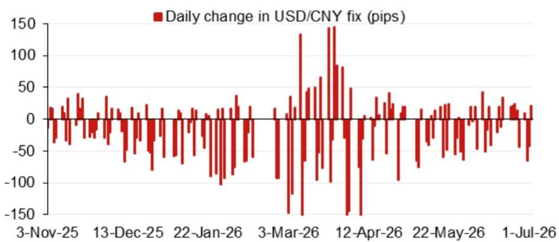
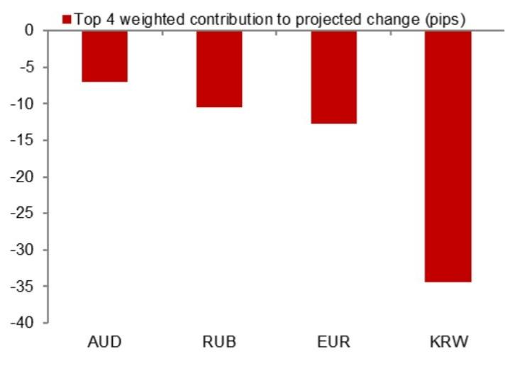

# NOM：人民币中间价模型释放了一个被低估的信号

2026年7月3日，NOM发布了一份看似日常的USD/CNY中间价模型更新。模型预测值从6.8088骤降至6.7785，单日向下调整303个基点。这不是一个技术性修正。这是NOM的定量框架在告诉你：人民币定价的底层逻辑正在发生位移，而市场可能还没有充分定价。

这份报告的核心判断是：在逆周期因子并未显著加码的前提下，模型本身已经捕捉到了人民币走强的结构性支撑。市场习惯于将注意力放在央行是否“引导贬值”上，但NOM的模型显示，真正的变化来自外部权重变动和隔夜市场贡献的重新分布。这不是政策的主动选择，而是定价机制的被动校准。而校准的方向，是升值。

以下是这份报告最值得关注的五个层次，每一个都指向同一个结论：人民币的短期定价权正在从政策博弈回归到市场信号。

---

## 1. 模型预测值与实际定盘价的背离，暴露了市场对央行意图的误读

NOM模型的预测值（不含逆周期因子）为6.7785，而前一日官方收盘价约为6.7866。模型预测值比收盘价低约81个基点。这意味着，如果完全按照模型定价，人民币应该比市场交易水平更强。

市场通常将“中间价弱于预期”解读为央行容忍贬值，将“中间价强于预期”解读为央行维稳。但NOM的模型揭示了一个更微妙的机制：当模型预测值显著低于前日收盘价时，即使实际中间价因为逆周期因子而被调高，其隐含的“真实定价”仍然指向升值。换句话说，市场看到的中间价可能已经被逆周期因子“人为抬高”，但模型本身的方向信号并未改变。

> **KC评论：** 不要只看中间价的绝对值。要比较模型预测值（不含逆周期因子）与实际中间价之间的差距。如果模型预测值持续低于实际中间价，说明逆周期因子在“拖后腿”，而非“推波助澜”。换句话说，央行可能是在用逆周期因子减缓升值速度，而不是在引导贬值。这个信号在7月3日的数据中非常清晰。

这份报告还附带了过去一段时间的模型误差走势图。误差的波动区间和方向变化，是判断央行干预力度是否在减弱的关键线索。完整报告中的图2值得仔细看——它展示了模型在哪些时点出现了系统性偏差，这些偏差往往对应着政策干预的加码或退出。

---

## 2. 隔夜市场贡献的权重分布，正在从美元单边驱动转向多货币联动

NOM模型将隔夜市场变化分解为前四大权重贡献因素。7月3日的数据显示，贡献最大的因素并非美元指数的单一波动，而是一篮子货币的相对变化。这意味着，中间价的定价逻辑正在从“盯住美元”转向“盯住一篮子”。

这个转变的意义在于：当美元指数走弱时，人民币不一定同步走强——因为篮子中其他货币的变动会抵消或放大这一影响。反之，当美元指数走强时，人民币也可能因为篮子中其他货币的支撑而相对抗跌。NOM的模型更新实际上是在告诉我们：人民币的汇率弹性正在从双边模式转向多边模式。

> **KC评论：** 过去几年，市场习惯于用“美元指数-人民币汇率”的线性关系来交易。但NOM模型显示，这种关系的稳定性正在下降。如果投资者仍然用美元指数的涨跌来直接推导人民币走势，可能会错过篮子中欧元、日元等货币的边际变化。完整报告中的图1列出了前四大权重贡献的具体数值和来源，这些数据可以帮助读者判断哪些货币正在成为人民币定价的新锚点。

---

## 3. 逆周期因子的使用力度，是理解当前汇率政策的关键变量

NOM模型同时给出了包含逆周期因子的预测值：6.7855。这个数值比不含逆周期因子的预测值（6.7785）高出约70个基点。逆周期因子在7月3日的作用是“压低”了模型的升值幅度，而不是“推高”贬值压力。

这与市场普遍认知存在偏差。很多人认为逆周期因子是央行用来对抗贬值压力的工具。但NOM的数据显示，在当前阶段，逆周期因子更像是一个“减速器”——它在减缓升值速度，而不是在阻止贬值。这个判断如果成立，意味着央行对人民币升值的容忍度可能高于市场预期。

当然，逆周期因子的使用方式并非线性。它的力度会随着外部环境和内部政策目标的变化而调整。NOM的报告没有给出逆周期因子未来变化的预测，但模型误差的历史数据可以提供一些线索。完整报告中的图3展示了每日中间价的变化幅度，结合逆周期因子的使用，可以推算出央行在哪些时点选择了“加速”或“减速”。

---

## 4. 下半年关键事件窗口密集，中间价模型将成为政策信号的前哨

NOM在报告末尾附上了2026年下半年中国的关键事件日历：7月下旬的政治局经济工作会议、11月的APEC峰会、12月的中央经济工作会议，以及年底前后中国领导人可能对美国的访问。

这些事件每一个都可能成为人民币定价的催化剂。尤其是APEC峰会和可能的元首会晤，往往伴随着政策信号的释放或市场预期的重新校准。NOM的中间价模型在这些事件前后的变化，将成为观察政策意图的“温度计”。

需要注意的是，NOM的模型本身并不预测事件结果。它只反映模型输入变量（隔夜市场变化、篮子权重、逆周期因子）的边际变化。但正是这种“非主观”的特性，使得模型在事件驱动行情中反而更具参考价值——因为它排除了分析师的主观判断，只反映市场数据和政策工具的实际使用情况。

> **KC评论：** 对于关注汇率风险的投资者来说，下半年每一个关键事件窗口前，都应该密切跟踪NOM中间价模型的变化。如果模型预测值持续低于实际中间价，且逆周期因子加码，说明央行在“压住”升值预期；如果模型预测值高于实际中间价，且逆周期因子减弱，说明央行在“放任”贬值压力。这两种情景对应的资产配置逻辑完全不同。完整报告中的事件日历表格，可以帮助读者提前规划观察窗口。

---

## 5. 报告尚未完全回答的关键问题：模型误差的持续性是否意味着政策框架正在调整？

NOM的报告提供了模型误差的历史数据，但没有深入讨论误差的持续性含义。如果模型误差在某一方向上持续偏大，可能意味着两种可能性：一是模型本身需要重新校准（例如篮子权重或隔夜市场贡献的计算方式不再适用），二是政策框架正在发生系统性调整，而模型尚未完全反映。

这两种可能性的投资含义截然不同。如果是模型校准问题，那么误差会随着时间自行修正，市场不需要过度反应。如果是政策框架调整，那么误差的持续方向本身就构成了一个交易信号。

NOM的报告没有给出明确的判断。但读者可以通过跟踪后续几期模型更新，观察误差是否在收敛或发散。如果误差持续为正（模型预测值高于实际中间价）且幅度扩大，说明央行可能在主动引导贬值；反之，如果误差持续为负且幅度扩大，说明央行在主动引导升值。这个判断框架，比单次模型更新更有价值。

---

## 为什么这份报告值得你读完完整版本？

以上五个层次，只是NOM这份报告的冰山一角。完整报告中包含了：

- 过去一段时间的模型误差走势图，可以帮助你判断当前误差是否处于历史极端位置；
- 每日中间价变化图，结合逆周期因子使用，可以推算出央行干预的真实力度；
- 前四大隔夜市场贡献因素的详细拆解，告诉你哪些货币正在主导人民币定价；
- 下半年关键事件日历，帮助你提前布局汇率敏感资产。

这些信息在公开市场上很难获得完整版本。NOM的模型方法论本身就是一个“黑箱”，但通过跟踪其输出结果的变化，我们可以获得一个独立于市场共识的观察视角。

如果你希望持续获得这类国际投行的原始研报解析、数据图表和边际变化追踪，欢迎扫码加入我们的社群。我们每日更新，汇总国际主流叙事、数据和图表，帮助读者观测边际变化。社群汇聚了头部券商、PE/VC、投行、并购、对冲基金、资管机构、战略咨询和智库的朋友，期待与你交流。

Personal reading notes and learning share only. Not investment advice.

