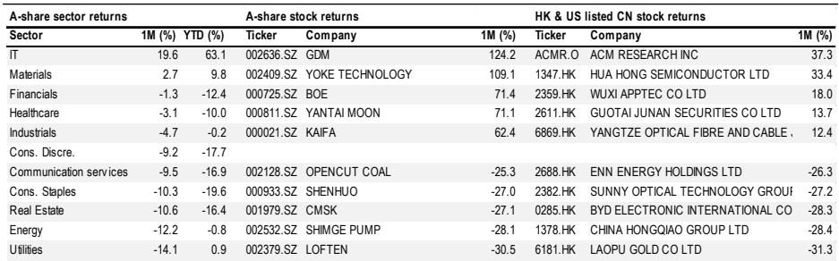
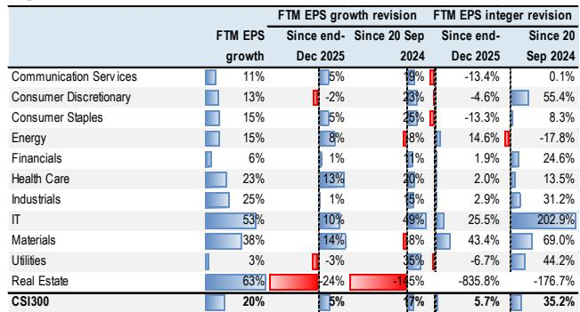
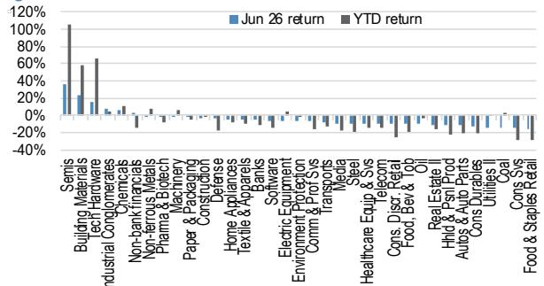

# JPM：A股AI叙事正在改写“中国溢价”的定义

6月的中国股市，画出了一条令全球投资者难以忽视的分界线。当恒生指数单月下跌超过9%，恒生中国企业指数跌幅超过10%时，A股三大指数却逆势录得正收益：沪深300上涨1.8%，中证500飙升8.0%，中证1000上涨4.8%。这不是简单的市场分化，而是一次资产定价逻辑的重构。

JPM在最新一期A股月度报告中，捕捉到了这一关键信号：A股正在从“宏观叙事”驱动转向“产业叙事”驱动，而AI基础设施是这一轮结构分化的核心引擎。对于习惯用“政策刺激”框架理解中国市场的投资者来说，这份报告提供了一个新的坐标系。

## 1. A股与港股的背离，本质是“AI信仰”对“宏观焦虑”的定价胜利

6月的市场数据似乎指向一个矛盾：A股上涨的同时，经济基本面并未出现显著改善。5月社会消费品零售总额同比转负，固定资产投资同比大幅收缩10.7%，房地产投资更是下滑24.3%。传统宏观框架无法解释A股为何能跑赢。

JPM的报告给出了一个清晰的解释框架：A股当前定价的不是宏观复苏，而是产业重构。IT板块6月单月上涨19.6%，年初至今涨幅高达63.1%，是推动指数上行的核心力量。与之对应的是，港股和中概股中互联网平台公司权重较高，而海外投资者对这些资产的看法更为谨慎。这种分化意味着，A股正在形成独立于宏观周期的“AI溢价”。

> **KC评论：** 过去十年，A股投资者习惯把“政策底”当作买入信号。但这份报告暗示，AI叙事可能正在成为新的定价锚。对于关注中国资产的投资者来说，理解这种从“宏观博弈”到“产业选择”的范式转换，比预测下一次降准更重要。

## 2. AI成本传导正在重塑通胀结构，这是被低估的长期变量

JPM报告中最具洞察力的判断，并非关于股市表现，而是对通胀结构的拆解。报告指出，AI相关的成本传导正在向上游半导体和下游电子设备扩散，形成一种“更具可持续性的通胀尾风”。

5月PPI同比上涨3.9%，环比上涨0.8%，明显高于市场预期。但更重要的是通胀结构的变化：传统上，中国PPI上涨主要来自能源和原材料价格推动，而这次驱动因素变成了工业升级和AI计算需求拉动的金属、电气机械和电子设备价格。这意味着，即使全球大宗商品价格回落，中国PPI也可能因为AI产业链的需求而保持韧性。

对于债券投资者而言，这是一个需要重新评估的信号。10年期国债收益率在6月末小幅回升至1.72%，如果AI驱动的结构性通胀压力持续，收益率下行的空间将被压缩。

## 3. 流动性的“量价背离”揭示了一个更微妙的投资者结构

A股6月日均换手率飙升至6%以上，创下近年来新高。同时，场内融资余额占A股市值的比例升至2.85%，接近历史区间上沿。这两个指标通常被解读为市场情绪高涨。

但JPM的数据揭示了一个更复杂的图景：EPFR数据显示，6月A股市场净流出约4亿美元，仅IT板块录得小幅净流入。这意味着，推动A股上涨的资金并非来自海外增量，而是存量资金的活跃度提升和结构再配置。

这背后是投资者结构的深刻变化。报告估算，截至2025年底，A股总市值中散户持有43%，控制性股东和战略股东持有42%，国内金融机构持有12%，外资仅持有3%。当外资因宏观不确定性而犹豫时，国内资金——尤其是散户和杠杆资金——正在用自己的逻辑定价AI故事。

> **KC评论：** 高换手率和融资余额攀升，叠加外资净流出，这种“量价背离”的流动性结构意味着A股的上涨基础可能比表面看起来脆弱。完整报告中对资金流向和投资者行为的进一步拆解，是理解这一风险的关键。

## 4. 宏观数据的“冰火两重天”指向一个尚未被定价的尾部风险

JPM在报告中详细拆解了5月宏观数据，揭示了一个“分化加剧”的经济图景。一方面，高技术制造业和AI相关产业链表现强劲：3D打印设备产量增长54.4%，锂电池增长40.0%，工业机器人增长27.9%，集成电路增长22.9%。另一方面，传统消费和投资领域持续疲软：汽车零售额同比下滑16.4%，房地产投资同比下滑24.3%，居民中长期贷款仍在收缩。

这种分化意味着什么？AI产业链的景气度正在掩盖经济其他部分的疲弱。如果AI相关投资增速放缓，或者出口因全球需求波动而回落，经济的真实压力可能比当前数据显示的更大。报告没有直接给出结论，但数据本身已经构成一个清晰的风险警示：市场对AI的定价可能过于乐观，而对宏观下行风险定价不足。

## 5. 估值已经回到历史高位，但盈利预期能否兑现仍是最大疑问

截至6月底，沪深300的12个月前瞻市盈率为14.6倍，处于2016年以来均值上方约1.7个标准差。从PEG角度看，0.7倍的PEG水平看似合理，但前提是未来12个月盈利增速达到19.7%。

问题在于盈利预期的可靠性。报告显示，IT板块的盈利上修幅度最大，年初至今12个月前瞻每股收益整数上修达到25.5%，而9月24日以来更是高达202.9%。这种上修速度在历史上极为罕见，也意味着一旦AI相关公司的盈利增速不及预期，估值回调的幅度可能同样惊人。

与之形成对比的是，房地产行业的盈利预期出现断崖式下调，年初至今整数下修高达835.8%。这种极端分化意味着，当前市场对“好赛道”和“坏赛道”的定价已经非常极致，任何边际变化都可能引发剧烈的风格切换。

> **KC评论：** 14.6倍市盈率本身并不贵，但考虑到盈利预期已经大幅上修，实际估值安全边际可能比表面数字小得多。报告中对各行业盈利修正的详细图表，是判断哪些板块的预期已经“打满”的关键工具。

## 6. 报告没有完全回答的问题：AI叙事的可持续性需要哪些条件来验证

JPM这份报告的价值在于提供了清晰的数据框架，但它也留下了一些关键问题没有完全回答。

第一，AI基础设施的投资回报周期尚未被验证。当前市场追捧的AI产业链公司，多数处于资本开支扩张阶段，现金流和盈利能力的改善还需要时间。如果资本开支增速在某个时点放缓，整个叙事逻辑可能面临挑战。

第二，宏观政策的走向仍然是一个未知变量。报告提到，海外投资者对7月政治局会议可能出台的刺激政策兴趣上升，但国内客户对刺激的预期仍然较低。如果政策力度不及预期，消费和地产链条的持续疲软可能拖累整体市场情绪。

第三，A股与港股的估值差已经拉大到历史极端水平。6月沪深300相对恒生中国企业指数的超额收益达到26.9%（年初至今）。这种价差能否持续，取决于中国AI故事的独特性是否足以支撑A股长期溢价。如果AI叙事在全球范围内降温，或者港股估值吸引力开始吸引资金回流，A股的超额收益可能面临均值回归。

对于希望深入理解这些问题的投资者，JPM报告中的行业资金流向图、估值分位数表和盈利修正历史序列，提供了不可替代的分析素材。这些图表背后的二阶影响——比如哪些行业的盈利预期已经过度乐观、哪些板块的估值隐含了过高的风险溢价——是判断下一步市场方向的关键。

我们每日更新汇总国际主流机构的叙事、数据和图表，观测边际变化。社群中汇聚了头部券商、PE/VC、投行、并购、对冲基金、资管机构、战略咨询和智库的朋友，期待与你交流这些未完的问题。

Personal reading notes and learning share only. Not investment advice.

