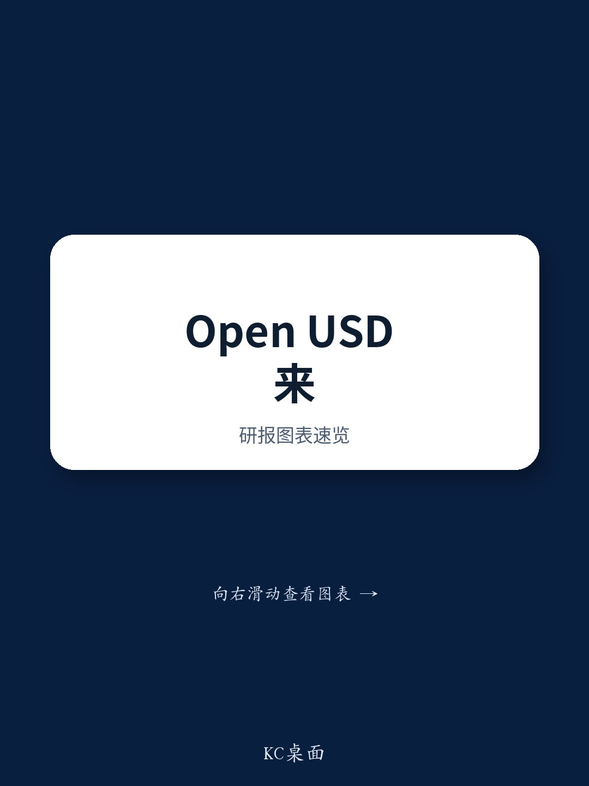

# HSBC：Open USD的“分钱”模式，可能才是稳定币真正的竞争起点

一个由贝莱德、Visa、万事达卡、Stripe和Coinbase等巨头组成的联盟，宣布将发行一种名为Open USD的新稳定币。消息一出，Circle股价应声下跌。市场的第一反应是：又来了一个挑战者。但HSBC银行在最新研报中提出了一个更冷静、也更值得深思的判断：Open USD真正的创新不在于技术，而在于它选择了一种完全不同的商业逻辑——把资产储备的收益分给合作伙伴，而不是自己独吞。

这份报告的犀利之处在于，它没有陷入“新币种能否挑战USDT”的简单叙事，而是将问题上升到了整个稳定币生态的结构性竞争。HSBC认为，我们需要从三个维度来理解这一事件：创新性、竞争格局和实际采纳。而这三个维度的交汇点，指向了一个核心问题：稳定币市场正在从“谁发的币”转向“谁能让更多人用这个币”。Open USD的“分钱”模式，或许正是打开这个新战场的钥匙。

## 1. 真正的创新不在于技术，而在于它颠覆了“谁赚钱”的分配规则

HSBC报告开篇就点明，媒体对Open USD的报道大多聚焦于它与USDT、USDC的商业模式对比。传统稳定币发行商，如Tether和Circle，会保留其储备资产（如美国国债）产生的全部收益。而Open USD则将绝大部分收益分配给其140多个合作伙伴，仅扣除少量管理费以覆盖运营成本。这意味着，储备收益从“发行商”转移到了“分销商”手中。

从表面看，这似乎是一个颠覆性的模式。但HSBC提醒我们，这并非完全首创。早在2024年推出的全球美元网络（USDG），其商业逻辑就是向合作伙伴重新分配储备收益。USDG目前市值仅为30亿美元，与USDT的1850亿美元和USDC的740亿美元相比，差距悬殊。因此，HSBC的结论是：不要过度炒作Open USD的“创新性”，因为从历史数据看，仅仅分享收益并不足以驱动大规模采纳。

> **KC评论：** HSBC的冷静判断非常关键。它提醒我们，不要被“巨头联盟”的光环冲昏头脑。一个模式在理论上更公平，并不代表它在商业上更成功。USDG的“前车之鉴”表明，稳定币的竞争远不止是收益分配机制的问题。要真正理解Open USD的潜力，我们必须跳出“分钱”这个层面，去看它背后更深的竞争逻辑——即谁能构建更强大的分销网络。

## 2. 真正的挑战不是USDT，而是稳定币的“分销权”正在易主

HSBC报告的第二层洞察，聚焦于竞争格局的演变。Circle股价的下跌，直接反映了市场对Open USD的担忧。但HSBC认为，更值得关注的不是Circle本身，而是Coinbase的角色。Coinbase既是USDC的合作伙伴，又是Open USD联盟的成员。这暗示了两种可能：要么Coinbase在为自己寻找一个替代USDC的选项，要么它正在利用Open USD来迫使Circle重新谈判合作条款。

HSBC在2026年年度展望中就已预判：“稳定币市场不再是关于相关性的问题，而是关于规模和竞争。数万亿美元市场的预测是可行的，但需要采纳率迅速飙升，而稳定币的现有玩家将面临来自传统金融的更大竞争。”Open USD的出现，正是这一预判的完美验证。

> **KC评论：** 这里的核心问题不是“Open USD能否打败USDT”，而是“谁在控制稳定币的分销渠道”。USDT和USDC的成功，很大程度上得益于它们早期在加密交易所建立的分销优势。而Open USD的联盟名单，包括了全球支付网络、大型科技平台、银行和资产管理公司。如果这些传统金融巨头真的开始将Open USD嵌入其产品，那么分销权的天平将发生根本性倾斜。这不再是稳定币发行商之间的竞争，而是“加密原生分销网络”与“传统金融分销网络”之间的竞争。

## 3. 回报率不是关键，采纳率才是，而Open USD可能打破现有的采纳瓶颈

HSBC报告指出，尽管市场对稳定币的讨论热度极高（如美国的Genius法案和全球监管清晰化），但过去一年稳定币总市值仅增长了25%。这背后有一个被忽视的现实：稳定币目前最主要的用途仍然是加密资产交易。而过去12个月，加密市场整体表现疲软，这直接限制了稳定币的增量需求。

Open USD的真正潜力，或许不在于它能从USDT手中抢走多少市场份额，而在于它能否打开一个全新的采纳场景：即企业支付和金融基础设施。如果Visa、万事达卡和Stripe等支付巨头将Open USD作为其跨境支付或商业结算的底层资产，那么稳定币的用途将从“交易工具”转变为“支付轨道”。这将直接推动整个稳定币市场的采纳率，而不仅仅是某一种稳定币的市值。

> **KC评论：** HSBC报告在这里埋下了一个非常有趣的伏笔：如果Open USD成功推动了企业端采纳，那么受益的将不仅仅是OUSD本身。所有稳定币玩家，包括USDT、USDC，甚至欧洲的Qivalis项目，都可能“水涨船高”。这意味着，Open USD的竞争，可能不是零和博弈，而是将整个蛋糕做大的“正和博弈”。报告在此处没有展开的是，这种“正和博弈”的前提是什么？Open USD的“分钱”模式，是否足以说服传统金融机构放弃现有的支付基础设施，转而拥抱一个全新的、基于区块链的稳定币体系？这背后涉及的技术成本、监管风险和商业惯性，都是报告尚未完全回答的问题。

## 4. 报告尚未完全回答的关键问题：这种“分钱”模式能否持续？

HSBC报告在分析中提出了一个非常值得追问的问题：USDG的“分钱”模式已经存在，但其市值仍然很小。那么，Open USD凭什么能成功？报告给出的一个可能答案是：USDG的初始合作伙伴主要是加密原生的交易所和交易公司，而Open USD的合作伙伴范围更广，包括了传统金融巨头。如果这些巨头真正将OUSD嵌入其产品，其分销能力可能是USDG无法比拟的。

但这里有一个报告没有完全展开的关键假设：这些传统金融巨头愿意放弃“分钱”的收益，去投入资源推广一个全新的稳定币吗？Open USD的商业模式本质上是在“租用”合作伙伴的分销渠道，并为此支付“租金”（即储备收益的分成）。但问题是，对于Visa或万事达卡这样的公司而言，它们自己的支付网络本身就是巨大的利润中心。它们是否愿意用稳定币的收益来替代自己现有的业务？这需要一个非常有说服力的商业故事。

此外，报告也没有深入探讨监管风险。Open USD的“分钱”模式，意味着储备资产的收益被分配给了众多合作伙伴。这种结构在监管上是否会被视为一种“收益分享计划”，从而引发更严格的证券法或银行法审查？尤其是在美国，SEC和CFTC的监管边界仍在厘清之中。这可能是Open USD在2026年上线后需要面对的首要挑战。

## 5. 一个观察框架：从“谁发的币”转向“谁在用，怎么用”

基于HSBC的研报，我们可以提炼出一个更实用的观察框架，来评估Open USD乃至整个稳定币市场的未来走向。这个框架的核心是：不再问“哪个币更好”，而是问“哪个币被谁在用，以及怎么用”。

第一，看分销网络的密度。Open USD的联盟名单是一个重要的信号，但更重要的是，这些合作伙伴是否真的会将其作为核心产品的一部分来推广。如果Visa只是将其作为一个边缘实验，那影响有限；如果它将其作为跨境结算的默认选项，那才是真正的颠覆。

第二，看实际采纳场景的迁移。稳定币目前的主要场景是加密交易。如果Open USD能推动企业支付、供应链金融、甚至工资发放等场景的采纳，那么整个市场的天花板将被打开。这将是衡量Open USD成功与否的最关键指标。

第三，看监管环境的变化。HSBC报告同时提到了英国、美国、欧盟和英国的监管进展。这些监管框架的落地，将直接影响稳定币的发行、储备管理和赎回机制。Open USD的“分钱”模式是否能在这些监管框架下合规运行，将是其能否规模化发展的前提。

HSBC这篇报告的价值，不仅在于它冷静地拆解了Open USD的商业模式，更在于它提供了一个更宏观的视角：稳定币市场正在经历从“产品竞争”到“渠道竞争”的转变。谁能构建最强大的分销网络，谁就能赢得下一阶段的竞争。而Open USD，正是这一趋势的最新、也是最具代表性的注脚。

但正如报告所暗示的，这一切都还停留在“可能性”阶段。USDG的教训告诉我们，一个好的商业模式并不等于成功。Open USD的真正考验，将在2026年它正式上线后，看它能否将这份“可能性”转化为“现实”。而这份研报中关于稳定币储备管理的细节、不同监管框架下的合规对比，以及更深入的“分销网络”竞争分析，都因为篇幅限制未能完全展开。

**更多国际信源汇编与评论，欢迎扫码交流。我们每日更新，汇总国际主流叙事、数据与图表，观测边际变化。社群汇聚了头部券商、PE/VC、投行、并购、对冲基金、资管机构、战略咨询、智库等领域的专业人士，期待与你交流。**

Personal reading notes and learning share only. Not investment advice.

