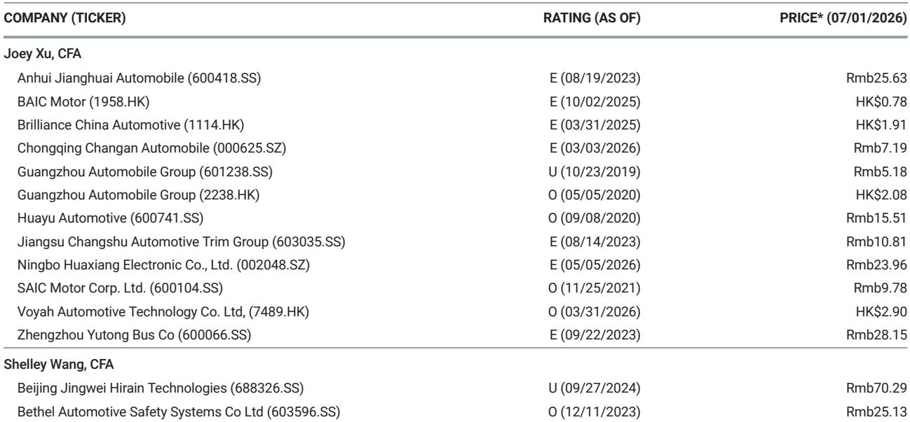

# 摩根斯坦利：中国汽车出海不是备选，是主战场

6月交付数据公布后，市场注意力再次被拉回中国汽车行业的两个平行叙事：国内价格战仍在持续，但海外市场正在重塑竞争格局。摩根斯坦利最新发布的6月中国汽车交付报告，揭示了一个被多数投资者低估的结构性变化——海外销售已从“补充”转变为部分龙头的核心增长引擎。

这份报告的核心判断是：在比亚迪和吉利身上，海外销量的占比正在以超出预期的速度提升，而这一趋势正在改写我们对这两家公司估值框架的理解。比亚迪6月海外销量同比飙升95%至17.5万辆，吉利海外交付占比首次突破40%。这不是季节性波动，而是供给能力与渠道布局共振的结果。

更值得关注的是，这一变化发生在国内需求尚未显著回暖的背景下。1H26比亚迪国内销量同比下滑16%，但整体交付仅下降3%，海外几乎单枪匹马填补了国内缺口。对于投资者而言，问题不再是“出海是否重要”，而是“哪些公司的出海能力被低估了”。

---

## 1. 比亚迪的海外销量正在逼近国内，国内下滑不再可怕

比亚迪6月交付40.3万辆，环比增长5%，同比增长5%。单看国内，这个数字并不出彩——1H26国内销量同比下滑16%。但海外部分完全改变了叙事：6月海外销量17.5万辆，同比暴增95%，1H26海外累计销量已达年度目标150万辆的53%。

这意味着，如果海外增速维持，比亚迪全年海外销量可能显著超出管理层预期。而国内方面，6月国内销量环比5月已从负转平，大唐、大汉、海豹08等新车型的上市有望进一步稳定国内基本盘。

> **KC评论：** 市场此前对比亚迪的担忧集中在国内份额见顶和价格战侵蚀利润。但海外销量占比已从2025年的约20%快速攀升至2026年6月的43%。如果这一趋势持续，比亚迪的估值锚点应从“国内车企”切换到“全球化车企”。完整报告中对比亚迪海外产能布局和渠道覆盖的拆解，是理解这一切换能否持续的关键。

---

## 2. 吉利海外占比首破40%，但国内去库存是短期隐忧

吉利6月交付24万辆，环比增长1%，同比增长2%。表面看增速平淡，但结构变化值得深究：海外交付10.2万辆，占总交付43%，这是吉利海外占比首次突破40%。与之对照，国内交付环比下滑，原因在于经销商库存消化。

领克品牌6月交付同比下降28%，而极氪销量同比翻倍以上。这种品牌间的分化，说明吉利的多品牌战略尚未形成合力。领克的新车型和改款计划——包括多款改款和新车型的密集投放——是支撑下半年国内销量复苏的关键。

> **KC评论：** 吉利海外占比的快速提升，部分得益于极氪品牌在海外市场的放量。但投资者需要追问的是：海外高增长能否持续？极氪的海外定价策略是否可持续？这些问题的答案，在报告中对吉利海外分区域销量和定价策略的详细拆解中有更清晰的呈现。

---

## 3. 新势力分化加剧，理想失速，小鹏稳守，蔚来勉强达标

6月交付数据进一步印证了新势力阵营的分化：

- 小鹏交付40,126辆，环比增长25%，同比增长16%，2Q26交付10.3万辆，落在指引区间中值。GX的产能爬坡是7月维持销量的关键变量，而Mona L03的上市将决定下半年能否继续上台阶。
- 理想交付30,895辆，环比下降7%，同比下降15%，2Q26交付9.8万辆，处于指引区间95-100k的下沿。L8的上市和L6改款是2H26环比改善的期待所在，但订单在发布前已出现放缓迹象。
- 蔚来交付40,597辆，环比增长8%，同比增长63%，2Q26交付10.7万辆，略低于110-115k的指引区间。ONVO品牌在L80上市后反而环比下降2%，蔚来品牌则在ES9上市后环比增长9%。

> **KC评论：** 理想的失速最值得警惕。2Q26同比下滑11%，是主要新势力中唯一负增长的公司。L6改款能否扭转颓势，是市场关注的焦点。但报告也指出，理想在9系列（GX、L9、ES9）发布后的销售可持续性，是观察下半年竞争格局的核心变量。完整报告中对各品牌订单转化率的跟踪，是判断这一问题的关键数据。

---

## 4. 9系列之战：谁能把流量变成销量？

6月最值得关注的竞争焦点是9系列车型的集中上市——包括理想的L9、小鹏的GX和蔚来的ES9。这三款车型分别代表各自品牌在高端市场的战略重心，但它们的销售可持续性尚未被验证。

摩根斯坦利在报告中明确提出了“all eyes are on sales sustainability of 9-series”的判断。这意味着，短期交付数据不能说明问题，关键是上市后3-6个月的订单转化率和用户留存。如果9系列能够持续放量，将显著改善各自品牌的毛利率和单车经济；如果只是短期脉冲，则可能加剧价格战。

这一判断背后，是一个尚未被充分讨论的问题：当所有品牌都在推9系列时，高端市场的需求能否支撑如此多的供给？完整报告中对中国高端新能源SUV市场的容量测算和竞品对比，是回答这一问题的唯一依据。

---

## 5. 报告没有完全回答的关键问题：海外利润能否对冲国内价格战

摩根斯坦利这份报告的核心贡献在于提供了详尽的交付数据和结构拆解，但有一个关键问题它没有完全展开：海外销量的利润贡献能否真正对冲国内价格战的侵蚀？

目前，比亚迪和吉利的海外定价普遍高于国内，但海外渠道成本、关税和物流费用也更高。更重要的是，海外市场的竞争格局正在快速变化——欧洲对中国电动车的反补贴调查仍在进行，东南亚市场的新进入者也在增加。

> **KC评论：** 这是投资者最需要深度研究的问题。如果海外利润率显著高于国内，那么海外占比的提升将直接推动盈利上修；如果海外利润被成本吃掉，那么销量的增长只是“叫好不叫座”。完整报告对比亚迪和吉利海外单车利润的测算，是回答这一问题的核心数据。

---

## 6. 投资者的观察框架：从“交付量”切换到“海外利润贡献”

基于以上分析，我们认为投资者在审视中国汽车股时，应建立以下观察框架：

第一，关注海外销量占比的边际变化，而非绝对交付量。当海外占比突破30%后，每提升1个百分点对企业利润的影响，远大于国内市场的同比例变化。

第二，区分“海外销量”和“海外利润”。部分公司可能在海外以低价冲量，这种策略对品牌和利润的长期伤害不容忽视。需要跟踪海外单车均价和毛利率的变化。

第三，关注9系列车型的订单转化率。这是判断高端市场竞争格局的核心指标，也是影响各品牌下半年盈利预期的关键变量。

第四，警惕国内库存周期的变化。吉利国内交付环比下滑，说明经销商库存压力正在上升。如果更多品牌出现类似情况，可能意味着新一轮价格战的起点。

---

这些观察框架的背后，是更多未被回答的问题：比亚迪的海外产能何时能完全释放？吉利的极氪品牌在海外能否复制国内的成功？理想的L6改款能否扭转下滑趋势？这些问题，在摩根斯坦利的完整报告中有更详细的数据支撑和情景分析。

我们每日更新国际主流信源的汇编与评论，汇总关键数据与图表，帮助投资者观测边际变化。社群中汇聚了头部券商、PE/VC、投行、并购、对冲基金、资管机构、战略咨询和智库的朋友，期待与你交流。

Personal reading notes and learning share only. Not investment advice.

