# Key Investor Questions

Debates on Powering AI and Energy Security, as well as globalisation of natural gas and fuel shortages, have become nuanced. We flag 12 stocks that got most interest among the 70 plays we've highlighted globally as energy meets computing.

## Key Takeaways

US investors are more focused on the Energy Security theme in Asia than their Asian peers.

Powering AI, fossil-based power generation, and energy storage batteries are being looked at with more bottom-up ideas in focus.

Over the last two weeks, we had 50+ discussions with investors across Asia and the US on our Energy Security & Powering AI Blupepaper. We got notable pushback on our estimated size of investments for Asia. Investors find it low at US\$5.5 trillion – they see upside to our power grid, power generation, and energy storage estimates.

## What's consensus and got most investor mindshare:

1. Positive view on shipyards, clean tankers, gas pipelines, and energy storage batteries/fuel; downstream energy (fuel refiners) over pure upstream players got limited pushback.

2. Diversification in portfolio exposure from power equipment supply chain (transformers and turbine manufacturers) to power generation for playing the next leg of Powering AI;

3. Greater need for battery storage and fuel storage infrastructure in Asia.

## Key debates and areas of pushback include:

1. Coal or renewables; is coal back as part of the energy security theme?

2. Does more power for Al mean more natural gas or more energy storage?

3. Will US natural gas adoption slow in Asia vs. expectations before the Middle East conflict as coal comes back? What gas economics tip the scale?

4. Beyond the conflict, as oil and natural gas supply picks up, will naphtha-based chemicals finally outperform after three years?

5. Fuel refining and tankers and shipyards – aren't they becoming bigger bottlenecks than even power?

## Stocks of most interest in Asia:

• Fuel refiners (Thai Oil, HPCL, S-Oil);

• Coal equipment (Komatsu, Sany);

• Power generators and grids (Gulf Development, Adani Power, Tenaga);

\- Equipment (Doosan Enerbility, diesel power generator manufacturers);

• Energy storage (CATL).

Mayank Maheshwari  
Equity Analyst  
Mayank.Maheshwari@morganstanley.com +65 6834-6719

Ryan M Heng  
Equity Analyst  
Ryan.Heng@morganstanley.com +65 6834-6465

Vivek Rajamani  
Equity Analyst  
Vivek.Rajamani@morganstanley.com +65 6834-6740

MS INDIA COMPANY PRIVATE LIMITED+

Pranitha Shetty  
Research Associate  
Pranitha.Shetty@morganstanley.com +91 22 6118-3022

Hinal Choudhary
Research Associate
Hinal.Choudhary@morganstanley.com +91 22 6118-2044

Asia Pacific Industry View In-Line

MS does and seeks to do business with companies covered in MS. As a result, investors should be aware that the firm may have a conflict of interest that could affect the objectivity of MS. Investors should consider MS as only a single factor in making their investment decision.

For analyst certification and other important disclosures, refer to the Disclosure Section, located at the end of this report.

+= Analysts employed by non-U.S. affiliates are not registered with FINRA, may not be associated persons of the member and may not be subject to FINRA restrictions on communications with a subject company, public appearances and trading securities held by a research analyst account.

## The US\$5.5 Trillion Investment Super-Cycle

Exhibit 1: Asia's Energy Security – US\$5+trn of investments required

  
Source: MS estimates; not drawn to scale

## Ideas to Play

Buy dependable energy security beneficiaries as AI pushes Asia into a US\$5.5trn capex cycle: We recommend owning energy security assets – the theme is inextricably tied to AI. We highlight 70 global equities across the coal equipment supply chain, fuel refiners, petrochemical producers, and natural gas exporters that we expect to benefit the most globally. Areas where we think earnings and dividends could surprise the most in Asia are:

\- Fossil- and nuclear-based power generators;

\- The energy storage supply chain, including power grids; and

\- Fuel refiners and shipyards

We expect tightness in refining markets after the export restrictions in Asia get lifted (India, China, Thailand): We believe this will come in conjunction with higher crude availability from the Strait of Hormuz. Hence, margins for fuel products may decline from the current highs. However, crude discounts cushion the decline and refiners in Asia could actually report stronger-than-expected 3Q earnings (YoY).

The interplay of lower gasoline inventories in the West and higher need for naphtha in the East could also add to strength in refining and chemical markets (vs. what forward curves suggest). While inventory-related losses will lead to a challenged June quarter for refiners, underlying profitability would actually be much stronger than in 2025. We see an 2027 earnings upgrade cycle picking up after 2Q26 reporting season.

Energy storage batteries and LNG: Gauging the need for LNG in Asia is now getting a lot more nuanced – modeling battery storage and its impact, along with coal restarts in power systems, which we see as tipping the need for LNG imports in Asia to be 10-15mntpa lower in the coming five years than we had previously expected. However, this also puts the clearing price (ASP) for Asian consumers to import natural gas much lower – as competition from coal and batteries (after installation) becomes much lower in operating costs and closer to \$7-8/mmbtu LNG.

Exhibit 2: Comparing Power Generation Costs for Round the Clock  
Round the Clock Power Generation Economics (UScents/kwh)  
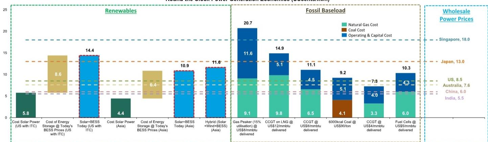  
Source: Company Data, MS Estimates

## How much will Asia need to invest in storage? We estimate >US\$70bn: Energy,

product, and feedstock storage – while arguably the most critical element of energy security infrastructure in the coming years – is also among the least capex-intensive relative to other forms of capacity build-out. IEA countries target 90 days of import cover for fuel and crude. Applying this as a guiding principle for Asia, we estimate \~1.4bn bbls of incremental oil and petroleum fuel storage needs, alongside increased LNG and fertilizer coverage, implying >US\$70bn of required investment across Asia

Exhibit 3: Energy Security and AI: Ways to Play  
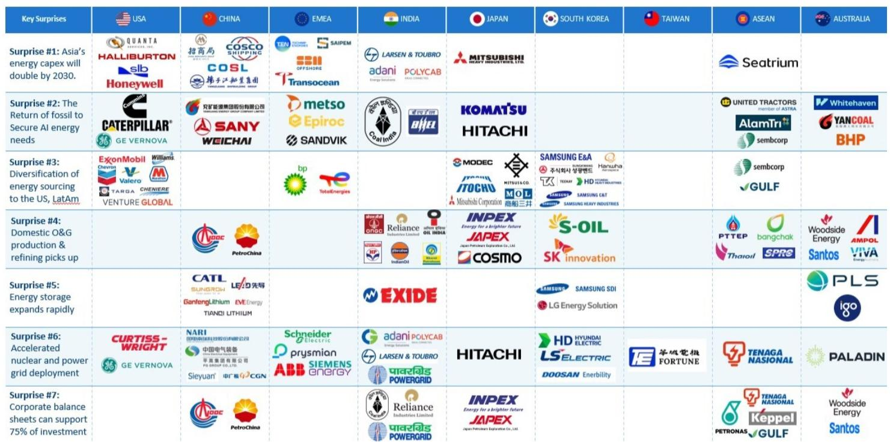  
Source: MS

## Energy Security: What Asia Is Doing

What Asia is doing to secure energy supply systems and where the largest bottlenecks exist in securing supply chains: Asia's energy capex will nearly double through the end of the decade. By 2030, over US\$1.2 trillion in new investments will be needed to reduce Asia's import dependence by 100bps based on expected consumption growth. This is in addition to US\$4.3trn of investments currently in progress and implies annual capital deployment growth of 11% through 2030 vs. 2% in the past decade.

Exhibit 4: Asia's Energy Security Implementation vs. Urgency Matrix  
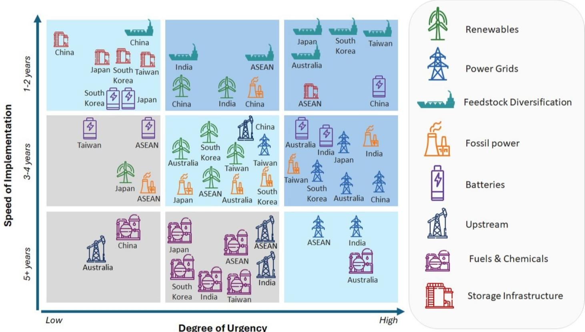  
Source: MS estimates; not drawn to scale

Energy supply chains will realign as countries avoid the current chokepoints: Energy supply chain realignment is shifting from "just-in-time" cost efficiency to "just-in-case" resilience, driven by geopolitical tensions, trade tariffs (e.g., US tariffs, FEOC restrictions), and the need to decouple from dominant suppliers like the Middle East. This restructuring prioritizes friend-shoring, regionalization, and closer to home.

We believe Asia will import a lot more natural gas from the US and Russia incrementally, considering it is essential for power and transport systems, while also importing more oil from LatAm, Canada and Africa.

Fuel systems in Asia are also likely to realign as exports were curbed for the first time by China and Thailand. We have already seen signs of this change with the Australia-Singapore energy cooperation. We expect other economies – such as Japan, Taiwan, and Korea – to look again at fuel sourcing options.

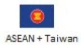

Coal, which is ample in Indonesia, India and China, will also be key for 'just in case' resilience for power systems.

Power grid connectivity in Southeast Asia between countries, such as India-Bangladesh, will get more traction after two decades of limited progress.

Exhibit 5: Energy Security and Powering AI: A Supercycle Recharges – A Snapshot by 2030

## Energy Security & AI: A Supercycle Recharges

  
US\$9trn in Enterprise Value creation

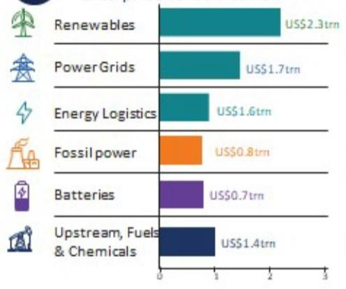

  
... from US\$5+trn of investments

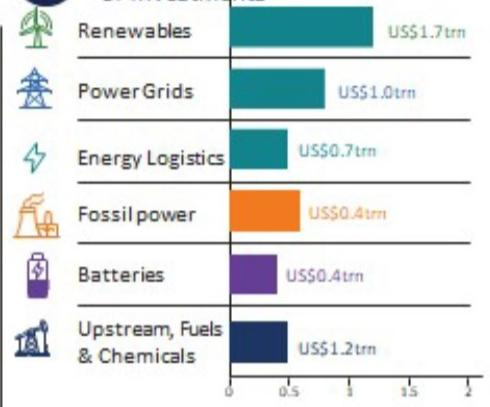

  
Reducing Asia's Incremental Energy Dependency from 36% to 29%

## Total Energy Investments by Economy

  
US\$3,089bn

  
US\$552bn

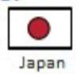  
US\$116bn

  
South Korea  
US\$128bn

  
Australia  
US\$242bn  
ASEAN + Taiwan  
US\$697bn

## Benefiting these subsectors

  
Equipment Suppliers (Coal Mining, Power Generation Equipment, Grid Equipment, Refining Equipment)

  
Oil Services & logistics (Rig operators, offshore energy, tankers)

  
Power
(Thermal power generators, Grid Operators)

  
Downstream  
energy (refiners, chemicals, fertilizers)

  
Infrastructure Operators (LNG terminals, Gas pipeline Operators)  
Source: MS estimates

# Coal or Renewables – Which Is Key for Security?

Rather than viewing coal, gas, nuclear, and renewables as competitors, policymakers increasingly are adopting a balanced and pragmatic multi-track approach: Diversified installed capacity will form a natural hedge against volatility in geopolitics, commodity prices, and supply chains.

In both China and India, coal retains strong policy support, with clean energy framed not as a replacement but as a supplement – reinforcing a multi-track energy strategy that postpones difficult decisions on coal phaseout as power demand continues to grow. China's coal power generation is higher than ever at \~5.5trn kWh in 2025, even as the country installed more than 500GW of solar and wind power in the same year.

Many Asian countries – particularly import-dependent and fossil-fuel-intensive ones – still need to invest in a more balanced generation mix: Expanding homegrown renewable energy capacity – along with supporting grid upgrades, storage, and even selective use of cleaner gas or nuclear power – is widely seen as vital to further fortify Asia's power systems against fuel shocks.

However, it is not enough. Renewables' intermittency and reliability remain a key risk in providing holistic energy security. A significant proportion of renewable generation would lead policymakers to trade fossil fuel accessibility risk with geographical and environmental resource risks (sunlight, wind, reservoir water levels). We see coal and gas power generation remaining highly relevant for the rest of the decade as access to reliable power remains key for policyholders.

Exhibit 6: Asia's power generation mix  
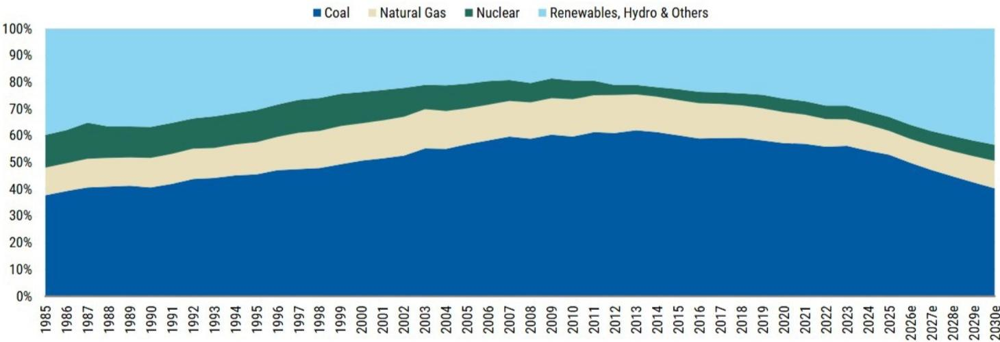  
Source: Statistical Review of World Energy, MS estimates

More Power for AI

Is this the end game? Powering AI for US hyperscalers in Asia while securing energy supply chains in Asia using US energy: Securing energy supply for AI has emerged as a durable, system-level investment theme across the power and fuel value chains, distinct from decarbonization targets or short-term price signals. Recent LNG disruptions and extreme price volatility have shifted policymaker and corporate behavior toward reliability, dispatchability, and domestic or regional resilience over pure economic optimization. We think this will drive a new sustained capex cycle across grid infrastructure, battery storage, strategic reserves, utilities, and selective generation technologies. Overall electricity will account for \~30% of Asia's energy needs, up from \~25% currently, as the region electrifies.

Artificial intelligence and the associated proliferation of data centers represent the most significant new source of electricity demand growth in developed economies in decades: Data centers currently account for \~2% of global power consumption and we forecast they will add 1.2 trillion units (20% of total incremental power demand) to global power consumption, accounting for 5% of power demand by 2030. While there will be varied adoption rates globally, about 45% of these units will be consumed in Asia and 45% in the US, with Europe largely accounting for the rest.

\- We see a 25% CAGR in power consumption from data centers in 2024-27 and a 20% CAGR in 2027-30.

\- We expect data centers to account for 75% of US power demand growth through 2030, while in Europe they will account for 40% and in Asia 13%

Exhibit 7: Potential shortfall in power for US data centers  
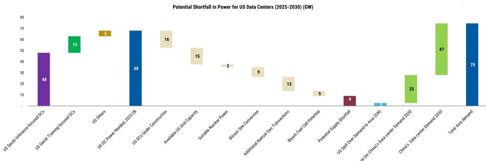  
Source: MS Estimates

Japan South Korea Thailand Singapore Malaysia Other

## US Natural Gas Needs in Asia – Slow vs. Expectations?

How large a part the US plays in the story of Asia's diversification in energy; Asia imported only \~10% of its energy imports from the US in 2025. We see the US's share in Asia's energy imports rising as cheaper natural gas, ethane, propane, coal and petcoke support adoption and diversification in power and chemical supply chains. Increased diesel imports will help lower dependence on the Strait of Hormuz.

We forecast a 6% CAGR in global LNG demand over 2025-30, driven by Asia: For Asian consumers, US LNG offers attractive supply diversification and pricing relative to other sources – offering greater stability during periods of supply disruption. We expect the bulk of volumes from export projects currently under construction to flow to end markets in Asia. In addition, in view of recent events in the Middle East, we see the potential for additional long-term gas sales deals from Asian buyers. However the pricing of this gas is going to be near coal parity as Asia restarts \~50GW of its coal fired power plants and also deployed energy storage capacity.

Growing refined product demand from Asia tightens global balances and supports margins: Growing refined product demand across Asia is constructive for US refiners, particularly those with Gulf Coast exposure and access to export markets. As Asia consumption outpaces regional refining capacity additions – driven by sustained transportation growth and petrochemical feedstock demand – incremental barrels will need to be sourced from the global market. As shown by the recent Middle East conflict, the US Gulf Coast is well equipped to be the world's swing refining center, filling gaps left by declining product volumes from key Asian and Middle Eastern exporters.

Exhibit 8: Since the start of the Middle East conflict, shipments to Asia have made up a higher share of total US LNG exports – rising from \~15% prior to \~35% in May so far.  
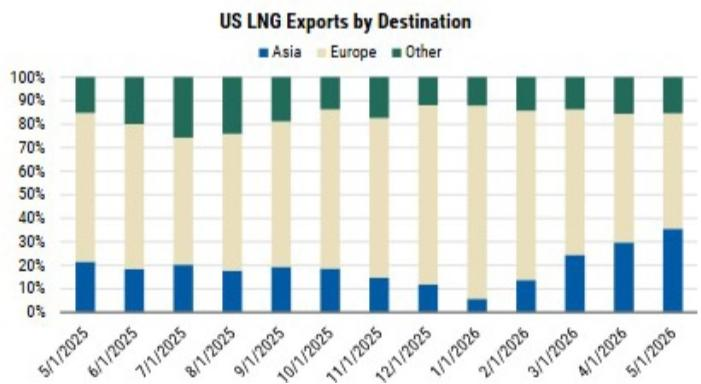  
Source: Vortexa, MS

Exhibit 9: The US exports \~3,240 kbpd of refined product, of which \~10% lands in Asia. The Iran conflict has pushed exports to >4 mbpd  
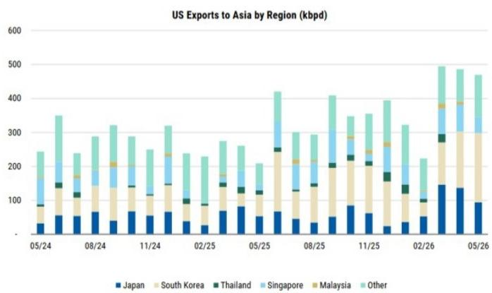  
Source: Vortexa, MS

## Disclosure Section

The information and opinions in MS were prepared or are disseminated by MS Asia Limited (which accepts the responsibility for its contents) and/or MS Asia (Singapore) Pte. (Registration number 199206298Z) and/or MS Asia (Singapore) Securities Pte Ltd (Registration number 200008434H), regulated by the Monetary Authority of Singapore (which accepts legal responsibility for its contents and should be contacted with respect to any matters arising from, or in connection with, MS), and/or MS Taiwan Limited and/or MS & Co International plc, Seoul Branch, and/or MS Australia Limited (A.B.N. 67 003 734 576, holder of Australian financial services license No. 233742, which accepts responsibility for its contents), and/or MS Wealth Management Australia Pty Ltd (A.B.N. 19 009 145 555, holder of Australian financial services license No. 240813, which accepts responsibility for its contents), and/or MS India Company Private Limited having Corporate Identification No (CIN) U22990MH1998PTC115305, regulated by the Securities and Exchange Board of India ("SEBI") and holder of licenses as a Research Analyst (SEBI Registration No. INH000001105); Stock Broker (SEBI Stock Broker Registration No. INZ000244438), Merchant Banker (SEBI Registration No. INM000011203), and depository participant with National Securities Depository Limited (SEBI Registration No. IN-DP-NSDL-567-2021) having registered office at Altimus, Level 39 & 40, Pandurang Budhkar Marg, Worli, Mumbai 400018, India; Telephone no. +91-22-61181000; Compliance Officer Details: Mr. Tejarshi Hardas, Tel. No.: +91-22-61181000 or Email: tejarshi.hardas@morganstanley.com; Grievance officer details: Mr. Tejarshi Hardas, Tel. No.: +91-22-61181000 or Email: msic-compliance@morganstanley.com which accepts the responsibility for its contents and should be contacted with respect to any matters arising from, or in connection with, MS, and their affiliates (collectively, "MS"). MS India Company Private Limited (MSICPL) may use AI tools in providing research services. All recommendations contained herein are made by the duly qualified research analysts.

For important disclosures, stock price charts and equity rating histories regarding companies that are the subject of this report, please see the MS Disclosure Website at www.morganstanley.com/eqr/disclosures/webapp/generalresearch, or contact your investment representative or MS at 1585 Broadway, (Attention: Research Management), New York, NY, 10036 USA.

For valuation methodology and risks associated with any recommendation, rating or price target referenced in this research report, please contact the Client Support Team as follows: US/Canada +1 800 303-2495; Hong Kong +852 2848-5999; Latin America +1 718 754-5444 (U.S.); London +44 (0)20-7425-8169; Singapore +65 6834-6860; Sydney +61 (0)2-9770-1505; Tokyo +81 (0)3-6836-9000. Alternatively you may contact your investment representative or MS at 1585 Broadway, (Attention: Research Management), New York, NY 10036 USA.

## Analyst Certification

The following analysts hereby certify that their views about the companies and their securities discussed in this report are accurately expressed and that they have not received and will not receive direct or indirect compensation in exchange for expressing specific recommendations or views in this report: Ryan M Heng; Mayank Maheshwari; Vivek Rajamani.

## Global Research Conflict Management Policy

MS has been published in accordance with our conflict management policy, which is available at www.morganstanley.com/institutional/research/conflictpolicies. A Portuguese version of the policy can be found at www.morganstanley.com.br

## Important Regulatory Disclosures on Subject Companies

As of May 29, 2026, MS beneficially owned 1% or more of a class of common equity securities of the following companies covered in MS: Contemporary Amperex Technology Co. Ltd., Sany Heavy Industry Co., Ltd..

Within the last 12 months, MS managed or co-managed a public offering (or 144A offering) of securities of Contemporary Amperex Technology Co. Ltd., Komatsu, Maynilad Water Services, Inc..

Within the last 12 months, MS has received compensation for investment banking services from Contemporary Amperex Technology Co. Ltd., Komatsu, Maynilad Water Services, Inc., Thai Oil Public Company.

In the next 3 months, MS expects to receive or intends to seek compensation for investment banking services from Contemporary Amperex Technology Co. Ltd., Doosan Enerbility, Global Power Synergy PCL, Gulf Development PCL, International Container Terminal Service, Keppel Ltd, Komatsu, Manila Electric Company, Maynilad Water Services, Inc., Sany Heavy Industry Co., Ltd., SembCorp Industries Ltd, Tenaga Nasional, Thai Oil Public Company.

Within the last 12 months, MS has received compensation for products and services other than investment banking services from Hindustan Petroleum, Keppel Ltd, S-Oil, SembCorp Industries Ltd, Thai Oil Public Company.

Within the last 12 months, MS has provided or is providing investment banking services to, or has an investment banking client relationship with, the following company: Contemporary Amperex Technology Co. Ltd., Doosan Enerbility, Global Power Synergy PCL, Gulf Development PCL, International Container Terminal Service, Keppel Ltd, Komatsu, Manila Electric Company, Maynilad Water Services, Inc., Sany Heavy Industry Co., Ltd., SembCorp Industries Ltd, Tenaga Nasional, Thai Oil Public Company.

Within the last 12 months, MS has either provided or is providing non-investment banking, securities-related services to and/or in the past has entered into an agreement to provide services or has a client relationship with the following company: Doosan Enerbility, Hindustan Petroleum, Keppel Ltd, S-Oil, SembCorp Industries Ltd, Thai Oil Public Company.

The equity research analysts or strategists principally responsible for the preparation of MS have received compensation based upon various factors, including quality of research, investor client feedback, stock picking, competitive factors, firm revenues and overall investment banking revenues. Equity Research analysts' or strategists' compensation is not linked to investment banking or capital markets transactions performed by MS or the profitability or revenues of particular trading desks.

MS and its affiliates do business that relates to companies/instruments covered in MS, including market making, providing liquidity, fund management, commercial banking, extension of credit, investment services and investment banking. MS sells to and buys from customers the securities/instruments of companies covered in MS on a principal basis. MS may have a position in the debt of the Company or instruments discussed in this report. MS trades or may trade as principal in the debt securities (or in related derivatives) that are the subject of the debt research report.

Certain disclosures listed above are also for compliance with applicable regulations in non-US jurisdictions.

## STOCK RATINGS

MS uses a relative rating system using terms such as Overweight, Equal-weight, Not-Rated or Underweight (see definitions below). MS does not assign ratings of Buy, Hold or Sell to the stocks we cover. Overweight, Equal-weight, Not-Rated and Underweight are not the equivalent of buy, hold and sell. Investors should carefully read the definitions of all ratings used in MS. In addition, since MS contains more complete information concerning the analyst's views, investors should carefully read MS, in its entirety, and not infer the contents from the rating alone. In any case, ratings (or research) should not be used or relied upon as investment advice. An investor's decision to buy or sell a stock should depend on individual circumstances (such as the investor's existing holdings) and other considerations.

## Global Stock Ratings Distribution

(as of June 30, 2026)

The Stock Ratings described below apply to MS's Fundamental Equity Research and do not apply to Debt Research produced by the Firm.

For disclosure purposes only (in accordance with FINRA requirements), we include the category headings of Buy, Hold, and Sell alongside our ratings of Overweight, Equal-weight, Not-Rated and Underweight. MS does not assign ratings of Buy, Hold or Sell to the stocks we cover. Overweight, Equal-weight, Not-Rated and Underweight are not the equivalent of buy, hold, and sell but represent recommended relative weightings (see definitions below). To satisfy regulatory requirements, we correspond Overweight, our most positive stock rating, with a buy recommendation; we correspond Equal-weight and Not-Rated to hold and Underweight to sell recommendations, respectively.

<table><tr><td></td><td colspan="2">Coverage Universe</td><td colspan="3">Investment Banking Clients (IBC)</td><td colspan="2">Other Material Investment Services Clients (MISC)</td></tr><tr><td>Stock Rating Category</td><td>Count</td><td>% of Total</td><td>Count</td><td>% of Total IBC</td><td>% of Rating Category</td><td>Count</td><td>% of Total Other MISC</td></tr><tr><td>Overweight/Buy</td><td>1544</td><td>42%</td><td>453</td><td>49%</td><td>29%</td><td>757</td><td>44%</td></tr><tr><td>Equal-weight/Hold</td><td>1577</td><td>43%</td><td>390</td><td>42%</td><td>25%</td><td>769</td><td>44%</td></tr><tr><td>Not-Rated/Hold</td><td>3</td><td>0%</td><td>1</td><td>0%</td><td>33%</td><td>1</td><td>0%</td></tr><tr><td>Underweight/Sell</td><td>544</td><td>15%</td><td>89</td><td>10%</td><td>16%</td><td>204</td><td>12%</td></tr><tr><td>Total</td><td>3,668</td><td></td><td>933</td><td></td><td></td><td>1731</td><td></td></tr></table>

Data include common stock and ADRs currently assigned ratings. Investment Banking Clients are companies from whom MS received investment banking compensation in the last 12 months. Due to rounding off of decimals, the percentages provided in the "% of total" column may not add up to exactly 100 percent.

## Analyst Stock Ratings

Overweight (O). The stock's total return is expected to exceed the average total return of the analyst's industry (or industry team's) coverage universe, on a risk-adjusted basis, over the next 12-18 months.

Equal-weight (E). The stock's total return is expected to be in line with the average total return of the analyst's industry (or industry team's) coverage universe, on a risk-adjusted basis, over the next 12-18 months.

Not-Rated (NR). Currently the analyst does not have adequate conviction about the stock's total return relative to the average total return of the analyst's industry (or industry team's) coverage universe, on a risk-adjusted basis, over the next 12-18 months.

Underweight (U). The stock's total return is expected to be below the average total return of the analyst's industry (or industry team's) coverage universe, on a risk-adjusted basis, over the next 12-18 months.

Unless otherwise specified, the time frame for price targets included in MS is 12 to 18 months.

## Analyst Industry Views

Attractive (A): The analyst expects the performance of his or her industry coverage universe over the next 12-18 months to be attractive vs. the relevant broad market benchmark, as indicated below.

In-Line (I): The analyst expects the performance of his or her industry coverage universe over the next 12-18 months to be in line with the relevant broad market benchmark, as indicated below. Cautious (C): The analyst views the performance of his or her industry coverage universe over the next 12-18 months with caution vs. the relevant broad market benchmark, as indicated below. Benchmarks for each region are as follows: North America - S&P 500; Latin America - relevant MSCI country index or MSCI Latin America Index; Europe - MSCI Europe; Japan - TOPIX; Asia - relevant MSCI country index or MSCI sub-regional index or MSCI AC Asia Pacific ex Japan Index.

## Stock Price, Price Target and Rating History (See Rating Definitions)

Doosan Enerbility (034020.KS) - As of 07/01/26 GMT in KRW Industry : S. Korea Industrials  
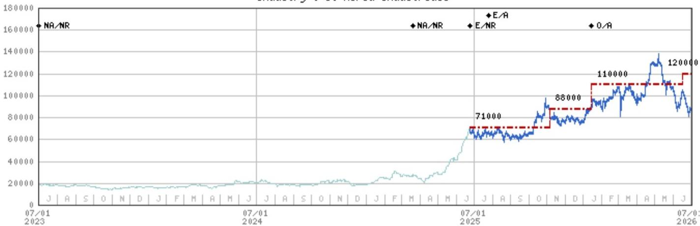  
Stock Rating History: 7/1/21 : NA/NR; 3/20/25 : NA/NR; 6/24/25 : E/NR; 7/25/25 : E/A; 1/14/26 : O/A  
Price Target History: 12/11/20 : NA; 6/24/25 : 71000; 11/6/25 : 88000; 1/14/26 : 110000; 6/17/26 : 120000  
Source: MS Date Format : MM/DD/YY Price Target No Price Target Assigned (NA)  
Stock Price (Not Covered by Current Analyst) — Stock Price (Covered by Current Analyst)  
Stock and Industry Ratings (abbreviations below) appear as ♦ Stock Rating/Industry View  
Stock Ratings: Overweight (O) Equal-weight (E) Underweight (U) Not-Rated (NR) No Rating Available (NA)  
Industry View: Attractive (A) In-line (I) Cautious (C) No Rating (NR)  
Effective January 13, 2014, the stocks covered by MS Asia Pacific will be rated relative to the analyst's industry (or industry team's) coverage.  
Effective January 13, 2014, the industry view benchmarks for MS Asia Pacific are as follows: relevant MSCI country index or MSCI sub-regional index or MSCI AC Asia Pacific ex Japan Index.

S-Oil (010950.KS) - As of 07/01/26 GMT in KRW Industry : S. Korea Energy & Materials  
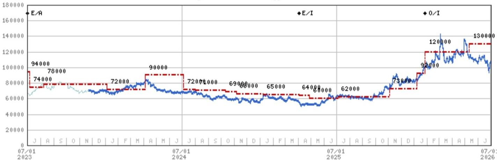

Stock Rating History: 7/1/21 : 0/A; 4/6/23 : E/A; 4/3/25 : E/I; 1/26/26 : 0/I

Price Target History: 6/24/21 : 130000; 10/6/21 : 140000; 12/10/21 : 130000; 1/27/22 : 120000; 4/4/22 : 130000; 5/19/22 : 140000; 7/6/22 : 130000; 10/27/22 : 120000; 1/3/23 : 110000; 4/6/23 : 94000; 7/6/23 : 74000; 8/8/23 : 78000; 1/5/24 : 72000; 4/5/24 : 90000; 7/4/24 : 72000; 8/1/24 : 71000; 10/11/24 : 69000; 11/6/24 : 66000; 1/8/25 : 65000; 4/3/25 : 64000; 4/28/25 : 60000; 7/4/25 : 62000; 11/3/25 : 73000; 1/8/26 : 92000; 1/26/26 : 120000; 5/11/26 : 130000

Source: MS Date Format : MM/DD/YY Price Target = No Price Target Assigned (NA)

Stock Price (Not Covered by Current Analyst) — Stock Price (Covered by Current Analyst)

Stock and Industry Ratings (abbreviations below) appear as ♦ Stock Rating/Industry View

Stock Ratings: Overweight (O) Equal-weight (E) Underweight (U) Not-Rated (NR) No Rating Available (NA)

Industry View: Attractive (A) In-line (I) Cautious (C) No Rating (NR)

Effective January 13, 2014, the stocks covered by MS Asia Pacific will be rated relative to the analyst's industry (or industry team's) coverage.

Effective January 13, 2014, the industry view benchmarks for MS Asia Pacific are as follows: relevant MSCI country index or MSCI sub-regional index or MSCI AC Asia Pacific ex Japan Index.

## Important Disclosures for MS Smith Barney LLC Customers

Important disclosures regarding any material conflict of interest that can reasonably be expected to have influenced MS Smith Barney LLC's choice of a third-party research provider or the subject company of a third-party research report, are available on the MS Wealth Management disclosure website at www.morganstanley.com/online/researchdisclosures. For MS specific disclosures, you may refer to https://www.morganstanley.com/eqr/disclosures/webapp/generalresearch.

Each MS report is reviewed and approved on behalf of MS Smith Barney LLC. This review and approval is conducted by the same person who reviews the research report on behalf of MS. This could create a conflict of interest.

## Other Important Disclosures

MS policy is to update research reports as and when the Research Analyst and Research Management deem appropriate, based on developments with the issuer, the sector, or the market that may have a material impact on the research views or opinions stated therein. In addition, certain Research publications are intended to be updated on a regular periodic basis (weekly/monthly/quarterly/annual) and will ordinarily be updated with that frequency, unless the Research Analyst and Research Management determine that a different publication schedule is appropriate based on current conditions.

MS is not acting as a municipal advisor and the opinions or views contained herein are not intended to be, and do not constitute, advice within the meaning of Section 975 of the Dodd-Frank Wall Street Reform and Consumer Protection Act.

MS produces an equity research product called a "Tactical Idea." Views contained in a "Tactical Idea" on a particular stock may be contrary to the recommendations or views expressed in research on the same stock. This may be the result of differing time horizons, methodologies, market events, or other factors. For all research available on a particular stock, please contact your sales representative or go to Matrix at http://www.morganstanley.com/matrix.

MS is provided to our clients through our proprietary research portal on Matrix and also distributed electronically by MS to clients. Certain, but not all, MS products are also made available to clients through third-party vendors or redistributed to clients through alternate electronic means as a convenience. For access to all available MS, please contact your sales representative or go to Matrix at http://www.morganstanley.com/matrix.

Any access and/or use of MS is subject to MS's Terms of Use (http://www.morganstanley.com/terms.html). By accessing and/or using MS, you are indicating that you have read and agree to be bound by our Terms of Use (http://www.morganstanley.com/terms.html). In addition you consent to MS processing your personal data and using cookies in accordance with our Privacy Policy and our Global Cookies Policy (http://www.morganstanley.com/privacy\_pledge.html), including for the purposes of setting your preferences and to collect readership data so that we can deliver better and more personalized service and products to you. To find out more information about how MS processes personal data, how we use cookies and how to reject cookies see our Privacy Policy and our Global Cookies Policy (http://www.morganstanley.com/privacy\_pledge.html). Please use the provided link to review the Terms and Conditions and Most Important Terms and Conditions for MS India Company Private Limited (https://www.morganstanley.com/assets/pdfs/about-us-global-offices/india/Terms\_and\_conditions.pdf) and the following link to review the audit report (https://ny.matrix.ms.com/eqr/research/webapp/researchdocs/MSICPL\_Morgan\_Stanley\_Research\_Audit\_Report.pdf).

If you do not agree to our Terms of Use and/or if you do not wish to provide your consent to MS processing your personal data or using cookies please do not access our research. MS does not provide individually tailored investment advice. MS has been prepared without regard to the circumstances and objectives of those who receive it. MS recommends that investors independently evaluate particular investments and strategies, and encourages investors to seek the advice of a financial adviser. The appropriateness of an investment or strategy will depend on an investor's circumstances and objectives. The securities, instruments, or strategies discussed in MS may not be suitable for all investors, and certain investors may not be eligible to purchase or participate in some or all of them. MS is not an offer to buy or sell or the solicitation of an offer to buy or sell any security/instrument or to participate in any particular trading strategy. The value of and income from your investments may vary because of changes in interest rates, foreign exchange rates, default rates, prepayment rates, securities/instruments prices, market indexes, operational or financial conditions of companies or other factors. There may be time limitations on the exercise of options or other rights in securities/instruments transactions. Past performance is not necessarily a guide to future performance. Estimates of future performance are based on assumptions that may not be realized. If provided, and unless otherwise stated, the closing price on the cover page is that of the primary exchange for the subject company's securities/instruments.

The fixed income research analysts, strategists or economists principally responsible for the preparation of MS have received compensation based upon various factors, including quality, accuracy and value of research, firm profitability or revenues (which include fixed income trading and capital markets profitability or revenues), client feedback and competitive factors. Fixed Income Research analysts', strategists' or economists' compensation is not linked to investment banking or capital markets transactions performed by MS or the profitability or revenues of particular trading desks.

The "Important Regulatory Disclosures on Subject Companies" section in MS lists all companies mentioned where MS owns 1% or more of a class of common equity securities of the companies. For all other companies mentioned in MS, MS may have an investment of less than 1% in securities/instruments or derivatives of securities/instruments of companies and may trade them in ways different from those discussed in MS. Employees of MS not involved in the preparation of MS may have investments in securities/instruments or derivatives of securities/instruments of companies mentioned and may trade them in ways different from those discussed in MS. Derivatives may be issued by MS or associated persons.

With the exception of information regarding MS, MS is based on public information. MS makes every effort to use reliable, comprehensive information, but we make no representation that it is accurate or complete. We have no obligation to tell you when opinions or information in MS change apart from when we intend to discontinue equity research coverage of a subject company. Facts and views presented in MS have not been reviewed by, and may not reflect information known to, professionals in other MS business areas, including investment banking personnel.

MS personnel may participate in company events such as site visits and are generally prohibited from accepting payment by the company of associated expenses unless pre-approved by authorized members of Research management.

MS may make investment decisions that are inconsistent with the recommendations or views in this report.

To our readers based in Taiwan or trading in Taiwan securities/instruments: Information on securities/instruments that trade in Taiwan is distributed by MS Taiwan Limited ("MSTL"). Such information is for your reference only. The reader should independently evaluate the investment risks and is solely responsible for their investment decisions. MS may not be distributed to the public media or quoted or used by the public media without the express written consent of MS. Any non-customer reader within the scope of Article 7-1 of the Taiwan Stock Exchange Recommendation Regulations accessing and/or receiving MS is not permitted to provide MS to any third party (including but not limited to related parties, affiliated companies and any other third parties) or engage in any activities regarding MS which may create or give the appearance of creating a conflict of interest. Information on securities/instruments that do not trade in Taiwan is for informational purposes only and is not to be construed as a recommendation or a solicitation to trade in such securities/instruments. MSTL may not execute transactions for clients in these securities/instruments.

Certain information in MS was sourced by employees of the Shanghai Representative Office of MS Asia Limited for the use of MS Asia Limited. MS is not incorporated under PRC law and the research in relation to this report is conducted outside the PRC. MS does not constitute an offer to sell or the solicitation of an offer to buy any securities in the PRC. PRC investors shall have the relevant qualifications to invest in such securities and shall be responsible for obtaining all relevant approvals, licenses, verifications and/or registrations from the relevant governmental authorities themselves. Neither this report nor any part of it is intended as, or shall constitute, provision of any consultancy or advisory service of securities investment as defined under PRC law. Such information is provided for your reference only.

MS is disseminated in Brazil by MS C.T.V.M. S.A. located at Av. Brigadeiro Faria Lima, 3600, 6th floor, São Paulo - SP, Brazil; and is regulated by the Comissão de Valores Mobiliários; in Mexico by MS México, Casa de Bolsa, S.A. de C.V which is regulated by Comision Nacional Bancaria y de Valores. Paseo de los Tamarindos 90, Torre 1, Col. Bosques de las Lomas Floor 29, 05120 Mexico City; in Japan by MS MUFG Securities Co., Ltd. and, for Commodities related research reports only, MS Capital Group Japan Co., Ltd; in Hong Kong by MS Asia Limited (which accepts responsibility for its contents) and by MS Bank Asia Limited; in Singapore by MS Asia (Singapore) Pte. (Registration number 199206298Z) and/or MS Asia (Singapore) Securities Pte Ltd (Registration number 200008434H), regulated by the Monetary Authority of Singapore (which accepts legal responsibility for its contents and should be contacted with respect to any matters arising from, or in connection with, MS) and by MS Bank Asia Limited, Singapore Branch (Registration number T14FC0118); in Australia to "wholesale clients" within the meaning of the Australian Corporations Act by MS Australia Limited A.B.N. 67 003 734 576, holder of Australian financial services license No. 233742, which accepts responsibility for its contents; in Australia to "wholesale clients" and "retail clients" within the meaning of the Australian Corporations Act by MS Wealth Management Australia Pty Ltd (A.B.N. 19 009 145 555, holder of Australian financial services license No. 240813, which accepts responsibility for its contents; in Korea by MS & Co International plc, Seoul Branch; in India by MS India Company Private Limited having Corporate Identification No (CIN) U22990MH1998PTC115305, regulated by the Securities and Exchange Board of India ("SEBI") and holder of licenses as a Research Analyst (SEBI Registration No. INH000001105); Stock Broker (SEBI Stock Broker Registration No. INZ000244438), Merchant Banker (SEBI Registration No. INM000011203), and depository participant with National Securities Depository Limited (SEBI Registration No. IN-DP-NSDL-567-2021) having registered office at Altimus, Level 39 & 40, Pandurang Budhkar Marg, Worli, Mumbai 400018, India; Telephone no. +91-22-61181000; Compliance Officer Details: Mr. Tejarshi Hardas, Tel. No.: +91-22-61181000 or Email: tejarshi.hardas@morganstanley.com; Grievance officer details: Mr. Tejarshi Hardas, Tel. No.: +91-22-61181000 or Email: msic-compliance@morganstanley.com. MS India Company Private Limited (MSICPL) may use AI tools in providing research services. All recommendations contained herein are made by the duly qualified research analysts; in Canada by MS Canada Limited; in Germany and the European Economic Area where required by MS Europe S.E., authorised and regulated by Bundesanstalt fuer Finanzdienstleistungsaufsicht (BaFin) under the reference number 149169; in the US by MS & Co. LLC, which accepts responsibility for its contents. MS & Co. International plc, authorized by the Prudential Regulation Authority and regulated by the Financial Conduct Authority and the Prudential Regulation Authority, disseminates in the UK research that it has prepared, and research which has been prepared by any of its affiliates, only to persons who (i) are investment professionals falling within Article 19(5) of the Financial Services and Markets Act 2000 (Financial Promotion) Order 2005 (as amended, the "Order"); (ii) are persons who are high net worth entities falling within Article 49(2)(a) to (d) of the Order; or (iii) are persons to whom an invitation or inducement to engage in investment activity (within the meaning of section 21 of the Financial Services and Markets Act 2000, as amended) may otherwise lawfully be communicated or caused to be communicated. RMB MS Proprietary Limited is a member of the JSE Limited and A2X (Pty) Ltd. RMB MS Proprietary Limited is a joint venture owned equally by MS International Holdings Inc. and RMB Investment Advisory (Proprietary) Limited, which is wholly owned by FirstRand Limited. The information in MS is being disseminated by MS Saudi Arabia, regulated by the Capital Market Authority in the Kingdom of Saudi Arabia, and is directed at Sophisticated investors only.

MS Hong Kong Securities Limited is the liquidity provider/market maker for securities of Contemporary Amperex Technology Co. Ltd. listed on the Stock Exchange of Hong Kong Limited. An updated list can be found on HKEx website: http://www.hkex.com.hk.

The information in MS is being communicated by MS & Co. International plc (DIFC Branch), regulated by the Dubai Financial Services Authority (the DFSA) or by MS & Co. International plc (ADGM Branch), regulated by the Financial Services Regulatory Authority Abu Dhabi (the FSRA), and is directed at Professional Clients only, as defined by the DFSA or the FSRA, respectively. The financial products or financial services to which this research relates will only be made available to a customer who we are satisfied meets the regulatory criteria of a Professional Client. A distribution of the different MS Research ratings or recommendations, in percentage terms for Investments in each sector covered, is available upon request from your sales representative.

The information in MS is being communicated by MS & Co. International plc (QFC Branch), regulated by the Qatar Financial Centre Regulatory Authority (the QFCRA), and is directed at business customers and market counterparties only and is not intended for Retail Customers as defined by the QFCRA.

As required by the Capital Markets Board of Turkey, investment information, comments and recommendations stated here, are not within the scope of investment advisory activity. Investment advisory service is provided exclusively to persons based on their risk and income preferences by the authorized firms. Comments and recommendations stated here are general in nature. These opinions may not fit to your financial status, risk and return preferences. For this reason, to make an investment decision by relying solely to this information stated here may not bring about outcomes that fit your expectations.

The trademarks and service marks contained in MS are the property of their respective owners. Third-party data providers make no warranties or representations relating to the accuracy, completeness, or timeliness of the data they provide and shall not have liability for any damages relating to such data. The Global Industry Classification Standard (GICS) was developed by and is the exclusive property of MSCI and S&P.

MS, or any portion thereof may not be reprinted, sold or redistributed without the written consent of MS.

Indicators and trackers referenced in MS may not be used as, or treated as, a benchmark under Regulation EU 2016/1011, or any other similar framework.

The issuers and/or fixed income products recommended or discussed in certain fixed income research reports may not be continuously followed. Accordingly, investors should regard those fixed income research reports as providing stand-alone analysis and should not expect continuing analysis or additional reports relating to such issuers and/or individual fixed income products. MS may hold, from time to time, material financial and commercial interests regarding the company subject to the Research report.

Registration granted by SEBI and certification from the National Institute of Securities Markets (NISM) in no way guarantee performance of the intermediary or provide any assurance of returns to investors. Investment in securities market are subject to market risks. Read all the related documents carefully before investing.

## INDUSTRY COVERAGE: ASEAN Utilities and Infrastructure

<table><tr><td>COMPANY (TICKER)</td><td>RATING (AS OF)</td><td>PRICE* (07/01/2026)</td></tr><tr><td>Global Power Synergy PCL (GPSC.BK)</td><td>U (09/12/2025)</td><td>Bt44.00</td></tr><tr><td>Gulf Development PCL (GULF.BK)</td><td>O (03/26/2025)</td><td>Bt61.50</td></tr><tr><td>Manila Electric Company (MER.PS)</td><td>O (06/20/2022)</td><td>PP585.00</td></tr><tr><td>Perusahaan Gas Negara (PGAS.JK)</td><td>E (06/18/2026)</td><td>Rp1,365</td></tr><tr><td>SembCorp Industries Ltd (SCIL.SI)</td><td>O (03/23/2026)</td><td>S$6.23</td></tr><tr><td>Tenaga Nasional (TENA.KL)</td><td>O (09/12/2023)</td><td>RM14.20</td></tr><tr><td colspan="3">Ryan M Heng</td></tr><tr><td>Airports of Thailand (AOT.BK)</td><td>O (08/25/2021)</td><td>Bt64.75</td></tr><tr><td>International Container Terminal Service (ICT.PS)</td><td>O (03/04/2024)</td><td>PP900.00</td></tr><tr><td>Maynilad Water Services, Inc. (MYNLD.PS)</td><td>E (06/30/2026)</td><td>PP19.60</td></tr></table>

Stock Ratings are subject to change. Please see latest research for each company.  
\* Historical prices are not split adjusted.

© 2026 MS