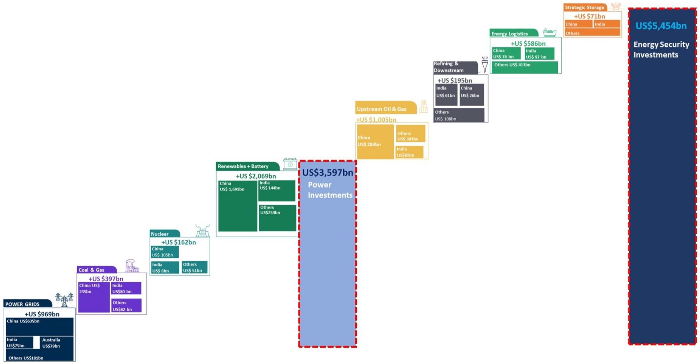

# Asia's $5.5 Trillion Energy-AI Supercycle Is Not a Forecast—It Is an Underestimate

The most important investment debate in Asia today is not whether artificial intelligence will reshape energy systems. That is settled. The real question is whether the capital deployment required to make that reshaping possible has been correctly sized. A growing number of institutional investors believe it has not. After more than fifty discussions with asset managers across Asia and the United States, the single most consistent pushback against the prevailing framework is that the estimated $5.5 trillion in required energy investments for Asia through 2030 is too low. This is not a marginal disagreement. It reflects a fundamental divergence in how investors interpret the scale, speed, and interdependence of the forces now converging.

The conventional framing treats Powering AI and Energy Security as two separate themes that occasionally overlap. That framing is obsolete. The two are now structurally entangled. Data center electricity demand is forecast to grow at a compound annual rate of 25 percent through 2027, with Asia consuming roughly 45 percent of the 1.2 trillion additional kilowatt-hours that global data centers will require by 2030. At the same time, Asia's energy import dependence is projected to rise from 36 percent to 29 percent only if the region deploys over $1.2 trillion in new investments on top of the $4.3 trillion already in motion. These two trajectories are not parallel. They are mutually reinforcing. More AI means more power. More power, in an import-dependent region, means more infrastructure for generation, transmission, storage, and fuel supply resilience. The investment cycle is not additive; it is multiplicative.

This article argues that the $5.5 trillion figure is a conservative baseline, that the most critical bottlenecks are not in power generation but in fuel refining and storage, and that investors who limit their exposure to power equipment suppliers are missing the next leg of the opportunity. It also identifies the analytical questions the current research leaves unresolved—questions that should determine portfolio positioning over the next twelve to eighteen months.

## The $5.5 Trillion Baseline Is Realistic Only If You Assume Linear Execution

The report estimates that Asia requires $5.5 trillion in energy investments through 2030, of which $1.2 trillion is incremental spending needed to reduce import dependence by 100 basis points. This figure is derived from expected consumption growth, current infrastructure capacity, and a set of assumptions about policy continuity, project execution timelines, and technology costs. The investors who challenge this number are not arguing that the methodology is wrong. They are arguing that the assumptions are too narrow.

The pushback centers on three specific categories. First, power grid investment. The report includes grid upgrades as part of the baseline, but several investors pointed out that Southeast Asia's grid interconnectivity remains minimal after two decades of limited progress. If countries like India, Bangladesh, Thailand, and Malaysia accelerate cross-border transmission links—which they are now discussing more seriously than at any point in the last decade—the capital required for grid infrastructure alone could exceed current estimates by 20 to 30 percent. Second, energy storage. The report estimates over $70 billion in storage investment for oil, petroleum products, LNG, and fertilizers. That figure assumes IEA-style 90-day import cover as a guiding principle. But several Asian economies currently hold far less than 90 days of cover, and the cost of catching up is nonlinear. Third, power generation. The report assumes that coal restarts and battery storage will reduce the need for LNG imports by 10 to 15 million tonnes per year over the next five years. That assumption is reasonable if coal plants run at historical utilization rates. But if power demand from data centers accelerates faster than modeled—and the 25 percent CAGR through 2027 is already a rapid trajectory—then the system will need more dispatchable capacity, not less.

The implication is clear. The baseline is not wrong, but it is fragile. Any acceleration in AI adoption, any geopolitical shock that disrupts fuel supply routes, or any policy shift that mandates higher storage requirements will push actual capital deployment above $5.5 trillion. Investors who position for that upside are betting on execution risk, not on a forecast error.

## Fuel Refining and Storage, Not Power Generation, Will Become the Binding Constraints

The consensus view among investors is that power generation and grid equipment are the primary bottlenecks in Asia's energy transition. The report's list of most-interested stocks supports this: power generators like Gulf Development, Adani Power, and Tenaga appear alongside equipment suppliers like Doosan Enerbility. But the deeper analytical insight from the investor discussions is that the more binding constraints are emerging downstream—in fuel refining, tanker availability, and storage infrastructure.

Consider the logic. Asia's refining capacity is already tight. Export restrictions have been implemented for the first time by China and Thailand. The report notes that crude discounts from the Strait of Hormuz will cushion margin declines for Asian refiners, but this is a short-term dynamic. Over the medium term, as Asia's refined product demand grows faster than regional capacity additions, the incremental barrels will need to come from global markets—primarily the U.S. Gulf Coast. That requires tankers. And tanker availability is becoming a bottleneck of its own. Shipyards are operating at high utilization, and newbuild capacity for clean tankers is limited. The report identifies shipyards as a consensus positive view, but the strategic implication is more specific than the consensus suggests: the shipyard bottleneck is not just about LNG carriers or container ships. It is about the medium-range tankers that move refined products from the U.S. to Asia.

Storage is the second overlooked constraint. The report estimates $70 billion in storage investment needs, but that figure may understate the requirement because it applies the 90-day import cover principle uniformly. In practice, many Asian economies have storage capacity well below that threshold, and the cost of building new storage varies dramatically by geography and product type. Fuel storage is less capital-intensive than power generation, but it is also harder to execute quickly because of land availability, environmental permitting, and the need for integrated logistics networks. The investors who pushed back on the $5.5 trillion figure were not just questioning the total. They were questioning whether the composition of that total properly weights storage and refining relative to generation.

The strategic takeaway is that portfolio diversification from power equipment into downstream energy—refiners, tankers, storage operators—is not just a tactical rotation. It is a structural recognition that the next phase of the supercycle will be defined by logistics and processing capacity, not just by how many gigawatts of generation get built.

## The Coal vs. Renewables Debate Is a False Dichotomy—The Real Tension Is Between Dispatchability and Cost

The investor discussions revealed a sharp divide on coal. Some see coal as an essential component of energy security, pointing to China's coal power generation reaching approximately 5.5 trillion kilowatt-hours in 2025 even as the country installed over 500 gigawatts of solar and wind. Others argue that coal's role is temporary and that the long-term solution is renewables plus storage. The report itself takes a pragmatic multi-track view, but the unresolved question is what that pragmatism means for investment theses.

The report's analysis of power generation costs for round-the-clock supply is instructive. It shows that coal-fired generation remains competitive with combined-cycle gas turbines and solar-plus-storage across most Asian markets, especially when fuel costs are stable. But the comparison is static. It does not fully account for the volatility in coal prices, the carbon policy risk that is building in several Asian economies, or the declining cost trajectory of battery storage. The investors who pushed back on the coal thesis were not arguing that coal is uneconomical today. They were arguing that the regulatory and environmental tail risks are underpriced.

The more important analytical contribution of the report is its framing of coal and renewables not as competitors but as complementary tools in a diversified energy strategy. The multi-track approach—coal for baseload reliability, gas for flexibility, renewables for cost reduction, storage for intermittency management—is the correct framework. But it creates a portfolio problem for investors. If all four technologies are needed simultaneously, then the investment opportunity is not in picking winners. It is in owning the infrastructure that supports all of them: grid equipment, transformers, turbines, storage systems, and fuel logistics.

The unresolved question is how quickly battery storage can displace gas as the primary flexibility provider. The report estimates that battery storage will reduce LNG import needs by 10 to 15 million tonnes per year through 2030. That is a meaningful number, but it depends on battery costs continuing to decline at historical rates. If they do not, or if deployment faces grid interconnection delays, then gas will remain the swing fuel for longer than the baseline assumes. Investors need to watch battery storage deployment rates in China, India, and Southeast Asia as a leading indicator of whether the LNG demand thesis is too optimistic or too pessimistic.

## What the Report Does Not Fully Answer: The Interaction Between U.S. LNG Pricing and Asian Coal Restarts

The report identifies a critical but unresolved tension. U.S. LNG exports to Asia have risen from approximately 15 percent of total U.S. LNG exports before the Middle East conflict to roughly 35 percent in recent months. Asian buyers are signing long-term contracts with U.S. suppliers. But the economics of that gas depend on the pricing benchmark. The report estimates that the clearing price for Asian LNG imports will be closer to $7 to $8 per million British thermal units, driven by competition from coal and batteries. That is significantly lower than the prices that would justify new U.S. LNG export capacity.

The question the report does not fully answer is whether U.S. LNG projects can achieve breakeven at those price levels. If they cannot, then the diversification of Asian supply away from the Middle East may be slower and more expensive than the baseline assumes. If they can, then the volume of U.S. LNG flowing to Asia could exceed current projections, with implications for tanker demand, U.S. Gulf Coast infrastructure, and the competitive position of Asian coal-fired power plants.

This is not a marginal detail. It is the central variable linking the Powering AI theme to the Energy Security theme. If LNG prices stay high, coal restarts accelerate, and the investment mix shifts toward coal handling equipment and coal-fired generation. If LNG prices fall to coal parity, gas-fired generation becomes more viable, and the investment mix shifts toward LNG terminals, gas pipelines, and gas-fired power plants. The report provides the framework for this analysis but does not resolve the directional question. That is appropriate for a research document that aims to frame debates rather than settle them. But for investors, the unresolved tension between U.S. LNG economics and Asian coal policy is the single most important variable to monitor over the next twelve months.

## A Decision Framework for Investors: Three Filters for Positioning in the Energy-AI Supercycle

Given the complexity of the themes and the range of investor pushback, a structured decision framework is essential. The following three filters are designed to help investors move from macro conviction to specific portfolio positioning.

Filter one: Identify the binding constraint in each sub-region. The report makes clear that Asia is not a monolith. India's binding constraint is coal logistics and power grid capacity. Southeast Asia's binding constraint is fuel refining and storage. Northeast Asia's binding constraint is LNG import terminals and gas pipeline connectivity. Investors should map their exposure to the binding constraint in each market, not to the broad theme. A portfolio that owns Indian power generators and Southeast Asian refiners is better diversified than one that owns only power equipment suppliers across the region.

Filter two: Distinguish between consensus and crowding. The report identifies several consensus views: positive on shipyards, clean tankers, gas pipelines, and energy storage. These are areas where investor mindshare is already high, which means valuations may already reflect the expected growth. The more interesting opportunities are in areas where the consensus is still forming: fuel refiners in Asia, particularly those with exposure to crude discounts and export restrictions; coal equipment suppliers, which benefit from the multi-track strategy but are not yet widely owned; and diesel power generator manufacturers, which serve as a bridge technology for data center backup power.

Filter three: Stress-test the LNG pricing assumption. Every portfolio position in natural gas, coal, or storage should be evaluated against two scenarios. In the first scenario, LNG prices settle at $7 to $8 per million British thermal units, coal restarts slow, and battery storage deployment accelerates. In the second scenario, LNG prices remain above $10, coal restarts accelerate, and storage deployment is delayed by grid bottlenecks. The relative attractiveness of refiners, tankers, power generators, and equipment suppliers shifts significantly between these two scenarios. Investors who have not explicitly tested their portfolio against both are exposed to a blind spot.

The three filters are not exhaustive. But they provide a disciplined way to translate the report's analytical insights into actionable positioning. The report identifies 70 global equities across the energy value chain. The challenge is not finding ideas. It is selecting which ideas are most aligned with the specific constraints and pricing dynamics of each sub-region.

## The Unresolved Questions That Should Drive Your Next Research Review

The report's greatest value is not in the answers it provides but in the questions it leaves open. Three stand out as particularly consequential for the next phase of the investment cycle.

First, how will the interaction between U.S. LNG pricing and Asian coal restarts evolve over the next two years? The report provides the analytical framework but does not resolve the directional question. Investors need to track LNG contract signings, coal plant utilization rates, and battery storage deployment as leading indicators.

Second, are fuel refining and tanker capacity becoming bigger bottlenecks than power generation? The report suggests they are, but the data on refining margins, tanker rates, and storage utilization is still inconclusive. Investors should watch for earnings upgrades in the refining and shipping sectors after the second quarter of 2026 reporting season, which the report identifies as a potential inflection point.

Third, how much of the $5.5 trillion investment cycle is already priced into equity valuations? The report does not address valuation directly, but the investor pushback on the investment size suggests that many market participants believe the opportunity is larger than the consensus estimate. If that is correct, then the current valuations for power generators, refiners, and equipment suppliers may still be attractive. If the consensus is correct, then some of the upside is already in the price.

These questions are not weaknesses in the research. They are the natural consequence of a framework that is analytically rigorous enough to identify the true sources of uncertainty. The best research does not eliminate uncertainty. It makes uncertainty legible.

Join the community to read the full report and review the original charts.

*This article is for learning and discussion only and does not constitute investment advice.*

Personal reading notes and learning share only. Not investment advice.

