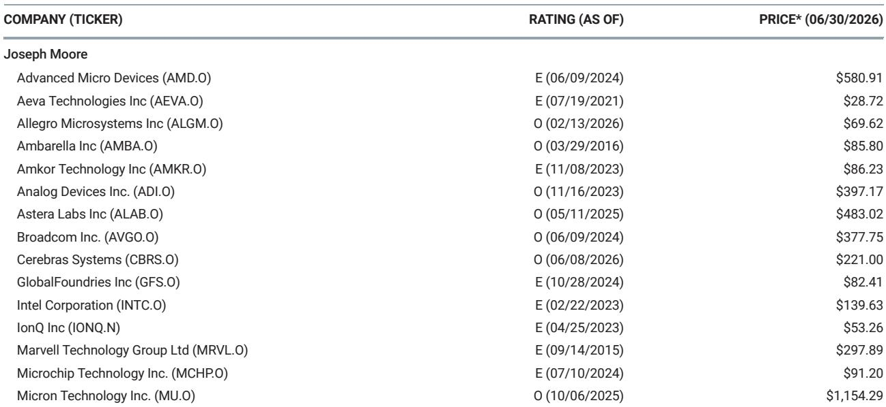
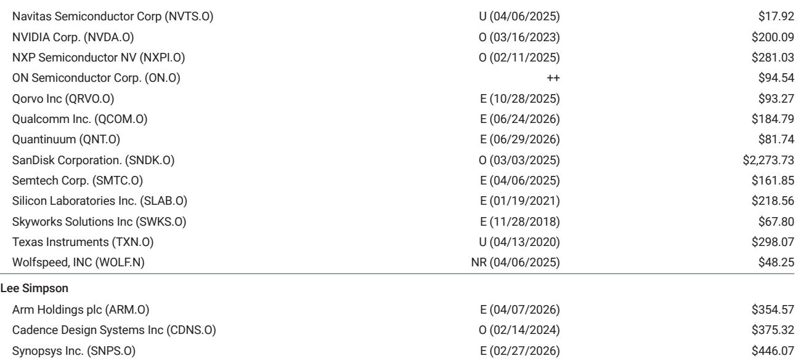
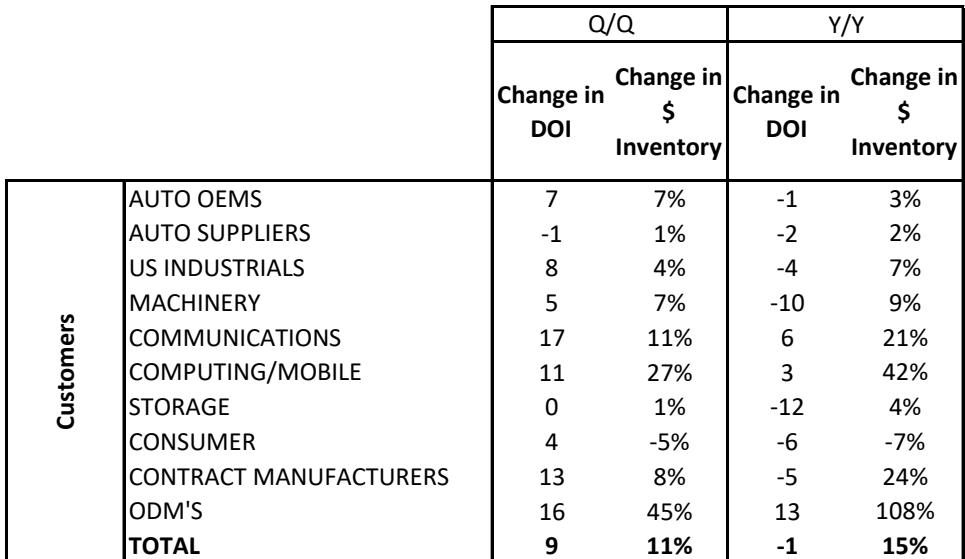

# 摩根斯坦利：MS：半导体还没开始补库存

市场对半导体周期的期待，可能正在经历一次安静的修正。

2026年第二季度末，MS发布了最新的半导体库存追踪报告。这份报告的标题本身就是一个清晰的判断——“Not Restocking Yet”。在经历了2025年底到2026年初的AI算力热潮和部分芯片价格企稳之后，市场普遍预期产业链将进入一轮主动补库存周期。但MS基于对供应链、分销商和半导体公司三个维度库存数据的系统追踪，给出了一个与市场共识存在微妙偏差的结论：供应链确实在改善，但距离广泛的补库存启动，仍有距离。

这不是一份唱空的报告。MS对北美半导体行业维持“Attractive”评级。但报告揭示了一个关键结构性问题：当前库存改善的动力来自供给端的克制，而非需求端的全面复苏。这意味着，下一轮半导体行情的驱动力，可能不是总量修复，而是特定领域的供需错配。

> **KC评论：** 这份报告最值得关注的不是库存数字本身，而是“改善”与“补库存”之间的区别。改善是存量调整，补库存是增量需求。前者可以支撑股价不跌，但只有后者才能驱动板块系统性重估。MS的数据表明，我们现在仍处于第一阶段。

## 1. 整体库存改善超季节性，但33天的历史中位数缺口仍未填补

MS追踪的半导体全供应链库存天数（DOI）在2026年第一季度环比增加了9天，而这一季度的季节性增幅通常是19天。也就是说，库存改善的速度快于历史平均水平，方向是对的。但绝对水平依然不低——全供应链库存天数仍比历史中位数高出33天。

这个33天的缺口是理解当前周期的关键。它意味着，即使需求维持当前水平，产业链也需要一个季度以上的时间去化过剩库存，才能回到历史均衡状态。而如果需求出现边际走弱，这个去化过程还会拉长。

报告特别指出，库存改善的主要驱动力来自分销商的主动“瘦身”和半导体生产商的克制补货，而非终端客户需求的强劲拉动。客户端的库存变化基本与季节性持平，没有出现超预期的消耗。

## 2. 分销商成为最积极的去库存力量，但这可能是一把双刃剑

在供应链的三个环节中，分销商的表现最为突出。MS数据显示，分销商库存天数环比下降2天，而季节性本应是增加4天。这意味着分销商不仅没有为旺季备货，反而在主动压缩库存。WPG和Avnet的库存天数下降尤为明显，其逻辑是COGS增速超过了库存增速。

分销商的行为逻辑不难理解：在利率依然偏高、终端需求前景不明的环境下，持有库存的财务成本和管理风险都在上升。但分销商的过度谨慎也可能带来一个副作用——当需求突然回升时，供应链的响应速度会受到制约，短期内的供需缺口可能比预期更大。

> **KC评论：** 分销商去库存是当前供应链最健康的信号之一，但也埋下了未来可能“补过头”的伏笔。完整报告中关于分销商库存的图表值得细看，它展示了不同分销商之间的行为分化——Arrow的库存天数反而增加了2天。这种分化本身就暗示，不同渠道对需求的判断并不一致。

## 3. 半导体公司自身库存分化明显，模拟/MCU和存储是亮点

从半导体生产商的角度看，整体库存天数环比仅增加2天，低于季节性增幅的5天。但结构性的分化远比总量数字有意义。

模拟/MCU领域的库存天数环比下降了2天，尽管绝对水平仍比历史中位数高出45天，但方向性改善已经出现。存储领域表现更为健康，库存天数环比持平，同比大幅下降40天，目前仅比历史中位数高出8天。这意味着存储已经接近供需平衡点。

真正需要警惕的是智能手机/网络/PLD领域，其库存天数环比飙升了21天，同比增加了28天，目前比历史中位数高出37天。这个板块的库存压力在显著累积，与AI相关的网络芯片需求是否足以消化这些库存，是一个需要持续观察的问题。

代工厂的库存也在增加，环比上升8天，这通常不是一个积极信号——代工厂的库存增加往往意味着客户下单节奏在放缓。

## 4. 汽车供应链出现罕见的库存分化：OEM补库，Tier 1去库

报告中最值得关注的结构性变化之一，出现在汽车半导体领域。汽车OEM的库存天数环比增加了7天，已经回升至历史中位数以上。但汽车供应商（Tier 1）的库存天数环比下降了1天，回到了与历史中位数持平的水平。

这是一个反直觉的组合。通常，OEM的库存增加会传导至Tier 1，带动其补库。但当前的数据显示，Tier 1反而在去库存。这可能意味着OEM的补库更多是基于对未来供应链不确定性的预防性备货，而非终端销售的真实拉动。如果终端汽车销量没有同步回升，OEM的库存很快就会变成压力。

> **KC评论：** 汽车供应链的分化是这份报告里最容易被忽略但可能最重要的信号。它暗示汽车半导体的需求复苏可能比市场预期的更脆弱。报告中对Auto OEM和Auto Supplier库存走势的独立图表，分别展示了这两个群体的不同轨迹，值得结合起来看。

## 5. 报告没有完全回答的问题：AI需求的真实拉动到底有多大

MS在这份报告中明确指出了他们偏好的投资方向：供给/需求正在收紧的领域，包括高端模拟（ADI、NXP）、计算/网络（NVDA、AVGO、CBRS）、存储（MU、SNDK）和半导体设备（MKSI、KLAC、LRCX、ONTO）。

这个清单本身就隐含了一个判断：AI相关需求确实在创造结构性机会，但这种机会更多集中在特定环节，而非全产业链。NVDA和AVGO的入选说明AI算力芯片和网络芯片的供需格局确实在改善，但这份报告并没有量化AI需求对整体库存去化的贡献度。

一个关键问题尚未得到解答：AI需求的增量，是否足以抵消智能手机、工业和消费电子领域的库存压力？从当前的数据看，智能手机/网络/PLD领域的库存仍在快速攀升，而工业和机械领域的库存也高于历史中位数。AI可能正在创造一个小气候，但大气候的改善仍需时日。

## 6. 投资者需要关注的三个观察指标

基于MS这份报告的数据框架，我们认为未来几个季度需要持续跟踪三个指标：

第一，分销商库存是否从“主动去库”转向“被动补库”。如果分销商库存天数在某个季度突然大幅回升，那可能意味着终端需求出现了意外的上行，分销商被迫追单。这是补库存周期启动的最直接信号。

第二，存储领域的库存天数能否进一步压缩至历史中位数以下。存储是半导体周期的风向标，当存储库存低于历史中位数时，往往意味着全产业链补库存即将启动。

第三，汽车OEM的库存能否被终端销售消化。如果OEM库存持续攀升而Tier 1仍在去库，汽车半导体的需求风险会逐步积累。

这三个指标目前都没有给出明确的积极信号。MS的判断是谨慎的——方向正确，但时机未到。

---

这份报告还有更多值得深入拆解的细节，包括不同终端市场的库存走势对比、各细分领域的历史中位数参考线、以及MS对具体标的的评级逻辑。这些内容在完整的PDF版本中有更详尽的图表和数据支撑。

如果你希望持续跟踪这些边际变化，获取更多国际投行的原始信源和独立解读，欢迎扫码加入我们的交流社群。我们每日更新，汇总国际主流叙事、数据和图表，帮助投资者在噪音中识别信号。社群已汇聚了来自头部券商、PE/VC、投行、并购、hedge fund、资管机构、战略咨询、智库等领域的从业者，期待与你的交流。

Personal reading notes and learning share only. Not investment advice.

