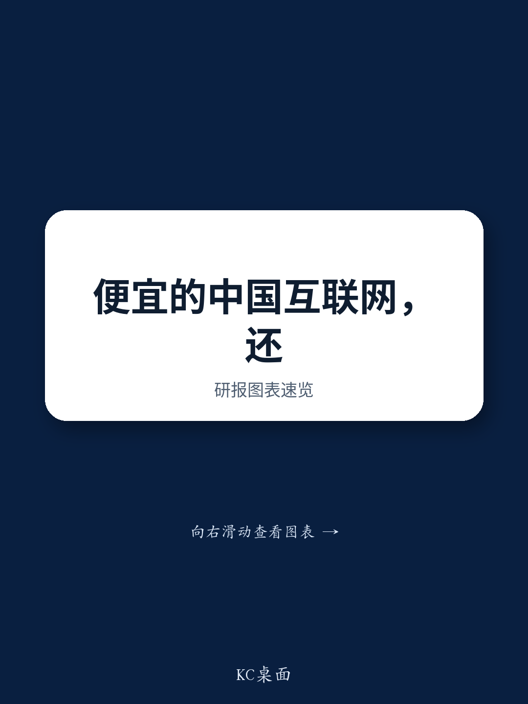

# China Internet Is Cheap, But Cheapness Alone Cannot Compete with AI Hardware — The Sector Needs Proof, Not Valuation

The most important takeaway from a week of marketing meetings with US-based investors is not that China Internet is undervalued. That fact is already accepted. The real insight is that cheapness has lost its power as a catalyst. Valuation is no longer the central debate. The central debate is whether any near-term proof point can arrive quickly enough to pull capital away from AI hardware, memory, semiconductors, and private AI assets where earnings revisions and scarcity narratives remain cleaner. The sector is not being dismissed. It is being deferred. And in a deferral regime, the question shifts from "is it cheap?" to "what changes behavior soon enough to matter?"

This distinction matters because it reframes the entire investment approach. If the market were simply skeptical on valuation, the answer would be patience: wait for multiple expansion. But the market is not skeptical on valuation. It is skeptical on timing, catalyst density, and the opportunity cost of holding China Internet versus owning what is working today. That makes the sector's problem structural, not cyclical. It means broad beta bets are unlikely to work unless a specific, measurable, and dated proof point emerges across multiple large caps simultaneously.

The feedback from US investors was consistent: they are engaged, familiar with the names, and generally constructive on quality. But they are not rotating. The opportunity cost argument is real, and it is winning. Against this backdrop, the sector needs to be approached selectively, not indiscriminately. The names that can produce near-term reported evidence of AI monetization, margin expansion, or catalyst events will attract marginal capital. The names that depend on narrative, patience, or long-duration optionality will continue to be respected but underweighted.

## The Burden of Proof Has Shifted from Valuation to Catalyst Density

The critical regime change that emerged from these meetings is that investors no longer need to be convinced that China Internet is cheap. They need to be convinced that something will happen soon enough to make the trade work within their mandate and against their existing positions. This is a fundamentally different burden of proof.

In a valuation-driven regime, the question is simple: is the stock cheap relative to history, peers, or intrinsic value? The answer can be static. In a catalyst-driven regime, the question is dynamic: what event, data point, or disclosure will change the near-term revision path? The answer requires a date, a magnitude, and a level of confidence that the catalyst will actually land.

This shift has direct implications for positioning. The names that can provide a dated and measurable proof point become the natural marginal buys. The names that cannot remain in the "interesting but not urgent" category. This is why Alibaba cloud margin attracted the most tactical traction among large caps: it is a near-term reported variable that investors can underwrite. It is not a narrative. It is a number that will appear in quarterly results.

The implication for the sector is that broad beta exposure is unlikely to work without a cluster of positive catalysts across multiple names. Investors are not waiting for a single stock to move. They are waiting for a pattern of evidence that shifts the sector's revision path upward. Until that pattern emerges, the opportunity cost trade will continue to dominate.

## Alibaba Cloud Margin Is the Cleanest Large-Cap Proof Point, But the Slope Is the Debate

Among the large platforms, Alibaba had the clearest tactical set-up because the debate is tied to a measurable and near-term variable: cloud margin. Investors are no longer asking whether Alibaba has an AI narrative. They are asking whether the cloud margin path is real, how quickly it can scale, and how much of the benefit leaks into consumer AI or local services losses.

The important nuance is that the cloud-margin thesis is no longer undiscovered. Many investors already understand the bull case: external cloud margin rising from the high-single-digit to low-double-digit range toward a higher long-term level. The investable edge is not in repeating that AI cloud is important. It is in assessing the slope of margin expansion and the degree of reinvestment leakage elsewhere.

This makes Alibaba the cleanest tactical large-cap expression of the current regime. The catalyst is measurable, near-term, and tied to reported numbers. If cloud margin expands sequentially while losses in local services and consumer AI remain controlled, Alibaba can shift from tactical AI beneficiary to a more durable compounder. If the margin path stalls or is offset by losses elsewhere, the current traction likely fades.

The open question that the report does not fully answer is how much of the cloud margin improvement is structural versus cyclical. If the margin expansion is driven by AI workload mix shift, it is durable. If it is driven by temporary cost optimization or one-time benefits, it may reverse. Investors need to assess the composition of margin improvement, not just the headline number.

## Tencent Is Respected But Not Urgent — AI KPIs Are the Missing Catalyst

Tencent remains the highest-quality large-cap platform in the group, but respect did not convert into urgency on this trip. Investors generally accepted the quality argument. The pushback was not that Tencent lacks assets. It was that the AI revenue path still feels too long-dated relative to what investors can own elsewhere today.

The key debate is whether Tencent is a long-duration AI winner or simply a high-quality funding source for more immediate AI hardware exposure. The Hy3 release helped narrow the execution discount, but the market still wants disclosure rather than narrative. Investors asked for evidence around Hunyuan at scale, WeChat agents, WorkBuddy, cloud APIs, and advertising monetization.

The implication is clear. Tencent remains a patient core position, not a name to press purely on valuation. To shift from respected compounder to urgent buy, Tencent needs AI KPIs that can be connected to reported revenue, margin, or engagement over the next few quarters. Without that, the AI option remains outside base earnings in investors' minds.

The report does not fully resolve when those KPIs might arrive or what form they will take. That is the central uncertainty. If Tencent provides meaningful AI monetization disclosure in the next one to two quarters, the stock could re-rate significantly. If disclosure remains vague, the stock will likely continue to trade at a discount to its intrinsic quality.

## Baidu's Event Path Is Compelling, But Durability Remains the Question

Baidu drew event-driven interest because Kunlunxin and capital return provide a denser catalyst path than broad sector beta. Investors were interested in several potential catalysts: Kunlunxin IPO progress, a Hong Kong primary listing, Stock Connect inclusion, the first dividend, and a possible special distribution. Those are concrete events, and they help Baidu stand out in a sector where many investors still ask what the near-term trigger is.

The pushback was durability. Investors questioned whether Baidu is an asset-monetization trade or a sustainable AI platform. Legacy search remains under pressure, capex is below the largest platforms, and communication has not always helped investors underwrite the transition.

In our view, Baidu's event path can work, but long-only sizing likely requires a clearer capital return framework, more confidence in parent earnings quality, and better evidence that AI cloud revenue is durable rather than episodic.

The unresolved question is whether the Kunlunxin listing is a one-time value unlock or the beginning of a broader AI monetization story. If Kunlunxin is the only near-term catalyst, the stock may spike and then fade. If it signals a broader shift in how Baidu monetizes its AI assets, the re-rating could be more sustained.

## The Food-Delivery Debate Highlights the Importance of Expression

The food-delivery regulation debate was one of the most interesting on the trip. Investors were broadly willing to treat the SAMR rules as regulation-positive for the sector. But they were more divided on equity expression. Meituan was not rejected, but several investors framed JD as the cleaner revision surprise if rationalization holds.

This is a critical insight. It means the regulatory tailwind is real, but it is not automatically captured by the most obvious name. If the sector rationalizes but JD captures the cleaner revision surprise, then JD may remain the better expression of the same theme.

The report does not fully answer which name will ultimately benefit more. That depends on execution, unit economics, and market share dynamics over the next several quarters. What the report does clarify is that investors are thinking about this trade in relative terms, not absolute terms. They are not asking whether food-delivery regulation is positive. They are asking which stock provides the cleanest expression of that positive thesis.

## A Decision Framework for the Current Regime

The report's feedback can be translated into a practical decision framework for allocators. This framework is not about predicting the next catalyst. It is about matching positioning to the type of proof each name can provide.

First, identify names with near-term reported proof points. These are the tactical expressions. Alibaba cloud margin is the clearest example. If an investor wants to express a view on China Internet AI monetization with a measurable catalyst, Alibaba is the most direct vehicle.

Second, identify names where the proof point is event-driven rather than reported. Baidu's catalyst path around Kunlunxin, capital return, and listing events fits here. These names can work tactically, but the catalyst is discrete rather than ongoing.

Third, identify names that need disclosure before urgency returns. Tencent is the clearest example. These names are high quality but require a trigger to re-rate. They are core holdings, not tactical trades.

Fourth, identify names where the equity bridge is unproven. Kuaishou and Kling are the best example. The asset is interesting, but how much value reaches the listed parent is unclear. These names require more clarity on ownership, dilution, and listing structure before they become clean equity theses.

Fifth, identify relative value expressions within the same thematic. The food-delivery regulation trade is a good example. Meituan is the obvious name, but JD may be the cleaner revision surprise. Investors should think in relative terms, not absolute terms.

This framework does not guarantee outcomes. It does provide a structured way to think about which names can attract marginal capital and which names will likely remain in the "interesting but not urgent" category.

## What the Report Does Not Fully Answer

The report is valuable because it captures the current regime with precision. But it also leaves several meaningful open questions that investors will need to resolve on their own.

First, what specific AI KPIs would be sufficient to shift the opportunity cost trade for Tencent? The report notes that investors want disclosure, but it does not specify what form that disclosure should take. Is it AI revenue as a percentage of total revenue? AI-related advertising monetization? Cloud API usage metrics? The answer matters because it determines what investors should watch for.

Second, how durable is Alibaba's cloud margin expansion? The report notes that the thesis is no longer undiscovered, but it does not fully resolve whether the margin improvement is structural or cyclical. Investors need to assess the composition of margin improvement to determine whether the current traction is sustainable.

Third, which name will ultimately capture the food-delivery rationalization trade? The report notes that JD was repeatedly raised as an alternative expression, but it does not provide a definitive view on which name will benefit more. That depends on execution and market share dynamics over the next several quarters.

Fourth, how much value will ultimately accrue to Kuaishou shareholders from Kling? The report notes that the equity bridge is the entire debate, but it does not provide a framework for estimating the potential value transfer. Investors need clarity on ownership, dilution, listing structure, and holdco discount before they can underwrite this thesis.

Fifth, will the model-lab scarcity premium compress as more AI assets become available to public-market investors? The report notes that Kimi, DeepSeek, and others may all affect how investors price scarcity, but it does not provide a view on the timing or magnitude of that compression.

These open questions are not weaknesses of the report. They are the natural result of a regime that is still evolving. The report provides a clear diagnosis of the current state. The resolution of these questions will determine the next phase of the trade.

## The Path Forward Requires Patience and Selectivity

The overall message from the trip is clear. China Internet is investable, but it is not urgent. The sector has quality assets, real valuation support, and a credible AI narrative. But against the current opportunity cost trade, cheapness alone is not enough. The sector needs proof.

That proof will come in different forms for different names. For Alibaba, it is cloud margin. For Tencent, it is AI KPIs. For Baidu, it is the Kunlunxin event path. For Kuaishou, it is the Kling equity bridge. For the food-delivery names, it is relative revision surprise.

The investors who will succeed in this regime are not the ones who bet on broad beta. They are the ones who identify the specific proof points that can change behavior, and position accordingly. The sector is not broken. It is just waiting for evidence.

Join the community to read the full report and review the original charts.

*This article is for learning and discussion only and does not constitute investment advice.*

Personal reading notes and learning share only. Not investment advice.

