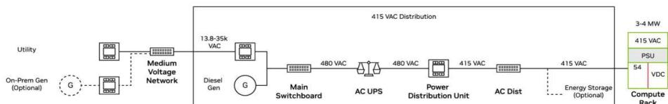
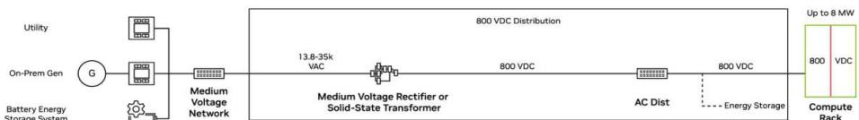
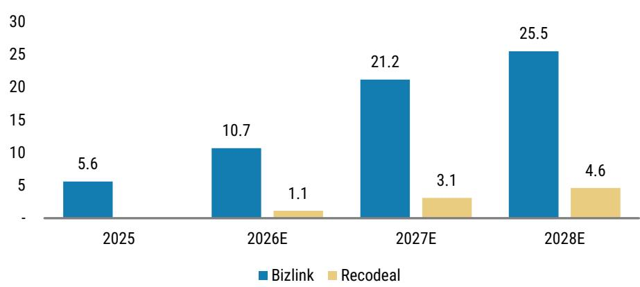
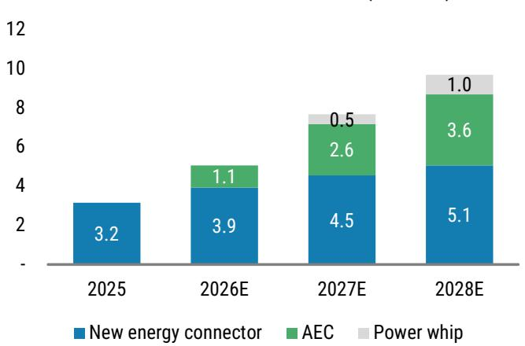
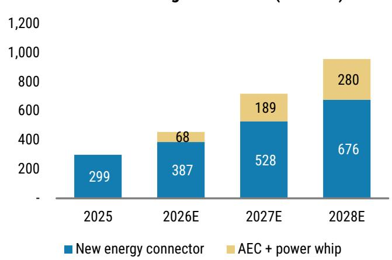
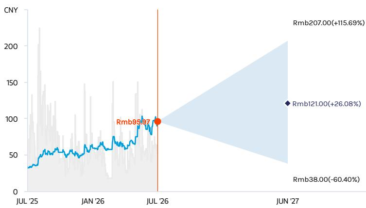
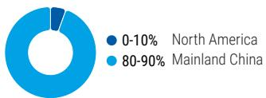

<table><tr><td colspan="2">CHINA AUTOS &amp; SHARED MOBILITY</td></tr><tr><td>Asia Pacific Industry View</td><td>In-Line</td></tr></table>

<table><tr><td colspan="2">Daisy Dai, CFA</td></tr><tr><td colspan="2">Equity Analyst</td></tr><tr><td>Daisy.Dai@morganstanley.com</td><td>+852 2848-7310</td></tr></table>

July 1, 2026 09:00 PM GMT

# China Autos & Shared Mobility | Asia Pacific

# Extending 800V EV Technology into AIDC

## WHAT'S CHANGED

<table><tr><td>Suzhou Recodeal Interconnect System (688800.SS)</td><td>From</td><td>To</td></tr><tr><td>Rating</td><td>Underweight</td><td>Overweight</td></tr><tr><td>Price Target</td><td>Rmb42.14</td><td>Rmb121.00</td></tr></table>

The earlier migration from 400V to 800V EVs in China has cultivated a cohort of high-voltage EV component suppliers. We compare them with global peers and explore new opportunities in 800VDC AI data centers. We double-upgrade Recodeal from UW to OW on revenue upside from AI interconnects.

Maturing 800V EV supply chain in China: 800V EV sales penetration in China has risen from 5% in 2023 to 11% in 2025, cultivating an increasingly mature 800V auto supply chain that could benefit from the emerging 800V high-voltage direct current (HVDC) architecture for AI data centers (AIDC). We explore the opportunities and challenges for auto suppliers in addressing 800V AIDC.

Why few auto suppliers have won orders from 800V AIDC so far? The 800V EV supply chain spans upstream auto semis (silicon carbide, gallium nitride), downstream electronics components (inverters, on-board chargers, DC-DC converters), and auxiliaries (connectors, relays, fuses). The 800V AIDC ecosystem shows a similar structure, from silicon providers to power system components. However, auto suppliers must requalify these technologies to support data centers' 24/7 continuous duty, high power density, hot swap, and very low downtime, which takes time to achieve.

## Common parts best positioned; double-upgrade Recodeal (688800.SS) to OW:

We expect generic high-voltage components, such as semis and connectors, to lead migration from 800V EV to AIDC. We upgrade Recodeal to OW on an AI-driven earnings inflection from 2026, as it expands from EV connectors – where margins faced pressure – into AIDC interconnects such as active electrical cables (AEC) and power whips, where we see strong growth potential. We expect AI interconnects to contribute >40% of Recodeal's revenue in 2027. Yangjie (300373.SZ, covered by Daisy Dai), a leading Chinese power semi supplier, can also benefit from auto localization and power semi price increases.

Tier-1 parts can also benefit but require redesign, Joyson (600699.SS) on watch list: We expect auto tier-1 suppliers such as Joyson to have opportunities to supply DC-DC converters, battery management systems, and power electronics to 800V AIDC, but they must redesign auto-grade products. Similar opportunities have emerged in the US. As highlighted by our US auto analyst Andrew Percoco in his Mobility to Megawatts Primer (3 Jun 2026), several suppliers – Aptiv, Versigent, BorgWarner, Magna, and Lear – can leverage their engineering talent and manufacturing scale to address the 800V AIDC market.

Shelley Wang, CFA
Equity Analyst
Shelley.Wang@morganstanley.com +852 3963-0047

MS & CO. LLC
Andrew S Percoco
Equity Analyst
Andrew.Percoco@morganstanley.com +1 212 296-4322

<table><tr><td colspan="2">Andy Meng, CFA</td></tr><tr><td>Equity Analyst</td><td></td></tr><tr><td>Andy.Meng@morganstanley.com</td><td>+852 2239-7689</td></tr></table>

<table><tr><td colspan="2">MS TAIWAN LIMITED+</td></tr><tr><td colspan="2">Derrick Yang</td></tr><tr><td colspan="2">Equity Analyst</td></tr><tr><td>Derrick.Yang@morganstanley.com</td><td>+886 2 2730-2862</td></tr></table>

<table><tr><td colspan="2">MS ASIA LIMITED+</td></tr><tr><td colspan="2">Tim Hsiao</td></tr><tr><td colspan="2">Equity Analyst</td></tr><tr><td>Tim.Hsiao@morganstanley.com</td><td>+852 2848-1982</td></tr></table>

<table><tr><td colspan="2">Joey Xu, CFA</td></tr><tr><td colspan="2">Equity Analyst</td></tr><tr><td>Joey.Xu@morganstanley.com</td><td>+852 3963-0337</td></tr></table>

<table><tr><td colspan="2">Peggy Wang</td></tr><tr><td>Research Associate</td><td></td></tr><tr><td>Peggy.Pc.Wang@morganstanley.com</td><td>+852 3963-3934</td></tr></table>

MS does and seeks to do business with companies covered in MS. As a result, investors should be aware that the firm may have a conflict of interest that could affect the objectivity of MS. Investors should consider MS as only a single factor in making their investment decision.

For analyst certification and other important disclosures, refer to the Disclosure Section, located at the end of this report.

+= Analysts employed by non-U.S. affiliates are not registered with FINRA, may not be associated persons of the member and may not be subject to FINRA restrictions on communications with a subject company, public appearances and trading securities held by a research analyst account.

## Who's in the 800V EV supply chain?

## From 400V to 800V EV

800V a more efficient solution for EV: Most EVs historically adopted 400V vehicle architecture. Under Watt's Law, P (power) = U (voltage) × I (current), charging power can increase by raising voltage from 400V to 800V. An 800V architecture helps shorten EV charging time significantly to <10 minutes. It also supports OEM cost reduction as SiC costs decline over time. Compared with battery swapping and high-current fast charging, high-voltage fast charging is more efficient, as it reduces resistive heating and simplifies the wire harness.

Maturing 800V EV supply chain in China: 800V EV sales penetration in China has risen from 5% in 2023 to 11% in 2025, cultivating an increasingly mature 800V auto supply chain. This spans upstream auto semis (SiC, GaN), downstream electronics components (SiC inverters, on-board chargers, DC-DC converters), and auxiliaries (connectors, relays, fuses).

Some EV suppliers have already entered the 800V AIDC supply chain: We map the major 800V EV supply chain in the following chart, covering both global and China players. Names highlighted in green have already partnered with Nvidia's next generation 800VDC AI factories. This suggests EV suppliers can potentially supply similar products to 800V AIDC.

Exhibit 1: 800V EV supply chain - global and China

## Auto Semi

SiC substrate
Wolfspeed (WOLF.N)
Coherent (COHR.N)
SICC 天岳先进 (688234.SS)

GaN
Innoscience 英诺赛科 (2577.HK)

SiC foundry
X-FAB (XFAB.PA)
Episil (3016.TW)
GlobalWafers (6488.TWO)
Times Electric 时代电气 (3898.HK)
United Nova Tech 芯联集成
(688469.SS)

Infineon (IFXGn.DE) STM (STMPA.PA) On Semi (ON.O) Rohm (6963.T) Renesas (6723.T) Wolfspeed (WOLF.N) Yangjie 扬杰科技 (300373.SZ) StarPower 斯达半导 (603290.SS) Silan 士兰微 (600460.SS)

## Electric Motor

Vitesco/Schaeffler (SHA0.DE)
BorgWarner (BWA.N)
Magna (MGA.N)
Denso (6902.T)
Nidec (6594.T)

BYD Fudi 弗迪动力 (1211.HK)
Inovance Auto 联合动力 (301656.SZ)
Founder 方正电机 (002196.SZ)
Jingjin Electric 精进电动 (688280.SS)
Broad-Ocean 大洋电机 (002249.SZ)

## OBC+DCDC

Delta Electronics (2308.TW)
Aptiv (APTV.N)
Eaton (ETN.N)
TDK (6762.T)

Megmeet 麦格米特 (002851.SZ)
BYD Fudi 弗迪动力 (1211.HK)
Joyson 均胜电子 (600699.SS)
VMAX 威迈斯 (688612.SS)
EV-Tech 富特科技 (301607.SZ)
Shinry 欣锐科技 (300745.SZ)
Enpower 英博尔 (300681.SZ)

## Connector

Bizlink (3665.TW)
Amphenol (APH.N)
TE Connectivity (TEL.N)
Aptiv (APTV.N)
JAE (6807.T)
Recodeal 瑞可达 (688800.SS)
Luxshare 立讯精密 (002475.SZ)
AVIC Jonhon 中航光电 (002179.SZ)
CWB 合兴股份 (605005.SS)
Yonggui 永贵电器 (300351.SZ)
ECT 电连技术 (300679.SZ)

## Relay

Panasonic (6752.T)
TE Connectivity (TEL.N)
Omron (6645.T)
Hongfa 宏发股份 (600885.SS)

Fuse

Littelfuse (LFUS.O)
Bel Fuse (BELFA.O)
Eaton Bussmann (ETN.N)
Sinofuse 中熔电气 (301031.SZ)

Source: MS. Names in green are partners for Nvidia's next generation 800VDC AI factories.

## Power semi – silicon carbide (SiC)

Electric motors (traction inverters), DC-DC converters, and on-board chargers (OBC) represent the key components that adopt SiC in 800V vehicles.

Power electronics – inverter, DC-DC converter, OBC

We believe tier-1 suppliers that assemble inverter, DC-DC converter, and OBC modules will also see opportunities from the 800V transition. For example, when an 800V EV charges at a 400V pole, a step-up DC-DC converter lifts voltage from 400V to 800V. When the 800V EV distributes power from the battery to 12/48V systems – such as cockpit and body control – a step-down DC-DC converter reduces voltage.

## Connectors

As vehicle architecture shifts from 400V to 800V, certain configurations require additional components, such as step-up or step-down DC-DC converters. We therefore estimate an incremental 20-30% increase in high-voltage connector volume, raising connector value to \~Rmb2.5K per 800V EV from \~Rmb2.0K per 400V EV.

## Relays and fuses

800V raises performance requirements for auxiliary components such as relays and fuses. Industry discussion increasingly focuses on replacing traditional melting fuses with eFuses, as eFuses can detect and isolate faults faster.

## Similarity in 800V EV and AIDC

The need for 800V: Like the EV industry's shift from 400V to 800V, AIDC migration to 800V reflects the need to deliver higher power without allowing current, cable size, heat, and conversion losses to scale disproportionately. In EVs, 800V enables faster DC charging, lighter high-voltage cabling, higher inverter efficiency, and greater power delivery to traction motors. In AIDC, the shift from 400VAC to 800VDC enables higher rack power, lower distribution current, reduced copper usage, fewer conversion stages, and improved end-to-end efficiency.

Redesigning the ecosystem: Both transitions require redesign of the surrounding ecosystem. EVs require 800V-compatible inverters, OBCs, DC-DC converters, and fast-charging interfaces, while AIDC requires 800V-ready rectifiers or solid-state transformers, busbars, protection devices, rack power shelves, energy storage interfaces, and server power supplies.

Exhibit 2: 800V EV architecture  
  
Source: STMicroelectronics

## Exhibit 3: 800V AIDC architecture

Data Center Roadmap
Architecting AI Infrastructure for Next-Gen AI Factories

2025  

2027  
  
Source: Nvidia

## Migrating to 800V AIDC Supply Chain

Opportunities from 800V EV to AIDC: Our US auto analyst Andrew Percoco explores migration opportunities in his Mobility to Megawatts Primer – Energy Storage, Onsite Power, 800V Architecture, and What's in the Price (3 Jun 2026). 800V AIDC requires a high-voltage technology stack that overlaps with capabilities auto suppliers have developed and commercialized for 800V EV platforms, including SiC-based inverters, DC-DC converters, high-voltage distribution, connectors, busbars, battery disconnect units, and thermal management systems.

Why few auto suppliers have won orders from 800V AIDC so far? While 800V AIDC and 800V EV share a similar high-voltage ecosystem, the customer requirements and qualification process are meaningfully different. Data centers prioritize 24/7 continuous operation, high power density, redundancy, hot-swap serviceability, very low downtime, and infrastructure-level reliability. Auto suppliers need to validate performance over longer operating lifecycles, demonstrate reliability at infrastructure scale, meet data-center certification/safety requirements, and build credibility with a new customer base. These commercial and qualification hurdles take time, which likely explains why auto-supplier traction in 800V AIDC remains limited so far.

What repurposing could require: The technology overlap is clear, but auto components are not direct drop-ins. Auto-grade inverters convert battery DC into AC motor power under dynamic driving conditions, while data center power systems must deliver reliable power flow across grid, batteries, on-site generation, and compute loads. At the component level, serving data-center applications would likely require auto suppliers to adapt their designs for stationary, high-utilization power infrastructure, including tighter voltage regulation, bidirectional power flow, packaging, cooling, protection schemes, serviceability, and facility-level controls. The opportunity lies less in reusing identical components and more in applying high-voltage EV engineering expertise to stationary, mission-critical power infrastructure. Selected suppliers – Aptiv, Versigent, BorgWarner, Magna, Lear – could benefit by extending their capabilities into power conversion, distribution, connectivity, and energy management.

Recodeal (688800.SS): Recodeal supplies connectors across EV, energy storage systems (ESS), robotaxi, eVTOL, and AIDC. Its AI-related products – AEC, active copper cable (ACC), direct attach cable (DAC), and power whips – do not specifically target 800V today. However, given its experience in high-voltage connectors for 800V EVs, we see strong potential to extend this know-how into 800V AIDC over time.

Joyson (600699.SS): Joyson supplies 800V auto electronics for the Porsche Taycan, including high-voltage boosters, multifunctional DC-DC converters, and OBCs. It secured Rmb13bn in new 800V orders in April 2023 to supply DC-DC converters and OBCs to a German luxury OEM's next-generation vehicles. Together with a Rmb9bn order win in 2022, Joyson now holds a Rmb22bn 800V backlog, supporting growth beyond 2025. While technically adjacent, application to 800V AIDC will require customer verification and time.

BYD (1211.HK) Fudi: BYD vertically integrates 800V EV components, including electric drive systems, motor controllers, on-board power electronics, high-voltage distribution, and harness-related parts. In addition to technical adjacency, BYD can bundle energy storage batteries with 800V powertrain technologies to address AIDC demand.

Keboda (603786.SS): Keboda supplies eFuses to Volkswagen, Mercedes-Benz, Li Auto, and others. eFuses detect and isolate faults – such as overcurrent or short circuits – faster than traditional melting fuses. This capability positions eFuses for potential adoption in high-voltage AIDC environments.

Exhibit 4: China auto parts with 800V exposure

<table><tr><td>China auto supplier</td><td>800V EV parts</td><td>Potential 800V AIDC parts</td><td>US peers</td></tr><tr><td>Recodeal (688800.SS)</td><td>800V EV connector</td><td>High-voltage power whip, active electrical cable</td><td>Aptiv (APTV.N)Amphenol (APH.N, NC)</td></tr><tr><td>Joyson (600699.SS)</td><td>800V on-board charger, DC-DC converter, booster</td><td>800V DC-DC converter, on-board charger, power distribution unit</td><td>Aptiv (APTV.N)BorgWarner (BWA.N)</td></tr><tr><td>BYD (1211.HK) Semi / Fudi</td><td>1200V SiC power module; 800V electric drive, motor controller, inverter</td><td>800V SiC inverter</td><td>BorgWarner (BWA.N)Magna (MGA.N)</td></tr><tr><td>Keboda (603786.SS)</td><td>eFuse (rapid-response protection) for auto PCB, not necessarily for 800V</td><td>High-voltage eFuse for rack</td><td>Versigent (VGNT.N)Lear (LEA.N)</td></tr></table>

Source: Company data, MS

## Upgrade Recodeal to OW

## Power whip a potential new growth driver

Margin pressure in EV connectors: Recodeal supplies high-voltage connectors to EV and ESS. We previously had concerns on margins, as EV OEM price cuts pass through to suppliers and intensify pricing pressure. Competition has also increased, with more connector makers entering, including players from consumer electronics.

Entering AIDC power whip: However, the rise of 800V AIDC architecture creates potential for Recodeal to supply high-voltage power whips into data centers. Power whips are pre-assembled cable systems that include cables, connectors, plugs, terminals, and protective conduits, delivering power from PDUs, busways, or power shelves to server racks or equipment. Currently, Bizlink (3665.TW, covered by Derrick Yang) leads as a power whip supplier to Nvidia Blackwell GPU racks and has developed connectors, cables, and busbar technologies supporting 800VDC architectures, according to company disclosures. Recodeal has already developed AIDC power whips. While not yet fully focused on 800V, we see strong potential for future 800V AIDC supply, given its expertise in 800V EV connectors.

Potential power whip revenue in 2026: In our base case, we assume no power whip revenue contribution in 2026. In our bull case, we expect mass production from 2H26, with \~Rmb0.5bn revenue contribution this year.

## AEC revenue ramping up in 2026

JV for AEC since 2025: Recodeal established a JV with a China-based AIDC optical transceiver supplier in February 2025 – Suzhou Ruichuang Connection Technology – and held a 60.61% stake as of May 2026. The JV targets AEC supply and commenced mass production in 1Q26, according to management. AEC represents copper cable assemblies with embedded signal-conditioning chips (retimers or redrivers) that extend short-reach, high-speed transmission within AIDC racks, offering lower power, lower cost, and lower latency versus optical solutions at these distances. We believe the JV strengthens Recodeal's AEC business through:

1) Customer access: Combining Recodeal's expertise in high-speed connectors, cable assembly, and precision manufacturing with its partner's customer access and system know-how in global AIDCs shortens validation cycles and accelerates the transition from sampling to volume production for 400G / 800G / 1.6T AEC. It should also improve Recodeal's chances of entering overseas CSP supply chains, upgrading its role from a traditional connector supplier to a higher-value AIDC interconnect platform provider.

2) Integrated offering: The JV enables positioning AEC within a broader “copper + optical” solution, where Recodeal focuses on lower-cost, lower-power active copper for short-reach links, while its partner focuses on optical transceivers for medium- and long-reach links.

>Rmb1bn AEC revenue in 2026: Management guides AEC capacity expansion from 15k units per month in 1Q26 to 120-150k units per month in 4Q26. Based on an estimated ASP of USD150-250, we expect AEC to contribute Rmb1.1bn revenue in 2026 and Rmb2.6bn in 2027.

## EV connector business recovering

Weak 1Q26 due to de-stocking: Recodeal's revenue declined $1\%$ YoY to Rmb752mn in 1Q26, and earnings declined $22\%$ YoY to Rmb59mn, driven by an $8\%$ YoY decline in China NEV production and continued inventory digestion by OEMs.

>20% YoY new energy (EV + ESS) connector revenue in 2026: We expect new energy connector revenue to grow 26% YoY to Rmb3.6bn in 2026, driven by \~30% volume growth and \~3% ASP decline. Beyond high-voltage EV connectors, Recodeal is developing high-speed connectors for smart driving and smart cockpit hardware. We estimate this can lift connector value per vehicle by \~Rmb1K, increasing total connector value from \~Rmb0.5K per ICE vehicle to \~Rmb3.5K per smart 800V EV.

Employee stock incentive plan targets 15% revenue CAGR: Recodeal announced a performance-linked incentive plan on 18 June 2026, granting 0.8mn shares to 20 core employees at Rmb96.25 per share. Based on a 2025 revenue base, targets require >15% growth in 2026, >30% in 2027, and >45% in 2028. While targets appear achievable, we believe the plan aligns management incentives with share price performance.

## Upgrade to OW

2026-28 forecasts: We raise 2026-27 earnings estimates by 8-37% to reflect AEC and power whip contributions and introduce 2028 forecasts. We model AEC revenue at Rmb1.1bn in 2026, Rmb2.6bn in 2027, and Rmb3.6bn in 2028. We model power whip revenue from 2027 at Rmb0.5bn in 2027 and Rmb1bn in 2028. In total, we forecast AI interconnect revenue of Rmb1.1bn in 2026, Rmb3.1bn in 2027, and Rmb4.6bn in 2028. Bizlink remains the global AEC leader with dominant market share. While it should retain leadership by 2028, we expect Recodeal to capture incremental opportunities, albeit from a smaller base.

Medium-term forecasts: We raise Recodeal's medium-term growth rate from 11% to 20%, reflecting AIDC-driven expansion. Accordingly, we lift our price target to Rmb121 and upgrade Recodeal to OW.

Look for further upside: Recodeal's share price has risen $62\%$ YTD 2026 (as of 30 June), versus $+3\%$ for the Shanghai Stock Exchange Index. We see further upside as: 1) the market has not fully priced in AIDC interconnect opportunities, particularly power whips and high-voltage connectors; and 2) material revenue contributions from AIDC interconnects will emerge in 2027-28, with consensus estimates likely to revise upward over time.

Exhibit 5: Bizlink is the leading AEC supplier while Recodeal catching up  
AIDC interconnects revenue comps (Rmb bn)  
  
Source: Company data, MS (E) estimates

Exhibit 6: We expect AI interconnect business to contribute >40% of revenue in 2027  
Recodeal revenue breakdown (Rmb bn)  
  
Source: Company data, MS (E) estimates  
Exhibit 7: We expect AI interconnect business to contribute >25% of earnings in 2027

Recodeal earnings breakdown (Rmb mn)  
  
Source: Company data, MS (E) estimates

## Downside risks

Dependence on new energy connectors: Recodeal still relies on EV and ESS, which accounted for 91% of revenue in 2025. The EV supply chain faces price wars, model cycle volatility, and OEM cost-down pressure. AIDC interconnect products may diversify the business over time, but they remain too small to offset a potential downturn in EV connectors.

AIDC ramp risk: Recodeal's AIDC story is credible but remains in ramp-up rather than proven at scale. Market expectations may run ahead of actual revenue conversion. AIDC products require long qualification cycles, high reliability, strong electromagnetic interference and thermal performance, and timely migration to 1.6T and above. If customer certification, yield, or cost reduction progress slower than expected, the AI/AEC narrative could de-rate. Competition is also intense: Credo's AEC patent action against Amphenol,

Molex, TE Connectivity, and Volex highlights the IP-sensitive nature of the market and strong competition from global interconnect players.

Margin pressure amid rising copper prices: Recodeal's margins remain exposed to metal price volatility, especially copper and silver. Copper represents the primary cost driver, as it is a key conductive input for connectors, cable assemblies, high-voltage components, and high-speed copper interconnect products. Rising copper prices could increase input costs before the company can fully pass through pricing to customers. Silver represents a smaller cost component by volume but remains relevant for high-performance contacts and plated components due to high unit value and volatility. Although silver prices have pulled back from their January peak, volatility itself creates procurement and inventory risk.

## Financial Summary

Exhibit 8: Recodeal financial summary

<table><tr><td>RMB mn</td><td>2024A</td><td>2025A</td><td>2026E</td><td>2027E</td><td>2028E</td></tr><tr><td>Revenue</td><td>2,415</td><td>3,151</td><td>5,049</td><td>7,655</td><td>9,674</td></tr><tr><td>Cost of goods sold</td><td>(1,881)</td><td>(2,453)</td><td>(4,058)</td><td>(6,157)</td><td>(7,710)</td></tr><tr><td>Gross profit</td><td>534</td><td>698</td><td>991</td><td>1,498</td><td>1,964</td></tr><tr><td>Selling expenses</td><td>(44)</td><td>(50)</td><td>(80)</td><td>(121)</td><td>(153)</td></tr><tr><td>Admin expenses</td><td>(117)</td><td>(125)</td><td>(137)</td><td>(151)</td><td>(166)</td></tr><tr><td>R&amp;D expenses</td><td>(147)</td><td>(151)</td><td>(166)</td><td>(182)</td><td>(201)</td></tr><tr><td>Operating profit</td><td>216</td><td>354</td><td>578</td><td>998</td><td>1,387</td></tr><tr><td>Finance expenses</td><td>(6)</td><td>(28)</td><td>(20)</td><td>(18)</td><td>(13)</td></tr><tr><td>Other gain (loss)</td><td>(11)</td><td>11</td><td>(0)</td><td>0</td><td>0</td></tr><tr><td>Profit before tax</td><td>200</td><td>338</td><td>558</td><td>980</td><td>1,374</td></tr><tr><td>Tax expenses</td><td>(22)</td><td>(36)</td><td>(59)</td><td>(103)</td><td>(145)</td></tr><tr><td>Profit after tax</td><td>178</td><td>302</td><td>499</td><td>876</td><td>1,229</td></tr><tr><td>Minority interests</td><td>(3)</td><td>(3)</td><td>(44)</td><td>(159)</td><td>(273)</td></tr><tr><td>Net profit</td><td>175</td><td>299</td><td>455</td><td>717</td><td>956</td></tr><tr><td>Dividends</td><td>55</td><td>61</td><td>93</td><td>147</td><td>196</td></tr><tr><td># shares outstanding</td><td>288</td><td>287</td><td>287</td><td>287</td><td>287</td></tr><tr><td>EPS (in RMB)</td><td>0.61</td><td>1.04</td><td>1.59</td><td>2.50</td><td>3.33</td></tr></table>

<table><tr><td>RMB mn</td><td>2024A</td><td>2025A</td><td>2026E</td><td>2027E</td><td>2028E</td></tr><tr><td colspan="6">Growth (%)</td></tr><tr><td>Revenue</td><td>55%</td><td>30%</td><td>60%</td><td>52%</td><td>26%</td></tr><tr><td>Gross profit</td><td>37%</td><td>31%</td><td>42%</td><td>51%</td><td>31%</td></tr><tr><td>Operating profit</td><td>53%</td><td>64%</td><td>63%</td><td>73%</td><td>39%</td></tr><tr><td>Net profit</td><td>28%</td><td>71%</td><td>52%</td><td>58%</td><td>33%</td></tr><tr><td colspan="6">Margins</td></tr><tr><td>Gross margin</td><td>22.1%</td><td>22.1%</td><td>19.6%</td><td>19.6%</td><td>20.3%</td></tr><tr><td>Operating margin</td><td>9.0%</td><td>11.2%</td><td>11.5%</td><td>13.0%</td><td>14.3%</td></tr><tr><td>Net margin</td><td>7.3%</td><td>9.5%</td><td>9.0%</td><td>9.4%</td><td>9.9%</td></tr><tr><td colspan="6">Return</td></tr><tr><td>ROA</td><td>4.1%</td><td>5.1%</td><td>6.3%</td><td>8.0%</td><td>8.8%</td></tr><tr><td>ROE</td><td>8.4%</td><td>12.1%</td><td>16.0%</td><td>21.0%</td><td>22.9%</td></tr><tr><td colspan="6">Gearing</td></tr><tr><td>Total liabilities/equity</td><td>104.5%</td><td>137.1%</td><td>149.6%</td><td>157.1%</td><td>148.2%</td></tr><tr><td>Net gearing (cash)</td><td>-19.1%</td><td>-47.8%</td><td>-46.9%</td><td>-50.7%</td><td>-57.8%</td></tr><tr><td colspan="6">Efficiency</td></tr><tr><td>Asset turnover (x)</td><td>0.6</td><td>0.5</td><td>0.7</td><td>0.8</td><td>0.9</td></tr><tr><td>Inventory days</td><td>118</td><td>87</td><td>83</td><td>78</td><td>74</td></tr><tr><td>Receivables days</td><td>135</td><td>105</td><td>105</td><td>105</td><td>105</td></tr><tr><td>Payable days</td><td>189</td><td>159</td><td>159</td><td>159</td><td>159</td></tr></table>

Source: Company data, MS (E) estimates

<table><tr><td>RMB mn</td><td>2024A</td><td>2025A</td><td>2026E</td><td>2027E</td><td>2028E</td></tr><tr><td>Fixed assets</td><td>751</td><td>1,185</td><td>1,271</td><td>1,322</td><td>1,366</td></tr><tr><td>Construction in process</td><td>298</td><td>75</td><td>75</td><td>75</td><td>75</td></tr><tr><td>Intangible assets</td><td>114</td><td>133</td><td>152</td><td>167</td><td>181</td></tr><tr><td>Goodwill</td><td>-</td><td>-</td><td>-</td><td>-</td><td>-</td></tr><tr><td>Other non-current assets</td><td>103</td><td>177</td><td>177</td><td>177</td><td>177</td></tr><tr><td>Non-current assets</td><td>1,307</td><td>1,612</td><td>1,716</td><td>1,783</td><td>1,841</td></tr><tr><td>Cash and cash equivalent</td><td>1,015</td><td>2,040</td><td>2,209</td><td>2,688</td><td>3,543</td></tr><tr><td>Note receivables</td><td>123</td><td>170</td><td>272</td><td>412</td><td>521</td></tr><tr><td>Account receivables</td><td>896</td><td>905</td><td>1,450</td><td>2,198</td><td>2,778</td></tr><tr><td>Prepayment</td><td>44</td><td>19</td><td>19</td><td>19</td><td>19</td></tr><tr><td>Inventory</td><td>607</td><td>584</td><td>917</td><td>1,322</td><td>1,573</td></tr><tr><td>Other current assets</td><td>329</td><td>584</td><td>584</td><td>584</td><td>584</td></tr><tr><td>Current assets</td><td>3,014</td><td>4,301</td><td>5,451</td><td>7,223</td><td>9,018</td></tr><tr><td>Total assets</td><td>4,321</td><td>5,913</td><td>7,167</td><td>9,006</td><td>10,860</td></tr><tr><td>Short-term borrowing</td><td>466</td><td>425</td><td>425</td><td>425</td><td>425</td></tr><tr><td>Note payables</td><td>294</td><td>229</td><td>378</td><td>574</td><td>719</td></tr><tr><td>Account payables</td><td>973</td><td>1,068</td><td>1,767</td><td>2,681</td><td>3,357</td></tr><tr><td>Other current liabilities</td><td>142</td><td>218</td><td>218</td><td>218</td><td>218</td></tr><tr><td>Current liabilities</td><td>1,929</td><td>2,000</td><td>2,848</td><td>3,958</td><td>4,779</td></tr><tr><td>Long-term borrowing</td><td>141</td><td>413</td><td>413</td><td>413</td><td>413</td></tr><tr><td>Long-term bonds</td><td>-</td><td>-</td><td>-</td><td>-</td><td>-</td></tr><tr><td>Other non-current liabilities</td><td>117</td><td>966</td><td>966</td><td>966</td><td>966</td></tr><tr><td>Non-current liabilities</td><td>261</td><td>1,398</td><td>1,398</td><td>1,398</td><td>1,398</td></tr><tr><td>Total liabilities</td><td>2,190</td><td>3,398</td><td>4,246</td><td>5,356</td><td>6,177</td></tr><tr><td>Paid-in capital</td><td>158</td><td>206</td><td>206</td><td>206</td><td>206</td></tr><tr><td>Capital reserves</td><td>1,147</td><td>1,110</td><td>1,110</td><td>1,110</td><td>1,110</td></tr><tr><td>Retained earnings</td><td>768</td><td>997</td><td>1,358</td><td>1,928</td><td>2,687</td></tr><tr><td>Minority interest</td><td>36</td><td>38</td><td>82</td><td>242</td><td>514</td></tr><tr><td>Equity attributed to shareholders</td><td>2,095</td><td>2,478</td><td>2,839</td><td>3,409</td><td>4,168</td></tr><tr><td>Total equity</td><td>2,132</td><td>2,515</td><td>2,921</td><td>3,650</td><td>4,683</td></tr><tr><td>Total liabilities and equity</td><td>4,321</td><td>5,913</td><td>7,167</td><td>9,006</td><td>10,860</td></tr></table>

<table><tr><td>RMB mn</td><td>2024A</td><td>2025A</td><td>2026E</td><td>2027E</td><td>2028E</td></tr><tr><td>Operating cash flows</td><td>57</td><td>198</td><td>558</td><td>894</td><td>1,315</td></tr><tr><td>Investing cash flows</td><td>(274)</td><td>(375)</td><td>(275)</td><td>(250)</td><td>(250)</td></tr><tr><td>Financing cash flows</td><td>266</td><td>1,211</td><td>(114)</td><td>(166)</td><td>(210)</td></tr><tr><td>Net changes in cash flow</td><td>49</td><td>1,030</td><td>169</td><td>479</td><td>856</td></tr><tr><td>Cash &amp; cash equival at YB</td><td>916</td><td>964</td><td>1,994</td><td>2,163</td><td>2,642</td></tr><tr><td>Cash &amp; cash equival at YE</td><td>964</td><td>1,994</td><td>2,163</td><td>2,642</td><td>3,497</td></tr></table>

## Valuation Methodology

We raise Recodeal's 2026-27 earnings estimates by $8 - 37\%$ to reflect AEC and power whip revenue potential and introduce 2028 estimates. We expect AEC revenue to commence in 2026, reaching Rmb1.1bn in 2026, Rmb2.6bn in 2027, and Rmb3.6bn in 2028. We expect power whip revenue to start in 2027, at Rmb0.5bn in 2027 and Rmb1bn in 2028. In total, we forecast AI interconnect revenue of Rmb1.1bn in 2026, Rmb3.1bn in 2027, and Rmb4.6bn in 2028.

We also raise Recodeal's medium-term growth rate from $11\%$ to $20\%$ , as we expect AIDC applications to drive meaningful revenue expansion. Our free cash flow forecasts mainly reflect higher revenue assumptions, while we keep capex assumptions largely unchanged. Accordingly, we lift our price target to Rmb121.

We derive our price target from the base-case scenario value in our DCF model. Other key assumptions (all unchanged) include:

\- 14.5% cost of equity – derived from a beta of 1.6, an equity risk premium of 7.0% and a risk-free rate of 3.3%.

\- 12% WACC – derived from a 14.5% cost of equity and a post-tax cost of debt of 6.0%.

• 3% terminal growth rate.

Exhibit 9: Estimate revisions

<table><tr><td>Recodeal (688800.SS)</td><td colspan="2">OLD</td><td colspan="3">NEW</td><td colspan="2">CHANGE</td></tr><tr><td>Rmb mn</td><td>2026E</td><td>2027E</td><td>2026E</td><td>2027E</td><td>2028E</td><td>2026E</td><td>2027E</td></tr><tr><td>Revenue</td><td>4,070</td><td>5,090</td><td>5,049</td><td>7,655</td><td>9,674</td><td>24.0%</td><td>50.4%</td></tr><tr><td>Gross profit</td><td>884</td><td>1,057</td><td>991</td><td>1,498</td><td>1,964</td><td>12.2%</td><td>41.7%</td></tr><tr><td>Operating profit</td><td>465</td><td>581</td><td>578</td><td>998</td><td>1,387</td><td>24.5%</td><td>71.9%</td></tr><tr><td>Net profit</td><td>420</td><td>523</td><td>455</td><td>717</td><td>956</td><td>8.3%</td><td>36.9%</td></tr><tr><td>EPS (Rmb)</td><td>1.47</td><td>1.83</td><td>1.59</td><td>2.50</td><td>3.33</td><td>8.3%</td><td>36.9%</td></tr><tr><td></td><td></td><td></td><td></td><td></td><td></td><td></td><td></td></tr><tr><td>Gross margin</td><td>21.7%</td><td>20.8%</td><td>19.6%</td><td>19.6%</td><td>20.3%</td><td>-2.1%</td><td>-1.2%</td></tr><tr><td>Operating margin</td><td>11.4%</td><td>11.4%</td><td>11.5%</td><td>13.0%</td><td>14.3%</td><td>0.0%</td><td>1.6%</td></tr><tr><td>Net margin</td><td>10.3%</td><td>10.3%</td><td>9.0%</td><td>9.4%</td><td>9.9%</td><td>-1.3%</td><td>-0.9%</td></tr></table>

Source: MS (E) estimates

Exhibit 10: Recodeal's DCF valuation

<table><tr><td>Recodeal (Rmb mn)</td><td>2024A</td><td>2025A</td><td>2026E</td><td>2027E</td><td>2028E</td><td>2029E</td><td>2030E</td><td>2031E</td><td>2032E</td><td>2033E</td><td>2034E</td><td>2035E</td></tr><tr><td>Turnover</td><td>2,415</td><td>3,151</td><td>5,049</td><td>7,655</td><td>9,674</td><td>11,803</td><td>13,786</td><td>15,440</td><td>16,829</td><td>18,007</td><td>18,908</td><td>19,475</td></tr><tr><td>YoY</td><td></td><td></td><td>60%</td><td>52%</td><td>26%</td><td>22%</td><td>17%</td><td>12%</td><td>9%</td><td>7%</td><td>5%</td><td>3%</td></tr><tr><td>Pre-tax profit (EBIT)</td><td>216</td><td>354</td><td>578</td><td>998</td><td>1,387</td><td>1,693</td><td>1,977</td><td>2,214</td><td>2,414</td><td>2,583</td><td>2,712</td><td>2,793</td></tr><tr><td>EBIT margin</td><td>9.0%</td><td>11.2%</td><td>11.5%</td><td>13.0%</td><td>14.3%</td><td>14.3%</td><td>14.3%</td><td>14.3%</td><td>14.3%</td><td>14.3%</td><td>14.3%</td><td>14.3%</td></tr><tr><td>YoY</td><td></td><td></td><td>63%</td><td>73%</td><td>39%</td><td>22%</td><td>17%</td><td>12%</td><td>9%</td><td>7%</td><td>5%</td><td>3%</td></tr><tr><td>+ Depreciation &amp; Amortization</td><td>88</td><td>110</td><td>171</td><td>183</td><td>191</td><td>188</td><td>182</td><td>182</td><td>182</td><td>182</td><td>182</td><td>182</td></tr><tr><td>EBITDA</td><td>304</td><td>464</td><td>749</td><td>1,182</td><td>1,579</td><td>1,881</td><td>2,159</td><td>2,397</td><td>2,596</td><td>2,765</td><td>2,894</td><td>2,975</td></tr><tr><td>- Less adjusted taxes</td><td>(22)</td><td>(36)</td><td>(59)</td><td>(103)</td><td>(145)</td><td>(177)</td><td>(207)</td><td>(232)</td><td>(252)</td><td>(270)</td><td>(284)</td><td>(292)</td></tr><tr><td>- Capital expenditure</td><td>(291)</td><td>(288)</td><td>(275)</td><td>(250)</td><td>(250)</td><td>(250)</td><td>(250)</td><td>(250)</td><td>(250)</td><td>(250)</td><td>(250)</td><td>(250)</td></tr><tr><td>- Changes in working capital</td><td>(257)</td><td>(280)</td><td>(132)</td><td>(184)</td><td>(118)</td><td>(144)</td><td>(169)</td><td>(189)</td><td>(206)</td><td>(220)</td><td>(231)</td><td>(238)</td></tr><tr><td>- Other adj.</td><td>32</td><td>50</td><td>-</td><td>-</td><td>0</td><td>0</td><td>0</td><td>0</td><td>0</td><td>0</td><td>0</td><td>0</td></tr><tr><td>Free cash flow</td><td>(234)</td><td>(90)</td><td>283</td><td>644</td><td>1,065</td><td>1,310</td><td>1,534</td><td>1,726</td><td>1,888</td><td>2,024</td><td>2,129</td><td>2,195</td></tr><tr><td>Discount factor</td><td></td><td></td><td>1.00</td><td>1.12</td><td>1.25</td><td>1.40</td><td>1.57</td><td>1.76</td><td>1.97</td><td>2.21</td><td>2.47</td><td>2.76</td></tr><tr><td>PV</td><td></td><td></td><td>283</td><td>576</td><td>850</td><td>933</td><td>976</td><td>981</td><td>958</td><td>918</td><td>862</td><td>794</td></tr><tr><td>Terminal value</td><td></td><td></td><td></td><td></td><td></td><td></td><td></td><td></td><td></td><td></td><td></td><td>25,231</td></tr><tr><td>Price target</td><td></td><td></td><td></td><td colspan="3">Cost of equity</td><td colspan="5">Cost of debt</td><td></td></tr><tr><td>Enterprise value</td><td>33,363</td><td></td><td></td><td colspan="3">Risk free rate</td><td colspan="4">3% Spread over risk-free rate</td><td>4%</td><td></td></tr><tr><td>Minorities</td><td>(44)</td><td></td><td></td><td colspan="3">Beta</td><td colspan="4">1.6 Pre-tax cost of debt</td><td>7%</td><td></td></tr><tr><td>Net (debt)/cash</td><td>1,371</td><td></td><td></td><td colspan="3">China equity risk premium</td><td colspan="4">7% Corporate tax rate for company</td><td>15%</td><td></td></tr><tr><td>Equity value</td><td>34,689</td><td></td><td></td><td colspan="3">Unleveraged discount rate</td><td colspan="4">15% Post-tax cost of debt</td><td>6%</td><td></td></tr><tr><td># shares</td><td>287</td><td></td><td></td><td colspan="3">Target gearing (net debt/EV)</td><td colspan="4">30%</td><td></td><td></td></tr><tr><td>Equity value per share (Rmb)</td><td>121.0</td><td></td><td></td><td colspan="3">WACC</td><td colspan="4"></td><td>12%</td><td></td></tr></table>

Source: Company data, MS (E) estimates

# Risk Reward – Suzhou Recodeal Interconnect System (688800.SS)

From EV to AI interconnects

## PRICE TARGET Rmb121.00

Base case, derived from DCF valuation. We aim to capture Recodeal's growth potential in the long run, given the company's exposure to 800V charging and energy storage. Our key assumptions include a 12% WACC (14.5% cost of equity and 6% cost of debt) and a 3% terminal growth rate.

## RISK REWARD CHART

  
Key: — Historical Stock Performance ● Current Stock Price ◆ Price Target  
Source: Refinitiv, MS

## OVERWEIGHT THESIS

\- Recodeal supplies high-voltage connectors to EV and ESS, and has expanded its product offerings to active electrical cables (AEC) and power whips for AI data centers via its JV Ruichuang.
- Recodeal has also expanded to high-speed high-frequency connectors for smart vehicles and robotaxis.
- While Recodeal's valuation has re-rated amid growing expectations regarding its AI-related business, $>50\%$ earnings CAGR in 2026-28 should support its valuation premium over other auto parts.

## Risk Reward Themes

Disruption: Positive  
Electric Vehicles: Positive  
Pricing Power: Negative  
View descriptions of Risk Rewards Themes here

## BULL CASE

## Rmb207.00

## 70x bull case 2027E EPS

1) Revenue growth from new energy business grows at $>30\%$ CAGR in 2026-28, powered by faster-than-expected adoption of 800V charging and battery swap; 2) Power whip revenue kicks in from 2027; 3) Gross margin recovers in 2026, with scale benefits offsetting intensifying competition; 4) New project wins in humanoid robot, robotaxi, and eVTOL propel growth beyond 2026.

## BASE CASE

## Rmb121.00

## 48x base case 2027E EPS

1) Revenue from new energy business grows at $>15\%$ CAGR in 2026-28 supported by market share gain in EV connectors; 2) AEC revenue kicks in from 2026, and power whip revenue from 2027; 3) Gross margin declines in 2026, amid intensifying competition and higher costs from ramping up its Mexican production.

## BEAR CASE

## Rmb38.00

## 10x bear case 2027E EPS

1) Revenue growth from new energy business slows, growing at $<10\%$ CAGR in 2026-28, as value content per vehicle deteriorates faster than expected amid intensifying competition; 2) AEC revenue delays to beyond 2026, if the customer qualification process takes longer than expected; 3) Gross margin declines more than expected in 2026, with diminishing pricing power as more players enter the industry.

## Risk Reward – Suzhou Recodeal Interconnect System (688800.SS)

## KEY EARNINGS INPUTS

<table><tr><td>Drivers</td><td>Dec 2025</td><td>Dec 2026e</td><td>Dec 2027e</td><td>Dec 2028e</td></tr><tr><td>NEV revenue growth (%)</td><td>31</td><td>26</td><td>16</td><td>12</td></tr><tr><td>Telecom revenue growth (%)</td><td>18</td><td>7</td><td>7</td><td>7</td></tr><tr><td>NEV gross margin (%)</td><td>22.0</td><td>21.0</td><td>21.0</td><td>21.0</td></tr><tr><td>Operating expense ratio (%)</td><td>10.9</td><td>8.2</td><td>6.5</td><td>6.0</td></tr></table>

## INVESTMENT DRIVERS

\- Order pipeline of 800V charging and energy storage connectors

\- New project progress in AIDC interconnects such as AEC and power whip

\- GPM trend, which hinges on product mix, raw material prices, and scale

## GLOBAL REVENUE EXPOSURE

Source: MS Estimate View explanation of regional hierarchies here

## RISKS TO PT/RATING

## RISKS TO UPSIDE

\- New project wins from NIO, Tesla, battery swap heavy-duty trucks, and other 800V EVs

\- Higher value content per vehicle and wallet share gain in NIO and Tesla

\- New project wins in humanoid robot, robotaxis, and eVTOL

## RISKS TO DOWNSIDE

\- Weaker-than-expected NIO deliveries

\- Low utilization at its Mexican plants

\- Rising copper prices

## OWNERSHIP POSITIONING

Inst. Owners, % Active

Source: Refinitiv, MS

## MS ESTIMATES VS. CONSENSUS

FY Dec 2026e

Revenue (Rmb, mn) Note: There are not sufficient brokers supplying consensus data for this metric

EBITDA (Rmb, mn) 749 Note: There are not sufficient brokers supplying consensus data for this metric

455
Net income
(Rmb, mn)
Note: There are not sufficient brokers supplying consensus data for this metric

EPS (Rmb)
1.6
Note: There are not sufficient brokers supplying consensus data for this metric

◆ Mean ◆ MS Estimates
Source: Refinitiv, MS

## Risk Reward Reference links

1. View explanation of Options Probabilities methodology -

Options\_Probabilities\_Exhibit\_Link.pdf

2. View descriptions of Risk Rewards Themes - RR\_Themes\_Exhibit\_Link.pdf

3. View explanation of regional hierarchies - GEG\_Exhibit\_Link.pdf

4. View explanation of Theme/Exposure methodology -

ESG\_Sustainable\_Solutions\_External\_Link.pdf

5. View explanation of HERS methodology - ESG\_HERS\_External\_Link.pdf

## Disclosure Section

The information and opinions in MS were prepared or are disseminated by MS Asia Limited (which accepts the responsibility for its contents) and/or MS Asia (Singapore) Pte. (Registration number 199206298Z) and/or MS Asia (Singapore) Securities Pte Ltd (Registration number 200008434H), regulated by the Monetary Authority of Singapore (which accepts legal responsibility for its contents and should be contacted with respect to any matters arising from, or in connection with, MS), and/or MS Taiwan Limited and/or MS & Co International plc, Seoul Branch, and/or MS Australia Limited (A.B.N. 67 003 734 576, holder of Australian financial services license No. 233742, which accepts responsibility for its contents), and/or MS Wealth Management Australia Pty Ltd (A.B.N. 19 009 145 555, holder of Australian financial services license No. 240813, which accepts responsibility for its contents), and/or MS India Company Private Limited having Corporate Identification No (CIN) U22990MH1998PTC115305, regulated by the Securities and Exchange Board of India ("SEBI") and holder of licenses as a Research Analyst (SEBI Registration No. INH000001105); Stock Broker (SEBI Stock Broker Registration No. INZ000244438), Merchant Banker (SEBI Registration No. INM000011203), and depository participant with National Securities Depository Limited (SEBI Registration No. IN-DP-NSDL-567-2021) having registered office at Altimus, Level 39 & 40, Pandurang Budhkar Marg, Worli, Mumbai 400018, India; Telephone no. +91-22-61181000; Compliance Officer Details: Mr. Tejarshi Hardas, Tel. No.: +91-22-61181000 or Email: tejarshi.hardas@morganstanley.com; Grievance officer details: Mr. Tejarshi Hardas, Tel. No.: +91-22-61181000 or Email: msic-compliance@morganstanley.com which accepts the responsibility for its contents and should be contacted with respect to any matters arising from, or in connection with, MS, and their affiliates (collectively, "MS"). MS India Company Private Limited (MSICPL) may use AI tools in providing research services. All recommendations contained herein are made by the duly qualified research analysts.

For important disclosures, stock price charts and equity rating histories regarding companies that are the subject of this report, please see the MS Disclosure Website at www.morganstanley.com/eqr/disclosures/webapp/generalresearch, or contact your investment representative or MS at 1585 Broadway, (Attention: Research Management), New York, NY, 10036 USA.

For valuation methodology and risks associated with any recommendation, rating or price target referenced in this research report, please contact the Client Support Team as follows: US/Canada +1 800 303-2495; Hong Kong +852 2848-5999; Latin America +1 718 754-5444 (U.S.); London +44 (0)20-7425-8169; Singapore +65 6834-6860; Sydney +61 (0)2-9770-1505; Tokyo +81 (0)3-6836-9000. Alternatively you may contact your investment representative or MS at 1585 Broadway, (Attention: Research Management), New York, NY 10036 USA.

## Analyst Certification

The following analysts hereby certify that their views about the companies and their securities discussed in this report are accurately expressed and that they have not received and will not receive direct or indirect compensation in exchange for expressing specific recommendations or views in this report: Daisy Dai, CFA; Tim Hsiao; Andy Meng, CFA; Andrew S Percoco; Shelley Wang, CFA; Joey Xu, CFA; Derrick Yang.

## Global Research Conflict Management Policy

MS has been published in accordance with our conflict management policy, which is available at www.morganstanley.com/institutional/research/conflictpolicies. A Portuguese version of the policy can be found at www.morganstanley.com.br

## Important Regulatory Disclosures on Subject Companies

The analyst or strategist (or a household member) identified below owns the following securities (or related derivatives): Andy Meng, CFA - Brilliance China Automotive(common or preferred stock), BYD Company Limited(common or preferred stock), Li Auto Inc.(GDR), Zhongsheng Group Holdings(common or preferred stock).

As of May 29, 2026, MS beneficially owned 1% or more of a class of common equity securities of the following companies covered in MS: Aptiv Plc, BorgWarner Inc., Brilliance China Automotive, BYD Company Limited, Changzhou Xingyu Automotive Lighting Sys, EHang Holdings Ltd, Geely Automobile Holdings, Great Wall Motor Company Limited, Lear Corporation, Li Auto Inc., Magna International Inc., NIO Inc., Suzhou Recodeal Interconnect System, Voyah Automotive Technology Co. Ltd., WeRide Inc, XPeng Inc., Zhengzhou Yutong Bus Co.

Within the last 12 months, MS managed or co-managed a public offering (or 144A offering) of securities of Horizon Robotics, NIO Inc., WeRide Inc, Zhongsheng Group Holdings. Within the last 12 months, MS has received compensation for investment banking services from Huizhou Desay SV Automotive Co Ltd, NIO Inc., WeRide Inc.

In the next 3 months, MS expects to receive or intends to seek compensation for investment banking services from Aptiv Plc, BorgWarner Inc., BYD Company Limited, Changzhou Xingyu Automotive Lighting Sys, Chongqing Changan Automobile, EHang Holdings Ltd, Fuyao Glass Industry Group, Geely Automobile Holdings, Great Wall Motor Company Limited, Hesai Group, Huayu Automotive, Huizhou Desay SV Automotive Co Ltd, Lear Corporation, Li Auto Inc., Magna International Inc., Minth Group Limited, Ningbo Joyson Electronic Corp, Ningbo Tuopu Group Co Ltd, NIO Inc., SAIC Motor Corp. Ltd., WeRide Inc, Zhongsheng Group Holdings.

Within the last 12 months, MS has received compensation for products and services other than investment banking services from Aptiv Plc, BorgWarner Inc., BYD Company Limited, EHang Holdings Ltd, Geely Automobile Holdings, Hesai Group, Horizon Robotics, Lear Corporation, Minth Group Limited, Zhongsheng Group Holdings.

Within the last 12 months, MS has provided or is providing investment banking services to, or has an investment banking client relationship with, the following company: Aptiv Plc, BorgWarner Inc., BYD Company Limited, Changzhou Xingyu Automotive Lighting Sys, Chongqing Changan Automobile, EHang Holdings Ltd, Fuyao Glass Industry Group, Geely Automobile Holdings, Great Wall Motor Company Limited, Hesai Group, Horizon Robotics, Huayu Automotive, Huizhou Desay SV Automotive Co Ltd, Lear Corporation, Li Auto Inc., Magna International Inc., Minth Group Limited, Ningbo Joyson Electronic Corp, Ningbo Tuopu Group Co Ltd, NIO Inc., SAIC Motor Corp. Ltd., WeRide Inc, Zhongsheng Group Holdings.

Within the last 12 months, MS has either provided or is providing non-investment banking, securities-related services to and/or in the past has entered into an agreement to provide services or has a client relationship with the following company: Aptiv Plc, BorgWarner Inc., BYD Company Limited, China MeiDong Auto Holdings Ltd, EHang Holdings Ltd, Geely Automobile Holdings, Hesai Group, Horizon Robotics, Lear Corporation, Minth Group Limited, NIO Inc., Zhongsheng Group Holdings.

MS & Co. LLC makes a market in the securities of Lear Corporation.

The equity research analysts or strategists principally responsible for the preparation of MS have received compensation based upon various factors, including quality of research, investor client feedback, stock picking, competitive factors, firm revenues and overall investment banking revenues. Equity Research analysts' or strategists' compensation is not linked to investment banking or capital markets transactions performed by MS or the profitability or revenues of particular trading desks.

MS and its affiliates do business that relates to companies/instruments covered in MS, including market making, providing liquidity, fund management, commercial banking, extension of credit, investment services and investment banking. MS sells to and buys from customers the securities/instruments of companies covered in MS on a principal basis. MS may have a position in the debt of the Company or instruments discussed in this report. MS trades or may trade as principal in the debt securities (or in related derivatives) that are the subject of the debt research report.
Certain disclosures listed above are also for compliance with applicable regulations in non-US jurisdictions.

## STOCK RATINGS

MS uses a relative rating system using terms such as Overweight, Equal-weight, Not-Rated or Underweight (see definitions below). MS does not assign ratings of Buy, Hold or Sell to the stocks we cover. Overweight, Equal-weight, Not-Rated and Underweight are not the equivalent of buy, hold and sell. Investors should carefully read the definitions of all ratings used in MS. In addition, since MS contains more complete information concerning the analyst's views, investors should carefully read MS, in its entirety, and not infer the contents from the rating alone. In any case, ratings (or research) should not be used or relied upon as investment advice. An investor's decision to buy or sell a stock should depend on individual circumstances (such as the investor's existing holdings) and other considerations.

## Global Stock Ratings Distribution

## (as of June 30, 2026)

The Stock Ratings described below apply to MS's Fundamental Equity Research and do not apply to Debt Research produced by the Firm.

For disclosure purposes only (in accordance with FINRA requirements), we include the category headings of Buy, Hold, and Sell alongside our ratings of Overweight, Equal-weight, Not-Rated and Underweight. MS does not assign ratings of Buy, Hold or Sell to the stocks we cover. Overweight, Equal-weight, Not-Rated and Underweight are not the equivalent of buy, hold, and sell but represent recommended relative weightings (see definitions below). To satisfy regulatory requirements, we correspond Overweight, our most positive stock rating, with a buy recommendation; we correspond Equal-weight and Not-Rated to hold and Underweight to sell recommendations, respectively.

<table><tr><td></td><td colspan="2">Coverage Universe</td><td colspan="3">Investment Banking Clients (IBC)</td><td colspan="2">Other Material Investment ServicesClients (MISC)</td></tr><tr><td>Stock RatingCategory</td><td>Count</td><td>% of Total</td><td>Count</td><td>% of Total IBC</td><td>% of RatingCategory</td><td>Count</td><td>% of Total OtherMISC</td></tr><tr><td>Overweight/Buy</td><td>1544</td><td>42%</td><td>453</td><td>49%</td><td>29%</td><td>757</td><td>44%</td></tr><tr><td>Equal-weight/Hold</td><td>1577</td><td>43%</td><td>390</td><td>42%</td><td>25%</td><td>769</td><td>44%</td></tr><tr><td>Not-Rated/Hold</td><td>3</td><td>0%</td><td>1</td><td>0%</td><td>33%</td><td>1</td><td>0%</td></tr><tr><td>Underweight/Sell</td><td>544</td><td>15%</td><td>89</td><td>10%</td><td>16%</td><td>204</td><td>12%</td></tr><tr><td>Total</td><td>3,668</td><td></td><td>933</td><td></td><td></td><td>1731</td><td></td></tr></table>

Data include common stock and ADRs currently assigned ratings. Investment Banking Clients are companies from whom MS received investment banking compensation in the last 12 months. Due to rounding off of decimals, the percentages provided in the "% of total" column may not add up to exactly 100 percent.

## Analyst Stock Ratings

Overweight (O). The stock's total return is expected to exceed the average total return of the analyst's industry (or industry team's) coverage universe, on a risk-adjusted basis, over the next 12-18 months.

Equal-weight (E). The stock's total return is expected to be in line with the average total return of the analyst's industry (or industry team's) coverage universe, on a risk-adjusted basis, over the next 12-18 months.

Not-Rated (NR). Currently the analyst does not have adequate conviction about the stock's total return relative to the average total return of the analyst's industry (or industry team's) coverage universe, on a risk-adjusted basis, over the next 12-18 months.

Underweight (U). The stock's total return is expected to be below the average total return of the analyst's industry (or industry team's) coverage universe, on a risk-adjusted basis, over the next 12-18 months.

Unless otherwise specified, the time frame for price targets included in MS is 12 to 18 months.

## Analyst Industry Views

Attractive (A): The analyst expects the performance of his or her industry coverage universe over the next 12-18 months to be attractive vs. the relevant broad market benchmark, as indicated below.

In-Line (I): The analyst expects the performance of his or her industry coverage universe over the next 12-18 months to be in line with the relevant broad market benchmark, as indicated below. Cautious (C): The analyst views the performance of his or her industry coverage universe over the next 12-18 months with caution vs. the relevant broad market benchmark, as indicated below. Benchmarks for each region are as follows: North America - S&P 500; Latin America - relevant MSCI country index or MSCI Latin America Index; Europe - MSCI Europe; Japan - TOPIX; Asia - relevant MSCI country index or MSCI sub-regional index or MSCI AC Asia Pacific ex Japan Index.

## Important Disclosures for MS Smith Barney LLC Customers

Important disclosures regarding any material conflict of interest that can reasonably be expected to have influenced MS Smith Barney LLC's choice of a third-party research provider or the subject company of a third-party research report, are available on the MS Wealth Management disclosure website at www.morganstanley.com/online/researchdisclosures. For MS specific disclosures, you may refer to https://www.morganstanley.com/eqr/disclosures/webapp/generalresearch.

Each MS report is reviewed and approved on behalf of MS Smith Barney LLC. This review and approval is conducted by the same person who reviews the research report on behalf of MS. This could create a conflict of interest.

## Other Important Disclosures

MS policy is to update research reports as and when the Research Analyst and Research Management deem appropriate, based on developments with the issuer, the sector, or the market that may have a material impact on the research views or opinions stated therein. In addition, certain Research publications are intended to be updated on a regular periodic basis (weekly/monthly/quarterly/annual) and will ordinarily be updated with that frequency, unless the Research Analyst and Research Management determine that a different publication schedule is appropriate based on current conditions.

MS is not acting as a municipal advisor and the opinions or views contained herein are not intended to be, and do not constitute, advice within the meaning of Section 975 of the Dodd-Frank Wall Street Reform and Consumer Protection Act.

MS produces an equity research product called a "Tactical Idea." Views contained in a "Tactical Idea" on a particular stock may be contrary to the recommendations or views expressed in research on the same stock. This may be the result of differing time horizons, methodologies, market events, or other factors. For all research available on a particular stock, please contact your sales representative or go to Matrix at http://www.morganstanley.com/matrix.

MS is provided to our clients through our proprietary research portal on Matrix and also distributed electronically by MS to clients. Certain, but not all, MS products are also made available to clients through third-party vendors or redistributed to clients through alternate electronic means as a convenience. For access to all available MS, please contact your sales representative or go to Matrix at http://www.morganstanley.com/matrix.

Any access and/or use of MS is subject to MS's Terms of Use (http://www.morganstanley.com/terms.html). By accessing and/or using MS, you are indicating that you have read and agree to be bound by our Terms of Use (http://www.morganstanley.com/terms.html). In addition you consent to MS processing your personal data and using cookies in accordance with our Privacy Policy and our Global Cookies Policy (http://www.morganstanley.com/privacy\_pledge.html), including for the purposes of setting your preferences and to collect readership data so that we can deliver better and more personalized service and products to you. To find out more information about how MS processes personal data, how we use cookies and how to reject cookies see our Privacy Policy and our Global Cookies Policy (http://www.morganstanley.com/privacy\_pledge.html). Please use the provided link to review the Terms and Conditions and Most Important Terms and Conditions for MS India Company Private Limited (https://www.morganstanley.com/assets/pdfs/about-us-global-offices/india/Terms\_and\_conditions.pdf) and the following link to review the audit report (https://ny.matrix.ms.com/eqr/research/webapp/researchdocs/MSICPL\_Morgan\_Stanley\_Research\_Audit\_Report.pdf).

If you do not agree to our Terms of Use and/or if you do not wish to provide your consent to MS processing your personal data or using cookies please do not access our research. MS does not provide individually tailored investment advice. MS has been prepared without regard to the circumstances and objectives of those who receive it. MS recommends that investors independently evaluate particular investments and strategies, and encourages investors to seek the advice of a financial adviser. The appropriateness of an investment or strategy will depend on an investor's circumstances and objectives. The securities, instruments, or strategies discussed in MS may not be suitable for all investors, and certain investors may not be eligible to purchase or participate in some or all of them. MS is not an offer to buy or sell or the solicitation of an offer to buy or sell any security/instrument or to participate in any particular trading strategy. The value of and income from your investments may vary because of changes in interest rates, foreign exchange rates, default rates, prepayment rates, securities/instruments prices, market indexes, operational or financial conditions of companies or other factors. There may be time limitations on the exercise of options or other rights in securities/instruments transactions. Past performance is not necessarily a guide to future performance. Estimates of future performance are based on assumptions that may not be realized. If provided, and unless otherwise stated, the closing price on the cover page is that of the primary exchange for the subject company's securities/instruments.

The fixed income research analysts, strategists or economists principally responsible for the preparation of MS have received compensation based upon various factors, including quality, accuracy and value of research, firm profitability or revenues (which include fixed income trading and capital markets profitability or revenues), client feedback and competitive factors. Fixed Income Research analysts', strategists' or economists' compensation is not linked to investment banking or capital markets transactions performed by MS or the profitability or revenues of particular trading desks.

The "Important Regulatory Disclosures on Subject Companies" section in MS lists all companies mentioned where MS owns 1% or more of a class of common equity securities of the companies. For all other companies mentioned in MS, MS may have an investment of less than 1% in securities/instruments or derivatives of securities/instruments of companies and may trade them in ways different from those discussed in MS. Employees of MS not involved in the preparation of MS may have investments in securities/instruments or derivatives of securities/instruments of companies mentioned and may trade them in ways different from those discussed in MS. Derivatives may be issued by MS or associated persons.

With the exception of information regarding MS, MS is based on public information. MS makes every effort to use reliable, comprehensive information, but we make no representation that it is accurate or complete. We have no obligation to tell you when opinions or information in MS change apart from when we intend to discontinue equity research coverage of a subject company. Facts and views presented in MS have not been reviewed by, and may not reflect information known to, professionals in other MS business areas, including investment banking personnel.

MS personnel may participate in company events such as site visits and are generally prohibited from accepting payment by the company of associated expenses unless pre-approved by authorized members of Research management.

MS may make investment decisions that are inconsistent with the recommendations or views in this report.

To our readers based in Taiwan or trading in Taiwan securities/instruments: Information on securities/instruments that trade in Taiwan is distributed by MS Taiwan Limited ("MSTL"). Such information is for your reference only. The reader should independently evaluate the investment risks and is solely responsible for their investment decisions. MS may not be distributed to the public media or quoted or used by the public media without the express written consent of MS. Any non-customer reader within the scope of Article 7-1 of the Taiwan Stock Exchange Recommendation Regulations accessing and/or receiving MS is not permitted to provide MS to any third party (including but not limited to related parties, affiliated companies and any other third parties) or engage in any activities regarding MS which may create or give the appearance of creating a conflict of interest. Information on securities/instruments that do not trade in Taiwan is for informational purposes only and is not to be construed as a recommendation or a solicitation to trade in such securities/instruments. MSTL may not execute transactions for clients in these securities/instruments.

Certain information in MS was sourced by employees of the Shanghai Representative Office of MS Asia Limited for the use of MS Asia Limited. MS is not incorporated under PRC law and the research in relation to this report is conducted outside the PRC. MS does not constitute an offer to sell or the solicitation of an offer to buy any securities in the PRC. PRC investors shall have the relevant qualifications to invest in such securities and shall be responsible for obtaining all relevant approvals, licenses, verifications and/or registrations from the relevant governmental authorities themselves. Neither this report nor any part of it is intended as, or shall constitute, provision of any consultancy or advisory service of securities investment as defined under PRC law. Such information is provided for your reference only.

MS is disseminated in Brazil by MS C.T.V.M. S.A. located at Av. Brigadeiro Faria Lima, 3600, 6th floor, São Paulo - SP, Brazil; and is regulated by the Comissão de Valores Mobiliários; in Mexico by MS México, Casa de Bolsa, S.A. de C.V which is regulated by Comision Nacional Bancaria y de Valores. Paseo de los Tamarindos 90, Torre 1, Col. Bosques de las Lomas Floor 29, 05120 Mexico City; in Japan by MS MUFG Securities Co., Ltd. and, for Commodities related research reports only, MS Capital Group Japan Co., Ltd; in Hong Kong by MS Asia Limited (which accepts responsibility for its contents) and by MS Bank Asia Limited; in Singapore by MS Asia (Singapore) Pte. (Registration number 199206298Z) and/or MS Asia (Singapore) Securities Pte Ltd (Registration number 200008434H), regulated by the Monetary Authority of Singapore (which accepts legal responsibility for its contents and should be contacted with respect to any matters arising from, or in connection with, MS) and by MS Bank Asia Limited, Singapore Branch (Registration number T14FCO118J); in Australia to "wholesale clients" within the meaning of the Australian Corporations Act by MS Australia Limited A.B.N. 67 003 734 576, holder of Australian financial services license No. 233742, which accepts responsibility for its contents; in Australia to "wholesale clients" and "retail clients" within the meaning of the Australian Corporations Act by MS Wealth Management Australia Pty Ltd (A.B.N. 19 009 145 555, holder of Australian financial services license

No. 240813, which accepts responsibility for its contents; in Korea by MS & Co International plc, Seoul Branch; in India by MS India Company Private Limited having Corporate Identification No (CIN) U22990MH1998PTC115305, regulated by the Securities and Exchange Board of India ("SEBI") and holder of licenses as a Research Analyst (SEBI Registration No. INH000001105); Stock Broker (SEBI Stock Broker Registration No. INZ000244438), Merchant Banker (SEBI Registration No. INM000011203), and depository participant with National Securities Depository Limited (SEBI Registration No. IN-DP-NSDL-567-2021) having registered office at Altimus, Level 39 & 40, Pandurang Budhkar Marg, Worli, Mumbai 400018, India; Telephone no. +91-22-61181000; Compliance Officer Details: Mr. Tejarshi Hardas, Tel. No.: +91-22-61181000 or Email: tejarshi.hardas@morganstanley.com; Grievance officer details: Mr. Tejarshi Hardas, Tel. No.: +91-22-61181000 or Email: msic-compliance@morganstanley.com. MS India Company Private Limited (MSICPL) may use AI tools in providing research services. All recommendations contained herein are made by the duly qualified research analysts; in Canada by MS Canada Limited; in Germany and the European Economic Area where required by MS Europe S.E., authorised and regulated by Bundesanstalt fuer Finanzdienstleistungsaufsicht (BaFin) under the reference number 149169; in the US by MS & Co. LLC, which accepts responsibility for its contents. MS & Co. International plc, authorized by the Prudential Regulation Authority and regulated by the Financial Conduct Authority and the Prudential Regulation Authority, disseminates in the UK research that it has prepared, and research which has been prepared by any of its affiliates, only to persons who (i) are investment professionals falling within Article 19(5) of the Financial Services and Markets Act 2000 (Financial Promotion) Order 2005 (as amended, the "Order"); (ii) are persons who are high net worth entities falling within Article 49(2)(a) to (d) of the Order; or (iii) are persons to whom an invitation or inducement to engage in investment activity (within the meaning of section 21 of the Financial Services and Markets Act 2000, as amended) may otherwise lawfully be communicated or caused to be communicated. RMB MS Proprietary Limited is a member of the JSE Limited and A2X (Pty) Ltd. RMB MS Proprietary Limited is a joint venture owned equally by MS International Holdings Inc. and RMB Investment Advisory (Proprietary) Limited, which is wholly owned by FirstRand Limited. The information in MS is being disseminated by MS Saudi Arabia, regulated by the Capital Market Authority in the Kingdom of Saudi Arabia, and is directed at Sophisticated investors only.

MS Hong Kong Securities Limited is the liquidity provider/market maker for securities of BYD Company Limited, Geely Automobile Holdings, Great Wall Motor Company Limited, Hesai Group, Horizon Robotics, Li Auto Inc., NIO Inc., XPeng Inc., Zhejiang Sanhua Intelligent Controls, Zhongsheng Group Holdings listed on the Stock Exchange of Hong Kong Limited. An updated list can be found on HKEx website: http://www.hkex.com.hk.

The information in MS is being communicated by MS & Co. International plc (DIFC Branch), regulated by the Dubai Financial Services Authority (the DFSA) or by MS & Co. International plc (ADGM Branch), regulated by the Financial Services Regulatory Authority Abu Dhabi (the FSRA), and is directed at Professional Clients only, as defined by the DFSA or the FSRA, respectively. The financial products or financial services to which this research relates will only be made available to a customer who we are satisfied meets the regulatory criteria of a Professional Client. A distribution of the different MS Research ratings or recommendations, in percentage terms for Investments in each sector covered, is available upon request from your sales representative.

The information in MS is being communicated by MS & Co. International plc (QFC Branch), regulated by the Qatar Financial Centre Regulatory Authority (the QFCRA), and is directed at business customers and market counterparties only and is not intended for Retail Customers as defined by the QFCRA.

As required by the Capital Markets Board of Turkey, investment information, comments and recommendations stated here, are not within the scope of investment advisory activity. Investment advisory service is provided exclusively to persons based on their risk and income preferences by the authorized firms. Comments and recommendations stated here are general in nature. These opinions may not fit to your financial status, risk and return preferences. For this reason, to make an investment decision by relying solely to this information stated here may not bring about outcomes that fit your expectations.

The trademarks and service marks contained in MS are the property of their respective owners. Third-party data providers make no warranties or representations relating to the accuracy, completeness, or timeliness of the data they provide and shall not have liability for any damages relating to such data. The Global Industry Classification Standard (GICS) was developed by and is the exclusive property of MSCI and S&P.

MS, or any portion thereof may not be reprinted, sold or redistributed without the written consent of MS.

Indicators and trackers referenced in MS may not be used as, or treated as, a benchmark under Regulation EU 2016/1011, or any other similar framework.

The issuers and/or fixed income products recommended or discussed in certain fixed income research reports may not be continuously followed. Accordingly, investors should regard those fixed income research reports as providing stand-alone analysis and should not expect continuing analysis or additional reports relating to such issuers and/or individual fixed income products. MS may hold, from time to time, material financial and commercial interests regarding the company subject to the Research report.

Registration granted by SEBI and certification from the National Institute of Securities Markets (NISM) in no way guarantee performance of the intermediary or provide any assurance of returns to investors. Investment in securities market are subject to market risks. Read all the related documents carefully before investing.

## INDUSTRY COVERAGE: China Autos & Shared Mobility

<table><tr><td>COMPANY (TICKER)</td><td>RATING (AS OF)</td><td>PRICE* (06/30/2026)</td></tr><tr><td colspan="3">Joey Xu, CFA</td></tr><tr><td>Anhui Jianghuai Automobile (600418.SS)</td><td>E (08/19/2023)</td><td>Rmb25.83</td></tr><tr><td>BAIC Motor (1958.HK)</td><td>E (10/02/2025)</td><td>HK$0.78</td></tr><tr><td>Brilliance China Automotive (1114.HK)</td><td>E (03/31/2025)</td><td>HK$1.91</td></tr><tr><td>Chongqing Changan Automobile (000625.SZ)</td><td>E (03/03/2026)</td><td>Rmb7.17</td></tr><tr><td>Guangzhou Automobile Group (601238.SS)</td><td>U (10/23/2019)</td><td>Rmb5.08</td></tr><tr><td>Guangzhou Automobile Group (2238.HK)</td><td>O (05/05/2020)</td><td>HK$2.08</td></tr><tr><td>Huayu Automotive (600741.SS)</td><td>O (09/08/2020)</td><td>Rmb15.52</td></tr><tr><td>Jiangsu Changshu Automotive Trim Group (603035.SS)</td><td>E (08/14/2023)</td><td>Rmb10.62</td></tr><tr><td>Ningbo Huaxiang Electronic Co., Ltd. (002048.SZ)</td><td>E (05/05/2026)</td><td>Rmb23.00</td></tr><tr><td>SAIC Motor Corp. Ltd. (600104.SS)</td><td>O (11/25/2021)</td><td>Rmb9.76</td></tr><tr><td>Voyah Automotive Technology Co. Ltd, (7489.HK)</td><td>O (03/31/2026)</td><td>HK$2.90</td></tr><tr><td>Zhengzhou Yutong Bus Co (600066.SS)</td><td>E (09/22/2023)</td><td>Rmb26.81</td></tr><tr><td colspan="3">Shelley Wang, CFA</td></tr><tr><td>Beijing Jingwei Hirain Technologies (688326.SS)</td><td>U (09/27/2024)</td><td>Rmb70.88</td></tr><tr><td>Bethel Automotive Safety Systems Co Ltd (603596.SS)</td><td>O (12/11/2023)</td><td>Rmb24.84</td></tr><tr><td>Changzhou Xingyu Automotive Lighting Sys (601799.SS)</td><td>O (09/27/2024)</td><td>Rmb90.62</td></tr><tr><td>China MeiDong Auto Holdings Ltd (1268.HK)</td><td>E (01/08/2024)</td><td>HK$0.51</td></tr><tr><td>China Yongda Automobiles Services (3669.HK)</td><td>E (08/13/2024)</td><td>HK$0.70</td></tr><tr><td>Foryou Corporation (002906.SZ)</td><td>O (03/06/2024)</td><td>Rmb24.96</td></tr><tr><td>Fuyao Glass Industry Group (600660.SS)</td><td>E (12/01/2016)</td><td>Rmb50.44</td></tr><tr><td>Fuyao Glass Industry Group (3606.HK)</td><td>E (12/01/2016)</td><td>HK$51.20</td></tr><tr><td>Huizhou Desay SV Automotive Co Ltd (002920.SZ)</td><td>O (02/28/2025)</td><td>Rmb81.50</td></tr><tr><td>Keboda (603786.SS)</td><td>O (01/17/2024)</td><td>Rmb40.91</td></tr><tr><td>Minth Group Limited (0425.HK)</td><td>O (08/24/2015)</td><td>HK$26.42</td></tr><tr><td>NavInfo Co Ltd (002405.SZ)</td><td>U (03/06/2024)</td><td>Rmb6.47</td></tr><tr><td>Nexteer Automotive Group (1316.HK)</td><td>E (02/28/2025)</td><td>HK$3.81</td></tr><tr><td>Ningbo Joyson Electronic Corp (600699.SS)</td><td>E (03/11/2026)</td><td>Rmb21.61</td></tr><tr><td>Ningbo Tuopu Group Co Ltd (601689.SS)</td><td>E (11/12/2025)</td><td>Rmb56.42</td></tr><tr><td>Ningbo Xusheng Group Co Ltd (603305.SS)</td><td>E (06/18/2025)</td><td>Rmb12.12</td></tr><tr><td>Suzhou Recodeal Interconnect System (688800.SS)</td><td>O (07/01/2026)</td><td>Rmb95.97</td></tr><tr><td>TUHU Car Inc (9690.HK)</td><td>O (07/29/2024)</td><td>HK$12.70</td></tr><tr><td>Zhejiang Sanhua Intelligent Controls (002050.SZ)</td><td>E (11/12/2025)</td><td>Rmb43.83</td></tr><tr><td>Zhongsheng Group Holdings (0881.HK)</td><td>O (10/12/2021)</td><td>HK$4.85</td></tr><tr><td colspan="3">Tim Hsiao</td></tr><tr><td>BAIC BluePark New Energy (600733.SS)</td><td>U (08/07/2024)</td><td>Rmb4.87</td></tr><tr><td>BYD Company Limited (002594.SZ)</td><td>O (04/14/2025)</td><td>Rmb79.70</td></tr><tr><td>BYD Company Limited (1211.HK)</td><td>O (04/14/2025)</td><td>HK$72.45</td></tr><tr><td>EHang Holdings Ltd (EH.O)</td><td>O (03/13/2025)</td><td>US$6.55</td></tr><tr><td>Geely Automobile Holdings (0175.HK)</td><td>O (06/26/2024)</td><td>HK$16.86</td></tr><tr><td>Great Wall Motor Company Limited (601633.SS)</td><td>U (03/16/2022)</td><td>Rmb15.09</td></tr><tr><td>Great Wall Motor Company Limited (2333.HK)</td><td>E (01/08/2024)</td><td>HK$8.81</td></tr><tr><td>Hesai Group (HSAI.O)</td><td>O (07/28/2025)</td><td>US$18.22</td></tr><tr><td>Horizon Robotics (9660.HK)</td><td>O (12/02/2024)</td><td>HK$4.08</td></tr><tr><td>Li Auto Inc. (LI.O)</td><td>O (08/24/2020)</td><td>US$11.74</td></tr><tr><td>Li Auto Inc. (2015.HK)</td><td>O (11/16/2021)</td><td>HK$46.08</td></tr><tr><td>NIO Inc. (9866.HK)</td><td>O (10/03/2022)</td><td>HK$38.74</td></tr><tr><td>NIO Inc. (NIO.N)</td><td>O (08/26/2020)</td><td>US$5.06</td></tr><tr><td>WeRide Inc (WRD.O)</td><td>O (11/19/2024)</td><td>US$5.82</td></tr><tr><td>XPeng Inc. (9868.HK)</td><td>O (11/16/2021)</td><td>HK$50.65</td></tr><tr><td>XPeng Inc. (XPEV.N)</td><td>O (01/29/2021)</td><td>US$13.24</td></tr></table>

Stock Ratings are subject to change. Please see latest research for each company.

\* Historical prices are not split adjusted.

© 2026 MS