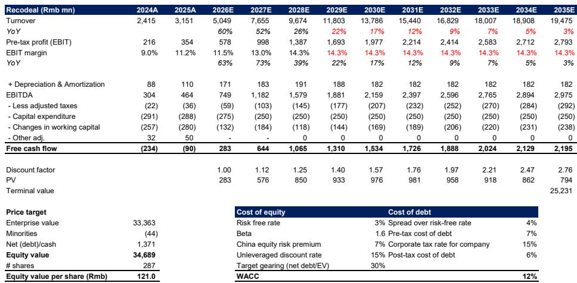
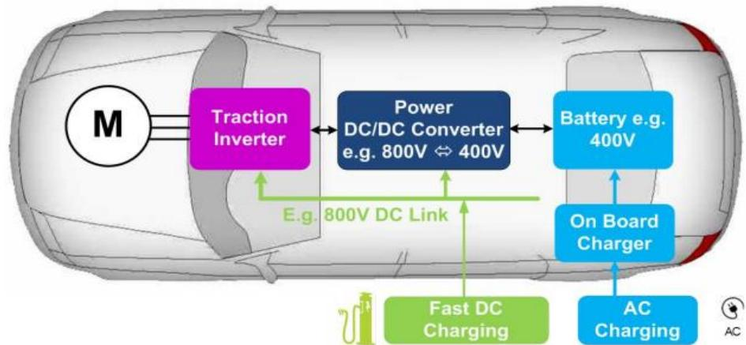

# China’s 800V EV Supply Chain Is About to Power the AI Data Center Revolution

The same high-voltage engineering that enabled Chinese electric vehicles to charge in under ten minutes is now being repurposed for a far more demanding customer: the AI data center. A global investment bank report has identified a structural convergence between the maturing 800V electric vehicle supply chain in China and the emerging 800V high-voltage direct current architecture required by next-generation AI factories. This is not a speculative crossover. It is a logical extension of engineering capability, manufacturing scale, and cost efficiency that has already begun to generate tangible revenue for select suppliers. The argument is straightforward: the components, semiconductors, and systems that China’s auto industry has spent years perfecting for 800V EVs are now technically adjacent to what AI data centers need, and the companies that move first will capture a new growth cycle.

The timing matters because the window for entry is narrowing. AI data center construction is accelerating globally, and the shift from 400V AC to 800V DC power distribution is a recognized industry roadmap. Yet most auto suppliers have not won orders in this space. The report identifies why: qualification requirements for data center reliability, 24/7 continuous operation, and infrastructure-level certification create hurdles that take time to clear. But the rewards for those who do clear them are substantial. The report doubles its rating on one Chinese connector supplier from Underweight to Overweight, explicitly citing AI-driven revenue inflection starting in 2026. This is a signal that the migration has moved from theoretical to commercial.

The core insight for investors is that the 800V EV supply chain in China is no longer just an automotive story. It is becoming an infrastructure story. And the companies best positioned are not necessarily the largest, but those with specific high-voltage component expertise that can be adapted with minimal redesign. The report maps this landscape, identifies the key players, and raises several unresolved questions that will determine which suppliers ultimately win.

## The 800V EV Supply Chain Has Reached a Maturity That Makes Cross-Industry Migration Inevitable

China’s 800V EV penetration has risen from 5% in 2023 to 11% in 2025, and this growth has cultivated a deep, competitive, and increasingly standardized supply chain. The ecosystem spans upstream auto semiconductors such as silicon carbide substrates and gallium nitride devices, downstream electronics including inverters, on-board chargers, and DC-DC converters, and auxiliary components like connectors, relays, and fuses. Each of these categories has seen years of cost reduction, reliability improvement, and manufacturing scale-up driven by the intense price competition of China’s EV market.

This maturity matters because the 800V architecture required by AI data centers is structurally similar. Both systems need to deliver high power without allowing current, cable size, heat, and conversion losses to scale proportionally. In EVs, 800V enables faster DC charging and lighter cabling. In data centers, shifting from 400V AC to 800V DC enables higher rack power, reduced copper usage, fewer conversion stages, and improved end-to-end efficiency. The technical overlap is not superficial. Both require high-voltage distribution, protection devices, power conversion, and thermal management. The components that auto suppliers have already commercialized are not drop-in replacements, but the engineering expertise is directly transferable.

The report highlights that several Chinese auto suppliers have already partnered with Nvidia’s next-generation 800V DC AI factories. This is not a coincidence. It is evidence that the qualification process, while slow, is already underway. The question is no longer whether the migration will happen, but which suppliers will capture the most value and how quickly the revenue ramp will materialize.

## Generic High-Voltage Components Will Lead the Migration, While Tier-1 Systems Require Redesign

Not all parts of the 800V EV supply chain are equally positioned for the AI data center opportunity. The report distinguishes between two categories: generic high-voltage components that can be adapted with relatively minor changes, and integrated tier-1 systems that require substantial redesign to meet data center requirements.

Generic components such as semiconductors and connectors are best positioned. Silicon carbide power devices, high-voltage connectors, and protection components like eFuses share core engineering principles between automotive and data center applications. The performance requirements differ, but the fundamental physics and manufacturing processes are similar enough that suppliers can leverage existing production lines and qualification data. This is why the report identifies a Chinese connector supplier as the most immediate beneficiary. Its experience in high-voltage connectors for 800V EVs provides a direct foundation for supplying power whips and active electrical cables to AI data centers. The report expects AI interconnects to contribute over 40% of this supplier’s revenue by 2027.

Tier-1 systems such as DC-DC converters, on-board chargers, and battery management systems face a more difficult path. These components are designed for the dynamic load conditions of an EV, where power flows vary with driving behavior. Data centers require stationary, high-utilization power infrastructure with tighter voltage regulation, bidirectional power flow, and facility-level controls. Auto-grade products must be redesigned, not simply repurposed. The report notes that several US auto suppliers, including Aptiv, BorgWarner, Magna, and Lear, are exploring this opportunity, but the timeline for qualification and revenue generation is longer. In China, a supplier with a substantial 800V order backlog from German luxury OEMs is on the watch list for potential data center applications, but the report emphasizes that customer verification will take time.

This distinction has important implications for investment strategy. Companies focused on generic high-voltage components offer nearer-term revenue visibility. Those in tier-1 systems may offer larger total addressable markets but require patience and tolerance for qualification risk.

## The Report Raises Three Unresolved Questions That Will Determine the Winners

While the report provides a clear framework for the migration, it also leaves several meaningful questions unanswered. These are not gaps in analysis but rather areas where outcomes remain uncertain and will depend on execution, market dynamics, and technological evolution.

First, how quickly will Chinese auto suppliers gain credibility with hyperscale data center operators? The qualification process for data center components is notoriously rigorous, and auto suppliers lack established relationships with cloud service providers. The report notes that few auto suppliers have won orders so far, and those that have are still in early stages. The speed of adoption will depend on whether suppliers can demonstrate infrastructure-level reliability and build trust with a new customer base. The joint venture model, where an auto supplier partners with an established data center component maker, may accelerate this process, but it also dilutes margins and control.

Second, will the 800V DC architecture become the dominant standard for AI data centers, or will alternative approaches emerge? The report assumes continued migration toward 800V DC, but the data center industry is fragmented, and different operators may choose different voltage levels or distribution architectures. If alternative standards gain traction, the specific 800V expertise of auto suppliers may become less valuable. The report does not fully explore this risk, and investors should monitor industry roadmaps closely.

Third, can Chinese auto suppliers compete on price and reliability against established data center power specialists? The global data center power market is dominated by companies with decades of experience in mission-critical infrastructure. Chinese auto suppliers have cost advantages from scale and vertical integration, but they lack the track record that data center operators demand. The report suggests that cost leadership will be a decisive factor, but it remains to be seen whether Chinese suppliers can match the reliability standards of incumbents while maintaining their pricing advantage.

## A Decision Framework for Investors Evaluating the 800V Cross-Over Opportunity

For investors considering exposure to this theme, the report implicitly provides a three-step decision framework. The first step is to identify which part of the 800V supply chain a company occupies: generic components or integrated systems. This determines the time horizon and risk profile of the opportunity. The second step is to assess qualification progress. Companies that have already secured partnerships or orders from data center operators, even at early stages, have a clear lead. The third step is to evaluate revenue diversification. Companies with strong existing businesses in EV or energy storage can absorb the costs of data center qualification without jeopardizing their core operations, while pure-play suppliers face higher execution risk.

The report’s upgrade of a Chinese connector supplier illustrates this framework in practice. The company had faced margin pressure in its core EV connector business due to OEM price cuts and increased competition. But its entry into AI data center interconnects, supported by a joint venture with an optical transceiver supplier, creates a new growth engine that the report expects to transform its revenue profile by 2027. The qualification process is underway, the technology is adjacent, and the revenue potential is material. This is the kind of asymmetric opportunity that the broader 800V migration offers, but only for companies that execute on all three dimensions of the framework.

## The Full Report Contains the Charts and Data That Make This Thesis Investable

The analysis above is based on a detailed research report that includes supply chain maps, component comparisons, and revenue forecasts for the key players. The report identifies specific Chinese auto suppliers with 800V exposure, maps their potential data center applications against US peers, and provides bull and base case scenarios for revenue contributions from AI interconnects. It also includes the original charts that illustrate the architectural similarity between 800V EV and 800V AIDC systems, which are essential for understanding the technical argument.

Join the community to read the full report and review the original charts.

*This article is for learning and discussion only and does not constitute investment advice.*

Personal reading notes and learning share only. Not investment advice.

