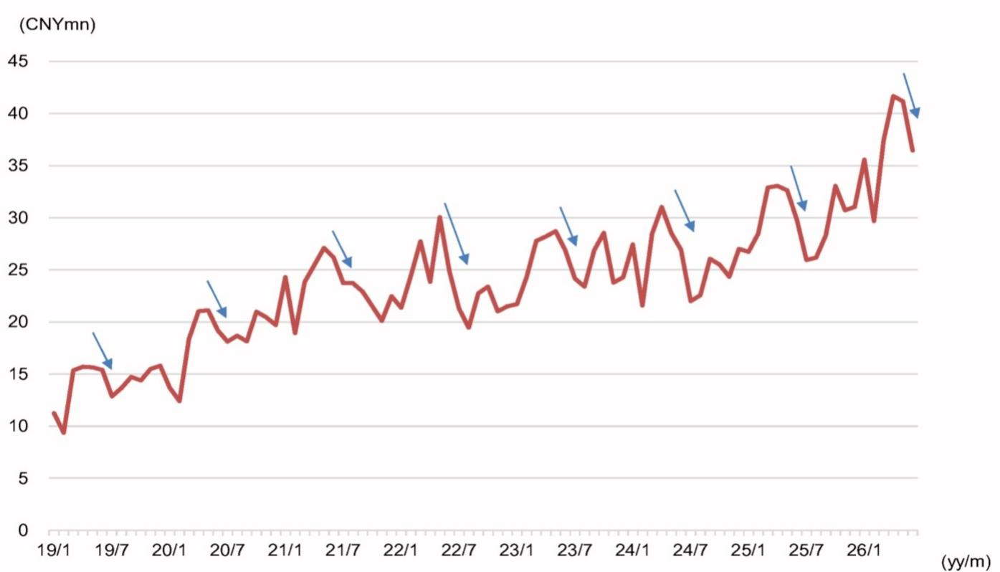
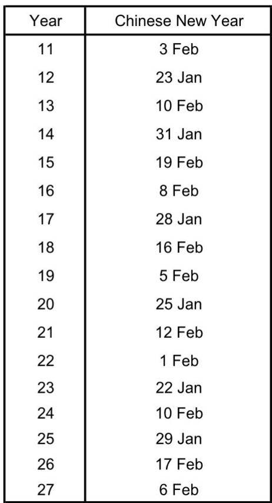
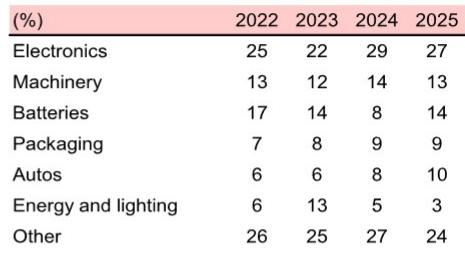

# Airtac's June Surge Is Not Just Cyclical: It Signals a Structural Shift in China's Industrial Automation Demand

The numbers are striking. Airtac, the Taiwanese pneumatic equipment manufacturer that derives roughly 90% of its sales from China, reported June revenue up 28% year-on-year in renminbi terms. Quarterly sales for April through June reached TWD 12.2 billion, exceeding analyst forecasts by more than 5%. When a bellwether for Chinese industrial demand posts these figures in the face of persistent macroeconomic uncertainty, the market must ask whether this is simply another cyclical upswing or something more enduring.

The answer matters because Airtac's sales patterns have historically served as a leading indicator for broader machinery demand in China. The company's pneumatic components are embedded in everything from electronics assembly lines to automotive manufacturing plants. When Airtac ships more, Chinese factories are building more. The question is whether this momentum can sustain itself beyond the current quarter.

This article argues that the June data point is not merely a seasonal rebound or a one-off beat. It reflects a structural re-rating of China's industrial automation demand, driven by policy priorities embedded in the 15th Five-Year Plan and a rebalancing of end-user industry composition. Investors who interpret this as a temporary cycle risk missing the larger strategic shift underway.

The evidence is in the details. Airtac's management has stated that order values continue to exceed shipment values, and both metrics are trending above internal expectations. This is not the language of a company riding a transient wave. It is the language of a company whose capacity is being tested by sustained demand. The critical analytical task is to decompose where that demand is coming from and whether the sources are durable.

---

## The Battery and Machine Tool Verticals Are Driving an Unprecedented Demand Concentration That Changes the Risk Profile

The most telling data point from the June report is not the aggregate 28% year-on-year growth. It is the composition of that growth across user industries. Battery-related sales surged an estimated 50% year-on-year, machine tools rose 45%, and electronics grew 25%. These three verticals alone account for more than half of Airtac's sales weighting, and they are all expanding at rates that outpace the company's historical average.

This concentration has a dual implication. On the one hand, it signals that China's industrial policy is successfully channeling capital into specific high-priority sectors. The 15th Five-Year Plan explicitly targets smart manufacturing and industrial advancement, and the battery and machine tool industries are direct beneficiaries. On the other hand, it means Airtac's performance is increasingly tied to the fortunes of a narrower set of end markets. A slowdown in EV battery investment or a correction in semiconductor equipment spending would hit the company harder today than it would have three years ago, when its sales mix was more diversified.

The auto industry provides a useful cautionary note. Airtac's auto-related sales rose 30% year-on-year in June, and the absolute level of sales to this vertical has continued to climb. Yet Chinese machine tool orders from the automotive sector hit an all-time high in May. History suggests that when a cyclical industry peaks, the subsequent correction can be swift. The question is whether the battery and electronics verticals have enough structural runway to absorb any potential slowdown in autos.

Investors should monitor the monthly trajectory of Airtac's daily sales within these high-growth verticals. The data shows that electronics and battery sales have been on a slight downward trend since peaking in April. If this continues, the headline growth rate will become increasingly dependent on machine tools and autos, which are themselves cyclical.

---

## The Seasonal Pattern Is Masking a Deeper Acceleration That Becomes Visible Only When Adjusted for Business Days

A superficial reading of the June data might raise concerns. Month-on-month sales declined 1%, and daily sales fell 11% month-on-month. For an investor focused on momentum, these figures could appear bearish. But this interpretation would be analytically flawed because it ignores the well-established seasonal pattern in Airtac's business.

Daily sales at Airtac have consistently declined in June and July across multiple years, as shown in the reference data. The seasonal dip is a function of factory maintenance schedules, inventory adjustments ahead of the second-half production ramp, and in some years, the timing of Chinese New Year. The relevant metric is not the month-on-month change but the year-on-year comparison, which strips out seasonality and reveals the underlying trend.

When viewed through this lens, the picture is unambiguous. June 2026 daily sales were up 22% year-on-year. The second quarter as a whole showed acceleration relative to the first quarter, with April-June sales exceeding forecasts. This is not a company that is losing steam. It is a company that is operating at elevated capacity within the constraints of a seasonal calendar.

The more subtle implication is that the seasonal pattern itself may be shifting. If structural demand from battery and machine tool customers continues to grow, the traditional summer lull could become shallower over time. Investors should watch whether Airtac's July data this year deviates from the historical pattern. A smaller-than-expected month-on-month decline in July would be a powerful confirmation that the structural thesis is playing out.

---

## The Report Raises a Critical Unanswered Question: How Sustainable Is the Machine Tool Order Cycle in China?

A global investment bank report on Japan machinery notes that machine tool orders tracked by the Japan Machine Tool Builders' Association could peak in the near term, partly for seasonal reasons. This is a carefully hedged statement, but its implications for Airtac are significant. Machine tools represent 8% of Airtac's sales mix, but the vertical grew 45% year-on-year in June, making it one of the fastest-growing segments.

The concern is that machine tool orders are notoriously cyclical. They tend to surge during periods of capacity expansion and then contract sharply when investment cycles turn. The data shows that Chinese machine tool orders for general machinery rose 97% year-on-year in April 2026 and 74% in May. These are extraordinary growth rates that are unlikely to persist indefinitely. If machine tool orders peak and begin to decline, Airtac would lose one of its primary growth engines.

What the report does not fully answer is whether the current machine tool cycle is different from previous ones because of policy support. The 15th Five-Year Plan includes specific provisions for AI and data center-related investment, which could sustain demand for precision machining equipment even if traditional industrial investment slows. The report acknowledges this possibility but does not quantify it.

This is the analytical gap that investors need to fill. The sustainability of Airtac's growth depends on whether the machine tool and battery verticals are being driven by one-time capacity builds or by ongoing operational demand. If the former, the cycle has a finite life. If the latter, the growth may have more room to run.

---

## A Decision Framework for Evaluating Airtac's Trajectory Through the Second Half of 2026

For investors trying to position around this data, a structured framework is more useful than a binary buy-or-sell view. The following three-factor model captures the key variables that will determine whether Airtac's momentum continues or falters.

First, monitor the monthly sales trajectory in the battery and electronics verticals. These two segments together account for 44% of Airtac's sales mix. If their month-on-month decline from April peaks continues into July and August, it would suggest that the initial surge was inventory-driven rather than demand-driven. If they stabilize or rebound, the structural thesis gains credibility.

Second, track the relationship between order value and shipment value. Airtac's management has stated that orders consistently exceed shipments. As long as this spread remains positive, the company has a built-in buffer against any near-term demand softness. A narrowing of this gap would be the earliest warning sign of a deceleration.

Third, watch Chinese industrial production data for the battery and machine tool sectors. The report provides reference figures showing that Li-ion battery production and machine tool output are both in growth territory. If these indicators start to roll over, Airtac's revenue growth will follow with a lag of one to two months.

This framework does not provide a single answer, but it gives investors a set of leading indicators that are more actionable than the headline revenue number alone. The key insight is that Airtac's performance is now a proxy for the success of China's industrial policy, not just a reflection of the macroeconomic cycle.

---

## The Full Picture Requires Granular Data That Cannot Be Captured in a Single Monthly Release

The June sales data is undeniably positive, but it leaves several strategic questions unanswered. How much of the growth is price-driven versus volume-driven? What is the trajectory of Airtac's order backlog in absolute terms? How does the company's capacity utilization compare to historical peaks? These are the kinds of questions that require access to the full research report and the underlying charts.

The original report contains detailed exhibits that track Airtac's daily sales against Komtrax operating hours, China social financing data, and machine tool orders over a multi-year horizon. These comparisons reveal patterns that are invisible in a single month's data. For example, the correlation between Airtac sales and Komtrax operating hours has weakened in recent quarters, suggesting that Airtac is gaining market share or benefiting from a shift in product mix. This is the kind of insight that only emerges from systematic cross-referencing of multiple data series.

Investors who rely solely on headline numbers will miss these nuances. The difference between a cyclical trade and a structural investment often comes down to understanding the granularity beneath the surface.

Join the community to read the full report and review the original charts.

*This article is for learning and discussion only and does not constitute investment advice.*

Personal reading notes and learning share only. Not investment advice.

