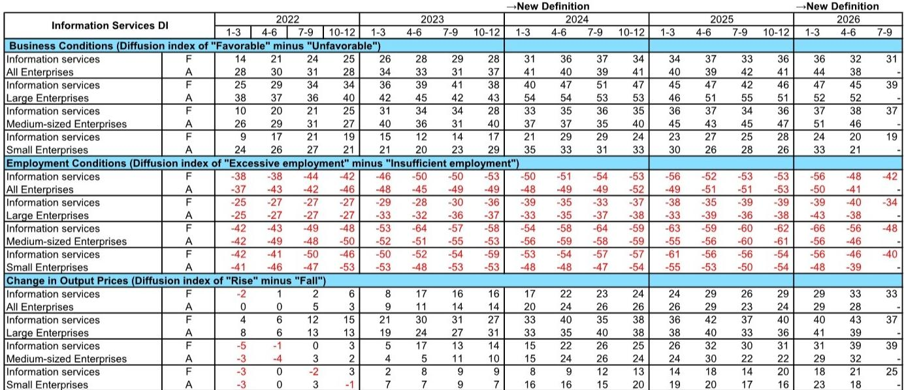

# GS：日本IT服务供给紧张缓解，但AI驱动的利润率分化才刚刚开始

日本IT服务行业正站在一个关键的转折点上。市场普遍关注的是工程师短缺何时缓解、单价能否持续提升，但一份来自GS的深度研报揭示了一个更微妙的信号：供给紧张整体上正在小幅缓解，然而，AI开发效率的提升正在少数头部系统集成商内部酝酿，这可能导致行业利润率的差距在未来几个季度急剧拉大。

这份基于日本央行2026年6月短观调查详细数据的报告，其核心判断并非简单的“景气度向好”或“供给依然紧张”，而是指向一个正在发生的结构性分化。那些率先将AI嵌入开发流程的公司，正在获得一种超越传统人力供给瓶颈的竞争优势。对于关注日本科技股和全球IT服务外包格局的投资者而言，这可能是未来12至18个月最重要的观察变量。

## 1. 软件投资计划大幅上修，但驱动力正在从“现代化”切换至“AI需求”

GS报告中最引人注目的数据点，是2026财年（截至2027年3月）全行业软件投资计划被大幅上修至同比增长12.4%，较3月调查提升了5.3个百分点。其中，制造业的修正尤为显著，从5.1%的增速预期跳升至21.0%。

表面上看，这是企业数字化转型（DX）和现代化改造需求的延续。但GS分析师明确指出，当前的驱动力正在发生质变。报告原文提到，除了传统的主机现代化需求，**“咨询、网络建设和网络安全”领域的需求正在涌现，其背后是企业对AI应用日益增长的兴趣。** 这是一个关键信号：日本企业的IT支出，正从被动的系统维护和合规性升级，转向主动的、以AI能力建设为导向的战略投资。

> **KC评论：** 投资者不应只看到12.4%这个数字，而应追问这个数字背后的结构。如果增长主要由AI相关的咨询和基础设施投入驱动，那么受益方将不是所有IT服务公司，而是那些有能力承接高附加值咨询和复杂系统集成的头部企业。报告中的细分数据，如银行业软件投资计划增长19.8%和零售业增长20.2%，都暗示了AI应用（如智能客服、风控模型、供应链优化）正在成为新的预算来源。完整报告中对各子行业投资计划的详细拆解，是理解这一结构性变化的第一手资料。

## 2. 工程师短缺小幅缓解，但大型系统集成商并未受益

GS报告中一个看似矛盾但实则关键的发现，体现在就业条件DI（Diffusion Index）上。2026年6月，信息服务业的就业条件DI为-41，较3月的-50改善了9个点，主要由中型和小型企业推动。这似乎表明，整个行业的“人才荒”有所缓和。

然而，当聚焦于大型企业（即主要的系统集成商）时，情况完全不同。大型企业的就业条件DI为-40，与过去12个月的平均水平几乎持平，表明其面临的工程师短缺压力没有丝毫减轻。这背后的逻辑并不复杂：大型系统集成商承接的是最复杂、最核心的数字化转型和AI项目，对高级工程师的需求最为刚性。当市场出现新增供给时，这些人才往往被中型企业或新兴AI初创公司分流，而大型企业的核心项目团队依然处于满负荷甚至超负荷运转状态。

> **KC评论：** 这就引出一个核心问题：如果大型系统集成商始终招不到足够的人，它们如何消化激增的软件投资订单？答案是：必须改变生产方式。GS报告敏锐地捕捉到了这一点，并指出“AI驱动的开发”正在成为破局的关键。这解释了为何报告特别点名了Fujitsu、NRI和NEC等公司，认为它们在AI驱动的开发方面走在前列。对于这些公司而言，AI工具不是锦上添花，而是解决产能瓶颈的必选项。

## 3. 产出价格持续上涨，但成本转嫁能力正成为分水岭

与供给紧张并存的是，信息服务业的产出价格DI（衡量销售价格涨跌的指标）和投入价格DI均维持在历史高位，且9月份的预期DI显示两者将进一步上升。这意味着，IT服务的单价仍在上涨通道中，整个行业的基本面依然健康。

但GS报告暗示了一个更深层的担忧：并非所有公司都能有效地将上涨的投入成本（主要是人力成本）转嫁给客户。报告提到，产出价格DI和投入价格DI的差值，以及不同规模企业之间的DI差异，都值得仔细推敲。大型企业凭借其品牌、技术壁垒和关键客户关系，拥有更强的议价权。而中小型企业，尤其是在非核心领域竞争的公司，可能面临“成本涨、单价不涨”的利润挤压。

> **KC评论：** 这是典型的行业集中度提升的逻辑。在通胀和人才短缺的双重压力下，IT服务行业的“马太效应”会加速显现。那些能够将AI工具转化为内部生产效率，并同时向客户收取更高咨询和开发费用的公司，将实现利润率的双重提升。反之，那些仅仅依赖堆人头、缺乏技术壁垒的公司，将陷入增长不增利的困境。GS报告中对“AI驱动开发”进展的描述——目前只有少数几家公司在推进，整体行业进展缓慢——恰恰是判断哪些公司能跨越这个分水岭的关键线索。

## 4. 报告尚未完全回答：AI驱动的效率提升何时体现在利润表上？

GS报告提出了一个极具前瞻性的观点：AI驱动的开发效应将“逐渐显现”，并“可能对行业的供需趋势产生轻微影响”。但报告也坦诚地指出，除了Fujitsu、NRI和NEC等少数公司外，整个行业在这方面的努力“仍然缓慢”。在日本劳动人口持续下降的背景下，AI开发尚不足以“从根本上解决当前的工程师短缺问题”。

这恰恰是报告最引人入胜，也最需要进一步探讨的地方。报告给出了方向，但没有给出具体的时间表和量化影响。例如：
- Fujitsu的AI开发实践，究竟能将其核心项目的交付周期缩短多少？
- 这种效率提升，是会转化为更高的利润率，还是会被迫降价以争夺市场份额？
- NRI和NEC的AI开发进展与Fujitsu相比，处于什么阶段？
- 对于没有提及的NTT Data等其他大型系统集成商，它们的AI战略是什么？

这些问题的答案，直接决定了这些公司未来2-3年的盈利预测是否会被上调。GS报告中的图表（如各公司软件投资计划与DI的对比）为这些问题的分析提供了基础框架，但更深层的拆解，需要结合公司层面的资本开支计划、研发投入和项目交付数据。

## 5. 给决策者的观察框架：三个必须追踪的指标

基于这份GS报告的逻辑，投资者和产业决策者需要建立一个全新的观察框架，来追踪AI对日本IT服务行业的真实影响。三个核心指标值得持续关注：

**第一，大型系统集成商的季度人均产出或项目利润率。** 这是衡量AI开发效率是否真正落地的最终标尺。如果一家公司人数增长放缓，但收入和利润加速增长，这往往是AI赋能的最佳证据。

**第二，AI相关业务（咨询、网络建设、安全）的收入占比和增速。** 报告已经暗示，这部分业务将成为未来增长的主要引擎。那些能率先将AI咨询能力货币化的公司，将获得更高的估值溢价。

**第三，工程师薪酬增速与公司整体收入增速的差值。** 在AI工具未能大规模应用前，工程师薪酬增速通常会侵蚀利润率。如果一家公司能够通过AI工具实现“人效”提升，使其收入增速持续跑赢薪酬增速，那么它就在这场结构性分化中占据了有利位置。

GS这份报告的价值，在于它没有停留在对宏观数据的简单解读，而是精准地指出了行业正在发生的、由AI驱动的微观结构性变化。它提醒我们，在看似稳定的“供给紧张、价格上涨”叙事背后，一场关于生产力和利润率的竞赛已经悄然开始。决定胜负的关键，不在于拥有多少工程师，而在于如何利用AI让每一位工程师发挥出数倍于前的价值。

---

**更多关于日本IT服务和全球AI产业链的深度信源汇编与边际变化观测，我们每日更新，汇总国际主流投行、智库和产业机构的最新叙事、数据和图表。这里汇聚了头部券商、PE/VC、投行、并购、对冲基金、资管机构、战略咨询和智库的朋友们。如果你也在追踪这些结构性变化，欢迎扫码交流，与我们一同探讨报告背后那些尚未完全解答的关键问题。**

Personal reading notes and learning share only. Not investment advice.

