The SOFC opportunity; undersupplied through 2030

\- SOFC penetrates AIDC BTM prime power due to 3-4 month lead times, zero-NOx operation, and efficient native-DC output

US/Korea/Taiwan/EU driving adoption; by 2030: capacity is scaling up to 5GW+; DOE targets at USD900/kW system cost

\- We like Buy-rated Bloom (global SOFC leader) and Weichai (gas/diesel engine; SOFC capacity ramping)

SOFC is penetrating AIDC for “behind-the-meter” prime power (ex. 2), despite high CAPEX and recurring 5-7 years’ stack replacement costs, due to:

1) shorter lead time of 3-4 months vs 1-2 years for engines, 3-5 years for turbines;  
2) clean with no NOx emission via electrochemical reactions versus combustion;  
3) efficient high electrical efficiency (55-65%), native direct current eliminating costly AC-DC conversion losses. Aligning 800V HVDC architectures is a next-gen approach that reduces USD1-2bn of BOP conversion equipment and improves token/kW.

Beyond the US and AIDC: Ceres estimates SOFC TAM will reach 22GW by 2030. Apart from 24% US market and c50% DC usage, other highlights include: 1) South Korea: Utility scale commercialization is supported by National Clean Hydrogen Portfolio Standard; 2) Taiwan: grid fragility, stringent RE100 requirements for semi fabs and subsidies accelerate localized microgrid deployments; 3) EU: carbon pricing and marine propulsion decarbonization drive broader SOFC adoption.

Scale-up and cost-down pathway: Bloom targets 2GW before YE-2026 and possibly 5GW by 2030, while Ceres's partners (Weichai, Doosan, Delta) targets c100MW by end 2026 and c1GW by 2030. Key bottlenecks include the supply of Scandium, ceramic electrolytes, and Balance of Plant components (c70% of system cost). Economies of scale and lower-temperature metal-supported architecture will drive cost reduction in longer term. We believe Bloom has largely de-risked its expansion plans while management's double-digit annual cost-down target will be aided by Moore's Law. Rystad estimates SOFC system costs will fall 20-25% by 2030, vs DOE total system CAPEX of USD900/kW by 2030e (from USD3,000/kW).

Related companies along the value chain include Ceres (SOFC tech developer), Doosan Fuel Cell (SOFC leader in South Korea), Delta (SOFC leader in Taiwan), Three-Circle (BE's key electrolyte supplier), Kaori (BE's hot box supplier).

We like Buy-rated Bloom (global SOFC leader) and Weichai (gas/diesel engine; SOFC capacity ramping). Key downside risks include slower AIDC buildout, elevated SOFC capital costs, and quicker capacity ramp of gas turbines and gensets.

Global

## Helen Fang\*

Head of Industrials Research, Asia Pacific
The Hongkong and Shanghai Banking Corporation Limited
helen.c.fang@hsbc.com.hk
+852 2996 6942

## Samantha Hoh, CFA

Senior Analyst, Clean Tech
HSBC Securities (USA) Inc.
samantha.hoh@us.hsbc.com
+1 212 525 8783

## Sean McLoughlin\*

Senior Global Industrials Analyst
HSBC Bank plc
sean.mcloughlin@hsbcib.com
+44 20 7991 3464

## Sunny SUN\*

Associate, Asia Industrials
The Hongkong and Shanghai Banking Corporation Limited
sunny.x.y.sun@hsbc.com.hk
+852 3945 3230

## Jennifer Pan\*

\* Employed by a non-US affiliate of HSBC Securities (USA) Inc, and is not registered/ qualified pursuant to FINRA regulations

Our global coverage of companies that provide SOFC

<table><tr><td>Company</td><td>Ticker</td><td>Currency</td><td>Current price</td><td>TP Unchanged</td><td>Rating Unchanged</td><td>Upside/ downside</td><td>Market cap (USDm)</td><td>3m ADTV (USDm)</td><td>P/B 2026e</td><td>P/E 2026e</td><td>ROE 2026e</td></tr><tr><td>Bloom Energy</td><td>BE US</td><td>USD</td><td>302.70</td><td>350.00</td><td>Buy</td><td>15.6%</td><td>86,101</td><td>2,851.5</td><td>61.4</td><td>127.2</td><td>67.6</td></tr><tr><td>Weichai Power – H</td><td>2338 HK</td><td>HKD</td><td>34.10</td><td>50.00</td><td>Buy</td><td>46.6%</td><td>35,400</td><td>102.5</td><td>3.0</td><td>17.5</td><td>12.2</td></tr><tr><td>Weichai Power – A</td><td>000338 CH</td><td>CNY</td><td>27.25</td><td>42.00</td><td>Buy</td><td>54.1%</td><td>35,400</td><td>530.4</td><td>2.7</td><td>16.1</td><td>12.2</td></tr></table>

Source: LSEG Eikon, HSBC estimates. Priced as of close on 30 June 2026

## Disclosures & Disclaimer

This report must be read with the disclosures and the analyst certifications in the Disclosure appendix, and with the Disclaimer, which forms part of it.

Issuer of report: The Hongkong and Shanghai Banking Corporation Limited

View HSBC Global Investment Research at: https://www.research.hsbc.com

1: Simplified power structure of a datacentre  
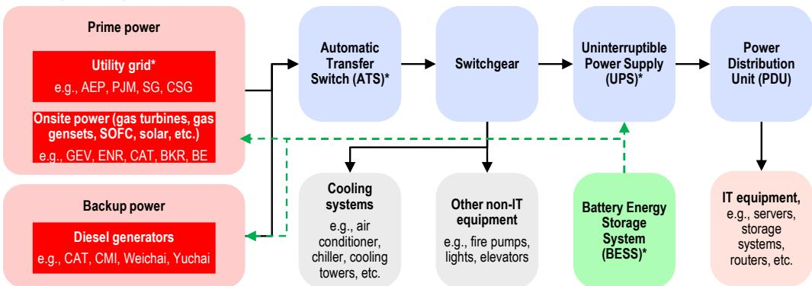  
Source: Company data, coresite.com, Blueocean, HSBC; \*We highlight some relevant companies for utility power and grid operation companies, i.e., American Electric Power (AEP US, not rated), PJM Interconnection (PJM, private), SG (State Grid group, private) and CSG (China Southern Power Grid, private). ATS continuously monitors utility power and shifts the load to backup generators during power outages. UPS is a battery-backed solution used to bridge the grid operation for servers until the backup generators take over the grid supply. Most UPSs have an average capacity of 50 to 300kW, providing around 20-30 minutes of backup power in case of sudden outages. BESS is essentially large-scale rechargeable battery banks with intelligent controls, capable of storing electricity and discharging it on demand. In a datacentre, a BESS typically integrates with the facility's power infrastructure (often alongside UPS units and generators) to provide a reservoir of instantly available energy.

## Comparison of major behind-the-meter prime power solutions

2: Comparison of major prime power solution in the US

<table><tr><td>Metric</td><td>Solid Oxide Fuel Cells (SOFC)</td><td>Aeroderivative GT</td><td>Industrial GT</td><td>Small / Medium CCGT</td><td>H-Class CCGT</td><td>Medium-Speed RICE</td><td>High-Speed RICE</td></tr><tr><td>Typical Unit Size (MW)</td><td>0.3 - 1.0 (Modular Blocks)</td><td>30 - 60</td><td>5 - 50</td><td>40 - 100</td><td>600 - 1,000</td><td>7 - 20</td><td>3 - 5</td></tr><tr><td>Equipment Lead Time</td><td>3 - 4 Months</td><td>18 - 36 Months</td><td>12 - 36 Months</td><td>18 - 36 Months</td><td>36 - 60 Months</td><td>15 - 24 Months</td><td>15 - 24 Months</td></tr><tr><td>Electrical Efficiency</td><td>55% - 65%</td><td>35% - 40%</td><td>35% - 40%</td><td>40% - 55%</td><td>50% - 60%</td><td>40% - 50%</td><td>40% - 50%</td></tr><tr><td>Equipment Cost (USD/kW)</td><td>3,500 - 5,000;2,100-3,500 post subsidies, incl. BOP</td><td>1,000 - 1,200</td><td>1,000 - 1,500</td><td>1,100 - 1,600</td><td>1,000 - 1,400</td><td>700 - 1,100</td><td>500 - 900</td></tr><tr><td>Fully Installed Capital Cost (USD/kW)</td><td>2,800 - 4,500 post subsidies</td><td>1,600 - 1,800</td><td>1,400 - 1,800</td><td>1,700 - 2,300</td><td>1,600 - 2,000</td><td>1,400 - 1,800</td><td>1,200 - 1,600</td></tr><tr><td>LCOE (USD/MWh)</td><td>100 - 200</td><td>80 - 130</td><td>65 - 110</td><td>85 - 160</td><td>60 - 100</td><td>80 - 150</td><td>120 - 200</td></tr><tr><td>Major Maintenance</td><td>Every 5-7 years: complete stack replacements</td><td>Every 3-4 years: Hot gas path overhauls, turbine blade degradation</td><td>Every 4-5 years: Scheduled combustion overhauls</td><td>Every 4-6 years: Complex steam-cycle integration, turbine overhauls.</td><td>Every 4-5 years: Major statutory outage overhauls</td><td>Every 4-5 years: Mid-life top overhauls, bearing inspections</td><td>Every 1-2 years: Frequent lube oil/filter changes, valve adjustments</td></tr><tr><td>Native Output</td><td>Direct Current, Native 800V</td><td>Alternating Current</td><td>Alternating Current</td><td>Alternating Current</td><td>Alternating Current</td><td>Alternating Current</td><td>Alternating Current</td></tr><tr><td>Criteria Emissions</td><td>Negligible / Zero (No combustion)</td><td>Moderate to High (Requires costly SCR)</td><td>Moderate to High</td><td>Moderate (Thermal NOx generation)</td><td>Low to Moderate (Highly optimized utility scale)</td><td>High (Strict local air permit bottlenecks)</td><td>High (Strict local air permit bottlenecks)</td></tr><tr><td>Major Suppliers</td><td>Bloom Energy, Ceres – partnered with Doosan Fuel Cell, Weichai, Delta</td><td>GE Vernova, Siemens Energy, Solar Turbines (CAT)</td><td>Solar Turbines (CAT), Siemens Energy, Kawasaki</td><td>GE Vernova, Siemens Energy, Mitsubishi Power</td><td>GE Vernova, Siemens Energy, Mitsubishi Power</td><td>Wartsila, Everllence, Caterpillar</td><td>Caterpillar, INNIO, Rolls-Royce (MTU), Cummins, Weichai, Yuchai</td></tr></table>

Source: SemiAnalysis, NREL (National Renewable Energy Lab), EIA (Energy Information Administration), Gas Turbine World, DOE (Department of Energy), HSBC; LCOE = Levelized cost of energy, which is a metric that calculates the average cost to generate one unit of electricity over the entire lifetime of a power plant, including initial capital costs, fuel, operations, maintenance, and decommissioning; Fully installed capital cost include all expenses beyond the bare equipment price, such as transportation, civil works, balance-of-plant systems (incl. fuel storage, emissions treatment, cooling, electrical switchgears and transformers, etc.), electrical interconnection, permitting, commissioning, etc., representing the full capital outlay required to bring the system into commercial operation; GT = Gas turbine; CCGT = combined cycle gas turbines; RICE = reciprocating internal combustion engines.

## Rising BTM

Rystad estimates c40% of 2026-30e US data center capacity additions will be located behind-the-meter (BTM). Of a total of 11 GW announced BTM projects, 85% have plans to utilize natural gas for firm power delivery while 10% target renewables and 4% will build out new nuclear capacity. The gap between renewables and nuclear is notable as it highlights the value of dispatchable power for hyperscale's navigating between scaling infrastructure and decarbonization.

3: US data center cumulative upcoming added capacity by power sourcing strategy (GW)  
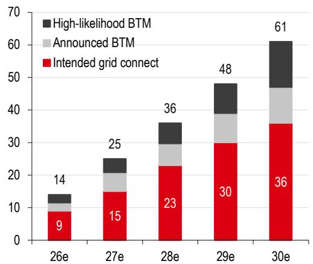  
Source: Rystad Energy estimates, HSBC  
4: Announced BTM fuel mix

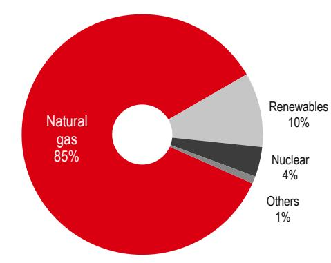  
Source: Rystad Energy, HSBC

Bloom's bi-annual survey of US-based data centre developers find access to power remains the leading constraints for new projects. Longer and less predictable grid interconnection timelines are driving operators to develop materially larger data center campuses and incorporating onsite power generation, signaling a structural shift away from the traditional reliance on the grid. One-third of developers expect to operate fully permanent onsite power by 2030, rising to $45\%$ by the end of 2035.

5. Access to power is the main consideration for US DC developers  
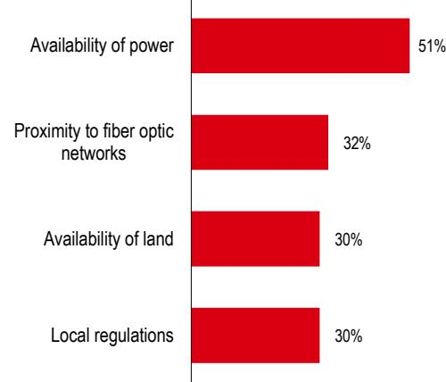  
Source: Bloom Energy 2026 Mid-Year Data Center Power Report, HSBC

6. % of data center developers anticipating 100% onsite power  
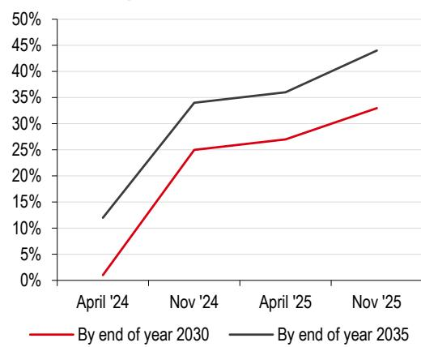  
Source: Bloom Energy 2026 Data Center Power Report, HSBC

## Comparison of Bloom Energy and Ceres Power

## 7: Global SOFC system competitive landscape, 2023

■ Bloom Energy (US commercial and industrial market, incl. AIDC, with 100-1,000kW system)

■ Mitsubishi Heavy Industries (mainly JP commercial and industrial market with 200-1,000kW system, even combined with gas turbines - MEGAMIE)

■ Aisin Seiki (mainly JP residential market with 700w output per stack)

Others

Source: Global Market Monitor, HSBC

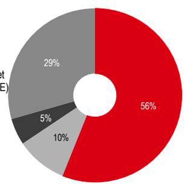

## 8: Comparison of Bloom Energy and Ceres Power

<table><tr><td></td><td>Bloom Energy (BE US)</td><td>Ceres Power (CWR LN) ecosystem</td></tr><tr><td>Business model</td><td>Asset-heavy integration &amp; equipment sales:builds its own factories; manufactures stacks, integrates BOP systems, and provides long-term O&amp;M services.</td><td>Asset-light IP licensing:earns licence fees, engineering/technical service fees, and long-duration royalties from system integrators (licensees).</td></tr><tr><td>Stack output</td><td>325kW to 80MW (under construction)</td><td>100kW to 108MW (in theory)</td></tr><tr><td>SOFC tech</td><td>Ceramic-base (high cost)</td><td>Steel-base (lower cost)</td></tr><tr><td>Operating temperature</td><td>900°C</td><td>450-630°C</td></tr><tr><td>Cold-start</td><td>Slow</td><td>Faster</td></tr><tr><td>Manufacturing partners</td><td>None. Production is in-house via its Silicon Valley facility and assembly plants in Delaware and Korea.</td><td>Doosan Fuel Cell (336260 KS), Weichai Power (2338 HK/000338 CH), Delta (2308 TT).</td></tr><tr><td>Capacity targets</td><td>2026: 2GW;2030: 5GW.</td><td>2026: Doosan&#x27;s 50 MW plant ready in July 2025; Weichai&#x27;s c30-200 MW plant in 2026-27E; Delta&#x27;s c10 MW by end-2026.2030: Weichai c1 GW.</td></tr><tr><td>AIDC order visibility</td><td>Very high: Oracle (2.8 GW indicative order) and AEP (1 GW framework agreement); USD20bn backlog extends beyond 2028 and excludes a USD25bn strategic AI infrastructure partnership to build AI factories globally with Brookfield Asset Management</td><td>Nil data centre orders yet, but inflection is approaching, as Doosan, Weichai and Delta are ramping up capacity.</td></tr><tr><td>Current average selling price</td><td>USD3,400 per kW (equipment CAPEX only; excludes long-term services and reforming/expansion options).</td><td>Weichai are estimated to price SOFC systems at USD3,000 per kW (RMB20,000 per kW).</td></tr><tr><td>Future ASP reduction targets</td><td>Double digit decline per year.</td><td>Ceres expects 30% cost cut in Endura platform at scale.</td></tr></table>

## Ceres's forecast on SOFC opportunity

9: Global market opportunity for solid oxide by end use case, 2030e

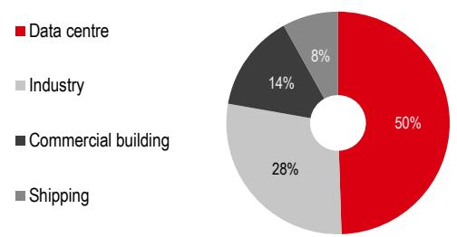  
Source: Ceres Power forecast, HSBC  
10: Global market opportunity for solid oxide by region, 2030e

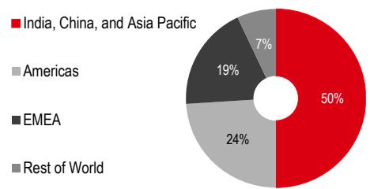  
Source: Ceres Power forecast, HSBC

11: Global market opportunity for SOFC

<table><tr><td>Region</td><td>Key Demand Drivers</td><td>Major Suppliers</td></tr><tr><td>South Korea</td><td>CHPS mandate; national hydrogen roadmap</td><td>Doosan; SK Ecoplant + Bloom</td></tr><tr><td>Taiwan</td><td>Semi/AI power needs vs weak grid; RE100; subsidies (up to NTD70k/kW)</td><td>Bloom; Doosan; Delta</td></tr><tr><td>Japan</td><td>Hydrogen strategy; ENE-FARM CHP legacy</td><td>Kyocera; MHI; Aisin; Bloom</td></tr><tr><td>Southeast Asia</td><td>Data centers shifting to Malaysia/Indonesia with unstable grid conditions</td><td>Weichai; Delta (local ops planned); Bloom in Singapore</td></tr><tr><td>Europe</td><td>High EU-ETS carbon price; IMO marine net-zero targets</td><td>Ceres (licensor); Alfa Laval (marine SOFC); Bloom in Italy, UK</td></tr><tr><td>Australia/India</td><td>Remote/off-grid (mining); DC backup</td><td>Early-stage; local partners with global SOFC players; Bloom in India</td></tr></table>

Source: government website, company data, HSBC; CHPS (Clean Hydrogen Portfolio Standard) mandate forces utilities to procure clean power; RE100 is a global corporate initiative led by the Climate Group, requiring members to source 100% of their electricity from renewable sources by 2050; ENE-FARM is Japan's residential fuel cell cogeneration system that extracts hydrogen from city gas to generate electricity while capturing waste heat for water heating. EU-ETS = EU Emission Trading System. IMO = International Maritime Organization

## Typical structure of a SOFC system

A Solid Oxide Fuel Cell (SOFC) is a high-temperature electrochemical device that converts the chemical energy of a fuel – hydrogen ( $H_{2}$ ), carbon monoxide (CO), natural gas/methane ( $CH_{4}$ ), syngas (CO + $H_{2}$ ), and biogas ( $CH_{4}$ + $CO_{2}$ ) – directly into electricity

12: Typical structure of a SOFC system  
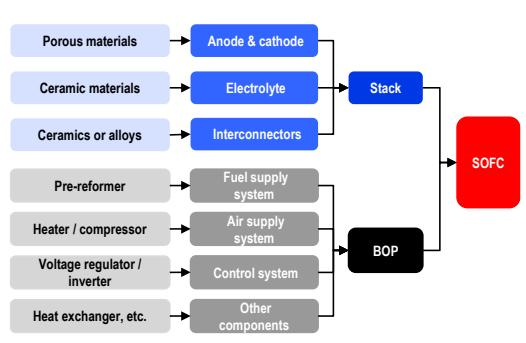  
Source: chibaogao.com, HSBC

13: Typical structure of a SOFC cell  
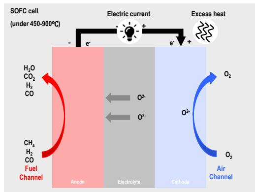  
Source: Fuel, HSBC  
A system

14: Cost breakdown of a SOFC system and a stack (based on DOE's analysis in 2017 for the production of 1,000 units of 250kW stack per year)

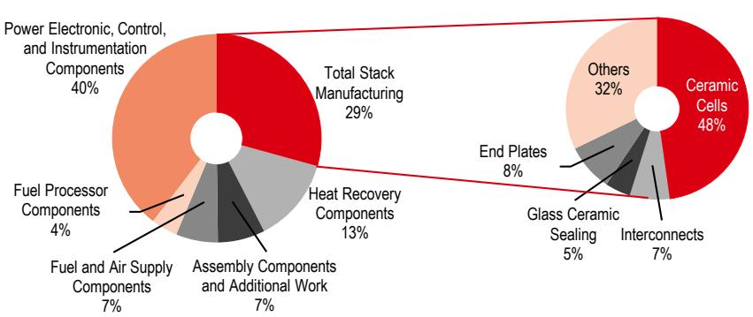  
Source: DOE, HSBC

## Other fuel cell techs

Quick review of the major applications of hydrogen and the major fuel cell types

15: Major applications of hydrogen products

<table><tr><td>Category</td><td>Typical power range</td><td>Typical fuel cell type</td><td>Example</td></tr><tr><td>Portable</td><td>1W to 20kW</td><td>PEMFC, DMFC, SOFC</td><td>Portable power, unmanned aerial vehicles</td></tr><tr><td>Stationary</td><td>0.5kW to 2MW</td><td>PEMFC, DMFC, SOFC, MCFC, PAFC</td><td>Combined heat and power, uninterruptible power system, power generators</td></tr><tr><td>Transportation</td><td>1kW to 300kW</td><td>PEMFC, DMFC</td><td>PVs, trucks, buses and coaches, aviation, marine, e-bike</td></tr><tr><td colspan="4">Source: E4Tech, HSBC</td></tr></table>

16: Types of fuel cells by electrolyte used

<table><tr><td>Item</td><td>Proton exchange membrane (PEMFC)质子交换膜燃料电池</td><td>Alkaline (AFC)碱性燃料电池</td><td>Molten carbonate (MCFC)熔融碳酸盐燃料电池</td><td>Phosphoric Acid (PAFC)磷酸燃料电池</td><td>Solid Oxide (SOFC)固体氧化物燃料电池</td><td>Direct Methanol (DMFC)直接甲醇燃料电池</td></tr><tr><td>Fuel</td><td> $H_2$ , Methanol</td><td> $H_2$ </td><td>Natural gas; Liquefied petroleum gas; Gas</td><td>Natural gas; Liquefied petroleum gas; Methanol</td><td>Natural gas; Liquefied petroleum gas; Gas</td><td>Methanol</td></tr><tr><td>Electrolyte</td><td>Fluorinated proton membrane</td><td>Potassium hydroxide (KOH)</td><td> $Li_2CO_2-K_2CO_2$ </td><td>Phosphate</td><td>Yttria-stabilized zirconia (YSZ)</td><td>Fluorinated proton membrane</td></tr><tr><td>Electrolyte condition</td><td>Solid-based</td><td>Water-based</td><td>Water-based</td><td>Water-based</td><td>Solid-based</td><td>Solid-based</td></tr><tr><td>Cathode</td><td>Pt/C</td><td>Pt/Ag</td><td>Li/NiO</td><td>Pt/C</td><td>Sr/LaMnO3</td><td>Pt/C</td></tr><tr><td>Anode</td><td>Pt/C</td><td>Pt/Ni</td><td>Ni/Al; Ni/Cx</td><td>Pt/C</td><td>Ni/YSZ</td><td>Pt/C; Ru/C</td></tr><tr><td>Core temp</td><td>50–100°C;80°C typical</td><td>90–100°C</td><td>600–700°C</td><td>150–200°C</td><td>700–1000°C</td><td>40–60°C</td></tr><tr><td>Efficiency</td><td>35-60%</td><td>60%</td><td>50%</td><td>40%</td><td>60%</td><td>20%</td></tr><tr><td>Start-up time</td><td>&lt;5 s</td><td>&lt;10 mins</td><td>&gt;10 mins</td><td>&lt;10 mins</td><td>&gt;10 mins</td><td>-</td></tr><tr><td>Applications</td><td>Portable; stationary; automotive</td><td>Space; military; submarines; transport</td><td>Large power generation</td><td>Medium to large power generation</td><td>Medium to large power generation</td><td>Portable; mobile; stationary use</td></tr><tr><td>Advantages</td><td>Compact design; long operating life; quick start-up</td><td>Low parts and operation costs; no compressor; fast cathode kinetics</td><td>High efficiency; flexible to fuel; co-generation</td><td>Good tolerance to fuel impurities; co-generation</td><td>Lenient to fuels; can use natural gas; highly efficient</td><td>Compact; feeds on methanol; no compressor</td></tr><tr><td>Limitations</td><td>Expensive catalyst; needs chemical grade fuel</td><td>Large size; sensitive to hydrogen and oxygen impurities</td><td>High heat causes corrosion; long start-up; short life</td><td>Low efficiency; limited service life; expensive catalyst</td><td>High heat levels cause corrosion; long start-up</td><td>Complex stack; slow response; low efficiency</td></tr></table>

Source: Ofweek, HSBC

## 17: Relevant companies

<table><tr><td>Company</td><td>Ticker</td><td>Rating</td><td>Currency</td><td>TP</td><td>CMP</td><td>Description</td></tr><tr><td>Ceres</td><td>CWR LN</td><td>NR</td><td>GBP</td><td>n/a</td><td>509.5</td><td>SOFC tech developer</td></tr><tr><td>Doosan Fuel Cell</td><td>336260 KS</td><td>NR</td><td>KRW</td><td>n/a</td><td>56,000.0</td><td>SOFC leader in South Korea</td></tr><tr><td>Delta</td><td>2308 TT</td><td>Buy</td><td>TWD</td><td>2,900.0</td><td>1,950.0</td><td>SOFC leader in Taiwan</td></tr><tr><td>Three-Circle*</td><td>300408 CH</td><td>Buy</td><td>CNY</td><td>91.0</td><td>166.9</td><td>BE&#x27;s key electrolyte supplier</td></tr><tr><td>Kaori</td><td>8996 TT</td><td>NR</td><td>TWD</td><td>n/a</td><td>1,550.0</td><td>BE&#x27;s hot box supplier</td></tr></table>

Source: Bloomberg, HSBC estimate; as of 30 June; \* HSBC Qianhai

## HSBC related research

Ballard Power Systems (BLDP US): Expanding the H2 TAM with GeoPura, 24 June 2026

Equity Snap: Bloom Energy (BE US): Notes from HSBC US Tech Tour, 15 June 2026

Powering AI: Positive read-across from Cummins and Deere, 26 May 2026

Powering AI: AIDC prime power: from gas turbine to gensets, 2 April 2026

Powering AI – US (5): Companies with exposure to the theme, 14 April 2026

Powering AI – US (4): The challenge of grid bottlenecks, 7 April 2026

Powering AI – US (3): The affordability challenge, 26 March 2026

Assessing AI bottlenecks: Data centre equipment suppliers on the up, 25 March 2026

Powering AI – US (2): It's a sellers' market – Power value chain benefits, 20 March 2026

China Power Utilities: The AI power story II, 17 March 2026

Powering AI – US: A new era of electricity load growth, 13 March 2026

China power equipment: How Chinese gas turbines go overseas, 6 March 2026

Powering AI: Diverging between the US & China, 27 November 2025

Assessing AI bottlenecks: Gas power equipment ramping up, 19 November 2025

US Hydrogen: Notes from Green Hydrogen Summit USA, 9 October 2025

US Hydrogen: Big Beautiful Bill avoids negative-case scenario, 11 July 2025

US Clean Tech: One Big Beautiful Bill Act provides IRA tax clarity, 11 July 2025

Power equipment OEMs: Diversified suppliers: broad-based upcycle, 22 May 2025

US Clean Tech: Trump DOE provides land for powering data center, 7 April 2025

China Power Utilities - The AI power story, 10 March 2025

Datacentre equipment: Thank heavens for Jevons, 10 February 2025

US Clean Tech – New model for powering AI datacenters, 29 January 2025

<table><tr><td colspan="2"></td><td>Valuation</td><td>Risks to our view</td></tr><tr><td rowspan="2">Bloom Energy Corp BE US</td><td rowspan="2">Current price:USD302.70Target price:USD350.00Up/downside:+15.6%</td><td>Methodology: DCF methodology (FCF).Assumptions: WACC of 14.7% (unchanged and below Bloomberg&#x27;s estimate of 24.7%) incorporates HSBC&#x27;s global risk-free rate of 4.25% (unchanged) and US equity risk premium of 4.0% (unchanged), and a 2.657 beta for Bloomberg (unchanged). We assume an exit EV/EBITDA multiple for our terminal value beyond 2031e of 35.0x, (unchanged), which is below Bloom&#x27;s five-year trailing average of 39.0x and 12-month average of 63.6x. We believe a higher premium closer to the five-year average is warranted as growth starts to normalize.Our TP of USD350 (unchanged) implies c15.6% upside and we continue to rate the shares Buy.</td><td rowspan="2">Downside risksHigh concentration of activities in the US, as well as ownership and voting power by Chairman and CEO KR Sridhar.Bloom is executing on a significant manufacturing capacity expansion over the next year, which could be delayed or negatively impacted by cost overruns.Rising input and logistics costs can adversely impact Bloom&#x27;s profitability and cash flow.Limiting gas hook-ups could impact Bloom&#x27;s legacy power generation business.Change in US government incentives for clean energy can impact demand for Bloom&#x27;s products.</td></tr><tr><td>Samantha Hoh | samantha.hoh@us.hsbc.com | +1 212-525-8783</td></tr></table>

Valuation and risks

## Risks to our view

Priced at close of 30 June 2026
Source: Bloomberg, HSBC estimates

Bloom Energy: DCF summary

<table><tr><td>USDm</td><td>2025a</td><td>2Q-4Q26e</td><td>2027e</td><td>2028e</td><td>2029e</td><td>2030e</td><td>2031e</td><td>2032e</td></tr><tr><td>Adjusted free cash flow</td><td>509</td><td>1,003</td><td>2,349</td><td>3,546</td><td>4,877</td><td>6,276</td><td>7,287</td><td>7,707</td></tr><tr><td>Risk-free rate</td><td>4.25%</td><td></td><td></td><td></td><td></td><td></td><td></td><td></td></tr><tr><td>Market risk premium</td><td>4.00%</td><td></td><td></td><td></td><td></td><td></td><td></td><td></td></tr><tr><td>Beta</td><td>2.657</td><td></td><td></td><td></td><td></td><td></td><td></td><td></td></tr><tr><td>HSBC WACC</td><td>14.7%</td><td></td><td></td><td></td><td></td><td></td><td></td><td></td></tr><tr><td>Discounted FCF</td><td>0</td><td>1,003</td><td>2,048</td><td>2,697</td><td>3,234</td><td>3,629</td><td>3,674</td><td>3,388</td></tr><tr><td>Terminal value</td><td>92,170</td><td></td><td></td><td></td><td></td><td></td><td></td><td></td></tr><tr><td>EV</td><td>111,842</td><td></td><td></td><td></td><td></td><td></td><td></td><td></td></tr><tr><td>Net debt</td><td>84</td><td></td><td></td><td></td><td></td><td></td><td></td><td></td></tr><tr><td>Market cap</td><td>111,758</td><td></td><td></td><td></td><td></td><td></td><td></td><td></td></tr><tr><td>Value per share (USD)</td><td>350.00</td><td></td><td></td><td></td><td></td><td></td><td></td><td></td></tr></table>

Source: Bloomberg, HSBC estimates

<table><tr><td colspan="2"></td><td>Valuation</td><td>Risks</td></tr><tr><td>Weichai Power2338 HK/000338 CH</td><td>Current price:HKD34.10RMB27.25</td><td>Methodology: Sum-of-the parts approach and target PE multipleAssumptions: We use a sum-of-the-parts approach to value Weichai. We illustrate our valuation for each part in the table below.</td><td rowspan="2">Downside risks: Unexpected slowdown in AIDC buildout, softer large engine sales (especially gas gensets for prime power and diesel engines for backup power), delayed SOFC deliveries and HDT renewals, and hawkish Fed.</td></tr><tr><td>Buy/Buy</td><td>Target price:HKD50.00RMB42.00Upside:H: +46.6%A: +54.1%</td><td>We maintain our rounded H-share target price at HKD50.00 (unchanged). We use an A/H premium of -2% (unchanged), the YTD average, to factor in the converging AH premium. Thus, we also maintain our rounded A-share target price at RMB42.00 (unchanged).Our H/A-share target prices imply c47%/54% upside, respectively, therefore we maintain our Buy/Buy ratings. We are positive on its AIDC power business growth.Helen Fang* | helen.c.fang@hsbc.com.hk | +852 2996 6942</td></tr></table>

\* Employed by a non-US affiliate of HSBC Securities (USA) Inc, and is not registered/ qualified pursuant to FINRA regulations Priced at 30 June 2026 Source: HSBC estimates

Weichai Power: SOTP approach

<table><tr><td></td><td>Valuation method</td><td>Estimate year</td><td>% contribution to TP</td><td>Valuation assumptions/rationale</td></tr><tr><td>HDT-related and other business</td><td>PE</td><td>2027e</td><td>24%</td><td>We value HDT-related and other business using a target PE for 2027e of 9x, the average PE for the last downcycle to reflect the negative impact from fierce HDT competition and electric adoption (unchanged). Applying our target PE multiple to our EPS for 2027e of RMB1.13 (unchanged) and using HSBC&#x27;s end-2026 HKD-RMB rate of 1.17 (unchanged) renders its valuation per share to Weichai&#x27;s valuation, i.e., HKD11.59/RMB10.19 (unchanged).</td></tr><tr><td>Large diameter engine for data centers</td><td>PE</td><td>2027e</td><td>54%</td><td>We value the large diameter engine for the data center business using a target PE for 2027e of 31x (unchanged), the market cap weighted average 1-year forward PE of the key comparables, as of 21 May 2026. Applying our target PE multiple to our EPS for 2027e of RMB0.75 (unchanged) and using HSBC&#x27;s end-2026 HKD-RMB rate of 1.17 (unchanged) renders its valuation per share to Weichai&#x27;s valuation, i.e., HKD27.27/RMB23.25 (unchanged).</td></tr><tr><td>SOFC business</td><td>PS</td><td>2027e</td><td>11%</td><td>We use Bloom Energy&#x27;s PS ratio of 13.9x as of 21 May 2026 (unchanged) to value Weichai&#x27;s SOFC business, as BE is a leader in the market. Applying our target PS multiple to our sales for 2027e of RMB2,975m (unchanged) and using HSBC&#x27;s end-2026 HKD-RMB rate of 1.17 (unchanged) renders its valuation per share to Weichai&#x27;s valuation, i.e., HKD5.57/RMB4.75 (unchanged).</td></tr><tr><td>Smart logistics business - KION</td><td>Bloomberg consensus TP</td><td>2027e</td><td>8%</td><td>We value Weichai&#x27;s 46.52% stake in Kion (KGX GR, EUR38.77, not rated) using the Bloomberg consensus target price of EUR60.61 as of 21 May 2026 (unchanged), multiplying Kion&#x27;s number of outstanding shares and using HSBC&#x27;s end-2026 EUR-RMB rate of 7.85 (unchanged). Then dividing by Weichai&#x27;s number of outstanding shares, we derive Kion&#x27;s valuation per share contributing to Weichai&#x27;s valuation, i.e., HKD3.91/RMB3.33 (unchanged).</td></tr><tr><td>Agricultural machinery business PE - Lovol</td><td></td><td>2027e</td><td>3%</td><td>We value the agricultural machinery business using a target PE for 2027e of 14.8x (unchanged), the 1-year forward PE of First Tractor (601038 CH, RMB10.59, not rated) as of 21 May 2026. Applying our target PE multiple to our EPS for 2027e of RMB0.08 (unchanged) and using HSBC&#x27;s end-2026 HKD-RMB rate of 1.17 (unchanged) renders its valuation per share to Weichai&#x27;s valuation, i.e., HKD1.43/RMB1.22 (unchanged).</td></tr></table>

Source: Bloomberg, HSBC estimates. Priced at 30 June 2026

# Disclosure appendix

## Analyst Certification

The following analyst(s), economist(s), or strategist(s) who is(are) primarily responsible for this report, including any analyst(s) whose name(s) appear(s) as author of an individual section or sections of the report and any analyst(s) named as the covering analyst(s) of a subsidiary company in a sum-of-the-parts valuation certifies(y) that the opinion(s) on the subject security(ies) or issuer(s), any views or forecasts expressed in the section(s) of which such individual(s) is(are) named as author(s), and any other views or forecasts expressed herein, including any views expressed on the back page of the research report, accurately reflect their personal view(s) and that no part of their compensation was, is or will be directly or indirectly related to the specific recommendation(s) or views contained in this research report: Helen Fang, Samantha Hoh, CFA, Sean McLoughlin and Sunny SUN

## Important disclosures

## Equities: Stock ratings and basis for financial analysis

HSBC and its affiliates, including the issuer of this report ("HSBC") believes an investor's decision to buy or sell a stock should depend on individual circumstances such as the investor's existing holdings, risk tolerance and other considerations and that investors utilise various disciplines and investment horizons when making investment decisions. Ratings should not be used or relied on in isolation as investment advice. Different securities firms use a variety of ratings terms as well as different rating systems to describe their recommendations and therefore investors should carefully read the definitions of the ratings used in each research report. Further, investors should carefully read the entire research report and not infer its contents from the rating because research reports contain more complete information concerning the analysts' views and the basis for the rating.

## From 23rd March 2015 HSBC has assigned ratings on the following basis:

The target price is based on the analyst's assessment of the stock's actual current value, although we expect it to take six to 12 months for the market price to reflect this. When the target price is more than $20\%$ above the current share price, the stock will be classified as a Buy; when it is between $5\%$ and $20\%$ above the current share price, the stock may be classified as a Buy or a Hold; when it is between $5\%$ below and $5\%$ above the current share price, the stock will be classified as a Hold; when it is between $5\%$ and $20\%$ below the current share price, the stock may be classified as a Hold or a Reduce; and when it is more than $20\%$ below the current share price, the stock will be classified as a Reduce.

Our ratings are re-calibrated against these bands at the time of any 'material change' (initiation or resumption of coverage, change in target price or estimates).

Upside/Downside is the percentage difference between the target price and the share price.

## Prior to this date, HSBC's rating structure was applied on the following basis:

For each stock we set a required rate of return calculated from the cost of equity for that stock's domestic or, as appropriate, regional market established by our strategy team. The target price for a stock represented the value the analyst expected the stock to reach over our performance horizon. The performance horizon was 12 months. For a stock to be classified as Overweight, the potential return, which equals the percentage difference between the current share price and the target price, including the forecast dividend yield when indicated, had to exceed the required return by at least 5 percentage points over the succeeding 12 months (or 10 percentage points for a stock classified as Volatile\*). For a stock to be classified as Underweight, the stock was expected to underperform its required return by at least 5 percentage points over the succeeding 12 months (or 10 percentage points for a stock classified as Volatile\*). Stocks between these bands were classified as Neutral.

\*A stock was classified as volatile if its historical volatility had exceeded 40%, if the stock had been listed for less than 12 months (unless it was in an industry or sector where volatility is low) or if the analyst expected significant volatility. However, stocks which we did not consider volatile may in fact also have behaved in such a way. Historical volatility was defined as the past month's average of the daily 365-day moving average volatilities. In order to avoid misleadingly frequent changes in rating, however, volatility had to move 2.5 percentage points past the 40% benchmark in either direction for a stock's status to change.

Source: HSBC

## Rating distribution for long-term investment opportunities

As of 31 March 2026, the distribution of all independent ratings published by HSBC is as follows:

Buy 59% (12% of these provided with Investment Banking Services in the past 12 months)

Hold 36% (12% of these provided with Investment Banking Services in the past 12 months)

Sell 6% (6% of these provided with Investment Banking Services in the past 12 months)

For the purposes of the distribution above the following mapping structure is used during the transition from the previous to current rating models: under our previous model, Overweight = Buy, Neutral = Hold and Underweight = Sell; under our current model Buy = Buy, Hold = Hold and Reduce = Sell. For rating definitions under both models, please see “Stock ratings and basis for financial analysis” above.

For the distribution of non-independent ratings published by HSBC, please see the disclosure page available at http://www.hsbcnet.com/gbm/financial-regulation/investment-recommendations-disclosures.

## Share price and rating changes for long-term investment opportunities

Bloom Energy Corp (BE.N) share price performance USD Vs HSBC rating history

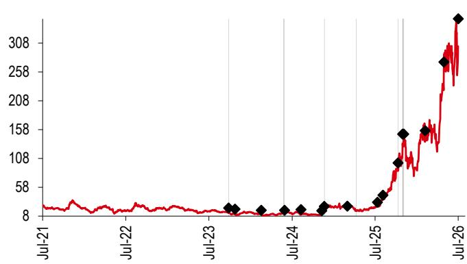  
Source: HSBC

Rating & target price history

<table><tr><td>From</td><td>To</td><td>Date</td><td>Analyst</td></tr><tr><td>N/A</td><td>Buy</td><td>25 Sep 2023</td><td>Samantha Hoh, CFA</td></tr><tr><td>Buy</td><td>Restricted</td><td>23 May 2024</td><td></td></tr><tr><td>Restricted</td><td>Buy</td><td>28 May 2024</td><td>Samantha Hoh, CFA</td></tr><tr><td>Buy</td><td>Hold</td><td>19 Nov 2024</td><td>Samantha Hoh, CFA</td></tr><tr><td>Hold</td><td>Buy</td><td>08 Apr 2025</td><td>Samantha Hoh, CFA</td></tr><tr><td>Buy</td><td>Hold</td><td>09 Oct 2025</td><td>Samantha Hoh, CFA</td></tr><tr><td>Hold</td><td>Buy</td><td>29 Oct 2025</td><td>Samantha Hoh, CFA</td></tr><tr><td>Buy</td><td>Restricted</td><td>30 Oct 2025</td><td></td></tr><tr><td>Restricted</td><td>Buy</td><td>03 Nov 2025</td><td>Samantha Hoh, CFA</td></tr><tr><td>Target price</td><td>Value</td><td>Date</td><td>Analyst</td></tr><tr><td>Price 1</td><td>22.00</td><td>25 Sep 2023</td><td>Samantha Hoh, CFA</td></tr><tr><td>Price 2</td><td>20.00</td><td>24 Oct 2023</td><td>Samantha Hoh, CFA</td></tr><tr><td>Price 3</td><td>18.00</td><td>16 Feb 2024</td><td>Samantha Hoh, CFA</td></tr><tr><td>Price 4</td><td>Restricted</td><td>23 May 2024</td><td></td></tr><tr><td>Price 5</td><td>18.00</td><td>28 May 2024</td><td>Samantha Hoh, CFA</td></tr><tr><td>Price 6</td><td>19.00</td><td>09 Aug 2024</td><td>Samantha Hoh, CFA</td></tr><tr><td>Price 7</td><td>17.20</td><td>08 Nov 2024</td><td>Samantha Hoh, CFA</td></tr><tr><td>Price 8</td><td>24.50</td><td>19 Nov 2024</td><td>Samantha Hoh, CFA</td></tr><tr><td>Price 9</td><td>25.00</td><td>28 Feb 2025</td><td>Samantha Hoh, CFA</td></tr><tr><td>Price 10</td><td>32.00</td><td>11 Jul 2025</td><td>Samantha Hoh, CFA</td></tr><tr><td>Price 11</td><td>44.00</td><td>04 Aug 2025</td><td>Samantha Hoh, CFA</td></tr><tr><td>Price 12</td><td>100.00</td><td>09 Oct 2025</td><td>Samantha Hoh, CFA</td></tr><tr><td>Price 13</td><td>150.00</td><td>29 Oct 2025</td><td>Samantha Hoh, CFA</td></tr><tr><td>Price 14</td><td>Restricted</td><td>30 Oct 2025</td><td></td></tr><tr><td>Price 15</td><td>150.00</td><td>03 Nov 2025</td><td>Samantha Hoh, CFA</td></tr><tr><td>Price 16</td><td>156.00</td><td>06 Feb 2026</td><td>Samantha Hoh, CFA</td></tr><tr><td>Price 17</td><td>275.00</td><td>29 Apr 2026</td><td>Samantha Hoh, CFA</td></tr><tr><td>Price 18</td><td>350.00</td><td>01 Jul 2026</td><td>Samantha Hoh, CFA</td></tr></table>

Source: HSBC

Weichai Power (2338.HK) share price performance HKD Vs HSBC rating history  
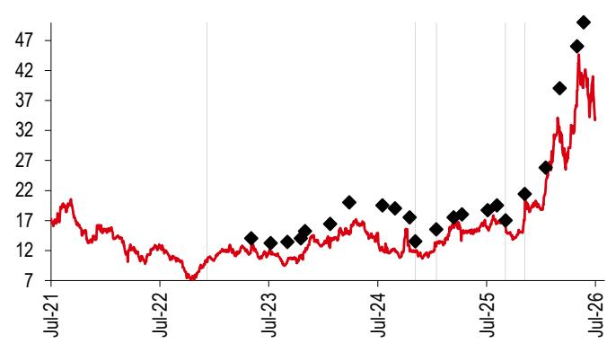  
Source: HSBC

Rating & target price history

<table><tr><td>From</td><td>To</td><td>Date</td><td>Analyst</td></tr><tr><td>Hold</td><td>Buy</td><td>05 Dec 2022</td><td>Helen Fang</td></tr><tr><td>Buy</td><td>Hold</td><td>04 Nov 2024</td><td>Helen Fang</td></tr><tr><td>Hold</td><td>Buy</td><td>13 Jan 2025</td><td>Helen Fang</td></tr><tr><td>Buy</td><td>Hold</td><td>02 Sep 2025</td><td>Helen Fang</td></tr><tr><td>Hold</td><td>Buy</td><td>05 Nov 2025</td><td>Helen Fang</td></tr><tr><td>Target price</td><td>Value</td><td>Date</td><td>Analyst</td></tr><tr><td>Price 1</td><td>14.00</td><td>03 May 2023</td><td>Helen Fang</td></tr><tr><td>Price 2</td><td>13.20</td><td>07 Jul 2023</td><td>Helen Fang</td></tr><tr><td>Price 3</td><td>13.40</td><td>01 Sep 2023</td><td>Helen Fang</td></tr><tr><td>Price 4</td><td>14.00</td><td>17 Oct 2023</td><td>Helen Fang</td></tr><tr><td>Price 5</td><td>15.20</td><td>31 Oct 2023</td><td>Helen Fang</td></tr><tr><td>Price 6</td><td>16.40</td><td>23 Jan 2024</td><td>Helen Fang</td></tr><tr><td>Price 7</td><td>20.00</td><td>27 Mar 2024</td><td>Helen Fang</td></tr><tr><td>Price 8</td><td>19.50</td><td>16 Jul 2024</td><td>Helen Fang</td></tr><tr><td>Price 9</td><td>19.00</td><td>27 Aug 2024</td><td>Helen Fang</td></tr><tr><td>Price 10</td><td>17.50</td><td>15 Oct 2024</td><td>Helen Fang</td></tr><tr><td>Price 11</td><td>13.50</td><td>04 Nov 2024</td><td>Helen Fang</td></tr><tr><td>Price 12</td><td>15.50</td><td>13 Jan 2025</td><td>Helen Fang</td></tr><tr><td>Price 13</td><td>17.50</td><td>12 Mar 2025</td><td>Helen Fang</td></tr><tr><td>Price 14</td><td>18.00</td><td>09 Apr 2025</td><td>Helen Fang</td></tr><tr><td>Price 15</td><td>18.70</td><td>04 Jul 2025</td><td>Helen Fang</td></tr><tr><td>Price 16</td><td>19.50</td><td>04 Aug 2025</td><td>Helen Fang</td></tr><tr><td>Price 17</td><td>17.00</td><td>02 Sep 2025</td><td>Helen Fang</td></tr><tr><td>Price 18</td><td>21.40</td><td>05 Nov 2025</td><td>Helen Fang</td></tr><tr><td>Price 19</td><td>25.80</td><td>15 Jan 2026</td><td>Helen Fang</td></tr><tr><td>Price 20</td><td>39.00</td><td>03 Mar 2026</td><td>Helen Fang</td></tr><tr><td>Price 21</td><td>46.00</td><td>30 Apr 2026</td><td>Helen Fang</td></tr><tr><td>Price 22</td><td>50.00</td><td>22 May 2026</td><td>Helen Fang</td></tr></table>

Weichai Power A (000338.SZ) share price performance
CNY Vs HSBC rating history  
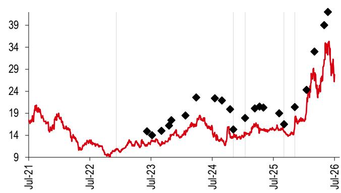  
Source: HSBC

Rating & target price history

<table><tr><td>From</td><td>To</td><td>Date</td><td>Analyst</td></tr><tr><td>Hold</td><td>Buy</td><td>05 Dec 2022</td><td>Helen Fang</td></tr><tr><td>Buy</td><td>Hold</td><td>04 Nov 2024</td><td>Helen Fang</td></tr><tr><td>Hold</td><td>Buy</td><td>13 Jan 2025</td><td>Helen Fang</td></tr><tr><td>Buy</td><td>Hold</td><td>02 Sep 2025</td><td>Helen Fang</td></tr><tr><td>Hold</td><td>Buy</td><td>05 Nov 2025</td><td>Helen Fang</td></tr><tr><td>Target price</td><td>Value</td><td>Date</td><td>Analyst</td></tr><tr><td>Price 1</td><td>14.90</td><td>07 Jun 2023</td><td>Helen Fang</td></tr><tr><td>Price 2</td><td>14.00</td><td>07 Jul 2023</td><td>Helen Fang</td></tr><tr><td>Price 3</td><td>15.00</td><td>01 Sep 2023</td><td>Helen Fang</td></tr><tr><td>Price 4</td><td>16.20</td><td>17 Oct 2023</td><td>Helen Fang</td></tr><tr><td>Price 5</td><td>17.40</td><td>31 Oct 2023</td><td>Helen Fang</td></tr><tr><td>Price 6</td><td>18.50</td><td>23 Jan 2024</td><td>Helen Fang</td></tr><tr><td>Price 7</td><td>22.60</td><td>27 Mar 2024</td><td>Helen Fang</td></tr><tr><td>Price 8</td><td>22.40</td><td>16 Jul 2024</td><td>Helen Fang</td></tr><tr><td>Price 9</td><td>21.90</td><td>27 Aug 2024</td><td>Helen Fang</td></tr><tr><td>Price 10</td><td>19.90</td><td>15 Oct 2024</td><td>Helen Fang</td></tr><tr><td>Price 11</td><td>15.30</td><td>04 Nov 2024</td><td>Helen Fang</td></tr><tr><td>Price 12</td><td>17.90</td><td>13 Jan 2025</td><td>Helen Fang</td></tr><tr><td>Price 13</td><td>20.10</td><td>12 Mar 2025</td><td>Helen Fang</td></tr><tr><td>Price 14</td><td>20.50</td><td>09 Apr 2025</td><td>Helen Fang</td></tr><tr><td>Price 15</td><td>20.30</td><td>02 May 2025</td><td>Helen Fang</td></tr><tr><td>Price 16</td><td>19.00</td><td>04 Aug 2025</td><td>Helen Fang</td></tr><tr><td>Price 17</td><td>16.50</td><td>02 Sep 2025</td><td>Helen Fang</td></tr><tr><td>Price 18</td><td>20.40</td><td>05 Nov 2025</td><td>Helen Fang</td></tr><tr><td>Price 19</td><td>24.30</td><td>15 Jan 2026</td><td>Helen Fang</td></tr><tr><td>Price 20</td><td>33.00</td><td>03 Mar 2026</td><td>Helen Fang</td></tr><tr><td>Price 21</td><td>39.00</td><td>30 Apr 2026</td><td>Helen Fang</td></tr><tr><td>Price 22</td><td>42.00</td><td>22 May 2026</td><td>Helen Fang</td></tr><tr><td colspan="4">Source: HSBC</td></tr></table>

To view a list of all the independent fundamental ratings/recommendations disseminated by HSBC during the preceding 12-month period, and the location where we publish our quarterly distribution of non-fundamental recommendations (applicable to Fixed Income and Currencies research only), please use the following links to access the disclosure page:

## Clients of HSBC Private Bank: www.research.privatebank.hsbc.com/Disclosures

## All other clients: www.research.hsbc.com/A/Disclosures

## HSBC & Analyst disclosures

## Disclosure checklist

<table><tr><td>Company</td><td>Ticker</td><td>Recent price</td><td>Price date</td><td>Disclosure</td></tr><tr><td>BLOOM ENERGY CORP</td><td>BE.N</td><td>302.70</td><td>30 Jun 2026</td><td>1, 5, 6, 7</td></tr><tr><td>WEICHAI POWER</td><td>2338.HK</td><td>34.10</td><td>30 Jun 2026</td><td>4, 7, 11</td></tr><tr><td>WEICHAI POWER A</td><td>000338.SZ</td><td>27.80</td><td>01 Jul 2026</td><td>4, 7, 11</td></tr></table>

1 HSBC has managed or co-managed a public offering of securities for this company within the past 12 months.

2 HSBC expects to receive or intends to seek compensation for investment banking services from this company in the next 3 months.

3 At the time of publication of this report, HSBC Securities (USA) Inc. is a Market Maker in securities issued by this company.

4 As of 31 May 2026, HSBC beneficially owned 1% or more of a class of common equity securities of this company.

5 This company was a client of HSBC or had during the preceding 12 month period been a client of and/or paid compensation to HSBC in respect of investment banking services.

6 This company was a client of HSBC or had during the preceding 12 month period been a client of and/or paid compensation to HSBC in respect of non-investment banking securities-related services.

7 This company was a client of HSBC or had during the preceding 12 month period been a client of and/or paid compensation to HSBC in respect of non-securities services.

8 A covering analyst/s has received compensation from this company in the past 12 months.

9 A covering analyst/s or a member of his/her household has a financial interest in the securities of this company, as detailed below.

10 A covering analyst/s or a member of his/her household is an officer, director or supervisory board member of this company, as detailed below.

11 At the time of publication of this report, HSBC is a non-US Market Maker in securities issued by this company and/or in securities in respect of this company.

12 As of 24 June 2026, HSBC beneficially held a net long position of more than $0.5\%$ of this company's total issued share capital, calculated according to the SSR methodology.

13 As of 24 June 2026, HSBC beneficially held a net short position of more than $0.5\%$ of this company's total issued share capital, calculated according to the SSR methodology.

14 HSBC Qianhai Securities Limited holds 1% or more of a class of common equity securities of this company.

HSBC and its affiliates will from time to time sell to and buy from customers the securities/instruments, both equity and debt (including derivatives) of companies covered in HSBC on a principal or agency basis or act as a market maker or liquidity provider in the securities/instruments mentioned in this report.

Analysts, economists, and strategists are paid in part by reference to the profitability of HSBC which includes investment banking, sales & trading, and principal trading revenues.

Whether, or in what time frame, an update of this analysis will be published is not determined in advance.

Non-U.S. analysts may not be associated persons of HSBC Securities (USA) Inc, and therefore may not be subject to FINRA Rule 2241 or FINRA Rule 2242 restrictions on communications with the subject company, public appearances and trading securities held by the analysts.

Economic sanctions laws imposed by certain jurisdictions such as the US, the EU, the UK, and others, may prohibit persons subject to those laws from making certain types of investments, including by transacting or dealing in securities of particular issuers, sectors, or regions. This report does not constitute advice in relation to any such laws and should not be construed as an inducement to transact in securities in breach of such laws.

For disclosures in respect of any company mentioned in this report, please see the most recently published report on that company available at www.hsbcnet.com/research. HSBC Private Bank clients should contact their Relationship Manager for queries regarding other research reports. In order to find out more about the proprietary models used to produce this report, please contact the authoring analyst.

## Additional disclosures

1 This report is dated as at 01 July 2026.

2 All market data included in this report are dated as at close 30 June 2026, unless a different date and/or a specific time of day is indicated in the report.

3 HSBC has procedures in place to identify and manage any potential conflicts of interest that arise in connection with its Research business. HSBC's analysts and its other staff who are involved in the preparation and dissemination of Research operate and have a management reporting line independent of HSBC's Investment Banking business. Information Barrier procedures are in place between the Investment Banking, Principal Trading, and Research businesses to ensure that any confidential and/or price sensitive information is handled in an appropriate manner.

4 You are not permitted to use, for reference, any data in this document for the purpose of (i) determining the interest payable, or other sums due, under loan agreements or under other financial contracts or instruments, (ii) determining the price at which a financial instrument may be bought or sold or traded or redeemed, or the value of a financial instrument, and/or (iii) measuring the performance of a financial instrument or of an investment fund.

## Production & distribution disclosures

1. This report was produced and signed off by the author on 01 Jul 2026 10:58 GMT.

2. In order to see when this report was first disseminated please see the disclosure page available at https://www.research.hsbc.com/R/34/bxxhzdJ

# Disclaimer

Legal entities as at 13 May 2026:

HSBC Bank plc; HSBC Continental Europe; HSBC Continental Europe SA, Germany; HSBC Bank Middle East Limited, DIFC; HSBC Bank Middle East Limited, Dubai branch; HSBC Yatirim Menkul Degerler AS, Istanbul; The Hongkong and Shanghai Banking Corporation Limited, Hong Kong; The Hongkong and Shanghai Banking Corporation Limited, Singapore Branch; The Hongkong and Shanghai Banking Corporation Limited, Seoul Securities Branch; The Hongkong and Shanghai Banking Corporation Limited, Seoul Branch; HSBC Qianhai Securities Limited; HSBC Securities (Taiwan) Corporation Limited; HSBC Securities and Capital Markets (India) Private Limited, Mumbai; HSBC Bank Australia Limited; HSBC Securities (USA) Inc., New York; HSBC México, SA, Institución de Banca Múltiple, Grupo Financiero HSBC; Banco HSBC SA

Issuer of report
The Hongkong and Shanghai Banking Corporation Limited
Level 16, 1 Queen's Road Central
Hong Kong SAR
Telephone: +852 2843 9111
Fax: +852 2596 0200
Website: www.research.hsbc.com

This document has been issued by The Hongkong and Shanghai Banking Corporation Limited ("HSBC") in the conduct of its Hong Kong regulated business for the information of its institutional and professional investor (as defined by Securities and Future Ordinance (Chapter 571)) customers; it is not intended for and should not be distributed to retail customers in Hong Kong, unless permitted otherwise. The Hongkong and Shanghai Banking Corporation Limited is regulated by the Hong Kong Monetary Authority. All enquires by recipients in Hong Kong must be directed to your HSBC contact in Hong Kong. If it is received by a customer of an affiliate of HSBC, its provision to the recipient is subject to the terms of business in place between the recipient and such affiliate. This document is not and should not be construed as an offer to sell or the solicitation of an offer to purchase or subscribe for any investment. HSBC has based this document on information obtained from sources it believes to be reliable but which it has not independently verified; HSBC makes no guarantee, representation or warranty and accepts no responsibility or liability as to its accuracy or completeness. Expressions of opinion are those of the Research Division of HSBC only and are subject to change without notice. From time to time research analysts conduct site visits of covered issuers. HSBC policies prohibit research analysts from accepting payment or reimbursement for travel expenses from the issuer for such visits. HSBC and its affiliates and/or their officers, directors and employees may have positions in any securities mentioned in this document (or in any related investment) and may from time to time add to or dispose of any such securities (or investment). HSBC and its affiliates may act as market maker or have assumed an underwriting commitment in the securities of companies discussed in this document (or in related investments), may sell them to or buy them from customers on a principal basis and may also perform or seek to perform investment banking or underwriting services for or relating to those companies. The document is intended to be distributed in its entirety. Unless governing law permits otherwise, you must contact a HSBC Group member in your home jurisdiction if you wish to use HSBC Group services in effecting a transaction in any investment mentioned in this document.

In the UK, this publication is distributed by HSBC Bank plc for the information of its Clients (as defined in the Rules of FCA) and those of its affiliates only. Nothing herein excludes or restricts any duty or liability to a customer which HSBC Bank plc has under the Financial Services and Markets Act 2000 or under the Rules of FCA and PRA. A recipient who chooses to deal with any person who is not a representative of HSBC Bank plc in the UK will not enjoy the protections afforded by the UK regulatory regime. HSBC Bank plc is regulated by the Financial Conduct Authority and the Prudential Regulation Authority.

In the European Economic Area, this publication has been distributed by HSBC Continental Europe or by such other HSBC affiliate from which the recipient receives relevant services.

In Japan, this publication has been distributed by HSBC Securities (Japan) Co., Ltd.. It may not be further distributed in whole or in part for any purpose. In Korea, this publication is distributed by either The Hongkong and Shanghai Banking Corporation Limited, Seoul Securities Branch ("HBAP SLS") or The Hongkong and Shanghai Banking Corporation Limited, Seoul Branch ("HBAP SEL") for the general information of professional investors specified in Article 9 of the Financial Investment Services and Capital Markets Act ("FSCMA"). This publication is not a prospectus as defined in the FSCMA. It may not be further distributed in whole or in part for any purpose. Both HBAP SLS and HBAP SEL are regulated by the Financial Services Commission and the Financial Supervisory Service of Korea. In Singapore, this publication is distributed by The Hongkong and Shanghai Banking Corporation Limited, Singapore Branch for the general information of institutional investors or other persons specified in Sections 274 and 304 of the Securities and Futures Act 2001 of Singapore ("SFA") and accredited investors and other persons in accordance with the conditions specified in Sections 275 and 305 of the SFA. Only Economics or Currencies reports are intended for distribution to a person who is not an Accredited Investor, Expert Investor or Institutional Investor as defined in SFA. The Hongkong and Shanghai Banking Corporation Limited, Singapore Branch accepts legal responsibility for the contents of reports. This publication is not a prospectus as defined in the SFA. It may not be further distributed in whole or in part for any purpose. The Hongkong and Shanghai Banking Corporation Limited Singapore Branch is regulated by the Monetary Authority of Singapore. Recipients in Singapore should contact a "Hongkong and Shanghai Banking Corporation Limited, Singapore Branch" representative in respect of any matters arising from, or in connection with this report. Please refer to The Hongkong and Shanghai Banking Corporation Limited Singapore Branch's website at www.business.hsbc.com.sg for contact details. In Australia, this publication has been distributed by The Hongkong and Shanghai Banking Corporation Limited (ABN 65 117 925 970, AFSL 301737) for the general information of its "wholesale" customers (as defined in the Corporations Act 2001). Where distributed to retail customers, this research is distributed by HSBC Bank Australia Limited (ABN 48 006 434 162, AFSL No. 232595). These respective entities make no representations that the products or services mentioned in this document are available to persons in Australia or are necessarily suitable for any particular person or appropriate in accordance with local law. No consideration has been given to the particular investment objectives, financial situation or particular needs of any recipient.

HSBC Securities (USA) Inc. accepts responsibility for the content of this research report prepared by its non-US foreign affiliate. The information contained herein is under no circumstances to be construed as investment advice and is not tailored to the needs of the recipient. All US persons receiving and/or accessing this report and wishing to effect transactions in any security discussed herein should do so with HSBC Securities (USA) Inc. in the United States and not with its non-US foreign affiliate, the issuer of this report. HSBC México, S.A., Institución de Banca Múltiple, Grupo Financiero HSBC is authorized and regulated by Secretaría de Hacienda y Crédito Público and Comisión Nacional Bancaria y de Valores (CNBV). In Brazil, this document has been distributed by Banco HSBC SA ("HSBC Brazil"), and/or its affiliates. As required by Resolution No. 20/2021 of the Securities and Exchange Commission of Brazil (Comissão de Valores Mobiliários), potential conflicts of interest concerning (i) HSBC Brazil and/or its affiliates; and (ii) the analyst(s) responsible for authoring this report are stated on the chart above labelled "HSBC & Analyst Disclosures".

If you are a customer of HSBC International Wealth & Premier Banking ("IWPB"), including HSBC Private Bank, you are eligible to receive this publication only if: (i) you have been approved to receive relevant research publications by an applicable HSBC legal entity; (ii) you have agreed to the applicable HSBC entity's terms and conditions and/or customer declaration for accessing research; and (iii) you have agreed to the terms and conditions of any other internet banking, online banking, mobile banking and/or investment services offered by that HSBC entity, through which you will access research publications (collectively with (ii), the "Terms"). If you do not meet the above eligibility requirements, please disregard this publication and, if you are a IWPB customer, please notify your Relationship Manager or call the relevant customer hotline. Distribution of this publication is the sole responsibility of the HSBC entity with whom you have agreed the Terms. Receipt of research publications is strictly subject to the Terms and any other conditions or disclaimers applicable to the provision of the publications that may be advised by IWPB. © Copyright 2026, The Hongkong and Shanghai Banking Corporation Limited, ALL RIGHTS RESERVED. No part of this publication may be reproduced, stored in a retrieval system, or transmitted, on any form or by any means, electronic, mechanical, photocopying, recording, or otherwise, without the prior written permission of The Hongkong and Shanghai Banking Corporation Limited.