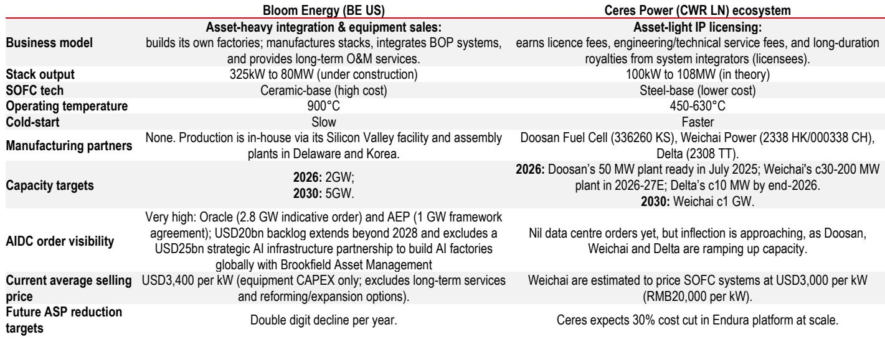
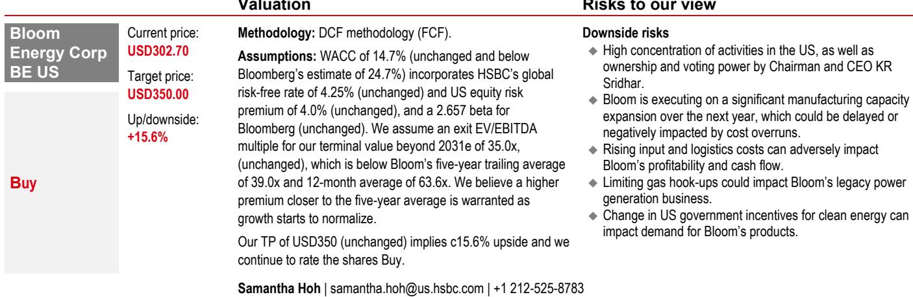

# Solid Oxide Fuel Cells Are Not Just an Alternative Power Source for AI Data Centers — They Are Becoming the Default Choice for Behind-the-Meter Prime Power Through 2030

The global race to build artificial intelligence infrastructure has collided with an immovable constraint: the electric grid cannot keep up. Data center developers report that access to power is now their single greatest bottleneck, surpassing even chip supply and construction labor. Traditional solutions — gas turbines and reciprocating engines — require 18 to 60 months of lead time, emit nitrogen oxides that face increasingly stringent local air permits, and deliver alternating current that must be converted to direct current at significant cost and efficiency loss. Against this backdrop, solid oxide fuel cells have emerged not as a niche experimental technology but as the most practical solution for behind-the-meter prime power at AI data centers.

A global investment bank report synthesizing industry data, company disclosures, and technology roadmaps makes a compelling case that SOFC capacity will scale to over 5 gigawatts by 2030, driven by adoption in the United States, South Korea, Taiwan, and the European Union. The thesis rests on three structural advantages that align perfectly with the specific needs of hyperscale AI computing: three-to-four-month equipment lead times versus one to five years for alternatives, zero nitrogen oxide emissions that bypass the most contentious permitting hurdles, and native direct current output that eliminates costly AC-DC conversion losses. These are not incremental improvements. They represent a fundamental reconfiguration of how large-scale computing infrastructure secures its power supply.

The implications extend well beyond data center operators. For investors, the SOFC supply chain presents a concentrated opportunity set where capacity is undersupplied through 2030 and where the leading companies have already secured multi-gigawatt indicative orders. For policymakers, the technology offers a bridge between the imperative to build AI infrastructure rapidly and the equally urgent need to avoid worsening local air quality. For energy strategists, SOFC represents one of the few dispatchable power technologies that can scale within the timeline demanded by AI buildout. The window for positioning is open now, but it will not remain open indefinitely.

## The Three Structural Advantages of SOFC Are Not Incremental — They Are Transformational for AI Infrastructure Construction Timelines

The most immediate constraint on AI data center construction is not capital, not land, not even semiconductor supply. It is the time required to bring power online. A global investment bank report compares equipment lead times across seven behind-the-meter prime power solutions, and the disparity is stark. SOFC systems require three to four months from order to delivery. Aeroderivative gas turbines require 18 to 36 months. Industrial gas turbines require 12 to 36 months. Combined cycle gas turbines require 18 to 60 months. Large H-class combined cycle units require 36 to 60 months. Reciprocating internal combustion engines require 15 to 24 months.

In the context of AI infrastructure, where every quarter of delay translates into billions of dollars of potential compute revenue, this lead-time advantage alone would justify SOFC adoption. But the technology offers two additional advantages that compound its value. First, SOFC produces negligible nitrogen oxide emissions because it operates through electrochemical reactions rather than combustion. This matters enormously for permitting. Gas turbines and reciprocating engines face strict local air permit bottlenecks that can add months or years to project timelines. SOFC bypasses this entirely. Second, SOFC generates direct current natively, at voltages that align with the 800-volt high-voltage direct current architectures increasingly adopted by hyperscale data centers. This eliminates the need for costly AC-DC conversion equipment, which the report estimates can save one to two billion dollars in balance-of-plant conversion equipment per large facility.

The so-what here is clear: SOFC is not competing on levelized cost of energy today. The report shows that fully installed capital costs for SOFC after subsidies range from 2,800 to 4,500 dollars per kilowatt, compared to 1,200 to 1,800 dollars per kilowatt for high-speed reciprocating engines. But total cost of ownership for AI infrastructure must account for the cost of delay, the cost of permitting risk, and the cost of conversion losses. When these factors are included, SOFC becomes the most economical choice for a growing subset of data center deployments — specifically those where speed to power is the binding constraint.

## The Addressable Market Is Larger Than Most Investors Assume, Driven by Regional Tailwinds Beyond the United States

The report cites Ceres Power's estimate that the global total addressable market for solid oxide fuel cells will reach 22 gigawatts by 2030. Of this, approximately 24 percent is expected in the United States, with roughly half of that directed at data center applications. But the non-US market is equally important and driven by distinct structural factors that provide diversification and reduce dependency on any single region's regulatory environment.

South Korea is the most advanced market for utility-scale SOFC commercialization, supported by the Clean Hydrogen Portfolio Standard mandate that forces utilities to procure clean power. This regulatory push has created a captive demand base that domestic suppliers like Doosan Fuel Cell are positioned to serve. Taiwan represents a different but equally compelling case. The island's grid is notoriously fragile, semiconductor fabrication plants face stringent RE100 requirements from global customers, and the government offers subsidies of up to 70,000 New Taiwan dollars per kilowatt for fuel cell installations. The combination of grid instability, corporate renewable energy mandates, and direct fiscal incentives creates a powerful adoption dynamic.

The European Union adds another dimension. High carbon prices under the EU Emissions Trading System make fossil-fuel-based backup power increasingly expensive, while the International Maritime Organization's net-zero targets for marine propulsion open an entirely separate demand vertical for SOFC in ship auxiliary power and potentially main propulsion. The report notes that marine decarbonization is a meaningful addressable market that most SOFC analysis overlooks. Southeast Asia, particularly Malaysia and Indonesia, is emerging as a data center hub with unstable grid conditions, creating a natural market for behind-the-meter solutions.

The governing insight is that SOFC adoption is not a single-narrative story tied to US data center buildout. It is a multi-region, multi-application phenomenon where different demand drivers reinforce each other. When South Korea's utility mandate drives manufacturing scale, that scale reduces costs for Taiwanese semiconductor plants and European marine applications. The regional stories are mutually reinforcing, not independent.

## The Supply Chain Bottlenecks Are Real, but the Leading Companies Have De-Risked Their Expansion Plans

The report identifies three critical bottlenecks in the SOFC supply chain: scandium supply for ceramic electrolytes, ceramic electrolyte manufacturing capacity itself, and balance-of-plant components that account for approximately 70 percent of system cost. These are not trivial constraints. Scandium is a rare earth element with limited global production. Ceramic electrolytes require high-temperature sintering processes that are difficult to scale. Balance-of-plant components — heat exchangers, power electronics, fuel processing systems — involve complex supply chains that must be qualified for reliability in mission-critical data center applications.

Yet the leading companies have made credible commitments to capacity expansion. Bloom Energy targets 2 gigawatts of annual production capacity by the end of 2026 and potentially 5 gigawatts by 2030. The report notes that Bloom has largely de-risked its expansion plans, supported by a 20-billion-dollar backlog that extends beyond 2028, a 2.8-gigawatt indicative order from Oracle, and a one-gigawatt framework agreement with American Electric Power. A separate 25-billion-dollar strategic AI infrastructure partnership with Brookfield Asset Management to build AI factories globally further validates the demand outlook.

The Ceres Power ecosystem takes a different approach. Ceres licenses its steel-based SOFC technology to manufacturing partners — Doosan Fuel Cell in South Korea, Weichai Power in China, and Delta Electronics in Taiwan — rather than building its own factories. This asset-light model allows faster capacity scaling with lower capital requirements. Doosan's 50-megawatt plant was ready by mid-2025. Weichai targets 30 to 200 megawatts by 2026-2027. Delta targets approximately 10 megawatts by end of 2026. The combined Ceres ecosystem targets roughly 100 megawatts by end of 2026 and one gigawatt by 2030.

The cost trajectory is equally important. The US Department of Energy targets a total system capital expenditure of 900 dollars per kilowatt by 2030, down from approximately 3,000 dollars per kilowatt today. Rystad Energy estimates a 20 to 25 percent cost reduction by 2030. Bloom management targets double-digit annual cost reductions, aided by what the report describes as a Moore's Law dynamic in stack manufacturing. These cost trajectories, if achieved, would make SOFC competitive with gas turbines on a pure capital cost basis while maintaining its lead-time and emissions advantages.

## What the Report Does Not Fully Answer: The Stack Replacement Economics and the Competitive Response from Gas Turbine Manufacturers

The report is thorough on SOFC's advantages but leaves several critical questions unresolved. The most important is the economics of stack replacement. SOFC systems require complete stack replacements every five to seven years, and the report does not provide detailed analysis of how these recurring costs affect the total cost of ownership over a 20-year data center operating life. Gas turbines and reciprocating engines also require major maintenance, but their overhaul cycles are better understood and their cost profiles are more predictable. The five-to-seven-year stack replacement cycle introduces a lumpy cost that could meaningfully affect project economics, particularly for operators who plan to sell or refinance data centers before the first replacement is due.

A second unresolved question is the competitive response from gas turbine manufacturers. The report notes that aeroderivative gas turbines require 18 to 36 months lead time, but this assumes current manufacturing constraints. If GE Vernova, Siemens Energy, or Solar Turbines invest in capacity expansion or modular manufacturing approaches, lead times could compress. Similarly, if turbine manufacturers develop integrated emissions control systems that simplify permitting, one of SOFC's key advantages would be diminished. The report does not model this competitive dynamic.

A third open question is the pace of adoption outside the US data center market. The report provides regional demand drivers but does not quantify the probability-weighted timeline for adoption in each region. South Korea's Clean Hydrogen Portfolio Standard is a regulatory mandate, but enforcement and compliance timelines remain uncertain. Taiwan's subsidies are generous but depend on fiscal sustainability. European marine adoption requires regulatory clarity on alternative fuel standards. These uncertainties create a range of outcomes that the report's central scenario may not fully capture.

## The Decision Framework for Investors: Four Questions to Determine Positioning

For investors evaluating the SOFC opportunity, the report suggests a structured decision framework organized around four questions. First, does the investment thesis depend on cost parity with gas turbines, or on the non-cost advantages of lead time, emissions, and native DC output? If the thesis relies on cost parity, the timeline is longer and the risk of competitive response is higher. If the thesis relies on non-cost advantages, the opportunity is more immediate and more defensible.

Second, which part of the value chain offers the best risk-reward profile? The report highlights Bloom Energy as the global SOFC leader with the most visible order book, but its valuation implies significant expectations. The Ceres Power ecosystem offers diversification across multiple manufacturing partners and regions, but the licensing model means Ceres captures only a fraction of the end-market value. Component suppliers — electrolyte manufacturers, hot box suppliers, balance-of-plant integrators — may offer lower risk with asymmetric upside if SOFC adoption accelerates.

Third, what is the appropriate time horizon? The report's analysis suggests that the 2026 to 2028 period is critical. Bloom's 2-gigawatt target for 2026 and the Ceres ecosystem's 100-megawatt target for the same year represent tangible milestones. By 2028, the industry will either have demonstrated its ability to scale or will face questions about manufacturing execution. Investors should align their time horizon with these inflection points.

Fourth, what is the downside scenario? The report identifies slower AI data center buildout, elevated SOFC capital costs, and quicker capacity ramp of gas turbines and gensets as key risks. Each of these is plausible. The most concerning downside scenario is one where AI infrastructure investment slows due to a cyclical downturn in technology spending, leaving SOFC manufacturers with excess capacity and pricing pressure. The report does not fully explore this scenario, but prudent investors should stress-test their assumptions against it.

## Join the Community to Read the Full Report and Review the Original Charts

The analysis above draws on a detailed global investment bank report that includes comprehensive comparisons of prime power solutions, regional demand forecasts, competitive landscape assessments, and company-specific financial projections. The full report contains charts on data center power sourcing strategies, behind-the-meter fuel mix projections, developer survey results on onsite power adoption, and detailed cost breakdowns of SOFC systems and stacks. These materials provide the granular evidence that supports the strategic conclusions outlined here.

Several questions remain open for further analysis. How will the stack replacement cycle affect the total cost of ownership for hyperscale operators who plan 10-to-15-year facility lifespans? Can gas turbine manufacturers respond with modular, low-emission products that compress their lead times? Will the non-US markets develop as quickly as the report assumes, or will regulatory and infrastructure bottlenecks slow adoption? These are the questions that active investors should be debating now, before the capacity constraints of 2026-2028 become visible in pricing and order books.

*This article is for learning and discussion only and does not constitute investment advice.*

Personal reading notes and learning share only. Not investment advice.

