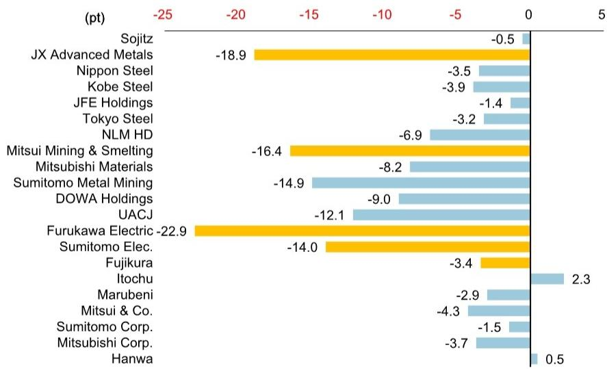

# The AI Infrastructure Rotation Is a Gift, Not a Signal: Why the Wire and Cable Sell-Off Creates a Strategic Entry Point

The sharp correction in Japanese wire and cable stocks over the past seven trading days is not a warning about deteriorating fundamentals. It is a textbook rotation driven by momentum unwinding, sentiment fatigue, and a temporary vacuum in near-term catalysts. For investors who can distinguish between noise and signal, this pullback represents a rare opportunity to build positions in companies whose earnings trajectories remain firmly embedded in the structural demand for AI data center infrastructure. The market has confused a pause in optics adoption timing with a reversal in the underlying buildout cycle. That confusion will not last.

Between June 18 and June 22, the three major Japanese wire and cable producers—Furukawa Electric, Sumitomo Electric, and Fujikura—rode a wave of positive sentiment following Fujikura's upward revision to its full-year earnings guidance. Then the tide turned. Relative to the TOPIX, Furukawa dropped 22.9 percentage points, Sumitomo Electric fell 14 points, and Fujikura declined 3.4 points over the subsequent seven trading days. On the surface, the numbers look alarming. But the composition of the decline tells a different story.

Four factors drove the sell-off, and none of them reflect a change in the business outlook. First, the stocks had been the beneficiaries of aggressive momentum-driven buying, and profit-taking was inevitable once the immediate catalyst was priced in. Second, growing caution around the adoption timing of co-packaged optics (CPO) created a cloud over optical-related names, even though the long-term thesis for optical components in AI data centers remains intact. Third, with the next major earnings catalyst not arriving until late July, the market entered a dead zone where short-term traders had no reason to hold. Fourth, the broader correction across AI-related stocks added a macro headwind that amplified the rotation out of the sector.

The result is a dislocation between price and value. Consensus estimates for all three companies have continued to trend upward through June, even as share prices moved in the opposite direction. This is the classic setup for a buy-on-weakness opportunity, provided the investor has conviction that the underlying demand story has not broken.

## The Correction Is Concentrated in the Stocks That Rose the Most, Not the Ones with the Weakest Fundamentals

The dispersion in relative performance across the three companies is instructive. Furukawa Electric, which had the largest prior gains, experienced the sharpest correction at minus 22.9 percentage points relative to TOPIX. Fujikura, which had the most modest run-up, saw the smallest decline at minus 3.4 points. Sumitomo Electric landed in the middle. This pattern is consistent with momentum reversal, not with a reassessment of individual company fundamentals.

When a correction is driven by a change in the underlying earnings outlook, the stocks with the weakest business trends tend to fall the most, regardless of prior performance. That is not what happened here. Instead, the magnitude of the decline correlates almost perfectly with the magnitude of the preceding rise. This is the signature of a sentiment-driven unwind, not a fundamental repricing.

Equally important, the relative performance of the three stocks during the correction aligns with their exposure to the optical component cycle. Furukawa, which has the highest sensitivity to optical demand among the three, was the most vulnerable to the CPO adoption concerns. Fujikura, which has a more diversified revenue base, was the most resilient. Again, this is consistent with a sector-wide sentiment shock, not a company-specific earnings problem.

For strategic investors, this creates a clear analytical task: determine whether the CPO adoption delay is a genuine threat to the multiyear demand trajectory for optical components, or whether it is a temporary timing issue that will be resolved as hyperscaler architectures evolve. The evidence from export statistics and component usage trends suggests the latter. Optical component volumes for AI data centers continue to increase, and the structural need for higher bandwidth in interconnect infrastructure has not diminished. The CPO question is not whether it will happen, but when. And in the interim, traditional optical solutions will continue to see robust demand.

## Consensus Estimates Are Rising Even as Prices Fall, Creating the Most Reliable Signal of a Dislocation

The most powerful evidence that the sell-off is disconnected from fundamentals lies in the consensus estimate data. For Furukawa Electric, the FY3/27 consensus operating profit estimate rose from 95 billion yen in January to 100 billion yen in June, a 5.3 percent increase. For FY3/28, the estimate surged from 145 billion yen to 158 billion yen, a 9 percent increase in just six months. Sumitomo Electric saw its FY3/27 consensus move from 425 billion yen to 445 billion yen, and its FY3/28 estimate jumped from 555 billion yen to 555 billion yen after a significant upward revision in May. Fujikura's FY3/27 consensus rose from 311 billion yen to 345 billion yen, and its FY3/28 estimate climbed from 398 billion yen to 385 billion yen, with the most dramatic monthly increase occurring in June.

These are not marginal adjustments. The magnitude of the upward revisions, particularly in the May and June periods, signals that analysts are incorporating real data on component demand, not just extrapolating from prior trends. The April and May export statistics for optical components and wire and cable products have been strong, and the increased usage of optical components in AI data center builds is now visible in the supply chain data.

When consensus estimates are rising and share prices are falling, one of two things must be true. Either the market is correctly anticipating a future deterioration that analysts have not yet captured in their models, or the market is overreacting to near-term noise and creating a valuation gap. In this case, the evidence supports the latter interpretation. The concerns about CPO adoption timing are real, but they affect the outer years of the demand curve, not the current fiscal year or the next. The near-term earnings trajectory is driven by the actual deployment of optical components in data centers that are being built today, and that deployment is accelerating.

This is not a buy signal that requires blind faith. It is a buy signal that requires a clear-eyed assessment of the timing mismatch between market sentiment and business reality.

## The Hyperscaler Earnings Cycle in Late July Will Be the First Real Test of the Bull Case

The market is currently in a catalyst vacuum. The next major information event for the wire and cable sector will be the hyperscaler earnings reports in the second half of July, followed by Corning's earnings. These reports will provide the first concrete data on whether the capital expenditure plans of the largest AI infrastructure spenders remain on track, and whether the demand for optical components is continuing to grow at the pace that consensus estimates assume.

For investors considering whether to enter positions during the current weakness, the risk-reward calculation depends on the expected outcome of these earnings reports. If hyperscaler capex guidance remains strong or is revised upward, the current sell-off will look like a gift in retrospect. If guidance is cut or delayed, the correction could deepen.

The report does not take a definitive position on which outcome is more likely, but the structure of the argument points toward the former. The underlying demand for AI compute capacity has not shown signs of abating, and the optical component supply chain is operating at elevated utilization rates. The CPO concern is a medium-term technology transition risk, not a near-term demand risk.

This creates an interesting asymmetry. The downside scenario is limited by the fact that the stocks have already corrected significantly and are now trading at valuations that partially discount the CPO risk. The upside scenario is substantial because the market has not yet priced in the possibility that hyperscaler earnings will reaffirm the demand trajectory. For investors with a 6-to-12-month horizon, the entry point is attractive precisely because the next catalyst is likely to resolve the current uncertainty in favor of the bulls.

## What the Report Does Not Fully Answer: The Structural Impact of CPO on the Optical Component Value Chain

The report identifies CPO adoption timing as a source of market concern, but it does not fully address the structural question of what CPO means for the wire and cable industry over a 3-to-5-year horizon. This is a critical gap that investors need to think through for themselves.

CPO, or co-packaged optics, represents a shift in how optical components are integrated into data center switches and routers. Instead of using pluggable optical modules that are separate from the switch ASIC, CPO integrates the optical engine directly into the same package as the switch chip. This improves power efficiency and bandwidth density, but it also changes the bill of materials for optical components and potentially reduces the total addressable market for certain types of optical modules.

The key question is whether CPO is a threat to the revenue models of companies like Furukawa, Sumitomo Electric, and Fujikura, or whether it is simply a different technology pathway that will require different products. The answer likely varies by company. Furukawa, with its strong position in optical fiber and cable, may be less affected than companies that are heavily exposed to pluggable module assembly. Sumitomo Electric's diversified business across wire, cable, and optical components provides a natural hedge. Fujikura's exposure to the hyperscaler direct-connect market may actually benefit from CPO if it drives higher bandwidth requirements in the interconnect infrastructure.

The report does not provide a definitive answer on this question, and investors should not assume that the CPO risk is fully priced into current valuations. The correct response is not to ignore the risk, but to monitor it actively and to adjust position sizing based on the pace of CPO adoption announcements from hyperscalers and optical component vendors.

## A Decision Framework for Acting on the Current Dislocation

For readers who are considering whether to act on the current pullback, the following framework can help structure the decision.

First, assess the time horizon. If the investment horizon is less than three months, the lack of near-term catalysts makes the trade difficult. The stocks may drift sideways or lower until the hyperscaler earnings reports in late July. Short-term traders should wait for a clear catalyst before committing capital.

Second, evaluate the conviction on the CPO timeline. If the view is that CPO adoption will accelerate rapidly and displace traditional optical modules within the next 12 to 18 months, then the current sell-off may be the beginning of a longer-term de-rating. If the view is that CPO is a 2028 or 2029 phenomenon, then the current concerns are overblown and the pullback is a buying opportunity.

Third, consider the relative positioning within the sector. Furukawa offers the highest upside if the optical demand thesis is correct, but it also carries the highest CPO risk. Fujikura offers the most downside protection given its diversified revenue base and smaller relative correction. Sumitomo Electric sits in the middle, providing a balanced exposure to the theme.

Fourth, use the consensus estimate trajectory as a confirmation signal. If estimates continue to rise through the July earnings season, the case for buying becomes stronger. If estimates start to flatten or decline, the risk of further downside increases.

The report's conclusion is clear: the sell-off is driven by supply-demand and sentiment factors, not by a deterioration in fundamentals. But conviction alone is not a strategy. The investor who acts on this insight must also have a plan for managing the timing risk and the CPO technology risk.

## The Full Picture Requires More Than a Summary

This article has synthesized the core argument from the original research report, but it has not reproduced every data point, chart, or analytical nuance that supports the thesis. The consensus estimate trends, the relative performance exhibits, and the detailed breakdown of the correction factors all contain granular information that is essential for building conviction.

For serious investors who want to review the original charts and the full analytical framework, the complete report is available. Join the community to read the full report and review the original charts. The data on monthly consensus estimate trends, the TOPIX-relative performance analysis, and the detailed disclosure on analyst ratings and price targets provide the context needed to make an informed decision. The current dislocation will not last forever, but the window for acting on it is finite.

*This article is for learning and discussion only and does not constitute investment advice.*

Personal reading notes and learning share only. Not investment advice.

