July 2, 2026 03:00 AM GMT

Retailing - Food | Europe

# A Prisoner's Dilemma: Too much space, too little demand

The Polish grocery sector continues to pump supply into a falling demand backdrop. As the market digests this core supply/demand imbalance, we think earnings and multiples will be forced to rebase downward, with our average EBIT -9% below Street. We restart coverage with JMT, DNP at Underweight. Zabka at Equal-weight.

Poland's food retail market is transitioning to its next life stage, which requires a change in space/competitive strategy or risks depleting industry margins. Our views are counter-consensus and we see significant earnings risk ahead – we restart coverage with EBIT -9% below Street. We think the market fundamentally misunderstands where Polish food retail sits on the maturity curve. The sector needs to digest a shift away from space-driven growth and towards a more mature backdrop, where focus will be on driving up same store sales densities. We do not expect the process to be smooth. In the near term, there is still a race for space and a classic prisoners' dilemma, whereby no-one wants to be the first to pull back on space growth, because this would risk allowing competitors to gain scale at their expense. Our analysis shows that store pipelines among the Modern 5 are down \~4% since 2022, but a much more significant retraction is needed. At the current pace, we think it's likely we see another -5% contraction in volume sales densities as demand simply cannot keep up with supply.

Market is too bullish on both top line and margins and we see downside over a multi-year period. We expect sales to miss forecasts (we are -3% below Cssus on avg in 2028e), both due to space contribution coming down over time, but also due to mature stores generating lower sales than expected, as steep price investments continue and traditional market share funding sources are increasingly exhausted. Returns on capital also appear unlikely to recover to pre-2023 levels, and are more likely to trend further down from here, which leads us to expect further contraction in trading multiples. In addition, Poland faces a structural long-term decline in its population, shrinking \~0.4% pa historically, which directly weighs on volumes, and is only in the early stages of shifting towards digital/omni channel, which will put additional channel mix pressure on margins over time. More near term, we expect another year of intense competition, against a muted demand backdrop (Biedronka back to -3% deflation in its basket as of Q1, industry volumes down -1.4% L3M). Investor narrative is focused on cyclical weakness in volumes / food inflation; however, we think the more pertinent question to ask is – can the market absorb this much capital?

We return to coverage with Underweights on Jeronimo Martins and Dino Polska, and an Equal-weight rating on Zabka; we are materially below Consensus forecasts on all 3. By stock -

MS & CO. INTERNATIONAL PLC+

+44 20 7677-5006

RETAILING - FOOD

Industry View In-Line

Exhibit 1 : Summary of our ratings and key estimates vs Cssus.

<table><tr><td>KPI</td><td>JMT</td><td>DNP</td><td>ZAB</td></tr><tr><td colspan="4">MSe vs Cssus</td></tr><tr><td>Sales 2028e</td><td>(3.4%)</td><td>(2.3%)</td><td>(1.5%)</td></tr><tr><td>EBITDA 2028e</td><td>(3.3%)</td><td>(9.9%)</td><td>(2.5%)</td></tr><tr><td>EPS*</td><td>(8.7%)</td><td>(15.6%)</td><td>(7.7%)</td></tr></table>

<table><tr><td colspan="4">Investment view</td></tr><tr><td>Rating</td><td>Underweight</td><td>Underweight</td><td>Equal-weight</td></tr><tr><td>12m target price</td><td>€ 15.50</td><td>PLN 23.40</td><td>PLN 28.60</td></tr><tr><td>Upside/downside at TP</td><td>(7.5%)</td><td>(17.6%)</td><td>5.1%</td></tr><tr><td>Cssus trading PE</td><td>13.1x</td><td>15.9x</td><td>19.9x</td></tr></table>

Source: MS estimates. \*EPS is shown for 2028e for DNP/ZAB and 2027e for JMT due to Cssus availability. For JMT we show the EPS on a reported basis, due to meaningful lack of comparability in our definition of underlying EPS vs Cssus

MS does and seeks to do business with companies covered in MS. As a result, investors should be aware that the firm may have a conflict of interest that could affect the objectivity of MS. Investors should consider MS as only a single factor in making their investment decision.

For analyst certification and other important disclosures, refer to the Disclosure Section, located at the end of this report.

+= Analysts employed by non-U.S. affiliates are not registered with FINRA, may not be associated persons of the member and may not be subject to FINRA restrictions on communications with a subject company, public appearances and trading securities held by a research analyst account.

\- Jeronimo Martins: We think Biedronka (70% sales/ 90% of Group EBIT) is pursuing the right mid-term strategy to defend ROCE and margins. From our perspective, its strategy appears to be to flex its strengths (such as scale economies, balance sheet, payment terms), invest in price aggressively and grab as much volume / space to ensure its relative scale advantage is preserved. In this stage of the food retail life cycle, we would expect to see share concentrating among the top of the pyramid, and we think Biedronka is on track to emerge as the share winner. However all this said, near term we see earnings downside: we think Cssus EBITDA estimates for Biedronka are 6.5% too high by 2028e and valuation multiples are unlikely to recover to 10yr averages. At 12.5x target P/E / 1.5x PEG, we see -8% downside.
Underweight.

\- In the case of Dino Polska, we see even greater share price downside of -18%, due to our earnings being -16% below Cssus. We think greater price investments are needed, creating margin downside, and we also note that DNP is much more reliant on space growth than Biedronka. We'd estimate \~450bp 5yr avg avg space contribution to the LfL of DNP from space ramp-up vs \~100bp for Biedronka, and of the overall 3yr sales growth of Cssus, \~70% is from space for DNP vs \~50% for Biedronka. A slowdown in top line is amplified by rapidly growing opex/capex, given increasing fixed costs through store rollout. Last year SG&A was up 19%, D&A was up 23%, against sales growth of 15%. We think mature store margins will likely exit 2028e below those of Biedronka (vs approximately on par currently). From a multiple standpoint, we think Cssus 12m fwd PE of \~16x is high relative to delivered EPS CAGR of \~5% over 2023-25 (ie since market structural dynamics changed in our view), but also relative to our 2028-26e CAGR of \~11%, considering the stock usually trades around \~1x PEG and pays no dividend. Underweight.

\- Finally, on Zabka – we see it as relatively more insulated from these market dynamics given its channel/product mix (though not immune; our sales are still -1.5% below Cssus). Franchisee economics and Romania expansion likely caps operating leverage upside near term and makes the EBITDA margin outcomes range-bound – our forecast of \~12.9% in 2028e is in line with guidance. Zooming in on the balance sheet, we think management actions on debt refinancing/de-leveraging are a key positive, however reverse factoring exposures were up +21% yoy in 2025, with increased total share of payables, which lead us to have a higher risk perception of the stock. Overall our EPS is \~8% below Cssus by 2028e, but at target P/E of \~19x / 1x PEG, we see the stock as around fair value. Equal-weight.

## Our views in more detail:

Volume growth simply cannot keep up with the level of supply entering the market. Since 2023, space growth has been expanding into a decelerating demand pool, significantly outpacing volume growth. While modern selling space has been growing in the mid SD for much of the past 10 years, historically this has not been a problem, as modern grocery volumes were amplified by share gains from the informal channel – particularly for discounters and the listed group. However, our analysis shows MDG penetration has now plateaued and traditional channels are increasingly exhausted as a funding source. We think either space growth needs to slow, or volumes need to see a material acceleration. It is difficult to see a catalyst for this, considering market volumes were down -1.7%/-0.4% over 2024/25 when real disposable income growth was up \~6% pa, whereas for 2026-28e is projected to be much lower at 3%-2% by the NBP, accompanied by an elevated savings rate of households. In numbers:

\- Selling space in Poland (ie capital invested) by the top 10 "modern formats" has grown with a \~4.5% 10yr CAGR out to 2025, and much of this has come specifically from the Discounter channel (\~5% 10yr CAGR, accelerating to \~7% in the last 5 years). Over the same period, industry volumes were up slightly, \~1% pa on average, including benefits from structural trade up in the mix of basket, as customers sought more convenience.

\- Volumes across the top "Modern 5" grocers (which we define as Biedronka, Lidl, Aldi, Kaufland and Dino Polska) fared much better than the overall market, as they were amplified by channel rotation and share gains, growing with a \~6% CAGR over 10yrs. The key funding sources have been small local grocers and hypermarkets. In other words, for most of the past decade, volume growth across the key modern formats was sufficient to cover for the growth in invested capital.

\- This changed in 2023. Industry space has still been expanding at \~3%-4% pa across modern formats, but volumes have been up only \~2%-3% pa across the top 5, against a broader market backdrop of volumes down -2%. These volume gains were hard won, with an ongoing price war between the key price setters.

Supply has started to come down, but not enough; expansion plans are still budgeted according to pre-2023 structural trends. There were \~570-500 new stores entering the market from the "Modern 5" per year over the last 3 years. The number of net stores has been slowing and is down slightly since 2022, but still needs to meaningfully moderate further to reflect the evolution in market structure. Our analysis shows that if the "Modern 5" wish to keep their sales densities flat (as that is the key driver of ROIC), in aggregate they need to generate \~PLN14bn incremental sales pa or take \~320bp of above-market growth to keep up with supply. We do not think this is realistic, as it implies a pace of share gains which is twice the run-rate of share gains over 2025 which was \~150bp pa. Over the last 3 years deflated sales densities per store are down -4% pa across the Modern 5 as a result. We expect this trend to continue over the mid-term, based on current communicated store opening plans. Key stats:

\- Modern grocery penetration in Poland sits at 85% today according to data from Euromonitor, up from 72% in 2018. Mature markets – such as the UK or Ireland – typically peak at \~90%-94% using the same Euromonitor definition of MDG, and the pace of gains beyond 90% tends to be slow. Over the past 3 years, MDG penetration in Poland has been stagnant, compared to a pre-2023 5yr average of \~260bp share gains per year.

\- In 2025, Biedronka added 152 stores (down -6% y/y) while Dino Polska added 345 stores (up 22% y/y). Lidl, Kaufland and Aldi together added another \~73 stores. Altogether, across these 5 companies, the market supply is around 570 stores entering the market per year, or \~540 if the levels of supply stay in line with the 3 year average. Running forward this level of supply would imply Poland reaches \~95% modern grocery penetration by 2028e, all else equal. This does not sound plausible, given that Poland already has one of the highest levels of discounter penetration in Europe at \~38%.

\- While \~570 stores at first glance may not sound like a large figure relative to the >29k small/independent stores still present in Poland (per Euromonitor), it represents a much more significant amount of sales. The average sales density of a 'modern' format store across these 5 companies is >5.5x higher vs the rest of the market, given their store size and wide SKU range vs traditional stores.

\- As a result, for every 570 modern stores which are added, \~PLN14bn sales need to be generated (i.e. captured away from competitors), if the 'Modern 5' want to keep their sales densities flat. In our view, this is not likely to be possible at current levels of profitability. Indeed, the sales densities gap of the Modern 5 vs the rest of the market has been narrowing over the past 3 years since the supply/demand imbalance began, falling from \~6.0x towards \~5.6x now (and vs a heyday peak of \~8x in 2016).

\- Up until now, the informal channel has served as a clear donor, but over 2025, small grocers/specialists lost only \~50bps of share, while hypers lost \~30bps. This is markedly below the pre-2023 5yr average of \~350bp across the two channels.

Food Retail is effectively a zero sum game: as long as supply exceeds demand, the fight for volumes will continue – driving incremental price investments – until a new equilibrium level is reached. The situation is reminiscent of the post-2010 period in the UK. Grocery demand is borne out of necessity and is generally inelastic to the number of stores present in the market. For volume sale densities to be maintained at the top modern 5 players, there needs to be a funding source. As has been seen in other markets, once MDG penetration flattens, competition then moves between modern players, as each aims to consolidate volume – reflected in the ongoing price war between Biedronka and Lidl. Concentration of modern market share among the top 5 players leaves room for increase vs developed market levels. Therefore, we would expect to see continued steep competition over multiple years as the market concentrates and volume growth is reliant on taking share away from other modern grocers – through price investments. This is a normal stage of evolution in the food retail life cycle.

Race for space: A prisoner's dilemma. One may ask, why keep adding space if demand cannot meet supply? Why not simply pull back? From each grocers' individual lens, their actions are rational; not adding space, while everybody else continues to do so, may deliver a worse competitive outcome for them long-term. A common theme from company communications is that white spots still exist vs their own existing portfolio – Dino Polska is a classic case in point, with bulls on the stock regularly highlighting that it is under-penetrated in certain regions. For example, in Masovia (region of Warsaw), it has only 4.8 stores per 100k inhabitants vs a nationwide avg of Poland which is much higher at 8.3x. Therefore it is true that DNP has

theoretical room to dense up its network in Masovia – however this overlooks the fact that Biedronka, Lidl, Zabka are already heavily present in Masovia and the region is not under-served in aggregate. Similarly, if Biedronka does not open a store in a region where it has 'white space' but a competitor does, it risks the competitor outpacing Biedronka in market share gains and benefiting from incremental scale economies which can then be reinvested in lower prices. In aggregate, these dynamics create a race for space.

Capital allocation: Biedronka's actions are rational from its own perspective. It is a point of debate as to which situation is preferable – a prolonged period of oversupply, gradually depleting profitability lower, or a situation where a strong market leader forces profitability lower for a 1-2 year period for everyone, and therefore forces oversupply to slow, as the market transitions. Over time, this then forces participants to reset strategies and gradually look for ways to repair margins. Squeezing the profitability / cashflows of competitors, for example by offering yoy pay increases above the growth in minimum wage, or tightening supplier terms (eg JMT days payables have come down to \~99 now vs prior peak or \~108) would make sense for a rational actor looking to capture the most of remaining profitable locations / switch volumes. In fact, the strategy is working – Carrefour's Polish operations, as an example, are up for sale and the retailer is looking to exit. In addition, from a Group standpoint, Poland remains a higher ROE region vs other geographies. While Polish profitability may be falling, it is still materially higher versus other regions – in Poland Jeronimo Martins makes EBIT margin of \~5.1% at Biedronka vs in 2.1% Portugal (and EBIT return on assets of 13% vs 4.4%, respectively). Therefore, given its high cash generation, it makes sense that incremental capital would be deployed in the highest earning region. A similar logic holds true for Lidl and its broader DM portfolio, in our view, and has generally been the reason why there is a high presence of international operators in the country (eg French grocers).

Biedronka's and Dino Polska's baskets are back in significant deflation as of Q1, with no signs of competition abating. Our Dlahandlu price tracker, plus companies' disclosures, suggest Biedronka reopened a material price gap vs the market in Q1 this year, on our estimate pricing -7% below the market average, compared to an exit rate of \~4.7% as of 4Q. This tallies with company commentary which suggests that the gap of Biedronka's rate of basket inflation vs peers widened \~from 200bp below the market over 1Q/3Q25 to >500bp in 1Q26 on our maths. Our data suggests these trends have continued over 2Q, with Lidl also responding in turn. Dino Polska is similarly operating with deflation since Q4, and 2%/3% deflation as of Q1, as the company has sharpened its pricing policy, which our price tracker shows has continued Ytd with \~140bp investment in relative price position as of 2QTD vs 2025 avg (and compared to \~270bp at Biedronka). We do not see competition abating any time soon, against a backdrop of muted food inflation for the industry as a whole (MS econ: +1.2% 26e). While food inflation will likely accelerate from Q4 onwards, on the demand side, wage growth in 2027 for the lower income quartile of households is likely to be moderate at \~3% (this is the bucket with highest propensity to consume / highest share of food items in their basket). As a result we think volume growth will remain reliant on share gains and price investments, making it challenging for food retailers to pass on the full extent of input costs.

Jeronimo Martins: Underweight. We think Biedronka (and JMT as a whole) is a fundamentally well-run and socially responsible business. Our estimates are marked for the group prioritizing defending ROIC and a strategy consistent with stable ROA in Poland, gradually bringing down net new stores, while investing in prices to drive volume outperformance vs peers. However, from a share price standpoint, we think Cssus looks too optimistic and is mistakenly extrapolating past performance when it comes to LfL and space expectations. As a result, our Group EBIT sits -5% below Cssus by 2028e, with the key Biedronka division being -6.5% below Cssus at the EBITDA level. We expect weaker top line trends than Street, as we assume that pricing will remain depressed with Biedronka investing ahead of peers, with only \~1% positive basket inflation over 2027/28e and -1% in 26e. Against that, we think Biedronka's mature store volumes (pre ramp up benefit from space) are likely to be up modestly (\~1%-2%), given the market backdrop and lower scope for share gains vs history. Overall, this leaves us with avg Biedronka LfL of \~2.2% over 26/28e, c100bp below Cssus pa, and our space growth contribution is also \~100bp below Cssus. From a multiple standpoint, the stock is on \~13x 12m Cssus earnings currently, vs 10-20yr average of 19x-20x. However, given our views on market structure, we don't think historical multiples apply; referencing this against DM PEG ratios, we think \~12.5x implied P/E at price target is a fair middle ground. Our EUR15.50 PT implies \~8% downside.

Dino Polska: Underweight. We see -16% earnings downside to Consensus and -18% downside to the share price. "Rapid organic growth in the number of stores" is the first bullet of Dino's mid term business development strategy. Correspondingly, Cssus models \~10% avg space contribution to sales per annum over 26-28e, while simultaneously delivering above-market same store volumes (\~5% LfL) and EBITDA margins staying flat vs 2025. We think at least one of these things has to give. We do not think that DNP can continue rolling out space at its targeted run-rates, while at the same time seeing a stable margin.

\- While Biedronka is defending price position and fighting for volume from a position of strength, in the case of Dino Polska we think the adjustment will be more margin-consumptive, as price gaps are not as competitive and this is already coming thru the numbers. As of Q4, the company commented "customers [are] actively seeking out promotions and basing many of their purchasing decisions on price. Dino Polska takes this signal seriously. [...] At the end of the year, deflation returned to our shelves. [...] [Deflation] has continued into [2026] and, for some time, it will remain an important variable affecting the rate of sales growth. [...] EBITDA margin will be its direct outcome". During Q1, language on pricing policy also emphasized a strategy aimed at "maximizing sales volumes". Based on our Dlahandlu price tracker, DNP priced \~2.2% above the market avg over 2025, while QTD, the price gap has improved to \~0.8%, suggesting DNP is investing in prices.

\- While being proactive on pricing is positive for volume momentum, market expectations around profitability have a high bar to clear. We expect EBITDA margin to be down \~37bp y/y in 2026e (similar to 2025), vs Cssus expecting -9bp y/y. By 2028e, we expect cumulative contraction of \~60bp. We would note that DNP's EBITDA margins have been in continued decline for the last 5 years, so our forecasts are consistent directionally with the reported trend (avg decline of \~50bp pa) and if anything imply risks are further to the downside.

\- Our analysis shows that Dino's EBITDA margin averaged 40bp above Biedronka's over 2020-24, or 85bp higher if adjusted for maturity of the store base. As of 2025, we estimate the mature margin is now broadly on par vs a peak premium of >250bp pre COVID. While Dino Polska has some unique features (eg meat counters and degree of vertical integration), we still think that given Biedronka is 3.2x larger, margins are more likely to continue to rebase downwards. For example in the UK the gap between the number 1 (Tesco) vs the number 2 (Sainsbury's) is about 100bp. Reflecting some of DNP's relative strengths, we do not go that far in rebasing the exit steady state margin, but by 2028e we expect the mature margin to be \~70bp below Biedronka's.

\- Lower down the P&L, we also note that financing costs were flat y/y in 2025 while gross debt was down -36% and the company was in a net cash position. We think this is explained by growth in reverse factoring liabilities. Reverse factoring exposure stood at \~44% of trade payables as of 2025, up from 36% in 2024. Interest on trade payables is up >80% y/y. Against these risk factors, we weigh that the interest rate being paid on the reverse factoring payables appears modest at \~3% (vs Zabka \~6.4%) which does not suggest excessive maturity transformation and the theoretical benefit to gross margin (if we were to recalculate COGS incl interest expense) is also small at \~6bp (out of gross margin up +26bp y/y). Given the overall net cash position, we do not adjust COE for the reverse factoring exposure, but it is a risk factor we will monitor.

\- Overall, our earnings are -16% below Cssus. In addition to rebasing EPS, we think the market also needs to take a haircut on DNP's multiple, as the new slower growth prospects become apparent. We value the stock on 1.1x PEG or \~12.3x implied P/E at price target, against \~11% expected 2026-28e EPS CAGR but no dividend yield.

Zabka: Equal-weight. Out of the three Polish food retailers, we think Zabka has the relatively most insulated end market exposure, as we see better dynamics in the convenience and food service channels (see our structural growth analysis here). In addition, we see it as less exposed to the ongoing discounter price/space war, given the difference in its format and lower exposure to grocery. So why not Overweight? Our EPS is -8% below Cssus by 2028e and we do not think the multiple leaves much cushion to absorb cuts.

\- LfL momentum has been coming in lower vs our original expectations and we now have 4.8% avg LfL over 2026-28e as our new base case. We also note that DCO growth y/y disclosure appears to have been discontinued at least for 1Q26; if this continues for the following quarters, it would materially reduce our visibility and ability to track progress towards the company's 5x growth target (MSe 2.6x by 28e; of the 2x sales to end customers target, c8% of the growth would come from DCO at target on our calculation).

\- Franchising economics also look to have further shifted in favour of the franchisees, with franchisee margin up +60bp in 2023/+20bp in 2024/+30bp in 2025. Our estimates are marked for avg franchisee pay increasing to \~PLN9.25k per month in 2026e, in line with the announced pay increase for Biedronka's high-end store manager pay incl. variable compensation. We now think that it's unlikely Zabka will have leverage through this line and model flat franchisee margin from here, as min. wage for Poland in 26e is expected to be up 3%-4% and would in theory should be below sales growth; but we note risks are to the downside.

\- From an overall EBITDA margin standpoint, our forecasts are broadly in line with guidance at \~12.9% exit margin in 2028e. On the plus side, we think management has a good steer on this line as it can control the pace of openings (and therefore losses) coming out of Romania; we also note CMD disclosure that Romania ticket size is close to catching up to Polish levels. However, on the negative side, we think upside on margin is likely capped due to the Romanian expansion mid-term, as we think any operating leverage will likely be recycled into accelerated store rollout. Overall our EBIT is \~6% below Cssus by 2028e.

\- From a balance sheet standpoint, we note meaningful progress on balance sheet de-risking from an overall leverage standpoint post debt refinancing, which is a key positive (net debt/EBITDA on our definition now at \~2.3x as at end 2025). On the other hand, reverse factoring exposure is still higher vs key sector peers, at around \~50% of payables, and has increased in absolute amounts by \~21% y/y in 2025, which is the opposite direction vs what we would have preferred to see in order to reduce our risk perception of the stock.

\- Finally, regarding CEO change - we think there should be continuity; incoming CEO Tomasz Blicharski has held various executive roles in the Group over the last 15 years, while outgoing CEO Tomasz Suchanski will become Chairman. We also note Adam Manikowski remains CEO of Zabka Polska, which we find reassuring.

\- Away from management changes, overall, we value the shares with a \~20% discount to 'growth stage' sector PEG of \~1.3x, due to balance sheet risk factors and liquidity considerations, which implies \~19x PE at price target / 1x PEG and \~5% upside from last close.

Where could we be wrong? The key uncertainty against our thesis is timing, in our view. While we have conviction on the end state outcome, along the way there could be various escape valves which may create peaks and troughs. These include potentially higher food inflation, consolidation actions, private operator exits, weaker grocers failing, supplier leverage / rationalisation, and consumer premiumisation. This may mean that the 'equilibrium' between supply/demand takes longer to reach than we expect, and there is relief in a particular year, whereby LfL / margin momentum is better than expected.

## Poland: Structural Transition

Exhibit 2: Poland Grocery Retail: Space expansion has materially outpaced volumes since 2023, leading to softer supply/demand ratios  
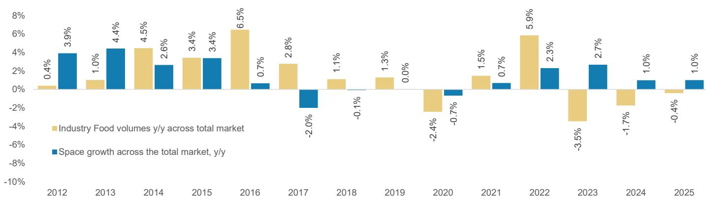  
Source: Euromonitor, Haver, MS

Exhibit 3: Zooming in on modern format stores, historically volume growth has been above space growth, but trends are much softer as of late. Note: the Top 10 Modern formats will include share donors, as share is now concentrating among the top of the pyramid (which we define as the Modern 5).  
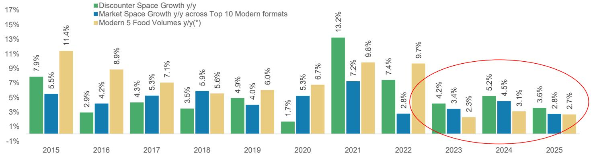  
Source: EDGE, Euromonitor, Haver, MS. Modern 5 refers to Aldi, Lidl, Kaufland, Biedronka, Dino Polska.

Exhibit 4: Modern grocery penetration as % grocery sales: Current peak penetration is \~94% in Ireland / Finland; Poland sits at 85% today  
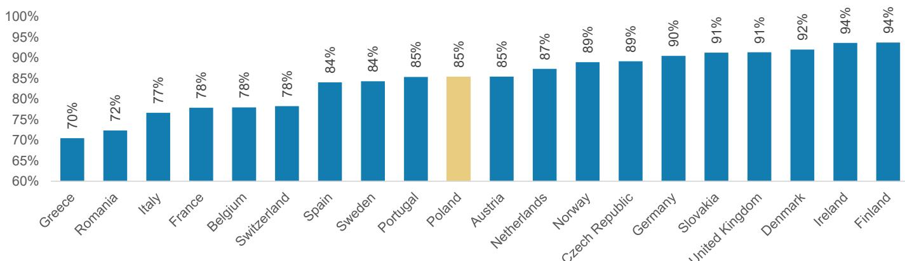  
Source: Euromonitor, MS estimates

■ Discounter penetration ■ Other MDG ● Total MDG penetration

Exhibit 5: Poland: History of modern grocery penetration as % total groceries: has plateaued at \~85%; 2026-2028e shown if pace of expansion across Biedronka, Dino Polska, Aldi, Lidl and Kaufland is unchanged vs the 5yr average and sales densities are maintained  
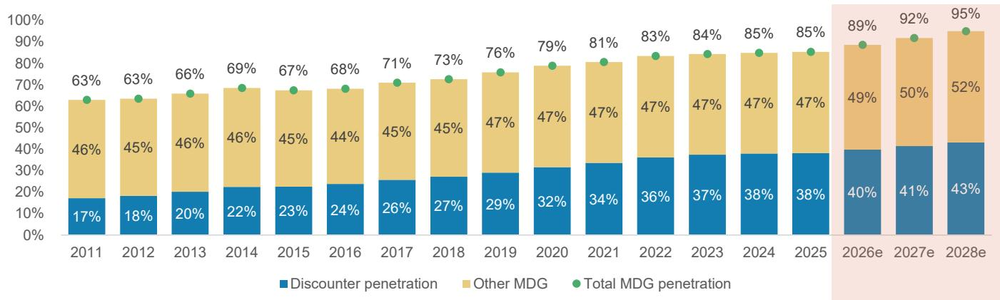  
Source: Euromonitor, MS estimates

Exhibit 6: Discounter penetration is among the highest in Europe at \~38% of the market  
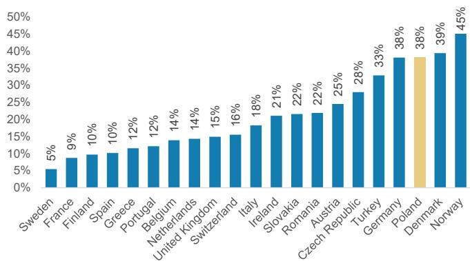  
Source: Euromonitor, MS

Exhibit 7: Market share gains y/y by format in Poland, as % total sales

<table><tr><td>Segment</td><td>Convenience Retailers</td><td>Super-markets</td><td>Hyper-markets</td><td>Discounters</td><td>Food/Drink Specialist</td><td>Small Local Grocers</td></tr><tr><td>2015</td><td>58bp</td><td>-20bp</td><td>-152bp</td><td>5bp</td><td>321bp</td><td>-213bp</td></tr><tr><td>2016</td><td>40bp</td><td>-51bp</td><td>-41bp</td><td>129bp</td><td>47bp</td><td>-124bp</td></tr><tr><td>2017</td><td>95bp</td><td>7bp</td><td>-19bp</td><td>190bp</td><td>-198bp</td><td>-75bp</td></tr><tr><td>2018</td><td>59bp</td><td>34bp</td><td>-70bp</td><td>147bp</td><td>-120bp</td><td>-50bp</td></tr><tr><td>2019</td><td>138bp</td><td>41bp</td><td>-54bp</td><td>194bp</td><td>-205bp</td><td>-114bp</td></tr><tr><td>2020</td><td>123bp</td><td>26bp</td><td>-95bp</td><td>254bp</td><td>-23bp</td><td>-285bp</td></tr><tr><td>2021</td><td>96bp</td><td>25bp</td><td>-144bp</td><td>198bp</td><td>49bp</td><td>-225bp</td></tr><tr><td>2022</td><td>22bp</td><td>79bp</td><td>-73bp</td><td>251bp</td><td>-219bp</td><td>-60bp</td></tr><tr><td>2023</td><td>-60bp</td><td>85bp</td><td>-69bp</td><td>130bp</td><td>-59bp</td><td>-28bp</td></tr><tr><td>2024</td><td>-18bp</td><td>44bp</td><td>-25bp</td><td>57bp</td><td>-41bp</td><td>-17bp</td></tr><tr><td>2025</td><td>5bp</td><td>53bp</td><td>-27bp</td><td>18bp</td><td>-35bp</td><td>-14bp</td></tr></table>

Source: Euromonitor, MS

## Exhibit 8:

Illustrative analysis of modern grocery penetration in Poland if the level of supply stays unchanged; deflated sales density per store across the Modern 5 has been contracting

<table><tr><td>Segment</td><td>2016</td><td>2017</td><td>2018</td><td>2019</td><td>2020</td><td>2021</td><td>2022</td><td>2023</td><td>2024</td><td>2025</td><td>2026e</td><td>2027e</td><td>2028e</td></tr><tr><td>Biedronka</td><td>2,722</td><td>2,823</td><td>2,900</td><td>3,002</td><td>3,115</td><td>3,250</td><td>3,395</td><td>3,569</td><td>3,730</td><td>3,882</td><td>4,034</td><td>4,186</td><td>4,338</td></tr><tr><td>Dino Polska</td><td>628</td><td>775</td><td>977</td><td>1,218</td><td>1,473</td><td>1,815</td><td>2,156</td><td>2,406</td><td>2,688</td><td>3,033</td><td>3,378</td><td>3,723</td><td>4,068</td></tr><tr><td>Schwarz Group (Lidl + Kaufland)</td><td>810</td><td>816</td><td>868</td><td>918</td><td>975</td><td>1,028</td><td>1,079</td><td>1,127</td><td>1,160</td><td>1,183</td><td>1,206</td><td>1,229</td><td>1,252</td></tr><tr><td>Aldi</td><td>118</td><td>124</td><td>132</td><td>138</td><td>157</td><td>196</td><td>251</td><td>295</td><td>350</td><td>400</td><td>450</td><td>500</td><td>550</td></tr><tr><td>&quot;Modern 5&quot; Number of stores</td><td>4,278</td><td>4,538</td><td>4,877</td><td>5,276</td><td>5,720</td><td>6,289</td><td>6,881</td><td>7,397</td><td>7,928</td><td>8,498</td><td>9,068</td><td>9,638</td><td>10,208</td></tr><tr><td>Total market: Stores</td><td>131,463</td><td>110,608</td><td>99,151</td><td>93,457</td><td>90,446</td><td>91,993</td><td>95,976</td><td>98,684</td><td>98,512</td><td>99,195</td><td></td><td></td><td></td></tr><tr><td></td><td></td><td></td><td></td><td></td><td></td><td></td><td></td><td></td><td></td><td></td><td colspan="3">if unchanged vs 2025</td></tr><tr><td>Biedronka</td><td>55</td><td>101</td><td>77</td><td>102</td><td>113</td><td>135</td><td>145</td><td>174</td><td>161</td><td>152</td><td>152</td><td>152</td><td>152</td></tr><tr><td>Dino Polska</td><td>117</td><td>147</td><td>202</td><td>241</td><td>255</td><td>342</td><td>341</td><td>250</td><td>282</td><td>345</td><td>345</td><td>345</td><td>345</td></tr><tr><td>Schwarz Group (Lidl + Kaufland)</td><td>30</td><td>6</td><td>52</td><td>50</td><td>57</td><td>53</td><td>51</td><td>48</td><td>33</td><td>23</td><td>23</td><td>23</td><td>23</td></tr><tr><td>Aldi</td><td>12</td><td>6</td><td>8</td><td>6</td><td>19</td><td>39</td><td>55</td><td>44</td><td>55</td><td>50</td><td>50</td><td>50</td><td>50</td></tr><tr><td>&quot;Modern 5&quot; Change in stores y/y</td><td>214</td><td>260</td><td>339</td><td>399</td><td>444</td><td>569</td><td>592</td><td>516</td><td>531</td><td>570</td><td>570</td><td>570</td><td>570</td></tr><tr><td>&quot;Modern 5&quot;</td><td>70,495</td><td>78,763</td><td>85,277</td><td>94,822</td><td>105,982</td><td>119,972</td><td>151,725</td><td>178,292</td><td>190,029</td><td>204,267</td><td>217,968</td><td>231,669</td><td>245,370</td></tr><tr><td>Total Market: Sales PLN mn</td><td>262,573</td><td>270,444</td><td>277,485</td><td>285,002</td><td>287,899</td><td>306,512</td><td>359,334</td><td>396,072</td><td>410,430</td><td>426,713</td><td>426,713</td><td>426,713</td><td>426,713</td></tr><tr><td>Modern Grocery Sales</td><td>179,084</td><td>191,829</td><td>201,545</td><td>216,093</td><td>227,134</td><td>247,208</td><td>299,828</td><td>333,913</td><td>348,380</td><td>364,271</td><td>377,972</td><td>391,673</td><td>405,375</td></tr><tr><td>Traditional Channel Sales</td><td>83,489</td><td>78,615</td><td>75,940</td><td>68,909</td><td>60,764</td><td>59,305</td><td>59,506</td><td>62,159</td><td>62,050</td><td>62,442</td><td></td><td></td><td></td></tr><tr><td></td><td></td><td></td><td></td><td></td><td></td><td></td><td></td><td></td><td></td><td></td><td colspan="3">keeping flat for illustration</td></tr><tr><td>&quot;Modern 5&quot;</td><td>16,479</td><td>17,356</td><td>17,486</td><td>17,972</td><td>18,528</td><td>19,077</td><td>22,050</td><td>24,103</td><td>23,969</td><td>24,037</td><td>24,037</td><td>24,037</td><td>24,037</td></tr><tr><td>Market: Sales density PLN 000s</td><td>1,997</td><td>2,445</td><td>2,799</td><td>3,050</td><td>3,183</td><td>3,332</td><td>3,744</td><td>4,014</td><td>4,166</td><td>4,302</td><td></td><td></td><td></td></tr><tr><td>&quot;Modern 5&quot; vs Market</td><td>8.3x</td><td>7.1x</td><td>6.2x</td><td>5.9x</td><td>5.8x</td><td>5.7x</td><td>5.9x</td><td>6.0x</td><td>5.8x</td><td>5.6x</td><td></td><td></td><td></td></tr><tr><td>MDG Penetration</td><td>68.2%</td><td>70.9%</td><td>72.6%</td><td>75.8%</td><td>78.9%</td><td>80.7%</td><td>83.4%</td><td>84.3%</td><td>84.9%</td><td>85.4%</td><td>88.6%</td><td>91.8%</td><td>95.0%</td></tr><tr><td>&quot;Modern 5&quot; penetration</td><td>26.8%</td><td>29.1%</td><td>30.7%</td><td>33.3%</td><td>36.8%</td><td>39.1%</td><td>42.2%</td><td>45.0%</td><td>46.3%</td><td>47.9%</td><td>51.1%</td><td>54.3%</td><td>57.5%</td></tr><tr><td>Change y/y (bps)</td><td>74bp</td><td>228bp</td><td>161bp</td><td>254bp</td><td>354bp</td><td>233bp</td><td>308bp</td><td>279bp</td><td>128bp</td><td>157bp</td><td>321bp</td><td>321bp</td><td>321bp</td></tr><tr><td></td><td></td><td></td><td></td><td></td><td></td><td></td><td></td><td></td><td></td><td></td><td></td><td></td><td></td></tr><tr><td></td><td></td><td></td><td></td><td></td><td></td><td></td><td></td><td></td><td></td><td></td><td></td><td></td><td></td></tr><tr><td></td><td></td><td></td><td></td><td></td><td></td><td></td><td></td><td></td><td></td><td></td><td></td><td></td><td></td></tr><tr><td></td><td></td><td></td><td></td><td></td><td></td><td></td><td></td><td></td><td></td><td></td><td></td><td></td><td></td></tr><tr><td></td><td></td><td></td><td></td><td></td><td></td><td></td><td></td><td></td><td></td><td></td><td></td><td></td><td></td></tr><tr><td></td><td></td><td></td><td></td><td></td><td></td><td></td><td></td><td></td><td></td><td></td><td></td><td></td><td></td></tr><tr><td></td><td></td><td></td><td></td><td></td><td></td><td></td><td></td><td></td><td></td><td></td><td></td><td></td><td></td></tr><tr><td colspan="14"></td></tr><tr><td>Total Market: Sales y/y</td><td>6.8%</td><td>3.0%</td><td>2.6%</td><td>2.7%</td><td>1.0%</td><td>6.5%</td><td>17.2%</td><td>10.2%</td><td>3.6%</td><td>4.0%</td><td></td><td></td><td></td></tr><tr><td></td><td></td><td></td><td></td><td></td><td></td><td></td><td></td><td></td><td></td><td></td><td></td><td></td><td></td></tr><tr><td>Food CPI</td><td>0.9%</td><td>4.4%</td><td>2.6%</td><td>4.9%</td><td>4.7%</td><td>3.1%</td><td>15.3%</td><td>14.9%</td><td>3.4%</td><td>4.7%</td><td></td><td></td><td></td></tr><tr><td>Volumes/mix (Euromonitor scope)</td><td>5.9%</td><td>-1.3%</td><td>0.0%</td><td>-2.0%</td><td>-3.5%</td><td>3.3%</td><td>1.7%</td><td>-4.1%</td><td>0.2%</td><td>-0.7%</td><td></td><td></td><td></td></tr><tr><td>Population growth</td><td>0.0%</td><td>0.0%</td><td>-0.1%</td><td>-0.1%</td><td>-0.8%</td><td>-0.5%</td><td>-0.4%</td><td>-0.3%</td><td>-0.4%</td><td>-0.4%</td><td></td><td></td><td></td></tr><tr><td>Volumes/mix ex population growth</td><td>5.9%</td><td>-1.3%</td><td>0.1%</td><td>-2.0%</td><td>-2.8%</td><td>3.8%</td><td>2.1%</td><td>-3.7%</td><td>0.6%</td><td>-0.3%</td><td></td><td></td><td></td></tr><tr><td></td><td></td><td></td><td></td><td></td><td></td><td></td><td></td><td></td><td></td><td></td><td></td><td></td><td></td></tr><tr><td></td><td></td><td></td><td></td><td></td><td></td><td></td><td></td><td></td><td></td><td></td><td></td><td></td><td></td></tr><tr><td></td><td></td><td></td><td></td><td></td><td></td><td></td><td></td><td></td><td></td><td></td><td></td><td></td><td></td></tr><tr><td></td><td></td><td></td><td></td><td></td><td></td><td></td><td></td><td></td><td></td><td></td><td></td><td></td><td></td></tr><tr><td></td><td></td><td></td><td></td><td></td><td></td><td></td><td></td><td></td><td></td><td></td><td></td><td></td><td></td></tr><tr><td></td><td></td><td></td><td></td><td></td><td></td><td></td><td></td><td></td><td></td><td></td><td></td><td></td><td></td></tr><tr><td>Modern 5 sales density y/y</td><td>4.3%</td><td>5.3%</td><td>0.7%</td><td>2.8%</td><td>3.1%</td><td>3.0%</td><td>15.6%</td><td>9.3%</td><td>(0.6%)</td><td>0.3%</td><td></td><td></td><td></td></tr><tr><td>Deflated at market CPI</td><td>3.4%</td><td>0.9%</td><td>-1.8%</td><td>-2.0%</td><td>-1.5%</td><td>-0.1%</td><td>0.2%</td><td>-4.8%</td><td>-3.8%</td><td>-4.2%</td><td></td><td></td><td></td></tr></table>

Source: Euromonitor, MS estimates (e)

Exhibit 9: At current pace of store openings, we think sales densities across the Modern 5 will see an aggregate contraction in the mid-SD as demand cannot keep up with supply and share gains are slowing

<table><tr><td colspan="2">Net store openings</td><td colspan="6">Sales density vs 2025 (ex pricing)</td></tr><tr><td></td><td></td><td>-5.0%</td><td>-4.0%</td><td>-3.0%</td><td>-2.0%</td><td>-1.0%</td><td>0.0%</td></tr><tr><td rowspan="10">Implied modern 5 share gains per annum</td><td>20bp</td><td>485</td><td>391</td><td>299</td><td>210</td><td>122</td><td>36</td></tr><tr><td>50bp</td><td>541</td><td>447</td><td>354</td><td>264</td><td>175</td><td>89</td></tr><tr><td>70bp</td><td>578</td><td>484</td><td>391</td><td>300</td><td>211</td><td>124</td></tr><tr><td>100bp</td><td>634</td><td>539</td><td>446</td><td>355</td><td>265</td><td>178</td></tr><tr><td>120bp</td><td>672</td><td>576</td><td>482</td><td>391</td><td>301</td><td>213</td></tr><tr><td>160bp</td><td>746</td><td>650</td><td>556</td><td>463</td><td>373</td><td>284</td></tr><tr><td>200bp</td><td>821</td><td>724</td><td>629</td><td>536</td><td>444</td><td>355</td></tr><tr><td>250bp</td><td>914</td><td>816</td><td>720</td><td>626</td><td>534</td><td>444</td></tr><tr><td>300bp</td><td>1,008</td><td>909</td><td>812</td><td>717</td><td>624</td><td>533</td></tr><tr><td>320bp</td><td>1,045</td><td>946</td><td>848</td><td>753</td><td>660</td><td>568</td></tr></table>

Source: MS

Exhibit 10: We expect to see diverging store opening trends at Biedronka vs Dino Polska based on current trends  
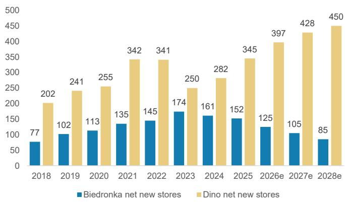  
Biedronka net new stores Dino net new stores  
Source: Company data, MS estimates

Exhibit 11: EBITDA margin y/y - we expect Biedronka to slowly recover given its scale advantages / hefty price investments / slower space rollout, while for Dino we expect continued declines  
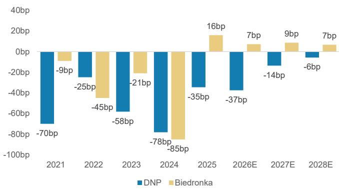  
Source: Company data, MS estimates

Exhibit 12: Our forecasts assume that Dino's mature margin rebases to be -70bp below Biedronka's by 2028e  
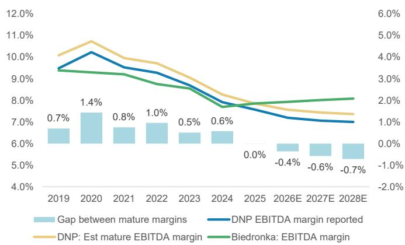  
Source: Company data, MS estimates

## Exhibit 13:

DlaHandlu price analysis: Biedronka is \~7% cheaper vs the market average and its price gap has been expanding over the past 2 quarters; Lidl also remains competitive at -7%. Methodological note: The Dlahandlu price survey is an imperfect measure and as with any price survey, there will be SKU / location selection bias, which may mean the survey is not representative of the company's price position as a whole; the treatment of loyalty schemes/promotions is also not explicit and data is recorded at irregular intervals per grocer. Therefore we suggest looking at directional trends in rolling averages and longer term trends when interpreting the results.

<table><tr><td>Retailer</td><td>1Q24</td><td>2Q24</td><td>3Q24</td><td>4Q24</td><td>1Q25</td><td>2Q25</td><td>3Q25</td><td>4Q25</td><td>1Q26</td><td>2Q26</td></tr><tr><td>Auchan</td><td>-15.8%</td><td>-17.8%</td><td>-12.0%</td><td>-14.1%</td><td>-14.0%</td><td>-14.6%</td><td>-11.4%</td><td>-11.8%</td><td>-12.8%</td><td>-12.7%</td></tr><tr><td>Biedronka</td><td>-10.0%</td><td>-5.1%</td><td>-6.6%</td><td>-6.1%</td><td>-3.4%</td><td>-6.2%</td><td>-4.3%</td><td>-4.7%</td><td>-6.9%</td><td>-7.3%</td></tr><tr><td>Kaufland</td><td>-2.3%</td><td>-4.6%</td><td>-2.0%</td><td>-2.5%</td><td>-4.8%</td><td>-7.3%</td><td>-6.7%</td><td>-8.5%</td><td>-7.5%</td><td>-4.7%</td></tr><tr><td>Carrefour</td><td>2.4%</td><td>0.6%</td><td>1.0%</td><td>-1.8%</td><td>-0.1%</td><td>1.0%</td><td>0.4%</td><td>1.4%</td><td>3.5%</td><td>3.5%</td></tr><tr><td>Netto</td><td>2.4%</td><td>3.7%</td><td>1.8%</td><td>4.3%</td><td>4.7%</td><td>3.9%</td><td>1.5%</td><td>0.2%</td><td>0.2%</td><td>1.7%</td></tr><tr><td>Dino</td><td>4.6%</td><td>3.1%</td><td>2.7%</td><td>2.7%</td><td>1.7%</td><td>2.5%</td><td>1.6%</td><td>3.2%</td><td>4.3%</td><td>0.8%</td></tr><tr><td>Lidl</td><td>-8.3%</td><td>-4.8%</td><td>-9.6%</td><td>-4.2%</td><td>-4.6%</td><td>-5.9%</td><td>-4.6%</td><td>-2.7%</td><td>-5.4%</td><td>-7.3%</td></tr><tr><td>E.Leclerc</td><td>2.4%</td><td>-0.9%</td><td>1.5%</td><td>0.2%</td><td>-0.4%</td><td>1.1%</td><td>-0.6%</td><td>-0.8%</td><td>1.1%</td><td>2.4%</td></tr><tr><td>Aldi</td><td>-0.6%</td><td>1.7%</td><td>1.4%</td><td>2.0%</td><td>3.8%</td><td>4.3%</td><td>2.9%</td><td>2.6%</td><td>2.8%</td><td>-0.1%</td></tr><tr><td>Stokrotka</td><td>2.6%</td><td>4.6%</td><td>5.6%</td><td>5.6%</td><td>2.5%</td><td>3.9%</td><td>2.3%</td><td>2.9%</td><td>4.9%</td><td>2.3%</td></tr><tr><td>Lewiatan</td><td>22.8%</td><td>20.6%</td><td>17.7%</td><td>15.1%</td><td>15.4%</td><td>18.6%</td><td>19.5%</td><td>19.2%</td><td>17.7%</td><td>22.2%</td></tr><tr><td>Carrefour Express</td><td>58.3%</td><td>57.9%</td><td>58.8%</td><td>54.4%</td><td>53.7%</td><td>55.3%</td><td>57.0%</td><td>54.6%</td><td>54.7%</td><td>53.9%</td></tr><tr><td>Zabka</td><td>40.3%</td><td>39.0%</td><td>44.1%</td><td>39.0%</td><td>37.2%</td><td>38.0%</td><td>39.2%</td><td>38.0%</td><td>40.3%</td><td>42.2%</td></tr></table>

<table><tr><td>Chg Y/Y</td><td>1Q24</td><td>2Q24</td><td>3Q24</td><td>4Q24</td><td>1Q25</td><td>2Q25</td><td>3Q25</td><td>4Q25</td><td>1Q26</td><td>2Q26</td></tr><tr><td>Auchan</td><td></td><td></td><td></td><td></td><td>174bp</td><td>317bp</td><td>62bp</td><td>227bp</td><td>127bp</td><td>195bp</td></tr><tr><td>Biedronka</td><td></td><td></td><td></td><td></td><td>666bp</td><td>-101bp</td><td>229bp</td><td>148bp</td><td>-351bp</td><td>-116bp</td></tr><tr><td>Kaufland</td><td></td><td></td><td></td><td></td><td>-250bp</td><td>-267bp</td><td>-478bp</td><td>-597bp</td><td>-269bp</td><td>255bp</td></tr><tr><td>Carrefour</td><td></td><td></td><td></td><td></td><td>-250bp</td><td>39bp</td><td>-55bp</td><td>320bp</td><td>363bp</td><td>257bp</td></tr><tr><td>Netto</td><td></td><td></td><td></td><td></td><td>234bp</td><td>16bp</td><td>-29bp</td><td>-405bp</td><td>-455bp</td><td>-215bp</td></tr><tr><td>Dino</td><td></td><td></td><td></td><td></td><td>-298bp</td><td>-61bp</td><td>-106bp</td><td>50bp</td><td>259bp</td><td>-168bp</td></tr><tr><td>Lidl</td><td></td><td></td><td></td><td></td><td>363bp</td><td>-116bp</td><td>502bp</td><td>158bp</td><td>-74bp</td><td>-138bp</td></tr><tr><td>E.Leclerc</td><td></td><td></td><td></td><td></td><td>-288bp</td><td>205bp</td><td>-210bp</td><td>-102bp</td><td>158bp</td><td>128bp</td></tr><tr><td>Aldi</td><td></td><td></td><td></td><td></td><td>437bp</td><td>260bp</td><td>149bp</td><td>59bp</td><td>-101bp</td><td>-440bp</td></tr><tr><td>Stokrotka</td><td></td><td></td><td></td><td></td><td>-14bp</td><td>-71bp</td><td>-338bp</td><td>-275bp</td><td>248bp</td><td>-159bp</td></tr><tr><td>Lewiatan</td><td></td><td></td><td></td><td></td><td>-743bp</td><td>-205bp</td><td>189bp</td><td>416bp</td><td>232bp</td><td>361bp</td></tr><tr><td>Carrefour Express</td><td></td><td></td><td></td><td></td><td>-453bp</td><td>-254bp</td><td>-183bp</td><td>25bp</td><td>100bp</td><td>-138bp</td></tr><tr><td>Zabka</td><td></td><td></td><td></td><td></td><td>-310bp</td><td>-109bp</td><td>-482bp</td><td>-101bp</td><td>313bp</td><td>425bp</td></tr></table>

Source: DlaHandlu, MS. Shown vs simple mkt average excluding Carrefour Express and Zabka. Note: Data from 1Q24 is shown as an average of price position across 5 regions; data prior to that is based on price position in Warsaw.

Household saving rate and consumption in projection (%)  
Exhibit 14: Food retail volume trends remain anemic  
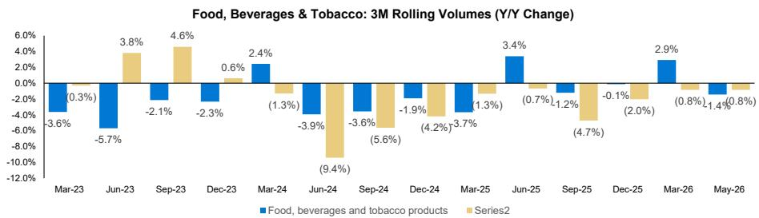  
Source: Haver, MS

Exhibit 15: Poland Retail Sales overview

<table><tr><td></td><td>1Q25</td><td>2Q25</td><td>3Q25</td><td>4Q25</td><td>1Q26</td><td></td><td></td></tr><tr><td>Volumes (y/y change) - 3M rolling</td><td>Mar-25</td><td>Jun-25</td><td>Sep-25</td><td>Dec-25</td><td>Mar-26</td><td>Apr-26</td><td>May-26</td></tr><tr><td>Motor vehicles, motorcycles, parts</td><td>15.2%</td><td>12.8%</td><td>11.7%</td><td>13.9%</td><td>2.0%</td><td>3.7%</td><td>3.5%</td></tr><tr><td>Food, beverages and tobacco products</td><td>-3.7%</td><td>3.4%</td><td>-1.2%</td><td>-0.1%</td><td>2.9%</td><td>-0.4%</td><td>-1.4%</td></tr><tr><td>Pharmaceuticals, cosmetics, orthopaedic eqpt</td><td>8.4%</td><td>6.4%</td><td>4.2%</td><td>5.4%</td><td>8.4%</td><td>8.2%</td><td>9.5%</td></tr><tr><td>Textiles, clothing, footwear</td><td>7.2%</td><td>8.3%</td><td>18.0%</td><td>9.1%</td><td>10.7%</td><td>1.6%</td><td>2.6%</td></tr><tr><td>Furniture, radio, TV and household appliances</td><td>10.9%</td><td>14.1%</td><td>15.1%</td><td>16.8%</td><td>8.5%</td><td>5.4%</td><td>4.5%</td></tr><tr><td>Newspapers, books, other specialized stores</td><td>-2.5%</td><td>3.1%</td><td>0.4%</td><td>-2.4%</td><td>0.0%</td><td>-4.7%</td><td>-1.8%</td></tr><tr><td>Total</td><td>1.4%</td><td>4.7%</td><td>4.8%</td><td>4.6%</td><td>6.0%</td><td>5.0%</td><td>4.3%</td></tr></table>

<table><tr><td colspan="5">QoQ</td></tr><tr><td>1Q25</td><td>2Q25</td><td>3Q25</td><td>4Q25</td><td>1Q26</td></tr><tr><td>-1,057bp</td><td>-243bp</td><td>-107bp</td><td>217bp</td><td>-1,190bp</td></tr><tr><td>-177bp</td><td>707bp</td><td>-460bp</td><td>107bp</td><td>307bp</td></tr><tr><td>223bp</td><td>-197bp</td><td>-223bp</td><td>117bp</td><td>300bp</td></tr><tr><td>2,043bp</td><td>110bp</td><td>973bp</td><td>-897bp</td><td>163bp</td></tr><tr><td>1,420bp</td><td>320bp</td><td>100bp</td><td>167bp</td><td>-823bp</td></tr><tr><td>-397bp</td><td>560bp</td><td>-273bp</td><td>-273bp</td><td>240bp</td></tr><tr><td>-73bp</td><td>337bp</td><td>3bp</td><td>-17bp</td><td>143bp</td></tr></table>

<table><tr><td>Sales (y/y change) - 3M rolling</td><td>Mar-25</td><td>Jun-25</td><td>Sep-25</td><td>Dec-25</td><td>Mar-26</td><td>Apr-26</td><td>May-26</td></tr><tr><td>Motor vehicles, motorcycles, parts</td><td>9.0%</td><td>6.3%</td><td>5.5%</td><td>7.0%</td><td>-4.2%</td><td>-2.3%</td><td>-2.5%</td></tr><tr><td>Food, beverages and tobacco products</td><td>2.1%</td><td>9.0%</td><td>3.7%</td><td>3.4%</td><td>6.0%</td><td>2.4%</td><td>0.8%</td></tr><tr><td>Pharmaceuticals, cosmetics, orthopaedic equipment</td><td>11.1%</td><td>8.7%</td><td>6.5%</td><td>7.2%</td><td>10.5%</td><td>10.4%</td><td>11.6%</td></tr><tr><td>Textiles, clothing, footwear</td><td>5.8%</td><td>6.6%</td><td>16.6%</td><td>7.1%</td><td>7.3%</td><td>-1.6%</td><td>-0.6%</td></tr><tr><td>Furniture, radio, TV and household appliances</td><td>10.2%</td><td>12.7%</td><td>13.1%</td><td>14.0%</td><td>7.1%</td><td>4.1%</td><td>3.3%</td></tr><tr><td>Newspapers, books, other sale in specialized stores</td><td>-2.0%</td><td>3.2%</td><td>0.0%</td><td>-2.4%</td><td>0.4%</td><td>-3.9%</td><td>-0.3%</td></tr><tr><td>Total</td><td>2.4%</td><td>4.8%</td><td>4.8%</td><td>4.4%</td><td>6.0%</td><td>5.6%</td><td>5.7%</td></tr></table>

<table><tr><td>1Q25</td><td>2Q25</td><td>3Q25</td><td>4Q25</td><td>1Q26</td></tr><tr><td>-1,060bp</td><td>-263bp</td><td>-80bp</td><td>143bp</td><td>-1,120bp</td></tr><tr><td>-57bp</td><td>697bp</td><td>-533bp</td><td>-27bp</td><td>257bp</td></tr><tr><td>197bp</td><td>-240bp</td><td>-227bp</td><td>73bp</td><td>330bp</td></tr><tr><td>2,050bp</td><td>77bp</td><td>997bp</td><td>-943bp</td><td>20bp</td></tr><tr><td>1,357bp</td><td>257bp</td><td>33bp</td><td>97bp</td><td>-697bp</td></tr><tr><td>-490bp</td><td>523bp</td><td>-320bp</td><td>-243bp</td><td>280bp</td></tr><tr><td>-37bp</td><td>233bp</td><td>3bp</td><td>-37bp</td><td>157bp</td></tr></table>

<table><tr><td>Implied pricing (y/y change) - 3M rolling</td><td>Mar-25</td><td>Jun-25</td><td>Sep-25</td><td>Dec-25</td><td>Mar-26</td><td>Apr-26</td><td>May-26</td></tr><tr><td>Motor vehicles, motorcycles, parts</td><td>-5.4%</td><td>-5.7%</td><td>-5.5%</td><td>-6.1%</td><td>-6.1%</td><td>-5.8%</td><td>-5.8%</td></tr><tr><td>Food, beverages and tobacco products</td><td>6.0%</td><td>5.4%</td><td>5.0%</td><td>3.6%</td><td>3.0%</td><td>2.8%</td><td>2.3%</td></tr><tr><td>Pharmaceuticals, cosmetics, orthopaedic eqpt</td><td>2.5%</td><td>2.2%</td><td>2.2%</td><td>1.7%</td><td>2.0%</td><td>2.0%</td><td>1.9%</td></tr><tr><td>Textiles, clothing, footwear</td><td>-1.3%</td><td>-1.6%</td><td>-1.2%</td><td>-1.8%</td><td>-3.0%</td><td>-3.1%</td><td>-3.2%</td></tr><tr><td>Furniture, radio, TV and household appliances</td><td>-0.7%</td><td>-1.2%</td><td>-1.8%</td><td>-2.3%</td><td>-1.4%</td><td>-1.2%</td><td>-1.1%</td></tr><tr><td>Newspapers, books, other specialized stores</td><td>0.5%</td><td>0.1%</td><td>-0.3%</td><td>0.0%</td><td>0.4%</td><td>0.9%</td><td>1.6%</td></tr><tr><td>Total</td><td>1.1%</td><td>0.0%</td><td>0.0%</td><td>-0.2%</td><td>0.0%</td><td>0.6%</td><td>1.3%</td></tr></table>

Source: Haver, MS

<table><tr><td>1Q25</td><td>2Q25</td><td>3Q25</td><td>4Q25</td><td>1Q26</td></tr><tr><td>-48bp</td><td>-29bp</td><td>18bp</td><td>-54bp</td><td>-2bp</td></tr><tr><td>133bp</td><td>-50bp</td><td>-49bp</td><td>-139bp</td><td>-59bp</td></tr><tr><td>-30bp</td><td>-36bp</td><td>1bp</td><td>-44bp</td><td>23bp</td></tr><tr><td>38bp</td><td>-29bp</td><td>33bp</td><td>-53bp</td><td>-127bp</td></tr><tr><td>-56bp</td><td>-54bp</td><td>-57bp</td><td>-57bp</td><td>99bp</td></tr><tr><td>-90bp</td><td>-38bp</td><td>-46bp</td><td>30bp</td><td>40bp</td></tr><tr><td>37bp</td><td>-102bp</td><td>0bp</td><td>-19bp</td><td>13bp</td></tr></table>

Exhibit 16: Staff Pay Summary - Biedronka 2025 and 2026

<table><tr><td>Position</td><td>2025 (from 1 Jan 2025)</td><td>2026 (from 1 Jan 2026)</td><td>Increase (PLN)</td><td>Increase (%)</td></tr><tr><td>Sales Assistant/Cashier (new starter)</td><td>PLN 5,150–5,500</td><td>PLN 5,300–5,650</td><td>+150</td><td>+2.9% /+ 2.7%</td></tr><tr><td>Sales Assistant/Cashier (3+ years)</td><td>PLN 5,300–5,750</td><td>PLN 5,450–5,900</td><td>+150</td><td>+2.8% /+ 2.6%</td></tr><tr><td>Sales Assistant/Cashier (including variable pay)</td><td>Not stated</td><td>PLN 5,800–6,150</td><td>—</td><td>—</td></tr><tr><td>Sales Assistant/Cashier (3+ years incl. variable pay)</td><td>Not stated</td><td>PLN 5,950–6,400</td><td>—</td><td>—</td></tr><tr><td>Deputy Store Manager</td><td>Not stated</td><td>PLN 5,950 base / PLN 7,050 incl. variable pay</td><td>—</td><td>—</td></tr><tr><td>Store Manager (new starter)</td><td>From PLN 7,200</td><td>From PLN 7,450</td><td>+250</td><td>+3.5%</td></tr><tr><td>Store Manager (incl. variable pay)</td><td>Not stated</td><td>Up to PLN 9,250</td><td>—</td><td>—</td></tr><tr><td>Warehouse Worker</td><td>PLN 5,250–5,550</td><td>PLN 5,500–5,800</td><td>+250</td><td>+4.8% / +4.5%</td></tr><tr><td>Administrative &amp; Warehouse Inspector</td><td>PLN 6,100–6,400</td><td>PLN 6,400–7,000</td><td>+300/+600</td><td>+4.9% / +9.4%</td></tr><tr><td>Employees receiving pay rise</td><td>~67,000</td><td>&gt;70,000</td><td></td><td>+4.5%</td></tr><tr><td>Company annual cost of pay rises</td><td>~PLN 450m</td><td>&gt;PLN 200m</td><td></td><td></td></tr><tr><td>Maximum monthly performance bonus</td><td>PLN 250</td><td>PLN 500 (doubled)</td><td>+250</td><td>+100%</td></tr></table>

Source: Company data, MS estimates

Exhibit 17: Real disposable income growth is expected to slow from \~6% pa over 2024/25 to 3%-2% over 2026/28e  
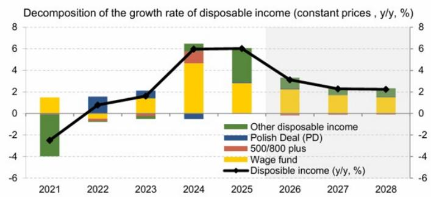  
Source: Narodowy Bank Polski

Exhibit 18: This is accompanied by a still elevated household savings rate  
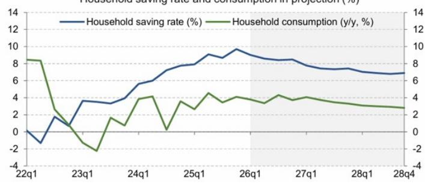  
Source: Narodowy Bank Polski

Exhibit 19: Wage growth in the enterprise sector is slowing  
Nominal wage growth (\%, y/y, national economy data as of 2025 Q4, data from enterprise sector as of January 2026)  
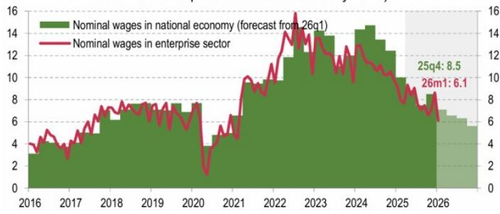  
Source: Narodowy Bank Polski

Exhibit 20: Consumer confidence indicators are negative, though stable at current level  
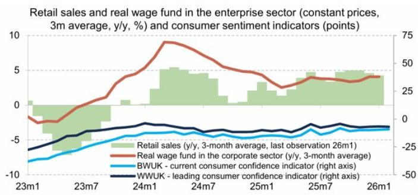  
Source: Narodowy Bank Polski

# Dino Polska - Underweight

Exhibit 21: Summary Financials 2024-28e  
Dino Polska: Summary Financials

<table><tr><td>Income Statement (PLN mn)</td><td>2024</td><td>2025</td><td>2026E</td><td>2027E</td><td>2028E</td></tr><tr><td>Sales</td><td>29,274</td><td>33,634</td><td>37,989</td><td>43,482</td><td>49,561</td></tr><tr><td>YoY change</td><td>14.1%</td><td>14.9%</td><td>12.9%</td><td>14.5%</td><td>14.0%</td></tr><tr><td>LFL</td><td>5.3%</td><td>4.4%</td><td>3.3%</td><td>4.8%</td><td>4.9%</td></tr><tr><td>Cost of sales</td><td>-22,463</td><td>-25,723</td><td>-29,123</td><td>-29,123</td><td>-29,123</td></tr><tr><td>Gross profit (reported)</td><td>6,811</td><td>7,911</td><td>8,866</td><td>8,866</td><td>8,866</td></tr><tr><td>YoY change</td><td>15.0%</td><td>16.2%</td><td>12.1%</td><td>0.0%</td><td>0.0%</td></tr><tr><td>Operating expenses (est)</td><td>-4,517</td><td>-5,394</td><td>-6,163</td><td>-6,163</td><td>-6,163</td></tr><tr><td>YoY change</td><td>21.9%</td><td>19.4%</td><td>14.3%</td><td>0.0%</td><td>0.0%</td></tr><tr><td>EBITDA (u/lying)</td><td>2,318</td><td>2,546</td><td>2,734</td><td>2,734</td><td>2,734</td></tr><tr><td>YoY change</td><td>3.8%</td><td>9.9%</td><td>7.4%</td><td>0.0%</td><td>0.0%</td></tr><tr><td>D&amp;A</td><td>-409</td><td>-505</td><td>-619</td><td>-619</td><td>-619</td></tr><tr><td>EBIT (u/lying)</td><td>1,908</td><td>2,041</td><td>2,115</td><td>2,115</td><td>2,115</td></tr><tr><td>YoY change</td><td>2%</td><td>7%</td><td>4%</td><td>0%</td><td>0%</td></tr><tr><td>Finance expense</td><td>-115</td><td>-115</td><td>-101</td><td>-101</td><td>-101</td></tr><tr><td>Profit before tax (u/lying)</td><td>1,794</td><td>1,927</td><td>2,014</td><td>2,225</td><td>2,485</td></tr><tr><td>Profit before tax (statutory)</td><td>1,794</td><td>1,927</td><td>2,014</td><td>2,225</td><td>2,485</td></tr><tr><td>Net profit (u/lying)</td><td>1,504</td><td>1,558</td><td>1,631</td><td>1,802</td><td>2,012</td></tr><tr><td>Net profit (statutory)</td><td>1,506</td><td>1,559</td><td>1,631</td><td>1,802</td><td>2,013</td></tr></table>

<table><tr><td colspan="6">Last close: (PLN)</td></tr><tr><td>Per share data</td><td>2024</td><td>2025</td><td>2026E</td><td>2027E</td><td>2028E</td></tr><tr><td>EPS dil. reported (PLN)</td><td>1.53</td><td>1.59</td><td>1.66</td><td>1.84</td><td>2.05</td></tr><tr><td>MW EPS (PLN)</td><td>1.53</td><td>1.59</td><td>1.66</td><td>1.84</td><td>2.05</td></tr><tr><td>DPS (PLN)</td><td>0.00</td><td>0.00</td><td>0.00</td><td>0.00</td><td>0.00</td></tr><tr><td>Payout ratio (% u/lying EPS)</td><td>0%</td><td>0%</td><td>0%</td><td>0%</td><td>0%</td></tr><tr><td>Retail FCF (PLN)</td><td>0.86</td><td>0.43</td><td>-0.03</td><td>0.03</td><td>0.14</td></tr><tr><td>BVPS (EUR)</td><td>7.2</td><td>8.8</td><td>10.5</td><td>12.3</td><td>14.4</td></tr><tr><td>Wtd. Shares outstanding (mn)</td><td>980</td><td>980</td><td>980</td><td>980</td><td>980</td></tr><tr><td>Total payout</td><td>0%</td><td>0%</td><td>0%</td><td>0%</td><td>0%</td></tr></table>

<table><tr><td>Valuation Metrics</td><td>2024</td><td>2025</td><td>2026E</td><td>2027E</td><td>2028E</td></tr><tr><td>P/E</td><td>18.5x</td><td>17.9x</td><td>17.1x</td><td>15.5x</td><td>13.8x</td></tr><tr><td>P/BV</td><td>3.9x</td><td>3.2x</td><td>2.7x</td><td>2.3x</td><td>2.0x</td></tr><tr><td>FCF Yield</td><td>3.0%</td><td>1.5%</td><td>-0.1%</td><td>0.1%</td><td>0.5%</td></tr><tr><td>Dividend yield</td><td>0.0%</td><td>0.0%</td><td>0.0%</td><td>0.0%</td><td>0.0%</td></tr></table>

<table><tr><td>Balance sheet (PLN mn)</td><td>2024</td><td>2025</td><td>2026E</td><td>2027E</td><td>2028E</td></tr><tr><td>Fixed assets</td><td>8,231</td><td>9,775</td><td>11,640</td><td>13,680</td><td>15,853</td></tr><tr><td>Intangible assets</td><td>170</td><td>176</td><td>218</td><td>257</td><td>292</td></tr><tr><td>Inventories</td><td>3,081</td><td>3,548</td><td>4,032</td><td>4,622</td><td>5,272</td></tr><tr><td>Receivables</td><td>376</td><td>372</td><td>420</td><td>481</td><td>548</td></tr><tr><td>Cash</td><td>891</td><td>955</td><td>930</td><td>957</td><td>1,094</td></tr><tr><td>Total assets</td><td>13,056</td><td>15,171</td><td>17,627</td><td>20,449</td><td>23,579</td></tr><tr><td>Borrowings</td><td>1,008</td><td>645</td><td>645</td><td>645</td><td>645</td></tr><tr><td>Payables</td><td>4,362</td><td>5,195</td><td>5,903</td><td>6,766</td><td>7,718</td></tr><tr><td>Total liabilities</td><td>5,953</td><td>6,500</td><td>7,324</td><td>8,344</td><td>9,462</td></tr><tr><td>Shareholders&#x27; equity</td><td>7,102</td><td>8,671</td><td>10,302</td><td>12,105</td><td>14,118</td></tr><tr><td>Net (Debt)/Cash</td><td>196</td><td>-199</td><td>-169</td><td>-185</td><td>-310</td></tr><tr><td>Net (Debt)/Cash ex leases</td><td>117</td><td>-310</td><td>-285</td><td>-312</td><td>-449</td></tr><tr><td>Working Capital</td><td>-1,341</td><td>-1,790</td><td>-2,037</td><td>-2,336</td><td>-2,665</td></tr></table>

<table><tr><td>Profitability Ratios</td><td>2024</td><td>2025</td><td>2026E</td><td>2027E</td><td>2028E</td></tr><tr><td>Return on Revenues (net inc)</td><td>5.1%</td><td>4.6%</td><td>4.3%</td><td>4.1%</td><td>4.1%</td></tr><tr><td>o/w Gross margin - MSe</td><td>34.0%</td><td>33.8%</td><td>33.4%</td><td>33.3%</td><td>33.3%</td></tr><tr><td>o/w EBITDA margin</td><td>7.9%</td><td>7.6%</td><td>7.2%</td><td>6.3%</td><td>5.5%</td></tr><tr><td>o/w EBIT margin</td><td>6.5%</td><td>6.1%</td><td>5.6%</td><td>4.9%</td><td>4.3%</td></tr><tr><td>ROIC (NOPAT u/lying)</td><td>24.1%</td><td>21.9%</td><td>19.2%</td><td>17.7%</td><td>16.9%</td></tr><tr><td>ROCE</td><td>26.9%</td><td>24.3%</td><td>21.3%</td><td>20.0%</td><td>19.2%</td></tr><tr><td>ROCE Gross (EBITDA u/lying)</td><td>27.4%</td><td>26.0%</td><td>23.3%</td><td>21.8%</td><td>20.8%</td></tr><tr><td>ROA (net profit u/lying)</td><td>12.8%</td><td>11.0%</td><td>9.9%</td><td>9.5%</td><td>9.1%</td></tr><tr><td>ROE (net profit, ulying)</td><td>23.7%</td><td>19.8%</td><td>17.2%</td><td>16.1%</td><td>15.3%</td></tr><tr><td>Retail FCF % Retail EBITDA</td><td>36.2%</td><td>16.7%</td><td>-0.9%</td><td>1.0%</td><td>5.0%</td></tr><tr><td>Retail free cash flow % Sales</td><td>2.9%</td><td>1.3%</td><td>-0.1%</td><td>0.1%</td><td>0.3%</td></tr></table>

<table><tr><td>Cash flow statement (PLN mn)</td><td>2024</td><td>2025</td><td>2026E</td><td>2027E</td><td>2028E</td></tr><tr><td>Cash from operations</td><td>2,442</td><td>2,580</td><td>2,556</td><td>2,899</td><td>3,271</td></tr><tr><td>Capex</td><td>-1,562</td><td>-2,087</td><td>-2,499</td><td>-2,786</td><td>-3,040</td></tr><tr><td>Retail free cash flow</td><td>839</td><td>424</td><td>-25</td><td>28</td><td>137</td></tr><tr><td>Lease payments</td><td>-44</td><td>-72</td><td>-84</td><td>-88</td><td>-97</td></tr><tr><td>Dividends</td><td>0</td><td>0</td><td>0</td><td>0</td><td>0</td></tr><tr><td>Change in cash (retail)</td><td>673</td><td>64</td><td>-25</td><td>28</td><td>137</td></tr></table>

<table><tr><td>Balance Sheet Gearing</td><td>2024</td><td>2025</td><td>2026E</td><td>2027E</td><td>2028E</td></tr><tr><td>Gearing (Net Debt : Equity)</td><td>0.0x</td><td>0.0x</td><td>0.0x</td><td>0.0x</td><td>0.0x</td></tr><tr><td>Net debt / EBITDA</td><td>0.1x</td><td>-0.1x</td><td>-0.1x</td><td>-0.1x</td><td>-0.1x</td></tr><tr><td>Fixed charge cover</td><td>2.1x</td><td>0.5x</td><td>-0.8x</td><td>-0.7x</td><td>-0.2x</td></tr><tr><td>Interest rate on gross debt</td><td>11.1%</td><td>14.4%</td><td>15.5%</td><td>16.2%</td><td>17.6%</td></tr><tr><td>Short term debt, % Debt</td><td>56.1%</td><td>51.5%</td><td>51.5%</td><td>51.5%</td><td>51.5%</td></tr></table>

Source: Company data, MS (e = estimates)

<table><tr><td>Store metrics</td><td>2024</td><td>2025</td><td>2026E</td><td>2027E</td><td>2028E</td></tr><tr><td>No. stores</td><td>2,688</td><td>3,033</td><td>3,430</td><td>3,430</td><td>3,430</td></tr><tr><td>Selling space (sq m 000s)</td><td>1,061</td><td>1,200</td><td>1,360</td><td>1,360</td><td>1,360</td></tr><tr><td>Avg. store size (sq m)</td><td>395</td><td>396</td><td>397</td><td>397</td><td>397</td></tr><tr><td>Retail sales per sq m</td><td>29,141</td><td>29,744</td><td>29,671</td><td>31,964</td><td>36,433</td></tr><tr><td>Capex % Sales (ex ROU)</td><td>5.3%</td><td>6.2%</td><td>6.6%</td><td>6.4%</td><td>6.1%</td></tr></table>

Exhibit 22: Summary of MSe vs Cssus

<table><tr><td rowspan="2">Dino Polska</td><td colspan="3">New</td><td colspan="3">Bloomberg</td><td colspan="3">MSe vs BBG</td></tr><tr><td>2026E</td><td>2027E</td><td>2028E</td><td>2026E</td><td>2027E</td><td>2028E</td><td>2026E</td><td>2027E</td><td>2028E</td></tr><tr><td>Growth</td><td></td><td></td><td></td><td></td><td></td><td></td><td></td><td></td><td></td></tr><tr><td>LFL growth</td><td>3.3%</td><td>4.8%</td><td>4.9%</td><td>5.0%</td><td>5.2%</td><td>4.7%</td><td>-166bp</td><td>-39bp</td><td>22bp</td></tr><tr><td>New space contribution</td><td>9.6%</td><td>9.6%</td><td>9.1%</td><td>10.4%</td><td>10.0%</td><td>8.8%</td><td>-72bp</td><td>-36bp</td><td>31bp</td></tr><tr><td>Sales Growth</td><td>12.9%</td><td>14.5%</td><td>14.0%</td><td>15.3%</td><td>15.2%</td><td>13.5%</td><td>-238bp</td><td>-76bp</td><td>53bp</td></tr><tr><td>P&amp;L (PLN mn)</td><td></td><td></td><td></td><td></td><td></td><td></td><td></td><td></td><td></td></tr><tr><td>Net sales</td><td>37,989</td><td>43,482</td><td>49,561</td><td>38,789</td><td>44,692</td><td>50,705</td><td>-2.1%</td><td>-2.7%</td><td>-2.3%</td></tr><tr><td>Cost of sales</td><td>-29,123</td><td>-33,341</td><td>-38,003</td><td>-29,639</td><td>-34,166</td><td>-38,791</td><td></td><td></td><td></td></tr><tr><td>Gross profit (reported)</td><td>8,866</td><td>10,141</td><td>11,558</td><td>9,150</td><td>10,526</td><td>11,914</td><td>-3.1%</td><td>-3.7%</td><td>-3.0%</td></tr><tr><td>SG&amp;A</td><td>-6,163</td><td>-7,105</td><td>-8,124</td><td></td><td></td><td></td><td>--</td><td>--</td><td>--</td></tr><tr><td>EBITDA</td><td>2,734</td><td>3,070</td><td>3,470</td><td>2,902</td><td>3,347</td><td>3,851</td><td>-5.8%</td><td>-8.3%</td><td>-9.9%</td></tr><tr><td>D&amp;A</td><td>-619</td><td>-739</td><td>-870</td><td>-595</td><td>-692</td><td>-777</td><td>4.0%</td><td>6.8%</td><td>12.0%</td></tr><tr><td>Operating income</td><td>2,115</td><td>2,330</td><td>2,600</td><td>2,307</td><td>2,655</td><td>3,074</td><td>-8.3%</td><td>-12.2%</td><td>-15.4%</td></tr><tr><td>Net Financial Result</td><td>-101</td><td>-105</td><td>-115</td><td></td><td></td><td></td><td></td><td></td><td></td></tr><tr><td>PBT</td><td>2,014</td><td>2,225</td><td>2,485</td><td>2,164</td><td>2,537</td><td>2,882</td><td>-6.9%</td><td>-12.3%</td><td>-13.8%</td></tr><tr><td>Taxes &amp; other</td><td>-383</td><td>-423</td><td>-472</td><td></td><td></td><td></td><td></td><td></td><td></td></tr><tr><td>Net Income</td><td>1,631</td><td>1,802</td><td>2,013</td><td>1,778</td><td>2,055</td><td>2,386</td><td>-8.2%</td><td>-12.3%</td><td>-15.6%</td></tr><tr><td>Gross margin</td><td>23.3%</td><td>23.3%</td><td>23.3%</td><td>23.6%</td><td>23.6%</td><td>23.5%</td><td>-25bp</td><td>-23bp</td><td>-17bp</td></tr><tr><td>EBITDA margin</td><td>7.2%</td><td>7.1%</td><td>7.0%</td><td>7.5%</td><td>7.5%</td><td>7.6%</td><td>-29bp</td><td>-43bp</td><td>-59bp</td></tr><tr><td>EBIT margin</td><td>5.6%</td><td>5.4%</td><td>5.2%</td><td>5.9%</td><td>5.9%</td><td>6.1%</td><td>-38bp</td><td>-58bp</td><td>-82bp</td></tr></table>

Source: Bloomberg Consensus, MS estimates

## Jeronimo Martins - Underweight

Exhibit 23: Summary Financials

## Jeronimo Martins: Summary Financials

<table><tr><td>Income Statement (€ mn)</td><td>2024</td><td>2025</td><td>2026e</td><td>2027e</td><td>2028e</td></tr><tr><td>Sales</td><td>33,464</td><td>35,991</td><td>38,141</td><td>39,948</td><td>42,039</td></tr><tr><td>YoY change</td><td>9.3%</td><td>7.6%</td><td>6.0%</td><td>4.7%</td><td>5.2%</td></tr><tr><td>Poland YoY</td><td>9.9%</td><td>7.5%</td><td>3.7%</td><td>4.6%</td><td>4.7%</td></tr><tr><td>LFL: Biedronka</td><td>-0.3%</td><td>1.9%</td><td>1.4%</td><td>2.6%</td><td>2.7%</td></tr><tr><td>LFL: Hebe</td><td>8.5%</td><td>1.0%</td><td>1.0%</td><td>2.0%</td><td>2.0%</td></tr><tr><td>Portugal YoY</td><td>4.0%</td><td>4.8%</td><td>5.6%</td><td>3.0%</td><td>2.9%</td></tr><tr><td>LFL: Pingo Doce</td><td>4.0%</td><td>4.0%</td><td>4.9%</td><td>2.2%</td><td>2.2%</td></tr><tr><td>LFL: Recheio</td><td>2.0%</td><td>3.0%</td><td>2.5%</td><td>2.5%</td><td>2.0%</td></tr><tr><td>Colombia YoY</td><td>17.0%</td><td>13.3%</td><td>24.3%</td><td>8.5%</td><td>12.6%</td></tr><tr><td>Cost of sales</td><td>-26,613</td><td>-28,557</td><td>-30,244</td><td>-31,617</td><td>-33,209</td></tr><tr><td>Gross profit (reported)</td><td>6,851</td><td>7,434</td><td>7,897</td><td>8,331</td><td>8,830</td></tr><tr><td>YoY change</td><td>9.6%</td><td>8.5%</td><td>6.2%</td><td>5.5%</td><td>6.0%</td></tr><tr><td>Operating expenses (est)</td><td>-5,662</td><td>-6,096</td><td>-6,506</td><td>-6,858</td><td>-7,261</td></tr><tr><td>YoY change</td><td>13.6%</td><td>7.7%</td><td>6.7%</td><td>5.4%</td><td>5.9%</td></tr><tr><td>EBITDA (u/lying)</td><td>2,232</td><td>2,480</td><td>2,632</td><td>2,793</td><td>2,971</td></tr><tr><td>YoY change</td><td>3.0%</td><td>11.1%</td><td>6.1%</td><td>6.1%</td><td>6.3%</td></tr><tr><td>D&amp;A</td><td>-1,043</td><td>-1,142</td><td>-1,241</td><td>-1,321</td><td>-1,401</td></tr><tr><td>EBIT (u/lying)</td><td>1,189</td><td>1,338</td><td>1,392</td><td>1,473</td><td>1,570</td></tr><tr><td>YoY change</td><td>-6%</td><td>13%</td><td>4%</td><td>6%</td><td>7%</td></tr><tr><td>Finance expense</td><td>-267</td><td>-322</td><td>-363</td><td>-369</td><td>-374</td></tr><tr><td>Profit before tax (u/lying)</td><td>921</td><td>1,014</td><td>1,027</td><td>1,102</td><td>1,194</td></tr><tr><td>Profit before tax (statutory)</td><td>802</td><td>883</td><td>904</td><td>978</td><td>1,067</td></tr><tr><td>Net profit (u/lying)</td><td>639</td><td>694</td><td>707</td><td>762</td><td>830</td></tr><tr><td>Net profit (statutory)</td><td>600</td><td>647</td><td>667</td><td>723</td><td>789</td></tr></table>

Analyst: Izabel Dobreva (izabel.dobreva@ms.com) Last close: (EUR) 16.76

<table><tr><td>Per share data</td><td>2024</td><td>2025</td><td>2026e</td><td>2027e</td><td>2028e</td></tr><tr><td>EPS dil. reported (EUR)</td><td>0.95</td><td>1.03</td><td>1.06</td><td>1.15</td><td>1.25</td></tr><tr><td>MW EPS (EUR)</td><td>1.01</td><td>1.10</td><td>1.12</td><td>1.21</td><td>1.32</td></tr><tr><td>DPS (EUR)</td><td>0.59</td><td>0.65</td><td>0.65</td><td>0.65</td><td>0.69</td></tr><tr><td>Payout ratio (% u/lying EPS)</td><td>58%</td><td>59%</td><td>52%</td><td>52%</td><td>52%</td></tr><tr><td>Retail FCF (EUR)</td><td>-0.11</td><td>0.86</td><td>1.16</td><td>0.97</td><td>1.13</td></tr><tr><td>BVPS (EUR)</td><td>4.8</td><td>5.2</td><td>5.7</td><td>6.3</td><td>7.0</td></tr><tr><td>Wtd. Shares outstanding (mn)</td><td>630</td><td>630</td><td>630</td><td>630</td><td>630</td></tr><tr><td>Total payout</td><td>58%</td><td>59%</td><td>58%</td><td>54%</td><td>52%</td></tr></table>

<table><tr><td>Valuation Metrics</td><td>2024</td><td>2025</td><td>2026e</td><td>2027e</td><td>2028e</td></tr><tr><td>P/E</td><td>16.5x</td><td>15.2x</td><td>14.9x</td><td>13.9x</td><td>12.7x</td></tr><tr><td>P/BV</td><td>3.5x</td><td>3.2x</td><td>2.9x</td><td>2.7x</td><td>2.4x</td></tr><tr><td>FCF Yield</td><td>-0.6%</td><td>5.1%</td><td>6.9%</td><td>5.8%</td><td>6.8%</td></tr><tr><td>Dividend yield</td><td>3.5%</td><td>3.9%</td><td>3.9%</td><td>3.9%</td><td>4.1%</td></tr></table>

<table><tr><td>Profitability Ratios</td><td>2024</td><td>2025</td><td>2026e</td><td>2027e</td><td>2028e</td></tr><tr><td>Return on Revenues (net inc)</td><td>1.9%</td><td>1.9%</td><td>1.9%</td><td>1.9%</td><td>2.0%</td></tr><tr><td>o/w Gross margin</td><td>20.5%</td><td>20.7%</td><td>20.7%</td><td>20.9%</td><td>21.0%</td></tr><tr><td>o/w EBITDA margin</td><td>6.7%</td><td>6.9%</td><td>6.9%</td><td>7.0%</td><td>7.1%</td></tr><tr><td>o/w EBIT margin</td><td>3.6%</td><td>3.7%</td><td>3.6%</td><td>3.7%</td><td>3.7%</td></tr></table>

<table><tr><td>Balance sheet (€ mn)</td><td>2024</td><td>2025</td><td>2026e</td><td>2027e</td><td>2028e</td></tr><tr><td>Fixed assets</td><td>5,590</td><td>6,146</td><td>6,567</td><td>6,983</td><td>7,402</td></tr><tr><td>Intangible assets</td><td>795</td><td>813</td><td>812</td><td>807</td><td>798</td></tr><tr><td>Right of use assets</td><td>3,676</td><td>4,001</td><td>4,007</td><td>3,966</td><td>3,908</td></tr><tr><td>Inventories</td><td>1,997</td><td>2,248</td><td>2,381</td><td>2,489</td><td>2,614</td></tr><tr><td>Receivables</td><td>948</td><td>962</td><td>1,019</td><td>1,068</td><td>1,124</td></tr><tr><td>Cash</td><td>1,823</td><td>2,268</td><td>2,592</td><td>2,792</td><td>3,098</td></tr><tr><td>Total assets</td><td>15,296</td><td>17,058</td><td>17,996</td><td>18,722</td><td>19,560</td></tr><tr><td>Borrowings</td><td>1,003</td><td>1,250</td><td>1,250</td><td>1,250</td><td>1,250</td></tr><tr><td>Lease liabilities</td><td>3,918</td><td>4,322</td><td>4,260</td><td>4,196</td><td>4,130</td></tr><tr><td>Payables</td><td>6,800</td><td>7,590</td><td>8,188</td><td>8,559</td><td>8,990</td></tr><tr><td>Total liabilities</td><td>12,045</td><td>13,528</td><td>14,148</td><td>14,496</td><td>14,889</td></tr><tr><td>Shareholders&#x27; equity</td><td>3,006</td><td>3,290</td><td>3,598</td><td>3,965</td><td>4,400</td></tr><tr><td>Net (Debt)/Cash</td><td>-3,192</td><td>-3,456</td><td>-3,070</td><td>-2,806</td><td>-2,435</td></tr><tr><td>Net (Debt)/Cash ex leases</td><td>726</td><td>866</td><td>1,190</td><td>1,390</td><td>1,696</td></tr><tr><td>Working Capital</td><td>-3,855</td><td>-4,380</td><td>-4,787</td><td>-5,002</td><td>-5,252</td></tr></table>

<table><tr><td>ROIC (NOPAT u/lying)</td><td>56.2%</td><td>53.4%</td><td>55.1%</td><td>55.3%</td><td>54.2%</td></tr><tr><td>ROCE (company definition)</td><td>22.6%</td><td>22.5%</td><td>21.8%</td><td>21.3%</td><td>21.1%</td></tr><tr><td>ROCE Gross (EBITDA u/lying)</td><td>20.5%</td><td>20.2%</td><td>20.0%</td><td>20.0%</td><td>19.9%</td></tr><tr><td>ROA (net profit u/lying)</td><td>4.3%</td><td>4.3%</td><td>4.0%</td><td>4.2%</td><td>4.3%</td></tr><tr><td>ROE (net profit, ulying)</td><td>22.0%</td><td>22.1%</td><td>20.5%</td><td>20.2%</td><td>19.8%</td></tr><tr><td>Retail oCF % Retail EBITDA</td><td>87%</td><td>107%</td><td>113%</td><td>105%</td><td>106%</td></tr><tr><td>Retail free cash flow % Sales</td><td>-0.2%</td><td>1.5%</td><td>1.9%</td><td>1.5%</td><td>1.7%</td></tr></table>

<table><tr><td>Balance Sheet Gearing</td><td>2024</td><td>2025</td><td>2026e</td><td>2027e</td><td>2028e</td></tr><tr><td>Gearing (Net Debt : Equity)</td><td>1.1x</td><td>1.1x</td><td>0.9x</td><td>0.7x</td><td>0.6x</td></tr><tr><td>Net debt / EBITDA</td><td>1.4x</td><td>1.4x</td><td>1.2x</td><td>1.0x</td><td>0.8x</td></tr><tr><td>Fixed charge cover</td><td>1.2x</td><td>1.3x</td><td>1.4x</td><td>1.5x</td><td>1.6x</td></tr><tr><td>Interest rate on net debt</td><td>10.1%</td><td>10.1%</td><td>11.7%</td><td>13.2%</td><td>15.2%</td></tr><tr><td>Short term debt, % Debt</td><td>22.4%</td><td>25.1%</td><td>25.3%</td><td>25.4%</td><td>25.5%</td></tr></table>

<table><tr><td>Store metrics</td><td>2024</td><td>2025</td><td>2026e</td><td>2027e</td><td>2028e</td></tr><tr><td>No. stores</td><td>6,081</td><td>6,469</td><td>6,843</td><td>7,197</td><td>7,531</td></tr><tr><td>Selling space (sq m 000s)</td><td>3,995</td><td>4,220</td><td>4,421</td><td>4,603</td><td>4,771</td></tr><tr><td>Avg. store size (sq m)</td><td>657</td><td>652</td><td>646</td><td>640</td><td>634</td></tr><tr><td>Retail sales per sq m</td><td>8,619</td><td>8,762</td><td>8,827</td><td>8,853</td><td>8,969</td></tr><tr><td>Capex % Sales (ex ROU)</td><td>2.8%</td><td>3.2%</td><td>3.2%</td><td>3.2%</td><td>3.2%</td></tr></table>

<table><tr><td>Cash flow statement (€ mn)</td><td>2024</td><td>2025</td><td>2026e</td><td>2027e</td><td>2028e</td></tr><tr><td>Cash from operations</td><td>1,372</td><td>2,096</td><td>2,381</td><td>2,327</td><td>2,510</td></tr><tr><td>Capex</td><td>-1,054</td><td>-1,164</td><td>-1,228</td><td>-1,286</td><td>-1,354</td></tr><tr><td>Retail free cash flow</td><td>-67</td><td>540</td><td>733</td><td>609</td><td>715</td></tr><tr><td>FCFF</td><td>611</td><td>1,230</td><td>1,415</td><td>1,307</td><td>1,426</td></tr><tr><td>Dividends &amp; CFF/CFI</td><td>-753</td><td>-875</td><td>-828</td><td>-840</td><td>-850</td></tr><tr><td>Change in cash (retail)</td><td>-435</td><td>57</td><td>324</td><td>200</td><td>305</td></tr></table>

Source: Company data, MS estimates (e)

<table><tr><td>Revenue mix</td><td>2024</td><td>2025</td><td>2026e</td><td>2027e</td><td>2028e</td></tr><tr><td>% Poland</td><td>72%</td><td>72%</td><td>71%</td><td>71%</td><td>70%</td></tr><tr><td>o/w Biedronka</td><td>70%</td><td>70%</td><td>69%</td><td>69%</td><td>68%</td></tr><tr><td>% Portugal</td><td>19%</td><td>19%</td><td>19%</td><td>18%</td><td>18%</td></tr><tr><td>% Colombia</td><td>9%</td><td>9%</td><td>11%</td><td>11%</td><td>12%</td></tr></table>

Exhibit 24: MSe vs Cssus. Note: MS underlying EPS treats the Foundation payment and Employee bonus awards as underlying; therefore the figure is likely not comparable vs Consensus definition of underlying diluted EPS

<table><tr><td rowspan="2">Jeronimo Martins (EUR mn)</td><td colspan="3">New</td><td colspan="3">VA Cssus</td><td colspan="3">MS est vs Cssus</td></tr><tr><td>2026e</td><td>2027e</td><td>2028e</td><td>FY-2026</td><td>FY-2027</td><td>FY-2028</td><td>FY-2026</td><td>FY-2027</td><td>FY-2028</td></tr><tr><td>P&amp;L</td><td></td><td></td><td></td><td></td><td></td><td></td><td></td><td></td><td></td></tr><tr><td>Poland</td><td>26,940</td><td>28,178</td><td>29,493</td><td>27,451</td><td>29,287</td><td>31,318</td><td>-1.9%</td><td>-3.8%</td><td>-5.8%</td></tr><tr><td>Biedronka</td><td>26,292</td><td>27,490</td><td>28,764</td><td>26,792</td><td>28,585</td><td>30,574</td><td>-1.9%</td><td>-3.8%</td><td>-5.9%</td></tr><tr><td>Hebe</td><td>648</td><td>687</td><td>730</td><td>659</td><td>702</td><td>744</td><td>-1.6%</td><td>-2.1%</td><td>-2.0%</td></tr><tr><td>Portugal</td><td>7,120</td><td>7,334</td><td>7,548</td><td>7,039</td><td>7,268</td><td>7,468</td><td>1.2%</td><td>0.9%</td><td>1.1%</td></tr><tr><td>Pingo Doce</td><td>5,679</td><td>5,854</td><td>6,039</td><td>5,593</td><td>5,789</td><td>5,959</td><td>1.5%</td><td>1.1%</td><td>1.3%</td></tr><tr><td>Recheio</td><td>1,442</td><td>1,480</td><td>1,509</td><td>1,446</td><td>1,479</td><td>1,509</td><td>-0.3%</td><td>0.0%</td><td>0.0%</td></tr><tr><td>Colombia</td><td>4,012</td><td>4,352</td><td>4,899</td><td>3,837</td><td>4,403</td><td>5,004</td><td>4.6%</td><td>-1.1%</td><td>-2.1%</td></tr><tr><td>Total Revenue</td><td>38,141</td><td>39,948</td><td>42,039</td><td>38,245</td><td>40,774</td><td>43,497</td><td>-0.3%</td><td>-2.0%</td><td>-3.4%</td></tr><tr><td>EBITDA (u/lying)</td><td>2,632</td><td>2,793</td><td>2,971</td><td>2,644</td><td>2,861</td><td>3,072</td><td>-0.5%</td><td>-2.4%</td><td>-3.3%</td></tr><tr><td>EBITDA margin</td><td>6.9%</td><td>7.0%</td><td>7.1%</td><td>6.9%</td><td>7.0%</td><td>7.1%</td><td>-1bp</td><td>-2bp</td><td>0bp</td></tr><tr><td>Biedronka EBITDA (u/lying)</td><td>2,084</td><td>2,203</td><td>2,325</td><td>2,121</td><td>2,298</td><td>2,484</td><td>-1.7%</td><td>-4.1%</td><td>-6.4%</td></tr><tr><td>Biedronka EBITDA margin</td><td>7.9%</td><td>8.0%</td><td>8.1%</td><td>7.9%</td><td>8.0%</td><td>8.1%</td><td>1bp</td><td>-3bp</td><td>-4bp</td></tr><tr><td>D&amp;A</td><td>-1,241</td><td>-1,321</td><td>-1,401</td><td>-1,231</td><td>-1,325</td><td>-1,420</td><td>0.8%</td><td>-0.3%</td><td>-1.3%</td></tr><tr><td>Op. profit (u/lying)</td><td>1,392</td><td>1,473</td><td>1,570</td><td>1,414</td><td>1,536</td><td>1,652</td><td>-1.6%</td><td>-4.1%</td><td>-5.0%</td></tr><tr><td>Finance costs (u/lying)</td><td>-363</td><td>-369</td><td>-374</td><td>-364</td><td>-367</td><td>n/m</td><td>-0.3%</td><td>0.7%</td><td>n/m</td></tr><tr><td>PBT (u/lying)</td><td>1,027</td><td>1,102</td><td>1,194</td><td>1,051</td><td>1,169</td><td>n/m</td><td>-2.3%</td><td>-5.7%</td><td>n/m</td></tr><tr><td>JMT foundation / employee bonus</td><td>-69</td><td>-71</td><td>-72</td><td></td><td></td><td></td><td></td><td></td><td></td></tr><tr><td>Minorities &amp; Other</td><td>-11</td><td>-11</td><td>-11</td><td>-10</td><td>-12</td><td>-13</td><td></td><td></td><td></td></tr><tr><td>Adjusted net income for EPS</td><td>707</td><td>762</td><td>830</td><td>n/m</td><td>n/m</td><td>n/m</td><td>n/m</td><td>n/m</td><td>n/m</td></tr><tr><td>Adj net income ex Bonus/Foundation</td><td>761</td><td>817</td><td>886</td><td>788</td><td>870</td><td>n/m</td><td>-3.4%</td><td>-6.0%</td><td>n/m</td></tr><tr><td>PBT</td><td>904</td><td>978</td><td>1,067</td><td>964</td><td>1,088</td><td>1,062</td><td>-6.2%</td><td>-10.1%</td><td>0.4%</td></tr><tr><td>Net profit</td><td>667</td><td>723</td><td>789</td><td>716</td><td>809</td><td>792</td><td>-6.9%</td><td>-10.7%</td><td>-0.3%</td></tr><tr><td>Share Metrics (per share)</td><td></td><td></td><td></td><td></td><td></td><td></td><td></td><td></td><td></td></tr><tr><td>Statutory basic EPS</td><td>1.06</td><td>1.15</td><td>1.25</td><td>1.12</td><td>1.26</td><td>n/m</td><td>-5.1%</td><td>-8.7%</td><td>n/m</td></tr><tr><td>Underlying diluted EPS</td><td>1.12</td><td>1.21</td><td>1.32</td><td>1.36</td><td>1.54</td><td>1.70</td><td>-17.5%</td><td>-21.3%</td><td>-22.4%</td></tr></table>

Source: MS estimates, Visible Alpha Consensus

## Zabka - Equal-weight

Exhibit 25: Summary of our forecasts 2024-28e  
Zabka Group

<table><tr><td>Income Statement (PLN mn)</td><td>2024</td><td>2025</td><td>2026e</td><td>2027e</td><td>2028e</td></tr><tr><td>Sales to end Customers</td><td>27,277</td><td>31,135</td><td>35,203</td><td>39,398</td><td>43,977</td></tr><tr><td>YoY change</td><td>19.8%</td><td>14.1%</td><td>13.1%</td><td>11.9%</td><td>11.6%</td></tr><tr><td>o/w LfL</td><td>8.3%</td><td>5.3%</td><td>4.7%</td><td>5.1%</td><td>4.4%</td></tr><tr><td>o/w Space</td><td>9.0%</td><td>7.8%</td><td>7.7%</td><td>6.2%</td><td>6.4%</td></tr><tr><td>o/w DCO y/y</td><td>32%</td><td>25%</td><td>20%</td><td>15%</td><td>15%</td></tr><tr><td>Franchise margin %</td><td>16.7%</td><td>17.0%</td><td>17.0%</td><td>16.9%</td><td>17.1%</td></tr><tr><td>Franchise margin</td><td>-4,373</td><td>-5,040</td><td>-5,645</td><td>-6,274</td><td>-7,038</td></tr><tr><td>YoY change</td><td>18.9%</td><td>15.3%</td><td>12.0%</td><td>11.1%</td><td>12.2%</td></tr><tr><td>Revenue</td><td>23,797</td><td>27,153</td><td>30,748</td><td>34,447</td><td>38,406</td></tr><tr><td>YoY change</td><td>20.2%</td><td>14.1%</td><td>13.2%</td><td>12.0%</td><td>11.5%</td></tr><tr><td>Cost of sales</td><td>-19,406</td><td>-22,053</td><td>-24,966</td><td>-27,921</td><td>-31,145</td></tr><tr><td>Gross profit (reported)</td><td>4,391</td><td>5,100</td><td>5,781</td><td>6,525</td><td>7,261</td></tr><tr><td>YoY change</td><td>24.3%</td><td>16.1%</td><td>13.4%</td><td>12.9%</td><td>11.3%</td></tr><tr><td>Operating expenses</td><td>-1,028</td><td>-1,224</td><td>-1,393</td><td>-1,526</td><td>-1,595</td></tr><tr><td>YoY change</td><td>29.6%</td><td>19.1%</td><td>13.8%</td><td>9.6%</td><td>4.5%</td></tr><tr><td>EBITDA (reported)</td><td>3,363</td><td>3,876</td><td>4,389</td><td>4,999</td><td>5,666</td></tr><tr><td>YoY change</td><td>22.7%</td><td>15.3%</td><td>13.2%</td><td>13.9%</td><td>13.3%</td></tr><tr><td>D&amp;A</td><td>-1,704</td><td>-1,890</td><td>-2,125</td><td>-2,394</td><td>-2,669</td></tr><tr><td>EBIT</td><td>1,659</td><td>1,986</td><td>2,264</td><td>2,605</td><td>2,997</td></tr><tr><td>YoY change</td><td>20%</td><td>20%</td><td>14%</td><td>15%</td><td>15%</td></tr><tr><td>Finance expense</td><td>-856</td><td>-880</td><td>-841</td><td>-858</td><td>-880</td></tr><tr><td>PBT</td><td>804</td><td>1,106</td><td>1,423</td><td>1,747</td><td>2,117</td></tr><tr><td>Net profit (MSe)</td><td>716</td><td>1,032</td><td>1,219</td><td>1,489</td><td>1,738</td></tr><tr><td>Net profit (statutory)</td><td>624</td><td>1,102</td><td>1,155</td><td>1,425</td><td>1,738</td></tr><tr><td>Net profit (adj. Company definition)</td><td>714</td><td>1,003</td><td>1,184</td><td>1,493</td><td>1,742</td></tr></table>

<table><tr><td>Per share data</td><td>2024</td><td>2025</td><td>2026e</td><td>2027e</td><td>2028e</td></tr><tr><td>EPS dil. reported (PLN)</td><td>0.62</td><td>1.10</td><td>1.14</td><td>1.40</td><td>1.69</td></tr><tr><td>MSe EPS (PLN)</td><td>0.72</td><td>1.03</td><td>1.20</td><td>1.46</td><td>1.69</td></tr><tr><td>DPS (PLN)</td><td>0.00</td><td>0.52</td><td>0.73</td><td>0.88</td><td>1.02</td></tr><tr><td>Payout ratio (% u/lying EPS)</td><td>0%</td><td>50%</td><td>60%</td><td>60%</td><td>60%</td></tr><tr><td>Retail FCF (PLN) - Mse</td><td>0.72</td><td>0.80</td><td>0.86</td><td>1.08</td><td>1.22</td></tr><tr><td>Wtd. Shares outstanding (mn) - fully di</td><td>1,000</td><td>1,002</td><td>1,017</td><td>1,021</td><td>1,030</td></tr></table>

<table><tr><td>Valuation Metrics</td><td>2024</td><td>2025</td><td>2026e</td><td>2027e</td><td>2028e</td></tr><tr><td>P/E</td><td>38.0x</td><td>26.4x</td><td>22.7x</td><td>18.6x</td><td>16.1x</td></tr><tr><td>P/BV</td><td>19.6x</td><td>11.1x</td><td>8.6x</td><td>7.0x</td><td>5.8x</td></tr><tr><td>FCF Yield</td><td>2.7%</td><td>3.0%</td><td>3.3%</td><td>4.2%</td><td>4.7%</td></tr><tr><td>Dividend yield</td><td>0.0%</td><td>1.9%</td><td>2.7%</td><td>3.3%</td><td>3.8%</td></tr></table>

<table><tr><td>Profitability Ratios</td><td>2024</td><td>2025</td><td>2026e</td><td>2027e</td><td>2028e</td></tr><tr><td>Adj. Net Inc (Co. definition) margin</td><td>2.6%</td><td>3.2%</td><td>3.4%</td><td>3.8%</td><td>4.0%</td></tr><tr><td>Return on Revenues (MSe net inc)</td><td>2.6%</td><td>3.3%</td><td>3.5%</td><td>3.8%</td><td>4.0%</td></tr><tr><td>o/w Gross margin - MSe</td><td>28.9%</td><td>29.2%</td><td>29.1%</td><td>29.1%</td><td>29.2%</td></tr><tr><td>o/w EBITDA margin</td><td>12.3%</td><td>12.4%</td><td>12.5%</td><td>12.7%</td><td>12.9%</td></tr><tr><td>o/w EBIT margin</td><td>6.1%</td><td>6.4%</td><td>6.4%</td><td>6.6%</td><td>6.8%</td></tr><tr><td>ROIC (NOPAT u/lying)</td><td>48%</td><td>68%</td><td>55%</td><td>56%</td><td>57%</td></tr><tr><td>ROCE Gross (EBITDA)</td><td>25.1%</td><td>25.9%</td><td>26.5%</td><td>27.1%</td><td>27.7%</td></tr><tr><td>ROA (net profit u/lying)</td><td>4.3%</td><td>5.6%</td><td>6.0%</td><td>6.7%</td><td>7.2%</td></tr><tr><td>ROE (net profit, ulying)</td><td>63%</td><td>53%</td><td>43%</td><td>41%</td><td>39%</td></tr><tr><td>Retail OCF % Retail EBITDA</td><td>85%</td><td>84%</td><td>82%</td><td>82%</td><td>81%</td></tr><tr><td>Retail free cash flow % Sales</td><td>2.7%</td><td>2.6%</td><td>2.5%</td><td>2.8%</td><td>2.8%</td></tr></table>

<table><tr><td>Balance sheet (PLN mn)</td><td>2024</td><td>2025</td><td>2026e</td><td>2027e</td><td>2028e</td></tr><tr><td>Fixed assets</td><td>3,940</td><td>4,438</td><td>4,919</td><td>5,385</td><td>5,892</td></tr><tr><td>Intangible assets</td><td>4,587</td><td>4,711</td><td>4,862</td><td>5,030</td><td>5,218</td></tr><tr><td>Right of use assets</td><td>4,527</td><td>4,899</td><td>5,202</td><td>5,404</td><td>5,599</td></tr><tr><td>Inventories</td><td>1,092</td><td>1,150</td><td>1,302</td><td>1,456</td><td>1,624</td></tr><tr><td>Receivables</td><td>2,277</td><td>2,794</td><td>3,159</td><td>3,535</td><td>3,946</td></tr><tr><td>Cash</td><td>750</td><td>1,079</td><td>1,439</td><td>1,814</td><td>2,173</td></tr><tr><td>Total assets</td><td>17,569</td><td>19,514</td><td>21,321</td><td>23,064</td><td>24,894</td></tr><tr><td>Borrowings</td><td>4,549</td><td>4,148</td><td>4,148</td><td>4,148</td><td>4,148</td></tr><tr><td>Lease liabilities</td><td>4,855</td><td>5,301</td><td>5,651</td><td>5,905</td><td>6,140</td></tr><tr><td>Payables</td><td>5,871</td><td>6,631</td><td>7,356</td><td>8,054</td><td>8,789</td></tr><tr><td>Total liabilities</td><td>16,180</td><td>17,020</td><td>18,148</td><td>19,156</td><td>20,186</td></tr><tr><td>Shareholders&#x27; equity</td><td>1,389</td><td>2,494</td><td>3,218</td><td>3,997</td><td>4,842</td></tr><tr><td>Net (Debt)/Cash - MS definition</td><td>-8,654</td><td>-8,370</td><td>-8,359</td><td>-8,239</td><td>-8,114</td></tr><tr><td>Net (Debt)/Cash ex leases - Mse</td><td>-3,799</td><td>-3,069</td><td>-2,708</td><td>-2,334</td><td>-1,974</td></tr><tr><td>Working Capital</td><td>-2,501</td><td>-2,687</td><td>-2,895</td><td>-3,063</td><td>-3,219</td></tr><tr><td>Trade working capital - Co. definition</td><td>-2,278</td><td>-2,464</td><td>-2,672</td><td>-2,840</td><td>-2,996</td></tr></table>

<table><tr><td>Balance Sheet Gearing</td><td>2024</td><td>2025</td><td>2026e</td><td>2027e</td><td>2028e</td></tr><tr><td>Net debt / Adjusted EBITDA - Co.</td><td>2.5x</td><td>2.1x</td><td>1.9x</td><td>1.6x</td><td>1.4x</td></tr><tr><td>Net debt / reported EBITDA - MSe</td><td>2.7x</td><td>2.3x</td><td>2.0x</td><td>1.7x</td><td>1.5x</td></tr><tr><td>Financial net debt / EBITDA</td><td>1.1x</td><td>0.8x</td><td>0.6x</td><td>0.5x</td><td>0.3x</td></tr><tr><td>Fixed charge cover</td><td>1.0x</td><td>1.2x</td><td>1.3x</td><td>1.4x</td><td>1.5x</td></tr><tr><td>Interest rate on net debt</td><td>9.6%</td><td>7.9%</td><td>6.9%</td><td>6.7%</td><td>6.7%</td></tr><tr><td>Short term debt, % Debt</td><td>11.6%</td><td>12.4%</td><td>12.6%</td><td>12.7%</td><td>12.7%</td></tr><tr><td>Net finance costs as % sales</td><td>3.1%</td><td>2.8%</td><td>2.4%</td><td>2.2%</td><td>2.0%</td></tr><tr><td>Tax rate</td><td>26%</td><td>4%</td><td>22%</td><td>21%</td><td>20%</td></tr><tr><td>Reverse factoring % Payables</td><td>47%</td><td>50%</td><td>48%</td><td>46%</td><td>44%</td></tr><tr><td>Non-tax deductible debt as % debt</td><td>37%</td><td>0%</td><td>0%</td><td>0%</td><td>0%</td></tr></table>

<table><tr><td>Cash flow statement (PLN mn)</td><td>2024</td><td>2025</td><td>2026e</td><td>2027e</td><td>2028e</td></tr><tr><td>Cash from operations</td><td>2,858</td><td>3,246</td><td>3,581</td><td>4,082</td><td>4,577</td></tr><tr><td>Capex</td><td>-1,675</td><td>-1,624</td><td>-1,733</td><td>-1,858</td><td>-2,040</td></tr><tr><td>Retail free cash flow - Mse</td><td>725</td><td>805</td><td>871</td><td>1,106</td><td>1,253</td></tr><tr><td>Free cash flow - Co. definition</td><td>1,531</td><td>1,740</td><td>1,640</td><td>1,923</td><td>2,130</td></tr><tr><td>Change in cash (retail)</td><td>100</td><td>329</td><td>360</td><td>374</td><td>360</td></tr></table>

Source: Company data, MS estimates

<table><tr><td>Store metrics</td><td>2024</td><td>2025</td><td>2026e</td><td>2027e</td><td>2028e</td></tr><tr><td>No. stores</td><td>11,069</td><td>12,339</td><td>13,582</td><td>14,840</td><td>16,227</td></tr><tr><td>New stores pa</td><td>1,166</td><td>1,394</td><td>1,340</td><td>1,350</td><td>1,459</td></tr><tr><td>Selling space (sq m 000s)</td><td>701</td><td>781</td><td>860</td><td>939</td><td>1,027</td></tr><tr><td>Avg. store size (sq m)</td><td>63.3</td><td>63.3</td><td>63.3</td><td>63.3</td><td>63.3</td></tr><tr><td>Sales per sq m</td><td>41,170</td><td>42,024</td><td>42,909</td><td>43,796</td><td>44,724</td></tr><tr><td>Capex % Sales (ex ROU)</td><td>6.1%</td><td>5.2%</td><td>4.9%</td><td>4.7%</td><td>4.6%</td></tr></table>

<table><tr><td>Revenue mix</td><td>2024</td><td>2025</td><td>2026e</td><td>2027e</td><td>2028e</td></tr><tr><td>% Franchise Poland</td><td>95.9%</td><td>95.1%</td><td>94.5%</td><td>94.0%</td><td>93.4%</td></tr><tr><td>% Digital customer offering</td><td>2.3%</td><td>2.5%</td><td>2.6%</td><td>2.7%</td><td>2.8%</td></tr><tr><td>% Romania</td><td>1.8%</td><td>2.4%</td><td>2.8%</td><td>3.3%</td><td>3.8%</td></tr></table>

Exhibit 26: MSe vs Cssus 2026-28e

<table><tr><td>Sales to end customers</td></tr><tr><td>Franchisee margin</td></tr><tr><td>Revenue</td></tr><tr><td>EBITDA reported</td></tr><tr><td>EBITDA underlying</td></tr><tr><td>Adj EBITDA margin</td></tr><tr><td>D&amp;A</td></tr><tr><td>EBIT reported</td></tr><tr><td>EBIT underlying</td></tr><tr><td>Finance costs</td></tr><tr><td>PBT reported</td></tr><tr><td>PBT underlying</td></tr><tr><td>Attributable Net profit reported</td></tr><tr><td>MS definition - adj net profit</td></tr><tr><td>EPS - Adjusted</td></tr><tr><td>EPS - Reported</td></tr></table>

<table><tr><td colspan="3">New</td></tr><tr><td>2026e</td><td>2027e</td><td>2028e</td></tr><tr><td>4.7%</td><td>5.1%</td><td>4.4%</td></tr><tr><td>35,203</td><td>39,398</td><td>43,977</td></tr><tr><td>16.0%</td><td>15.9%</td><td>16.0%</td></tr><tr><td>30,748</td><td>34,447</td><td>38,406</td></tr><tr><td>4,389</td><td>4,999</td><td>5,666</td></tr><tr><td>4,480</td><td>5,090</td><td>5,671</td></tr><tr><td>12.7%</td><td>12.9%</td><td>12.9%</td></tr><tr><td>-2,125</td><td>-2,394</td><td>-2,669</td></tr><tr><td>2,264</td><td>2,605</td><td>2,997</td></tr><tr><td>2,355</td><td>2,696</td><td>3,002</td></tr><tr><td>-841</td><td>-858</td><td>-880</td></tr><tr><td>1,423</td><td>1,747</td><td>2,117</td></tr><tr><td>1,514</td><td>1,838</td><td>2,122</td></tr><tr><td>1,155</td><td>1,425</td><td>1,738</td></tr><tr><td>1,219</td><td>1,489</td><td>1,738</td></tr><tr><td>1.20</td><td>1.46</td><td>1.69</td></tr><tr><td>1.14</td><td>1.40</td><td>1.69</td></tr></table>

Source: Bloomberg Consensus, MS estimates

<table><tr><td colspan="3">Bloomberg Cssus</td></tr><tr><td>2026e</td><td>2027e</td><td>2028e</td></tr><tr><td>5.3%</td><td>5.3%</td><td>4.9%</td></tr><tr><td>35,498</td><td>39,986</td><td>44,631</td></tr><tr><td>31,119</td><td>35,044</td><td>39,182</td></tr><tr><td>4,552</td><td>5,192</td><td>5,816</td></tr><tr><td>4,552</td><td>5,192</td><td>5,816</td></tr><tr><td>12.8%</td><td>13.0%</td><td>13.0%</td></tr><tr><td>-2,185</td><td>-2,393</td><td>-2,621</td></tr><tr><td>2,368</td><td>2,799</td><td>3,195</td></tr><tr><td>2,368</td><td>2,799</td><td>3,195</td></tr><tr><td>-879</td><td>-892</td><td>-913</td></tr><tr><td>1,489</td><td>1,906</td><td>2,282</td></tr><tr><td>1,489</td><td>1,906</td><td>2,282</td></tr><tr><td>1,157</td><td>1,507</td><td>1,837</td></tr><tr><td colspan="3"></td></tr><tr><td>1.20</td><td>1.55</td><td>1.83</td></tr><tr><td>1.15</td><td>1.49</td><td>1.76</td></tr></table>

<table><tr><td colspan="3">MSe vs Cssus</td></tr><tr><td>2026e</td><td>2027e</td><td>2028e</td></tr><tr><td>-53bp</td><td>-19bp</td><td>-44bp</td></tr><tr><td>-0.8%</td><td>-1.5%</td><td>-1.5%</td></tr><tr><td>-1.2%</td><td>-1.7%</td><td>-2.0%</td></tr><tr><td>-3.6%</td><td>-3.7%</td><td>-2.6%</td></tr><tr><td>-1.6%</td><td>-2.0%</td><td>-2.5%</td></tr><tr><td>-10bp</td><td>-6bp</td><td>-13bp</td></tr><tr><td>-2.7%</td><td>0.0%</td><td>1.9%</td></tr><tr><td>-4.4%</td><td>-6.9%</td><td>-6.2%</td></tr><tr><td>-0.5%</td><td>-3.7%</td><td>-6.0%</td></tr><tr><td>-4.4%</td><td>-3.9%</td><td>-3.6%</td></tr><tr><td>-4.4%</td><td>-8.3%</td><td>-7.2%</td></tr><tr><td>1.7%</td><td>-3.6%</td><td>-7.0%</td></tr><tr><td>-0.2%</td><td>-5.5%</td><td>-5.4%</td></tr><tr><td></td><td></td><td></td></tr><tr><td>0.1%</td><td>-5.7%</td><td>-7.7%</td></tr><tr><td>-1.5%</td><td>-6.0%</td><td>-3.9%</td></tr></table>

We use 50/50 10yr DCF / 12m P/E based approach for all of our valuations. Our valuations across our base/bull/bear scenarios can be summarised as the following for the 3yr explicit forecasts; for full details on our DCF see the risk-reward page per stock.

## Jeronimo Martins: Underweight

\- Base case: \~5.3% sales CAGR 2025-28e, exit EBIT margin of 3.4% 2028e, drives \~6% EPS CAGR. 12m price target: €15.50, implies \~12.5x 12m fwd P/E from the valuation date and \~8% downside.

\- Bull case: \~7.1% sales CAGR 2025-28e, exit EBIT margin of 4.0% 2028e, drives \~15% EPS CAGR. Valuation of €29.20, implies \~19.5x 12m fwd P/E and \~74% upside.

\- Bear case: \~3.9% sales CAGR 2025-28e, exit EBIT margin of 2.8% 2028e, drives -6% EPS CAGR. Valuation of €10.20, implies \~10.5x 12m P/E and \~40% downside.

## Dino Polska: Underweight

\- Base case: \~14% sales CAGR 2025-28e, exit EBIT margin of 5.2% 2028e, drives \~9% EPS CAGR. 12m price target: PLN 23.40, implies \~12.4x 12m fwd P/E from the valuation date and \~18% downside.

\- Bull case: \~18% sales CAGR 2025-28e, exit EBIT margin of 6.3% 2028e, drives \~21% EPS CAGR. Valuation of PLN 47.50, implies \~20x 12m fwd P/E and \~67% upside.

\- Bear case: \~9% sales CAGR 2025-28e, exit EBIT margin of 3.6% 2028e, drives -9% EPS CAGR. Valuation of PLN 13.30, implies \~10.4x 12m P/E and \~53% downside.

## Zabka: Equal-weight

\- Base case: \~12% sales CAGR 2025-28e, exit EBIT margin of 6.8% 2028e, drives \~18% EPS CAGR. 12m price target: PLN 28.60, implies \~19x 12m fwd P/E from the valuation date and \~5% upside.

\- Bull case: \~15% sales CAGR 2025-28e, exit EBIT margin of 7.7% 2028e, drives \~29% EPS CAGR. Valuation of PLN 46.00, implies \~26.5x 12m fwd P/E and \~70% upside.

\- Bear case: \~8% sales CAGR 2025-28e, exit EBIT margin of 5.1% 2028e, drives -3% EPS CAGR. Valuation of PLN 12.10, implies \~12.8x 12m P/E and \~55% downside.

Exhibit 27: Trading comps overview  
PE: 12m fwd Consensus PE

<table><tr><td>PE</td><td>JMT</td><td>DNP</td><td>ALE</td><td>PEP</td><td>EUR</td><td>LPP</td><td>TSCO</td><td>SBRY</td><td>AD</td><td>CA</td></tr><tr><td>20yr avg</td><td>19.3x</td><td>--</td><td>--</td><td>--</td><td>19.1x</td><td>21.3x</td><td>11.5x</td><td>13.2x</td><td>11.9x</td><td>12.0x</td></tr><tr><td>10yr avg</td><td>19.6x</td><td>--</td><td>--</td><td>--</td><td>18.9x</td><td>22.5x</td><td>12.5x</td><td>12.0x</td><td>12.7x</td><td>10.8x</td></tr><tr><td>5yr avg</td><td>18.6x</td><td>23.6x</td><td>23.9x</td><td>54.3x</td><td>17.7x</td><td>16.8x</td><td>12.7x</td><td>12.1x</td><td>12.1x</td><td>8.8x</td></tr><tr><td>1yr avg</td><td>16.3x</td><td>19.0x</td><td>15.7x</td><td>59.5x</td><td>11.6x</td><td>14.7x</td><td>14.7x</td><td>13.1x</td><td>13.0x</td><td>8.3x</td></tr><tr><td>Spot</td><td>13.1x</td><td>14.6x</td><td>17.1x</td><td>57.1x</td><td>29.5x</td><td>12.2x</td><td>14.4x</td><td>13.0x</td><td>12.2x</td><td>9.0x</td></tr></table>

<table><tr><td colspan="11">Spot vs. History</td></tr><tr><td>20yr avg</td><td>-32%</td><td>--</td><td>--</td><td>--</td><td>54%</td><td>-43%</td><td>25%</td><td>-2%</td><td>3%</td><td>-25%</td></tr><tr><td>10yr avg</td><td>-33%</td><td>--</td><td>--</td><td>--</td><td>56%</td><td>-46%</td><td>16%</td><td>8%</td><td>-4%</td><td>-17%</td></tr><tr><td>5yr avg</td><td>-30%</td><td>-38%</td><td>-28%</td><td>5%</td><td>67%</td><td>-27%</td><td>13%</td><td>8%</td><td>0%</td><td>2%</td></tr><tr><td>1yr avg</td><td>-20%</td><td>-23%</td><td>9%</td><td>-4%</td><td>154%</td><td>-17%</td><td>-2%</td><td>-1%</td><td>-7%</td><td>8%</td></tr></table>

PEG: 12m fwd Cssus PE / 2yr EPS CAGR

<table><tr><td>PEG</td><td>JMT</td><td>DNP</td><td>ALE</td><td>PEP</td><td>EUR</td><td>LPP</td><td>TSCO</td><td>SBRY</td><td>AD</td><td>CA</td></tr><tr><td>20yr avg</td><td>1.5x</td><td>--</td><td>--</td><td>--</td><td>0.9x</td><td>1.0x</td><td>1.2x</td><td>1.8x</td><td>1.5x</td><td>1.0x</td></tr><tr><td>10yr avg</td><td>1.7x</td><td>--</td><td>--</td><td>--</td><td>0.8x</td><td>1.2x</td><td>1.3x</td><td>2.0x</td><td>2.0x</td><td>0.9x</td></tr><tr><td>5yr avg</td><td>1.5x</td><td>0.9x</td><td>0.9x</td><td>2.2x</td><td>0.4x</td><td>1.0x</td><td>1.7x</td><td>1.8x</td><td>1.9x</td><td>0.7x</td></tr><tr><td>1yr avg</td><td>1.1x</td><td>0.9x</td><td>0.7x</td><td>2.3x</td><td>0.3x</td><td>1.2x</td><td>1.5x</td><td>1.1x</td><td>1.8x</td><td>0.9x</td></tr><tr><td>Spot</td><td>0.9x</td><td>0.9x</td><td>0.8x</td><td>3.8x</td><td>--</td><td>1.3x</td><td>1.7x</td><td>1.2x</td><td>1.6x</td><td>1.2x</td></tr><tr><td colspan="11">Spot vs. History</td></tr><tr><td>20yr avg</td><td>-35%</td><td>--</td><td>--</td><td>--</td><td>--</td><td>33%</td><td>42%</td><td>-31%</td><td>7%</td><td>19%</td></tr><tr><td>10yr avg</td><td>-44%</td><td>--</td><td>--</td><td>--</td><td>-</td><td>14%</td><td>35%</td><td>-41%</td><td>-17%</td><td>31%</td></tr><tr><td>5yr avg</td><td>-37%</td><td>-2%</td><td>-12%</td><td>76%</td><td>--</td><td>33%</td><td>0%</td><td>-32%</td><td>-15%</td><td>68%</td></tr><tr><td>1yr avg</td><td>-15%</td><td>3%</td><td>16%</td><td>65%</td><td>--</td><td>14%</td><td>15%</td><td>13%</td><td>-7%</td><td>32%</td></tr></table>

Source: Datastream, MS.

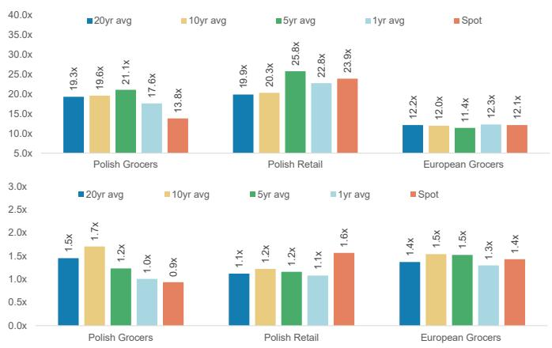  
Exhibit 28: 1-1.5x PEG tends to be consistent with long term valuations in Poland  
Exhibit 29: 12m fwd PEG ratio - long term history  
Source: Reuters, MS

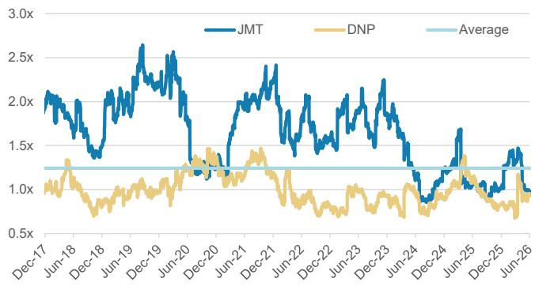  
Source: Reuters, MS

Exhibit 30: DNP 12m PE vs JMT - long term history  
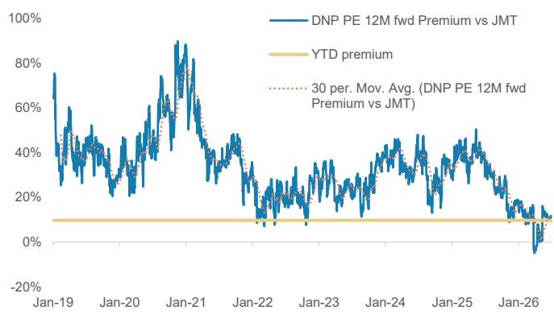  
Source: Reuters, MS

## Risk Reward – Dino Polska SA (DNP.WA)

Store rollout comes at margin expense in maturing market

## PRICE TARGET PLN 23.40

We derive our target price using a blended approach of 1) DCF, assuming a terminal growth rate of 3%, a terminal operating profit margin of 5.2%, and a WACC of 9.8%, and 2) a target PE of \~12x, a mixture of our view on the normalized earnings growth of the business and competitive positioning.

## Consensus Price Target Distribution

Source: Refinitiv, MS

## RISK REWARD CHART

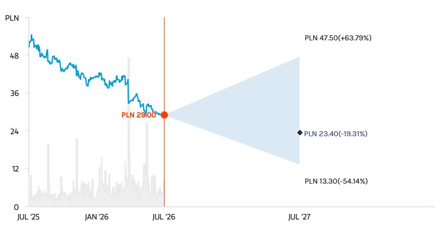  
Key: — Historical Stock Performance ● Current Stock Price ◆ Price Target

## UNDERWEIGHT THESIS

\- The Polish market is undergoing structural transition - the supply is exceeding demand and margins need to find a new equilibrium
- Consensus expectations are too high, factoring in both ambitious space expansion and margin stability
- Given new slower growth prospects, we think the multiple will also likely de-rate from here

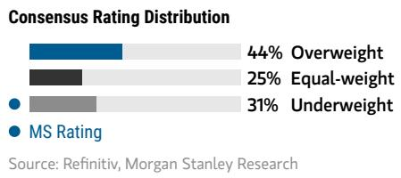  
Source: Refinitiv, MS

<table><tr><td colspan="2">Risk Reward Themes</td></tr><tr><td>Contrarian:</td><td>Negative</td></tr><tr><td>Disruption:</td><td>Negative</td></tr><tr><td>Pricing Power:</td><td>Negative</td></tr><tr><td colspan="2">View descriptions of Risk Rewards Themes here</td></tr></table>

Source: Refinitiv, MS

## BULL CASE

## Faster for longer

## PLN 47.50

2027-2037e revenue CAGR of 12%, with a long-term EBIT margin of 6.5%. We assume a terminal growth rate of 4.0%. Implied 12m fwd PE is \~20x at valuation

## BASE CASE

## PLN 23.40

## Space growth at expense of margins

2027-2037e revenue CAGR of 9%, with a long-term EBIT margin of 5.2%. We assume a terminal growth rate of 3.0%. Implied 12m fwd PE is \~12.4x at valuation

## BEAR CASE

## PLN 13.30

## Maturity leads to slowdown

2027-2037e revenue CAGR of 6%, with a long-term EBIT margin of 4.0%. We assume a terminal growth rate of 2.0%. Implied 12m fwd PE is \~10.4x at valuation

View explanation of regional hierarchies here

## Risk Reward – Dino Polska SA (DNP.WA)

## KEY EARNINGS INPUTS

<table><tr><td>Drivers</td><td>NA 2025</td><td>NA 2026e</td><td>NA 2027e</td><td>NA 2028e</td></tr><tr><td>LFL sales growth (%)</td><td>4.4</td><td>3.3</td><td>4.8</td><td>4.9</td></tr><tr><td>Net selling space growth (sqm) (%)</td><td>13.3</td><td>13.1</td><td>13.8</td><td>12.2</td></tr><tr><td>Sales density growth (%)</td><td>1.4</td><td>(0.1)</td><td>0.6</td><td>1.5</td></tr><tr><td>Gross margin (%)</td><td>33.8</td><td>33.4</td><td>33.3</td><td>33.3</td></tr><tr><td>EBITDA margin (%)</td><td>7.6</td><td>7.2</td><td>7.1</td><td>7.0</td></tr></table>

## INVESTMENT DRIVERS

• We believe the key driver of the investment case is the rate of expansion driving revenue and EBITDA growth

\- Inflation at low to mid single digits is supportive of the business

## GLOBAL REVENUE EXPOSURE

  
Source: MS Estimate

## MS ALPHA MODELS

3 Month Horizon

Source: Refinitiv, FactSet, MS; 1 is the highest favored Quintile and 5 is the least favored Quintile

## RISKS TO PT/RATING

## RISKS TO UPSIDE

\- More scale translates into better supplier terms and gross margins

• Better LFL growth than expected

\- Better competitive environment leading to an end of the price war

## RISKS TO DOWNSIDE

\- A more aggressive response from competitors than expected

\- Weaker than expected execution on store roll out

\- Weaker volume backdrop in the Polish market

• Macro / geopolitical risk

## OWNERSHIP POSITIONING

<table><tr><td>HF Sector Long/Short Ratio</td><td>1%</td><td></td><td></td><td></td></tr><tr><td>HF Sector Net Exposure</td><td>0.2x</td><td></td><td></td><td></td></tr></table>

Source: MS Prime Brokerage. Includes certain hedge fund exposures held with MSPB. Information may be inconsistent with or may not reflect broader market trends. Long/Short Ratio = Long Exposure / Short exposure. Sector % of Total Net Exposure = (For a particular sector: Long Exposure - Short Exposure) / (Across all sectors: Long Exposure – Short Exposure).

MS ESTIMATES VS. CONSENSUS  
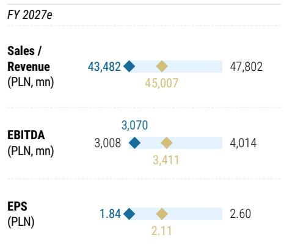  
- Mean
- MS Estimates
Source: Refinitiv, MS

## Risk Reward – Dino Polska SA (DNP.WA)

## SUSTAINABILITY AND ESG

Our ESG R/R tile includes data from FactSet, as well as, data from our proprietary HER score and Sustainable Solutions Interactive tool.

FactSet, a third party vendor, developed FactSet's SFDR Principal Adverse Impacts (PAI) data specifically to support compliant Sustainable Finance Disclosure Regulation (SFDR) reporting. FactSet collects PAI metrics from publicly available company disclosures, then standardizes the company-reported information to allow for easy comparison across companies. Specifically, FactSet converts nonconforming data points to standardized units as required by SFDR, like gigawatt hours, metric tons of CO2e, Tons and anti-corruption fines paid in EUR.

The Holistic Equal Representation (HER) score, a MS proprietary framework, systematically ranks companies on their level of gender diversity representation: the percentage of women who are (1) board members, (2) executives, (3) managers, and (4) employees. For each metric of representation, we calculated monthly region and sector (cohort) neutral z-scores which were then combined at an equal weight (25% each) to formulate HER Score. By using z-scored values, we are able to identify companies that are above or below their cohort mean. If any of the 4 metrics are missing for a company, the z-score for that metric is set to O. Companies that rank the highest within their cohort will have the largest z-score and the those that rank the lowest will have the smallest (i.e. negative) z-score. Companies with the highest (lowest) z-scores across all 4 metrics will have the highest (lowest) HER Score. In Japan, we z-scored the equal weighted average of the raw metrics of representation by sector. We show which tertile each company is in for workforce gender diversity, relative to their regional sector peers.

Sustainable Solutions Interactive Tool, a MS proprietary tool, maps historical and projected revenue and capex exposure of stocks to sustainability themes. These sustainability themes include: Climate Change, Resource Management, Health & Wellbeing, Safety & Security, and Inclusion.

## ALL METRICS OVER TIME

<table><tr><td>Environment</td><td>Unit</td><td>Dec&#x27; 23</td><td>Dec&#x27; 24</td><td>Dec&#x27; 25</td></tr><tr><td>Total GHG emissions</td><td>Metric ton CO2 e</td><td>244,924</td><td>6,404,850</td><td>7,323,236</td></tr><tr><td>Total GHG emissions/ Enterprise value (EV)</td><td>Metric ton per EUR million EV</td><td>22.47</td><td>671.13</td><td>711.28</td></tr><tr><td>Total amount of hazardous waste generated (including radioactive waste, if reported)</td><td>Tonnes</td><td>-</td><td>0.35</td><td>-</td></tr><tr><td colspan="5">Governance</td></tr><tr><td>Average Tenure of Board</td><td>Number</td><td>15.10</td><td>12.56</td><td>12.56</td></tr><tr><td>Board Independent Directors</td><td>Percentage</td><td>25</td><td>40</td><td>40</td></tr><tr><td>Board gender diversity</td><td>Ratio</td><td>0:5</td><td>0:5</td><td>0:5</td></tr></table>

Source: FactSet, MS

## Risk Reward – Jeronimo Martins SGPS SA (JMT.LS)

Exposed to oversupplied end market

## PRICE TARGET €15.50

We derive our target price using a blended approach of 1) DCF, assuming a terminal growth rate of 2%, a terminal operating profit margin of 3.5%, and a WACC of 8.8%, and 2) a target PE of \~12x, a mixture of our view on the normalized earnings growth of the business and competitive positioning.

## Consensus Price Target Distribution

Source: Refinitiv, MS

## RISK REWARD CHART

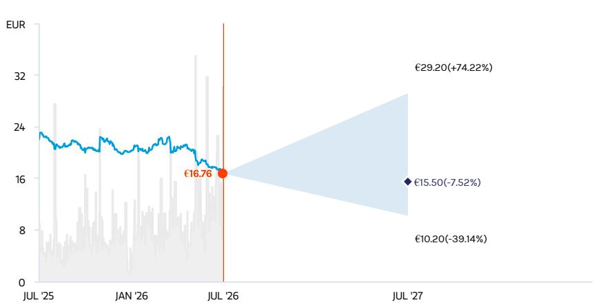  
Key: — Historical Stock Performance ● Current Stock Price ◆ Price Target

## UNDERWEIGHT THESIS

\- JMT has a strong track record of execution, but we think the Polish food retail market is oversupplied
- We think the market is fundamentally misunderstanding where Polish food retail sits on the maturity curve
- We expect fierce competition to continue, with Biedronka maintaining price leadership, which poses downside risk to Consensus LfL and profit expectations for Poland
- Our estimates are \~7% below Cssus by 2028e for Biedronka as a result

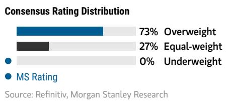

<table><tr><td>Contrarian:</td><td>Negative</td></tr><tr><td>Pricing Power:</td><td>Negative</td></tr><tr><td>Secular Growth:</td><td>Negative</td></tr></table>

View descriptions of Risk Rewards Themes here  
Source: Refinitiv, MS

## BULL CASE

## Faster growth, op. leverage

## €29.20 BASE CASE

2027-2037e revenue CAGR of 5.6%, with a long-term EBIT margin of 4.0%. We assume a terminal growth rate of 3.0%. Implied 12m fwd PE is \~19.5x at valuation.

## Structural transition

2027-2037e revenue CAGR of 4.1%, with a long-term EBIT margin of 3.5%. We assume a terminal growth rate of 2.0%. Implied 12m fwd PE is \~12.5x at valuation

## €15.50 BEAR CASE

## €10.20

## Weaker core delivery

2027-2037e revenue CAGR of 2.8%, with a long-term EBIT margin of 3.0%. We assume a terminal growth rate of 1.0%. Implied 12m fwd PE is \~10.5x at valuation.

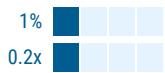

## Risk Reward – Jeronimo Martins SGPS SA (JMT.LS)

## KEY EARNINGS INPUTS

<table><tr><td>Drivers</td><td>NA 2025</td><td>NA 2026e</td><td>NA 2027e</td><td>NA 2028e</td></tr><tr><td>Net sales (€, mn)</td><td>35,991</td><td>38,141</td><td>39,948</td><td>42,039</td></tr><tr><td>Net Sales YoY growth (%)</td><td>7.6</td><td>6.0</td><td>4.7</td><td>5.2</td></tr><tr><td>EBITDA Margin (%)</td><td>6.9</td><td>6.9</td><td>7.0</td><td>7.1</td></tr><tr><td>EBIT Margin (%)</td><td>3.7</td><td>3.6</td><td>3.7</td><td>3.7</td></tr><tr><td>EBIT (€, mn)</td><td>1,338</td><td>1,392</td><td>1,473</td><td>1,570</td></tr></table>

## INVESTMENT DRIVERS

• Market growth and competition in Poland

\- Sustainability of turnaround, and scope for further margin improvement in Colombia

• Inflation across the footprint

## GLOBAL REVENUE EXPOSURE

  
Source: MS Estimate View explanation of regional hierarchies here

## MS ALPHA MODELS

5/5 MOST 3 Month Horizon

Source: Refinitiv, FactSet, MS; 1 is the highest favored Quintile and 5 is the least favored Quintile

## RISKS TO PT/RATING

## RISKS TO UPSIDE

\- Poland top-line growth accelerates on stronger volumes

\- Better traction and faster roll-out of new format stores

• Better than expected cost control

\- Better than expected competitive environment in Poland

## RISKS TO DOWNSIDE

\- Lower food volume growth than we assume

\- Competition leading to heavier investment in growth, leading to weaker margins due to price competition

• Macro / geopolitical events

## OWNERSHIP POSITIONING

HF Sector Long/Short Ratio

## HF Sector Net Exposure

Source: MS Prime Brokerage. Includes certain hedge fund exposures held with MSPB. Information may be inconsistent with or may not reflect broader market trends. Long/Short Ratio = Long Exposure / Short exposure. Sector % of Total Net Exposure = (For a particular sector: Long Exposure - Short Exposure) / (Across all sectors: Long Exposure – Short Exposure).

MS ESTIMATES VS. CONSENSUS  
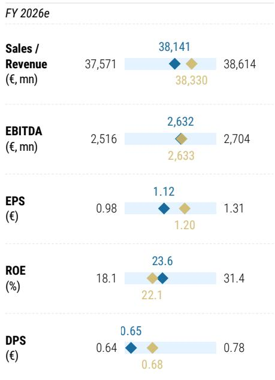  
◆ Mean ◆ MS Estimates
Source: Refinitiv, MS

## Risk Reward – Jeronimo Martins SGPS SA (JMT.LS)

## SUSTAINABILITY AND ESG

Our ESG R/R tile includes data from FactSet, as well as, data from our proprietary HER score and Sustainable Solutions Interactive tool.

FactSet, a third party vendor, developed FactSet's SFDR Principal Adverse Impacts (PAI) data specifically to support compliant Sustainable Finance Disclosure Regulation (SFDR) reporting. FactSet collects PAI metrics from publicly available company disclosures, then standardizes the company-reported information to allow for easy comparison across companies. Specifically, FactSet converts nonconforming data points to standardized units as required by SFDR, like gigawatt hours, metric tons of CO2e, Tons and anti-corruption fines paid in EUR.

The Holistic Equal Representation (HER) score, a MS proprietary framework, systematically ranks companies on their level of gender diversity representation: the percentage of women who are (1) board members, (2) executives, (3) managers, and (4) employees. For each metric of representation, we calculated monthly region and sector (cohort) neutral z-scores which were then combined at an equal weight (25% each) to formulate HER Score. By using z-scored values, we are able to identify companies that are above or below their cohort mean. If any of the 4 metrics are missing for a company, the z-score for that metric is set to 0. Companies that rank the highest within their cohort will have the largest z-score and the those that rank the lowest will have the smallest (i.e. negative) z-score. Companies with the highest (lowest) z-scores across all 4 metrics will have the highest (lowest) HER Score. In Japan, we z-scored the equal weighted average of the raw metrics of representation by sector. We show which tertile each company is in for workforce gender diversity, relative to their regional sector peers.

Sustainable Solutions Interactive Tool, a MS proprietary tool, maps historical and projected revenue and capex exposure of stocks to sustainability themes. These sustainability themes include: Climate Change, Resource Management, Health & Wellbeing, Safety & Security, and Inclusion.

## ALL METRICS OVER TIME

<table><tr><td>Environment</td><td>Unit</td><td>Dec&#x27; 23</td><td>Dec&#x27; 24</td><td>Dec&#x27; 25</td></tr><tr><td>Total GHG emissions</td><td>Metric ton CO2 e</td><td>33,508,230</td><td>33,546,396</td><td>31,009,473</td></tr><tr><td>Total GHG emissions/ Enterprise value (EV)</td><td>Metric ton per EUR million EV</td><td>1,775</td><td>2,002</td><td>1,672</td></tr><tr><td>Total amount of hazardous waste generated (including radioactive waste, if reported)</td><td>Tonnes</td><td>387</td><td>433</td><td>576</td></tr><tr><td colspan="5">Governance</td></tr><tr><td>Average Tenure of Board</td><td>Number</td><td>9.48</td><td>9.48</td><td>5.33</td></tr><tr><td>Board Independent Directors</td><td>Percentage</td><td>60</td><td>60</td><td>30</td></tr><tr><td>Board gender diversity</td><td>Ratio</td><td>4:7</td><td>4:7</td><td>4:7</td></tr></table>

HERS VS. SECTOR PEERS  
Source: FactSet, MS

Source: Refinitiv, MS

View descriptions of Risk Rewards Themes here

Consensus Rating Distribution

## Risk Reward – Zabka Group (ZAB.WA)

Growth opportunities, high execution bar

## PRICE TARGET PLN 28.60

We derive our target price using a blended approach of 1) DCF, assuming a terminal growth rate of 3%, a terminal operating profit margin of 6.8%, and a WACC of 9.3%, and 2) a target PE of \~19.4x, a mixture of our view on the normalized earnings growth of the business, balance sheet risks and liquidity considerations.

## Consensus Price Target Distribution

Source: Refinitiv, MS

## RISK REWARD CHART

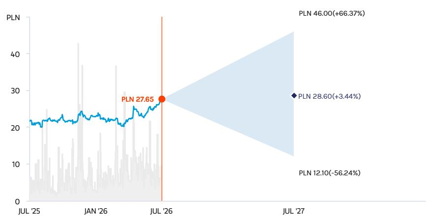  
Key: — Historical Stock Performance ● Current Stock Price ◆ Price Target  
Source: Refinitiv, MS

## EQUAL-WEIGHT THESIS

\- Zabka mix is more insulated from the ongoing space/price war vs other listed Polish food retailers and has exposure to faster growing convenience/ digital channels
- At the same time, Cssus expectations leave a very high bar to clear from an execution standpoint and we see risks tilted to the downside
- Debt restructuring is a key positive but reverse factoring exposures remain higher vs peers, and Romania roll-out caps margin upside

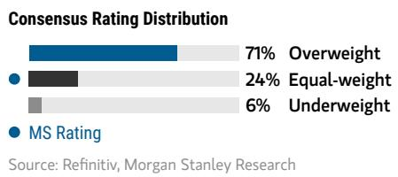

## Risk Reward Themes

## BULL CASE

## PLN 46.00

## Faster growth, op. leverage

2027-2037e revenue CAGR of 11%, with a long-term EBIT margin of 7.7%. We assume a terminal growth rate of 3.5%. Implied 12m fwd PE is \~26.5x at valuation.

## BASE CASE

## Growth opportunities

## PLN 28.60 BEAR CASE

2027-2037e revenue CAGR of 8.3%, with a long-term EBIT margin of 6.8%. We assume a terminal growth rate of 3%. Implied 12m fwd PE is \~19x at valuation.

## PLN 12.10

## Weaker core delivery

2027-2037e revenue CAGR of 5.4%, with a long-term EBIT margin of 4.5%. We assume a terminal growth rate of 2.5%. Implied 12m fwd PE is \~13x at valuation.

## Risk Reward – Zabka Group (ZAB.WA)

## KEY EARNINGS INPUTS

<table><tr><td>Drivers</td><td>NA 2025</td><td>NA 2026e</td><td>NA 2027e</td><td>NA 2028e</td></tr><tr><td>Sales growth (%)</td><td>14.1</td><td>13.1</td><td>11.9</td><td>11.6</td></tr><tr><td>Selling space growth (%)</td><td>11.5</td><td>10.1</td><td>9.3</td><td>9.3</td></tr><tr><td>Gross margin (%)</td><td>16.4</td><td>16.4</td><td>16.6</td><td>16.5</td></tr><tr><td>EBITDA margin (%)</td><td>13.1</td><td>12.7</td><td>12.9</td><td>12.9</td></tr></table>

## INVESTMENT DRIVERS

• Market growth and competition in Poland

\- Delivery on mid term targets: store expansion, QSR rollout, digital growth and expansion into Romania

\- Pace of opex increase vs topline growth

## GLOBAL REVENUE EXPOSURE

  
Source: MS Estimate View explanation of regional hierarchies here

## MS ALPHA MODELS

4/5 MOST 3 Month Horizon

Source: Refinitiv, FactSet, MS; 1 is the highest favored Quintile and 5 is the least favored Quintile

## RISKS TO PT/RATING

## RISKS TO UPSIDE

\- Polish consumer recovery stronger than expected

• Digital offer uptake is stronger than targeted

\- Better than expected cost savings / franchise margin control

## RISKS TO DOWNSIDE

\- Consumer recovery is slower than expected

\- Space expansion slower / less profitable than expected

\- Difficulties in franchise recruitment weighing on space/ margins

• Regulation changes to franchise model

## OWNERSHIP POSITIONING

HF Sector Long/Short Ratio
HF Sector Net Exposure

Source: MS Prime Brokerage. Includes certain hedge fund exposures held with MSPB. Information may be inconsistent with or may not reflect broader market trends. Long/Short Ratio = Long Exposure / Short exposure. Sector % of Total Net Exposure = (For a particular sector: Long Exposure - Short Exposure) / (Across all sectors: Long Exposure – Short Exposure).

MS ESTIMATES VS. CONSENSUS  
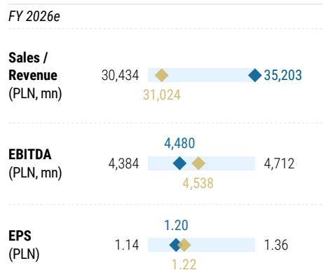  
◆ Mean ◆ MS Estimates
Source: Refinitiv, MS

## Risk Reward Reference links

1. View explanation of Options Probabilities methodology -

Options\_Probabilities\_Exhibit\_Link.pdf

2. View descriptions of Risk Rewards Themes - RR\_Themes\_Exhibit\_Link.pdf

3. View explanation of regional hierarchies - GEG\_Exhibit\_Link.pdf

4. View explanation of Theme/Exposure methodology -

ESG\_Sustainable\_Solutions\_External\_Link.pdf

5. View explanation of HERS methodology - ESG\_HERS\_External\_Link.pdf

## Disclosure Section

The information and opinions in MS were prepared or are disseminated by MS Europe S.E., regulated by Bundesanstalt fuer Finanzdienstleistungsaufsicht (BaFin) and/or MS & Co. International plc, authorized by the Prudential Regulation Authority and regulated by the Financial Conduct Authority and the Prudential Regulation Authority. MS & Co. International plc disseminates in the UK research that it has prepared, and which has been prepared by any of its affiliates, only to persons who (i) are investment professionals falling within Article 19(5) of the Financial Services and Markets Act 2000 (Financial Promotion) Order 2005 (as amended, the "Order"); (ii) are persons who are high net worth entities falling within Article 49(2)(a) to (d) of the Order; or (iii) are persons to whom an invitation or inducement to engage in investment activity (within the meaning of section 21 of the Financial Services and Markets Act 2000, as amended) may otherwise lawfully be communicated or caused to be communicated. As used in this disclosure section, MS includes RMB MS Proprietary Limited, MS Europe S.E., MS & Co International plc and its affiliates.

For important disclosures, stock price charts and equity rating histories regarding companies that are the subject of this report, please see the MS Disclosure Website at www.morganstanley.com/eqr/disclosures/webapp/generalresearch, or contact your investment representative or MS at 1585 Broadway, (Attention: Research Management), New York, NY, 10036 USA.

For valuation methodology and risks associated with any recommendation, rating or price target referenced in this research report, please contact the Client Support Team as follows: US/Canada +1 800 303-2495; Hong Kong +852 2848-5999; Latin America +1 718 754-5444 (U.S.); London +44 (0)20-7425-8169; Singapore +65 6834-6860; Sydney +61 (0)2-9770-1505; Tokyo +81 (0)3-6836-9000. Alternatively you may contact your investment representative or MS at 1585 Broadway, (Attention: Research Management), New York, NY 10036 USA.

## Analyst Certification

The following analysts hereby certify that their views about the companies and their securities discussed in this report are accurately expressed and that they have not received and will not receive direct or indirect compensation in exchange for expressing specific recommendations or views in this report: Izabel Dobreva.

## Global Research Conflict Management Policy

MS has been published in accordance with our conflict management policy, which is available at www.morganstanley.com/institutional/research/conflictpolicies. A Portuguese version of the policy can be found at www.morganstanley.com.br

## Important Regulatory Disclosures on Subject Companies

As of May 29, 2026, MS beneficially owned 1% or more of a class of common equity securities of the following companies covered in MS: Carrefour, J Sainsbury PLC, Koninklijke Ahold Delhaize NV, Marks and Spencer Group PLC, Tesco PLC.

Within the last 12 months, MS has received compensation for investment banking services from Carrefour.

In the next 3 months, MS expects to receive or intends to seek compensation for investment banking services from Carrefour, Dino Polska SA, J Sainsbury PLC, Jeronimo Martins SGPS SA, Koninklijke Ahold Delhaize NV, Marks and Spencer Group PLC, Tesco PLC, Zabka Group.

Within the last 12 months, MS has received compensation for products and services other than investment banking services from Carrefour, J Sainsbury PLC, Marks and Spencer Group PLC.

Within the last 12 months, MS has provided or is providing investment banking services to, or has an investment banking client relationship with, the following company: Carrefour, Dino Polska SA, J Sainsbury PLC, Jeronimo Martins SGPS SA, Koninklijke Ahold Delhaize NV, Marks and Spencer Group PLC, Tesco PLC, Zabka Group.

Within the last 12 months, MS has either provided or is providing non-investment banking, securities-related services to and/or in the past has entered into an agreement to provide services or has a client relationship with the following company: Carrefour, J Sainsbury PLC, Marks and Spencer Group PLC, Tesco PLC.

MS & Co. International plc is a corporate broker to Marks and Spencer Group PLC.

The equity research analysts or strategists principally responsible for the preparation of MS have received compensation based upon various factors, including quality of research, investor client feedback, stock picking, competitive factors, firm revenues and overall investment banking revenues. Equity Research analysts' or strategists' compensation is not linked to investment banking or capital markets transactions performed by MS or the profitability or revenues of particular trading desks.

MS and its affiliates do business that relates to companies/instruments covered in MS, including market making, providing liquidity, fund management, commercial banking, extension of credit, investment services and investment banking. MS sells to and buys from customers the securities/instruments of companies covered in MS on a principal basis. MS may have a position in the debt of the Company or instruments discussed in this report. MS trades or may trade as principal in the debt securities (or in related derivatives) that are the subject of the debt research report.

Certain disclosures listed above are also for compliance with applicable regulations in non-US jurisdictions.

## STOCK RATINGS

MS uses a relative rating system using terms such as Overweight, Equal-weight, Not-Rated or Underweight (see definitions below). MS does not assign ratings of Buy, Hold or Sell to the stocks we cover. Overweight, Equal-weight, Not-Rated and Underweight are not the equivalent of buy, hold and sell. Investors should carefully read the definitions of all ratings used in MS. In addition, since MS contains more complete information concerning the analyst's views, investors should carefully read MS, in its entirety, and not infer the contents from the rating alone. In any case, ratings (or research) should not be used or relied upon as investment advice. An investor's decision to buy or sell a stock should depend on individual circumstances (such as the investor's existing holdings) and other considerations.

## Global Stock Ratings Distribution

(as of June 30, 2026)

The Stock Ratings described below apply to MS's Fundamental Equity Research and do not apply to Debt Research produced by the Firm.

For disclosure purposes only (in accordance with FINRA requirements), we include the category headings of Buy, Hold, and Sell alongside our ratings of Overweight, Equal-weight, Not-Rated and Underweight. MS does not assign ratings of Buy, Hold or Sell to the stocks we cover. Overweight, Equal-weight, Not-Rated and Underweight are not the equivalent of buy, hold, and sell but represent recommended relative weightings (see definitions below). To satisfy regulatory requirements, we correspond Overweight, our most positive stock rating, with a buy recommendation; we correspond Equal-weight and Not-Rated to hold and Underweight to sell recommendations, respectively.

<table><tr><td></td><td colspan="2">Coverage Universe</td><td colspan="3">Investment Banking Clients (IBC)</td><td colspan="2">Other Material Investment ServicesClients (MISC)</td></tr><tr><td>Stock RatingCategory</td><td>Count</td><td>% of Total</td><td>Count</td><td>% of Total IBC</td><td>% of RatingCategory</td><td>Count</td><td>% of Total OtherMISC</td></tr><tr><td>Overweight/Buy</td><td>1544</td><td>42%</td><td>453</td><td>49%</td><td>29%</td><td>757</td><td>44%</td></tr><tr><td>Equal-weight/Hold</td><td>1577</td><td>43%</td><td>390</td><td>42%</td><td>25%</td><td>769</td><td>44%</td></tr><tr><td>Not-Rated/Hold</td><td>3</td><td>0%</td><td>1</td><td>0%</td><td>33%</td><td>1</td><td>0%</td></tr><tr><td>Underweight/Sell</td><td>544</td><td>15%</td><td>89</td><td>10%</td><td>16%</td><td>204</td><td>12%</td></tr><tr><td>Total</td><td>3,668</td><td></td><td>933</td><td></td><td></td><td>1731</td><td></td></tr></table>

Data include common stock and ADRs currently assigned ratings. Investment Banking Clients are companies from whom MS received investment banking compensation in the last 12 months. Due to rounding off of decimals, the percentages provided in the "% of total" column may not add up to exactly 100 percent.

## Analyst Stock Ratings

Overweight (O). The stock's total return is expected to exceed the average total return of the analyst's industry (or industry team's) coverage universe, on a risk-adjusted basis, over the next 12-18 months.

Equal-weight (E). The stock's total return is expected to be in line with the average total return of the analyst's industry (or industry team's) coverage universe, on a risk-adjusted basis, over the next 12-18 months.

Not-Rated (NR). Currently the analyst does not have adequate conviction about the stock's total return relative to the average total return of the analyst's industry (or industry team's) coverage universe, on a risk-adjusted basis, over the next 12-18 months.

Underweight (U). The stock's total return is expected to be below the average total return of the analyst's industry (or industry team's) coverage universe, on a risk-adjusted basis, over the next 12-18 months.

Unless otherwise specified, the time frame for price targets included in MS is 12 to 18 months.

## Analyst Industry Views

Attractive (A): The analyst expects the performance of his or her industry coverage universe over the next 12-18 months to be attractive vs. the relevant broad market benchmark, as indicated below.

In-Line (I): The analyst expects the performance of his or her industry coverage universe over the next 12-18 months to be in line with the relevant broad market benchmark, as indicated below. Cautious (C): The analyst views the performance of his or her industry coverage universe over the next 12-18 months with caution vs. the relevant broad market benchmark, as indicated below. Benchmarks for each region are as follows: North America - S&P 500; Latin America - relevant MSCI country index or MSCI Latin America Index; Europe - MSCI Europe; Japan - TOPIX; Asia - relevant MSCI country index or MSCI sub-regional index or MSCI AC Asia Pacific ex Japan Index.

## Stock Price, Price Target and Rating History (See Rating Definitions)

Source: MS Date Format : MM/DD/YY Price Target No Price Target Assigned (NA)
Stock Price (Not Covered by Current Analyst) Stock Price (Covered by Current Analyst)
Stock and Industry Ratings (abbreviations below) appear as ♦ Stock Rating/Industry View
Stock Ratings: Overweight (O) Equal-weight (E) Underweight (U) Not-Rated (NR) No Rating Available (NA)

Dino Polska SA (DNP.WA) - As of 07/01/26 GMT in PLN Industry :  
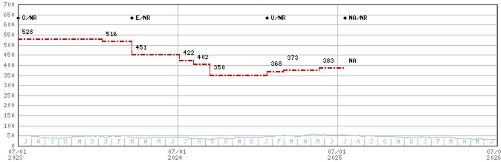  
Stock Rating History: 7/1/21 : E/NR; 6/28/22 : O/NR; 3/18/24 : E/NR; 1/21/25 : U/NR; 7/18/25 : NA/NR  
Price Target History: 5/10/21 : 288; 11/6/21 : 316; 3/11/22 : 281; 5/6/22 : 284; 6/28/22 : 342; 9/6/22 : 366; 11/7/22 : 380;
11/18/22 : 392; 3/30/23 : 453; 5/5/23 : 451; 6/30/23 : 528; 1/9/24 : 516; 3/18/24 : 451; 7/4/24 : 422; 8/6/24 : 402; 9/12/24 : 350;
1/21/25 : 368; 2/28/25 : 373; 5/20/25 : 383; 7/18/25 : NA  
Source: MS Date Format : MM/DD/YY Price Target No Price Target Assigned (NA)
Stock Price (Not Covered by Current Analyst) Stock Price (Covered by Current Analyst)
Stock and Industry Ratings (abbreviations below) appear as Stock Rating/Industry View
Stock Rating: Overweight (0) Equal-weight (E) Underweight (U) Not-Rated (NR) No Rating Available (NA)  
Industry View: Attractive (A) In-line (I) Cautious (C) No Rating (NR)  
Effective January 13, 2014, the stocks covered by MS Asia Pacific will be rated relative to the analyst's industry (or industry team's) coverage.  
Effective January 13, 2014, the industry view benchmarks for MS Asia Pacific are as follows: relevant MSCI country index or MSCI sub-regional index or MSCI AC Asia Pacific ex Japan Index.

Jeronimo Martins SGPS SA (JMT.LS) - As of 07/01/26 GMT in EUR Industry :  
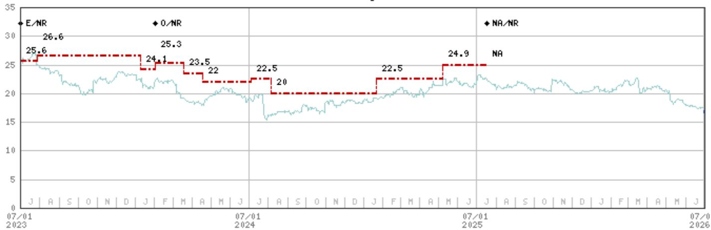  
Stock Rating History: 7/1/21 : E/NR; 6/24/22 : NA/NR; 11/18/22 : E/NR; 2/2/24 : 0/NR; 7/18/25 : NA/NR  
Price Target History: 3/17/21 : 14.9; 7/15/21 : 15.5; 7/30/21 : 16.5; 12/2/21 : 18; 3/10/22 : 18.1; 6/24/22 : NA; 11/18/22 : 21.8; 3/30/23 : 22.5; 5/3/23 : 23; 6/30/23 : 25.6; 7/28/23 : 26.6; 1/9/24 : 24.1; 2/2/24 : 25.3; 3/18/24 : 23.5; 4/18/24 : 22; 7/4/24 : 22.5; 8/6/24 : 20; 1/21/25 : 22.5; 5/6/25 : 24.9; 7/18/25 : NA  
Industry View: Attractive (A) In-line (I) Cautious (C) No Rating (NR)  
Effective January 13, 2014, the stocks covered by MS Asia Pacific will be rated relative to the analyst's industry (or industry team's) coverage.  
Effective January 13, 2014, the industry view benchmarks for MS Asia Pacific are as follows: relevant MSCI country index or MSCI sub-regional index or MSCI AC Asia Pacific ex Japan Index.

## Important Disclosures for MS Smith Barney LLC Customers

Important disclosures regarding any material conflict of interest that can reasonably be expected to have influenced MS Smith Barney LLC's choice of a third-party research provider or the subject company of a third-party research report, are available on the MS Wealth Management disclosure website at www.morganstanley.com/online/researchdisclosures. For MS specific disclosures, you may refer to https://www.morganstanley.com/eqr/disclosures/webapp/generalresearch.

Each MS report is reviewed and approved on behalf of MS Smith Barney LLC. This review and approval is conducted by the same person who reviews the research report on behalf of MS. This could create a conflict of interest.

## Other Important Disclosures

MS policy is to update research reports as and when the Research Analyst and Research Management deem appropriate, based on developments with the issuer, the sector, or the market that may have a material impact on the research views or opinions stated therein. In addition, certain Research publications are intended to be updated on a regular periodic basis (weekly/monthly/quarterly/annual) and will ordinarily be updated with that frequency, unless the Research Analyst and Research Management determine that a different publication schedule is appropriate based on current conditions.

MS is not acting as a municipal advisor and the opinions or views contained herein are not intended to be, and do not constitute, advice within the meaning of Section 975 of the Dodd-Frank Wall Street Reform and Consumer Protection Act.

MS produces an equity research product called a "Tactical Idea." Views contained in a "Tactical Idea" on a particular stock may be contrary to the recommendations or views expressed in research on the same stock. This may be the result of differing time horizons, methodologies, market events, or other factors. For all research available on a particular stock, please contact your sales representative or go to Matrix at http://www.morganstanley.com/matrix.

MS is provided to our clients through our proprietary research portal on Matrix and also distributed electronically by MS to clients. Certain, but not all, MS products are also made available to clients through third-party vendors or redistributed to clients through alternate electronic means as a convenience. For access to all available MS, please contact your sales representative or go to Matrix at http://www.morganstanley.com/matrix.

Any access and/or use of MS is subject to MS's Terms of Use (http://www.morganstanley.com/terms.html). By accessing and/or using MS, you are indicating that you have read and agree to be bound by our Terms of Use (http://www.morganstanley.com/terms.html). In addition you consent to MS processing your personal data and using cookies in accordance with our Privacy Policy and our Global Cookies Policy (http://www.morganstanley.com/privacy\_pledge.html), including for the purposes of setting your preferences and to collect readership data so that we can deliver better and more personalized service and products to you. To find out more information about how MS processes personal data, how we use cookies and how to reject cookies see our Privacy Policy and our Global Cookies Policy (http://www.morganstanley.com/privacy\_pledge.html). Please use the provided link to review the Terms and Conditions and Most Important Terms and Conditions for MS India Company Private Limited (https://www.morganstanley.com/assets/pdfs/about-us-global-offices/india/Terms\_and\_conditions.pdf) and the following link to review the audit report (https://ny.matrix.ms.com/eqr/research/webapp/researchdocs/MSICPL\_Morgan\_Stanley\_Research\_Audit\_Report.pdf).

If you do not agree to our Terms of Use and/or if you do not wish to provide your consent to MS processing your personal data or using cookies please do not access our research. MS does not provide individually tailored investment advice. MS has been prepared without regard to the circumstances and objectives of those who receive it. MS recommends that investors independently evaluate particular investments and strategies, and encourages investors to seek the advice of a financial adviser. The appropriateness of an investment or strategy will depend on an investor's circumstances and objectives. The securities, instruments, or strategies discussed in MS may not be suitable for all investors, and certain investors may not be eligible to purchase or participate in some or all of them. MS is not an offer to buy or sell or the solicitation of an offer to buy or sell any security/instrument or to participate in any particular trading strategy. The value of and income from your investments may vary because of changes in interest rates, foreign exchange rates, default rates, prepayment rates, securities/instruments prices, market indexes, operational or financial conditions of companies or other factors. There may be time limitations on the exercise of options or other rights in securities/instruments transactions. Past performance is not necessarily a guide to future performance. Estimates of future performance are based on assumptions that may not be realized. If provided, and unless otherwise stated, the closing price on the cover page is that of the primary exchange for the subject company's securities/instruments.

The fixed income research analysts, strategists or economists principally responsible for the preparation of MS have received compensation based upon various factors, including quality, accuracy and value of research, firm profitability or revenues (which include fixed income trading and capital markets profitability or revenues), client feedback and competitive factors. Fixed Income Research analysts', strategists' or economists' compensation is not linked to investment banking or capital markets transactions performed by MS or the profitability or revenues of particular trading desks.

The "Important Regulatory Disclosures on Subject Companies" section in MS lists all companies mentioned where MS owns 1% or more of a class of common equity securities of the companies. For all other companies mentioned in MS, MS may have an investment of less than 1% in securities/instruments or derivatives of securities/instruments of companies and may trade them in ways different from those discussed in MS. Employees of MS not involved in the preparation of MS may have investments in securities/instruments or derivatives of securities/instruments of companies mentioned and may trade them in ways different from those discussed in MS. Derivatives may be issued by MS or associated persons.

With the exception of information regarding MS, MS is based on public information. MS makes every effort to use reliable, comprehensive information, but we make no representation that it is accurate or complete. We have no obligation to tell you when opinions or information in MS change apart from when we intend to discontinue equity research coverage of a subject company. Facts and views presented in MS have not been reviewed by, and may not reflect information known to, professionals in other MS business areas, including investment banking personnel.

MS personnel may participate in company events such as site visits and are generally prohibited from accepting payment by the company of associated expenses unless pre-approved by authorized members of Research management.

MS may make investment decisions that are inconsistent with the recommendations or views in this report.

To our readers based in Taiwan or trading in Taiwan securities/instruments: Information on securities/instruments that trade in Taiwan is distributed by MS Taiwan Limited ("MSTL"). Such information is for your reference only. The reader should independently evaluate the investment risks and is solely responsible for their investment decisions. MS may not be distributed to the public media or quoted or used by the public media without the express written consent of MS. Any non-customer reader within the scope of Article 7-1 of the Taiwan Stock Exchange Recommendation Regulations accessing and/or receiving MS is not permitted to provide MS to any third party (including but not limited to related parties, affiliated companies and any other third parties) or engage in any activities regarding MS which may create or give the appearance of creating a conflict of interest. Information on securities/instruments that do not trade in Taiwan is for informational purposes only and is not to be construed as a recommendation or a solicitation to trade in such securities/instruments. MSTL may not execute transactions for clients in these securities/instruments.

MS is not incorporated under PRC law and the research in relation to this report is conducted outside the PRC. MS does not constitute an offer to sell or the solicitation of an offer to buy any securities in the PRC. PRC investors shall have the relevant qualifications to invest in such securities and shall be responsible for obtaining all relevant approvals, licenses, verifications and/or registrations from the relevant governmental authorities themselves. Neither this report nor any part of it is intended as, or shall constitute, provision of any consultancy or advisory service of securities investment as defined under PRC law. Such information is provided for your reference only.

MS is disseminated in Brazil by MS C.T.V.M. S.A. located at Av. Brigadeiro Faria Lima, 3600, 6th floor, São Paulo - SP, Brazil; and is regulated by the Comissão de Valores Mobiliários; in Mexico by MS México, Casa de Bolsa, S.A. de C.V which is regulated by Comision Nacional Bancaria y de Valores. Paseo de los Tamarindos 90, Torre 1, Col. Bosques de las Lomas Floor 29, 05120 Mexico City; in Japan by MS MUFG Securities Co., Ltd. and, for Commodities related research reports only, MS Capital Group Japan Co., Ltd; in Hong Kong by MS Asia Limited (which accepts responsibility for its contents) and by MS Bank Asia Limited; in Singapore by MS Asia (Singapore) Pte. (Registration number 199206298Z) and/or MS Asia (Singapore) Securities Pte Ltd (Registration number 200008434H), regulated by the Monetary Authority of Singapore (which accepts legal responsibility for its contents and should be contacted with respect to any matters arising from, or in connection with, MS) and by MS Bank Asia Limited, Singapore Branch (Registration number T14FC0118J); in Australia to "wholesale clients" within the meaning of the Australian Corporations Act by MS Australia Limited A.B.N. 67 003 734 576, holder of Australian financial services license No. 233742, which accepts responsibility for its contents; in Australia to "wholesale clients" and "retail clients" within the meaning of the Australian Corporations Act by MS Wealth Management Australia Pty Ltd (A.B.N. 19 009 145 555, holder of Australian financial services license No. 240813, which accepts responsibility for its contents; in Korea by MS & Co International plc, Seoul Branch; in India by MS India Company Private Limited having Corporate Identification No (CIN) U22990MH1998PTC115305, regulated by the Securities and Exchange Board of India ("SEBI") and holder of licenses as a Research Analyst (SEBI Registration No. INH000001105); Stock Broker (SEBI Stock Broker Registration No. INZ000244438), Merchant Banker (SEBI Registration No. INM000011203), and depository participant with National Securities Depository Limited (SEBI Registration No. IN-DP-NSDL-567-2021) having registered office at Altimus, Level 39 & 40, Pandurang Budhkar Marg, Worli, Mumbai 400018, India; Telephone no. +91-22-61181000; Compliance Officer Details: Mr. Tejarshi Hardas, Tel. No.: +91-22-61181000 or Email: tejarshi.hardas@morganstanley.com; Grievance officer details: Mr. Tejarshi Hardas, Tel. No.: +91-22-61181000 or Email: msic-compliance@morganstanley.com. MS India Company Private Limited (MSICPL) may use AI tools in providing research services. All recommendations contained herein are made by the duly qualified research analysts; in Canada by MS Canada Limited; in Germany and the European Economic Area where required by MS Europe S.E., authorised and regulated by Bundesanstalt fuer Finanzdienstleistungsaufsicht (BaFin) under the reference number 149169; in the US by MS & Co. LLC, which accepts responsibility for its contents. MS & Co. International plc, authorized by the Prudential Regulation Authority and regulated by the Financial Conduct Authority and the Prudential Regulation Authority, disseminates in the UK research that it has prepared, and research which has been prepared by any of its affiliates, only to persons who (i) are investment professionals falling within Article 19(5) of the Financial Services and Markets Act 2000 (Financial Promotion) Order 2005 (as amended, the "Order"); (ii) are persons who are high net worth entities falling within Article 49(2)(a) to (d) of the Order; or (iii) are persons to whom an invitation or inducement to engage in investment activity (within the meaning of section 21 of the Financial Services and Markets Act 2000, as amended) may otherwise lawfully be communicated or caused to be communicated. RMB MS Proprietary Limited is a member of the JSE Limited and A2X (Pty) Ltd. RMB MS Proprietary Limited is a joint venture owned equally by MS International Holdings Inc. and RMB Investment Advisory (Proprietary) Limited, which is wholly owned by FirstRand Limited. The information in MS is being disseminated by MS Saudi Arabia, regulated by the Capital Market Authority in the Kingdom of Saudi Arabia, and is directed at Sophisticated investors only.

The information in MS is being communicated by MS & Co. International plc (DIFC Branch), regulated by the Dubai Financial Services Authority (the DFSA) or by MS & Co. International plc (ADGM Branch), regulated by the Financial Services Regulatory Authority Abu Dhabi (the FSRA), and is directed at Professional Clients only, as defined by the DFSA or the FSRA, respectively. The financial products or financial services to which this research relates will only be made available to a customer who we are satisfied meets the regulatory criteria of a Professional Client. A distribution of the different MS Research ratings or recommendations, in percentage terms for Investments in each sector covered, is available upon request from your sales representative.

The information in MS is being communicated by MS & Co. International plc (QFC Branch), regulated by the Qatar Financial Centre Regulatory Authority (the QFCRA), and is directed at business customers and market counterparties only and is not intended for Retail Customers as defined by the QFCRA.

As required by the Capital Markets Board of Turkey, investment information, comments and recommendations stated here, are not within the scope of investment advisory activity. Investment advisory service is provided exclusively to persons based on their risk and income preferences by the authorized firms. Comments and recommendations stated here are general in nature. These opinions may not fit to your financial status, risk and return preferences. For this reason, to make an investment decision by relying solely to this information stated here may not bring about outcomes that fit your expectations.

The trademarks and service marks contained in MS are the property of their respective owners. Third-party data providers make no warranties or representations relating to the accuracy, completeness, or timeliness of the data they provide and shall not have liability for any damages relating to such data. The Global Industry Classification Standard (GICS) was developed by and is the exclusive property of MSCI and S&P.

MS, or any portion thereof may not be reprinted, sold or redistributed without the written consent of MS.

Indicators and trackers referenced in MS may not be used as, or treated as, a benchmark under Regulation EU 2016/1011, or any other similar framework.

The issuers and/or fixed income products recommended or discussed in certain fixed income research reports may not be continuously followed. Accordingly, investors should regard those fixed income research reports as providing stand-alone analysis and should not expect continuing analysis or additional reports relating to such issuers and/or individual fixed income products. MS may hold, from time to time, material financial and commercial interests regarding the company subject to the Research report.

Registration granted by SEBI and certification from the National Institute of Securities Markets (NISM) in no way guarantee performance of the intermediary or provide any assurance of returns to investors. Investment in securities market are subject to market risks. Read all the related documents carefully before investing.

## INDUSTRY COVERAGE: Retailing - Food

<table><tr><td>COMPANY (TICKER)</td><td>RATING (AS OF)</td><td>PRICE* (07/01/2026)</td></tr><tr><td colspan="3">Izabel Dobreva</td></tr><tr><td>Carrefour (CARR.PA)</td><td>O (06/22/2026)</td><td>€15.70</td></tr><tr><td>Dino Polska SA (DNP.WA)</td><td>U (06/16/2026)</td><td>PLN 29.00</td></tr><tr><td>Jeronimo Martins SGPS SA (JMT.LS)</td><td>U (06/16/2026)</td><td>€16.76</td></tr><tr><td>J Sainsbury PLC (SBRY.L)</td><td>E (05/18/2026)</td><td>331p</td></tr><tr><td>Koninklijke Ahold Delhaize NV (AD.AS)</td><td>U (06/08/2026)</td><td>€35.16</td></tr><tr><td>Marks and Spencer Group PLC (MKS.L)</td><td>O (05/18/2026)</td><td>376p</td></tr><tr><td>Tesco PLC (TSCO.L)</td><td>O (05/18/2026)</td><td>459p</td></tr><tr><td>Zabka Group (ZAB.WA)</td><td>E (06/16/2026)</td><td>PLN 27.65</td></tr></table>

Stock Ratings are subject to change. Please see latest research for each company.

\* Historical prices are not split adjusted.

© 2026 MS