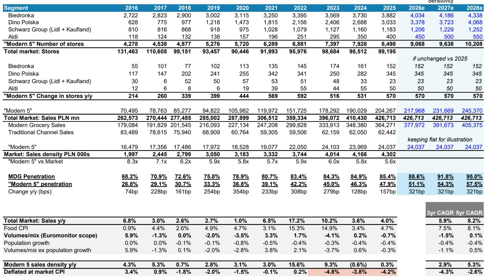
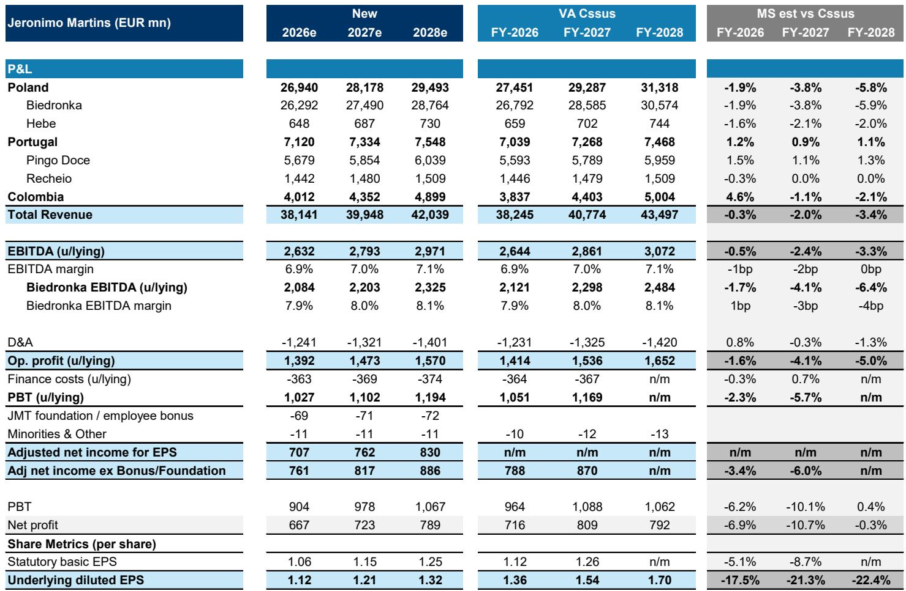
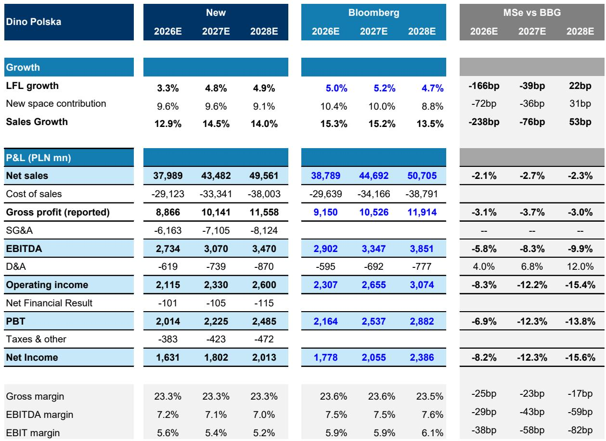

# Polish Grocery Is Trapped in a Prisoner’s Dilemma: Too Much Capital Chasing Too Little Demand

The Polish grocery sector has entered a structural phase shift that the market has not yet priced in. For years, the story was simple: modern retailers took share from traditional stores, and rising penetration justified aggressive store expansion. That funding source is now exhausted. Modern grocery penetration has plateaued at roughly 85%, and the informal channel can no longer supply the volume growth needed to absorb new stores. The result is a market where capital investment continues to accelerate even as demand decelerates, creating a supply-demand imbalance that will compress margins and returns over a multiyear period.

This is not a cyclical dip. The prevailing investor narrative focuses on weak food inflation and temporary volume softness. The more fundamental question is whether the market can absorb the capital already committed to store expansion. Our analysis suggests it cannot. The top five modern grocers in Poland added roughly 570 net new stores per year over the last three years, yet industry volumes declined. To keep sales densities flat, these players would need to generate approximately PLN 14 billion in incremental sales annually, or capture roughly 320 basis points of above-market growth. The actual share-gain run rate in 2025 was roughly 150 basis points. The math does not work.

What makes this situation particularly dangerous is the strategic logic that sustains it. No single player wants to be the first to slow expansion, because doing so would cede scale advantages to competitors. This is a classic prisoner’s dilemma, and it means the oversupply will persist until profitability is forced low enough to change behavior. We expect earnings to fall materially below consensus, with our average EBIT estimate 9 percent below Street forecasts. We restart coverage of Jeronimo Martins and Dino Polska at Underweight, and Zabka at Equal-weight.

## The Market Has Reached a Structural Inflection Point That Makes the Old Growth Model Unsustainable

For most of the past decade, the expansion of modern grocery space in Poland was self-reinforcing. Selling space grew at a compound annual rate of roughly 4.5 percent, and volumes across the top five modern grocers grew at roughly 6 percent, driven by share gains from small local grocers and hypermarkets. The funding source was abundant. Traditional channels lost share steadily, and the modern players captured enough volume to keep their store-level economics healthy.

That dynamic broke in 2023. Modern space has continued to expand at 3 to 4 percent annually, but volume growth across the top five has slowed to roughly 2 to 3 percent, set against a broader market where volumes are declining by roughly 2 percent. The share gains that once came easily from the informal channel have become harder to extract. Small grocers and specialists lost only about 50 basis points of share in 2025, and hypermarkets lost roughly 30 basis points. This is markedly below the pre-2023 five-year average of roughly 350 basis points of combined share loss from those channels.

The implication is clear: the modern grocers are now competing primarily with each other for a shrinking pool of demand. This is a zero-sum game. Volume growth can only come from taking share from other modern players, which requires sustained price investment. The result is a structural compression of margins that will persist until either space growth slows or demand accelerates materially. We see no catalyst for demand acceleration. Real disposable income growth is projected to decline from roughly 6 percent in 2024-2025 to 2 to 3 percent over 2026-2028, and household savings rates remain elevated.

## The Prisoner’s Dilemma Means No Single Player Will Voluntarily Slow Expansion, Prolonging the Oversupply

If the market is oversupplied, the rational collective response would be to slow store openings. But from each individual grocer’s perspective, the calculus is different. Pulling back on expansion while competitors continue to add stores risks losing long-term scale advantages that are critical in a low-margin, high-volume industry.

This dynamic is most visible in the regional expansion strategies of the major players. Dino Polska, for example, has approximately 4.8 stores per 100,000 inhabitants in the Masovia region around Warsaw, compared to a national average of 8.3. Bulls on the stock argue this represents a significant white-space opportunity. What this argument overlooks is that Biedronka, Lidl, and Zabka are already heavily present in Masovia. The region is not underserved in aggregate. Dino’s lower penetration reflects competitive density, not unmet demand.

Similarly, Biedronka cannot afford to cede any region to Lidl or Aldi. If it does not open a store in a location where a competitor does, it risks that competitor gaining incremental scale economies that can be reinvested in lower prices. The rational response for each player is to keep building. The aggregate result is a level of supply that the market cannot absorb.

This is not a coordination failure that can be solved by management discipline. It is a structural feature of the market’s current life stage. The prisoner’s dilemma will persist until the cost of continued expansion becomes prohibitive, meaning margins must fall far enough to force a strategic reset. We are still in the early stages of that process.

## Consensus Is Too Optimistic on Both Revenue and Margins, Creating Multi-Year Downside Risk

The market is pricing in a recovery in sales densities and margins that we believe is inconsistent with the supply-demand reality. Our sales estimates are on average 3 percent below consensus for 2028, and our EBIT estimates are 9 percent below. The gap is widest for Dino Polska, where our earnings are 16 percent below consensus, and for Jeronimo Martins, where our Biedronka EBITDA is 6.5 percent below.

The source of the disconnect is twofold. First, the market is overestimating the contribution of new space to top-line growth. As modern grocery penetration plateaus, each new store cannibalizes existing stores more directly. Our analysis shows that deflated sales densities per store across the top five modern grocers have declined by roughly 4 percent annually over the last three years. We expect this trend to continue. Second, the market is underestimating the margin impact of the ongoing price war. Biedronka has reopened a material price gap versus the market, with our estimates suggesting it is pricing roughly 7 percent below the market average as of the first quarter of 2026, compared to roughly 4.7 percent at the end of 2025. Lidl has responded in kind. Dino Polska is also operating with deflation. This competitive intensity will persist as long as supply exceeds demand.

The implications for returns on capital are significant. Returns on invested capital are unlikely to recover to pre-2023 levels and are more likely to trend further downward. This in turn implies further contraction in trading multiples. Jeronimo Martins trades at roughly 13 times forward price-to-earnings, which is below its ten-year average but may still be too high if earnings are set to decline. Dino Polska trades at roughly 16 times forward earnings, which we view as expensive given its delivered earnings per share compound annual growth rate of roughly 5 percent over 2023-2025, a period when the structural dynamics had already shifted.

## The Report Does Not Fully Resolve Which Player Will Emerge as the Structural Winner Over a Five-Year Horizon

While our analysis identifies clear near-term downside risks across the sector, it does not provide a definitive answer to the question of which player will ultimately consolidate market share and restore margins. The report argues that Biedronka is pursuing the right strategy: flexing its scale advantages, investing aggressively in price, and forcing competitors to either match its investments or exit. Carrefour’s Polish operations being put up for sale is consistent with this narrative. But the report also acknowledges that Biedronka’s strategy will compress its own margins in the near term, and that its returns on capital in Poland, while still high relative to other geographies, are declining.

The unresolved question is whether the market will consolidate around Biedronka and Lidl, or whether Dino Polska and Zabka can carve out defensible positions through different channel or product mixes. Dino Polska is more reliant on space growth than its peers, with roughly 70 percent of its three-year sales growth coming from new stores, compared to roughly 50 percent for Biedronka. This makes it more vulnerable to a slowdown in space contribution. But it also has a more fragmented store base in certain regions, which could provide a longer runway for expansion if competitive dynamics allow.

Zabka, with its convenience format and franchise model, is relatively more insulated from the price war in the discount channel. But it is not immune. Our sales estimates are still 1.5 percent below consensus, and the franchisee economics limit operating leverage upside. The report also flags rising reverse factoring exposure as a risk factor.

The strategic winner will likely be determined by which player can best manage the trade-off between volume share and margin preservation during the consolidation phase. That is a question that will take several years to answer, and the answer will depend on execution as much as on structural positioning.

## A Decision Framework for Investors: Three Questions to Assess Which Players Can Weather the Consolidation

For investors trying to navigate this environment, we propose a framework built on three questions that differentiate the survivors from the value traps.

First, how dependent is the business model on space growth for revenue generation? Players with a high proportion of sales coming from new stores are more exposed to a slowdown in expansion, because their same-store sales are not growing enough to offset the decline in new-store contribution. Dino Polska scores poorly on this metric. Biedronka scores better, but still has meaningful exposure. Zabka scores best, given its franchise model and convenience positioning.

Second, does the company have the balance sheet and supplier relationships to sustain a prolonged price war? The ability to invest in price aggressively without destroying the business depends on scale economies, payment terms with suppliers, and access to capital. Jeronimo Martins has strong supplier terms and high cash generation, which gives it room to compress margins temporarily. Dino Polska has less flexibility, and its rising operating expenses relative to sales growth are a warning sign.

Third, is the company’s regional expansion strategy adding value or destroying it? The presence of white space on a map is not sufficient. Investors need to assess whether that white space reflects genuine unmet demand or simply the absence of a player in a market already well served by competitors. The Masovia example illustrates the risk of mistaking competitive density for opportunity.

Applying this framework, Biedronka appears best positioned to navigate the consolidation, but even it faces significant earnings downside in the near term. Dino Polska faces the most acute risk. Zabka is the most insulated but offers limited upside at current valuations.

## Join the Community to Read the Full Report and Review the Original Charts

The analysis summarized here draws on detailed store-level data, price tracking, and financial modeling that cannot be fully captured in a single article. The full report includes exhibits on sales density trends, market share dynamics, store pipeline data, and company-specific valuation frameworks that are essential for forming an independent investment view. It also includes the complete ratings, target prices, and estimate comparisons for each covered company. Join the community to read the full report and review the original charts.

*This article is for learning and discussion only and does not constitute investment advice.*

Personal reading notes and learning share only. Not investment advice.

