GLOBAL RATES TRADER

# Lower inflation risks, steeper curves

The slowdown in hiring and less hawkish Fedspeak have curtailed near-term hike risks. How pricing evolves from here hinges on inflation in a week and a half, where a benign print can support further front-end consolidation and re-steepening of the curve, or vice versa. Beyond the very front-end, ongoing AI capex spend and financing is likely to limit room for long-end yields to fall. While the decline in front-end traded inflation has largely tracked the usual relationship with energy prices, forwards have underperformed; despite more favorable valuations, we think upside to inflation longs is limited absent dovish re-evaluation of the Fed reaction function. Traded inflation's continued decline in Europe reinforces a narrow channel for front-end core yields, lower vol and carry via EGB longs and curve steepeners. UK 2s10s steepening can continue as the BoE hike premium continues to decay and term premium remains sticky. The apparent willingness to rely on FX intervention rather than faster rate hikes to address JPY weakness continues to point to disequilibrium in Japanese macro assets, with ongoing upside risks for belly and longer-term JGB yields. Still hawkish 2027 pricing and richer long-end valuations point towards a steeper NZD curve.

## United States and Canada

Letting some air out of the balloon. Softer than expected June payroll growth coupled with downward revisions to the prior months have curbed rates market concerns about underlying acceleration. Month-to-month noise in the labor market data—this time coming most clearly from the outsized labor force decline that supported the drop in the unemployment rate—reinforces the idea that accumulation of milder activity data is necessary, but not sufficient to curtail broader hike risk. But the softer print combined with Chairman Warsh’s comment that “inflation risks have come down” have deflated the argument that there may be urgency to raise rates and reduces the risk that an on-hold July rate decision could reintroduce long-end volatility. The June CPI data will be key to pricing and how the market reacts to any eventual decision. Our economists’ preliminary estimates for the coming prints are for a clear step down from the recent trend, which we think could further sustain the recent consolidation in hike risk. We find that when the market prices in hikes for the front meeting prior to an eventual on hold decision, how broader policy pricing—i.e. 1y ahead meeting OIS—adjusts tends to be directional with the change in inflation pricing (Exhibit 1). Stable oil prices and benign inflation news can continue to support a gradual erosion of

George Cole  
+44(20)7552-1214 |  
george.cole@gs.com  
GS International

William Marshall +1(212)357-0413 | william.c.marshall@gs.com GS & Co. LLC

Simon Freycenet  
+44(20)7774-5017 | simon.freycenet@gs.com GS Bank Europe SE - Paris Branch

Isabella Rosenberg +1(212)357-7628 | isabella.rosenberg@gs.com GS & Co. LLC

Friedrich Schaper +1(917)343-3214 | friedrich.schaper@gs.com GS & Co. LLC

Loic Mathys +44(20)7051-1664 | loic.mathys@gs.com GS International

hike risk and in time press towards a steeper curve, but we think the hedge value of paying near-term meetings will put a floor on how much more the front-end can compress over the near-term. Supporting a steeper curve, however, is the limited ability of long-end rates to rally given reduced downside growth risks and ongoing AI capex.

## Exhibit 1: Whether an on-hold Fed decision sustains a reduction in broader hike pricing likely depends on near-term inflation risks

Intermeeting change in 1y ahead Fed pricing versus 1y inflation swap conditioned on Fed on hold and market pricing some risk of hikes at start of intermeeting period

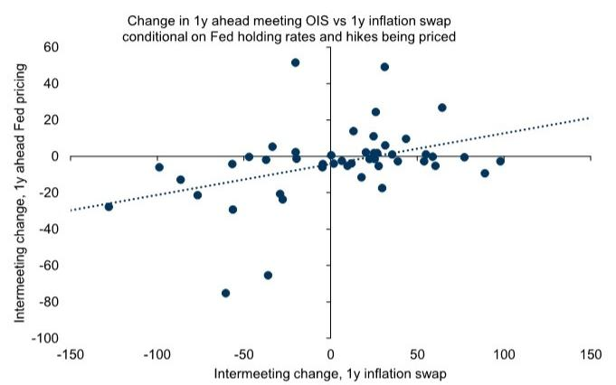  
Source: GS Global Investment Research, GS FICC and Equities  
Exhibit 2: Longer term inflation forwards have underperformed typical macro drivers

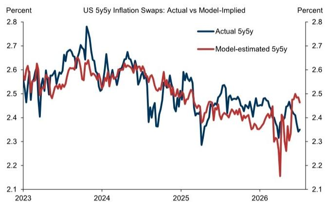  
Model includes 1m and 12m oil prices, 1y-ahead consensus inflation forecasts, 1y-ahead inflation forecast dispersion, long-run inflation forecasts, 1y-ahead growth forecasts, and a measure of 1y-ahead forecasted policy changes. Sample includes weekly data from 2010 to present.  
Source: Consensus Economics, Haver Analytics, Bloomberg, GS FICC and Equities, GS Global Investment Research

Inflation looks slightly cheap, but risk/reward not all that compelling. The swift decline in traded inflation since the US-Iran MOU and June FOMC has been led by the front end of the inflation curve, where traded inflation's typical relationship with oil prices can account for nearly the entirety of the move. That said, forward inflation pricing has declined more than the drop in oil prices would typically justify, leaving 5y5y inflation trading around $2.35\%$ —close to levels last seen during the initial post-conflict growth scare. We suspect this larger-than-implied decline reflects the market's perception of reduced risk of the Fed falling behind the curve following the June FOMC, while choppier price action in risk assets may be adding marginal pressure as well. Despite slightly cheap valuations in forwards, we do not think traded inflation is a compelling long right now. The market is still pricing higher inflation on a 1-to-2y ahead horizon than our economists forecast in 2027, and hawkish Fed assumptions may keep a cap on inflation pricing for a while yet. The case for longs, in our view, is as a hedge to the Fed revealing a more dovish reaction function or another exogenous shock to prices.

Subdued funding pressure, but a wider medium-term distribution. The end-Q2 turn saw limited repo pressure despite a net cash inflow to TGA amid month-end Treasury settlements; only a small fraction of SOFR transactions took place above the Fed's Standing Repo rate, corresponding to no usage for a second consecutive quarter-end, whereas RRP uptake was the highest since the year-end turn. As noted previously, we think collateral and funding supply/demand dynamics have played a role in the benign funding backdrop—reserves are down modestly this year as a share of bank assets, but we estimate the relative shifts in T-bill free float and repo volumes versus money fund assets have been worth 1-to-1.5bp of downward pressure on equilibrium SOFR and TGCR levels. We also find evidence that the sensitivity of funding costs to changes in liquidity has become less negative this year, and while equity funding spreads had been elevated into quarter-end, we think the discrepancy is again largely attributable to divergence in end user demand for leverage. The Fed will announce the next schedule for reserve management purchases (RMPs) closer to the middle of July, and we see scope for another reduction in the monthly pace of purchases from \$10bn recently to \$0-to-5bn. We estimate that a monthly RMP pace of \$5bn per month would see reserves declining to around 11% of bank assets by 1Q27 and be consistent with TGCR at or slightly below IORB in the steady state, and SOFR slightly above it. Early-27 SOFR-FF pricing is consistent with our baseline assumptions, but the potential intersection with reaching the debt limit and medium-term uncertainty around potential changes to the balance sheet approach present two-sided risks.

## Europe

European inflation relief extends, fuels carry. Incoming data increasingly points to benign inflation risk in the Euro area. Our economists have shaved their inflation forecasts following the June flash report and highlight downside risk to their projections should commodity prices stabilise at current levels (which are below our energy price forecasts). This should keep front-end pricing in a narrow channel around a September hike, with risks fairly balanced. On the one hand, an increasingly secure inflation relief should weigh on hike pricing, all else equal. On the other, ECB speakers have highlighted the possibility of a rising neutral rate for the Euro area, which may see terminal rate pricing remain sticky until a clearer data signal emerges. That said, we think the positive slope in pricing beyond September (10bp between September and March-27) is hard to justify in this environment and should decay over time. Beyond the front-end, we continue to see more room for rates volatility to fall than the level of yields, with sovereign credit (see below) and curve steepeners continuing to offer carry in a low volatility environment.

OAT widening excessive. Despite strong tailwinds for sovereign credit—including an improving growth outlook, lower policy uncertainty, and reduced energy-related fiscal risks following the US-Iran deal—OATs have widened against Bunds over recent weeks. This likely reflects a range of factors, including early positioning for potential tensions around the 2027 budget negotiations, as well as increased political uncertainty over next week’s verdict (due in the afternoon of 7 July) on the ability of Rassemblement National’s Marine Le Pen to run in the 2027 elections. Despite the inevitable focus on next year’s election and budget, consensus expectations for the French deficit were actually falling into June (in absolute terms and against peers — Exhibit 3). For this reason, we do not think the recent widening will endure, with the reduction in macro and rates vol likely to reanchor spreads, particularly at shorter maturities. Long-end spreads also offer value — 30y OATs are near their wides since the onset of the Iran war despite much lower rates volatility — but are likely to remain stickier given the more medium-term fiscal uncertainties (Exhibit 4).

Exhibit 3: French deficit expectations have on net moved in a more favourable direction Change in 12m ahead deficit expectations, 3 months rolling sum

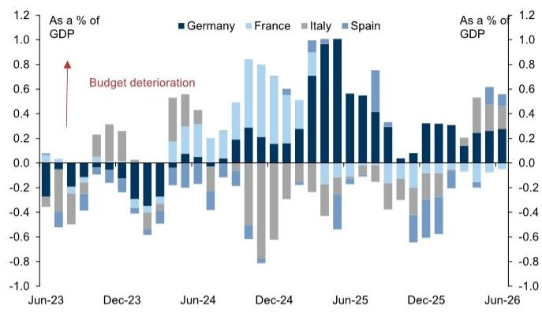  
Source: GS Global Investment Research, Consensus Economics  
Exhibit 4: Long-end OATs are close to their conflict wides against Bunds Using GS fitted yields

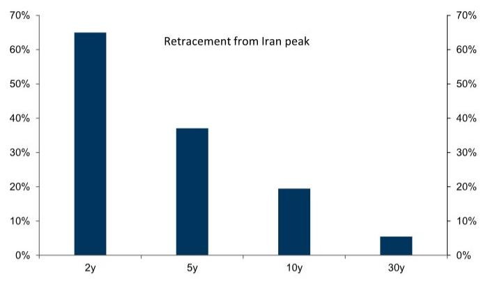  
Source: GS Global Investment Research, GS FICC and Equities

ECB Minimum Reserve Requirements back in focus. Reports this week suggested the ECB is considering an increase in minimum required reserves (MRR) from 1% to 2% of Euro area banks' short-term liabilities. With MRR currently standing at €172bn, a doubling of the MRR would imply a corresponding decrease in excess liquidity as banks relocate cash from the Deposit Facility to ECB current accounts. This would represent a roughly €4bn interest cost saving from the ECB's perspective, borne by banks, as required reserves are remunerated at 0% rather than the Deposit Facility Rate. We have previously argued that the implications for bank behaviour and money markets are likely to be limited given excess liquidity remains above €2tn. However, compared with the last time the ECB considered such a change at end-2023, excess liquidity is €1-1.5tn lower owing to the ongoing QT drain, and may be approaching the upper end of a plausible range for equilibrium reserve demand. A shift in MRR would see the ECB test that range in a less gradual way than with QT alone (Exhibit 5). Additionally, excess liquidity remains unevenly distributed across countries, with the bulk located in core countries (Exhibit 6), suggesting the potential for uneven consequences of an MRR hike. Finally, while we do not see this as a strong signal for rate policy, a higher MRR would mitigate the interest cost from higher policy rates for the ECB, which may improve the sustainability of higher rates from a political (rather than economic) perspective.

Exhibit 5: A change in MRR would pull forward the point in time at which liquidity is more binding
Stylised equilibrium reserve range depending on banks preferred level and composition of HQLA  
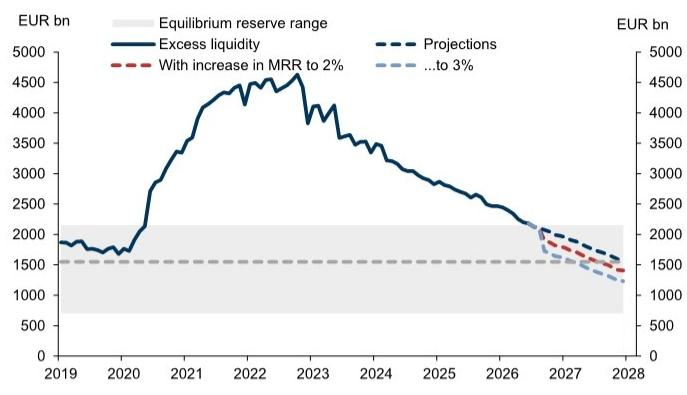  
Source: GS Global Investment Research, ECB, Haver Analytics

Exhibit 6: Excess liquidity is heavily concentrated in core countries

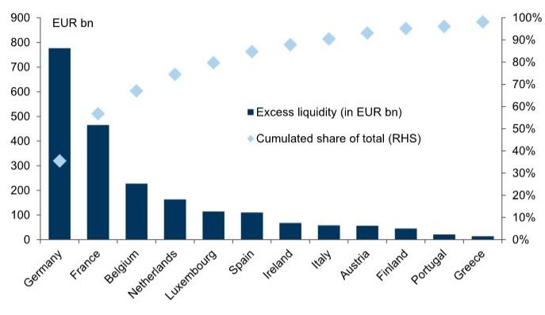  
Source: GS Global Investment Research, ECB, Haver Analytics

UK 2s10s curve to keep steepening. We think the steepening of the UK curve is likely to continue. Governor Bailey's remarks in Sintra revealed the BoE is still focused on labour-market softening and weak growth, which, together with oil relief, should keep front-end yields trending lower as residual inflationary risks subside. The ongoing focus from Bailey on the pre-war cut pricing suggests the possibility of an eventual return to easing, potentially in 2027, that should continue to see the front-end outperform. At the same time, the curve steepened with longer-dated UK yields rising. We think this is consistent with limited further room for risk premium compression until the market has a clearer view on upcoming policy changes under a potential Burnham government, especially as the tension between spending ambitions, tight headroom and limited tax options remains unresolved. Next week's Financial Stability Report (7 July) could provide a modest tailwind to Gilts on asset swaps via tweaks to the leverage ratio. As a result, we continue to prefer GBP steepeners, with front-end macro relief doing the work to pull yields lower while ongoing fiscal uncertainties limit the scope for further UK term-premium compression.

## Japan

JGB term premium pressure builds. The JGB curve continues to steepen, with the 2s10s curve stuck at steep levels relative to the cyclical and spot fiscal backdrop (a residual we find remains even after introducing additional controls for the QE and YCC era). Part of the long-end cheapening also reflects a broader term premium normalization across much of the G10. This global normalization is part of the explanation for the more positive correlation between rising JGB term premium and risk-neutral rates. However, we think domestic fiscal and behind the curve risks are a clear contributing factor, remaining a key source of upward pressure on yields and weakness in the Yen (Exhibit 7). Absent a shift in the Takaichi administration's fiscal stance—around which this month's release of the administration's Basic Policy is potentially pivotal for near-term JGB volatility—we think risks skew towards 10s and 30s cheapening further, with mounting pressure on the belly over time. Potential JPY intervention is also likely to weigh on JGBs, as suppressing FX volatility through this channel (rather than via more proactive rate policy) leaves longer term rates the main domestic pressure-release valve. Together, we think ongoing fiscal risk and intervention-based FX management can continue to lift term premia and sustain JGB curve steepening.

Exhibit 7: Yen weakening is no longer corresponding to front-end JPY rates underperforming the typical beta to the US

USDJPY vs 2y JPY OIS (versus beta-implied by 2y USD OIS; higher = JPY cheaper)

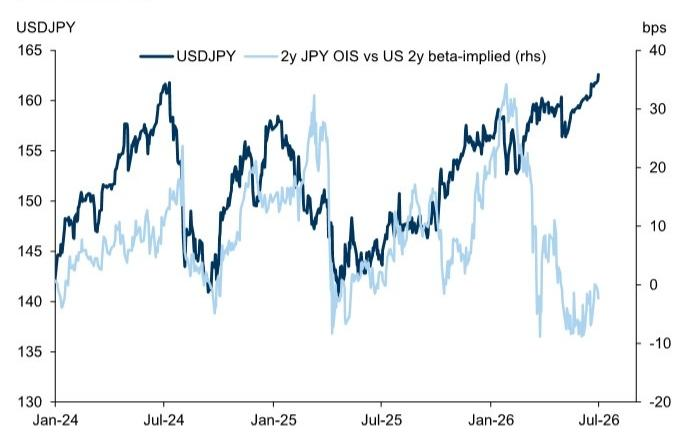  
Source: GS Global Investment Research, GS FICC and Equities  
Exhibit 8: 2s10s has room to steepen on relaxation of hike premium  
2s10s, 1y1y NZD OIS

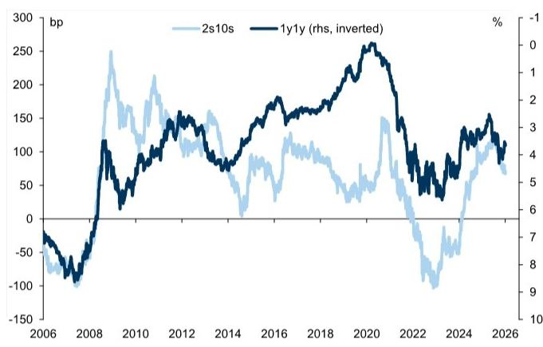  
Source: GS Global Investment Research, GS FICC and Equities

## Australia and New Zealand

Room for premium to migrate out the NZD curve. Our economists expect RBNZ to deliver the first of two hikes at its meeting next week following the hawkish guidance by Governor Breman and early evidence of second-round effects from the oil price shock against market pricing of 20bp. Beyond those two adjustments, we see little risk of further tightening and instead see room for front-end pricing (which has already declined by about 65bp since the peak) to compress further, as year-end 2027 inflation is projected at $1.5\%$ and the output gap of $-0.9\%$ should curtail right-tail risks. However, longer-term forwards currently stand rich to fundamentals (incorporating among the lowest term premium in the G10), suggesting scope for the NZD curve to steepen from here (Exhibit 8); we recommend 2s10s NZD steepeners (Entry: 72bp, Target: 90bp, Stop: 62bp). Across the Tasman, the signal from the RBA minutes was slightly less hawkish than Governor Bullock sounded at the press conference, however our economists still expect an uncomfortably high 2Q26 CPI print to lead to a final August RBA hike. With 7bp priced through September we still see value to paying the front meetings as a hedge to longs further out where, given ongoing activity easing (which was characterized in the minutes as in line with expectations due to the tightening so far), we continue to see room for forwards to rally (stay received 2y1y OIS vs August RBA).

## Latest Thematic Research:

Global Markets Analyst: Updating Our G10 Term Premium Estimates — Still High — 19 June 2026

Euro Area Sovereign Credit Monitor: EU Bonds — Still Deepening — 12 June 2026

Global Markets Analyst: Revisiting the Outlook for the Fed's Balance Sheet — 21 May 2026

Global Rates Notes: US Treasury Valuations and Requirements for a Yield Reversal — 20 May 2026

Global Markets Analyst: UK T-bills: Not A Magic Bullet For Gilts — 11 May 2026

## Latest Global Markets Dailies:

Solvency II Review to Reinforce Benign Sovereign Credit Risk Backdrop — 23 June 2026

G10 Rates Views—Lower Vol, Not Yields — 22 June 2026

Fed Communication And Rates Volatility — 10 June 2026

The Hedge Value Of Rate Receivers — 28 May 2026

The Energy Shock Impact on Foreign Official Treasury Demand — 27 May 2026

The authors would like to thank Dario Scordamaglia for his contribution to this report. Dario is an intern on the Markets team.

## Forecasts

G10 10y yield forecast

<table><tr><td colspan="14">G10 10-Year Yield Forecasts</td></tr><tr><td></td><td>USD</td><td>DEM</td><td>FRA</td><td>ITA</td><td>ESP</td><td>GBP</td><td>JPY</td><td>CAD</td><td>CHF</td><td>SEK</td><td>NOK</td><td>AUD</td><td>NZD</td></tr><tr><td>Spot</td><td>4.48</td><td>2.92</td><td>3.72</td><td>3.70</td><td>3.41</td><td>4.79</td><td>2.79</td><td>3.45</td><td>0.33</td><td>2.75</td><td>4.31</td><td>4.80</td><td>4.44</td></tr><tr><td>3Q26</td><td>4.45</td><td>2.95</td><td>3.60</td><td>3.65</td><td>3.35</td><td>4.60</td><td>2.50</td><td>3.50</td><td>0.40</td><td>3.20</td><td>4.00</td><td>4.75</td><td>4.50</td></tr><tr><td>4Q26</td><td>4.40</td><td>3.00</td><td>3.70</td><td>3.75</td><td>3.45</td><td>4.50</td><td>2.50</td><td>3.50</td><td>0.50</td><td>3.25</td><td>4.00</td><td>4.70</td><td>4.50</td></tr><tr><td>1Q27</td><td>4.35</td><td>3.00</td><td>3.75</td><td>3.80</td><td>3.50</td><td>4.50</td><td>2.45</td><td>3.50</td><td>0.50</td><td>3.25</td><td>4.00</td><td>4.60</td><td>4.50</td></tr><tr><td>2Q27</td><td>4.30</td><td>3.00</td><td>3.75</td><td>3.85</td><td>3.55</td><td>4.40</td><td>2.40</td><td>3.50</td><td>0.50</td><td>3.25</td><td>4.00</td><td>4.50</td><td>4.50</td></tr><tr><td>3Q27</td><td>4.25</td><td>3.00</td><td>3.75</td><td>3.90</td><td>3.60</td><td>4.40</td><td>2.30</td><td>3.50</td><td>0.50</td><td>3.25</td><td>4.00</td><td>4.50</td><td>4.50</td></tr><tr><td>4Q27</td><td>4.25</td><td>3.00</td><td>3.75</td><td>3.90</td><td>3.60</td><td>4.35</td><td>2.25</td><td>3.50</td><td>0.50</td><td>3.25</td><td>4.00</td><td>4.50</td><td>4.50</td></tr><tr><td>1Q28</td><td>4.25</td><td>3.00</td><td>3.75</td><td>3.90</td><td>3.60</td><td>4.30</td><td>2.20</td><td>3.50</td><td>0.50</td><td>3.25</td><td>4.00</td><td>4.50</td><td>4.50</td></tr></table>

<table><tr><td colspan="14">Deviation from Forwards</td></tr><tr><td></td><td>USD</td><td>DEM</td><td>FRA</td><td>ITA</td><td>ESP</td><td>GBP</td><td>JPY</td><td>CAD</td><td>CHF</td><td>SEK</td><td>NOK</td><td>AUD</td><td>NZD</td></tr><tr><td>3Q26</td><td>-0.10</td><td>-0.05</td><td>-0.31</td><td>-0.36</td><td>0.00</td><td>0.05</td><td>0.45</td><td>-0.29</td><td>-0.08</td><td>-0.02</td><td>-0.12</td><td>-0.14</td><td>-0.08</td></tr><tr><td>4Q26</td><td>-0.19</td><td>-0.04</td><td>-0.46</td><td>-0.44</td><td>-0.04</td><td>0.12</td><td>0.47</td><td>-0.28</td><td>-0.16</td><td>-0.09</td><td>-0.08</td><td>-0.10</td><td>-0.04</td></tr><tr><td>1Q27</td><td>-0.28</td><td>-0.07</td><td>-0.51</td><td>-0.57</td><td>-0.08</td><td>0.10</td><td>0.44</td><td>-0.27</td><td>-0.28</td><td>-0.16</td><td>-0.09</td><td>-0.11</td><td>-0.04</td></tr><tr><td>2Q27</td><td>-0.37</td><td>-0.11</td><td>-0.65</td><td>-0.70</td><td>-0.11</td><td>0.09</td><td>0.41</td><td>-0.26</td><td>-0.41</td><td>-0.22</td><td>-0.10</td><td>-0.17</td><td>-0.05</td></tr></table>

Source: GS Global Investment Research

## G4 Curve Forecast

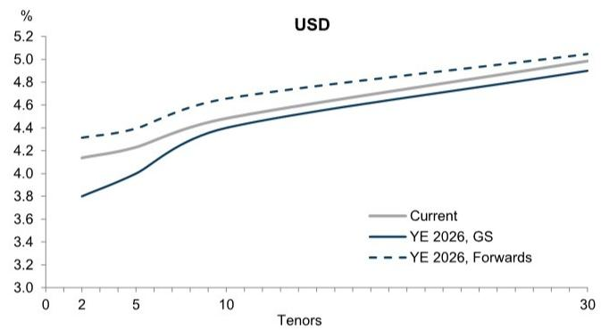

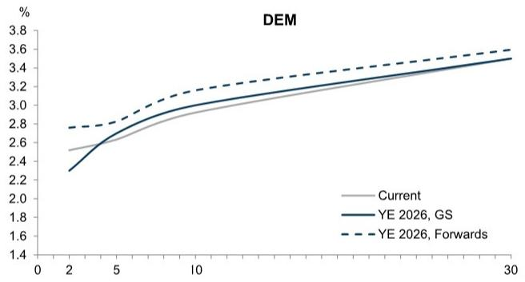

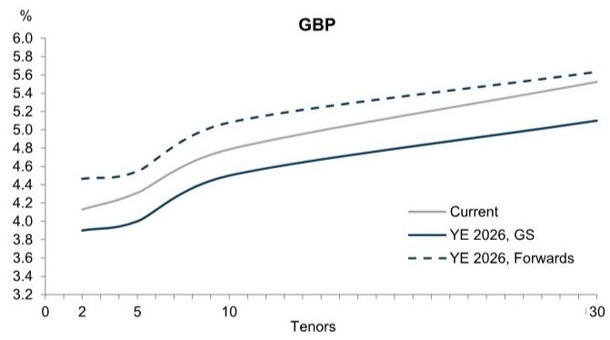  
Source: Bloomberg, GS Global Investment Research

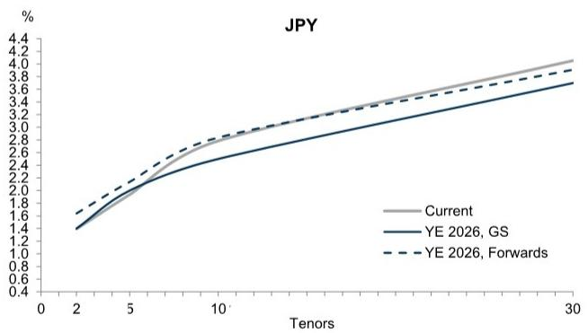

## Central Bank Dashboard

Cumulative amount of hikes/cuts priced from today  
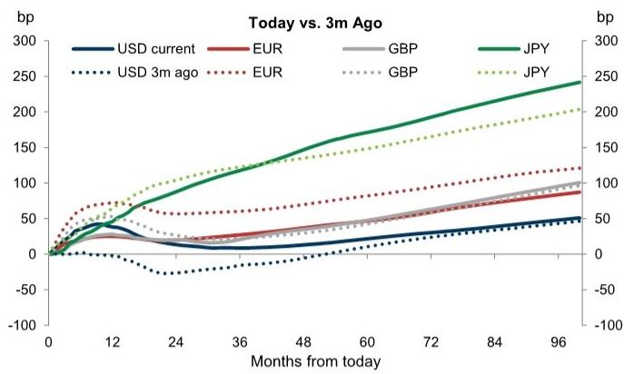  
Source: GS Global Investment Research

Expected hikes by year, GS vs. Market  
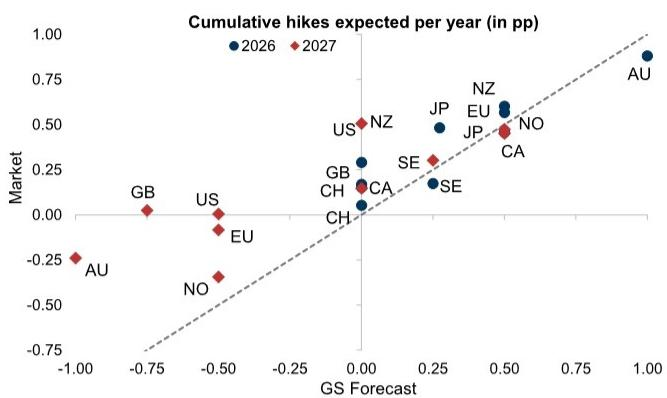  
Source: GS Global Investment Research

Central bank ownership of sovereign bonds, current vs. 1y ago  
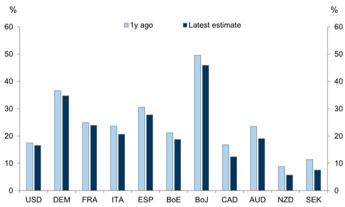  
Source: Haver Analytics

Central bank assets as a share of GDP  
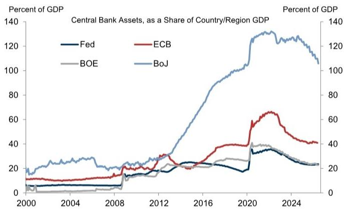  
Source: Haver Analytics

## Positioning and Flows Monitor

Option implied position indicator  
  
Source: GS Global Investment Research

GS Fund Positioning Indicator  
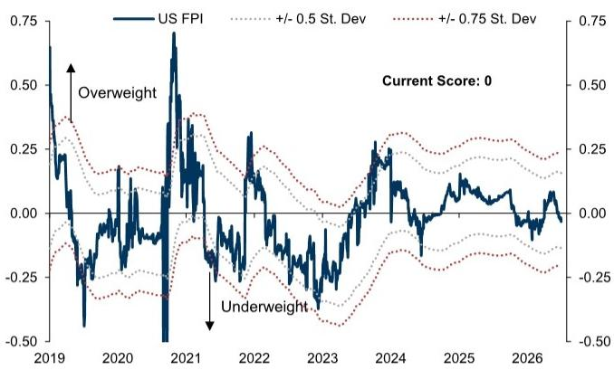  
Source: GS Global Investment Research

US Data Response Indicator (DRI)  
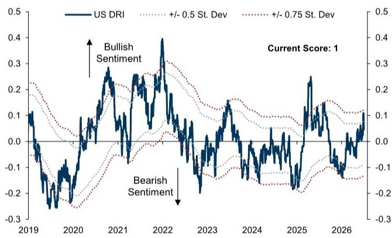

## CFTC Commitment of Traders and Traders in Financial Futures

Duration-weighted net position by investor type

Duration-Weighted Positioning, by Contract

<table><tr><td>$mm/bp</td><td>SFR</td><td>TU</td><td>FV</td><td>TY</td><td>TN</td><td>US</td><td>WN</td></tr><tr><td>Spec Current</td><td>-81.6</td><td>-45.3</td><td>-53.4</td><td>-49.9</td><td>-10.5</td><td>-22.0</td><td>-55.5</td></tr><tr><td>Spec 1w Change</td><td>2.9</td><td>-1.3</td><td>2.0</td><td>6.1</td><td>-0.5</td><td>-2.9</td><td>1.5</td></tr><tr><td>LF Current</td><td>-74.1</td><td>-61.3</td><td>-88.3</td><td>-118.7</td><td>-21.2</td><td>-44.8</td><td>-162.0</td></tr><tr><td>LF 1w Change</td><td>-9.3</td><td>-2.4</td><td>2.6</td><td>7.6</td><td>-1.0</td><td>-4.9</td><td>4.5</td></tr><tr><td>AM + Other Current</td><td>-6.6</td><td>75.2</td><td>118.3</td><td>149.1</td><td>54.8</td><td>77.3</td><td>203.5</td></tr><tr><td>AM + Other 1w Change</td><td>3.8</td><td>6.0</td><td>0.6</td><td>-5.3</td><td>-0.8</td><td>4.8</td><td>-4.8</td></tr><tr><td>Dealer Current</td><td>80.7</td><td>-16.4</td><td>-32.2</td><td>-30.8</td><td>-24.1</td><td>-45.2</td><td>-45.4</td></tr><tr><td>Dealer 1w Change</td><td>5.5</td><td>-3.6</td><td>-3.0</td><td>-1.6</td><td>0.4</td><td>1.6</td><td>-2.4</td></tr></table>

Net positions in Eurodollars  
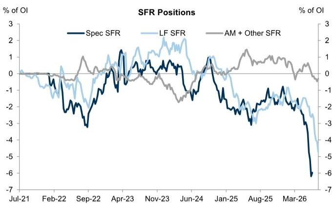  
Note: Duration-weighted net position (long - short) as a % of duration-weighted gross exposure (long + short + spreading)  
Source: CFTC, GS Global Investment Research

Net positions in UST futures  
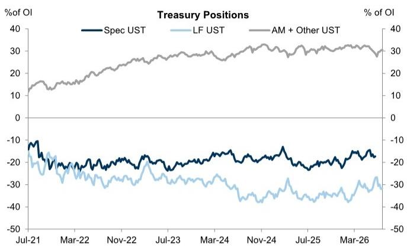  
Note: Duration-weighted net position (long - short) as a % of duration-weighted gross exposure (long + short + spreading)  
Source: CFTC, GS Global Investment Research

Primary dealer transactions Net dealer position in US Treasuries  
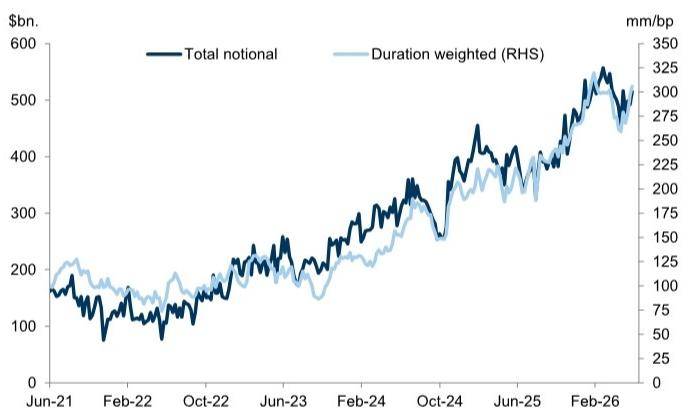  
Source: Federal Reserve Bank of New York, GS Global Investment Research

US Commercial Banks' Holdings of Treasury and Agency Securities  
Total domestic and foreign holdings, all commercial banks  
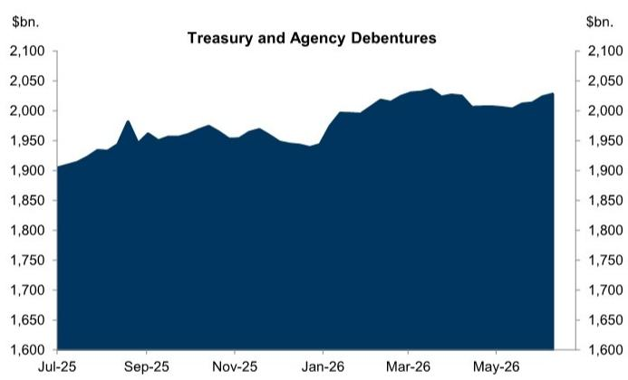  
Source: Federal Reserve Board

NY Fed Custody Holdings Marketable US Treasuries  
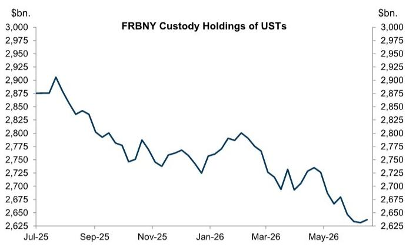  
Source: Federal Reserve Bank of New York

## US TIC Treasury Flows

12m change in valuation-adjusted holdings of USTs, by holder of debt

  
Source: US Treasury, GS Global Investment Research

Net monthly purchases of short- and long-term US Treasuries by Japanese investors  
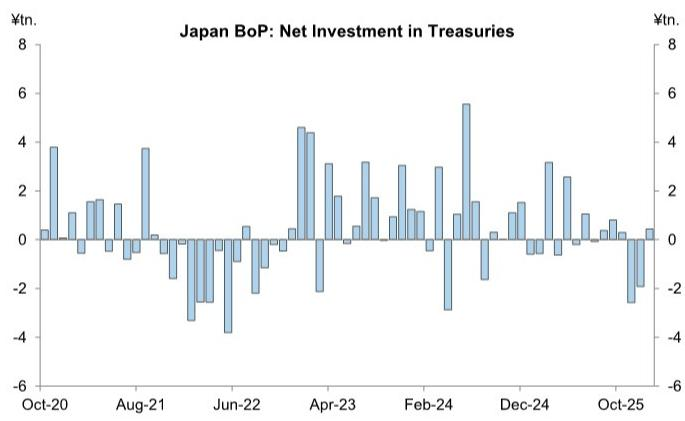  
Source: Bank of Japan, Haver Analytics

Flow of Funds annual net purchases of US Treasuries, by sector  
  
Source: Federal Reserve Board, GS Global Investment Research

## Carry/Rolldown Monitor

## Outright Carry

Bar chart shows top two carry points by currency, with solid reflecting carry to a long position and striped carry to a short position. Scatter illustrates top 25 carry/vol points by currency, with top point by currency noted

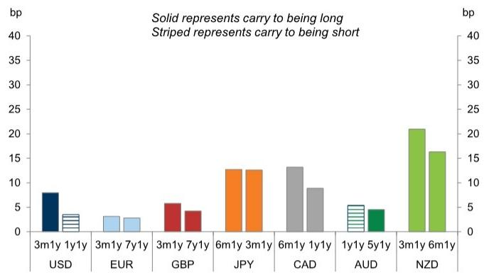  
Source: GS Global Investment Research

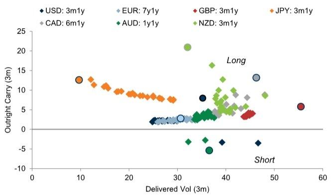

## Curve Carry

Bar chart shows top two carry curves by currency, with solid reflecting carry to a steepening position and striped carry to a flattening position. Scatter illustrates top 5 carry/vol curves by currency, with top curve by currency noted

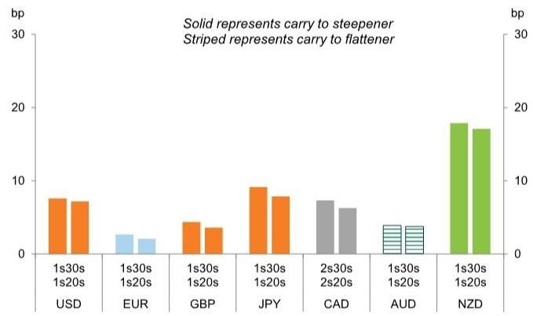

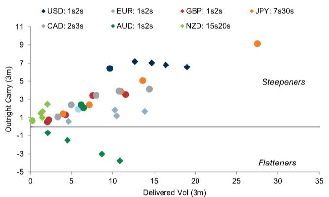  
Source: GS Global Investment Research

## Fly Carry

Bar chart shows top two carry flies by currency, with solid reflecting carry to a belly-richening fly and striped carry to a belly-cheapening fly. Scatter illustrates top 5 carry/vol flies by currency, with top fly by currency noted.

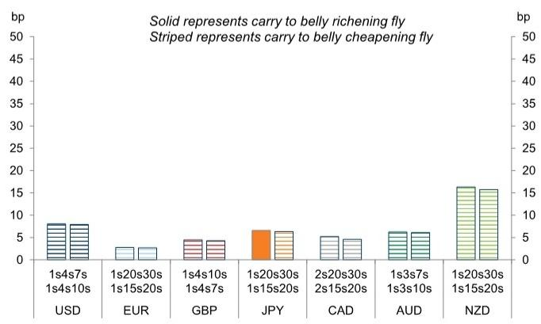  
Source: GS Global Investment Research

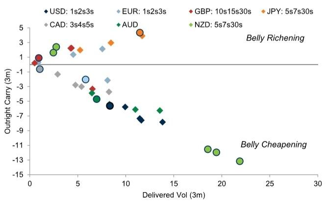

## Treasury Supply Monitor

Gross Treasury auction size estimates by year end, with GS projections

<table><tr><td colspan="12">Monthly Auction Amounts at End of Calendar Year ($ billions)</td></tr><tr><td></td><td>2y FRNs</td><td>2y</td><td>3y</td><td>5y</td><td>7y</td><td>10y</td><td>20y</td><td>30y</td><td>5y TIPS</td><td>10y TIPS</td><td>30y TIPS</td></tr><tr><td>YE-25 (CY)</td><td>30 / 28 (r)</td><td>69</td><td>58</td><td>70</td><td>44</td><td>42 / 39 (r)</td><td>16 / 13 (r)</td><td>25 / 22 (r)</td><td>26 / 24 (r)</td><td>21 / 19 (r)</td><td>9 / 8 (r)</td></tr><tr><td>YE-26 (CY, GS)</td><td>30 / 28 (r)</td><td>69</td><td>58</td><td>70</td><td>44</td><td>42 / 39 (r)</td><td>16 / 13 (r)</td><td>25 / 22 (r)</td><td>26 / 24 (r)</td><td>21 / 19 (r)</td><td>9 / 8 (r)</td></tr><tr><td>YE-27 (CY, GS)</td><td>33 / 30 (r)</td><td>83</td><td>72</td><td>84</td><td>58</td><td>42 / 39 (r)</td><td>16 / 13 (r)</td><td>25 / 22 (r)</td><td>28 / 26 (r)</td><td>21 / 19 (r)</td><td>9 / 8 (r)</td></tr></table>

\* Original Issue / Reopening listed for FRNs, 10s, 20s, 30s, and TIPS.

<table><tr><td colspan="7">US Treasury Net Issuance by Calendar Year ($ billions)</td></tr><tr><td></td><td>Net Coupons</td><td>Fed</td><td>Net of Fed</td><td>Net Bills</td><td>Fed</td><td>Net of Fed</td></tr><tr><td>CY 2024</td><td>1346</td><td>-475</td><td>1821</td><td>511</td><td>-23</td><td>534</td></tr><tr><td>CY 2025</td><td>1566</td><td>-115</td><td>1681</td><td>360</td><td>38</td><td>322</td></tr><tr><td>CY 2026, GS</td><td>1254</td><td>-2</td><td>1256</td><td>767</td><td>413</td><td>354</td></tr><tr><td>CY 2027, GS</td><td>1288</td><td>0</td><td>1288</td><td>926</td><td>449</td><td>477</td></tr></table>

Source: GS Global Investment Research, US Department of the Treasury

<table><tr><td colspan="3">Duration supply ($bn 10y equiv)</td></tr><tr><td>Gross supply</td><td>Fed</td><td>Net of Fed</td></tr><tr><td>2765</td><td>0</td><td>2765</td></tr><tr><td>2797</td><td>0</td><td>2797</td></tr><tr><td>2796</td><td>0</td><td>2796</td></tr><tr><td>2929</td><td>0</td><td>2929</td></tr></table>

## Net issuance per quarter

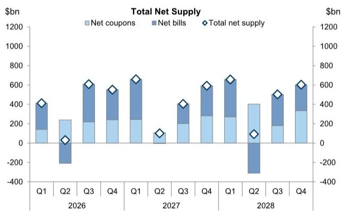  
Source: GS Global Investment Research, US Department of the Treasury

Average monthly UST issuance, gross and net of Fed purchases; \$bn 10y equivalents  
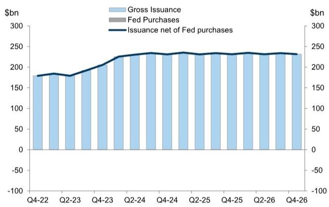  
Source: GS Global Investment Research, US Department of the Treasury

Free float (Treasuries outstanding less Fed and foreign official holdings) as % of GDP  
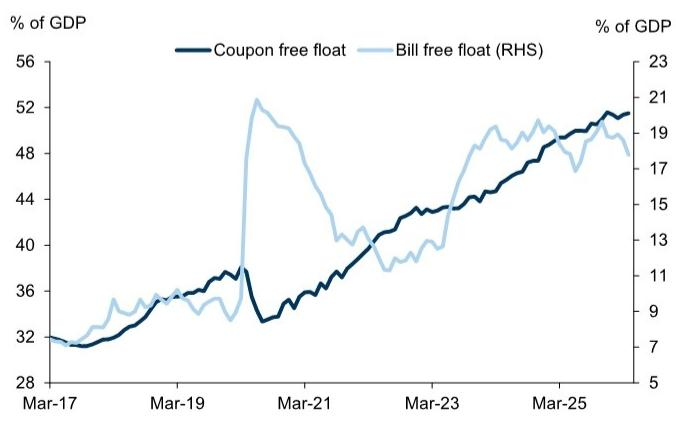  
Source: Haver Analytics, US Treasury, GS Global Investment Research

Bills as a share of Treasuries outstanding and GS forecast Gray shading denotes TBAC recommended 15-20% range  
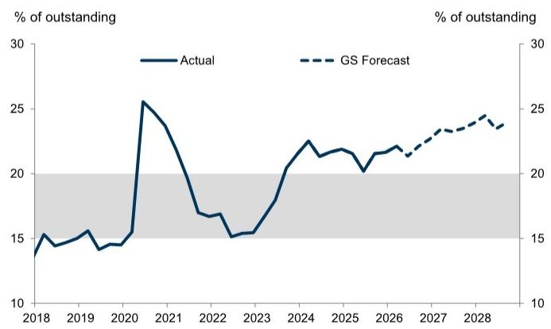  
Source: US Treasury, GS Global Investment Research

## GS Term Premium Decomposition

1y Range of G10 10y Yields, by Term Premium and Expectations Components  
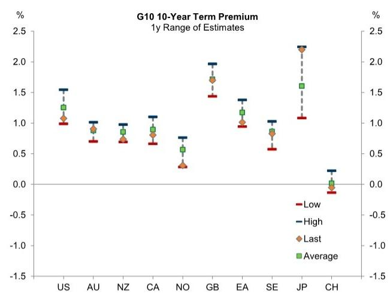

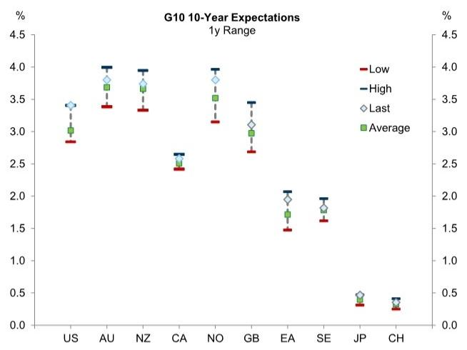

Term Structure of Fitted Yields, by Component  
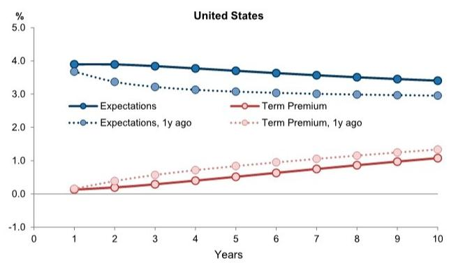

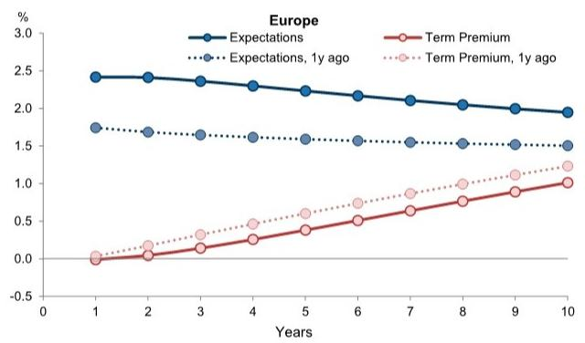

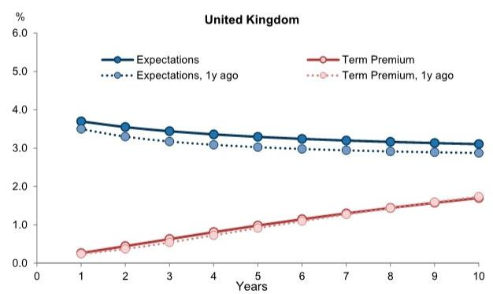  
Source: GS Global Investment Research

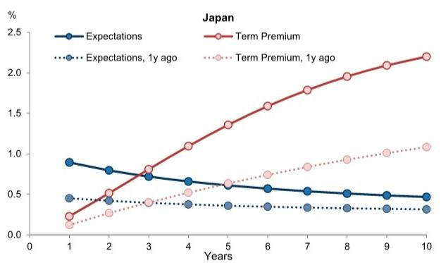

2026 Trade Recommendations

<table><tr><td colspan="7">GS Rates Trades</td></tr><tr><td>Active</td><td>Entry Date</td><td>Opened</td><td>Latest</td><td>Stop</td><td>Target</td><td>Performance</td></tr><tr><td>1. Long 3y France, Spain, Italy vs OIS (equally weighted)</td><td>10-Apr-26</td><td>0.33</td><td>0.29</td><td>0.32</td><td>0.23</td><td>+4 bps</td></tr><tr><td>2. Long 3y SOFR swap spread</td><td>17-Apr-26</td><td>-0.226</td><td>-0.210</td><td>-0.230</td><td>-0.180</td><td>+2 bps</td></tr><tr><td>3. 2s5s CAD steepeners</td><td>24-Apr-26</td><td>0.20</td><td>0.26</td><td>0.20</td><td>0.35</td><td>+6 bps</td></tr><tr><td>4. Long 5y Receivers on 3m 2s5s10s Receiver Fly (bp running)</td><td>08-May-26</td><td>0.01</td><td>-0.01</td><td>-0.05</td><td>0.10</td><td>-2 bps</td></tr><tr><td>5. 1y forward 2s10s GBP OIS steepeners</td><td>29-May-26</td><td>0.38</td><td>0.44</td><td>0.25</td><td>0.55</td><td>+6 bps</td></tr><tr><td>6. Long 2y1y OIS vs pay August RBA</td><td>26-Jun-26</td><td>-0.18</td><td>-0.16</td><td>-0.10</td><td>-0.35</td><td>-2 bps</td></tr><tr><td>7. 2s10s NZD steepeners</td><td>03-Jul-26</td><td>0.72</td><td></td><td>0.62</td><td>0.90</td><td></td></tr><tr><td>Closed</td><td>Entry Date</td><td>Closed</td><td>Performance</td><td></td><td></td><td></td></tr><tr><td>1. SFRZ6/Z7 steepeners</td><td>21-Nov-25</td><td>14-Jan-26</td><td>+6bps</td><td></td><td></td><td></td></tr><tr><td>2. Long 10y Gilts on ASW</td><td>21-Nov-25</td><td>30-Jan-26</td><td>+12 bps</td><td></td><td></td><td></td></tr><tr><td>3. Long USD 3m2y A-25 receiver vs short 3m10y A-25 receiver (return in bp running)</td><td>07-Nov-25</td><td>09-Feb-26</td><td>-2 bps</td><td></td><td></td><td></td></tr><tr><td>4. 2s5s CORRA steepener</td><td>16-Jan-26</td><td>13-Feb-26</td><td>+0 bps</td><td></td><td></td><td></td></tr><tr><td>5. Receive AUD 5y5y IRS vs pay NZD 5y5y</td><td>28-Nov-25</td><td>18-Feb-26</td><td>+0 bps</td><td></td><td></td><td></td></tr><tr><td>6. Long 20s on 10s20s30s weighted SOFR fly (weights 0.6x : 2x : 1.4x)</td><td>01-Aug-25</td><td>02-Mar-26</td><td>+6 bps</td><td></td><td></td><td></td></tr><tr><td>7. Long SFIU6</td><td>30-Jan-26</td><td>03-Mar-26</td><td>+7 bps</td><td></td><td></td><td></td></tr><tr><td>8. Long 10y Gilts vs Bunds</td><td>07-Nov-25</td><td>09-Mar-26</td><td>+4 bps</td><td></td><td></td><td></td></tr><tr><td>9. 3m10y A+5/A+20/A+27.5 payer ladders (bp running)</td><td>20-Feb-26</td><td>23-Mar-26</td><td>-5 bps</td><td></td><td></td><td></td></tr><tr><td>10. Long 10y NOK vs SEK</td><td>13-Feb-26</td><td>25-Mar-26</td><td>+20 bps</td><td></td><td></td><td></td></tr><tr><td>11. Long EU 30y on the fly against 30y Austria and Spain</td><td>27-Feb-26</td><td>10-Apr-26</td><td>-5 bps</td><td></td><td></td><td></td></tr><tr><td>12. Long USD 3m 2s10s A+10/A+25 curve cap spread (bp of notional)</td><td>23-Jan-26</td><td>15-Apr-26</td><td>-2 bps</td><td></td><td></td><td></td></tr><tr><td>13. USD 3m3y A-5/A-40 receiver spreads</td><td>13-Mar-26</td><td>30-Apr-26</td><td>-7 bps</td><td></td><td></td><td></td></tr><tr><td>14. Long 10y Inflation Swap vs 0.25x Receive 10y SOFR</td><td>27-Mar-26</td><td>07-May-26</td><td>+15 bps</td><td></td><td></td><td></td></tr><tr><td>15. Pay 10s on 5s10s30s SOFR fly</td><td>09-Jan-26</td><td>08-May-26</td><td>-1 bps</td><td></td><td></td><td></td></tr><tr><td>16. Long 10y Inflation Swap vs 0.25x Receive 10y SOFR</td><td>12-Jun-26</td><td>18-Jun-26</td><td>-1 bps</td><td></td><td></td><td></td></tr><tr><td>17. Long 5y5y EUR OIS - HICP</td><td>01-May-26</td><td>19-Jun-26</td><td>+11 bps</td><td></td><td></td><td></td></tr></table>

## Source: GS Global Investment Research

## Global Interest Rates Strategy

George Cole  
+44(20)7552-1214  
george.cole@gs.com  
GS International

## Isabella Rosenberg

+1(212)357-7628

isabella.rosenberg@gs.com

GS & Co. LLC

## William Marshall

+1(212)357-0413
william.c.marshall@gs.com
GS & Co. LLC

## Friedrich Schaper

+1(917)343-3214

friedrich.schaper@gs.com

GS & Co. LLC

## Simon Freycenet

+44(20)7774-5017
simon.freycenet@gs.com
GS Bank Europe SE - Paris Branch

## Loic Mathys

+44(20)7051-1664
loic.mathys@gs.com
GS International

## Disclosure Appendix

## Reg AC

We, George Cole, William Marshall, Simon Freycenet, Isabella Rosenberg, Friedrich Schaper and Loic Mathys, hereby certify that all of the views expressed in this report accurately reflect our personal views, which have not been influenced by considerations of the firm's business or client relationships.

Unless otherwise stated, the individuals listed on the cover page of this report are analysts in GS' Global Investment Research division.

Contributing Authors: George Cole GS International, William Marshall GS & Co. LLC, Simon Freycenet GS Bank Europe SE - Paris Branch, Isabella Rosenberg GS & Co. LLC, Friedrich Schaper GS & Co. LLC, Loic Mathys GS International.

Unless otherwise stated, the individuals listed in the Contributing Authors disclosure of this report are analysts in GS' Global Investment Research division.

## Disclosures

## Regulatory disclosures

## Disclosures required by United States laws and regulations

See company-specific regulatory disclosures above for any of the following disclosures required as to companies referred to in this report: manager or co-manager in a pending transaction; 1% or other ownership; compensation for certain services; types of client relationships; managed/co-managed public offerings in prior periods; directorships; for equity securities, market making and/or specialist role. GS trades or may trade as a principal in debt securities (or in related derivatives) of issuers discussed in this report.

The following are additional required disclosures: Ownership and material conflicts of interest: GS policy prohibits its analysts, professionals reporting to analysts and members of their households from owning securities of any company in the analyst's area of coverage. Analyst compensation: Analysts are paid in part based on the profitability of GS, which includes investment banking revenues. Analyst as officer or director: GS policy generally prohibits its analysts, persons reporting to analysts or members of their households from serving as an officer, director or advisor of any company in the analyst's area of coverage. Non-U.S. Analysts: Non-U.S. analysts may not be associated persons of GS & Co. LLC and therefore may not be subject to FINRA Rule 2241 or FINRA Rule 2242 restrictions on communications with a subject company, public appearances and trading in securities covered by the analysts.

## Additional disclosures required under the laws and regulations of jurisdictions other than the United States

Additional disclosures required under the laws and regulations of jurisdictions other than the United States

The following disclosures are those required by the jurisdiction indicated, except to the extent already made above pursuant to United States laws and regulations. Australia: GS Australia Pty Ltd and its affiliates are not authorised deposit-taking institutions (as that term is defined in the Banking Act 1959 (Cth)) in Australia and do not provide banking services, nor carry on a banking business, in Australia. This research, and any access to it, is intended only for “wholesale clients” within the meaning of the Australian Corporations Act, unless otherwise agreed by GS. In producing research reports, members of Global Investment Research of GS Australia may attend site visits and other meetings hosted by the companies and other entities which are the subject of its research reports. In some instances the costs of such site visits or meetings may be met in part or in whole by the issuers concerned if GS Australia considers it is appropriate and reasonable in the specific circumstances relating to the site visit or meeting. To the extent that the contents of this document contains any financial product advice, it is general advice only and has been prepared by GS without taking into account a client’s objectives, financial situation or needs. A client should, before acting on any such advice, consider the appropriateness of the advice having regard to the client’s own objectives, financial situation and needs. A copy of certain GS Australia and New Zealand disclosure of interests and a copy of GS’ Australian Sell-Side Research Independence Policy Statement are available at: https://www.goldmansachs.com/disclosures/australia-new-zealand/index.html. Brazil: Disclosure information in relation to CVM Resolution n. 20 is available at https://www.gs.com/worldwide/brazil/area/gir/index.html. Where applicable, the Brazil-registered analyst primarily responsible for the content of this research report, as defined in Article 20 of CVM Resolution n. 20, is the first author named at the beginning of this report, unless indicated otherwise at the end of the text. Canada: This information is being provided to you for information purposes only and is not, and under no circumstances should be construed as, an advertisement, offering or solicitation by GS & Co. LLC for purchasers of securities in Canada to trade in any Canadian security. GS & Co. LLC is not registered as a dealer in any jurisdiction in Canada under applicable Canadian securities laws and generally is not permitted to trade in Canadian securities and may be prohibited from selling certain securities and products in certain jurisdictions in Canada. If you wish to trade in any Canadian securities or other products in Canada please contact GS Canada Inc., an affiliate of The GS Group Inc., or another registered Canadian dealer. Hong Kong: Further information on the securities of covered companies referred to in this research may be obtained on request from GS (Asia) L.L.C. India: Further information on the subject company or companies referred to in this research may be obtained from GS (India) Securities Private Limited, Research Analyst – SEBI Registration Number INH000001493, 10th Floor, Ascent-Worli, Sudam Kalu Ahire Marg, Worli, Mumbai-400 025, India, Corporate Identity Number U74140MH2006FTC160634, Phone +91 22 6616 9000, Fax +91 22 6616 9001. GS may beneficially own 1% or more of the securities (as such term is defined in clause 2 (h) the Indian Securities Contracts (Regulation) Act, 1956) of the subject company or companies referred to in this research report. Registration granted by SEBI and certification from NISM in no way guarantee performance of the intermediary or provide any assurance of returns to investors. GS (India) Securities Private Limited compliance officer and investor grievance contact details, a copy of the annual compliance audit report and other relevant information and disclosures can be found at this link:

https://www.goldmansachs.com/worldwide/india/research-analyst. Japan: See below. Korea: This research, and any access to it, is intended only for “professional investors” within the meaning of the Financial Services and Capital Markets Act, unless otherwise agreed by GS. Further information on the subject company or companies referred to in this research may be obtained from GS (Asia) L.L.C., Seoul Branch. New Zealand: GS New Zealand Limited and its affiliates are neither “registered banks” nor “deposit takers” (as defined in the Reserve Bank of New Zealand Act 1989) in New Zealand. This research, and any access to it, is intended for “wholesale clients” (as defined in the Financial Advisers Act 2008) unless otherwise agreed by GS. A copy of certain GS Australia and New Zealand disclosure of interests is available at: https://www.goldmansachs.com/disclosures/australia-new-zealand/index.html. Russia: Research reports distributed in the Russian Federation are not advertising as defined in the Russian legislation, but are information and analysis not having product promotion as their main purpose and do not provide appraisal within the meaning of the Russian legislation on appraisal activity. Research reports do not constitute a personalized investment recommendation as defined in Russian laws and regulations, are not addressed to a specific client, and are prepared without analyzing the financial circumstances, investment profiles or risk profiles of clients. GS assumes no responsibility for any investment decisions that may be taken by a client or any other person based on this research report. Singapore: GS (Singapore) Pte. (Company Number: 198602165W), which is regulated by the Monetary Authority of Singapore, accepts legal responsibility for this research, and should be contacted with respect to any matters arising from, or in connection with, this research. Taiwan: This material is for reference only and must not be reprinted without permission. Investors should carefully consider their own investment risk. Investment results are the responsibility of the individual investor. United Kingdom: Persons who

would be categorized as retail clients in the United Kingdom, as such term is defined in the rules of the Financial Conduct Authority, should read this research in conjunction with prior GS on the covered companies referred to herein and should refer to the risk warnings that have been sent to them by GS International. A copy of these risks warnings, and a glossary of certain financial terms used in this report, are available from GS International on request.

European Union and United Kingdom: Disclosure information in relation to Article 6 (2) of the European Commission Delegated Regulation (EU) (2016/958) supplementing Regulation (EU) No 596/2014 of the European Parliament and of the Council (including as that Delegated Regulation is implemented into United Kingdom domestic law and regulation following the United Kingdom's departure from the European Union and the European Economic Area) with regard to regulatory technical standards for the technical arrangements for objective presentation of investment recommendations or other information recommending or suggesting an investment strategy and for disclosure of particular interests or indications of conflicts of interest is available at https://www.gs.com/disclosures/europeanpolicy.html which states the European Policy for Managing Conflicts of Interest in Connection with Investment Research.

Japan: GS Japan Co., Ltd. is a Financial Instrument Dealer registered with the Kanto Financial Bureau under registration number Kinsho 69, and a member of Japan Securities Dealers Association, Financial Futures Association of Japan Type II Financial Instruments Firms Association, and Investment Management Association of Japan. Sales and purchase of equities are subject to commission pre-determined with clients plus consumption tax. See company-specific disclosures as to any applicable disclosures required by Japanese stock exchanges, the Japanese Securities Dealers Association or the Japanese Securities Finance Company.

## Global product; distributing entities

GS Global Investment Research produces and distributes research products for clients of GS on a global basis. Analysts based in GS offices around the world produce research on industries and companies, and research on macroeconomics, currencies, commodities and portfolio strategy. This research is disseminated in Australia by GS Australia Pty Ltd (ABN 21 006 797 897); in Brazil by GS do Brasil Corretora de Títulos e Valores Mobiliários S.A.; Public Communication Channel GS Brazil: 0800 727 5764 and / or contatogoldmanbrasil@gs.com. Available Weekdays (except holidays), from 9am to 6pm. Canal de Comunicação com o Público GS Brasil: 0800 727 5764 e/ou contatogoldmanbrasil@gs.com. Horário de funcionamento: segunda-feira à sexta-feira (exceto feriados), das 9h às 18h; in Canada by GS & Co. LLC; in Hong Kong by GS (Asia) L.L.C.; in India by GS (India) Securities Private Ltd.; in Japan by GS Japan Co., Ltd.; in the Republic of Korea by GS (Asia) L.L.C., Seoul Branch; in New Zealand by GS New Zealand Limited; in Russia by OOO GS; in Singapore by GS (Singapore) Pte. (Company Number: 198602165W); and in the United States of America by GS & Co. LLC. GS International has approved this research in connection with its distribution in the United Kingdom.

GS International (“GSI”), authorised by the Prudential Regulation Authority (“PRA”) and regulated by the Financial Conduct Authority (“FCA”) and the PRA, has approved this research in connection with its distribution in the United Kingdom.

European Economic Area: GS Bank Europe SE (“GSBE”) is a credit institution incorporated in Germany and, within the Single Supervisory Mechanism, subject to direct prudential supervision by the European Central Bank and in other respects supervised by German Federal Financial Supervisory Authority (Bundesanstalt für Finanzdienstleistungsaufsicht, BaFin) and Deutsche Bundesbank and disseminates research within the European Economic Area.

## General disclosures

This research is for our clients only. Other than disclosures relating to GS, this research is based on current public information that we consider reliable, but we do not represent it is accurate or complete, and it should not be relied on as such. The information, opinions, estimates and forecasts contained herein are as of the date hereof and are subject to change without prior notification. We seek to update our research as appropriate, but various regulations may prevent us from doing so. Other than certain industry reports published on a periodic basis, the large majority of reports are published at irregular intervals as appropriate in the analyst's judgment.

GS conducts a global full-service, integrated investment banking, investment management, and brokerage business. We have investment banking and other business relationships with a substantial percentage of the companies covered by Global Investment Research. GS & Co. LLC, the United States broker dealer, is a member of SIPC (https://www.sipc.org).

Our salespeople, traders, and other professionals may provide oral or written market commentary or trading strategies to our clients and principal trading desks that reflect opinions that are contrary to the opinions expressed in this research. Our asset management area, principal trading desks and investing businesses may make investment decisions that are inconsistent with the recommendations or views expressed in this research.

We and our affiliates, officers, directors, and employees will from time to time have long or short positions in, act as principal in, and buy or sell, the securities or derivatives, if any, referred to in this research, unless otherwise prohibited by regulation or GS policy.

The views attributed to third party presenters at GS arranged conferences, including individuals from other parts of GS, do not necessarily reflect those of Global Investment Research and are not an official view of GS.

Any third party referenced herein, including any salespeople, traders and other professionals or members of their household, may have positions in the products mentioned that are inconsistent with the views expressed by analysts named in this report.

This research is focused on investment themes across markets, industries and sectors. It does not attempt to distinguish between the prospects or performance of, or provide analysis of, individual companies within any industry or sector we describe.

Any trading recommendation in this research relating to an equity or credit security or securities within an industry or sector is reflective of the investment theme being discussed and is not a recommendation of any such security in isolation.

This research is not an offer to sell or the solicitation of an offer to buy any security in any jurisdiction where such an offer or solicitation would be illegal. It does not constitute a personal recommendation or take into account the particular investment objectives, financial situations, or needs of individual clients. Clients should consider whether any advice or recommendation in this research is suitable for their particular circumstances and, if appropriate, seek professional advice, including tax advice. The price and value of investments referred to in this research and the income from them may fluctuate. Past performance is not a guide to future performance, future returns are not guaranteed, and a loss of original capital may occur. Fluctuations in exchange rates could have adverse effects on the value or price of, or income derived from, certain investments.

Certain transactions, including those involving futures, options, and other derivatives, give rise to substantial risk and are not suitable for all investors. Investors should review current options and futures disclosure documents which are available from GS sales representatives or at https://www.theocc.com/about/publications/character-risks.jsp and https://www.goldmansachs.com/disclosures/cftc\_fcm\_disclosures. Transaction costs may be significant in option strategies calling for multiple purchase and sales of options such as spreads. Supporting documentation will be supplied upon request.

Differing Levels of Service provided by Global Investment Research: The level and types of services provided to you by GS Global

Investment Research may vary as compared to that provided to internal and other external clients of GS, depending on various factors including your individual preferences as to the frequency and manner of receiving communication, your risk profile and investment focus and perspective (e.g., marketwide, sector specific, long term, short term), the size and scope of your overall client relationship with GS, and legal and regulatory constraints. As an example, certain clients may request to receive notifications when research on specific securities is published, and certain clients may request that specific data underlying analysts' fundamental analysis available on our internal client websites be delivered to them electronically through data feeds or otherwise. No change to an analyst's fundamental research views (e.g., ratings, price targets, or material changes to earnings estimates for equity securities), will be communicated to any client prior to inclusion of such information in a research report broadly disseminated through electronic publication to our internal client websites or through other means, as necessary, to all clients who are entitled to receive such reports.

All research reports are disseminated and available to all clients simultaneously through electronic publication to our internal client websites. Not all research content is redistributed to our clients or available to third-party aggregators, nor is GS responsible for the redistribution of our research by third party aggregators. For research, models or other data related to one or more securities, markets or asset classes (including related services) that may be available to you, please contact your GS representative or go to https://research.gs.com.

Disclosure information is also available at https://www.gs.com/research/hedge.html or from Research Compliance, 200 West Street, New York, NY 10282.

## © 2026 GS.

You are permitted to store, display, analyze, modify, reformat, and print the information made available to you via this service only for your own use. You may not resell or reverse engineer this information to calculate or develop any index for disclosure and/or marketing or create any other derivative works or commercial product(s), data or offering(s) without the express written consent of GS. You are not permitted to publish, transmit, or otherwise reproduce this information, in whole or in part, in any format to any third party without the express written consent of GS. This foregoing restriction includes, without limitation, using, extracting, downloading or retrieving this information, in whole or in part, to train or finetune a machine learning or artificial intelligence system, or to provide or reproduce this information, in whole or in part, as a prompt or input to any such system.