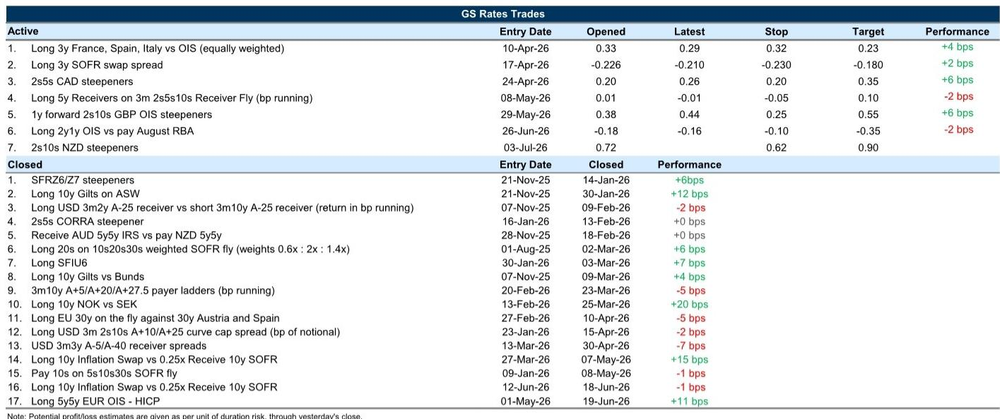
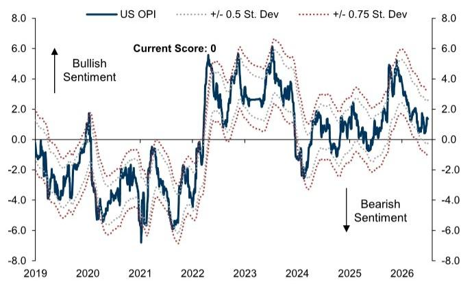

# GS：AI资本开支为长期收益率筑底，长端利率难降

全球利率市场正在经历一轮微妙的再定价。6月非农数据不及预期，叠加美联储官员措辞转鸽，市场对短期加息的担忧明显缓解。但这并不意味着利率交易可以简单转向“做多债券”。GS在最新一期《全球利率交易》报告中给出了一个核心判断：**通胀数据若能温和，将支持前端利率继续盘整和曲线进一步陡峭化，但长端利率的下行空间极为有限，因为持续的AI资本开支与融资需求正在为长期收益率筑底。**

这份报告的价值不在于复述“非农降温”这个已知事实，而在于它拆解了不同期限、不同资产之间的传导链条：短期通胀定价如何受油价驱动，长期通胀预期为何相对便宜却不宜追入，以及不同国家利率曲线陡峭化的驱动力有何本质区别。

以下是我们从这份GS报告中提炼出的五个层次洞察。

## 1. 非农数据只是“放了点气”，加息风险并未彻底消除

GS用一个精妙的比喻形容6月非农：给气球放了一点气。就业增长放缓，前值下修，市场对经济潜在过热的担忧有所降温。但报告同时指出，月度数据的噪音——这次尤其体现在劳动参与率的大幅下降推低了失业率——意味着“更温和的活动数据积累是必要的，但不足以彻底消除更广泛的加息风险”。

这才是关键。市场往往对单次数据过度反应，但GS提醒，真正决定加息定价走向的，是接下来一周半发布的通胀数据。如果CPI读数温和，加息风险可以进一步压缩，曲线继续陡峭化；反之，一切可能重新逆转。

> **KC评论：** 非农数据公布后，市场对7月加息的定价快速回落，但GS认为这更多是“暂停加息”而非“加息周期结束”。完整报告里有一张图表展示了：在美联储按兵不动、但市场此前定价了加息风险的期间，通胀数据的好坏如何决定了远期政策利率的方向。这张图对于判断接下来两周的利率交易方向至关重要。

单篇报告只是一个切片。每天的国际信源汇编会把GS、MS、UBS等机构的当日报告整理成中文摘要、KC评论和图表合集，便于喂给AI追问，也便于人工快速扫市场变化。这是我们理解宏观叙事碎片如何拼成完整图景的方式。

## 2. 通胀定价看似便宜，但做多通胀的风险回报并不诱人

这是报告中最值得细读的判断之一。GS发现，前端通胀交易的快速下降几乎完全可以用油价走势解释。但远期通胀定价——尤其是5年5年远期通胀——跌得比油价隐含的水平更深，目前约在2.35%，接近冲突后“增长恐慌”时期的位置。

GS认为，这种超跌反映了市场对美联储落后于曲线风险的重新评估。但问题是，即便远期通胀看起来便宜，它仍然不是一个有吸引力的多头方向。原因有二：第一，市场对1-2年后的通胀预期仍然高于GS经济学家的预测；第二，美联储偏鹰的假设可能继续压制通胀定价。

> **KC评论：** 很多投资者看到“通胀预期下跌”就认为可以做多通胀保护，但GS指出，目前的最佳用途不是方向性交易，而是作为对冲工具——对冲美联储突然转鸽或外部供给冲击。完整报告里有两张模型图表，分别展示了通胀定价与油价、增长预期、政策预期之间的统计关系，值得仔细推敲。

## 3. 欧洲通胀缓解正在为曲线陡峭化提供燃料，但法国OAT的走阔被GS视为“过度”

欧洲部分的判断同样清晰。欧元区通胀数据持续向好，GS经济学家已经下调了通胀预测，并指出如果大宗商品价格在当前水平企稳，通胀还有下行风险。这应该会限制前端利率的上行空间，9月加息概率大致平衡。

但报告有一个更具体的交易判断：法国OAT相对于德国Bund的利差走阔是“过度的”。GS认为，尽管市场在提前定价2027年预算谈判和极右翼候选人勒庞的参选资格问题，但法国赤字预期实际上在6月是改善的。因此，近期OAT的走阔不可持续，尤其是短端利差应该收窄。

> **KC评论：** 法国政治风险是欧洲利率市场的一个新变量。GS认为市场定价已经过度，但报告也承认长端OAT利差可能更“粘”，因为中期财政不确定性更高。完整报告里有两张图表分别展示了法国赤字预期的变化方向和OAT长端利差的历史位置，对于判断入场时机很有帮助。

## 4. 日本：财政不改革，JGB曲线陡峭化就没有尽头

日本部分是GS判断最明确、也最值得关注的一个区域。报告指出，日本国债曲线持续陡峭化，2s10s利差相对于周期和财政基本面已经偏陡，即使剔除QE和YCC时代的影响，这个“残余”仍然存在。

GS认为，国内财政风险和“落后于曲线”的风险是核心驱动因素。如果日本政府不调整财政立场——本月即将发布的“基本政策”文件可能是关键——那么10年和30年JGB收益率仍有上行空间，曲线中段压力将逐渐加大。

更值得玩味的是GS对日元干预的分析：日本当局似乎更倾向于通过外汇干预而非更激进的加息来应对日元贬值。这导致长端利率成为国内压力的主要释放阀门。只要这种政策组合不变，JGB曲线陡峭化就是趋势。

> **KC评论：** 日本是全球利率交易中一个越来越重要的变量。GS在这里点出了一个关键矛盾：日元贬值不再像过去那样对应前端利率跑输美国利率。这意味着传统的汇率-利率联动关系正在被打破。完整报告里有一张散点图展示了这一点，对于理解日元的未来走势很有帮助。

## 5. 报告尚未完全回答的关键问题：美联储资产负债表缩减的节奏与影响

GS在报告中提到了美联储即将公布下一轮储备管理购买（RMP）的时间表，并预计月度购买规模可能从100亿美元进一步降至0-50亿美元。报告测算，如果RMP维持每月50亿美元，储备金占银行资产的比例将在2027年一季度降至约11%，届时TGCR将略低于IORB，SOFR略高于IORB。

但报告也坦诚，2027年初的SOFR-FF定价与基准假设一致，但触及债务上限的时间点以及资产负债表路径的中期不确定性，构成了双向风险。换句话说，**美联储缩表何时会真正收紧流动性，仍然是一个悬而未决的问题。**

这是报告留给读者的一个思考题：如果储备金继续下降，回购市场会不会重现2019年9月的“钱荒”？GS的分析框架给出了基准路径，但没有完全排除尾部风险。

## 顺着这些未解问题继续读完整报告

GS这份报告的完整版包含了更多细分的国别分析、模型假设和交易建议——比如新西兰2s10s曲线陡峭化的具体交易参数，英国曲线陡峭化的驱动因素差异，以及欧洲MRR调整对银行行为和货币市场的潜在影响。这些细节在单篇摘要里无法完全展开。

我们的每日国际信源汇编会把这份报告放回当天的宏观主线里——当天还有哪些投行发布了什么观点？美联储官员说了什么？数据如何？——整理成中文摘要、KC评论和图表合集，便于喂给AI，也便于人工快速扫市场dynamics。目前社群汇聚了头部券商、PE/VC、投行、并购、hedge fund、资管机构、战略咨询、智库等朋友，期待交流。

如果你对“美联储缩表路径与流动性拐点”这个未解问题感兴趣，或者想看到GS报告里那张“通胀定价与政策利率变化”的关键图表，扫码加入社群，我们在每日更新里继续讨论。

Personal reading notes and learning share only. Not investment advice.

