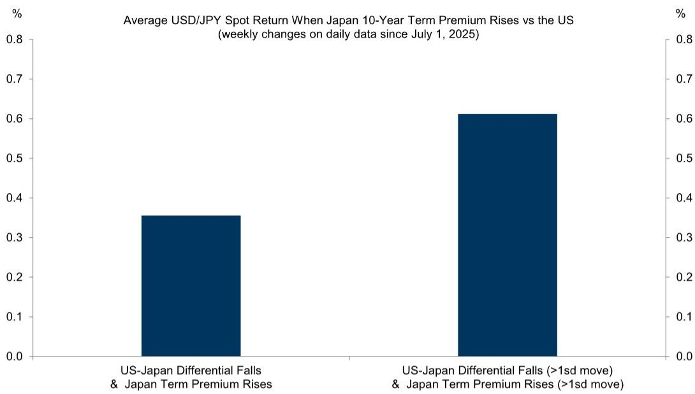
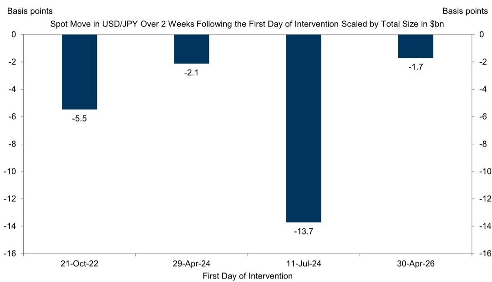
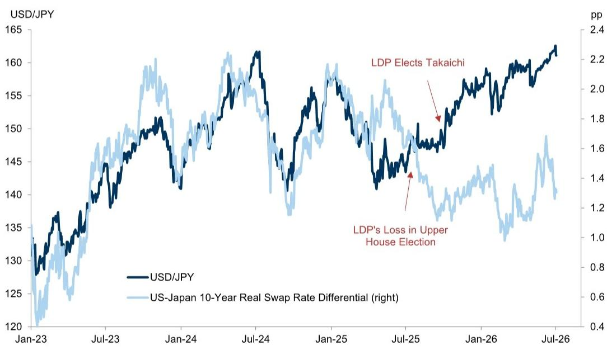

# GS：日元贬值驱动力切换，GS上调美元兑日元预测

日元兑美元汇率刚刚触及40年低点。市场普遍预期日本财务省将再次出手干预，甚至有消息称可能取消事前警告，以加大投机震慑力度。但GS在最新发布的《Global Markets Daily》中给出了一个与市场直觉相反的判断：**只要美国利率维持高位、日本财政扩张与央行渐进加息组合不变，日元仍将持续承压，干预最多只能延缓贬值节奏，无法扭转趋势。**

这份报告的核心洞察并非简单的“看空日元”，而是揭示了驱动日元贬值的主导力量正在发生结构性切换——从传统的利差驱动，转向日本国内期限溢价的独立攀升。这意味着，即便美日利差不再扩大，日元仍可能继续走弱。

> **KC评论：** GS并非第一个看空日元的机构，但这份报告的价值在于它给出了一个可观测、可验证的传导链条：日本财政刺激推高通胀预期和财政风险溢价，推升日本国债期限溢价，进而压低日元。如果你只看美日利差，可能会觉得日元已经超跌；但GS的框架提示，真正的压力源在日本国内，而非美国。

以下是我们对这份报告的深度拆解，以及它可能对全球资产配置产生的二阶影响。

---

## 1. 日元贬值的驱动力已从利差切换为日本国内期限溢价

过去一年，USD/JPY与美日实际利差的相关性显著下降。GS发现，自2025年7月日本自民党在上院选举中失利以来，传统的利差-汇率传导机制出现断裂。取而代之的，是日本国债期限溢价相对于美国国债期限溢价的差值，成为解释USD/JPY走势的更有效变量。

具体而言，在GS统计的2025年7月以来的周度数据中，当日本期限溢价相对美国上升时，USD/JPY平均上涨约0.35%；当两者波动均超过一个标准差时，涨幅接近0.60%。这一关系在统计上显著，且在近几个月的极端行情中表现得尤为突出。

> **KC评论：** 期限溢价反映的是市场对长期通胀和财政可持续性的定价。日本政府的大规模刺激计划叠加央行缓慢加息，意味着市场正在为更高的长期通胀风险和财政风险定价。这份报告中的Exhibit 2和Exhibit 3值得仔细看——它们直观展示了这一结构性切换的时点和强度。

---

## 2. 干预的“性价比”正在递减，财务省可能转向“偷袭式”干预

GS在报告中指出，2025年4月的日元买入干预相较于此前几轮干预，其“冲击效果”已明显减弱（见Exhibit 4）。原因并不复杂：当宏观基本面持续指向同一方向时，干预只能暂时压制波动率，无法改变趋势。

报告进一步推测，财务省可能转向1990年代更常见的操作模式——更小规模、更频繁、且不提前警告的干预。这种“偷袭式”干预可以在短期内压低汇率并抑制投机，但GS的核心判断是：只要宏观格局不变，干预的效果将随时间递减，最终被市场力量吞噬。

这一点对于持有日元资产或对日元敞口敏感的投资者而言，意味着不应将干预视为趋势反转的信号，而应视为短期战术性机会。

---

## 3. GS上调USD/JPY预测路径，但关键假设仍存不确定性

基于上述分析，GS将USD/JPY预测路径从此前的160/158/155上调至162/163/165。这一预测隐含的假设包括：美国经济避免硬着陆、美联储维持高利率、日本央行维持渐进加息节奏、日本财政刺激继续推升通胀预期。

但报告中明确指出了两个可能打破这一路径的变量：一是美国经济增长出现负向冲击，二是日本央行转向更激进的紧缩。GS认为，这两者在未来一年内发生的概率都不高。

> **KC评论：** 165的预测并非GS给出的最极端情景，而是基准路径。如果日本通胀持续超预期或日本央行被迫加速加息，日元反而可能快速反弹。这份报告没有充分展开的是：日本央行在什么条件下会改变节奏？财政刺激的规模是否已经充分定价？这些恰恰是完整报告中值得深挖的部分。

---

## 4. 日元作为融资货币的角色可能进一步强化

GS在交易建议中明确提出，继续偏好将日元作为融资货币，用于做多高息新兴市场货币。这一建议的逻辑基础是：只要日元维持弱势且低波动，套息交易就具有吸引力。但如果干预力度加大或宏观格局出现变化，这一策略的风险也将同步上升。

对于持有新兴市场敞口的投资者而言，这意味着需要重新评估日元融资头寸的风险收益比，尤其是在日元已经极度低估的背景下。

---

## 5. 报告尚未完全回答的关键问题：财政刺激的边界在哪里？

GS的报告清晰地指出了日本财政扩张对日元贬值的推动作用，但对于财政刺激的可持续性及其边界，并未给出明确判断。日本政府债务占GDP比重已超过250%，市场对财政风险的定价是否已经充分？如果财政刺激效果递减或引发债务可持续性担忧，日本央行是否会被迫配合财政进行收益率曲线控制？

这些问题是理解日元长期走势的关键，也是这份报告留下的最大悬念。完整报告中包含的GS利率策略团队对日本期限溢价的拆解模型，以及不同情景下的压力测试，或许能提供更深入的视角。

---

**中段提示：** 以上只是这份GS研报的一个切片。在实际投资决策中，单篇报告的价值在于它提供了一种分析框架，但真正的洞察往往来自将不同信源、不同时间点的报告放在一起对比和串联。我们每天的国际信源汇编，正是把当天国际投行、咨询公司、国际机构的核心报告整理成中文摘要、KC评论和图表合集。这些内容既适合喂给AI进行追问和交叉验证，也适合人工快速扫描市场dynamics的边际变化。

---

## 6. 对读者的观察框架：盯住期限溢价差，而非利差

对于希望跟踪日元走势的投资者，GS的报告提供了一个更实用的观察指标：**日本与美国的国债期限溢价差**。具体而言，可以关注以下三个信号：

第一，日本10年期国债期限溢价的绝对水平及其相对于美国同期限溢价的变化。如果日本期限溢价持续攀升而美国相对稳定，日元贬值压力将加大。

第二，日本财政刺激的规模和结构。如果市场认为刺激计划将推升长期通胀预期，期限溢价将进一步上行。

第三，日本央行的沟通和行动。任何关于加速加息或调整收益率曲线控制的信号，都可能触发日元快速反转。

---

## 7. 日元极度低估，但低估本身不是反转的理由

GS在报告中承认，日元兑美元已处于其估值模型中的极度低估区间。但报告的核心立场是：在宏观基本面没有改变之前，低估本身不会触发反转。这一判断对于价值投资者而言可能令人沮丧，但它反映了外汇市场的现实——汇率可以在低估区域停留很长时间，直到驱动因素发生根本性变化。

对于长线投资者而言，这意味着需要耐心等待催化剂的出现，而不是在当前时点赌反转。

---

**文末提示：** 日元走势只是全球宏观拼图中的一块。如果你对GS这份报告的完整数据、图表假设和情景分析感兴趣，或者希望每天第一时间获取国际投行、咨询公司、国际机构的核心报告中文摘要、KC评论和图表合集，欢迎扫码加入我们的知识星球。每日更新，汇总国际主流叙事与边际变化，既便于喂给AI进行深度追问，也便于人工快速扫描市场dynamics。星球汇聚了头部券商、PE/VC、投行、并购、hedge fund、资管机构、战略咨询、智库等领域的专业人士，期待与大家交流讨论。

Personal reading notes and learning share only. Not investment advice.

