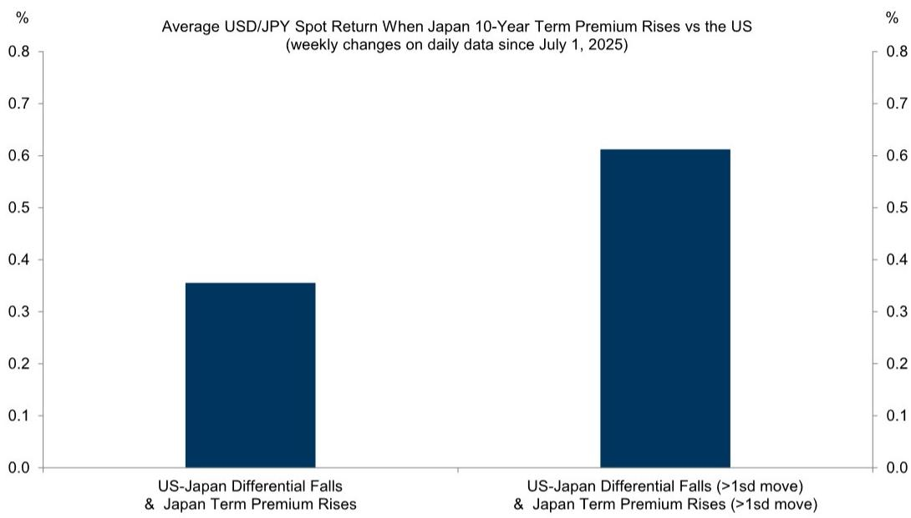
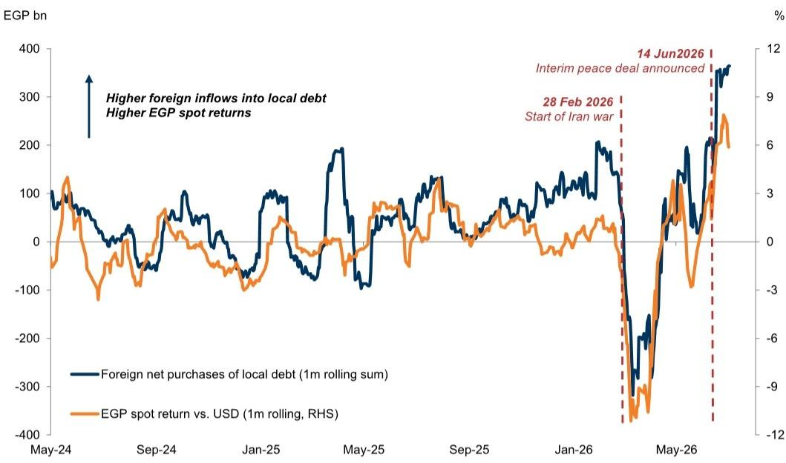
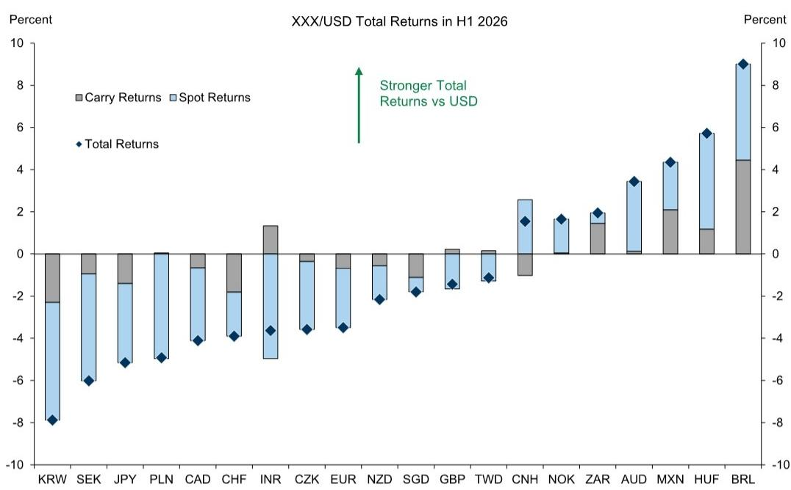

# The Dollar Is No Longer a One-Way Bet — But the Divide Between High and Low Yielders Will Persist

The U.S. Dollar's recent strength is not a repeat of the broad-based rally of 2022. It is something more selective, more structural, and more instructive for portfolio construction. Over the past year, the narrative around the Dollar has shifted from inevitable decline to renewed resilience, but the reality is more nuanced. The forces that have driven the Greenback higher — an artificial intelligence investment boom concentrated in the United States and an energy supply shock that has reshaped global terms of trade — are not fading quickly. Yet the Dollar is not strengthening against everything. It is rising against low-yielding currencies while falling against those offering higher carry. This divide is the central feature of the current FX regime, and it demands a differentiated strategy rather than a blanket directional view.

Investors who treat the Dollar as a single trade are missing the point. The currency market is now segmented by yield, by policy credibility, and by exposure to the twin shocks that have reshaped the global economy. The U.S. economy is outperforming on the back of capital expenditure cycles that have no parallel in Europe or Japan. The Federal Reserve is debating whether to respond to inflationary pressures that are, for now, uniquely American. Meanwhile, energy-importing nations are seeing their terms of trade improve as oil prices retreat from conflict-driven highs, while energy exporters face a different calculus. The result is a world where the Dollar can be simultaneously strong against the Yen and weak against the Colombian Peso, and where a single currency view is no longer sufficient.

Why now matters is that the window for repositioning is narrowing. The forces that have sustained the Dollar's divide are showing signs of persistence, but they are not permanent. The AI capex cycle will eventually mature. Energy prices may stabilize. Central bank policies will diverge further or converge. The next six to twelve months will determine whether the current segmentation becomes a lasting feature of the FX landscape or a transitional phase. For now, the evidence points toward the former, and investors need to adjust their frameworks accordingly.

## The Dollar's Strength Is Now a Function of Two Uniquely American Shocks, Not Broad Economic Exceptionalism

The conventional explanation for Dollar strength has been U.S. economic outperformance, but this framing is too broad. The report identifies two specific shocks that have combined to lift the Dollar's profile: an AI-driven investment boom and an energy supply bust. Both are concentrated in the United States in ways that are not replicable elsewhere. The AI boom has raised capital expenditure plans and created inflationary pressures that are unique to the U.S. among developed market economies. This has shifted rate differentials, particularly the market-implied neutral rate, in the Dollar's favor. The energy supply shock, meanwhile, has altered global terms of trade in ways that benefit some currencies while punishing others.

The key insight is that these shocks are not symmetrical. They do not lift all boats. The Dollar's appreciation has been divided between gains against low-yielders and losses against high-yielders. This is not a sign of broad-based strength but of a market that is pricing in differentiated outcomes. The implication is that investors should not expect a return to the kind of generalized Dollar weakness that characterized parts of last year. Instead, the Dollar will remain strong against currencies that lack the policy tools or economic momentum to offset the U.S. advantage, while weakening against those that offer higher carry and credible reform stories.

## The Yen's Depreciation Is a Structural Trend That Intervention Alone Cannot Reverse

The Japanese Yen's slide to 40-year lows against the Dollar is often attributed to monetary policy divergence, but the report makes a more nuanced argument. The broader macro backdrop of higher-for-longer U.S. yields, low recession risk, lingering fiscal concerns in Japan, and only gradual Bank of Japan hikes creates a powerful and persistent depreciation pressure. Intervention by the Ministry of Finance can slow the move and buy time, but it cannot reverse the underlying trend without a shift in fundamentals.

The evidence is striking. After the last round of intervention in April 2024, USD/JPY returned to its upward trend within weeks. The same pattern is repeating now. The report notes that in weeks when Japan's term premium rises relative to the U.S., USD/JPY rallies by roughly 0.35% on average, and by nearly 0.60% when the move is particularly large. This relationship is not accidental. It reflects a market that is pricing in the growing inflationary and fiscal pressure from Japan's stimulus plans, which push up JGB yields relative to Treasuries.

The implication for investors is clear. Using the Yen as a funding currency for high-carry EM expressions remains a viable strategy. The trend higher in USD/JPY is likely to extend, even if there are additional rounds of intervention. The only forces that could stop it are an unexpected negative U.S. growth shock or a BoJ pivot toward more aggressive tightening. Neither looks likely over the coming year. The report's revised forecasts of 162, 163, and 165 for USD/JPY over 3, 6, and 12 months reflect this conviction.

## High-Yielding Emerging Market Currencies Are Benefiting from Local Reforms and Favorable Terms of Trade Dynamics

The most interesting part of the report is its analysis of high-yielding EM currencies, particularly the Colombian Peso and the Indian Rupee. These currencies are strengthening not despite the Dollar but because of local factors that are independent of U.S. monetary policy. In Colombia, a shift toward fiscal consolidation under the newly elected president, combined with a hawkish central bank that hiked rates by 75 basis points above consensus, has created a supportive environment for the Peso. The currency has appreciated by 6% in the last month and over 10% year-to-date, and the report expects further gains despite more challenging valuations.

The Indian Rupee presents a different but equally compelling story. Sharply lower oil prices and gold import curbs have improved India's macro outlook and external fundamentals. The RBI's FX measures could bring around $60 billion of inflows in 2026, driven by foreign currency non-resident deposits, external commercial borrowing, and increased foreign participation in government securities. The report's revised forecasts of 94, 95, and 96 for USD/INR over 3, 6, and 12 months reflect a constructive view that is stronger than forward pricing.

What ties these stories together is the concept of terms of trade durability. The report notes that the imprint of a terms of trade shock on FX can be more durable than the underlying commodity price shifts. Even as oil prices have retraced to pre-conflict levels, the FX impact has persisted. Energy-sensitive crosses like NOK/SEK and AUD/NZD remain meaningfully higher than pre-conflict levels. This suggests that investors should be cautious about fading terms of trade moves too quickly, as the macro impacts take time to fully play out in economic data and firm-level performance.

## The Report Leaves an Important Question Unanswered: How Long Can the Divide Persist?

For all its analytical rigor, the report does not fully resolve the question of timing. The forces that have created the divided Dollar environment are clear, but their durability is uncertain. The AI capex cycle could slow if productivity gains fail to materialize or if regulatory hurdles emerge. Energy prices could rise again if geopolitical tensions escalate. Central bank policies could converge if the Fed pivots more aggressively than expected or if the BoJ surprises with a hawkish shift.

The report acknowledges these risks but does not provide a clear framework for when the divide might break. It notes that downside risks to the Dollar could stem from more balanced activity and policy prospects or a re-emergence of credibility concerns. On the other hand, confirmation that more restrictive policy is required could lead to outsized FX moves if policy diverges even more than currently discounted. The baseline assumption is that U.S. performance remains solid enough for rate differentials to narrow only slightly, but this is a judgment call rather than a certainty.

This ambiguity is not a weakness. It is an invitation for investors to think critically about their own assumptions. The report provides the data and the logic, but the ultimate decision about positioning depends on one's view of how these forces will evolve. The unanswered question is whether the current divide is a new equilibrium or a transitional phase. The answer will determine whether the next big trade is to fade the divide or to ride it further.

## A Decision Framework for Navigating the Divided Dollar Environment

For investors looking to translate the report's insights into actionable decisions, the following framework can help structure thinking. First, assess your exposure to the two shocks. Are you positioned for an AI-driven U.S. capex cycle that continues to lift rate differentials? Or do you expect a slowdown that would reduce the Dollar's advantage? Second, evaluate the carry and reform stories in high-yielding EM currencies. The report shows that currencies with credible fiscal consolidation and hawkish central banks can outperform even in a strong Dollar environment. Third, consider the terms of trade dynamics in your portfolio. The report's finding that ToT impacts are more durable than commodity price moves suggests that fading these moves too early can be costly.

The framework also requires a view on intervention. The Yen's experience shows that intervention can slow but not reverse trends without a shift in fundamentals. For currencies like the Egyptian Pound, where foreign inflows have exceeded pre-war highs, the risk is that positioning becomes crowded and vulnerable to a reversal. The report's recommendation to extend the target on short USD/EGP reflects confidence in the trend, but it also acknowledges the increased risk.

Finally, the framework must account for the possibility of regime change. The report's baseline is that the divide persists, but it also outlines the conditions under which it could break. A U.S. recession or a BoJ pivot would change the calculus for the Yen. A failure of fiscal consolidation in Colombia or a reversal of energy price declines would alter the outlook for high-yielders. The decision framework should include triggers for when to abandon the current view and adopt a new one.

## Join the Community to Read the Full Report and Review the Original Charts

The analysis above captures the core arguments and implications of the report, but the full document contains detailed forecasts, historical comparisons, and supporting exhibits that are essential for a complete understanding. The report's charts on FX returns divided by yield, the relationship between Japan term premium and USD/JPY, and the durability of terms of trade impacts provide visual evidence that reinforces the written analysis. For investors who want to examine the data for themselves and test the report's conclusions against their own views, the full report is the necessary next step. Join the community to read the full report and review the original charts.

*This article is for learning and discussion only and does not constitute investment advice.*

Personal reading notes and learning share only. Not investment advice.

