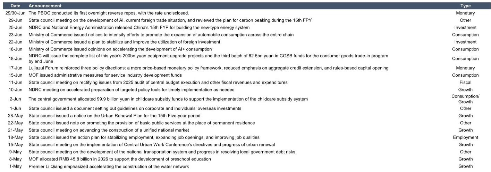
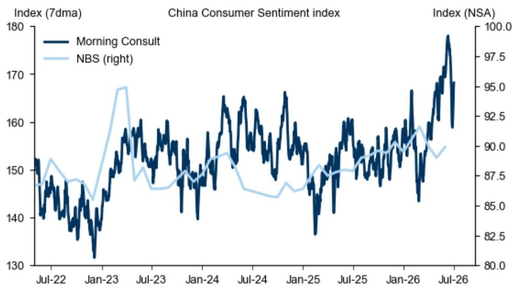
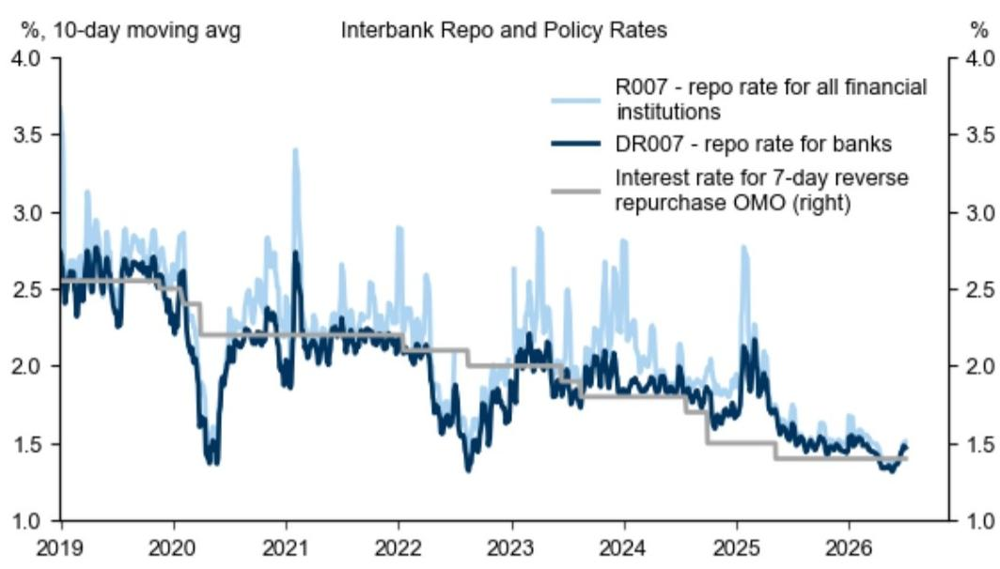

# GS：中国经济修复的“弱现实”与“强韧性”正在同步发生

中国经济正处于一个微妙的节点。市场普遍关注的消费和地产数据仍然疲软，但GS的周度高频跟踪器揭示了一个更复杂的图景：在“弱现实”的表象之下，生产、出口和部分消费信心指标已经展现出“强韧性”。这不是一个简单的“触底反弹”叙事，而是一个结构性的分化过程——经济正在从政策驱动的修复，转向内生动能主导的再平衡。理解这一过程，比判断单月数据是涨是跌，对资产定价更具指导意义。

这份于7月3日发布的GS中国经济活动与政策周度跟踪报告，覆盖了消费与出行、生产与投资、其他宏观活动以及市场与政策四个维度，提供了截至6月底的最新高频数据。其核心价值不在于预测下个月的GDP，而在于通过周度频率，捕捉那些月度数据无法揭示的边际变化。报告显示，中国经济并非全面走弱，而是呈现出“消费地产冷、生产出口稳、政策工具静”的分化格局。对于投资者而言，真正的挑战在于识别哪些领域的韧性是可持续的，哪些领域的疲软是结构性的。

> **KC评论：** 这份周度跟踪报告的价值不在于给出一个“好”或“坏”的总体判断，而在于提供了一个观察经济内部“温差”的框架。当市场情绪被某个月度数据左右时，高频数据能告诉你，哪些变化是趋势性的，哪些只是噪音。完整报告中的24张图表，每一张都是这个“温差”的直观证据，值得细看。

单篇报告只是一个切片。每天，国际投行、咨询公司和国际机构都会发布类似的深度分析。我们的每日国际信源汇编，正是将这些碎片化的洞察，放回当天的全球宏观主线中，整理成中文摘要、KC评论和图表合集。这不仅适合喂给AI进行追问，也适合人工快速扫描市场dynamics的变化，避免被单一报告误导。

## 1. 消费信心现边际修复，但地产“量稳价弱”格局未改

报告中最值得关注的积极信号，来自消费者信心。国家统计局的消费者信心指数在5月有所回升，而高频的Morning Consult消费者信心指数在过去一周也出现反弹。同时，加权PMI就业分项指数在6月亦小幅上行。这组数据提示，尽管居民对收入和经济前景的预期仍然谨慎，但最悲观的阶段可能已经过去。

然而，消费信心的改善尚未有效传导至房地产这一核心资产市场。30城新房日均成交量在过去一周小幅下滑，并继续低于去年同期水平。二手房市场则呈现出“量稳”的特征——16城二手房日均成交量虽较前一周回落，但仍高于去年同期。这印证了我们此前的判断：房地产市场的调整正在从“普跌”转向“分化”，二手房凭借价格调整到位，正在逐步释放积压的刚需和改善需求，而新房市场受制于开发商信用风险和期房交付不确定性，修复节奏明显滞后。

> **KC评论：** 消费者信心与地产销售之间的“剪刀差”，是当前经济最核心的矛盾。信心的修复能否持续，很大程度上取决于就业市场的改善能否从PMI数据的“边际好转”变为居民收入的“实质性提升”。完整报告中对就业分项指数的细拆，以及不同城市层级地产数据的对比，能帮你更精准地判断这一传导链条的进展。

## 2. 生产端韧性超预期，工业活动并未“躺平”

与消费端的谨慎形成对比，生产端展现出了超预期的韧性。GS的周度跟踪数据显示，钢铁产量在过去一周小幅回升，沿海省份的日均煤炭消耗量虽在区间内波动，但持续高于去年同期水平。这表明，工业部门的实际运行状况，比一些悲观的月度调查所显示的更为稳健。

出口相关的活动是生产韧性的重要支撑。官方港口集装箱吞吐量在过去一周增加，并高于去年同期；20个主要港口的离港船舶货运量同样上升，且高于去年同期。GS的原油需求nowcast模型显示，中国石油需求最新读数已微升至1640万桶/日。这些数据共同指向一个结论：外需的韧性，以及中国制造业在供应链中的竞争力，仍在为工业活动提供基本盘。

> **KC评论：** 生产端的韧性，是市场最容易忽视的“稳定器”。当所有人都在讨论消费降级和地产下行时，出口和制造业的持续活跃，实际上为政策提供了更大的腾挪空间。完整报告中对钢铁、煤炭、化工品等细分领域的价格和产量追踪，能帮助你判断这种韧性能否在三季度延续。

## 3. 政策工具箱处于“静默观察期”，而非“弹药耗尽”

市场对政策的期待，往往伴随着“政策力度不够”的失望。但GS的报告揭示了一个更微妙的现实：政策并非没有动作，而是进入了“静默观察期”。从5月底至今，国务院、发改委、商务部等部门密集出台了一系列政策，涉及AI发展、新能源汽车消费、外资利用、设备更新、育儿补贴、城市更新等多个领域。

然而，报告中的两组数据值得关注。首先，地方专项债发行进度（年初至今2040亿元）仍然偏慢。其次，政策性银行的支持力度在6月依然疲软。这或许意味着，决策层正在评估此前出台的存量政策效果，并观察经济自身的修复动能，而非急于推出新一轮大规模刺激。央行近期推出的隔夜逆回购工具，更多是完善利率走廊的技术性操作，而非总量宽松的信号。

报告中更引人注目的，是反腐代理指标的变化。全国层面的反腐力度仍处高位，而地方层面的反腐力度在2026年二季度升至历史新高。这为理解地方官员“不作为”或“慢作为”的现象，提供了制度层面的解释。在地方财政压力和问责机制的双重约束下，政策从中央到地方的传导效率，可能仍是制约经济修复速度的关键变量。

## 4. 报告尚未完全回答的关键问题：油价冲击与政策传导的“最后一公里”

GS将这份跟踪报告改为周度发布，明确提及是为了“更紧密地追踪能源价格上涨对中国经济活动的冲击”。这是报告的核心关切，但也是尚未完全回答的问题。报告显示，国内汽油和柴油价格在过去一周保持不变，而布伦特油价则继续下跌。这暗示着，国内成品油定价机制在一定程度上缓冲了国际油价的直接冲击，但上游成本压力向中下游的传导，以及对企业利润和居民可支配收入的滞后影响，仍需要时间观察。

另一个未解之谜是政策传导的“最后一公里”。从5月以来的政策列表看，方向明确、覆盖面广，但无论是地方专项债的发行进度，还是政策性银行的信贷支持，都未出现明显加速。反腐指标的上升，虽然有利于长期治理，但短期内可能加剧地方官员的“避责”心态，使得“宽货币”难以顺畅转化为“宽信用”。报告中的图表直观展示了这一矛盾，但并未给出明确的解决路径。

## 5. 投资者的观察框架：从“总量判断”转向“结构信号”

基于GS这份报告的洞察，我们建议投资者调整对中国经济的观察框架，从过度关注“总量增速”转向捕捉“结构信号”。具体而言，可以关注以下三个维度：

第一，消费信心的可持续性。关注Morning Consult等高频信心指数能否在7月继续上行，以及PMI就业分项是否能在三季度持续改善。这是判断内需能否接替外需成为增长主动力的关键。

第二，地产市场的“量”与“价”分化。二手房成交量的持续高于去年同期，是一个积极的“量”的信号。但如果二手房价格无法企稳，将制约“以旧换新”链条的启动，并持续压制居民资产负债表修复。报告中对一、二手房市场的同步追踪，是观察这一过程的最佳窗口。

第三，政策工具的“静默”何时打破。关注地方专项债发行是否在7-8月加速，以及政策性银行信贷数据是否出现拐点。如果这两项指标依然低迷，则意味着政策仍处于“观察期”，市场对强刺激的预期需要进一步降温。

这些结构性信号，远比猜测下个月的工业增加值或社零数据更有意义。它们共同指向一个判断：中国经济正在经历一场“无痛”的换挡，过程可能漫长，但方向是清晰的。

---

关于政策传导效率、油价冲击的滞后影响，以及地产市场“量稳价弱”格局能否持续，这些报告未完全展开的问题，恰恰是决定下半年资产定价的核心。我们每日的国际信源汇编，正是将这些单篇报告放回当天的全球宏观主线中，整理成中文摘要、KC评论和图表合集，便于你喂给AI进行追问，也便于人工快速扫描市场dynamics的边际变化。这里汇聚了头部券商、PE/VC、投行、并购、hedge fund、资管机构、战略咨询、智库等朋友，期待与你交流。扫码即可加入。

Personal reading notes and learning share only. Not investment advice.

