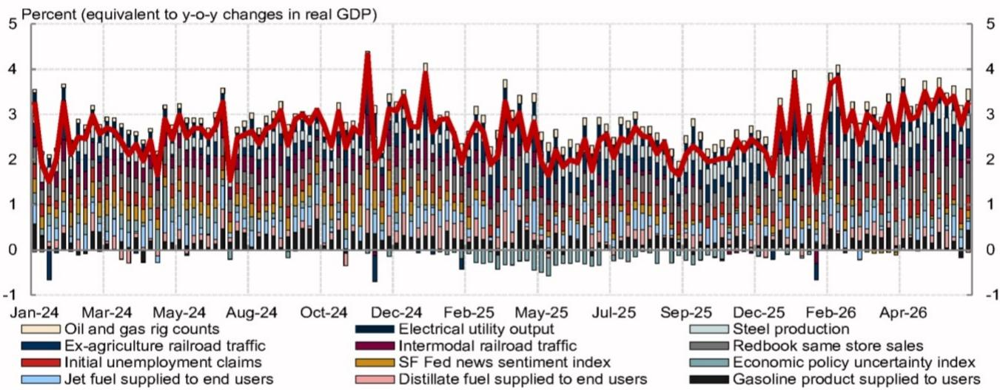
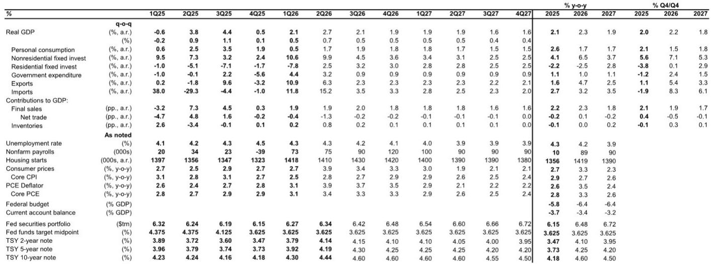
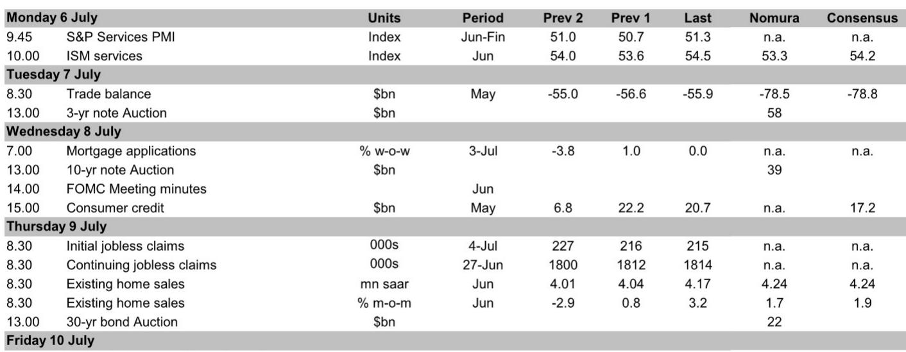

# NOM：美国就业数据噪音背后，真正的鸽派信号是什么

六月的非农数据公布后，市场陷入了一种微妙的困惑。新增就业57k，远低于113k的共识预期，但失业率却从4.3%回落至4.2%。这份数据到底该解读为经济降温的信号，还是仅仅是统计噪音？

NOM在最新发布的美国经济研报中给出了一个清晰但克制的判断：六月非农数据“嘈杂，但边际偏鸽”。这句话看似平淡，实则包含两层重要含义。第一，57k的读数本身并不可怕，它很大程度上是五月临时性因素的逆转，尤其是休闲和酒店业就业大幅下降61k，加上前两个月累计下修74k，三个月平均新增就业已经降至111k。第二，真正值得关注的不是头条数字，而是家庭调查中那些更微弱的细节——劳动参与率骤降，尤其是25-34岁年龄段出现了1.6个百分点的断崖式下滑。

这份报告的价值不在于它预测了非农数据的高低，而在于它把美联储当前的决策困境、沟通策略的潜在变革、以及贸易政策的不确定性，串联成了一个完整的政策叙事。对于任何关注美联储路径的投资者来说，这些细节远比一个月的就业数字更为重要。

## 1. 六月非农的“噪音”背后，真正需要警惕的是劳动力供给而非需求

NOM的分析师明确将六月非农描述为“嘈杂”，并给出了一个重要的分析框架：排除掉休闲酒店和地方政府就业这些高波动成分后，就业增长实际上保持稳定，周期性行业的招聘也在改善。这与市场第一反应形成的“经济突然恶化”叙事截然不同。

但真正值得警惕的，是家庭调查中劳动参与率的异常下降。25-34岁年龄段的参与率单月下降了1.6个百分点，而且这种下降在所有教育水平群体中都是广泛的。NOM指出，这个年龄段通常被认为更容易受到AI冲击，因为影响集中在应届毕业生群体。然而，按教育程度分类的数据显示，下降是全面性的，这削弱了“AI冲击”这一单一解释的说服力。

> **KC评论：** 这意味着，劳动力供给端的收缩可能比需求端的放缓更值得关注。如果参与率持续下降，即使新增就业放缓，失业率也可能维持低位甚至进一步下降。这对美联储来说是一个两难：低失业率可能被解读为劳动力市场仍然紧张，从而推迟降息，但实际的经济动能可能已经在减弱。完整报告中的图3和图4展示了参与率下降的年龄分布和教育程度分布，这些细节是理解美联储后续反应函数的关键。

## 2. 沃什的“耐心”信号比数据本身更重要，美联储正在为沟通策略做结构性调整

如果说非农数据是短期噪音，那么美联储主席沃什在ECB辛特拉论坛上的讲话，以及他即将宣布的五项特别工作组，才是这份报告中最有长期含义的部分。

沃什明确表示，通胀风险和预期在过去四周已经下降，这很可能指向中东局势缓和和原油价格回落。他的措辞更接近鸽派官员，将高通胀部分归因于能源价格和关税等临时因素。更重要的是，他再次强调了AI的中期通缩效应，认为供给侧的改善将逐步显现。NOM的分析指出，强调“难以观测的供给改善”实际上给了美联储更大的政策灵活性——当数据不好看时，他们可以用“未来供给会改善”来为当前的按兵不动辩护。

但真正具有制度意义的，是沃什即将宣布的五个特别工作组。据报道，前英国央行行长默文·金很可能共同主持沟通工作组。金是前瞻指引和点阵图的长期批评者。他在2024年6月的一篇NBER论文中明确表示，“不存在能够描述央行政策意图的时不变政策反应函数”，并认为前瞻指引混淆了央行的预测与市场需要理解的“反应函数”。如果金的观点成为工作组的主导方向，美联储未来的沟通策略可能从“告诉市场我们会做什么”转向“告诉市场我们如何做决策”。

> **KC评论：** 这是一个容易被忽视但影响深远的信号。如果美联储放弃或弱化点阵图，市场将失去一个重要的政策路径锚点。波动性可能上升，但美联储也将获得更大的政策自由度。完整报告讨论了金对点阵图的批评逻辑，以及沃什对简化会后声明的意图——这些内容对于理解未来美联储沟通策略的演变方向至关重要。单篇报告只是一个切片，每天的国际信源汇编会把当天国际投行、咨询公司、国际机构报告整理成中文摘要、KC评论和图表合集，适合喂给AI追问，也适合人工快速扫市场变化。

## 3. 最高法院对库克案裁决保护了美联储独立性，但威胁并未完全消除

最高法院以5-4裁定美联储理事库克可以留任，拒绝了特朗普政府试图将其免职的请求。表面上看，这是一次对美联储独立性的重要支持。但NOM指出，裁决是基于程序性理由，而非实质性认定。法院并未判定政府指控的事实是否构成“有因解雇”的标准，这意味着理论上政府可以在完善程序后重新发起挑战。

更值得关注的是特朗普在裁决后的反应。他立即表示将采取“适当行动”阻止库克做出重要决策。白宫国家经济委员会主任哈塞特也在接受彭博采访时表达了对鲍威尔继续留任的担忧，称之为“极其非正统”。

这意味着，美联储的政治压力并未因最高法院的裁决而消失，只是暂时被程序性障碍所阻挡。NOM认为，这种反复的政治威胁可能反而延长鲍威尔的任期——因为市场和政治对手都不希望在最动荡的时刻更换央行行长。

## 4. 贸易政策转向“年度审查”模式，不确定性将制度化而非消除

美国贸易代表格里尔在7月1日明确表示，美国选择续签USMCA协议，但计划转向年度审查制度，甚至可能分别与加拿Daiwa墨西哥谈判双边协议。

NOM的判断是，这一方向符合预期。转向年度审查或更窄的豁免条款，意味着贸易不确定性将不再是“一次性的谈判风险”，而将成为一种制度化的波动来源。每年一次的审查周期，意味着企业无法像过去那样在协议签署后获得多年的确定性。投资决策的折现率将被系统性抬高。

但NOM也指出，各方都有达成协议的动力，因此完全破裂的可能性较低。最可能的结果是，不确定性持续存在，但不会升级为贸易战。这类似于一种“慢性病”而非“急性发作”——对经济增长的拖累是持续的，但不会立刻引发危机。

## 5. 报告尚未完全回答的关键问题：AI驱动的通胀压力何时会从“供给侧利好”转为“需求侧过热”

NOM的报告在多个地方提到了AI对经济的双重影响。沃什强调AI的中期通缩效应——供给侧的改善将最终压低价格。但报告也承认，ISM制造业调查中的价格支付指数虽然大幅下降，但商品价格通胀的风险仍然偏向上行，“AI繁荣带来的价格压力”是主要风险因素。

这里存在一个尚未被充分解答的问题：AI的供给侧改善需要多长时间才能抵消当前的需求侧过热？如果AI投资驱动的资本品需求、电力消耗和芯片短缺持续推高投入品价格，那么所谓的“通缩效应”可能只是一种长期愿景，而短期通胀压力才是现实。NOM在Q4 2026年核心PCE通胀预测中给出了3.3%的读数，这远高于美联储2%的目标，说明该机构自己也认为通缩效应短期内难以兑现。

这个张力是理解美联储未来政策路径的核心。如果AI的供给侧改善迟迟无法落地，而需求侧的通胀压力持续，美联储将面临一个比当前更复杂的政策困境。

## 6. 投资者需要建立的新观察框架：从“就业数据”转向“参与率+沟通策略+政治干预”三角

传统的美国经济分析框架高度依赖非农就业和CPI等高频数据。但NOM这份报告暗示，未来的关键变量可能不再是这些数据本身，而是三个结构性因素的交织：

第一，劳动参与率的变化，尤其是年轻群体的参与意愿。这将决定失业率在就业增长放缓时是否会意外走低，从而改变美联储对“充分就业”的判断。

第二，美联储沟通策略的演变。如果点阵图被弱化或取代，市场将失去一个重要的政策路径信号。投资者需要更加关注沃什在公开场合对“反应函数”的描述，而非对利率路径的具体暗示。

第三，政治干预的边界。最高法院的裁决为美联储独立性提供了程序性保护，但并未消除实质威胁。任何新的政治挑战都可能引发市场对美联储独立性的重新定价。

这三个因素相互关联，共同决定了美联储在接下来几个季度的政策空间。单纯跟踪就业和通胀数据，已经不足以预测美联储的下一步行动。

---

这份NOM报告展示了一个正在经历结构性转变的美国经济图景。就业数据短期噪音的背后，是劳动力供给、央行沟通策略和政治干预三个深层变量的重新定价。对于希望系统跟踪这些边际变化的投资者来说，单篇报告只能提供一个切片。每日的国际信源汇编会把当天国际投行、咨询公司、国际机构报告整理成中文摘要、KC评论和图表合集，便于喂给AI追问，也便于人工快速扫市场dynamics。星球汇聚了头部券商、PE/VC、投行、并购、hedge fund、资管机构、战略咨询、智库等朋友，期待交流。

Personal reading notes and learning share only. Not investment advice.

