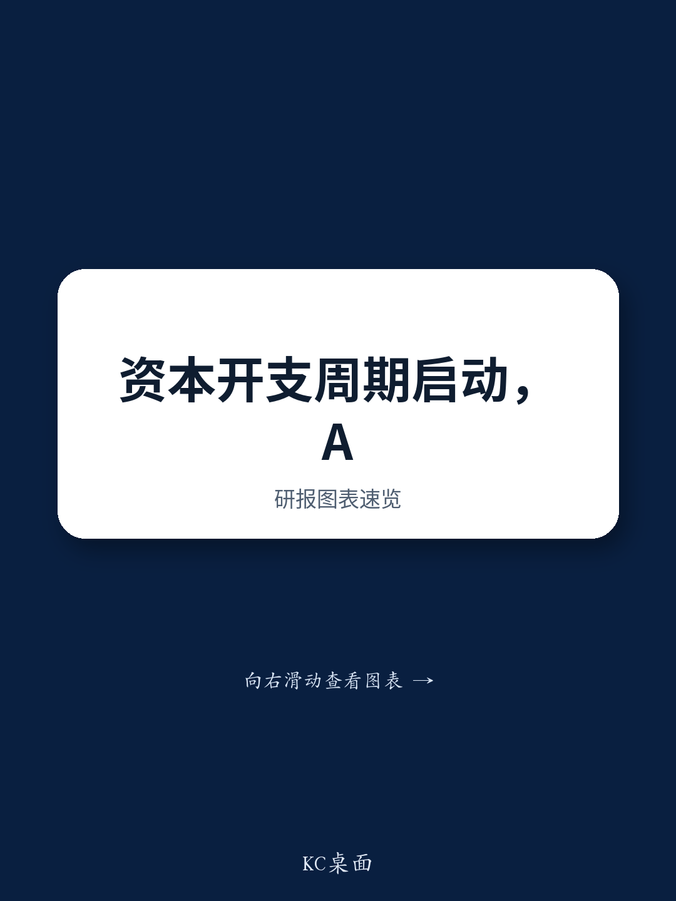

# The Capex Cycle Is Reshaping Markets: Why Investors Must Rethink Supply Chains, Talent, and Competitive Exposure

The most important investment narrative of the next decade is not artificial intelligence in isolation. It is the physical manifestation of AI demand colliding with structural underinvestment across energy, industrials, and logistics. A global investment bank's latest research reveals that the capex boom is already reordering markets in ways that most portfolios have not yet priced in. Six names from the European Conviction List now sit at the intersection of this cycle, but the real insight lies not in the stock picks themselves, but in the second-order effects that will ripple through supply chains, labor markets, and trade dynamics for years.

This is not a story about technology adoption curves or software margins. It is a story about bottlenecks, crowding effects, and the return of tangible investment as a dominant market force. The report makes clear that AI and its derivatives are a key driver of capex, but they are far from the only one. Oil capex, defense spending, electrification, and real estate are each contributing to what appears to be a synchronized global investment upswing. The question for serious investors is not whether this cycle is real, but how to position for its least obvious consequences.

The report's analysis of the capex cycle is unusually granular. It identifies not just the obvious beneficiaries—the data center operators, the power equipment manufacturers, the semiconductor toolmakers—but also the strained nodes in the global supply chain that will create unexpected winners and losers. When demand for heavy-duty diesel engines from data centers begins to outstrip marine demand, as the report notes, the implications extend far beyond a single stock upgrade for a shipping company. They signal a broader reallocation of industrial capacity that will affect pricing, delivery timelines, and competitive dynamics across multiple sectors.

What makes this moment distinct from previous capex cycles is the simultaneity of demand drivers. Electrification, defense, and oil investment are not occurring in sequence; they are competing for the same constrained resources. The report's emphasis on "power bottlenecks" is telling. It is not a prediction of future scarcity but a description of current reality. The question that follows is whether the global industrial base can scale fast enough to meet demand without generating inflationary pressure that would force central banks to reconsider their current dovish trajectories.

---

## The Data Center Economy Is Creating Supply Chain Crowding That Will Reshape Industrial Margins and Timelines

The most provocative insight in the report may be the least discussed: the data center's demand for diesel generators is creating engine supply chain bottlenecks that are delaying vessel deliveries for marine operators. This is not a niche observation. It is a case study in how the AI buildout is distorting industrial markets in ways that traditional sector analysis fails to capture.

When a single demand source—data center construction—begins to crowd out other industrial users of the same components, the consequences propagate through the entire manufacturing ecosystem. The report's upgrade of Maersk to Neutral is partly premised on this dynamic: vessel deliveries are slipping because engine supply chains are congested. But the same logic applies to any industry that relies on heavy-duty engines, generators, or power transmission equipment. The companies that can secure supply agreements, lock in component availability, or vertically integrate will gain structural advantages over competitors that cannot.

The report does not fully explore the pricing implications of this crowding, but they are worth considering. If data center-related demand for industrial components continues to grow at its current trajectory, the marginal cost of these inputs will rise for all buyers. This creates a two-tier market: companies with the balance sheet strength to pre-pay or commit to long-term contracts will secure supply at predictable costs, while smaller competitors will face both higher prices and longer lead times. The result will be a consolidation of market share among the best-capitalized players, which is precisely the pattern the report identifies in its discussion of high-quality compounders like Halma.

The open question that remains is whether this crowding effect will prove transitory or structural. If the engine supply chain bottlenecks are resolved within two to three years as new capacity comes online, the competitive advantages they create will be temporary. But if the demand for data center infrastructure continues to compound, the crowding may become a permanent feature of the industrial landscape. Investors need to distinguish between companies that are benefiting from a temporary supply-demand mismatch and those that are building durable competitive moats through supply chain control.

---

## Talent Is the Underappreciated Constraint on AI Monetization, and Europe's Shallow Pool Creates a Structural Disadvantage

The report's emphasis on talent as the largest enabler of AI maturity—accounting for 45% of the index in the Evident AI framework—deserves far more attention than it typically receives. Most AI investment analysis focuses on compute costs, model architecture, or data availability. But the report makes clear that the binding constraint for many firms is not technological but human. Europe's shallower AI talent pool is identified as one of the principal reasons for the gap versus the United States, and the report suggests that this gap will lead to greater dispersion in AI outcomes than current AI baskets capture.

This has direct implications for portfolio construction. If talent availability is the primary determinant of AI success, then companies with established AI workforces, strong university partnerships, or the ability to attract global talent will outperform those that lack these assets. The report's observation that the current trend is reinvestment in talent and front-line capacity, rather than job losses, reinforces the point: the AI transition is not about replacing workers but about competing for them.

The second-order implication is that geographies and sectors with deep AI talent pools will attract disproportionate capital investment, creating a self-reinforcing cycle. The United States, already ahead in AI investment, will become even more attractive as talent clusters deepen. Europe, despite its strengths in fundamental research and industrial applications, will struggle to close the gap without significant policy intervention or a shift in immigration frameworks.

The report does not address whether the talent gap will narrow over time, but the evidence from previous technology cycles suggests that it may not. The concentration of AI talent in a small number of global hubs—the Bay Area, Seattle, London, Beijing, Tel Aviv—has only intensified over the past decade. If this pattern holds, the dispersion in AI outcomes that the report anticipates will become a permanent feature of the market, not a transitional phase. Investors who ignore the talent dimension are likely to overestimate the AI potential of companies in talent-poor regions and underestimate the durability of leaders in talent-rich ones.

---

## China's Continued Share Gains in Europe Create a Policy Response That Will Reshape Sector Exposures

The report's analysis of China's competition with Europe is among its most strategically important sections. China is taking more share in Europe than ever, driven by weak domestic demand, cost advantages, and an undervalued currency. The report's China competition basket has been one of the most consistent underperformers, and the sectors most exposed—autos, medtech, chemicals, and select industrials—are precisely those that many European investors consider core holdings.

The report notes that Europe is starting to raise trade barriers, but that this takes time. The implication is that the window for policy response is long, while the competitive pressure from China is immediate. This creates a difficult environment for investors in exposed sectors: the headwinds are real and present, while the policy tailwinds are uncertain and delayed.

What the report does not fully explore is the asymmetry of the competitive dynamic. Chinese companies are not just competing on price; they are also improving quality and moving up the value chain. The report's mention of China's cost advantages and undervalued FX understates the structural nature of the shift. Chinese firms in autos and medtech are not merely low-cost alternatives; they are increasingly credible competitors on product features, reliability, and innovation.

The strategic question for investors is whether to avoid exposed sectors entirely or to seek out European companies that can compete despite the Chinese advantage. The report's emphasis on high-quality compounders with pricing power and regulatory moats suggests a path forward: companies that sell into highly regulated markets, that have strong brand loyalty, or that benefit from local-for-local procurement trends may be able to defend their positions. But the burden of proof is on the companies, not on the thesis. Investors should demand clear evidence of competitive differentiation before assuming that any European industrial or consumer company can withstand the Chinese export machine.

---

## The Report Raises More Questions Than It Answers About the Sustainability of the Capex Cycle

For all its analytical depth, the report leaves several critical questions unresolved. First, how much of the current capex surge is cyclical versus structural? If the cycle is driven primarily by AI-related investment that will moderate as technology matures, then the beneficiaries are trading at valuations that assume permanent growth. But if the cycle reflects a broader reindustrialization driven by deglobalization, energy security, and defense spending, then the opportunity set is much larger and longer-dated.

Second, what happens to the capex thesis if interest rates remain higher for longer? The report's analysis of oil capex assumes that investment continues as long as oil prices remain above $60 per barrel, but it does not address the sensitivity of other capex categories to the cost of capital. If the financing costs for large-scale industrial projects rise significantly, some of the planned investment may be delayed or canceled.

Third, how should investors think about the relationship between the capex cycle and the AI talent constraint? If talent is the binding constraint on AI monetization, then the capex buildout may proceed faster than the ability to generate returns from it. The risk is not that the investment stops, but that it becomes less productive. The report's emphasis on dispersion in AI outcomes suggests that this risk is real, but it does not quantify the magnitude.

These unresolved questions are not weaknesses in the report. They are invitations for further analysis. The best research does not provide certainty; it provides a framework for thinking about uncertainty. The report's contribution is to map the terrain, identify the key variables, and highlight the connections between apparently unrelated market developments. The rest is up to the investor.

---

## A Decision Framework for Navigating the Capex Cycle

For investors seeking to apply the report's insights, a structured decision framework is essential. The following questions can help evaluate any potential investment in the context of the capex cycle.

First, is the company a direct beneficiary of capex spending or a second-order beneficiary of the supply chain crowding it creates? Direct beneficiaries—the data center operators, the power equipment manufacturers, the oilfield services firms—are easier to identify but more likely to be fully valued. Second-order beneficiaries—the companies that benefit from supply constraints, pricing power, or competitive consolidation—require more analysis but offer greater upside.

Second, does the company have pricing power that is independent of the capex cycle? The report's emphasis on high-quality compounders with niche products in highly regulated markets provides a template. Companies that can raise prices without losing market share are better positioned to weather the inevitable slowdown in capex growth than companies that depend on volume growth.

Third, what is the company's exposure to the talent constraint? If the company is in a sector where AI talent is critical to competitive success, does it have the ability to attract and retain that talent? The report's finding that talent accounts for 45% of AI maturity suggests that this is not a secondary consideration but a primary determinant of long-term outcomes.

Fourth, how exposed is the company to Chinese competition? The report's China competition basket is a useful starting point, but investors need to look deeper. Does the company compete directly with Chinese firms in European markets? Does it source components from China? Does its business model depend on the current trade regime? The policy response to Chinese competition is uncertain, but the direction of travel is clear: trade barriers will rise, and companies that are dependent on open markets will face increasing headwinds.

Finally, what is the company's balance sheet capacity to invest through the cycle? The report's discussion of M&A as a growth driver for Halma and the capex requirements for companies like Schneider Electric and Siemens Energy highlights the importance of financial flexibility. Companies that can invest when others cannot will emerge from the cycle stronger than they entered it.

---

## The Full Report Contains the Granular Data That Makes These Insights Actionable

The analysis above draws on a global investment bank's research, but it necessarily omits the specific data points, valuation comparisons, and scenario analyses that make the original report valuable to serious investors. The report includes detailed previews of key companies, tracking data on sector trends, and expert call takeaways that provide texture and context for the strategic framework.

To access the full report and review the original charts that support these conclusions, join the community. The complete analysis includes the specific names, price targets, and risk assessments that transform strategic insight into actionable investment decisions.

*This article is for learning and discussion only and does not constitute investment advice.*

Personal reading notes and learning share only. Not investment advice.

