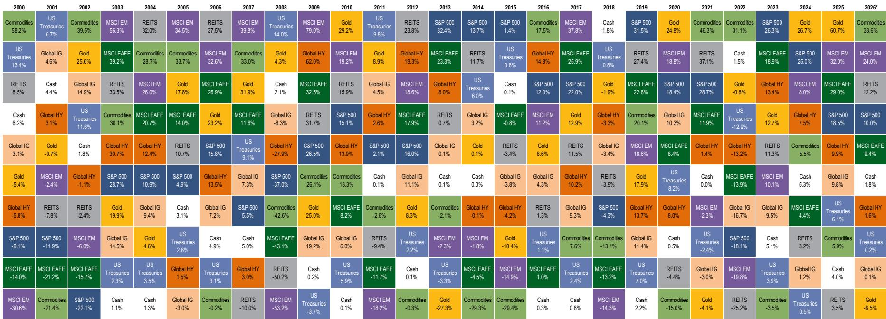
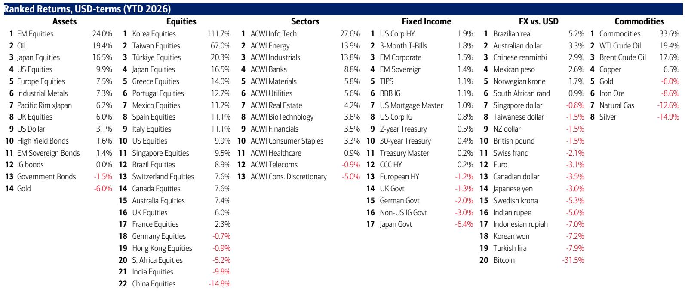
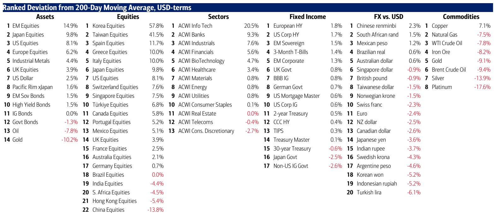

# The 250-Year Verdict Is In: American Exceptionalism Is an Empirical Fact, Not a Narrative

The most consequential investment debate of our era is not about interest rates, artificial intelligence, or geopolitics. It is about whether the structural forces that made US financial assets the best-performing store of value in modern history are intact or eroding. A global investment bank's recent report, drawing on data stretching back to the American Revolution, provides a definitive answer: the US economic and market machine has delivered returns that no other large developed nation can match, and the current cycle is reinforcing rather than undermining that dominance. But the data also reveals something far more uncomfortable for investors who have simply bought the index and held on.

The report's sweeping historical analysis shows that since 1776, US stocks have delivered a total annualized return of 8.7 percent, a figure that masks extraordinary volatility and periods of outright destruction. In the first century of US equity markets, stock prices were essentially flat. The first fifty years produced a 2 percent annualized loss. The narrative of relentless American ascent is true only in aggregate, not in any given decade. This distinction matters profoundly today, because the current market environment is exhibiting signals that have historically preceded sharp, though temporary, reversals.

We are living through what the report calls a "red, white, and boom" moment. Year-to-date performance tells a stark story of divergence: commodities are up 33.3 percent, oil has gained 19.2 percent, and international stocks have risen 12.0 percent. The S&P 500 has managed a respectable 9.3 percent. But beneath the surface, the rotation is violent. The second quarter saw the Philadelphia Semiconductor Index surge 88 percent, the KOSPI gain 64 percent, and biotech, small caps, and banks all post double-digit advances. Meanwhile, the war-and-inflation laggards tell a different story: energy down 15 percent, oil down 31 percent, defense down 16 percent, and China down 10 percent. Gold has fallen 14 percent in the quarter, and bitcoin has cratered 30 percent year-to-date.

This is not a market that is simply rising. It is a market that is reordering itself along lines of technological supremacy and fiscal dominance, and the historical data suggests this reordering has further to run.

## The 250-Year Data Proves US Equity Dominance, But Only for Those Who Survived the First Century

The report's most powerful contribution is its construction of the USA Top 100 index dating back to 1792, alongside the S&P 500 from 1871. The headline numbers are extraordinary. US stocks have delivered a 3.6 percent annualized price return and 8.7 percent total return over 250 years. The S&P 500, over its 150-year history, has done even better: 4.9 percent price return and 9.3 percent total return. Real total returns, adjusted for inflation, stand at 6.7 percent for both indices. These figures are unmatched by any other large, continuous equity market.

The so-what of this data is not simply that US stocks have been a good investment. It is that the US has systematically outperformed the United Kingdom, its closest comparator, on every material economic metric. US population growth has averaged 2.0 percent annually versus 0.8 percent for the UK. Nominal GDP growth has been 6.0 percent versus 5.8 percent. Real GDP growth has been 3.6 percent versus 2.1 percent. Even inflation, often cited as a US weakness, has averaged 2.5 percent versus 3.9 percent for the UK. The only area where the UK has an edge is the cost of government debt, with 10-year bond yields averaging 5.6 percent over 250 years versus 5.8 percent for the US.

This is not a story of luck or geography alone. It is a story of demographic dynamism, fiscal capacity, and the continuous reinvention of the economic base. The US government debt stock has grown at 5.8 percent per annum since 1780, a rate that would be terrifying in isolation but is sustainable because nominal GDP has grown at 6.0 percent. The US has effectively grown its way out of every debt cycle. That is the structural advantage that no other major economy has replicated.

But the report's data also contains a warning that is rarely discussed. In the first 50 years of US equity markets, from 1792 to 1842, stocks delivered a 2 percent annualized loss. The Panic of 1819 and the Panic of 1837 wiped out investors repeatedly. The market was dominated by a single stock, the First Bank of the United States, which at one point constituted over 80 percent of the Philadelphia Stock Exchange's market capitalization. It took the arrival of the railroad as a transformative technology and the expansion of the corporate base for equities to begin their long march upward.

The implication is clear: American exceptionalism is real, but it has never been a smooth ride. It has required surviving periods of concentrated risk, technological disruption, and financial panic. The current concentration in the Magnificent Seven, which the report notes has traded sideways for three straight quarters, may be the modern equivalent of that early 19th-century dominance by a single bank. The long-term trajectory is upward, but the medium-term path may involve significant rotation.

## The Bull and Bear Indicator Has Triggered a Sell Signal, and History Says Pay Attention

The report's most actionable near-term signal is the BofA Bull & Bear Indicator, which has risen to 9.5 from 9.1, triggering what the report describes as a sell signal on May 20th. This indicator, which combines hedge fund positioning, bond flows, and equity sector flows, has a specific and testable history. Since 2002, there have been 17 such sell signals. The average loss for global stocks over the subsequent two to three months has been 2 to 3 percent. The hit ratio, meaning the frequency with which stocks actually declined, has been approximately 60 percent. The maximum drawdowns have ranged from 15 to 20 percent.

The so-what here is not that a crash is imminent. A 60 percent hit ratio means that 40 percent of the time, stocks went up after the signal. The signal is a warning, not a prediction. But the composition of the indicator's rise matters. Hedge funds have been reducing S&P 500 futures shorts and reducing VIX futures longs, meaning they are positioning for lower volatility and higher prices. Bond inflows have been concentrated in high-yield, the riskiest part of fixed income. Equity inflows have been concentrated in technology and healthcare. This is the classic late-cycle behavior of a market that is fully priced and fully owned.

The report's weekly flow data reinforces this interpretation. In the most recent week, $55 billion flowed into cash, $29.1 billion into bonds, and there was a $13.9 billion outflow from stocks. The outflow from US equities was $17.2 billion, the largest since March 2026. Technology funds saw $14.3 billion in inflows and are on track for a record $152 billion inflow year-to-date. But energy saw its biggest outflow since July 2024, and materials saw its biggest outflow since March 2026. The market is not rotating out of tech; it is doubling down on tech while exiting everything that does not fit the AI narrative.

This is the kind of concentrated positioning that has historically preceded sharp reversals, even if the long-term trend remains intact. The question is whether the current rotation is the beginning of a broader broadening, or the final stage of a mania.

## The Treasuries Versus Gold Inflection Is the Most Important Macro Signal Most Investors Are Ignoring

The report includes a chart showing the price relative between the 20+ Year US Treasury ETF (TLT) and gold. This ratio has been in a persistent downtrend throughout the 2020s, reflecting the era of peak inflationary deglobalization. Gold has outperformed long-duration US government bonds by a wide margin as investors have priced in higher inflation, fiscal deterioration, and geopolitical risk.

But the report suggests this trend may be inflecting. The data does not explicitly say so, but the implication is that the 2020s bear market in Treasuries versus gold may be ending. If that is true, the implications for portfolio construction are enormous. A sustained rally in Treasuries relative to gold would imply that the market is beginning to price in a disinflationary outcome, or at least a stabilization of the fiscal trajectory. It would also imply that the real yield premium that US bonds offer over other developed market debt is becoming more attractive relative to gold's zero-yield status.

The so-what for investors is that the asset allocation framework that has worked since 2020, which is overweight real assets and underweight nominal bonds, may need to be reconsidered. The report's private client data shows that BofA's wealth management clients, who have $4.5 trillion in assets under management, are already acting on this view. They have been extending duration in US Treasuries, with the fifth straight week of outflows from T-bills and inflows to T-notes. They are buying materials and healthcare in ETFs while selling Japan, staples, and financials. Private client equity allocation stands at 65.4 percent, bond allocation at 17.6 percent, and cash at 9.8 percent. These are not aggressive numbers, but they are not defensive either. They suggest a portfolio that is positioned for a continuation of the current regime rather than a regime change.

The question the report raises but does not fully answer is whether the Treasuries versus gold inflection is a genuine regime change or just a pause within a longer-term trend. The answer depends on whether the US fiscal trajectory stabilizes, whether inflation remains sticky, and whether the AI-driven productivity boom is real enough to lower the debt-to-GDP ratio without austerity. These are open questions that the flow data cannot resolve.

## The Report's Data Raises a Strategic Question It Cannot Answer: Is the AI Trade Too Crowded or Just Getting Started?

The report's most striking flow data point is that technology funds are on track for a record $152 billion inflow in 2026. This is occurring even as the Magnificent Seven stocks have traded sideways for three consecutive quarters. The market is buying the AI theme through sector funds and ETFs even as the largest individual stocks have stalled. This is a classic pattern of thematic investing: the narrative becomes so powerful that investors buy the sector regardless of the price action of the largest constituents.

The report does not take a view on whether this is rational or not. It simply presents the data. But the strategic implication is clear. If the AI trade is genuinely transformative, then the sideways action in the mega-caps is a consolidation before the next leg higher, and the record inflows are early rather than late. If the AI trade is a bubble, then the sideways action is distribution, and the record inflows are the final wave of bag-holding before a correction.

The historical analogies are not comforting. The report's own data shows that the 1990s tech bubble saw similar patterns of concentration and inflows before the 2000-2002 crash. But it also shows that the 2010s FAANG trade saw similar patterns before a decade of outperformance. The difference is that in the 1990s, the earnings did not materialize to justify the valuations. In the 2010s, they did.

The data in this report is necessary for making that judgment, but it is not sufficient. The report tells you what flows are doing, but it does not tell you whether those flows are justified by fundamentals. That is the question that each investor must answer for themselves, and it is the reason why simply following the flow data without a fundamental framework is dangerous.

## A Decision Framework for Investors Using the Report's Data

This report provides three layers of data that can be used to construct a decision framework, but each layer requires interpretation rather than mechanical application.

The first layer is the long-term historical data. The 250-year record of US equity returns is the strongest argument for maintaining a structural overweight to US stocks. The data shows that the US has consistently outperformed on growth, innovation, and fiscal capacity. The decision rule from this layer is simple: do not bet against American equities as a long-term allocation.

The second layer is the cycle data. The Bull & Bear Indicator at 9.5, the record tech inflows, and the rotation out of energy and materials all suggest that the cycle is late. The decision rule from this layer is to reduce tactical exposure, raise cash, and prepare for a correction of 2 to 3 percent with a 60 percent probability, or 15 to 20 percent with a lower probability. This does not mean selling everything. It means trimming positions that have become extended and adding to hedges.

The third layer is the regime change data. The potential inflection in Treasuries versus gold, the private client shift from T-bills to T-notes, and the buying of materials and healthcare all suggest that the market is beginning to price in a different macro environment. The decision rule from this layer is to begin extending duration in fixed income and to add exposure to sectors that benefit from a disinflationary, productivity-driven expansion, such as healthcare and select industrials.

The challenge is that these three layers are in tension with each other. The long-term data says buy and hold US equities. The cycle data says reduce exposure. The regime change data says rotate into bonds and defensive sectors. Reconciling these tensions requires a view on whether the current cycle is the end of an old regime or the beginning of a new one. The report provides the data to inform that view, but it cannot make the decision for you.

## Join the Community to Read the Full Report and Review the Original Charts

The data and analysis presented here are drawn from a single weekly flow report, but the implications extend far beyond any single week. The 250-year historical series, the sector rotation patterns, and the Bull & Bear Indicator all tell a story that is both reassuring and unsettling. The US equity market has been the greatest wealth-creating machine in history, but it has never been a straight line. The current moment combines extreme long-term optimism with extreme short-term caution, and navigating that tension requires access to the full dataset and the original charts.

The report contains detailed tables on cumulative year-to-date flows by asset class, equity flows by region and sector, fixed income flows by category, and private client allocations over time. It also contains the full asset class quilt of total returns, which shows how different assets have ranked in performance every year since 2000. These charts are essential for understanding whether the current rotation is a blip or a trend, and they are not reproducible from the summary alone.

Join the community to read the full report and review the original charts. The data is too rich, and the questions it raises are too important, to rely on a single reading.

*This article is for learning and discussion only and does not constitute investment advice.*

Personal reading notes and learning share only. Not investment advice.

