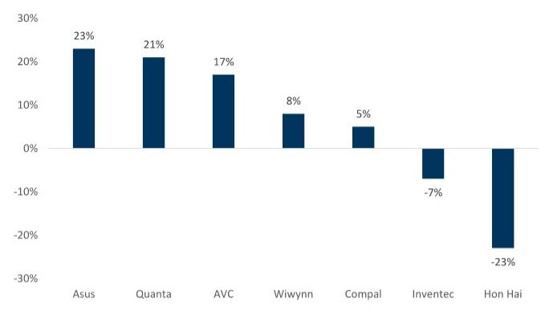
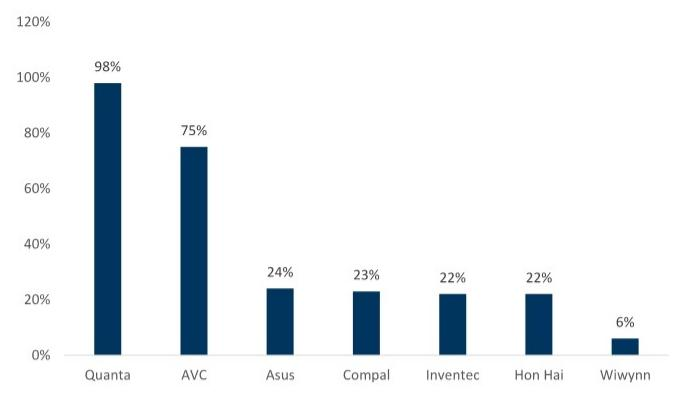
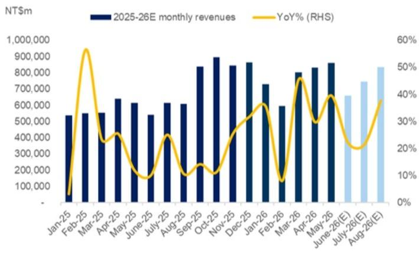
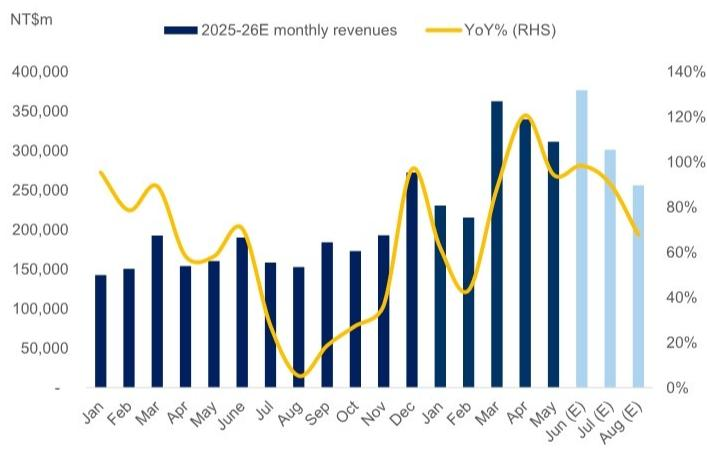
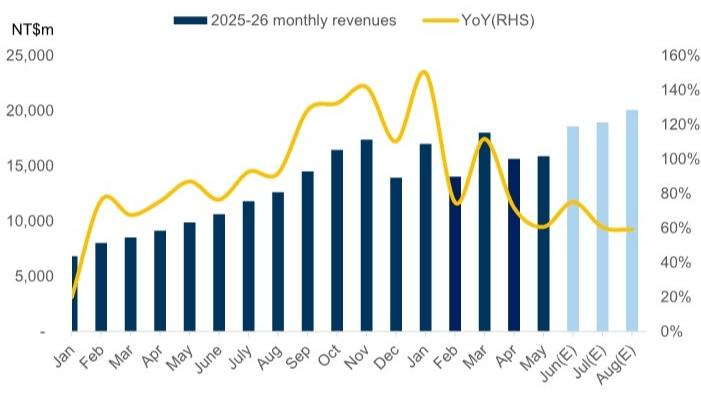
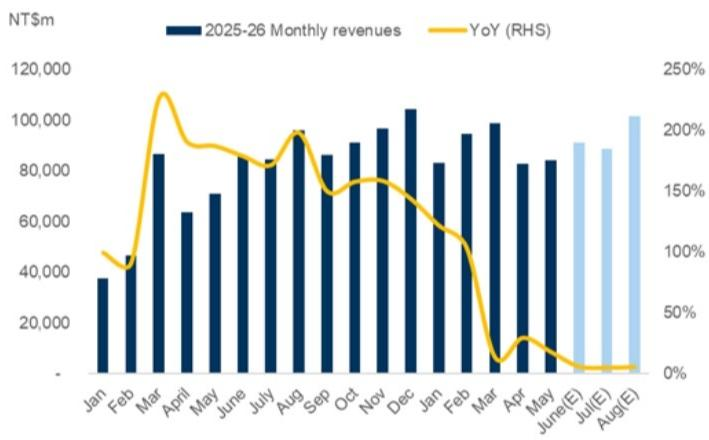
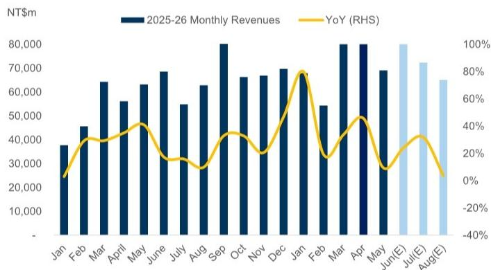
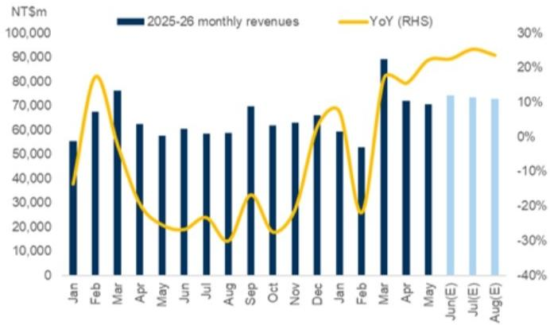

## Taiwan ODM/Brands: 3-month preview: June revenue flat MoM on avg but YoY remains strong; AI servers/smartphone new models key drivers

We preview 3-month revenues for the seven companies under our coverage in the AI server/PC supply chain and update our estimates for Quanta. Across the supply chain, we are positive on: (1) Apple's supply chain on the back of a ramp-up of new models with form factor changes (i.e., foldable phones in 2026, and the iPhone 20 in 2027) to support end demand; (2) AI server components riding on specification upgrades; and (3) ASIC AI servers' rising penetration rate.

Buy: Hon Hai, Wiwynn, AVC; Neutral: Quanta, Inventec, Compal, ASUS

On a MoM basis, we expect the average revenue growth of the seven companies to come in at +6%/-5%/+0% in Jun/Jul/Aug 2026 (Exhibit 1). We expect flat MoM growth in coming months, reflecting AI server ODMs undergoing model transition and PC consumption pull-in in 1H26 under high memory costs, which would weigh on PC supply chain shipment growth.

On a YoY basis, we expect the average revenue growth of the seven companies to come in at +39%/+37%/+29% in Jun/Jul/Aug 2026 (Exhibit 2), driven by the continuous ramp-up of AI servers, along with a PC product mix upgrade, new smartphone models, and high memory costs driving up the selling price.

Allen Chang  
+852-2978-2930 |  
allen.k.chang@gs.com  
GS (Asia) L.L.C.

Verena Jeng  
+852-2978-1681 | verena.jeng@gs.com  
GS (Asia) L.L.C.

Ting Song +852-2978-6466 | ting.song@gs.com GS (Asia) L.L.C.

Yifan Hu  
+852-2978-0996 | yifan.hu@gs.com  
GS (Asia) L.L.C.

Exhibit 1: Jun 2026E revenue MoM

  
Source: GS Global Investment Research  
Exhibit 2: Jun 2026E revenue YoY

  
Source: GS Global Investment Research

## Mar to Aug 2026 revenue trends for Taiwan server / PC names

Exhibit 3: Taiwan PC/server names monthly revenue summary

<table><tr><td rowspan="2"></td><td colspan="6">Rev YoY</td><td colspan="6">Rev MoM</td></tr><tr><td>Mar-26</td><td>Apr-26</td><td>May-26</td><td>Jun-26(E)</td><td>Jul-26(E)</td><td>Aug-26(E)</td><td>Mar-26</td><td>Apr-26</td><td>May-26</td><td>Jun-26(E)</td><td>Jul-26(E)</td><td>Aug-26(E)</td></tr><tr><td>Wiwynn</td><td>14%</td><td>30%</td><td>18%</td><td>6%</td><td>5%</td><td>6%</td><td>4%</td><td>-16%</td><td>2%</td><td>8%</td><td>-3%</td><td>14%</td></tr><tr><td>Quanta</td><td>88%</td><td>121%</td><td>94%</td><td>98%</td><td>90%</td><td>68%</td><td>68%</td><td>-6%</td><td>-8%</td><td>21%</td><td>-20%</td><td>-15%</td></tr><tr><td>Inventec</td><td>47%</td><td>37%</td><td>35%</td><td>22%</td><td>26%</td><td>2%</td><td>72%</td><td>-3%</td><td>-2%</td><td>-7%</td><td>-11%</td><td>-9%</td></tr><tr><td>Asus</td><td>34%</td><td>46%</td><td>9%</td><td>24%</td><td>32%</td><td>4%</td><td>58%</td><td>-5%</td><td>-16%</td><td>23%</td><td>-15%</td><td>-10%</td></tr><tr><td>Compal</td><td>17%</td><td>16%</td><td>22%</td><td>23%</td><td>25%</td><td>24%</td><td>69%</td><td>-19%</td><td>-2%</td><td>5%</td><td>-1%</td><td>-1%</td></tr><tr><td>Hon Hai</td><td>46%</td><td>30%</td><td>40%</td><td>22%</td><td>21%</td><td>38%</td><td>35%</td><td>4%</td><td>3%</td><td>-23%</td><td>13%</td><td>12%</td></tr><tr><td>AVC</td><td>112%</td><td>72%</td><td>61%</td><td>75%</td><td>60%</td><td>59%</td><td>29%</td><td>-13%</td><td>2%</td><td>17%</td><td>2%</td><td>6%</td></tr></table>

Source: Company data, GS Global Investment Research

Exhibit 4: Taiwan ODM notebook monthly shipments

<table><tr><td></td><td>May-25</td><td>June-25</td><td>July-25</td><td>Aug-25</td><td>Sep-25</td><td>Oct-25</td><td>Nov-25</td><td>Dec-25</td><td>Jan-26</td><td>Feb-26</td><td>Mar-26</td><td>Apr-26</td><td>May-26</td></tr><tr><td>Notebook shipments (m units)</td><td>10.6</td><td>13.0</td><td>10.8</td><td>11.2</td><td>12.0</td><td>10.1</td><td>10.4</td><td>11.8</td><td>8.4</td><td>7.0</td><td>13.8</td><td>9.1</td><td>9.3</td></tr><tr><td>Quanta</td><td>3.8</td><td>5.0</td><td>4.0</td><td>4.1</td><td>4.6</td><td>3.5</td><td>3.5</td><td>3.9</td><td>2.7</td><td>2.0</td><td>5.3</td><td>3.5</td><td>3.5</td></tr><tr><td>Compal</td><td>2.4</td><td>2.5</td><td>2.3</td><td>2.3</td><td>2.5</td><td>2.1</td><td>2.3</td><td>2.4</td><td>1.6</td><td>1.5</td><td>2.8</td><td>1.8</td><td>2.0</td></tr><tr><td>Inventec</td><td>1.8</td><td>2.1</td><td>1.7</td><td>1.8</td><td>1.9</td><td>1.6</td><td>1.7</td><td>2.0</td><td>1.7</td><td>1.5</td><td>2.2</td><td>1.5</td><td>1.5</td></tr><tr><td>Wistron</td><td>1.8</td><td>2.4</td><td>2.0</td><td>2.2</td><td>2.2</td><td>2.1</td><td>2.2</td><td>2.6</td><td>1.7</td><td>1.6</td><td>2.8</td><td>1.8</td><td>1.7</td></tr><tr><td>Pegatron</td><td>0.8</td><td>1.0</td><td>0.8</td><td>0.8</td><td>0.8</td><td>0.8</td><td>0.7</td><td>0.9</td><td>0.7</td><td>0.4</td><td>0.7</td><td>0.5</td><td>0.6</td></tr><tr><td colspan="14">YoY</td></tr><tr><td>Quanta</td><td>-5%</td><td>11%</td><td>18%</td><td>-5%</td><td>-6%</td><td>9%</td><td>-3%</td><td>-9%</td><td>-4%</td><td>-35%</td><td>8%</td><td>6%</td><td>-8%</td></tr><tr><td>Compal</td><td>-17%</td><td>-17%</td><td>-8%</td><td>-21%</td><td>-14%</td><td>-25%</td><td>-15%</td><td>4%</td><td>-30%</td><td>-29%</td><td>-3%</td><td>-18%</td><td>-17%</td></tr><tr><td>Inventec</td><td>6%</td><td>24%</td><td>0%</td><td>6%</td><td>6%</td><td>-6%</td><td>0%</td><td>0%</td><td>13%</td><td>-6%</td><td>16%</td><td>-12%</td><td>-17%</td></tr><tr><td>Wistron</td><td>6%</td><td>33%</td><td>25%</td><td>29%</td><td>16%</td><td>17%</td><td>29%</td><td>44%</td><td>13%</td><td>7%</td><td>47%</td><td>6%</td><td>-6%</td></tr><tr><td>Pegatron</td><td>6%</td><td>28%</td><td>-3%</td><td>-6%</td><td>0%</td><td>41%</td><td>12%</td><td>23%</td><td>15%</td><td>-26%</td><td>-4%</td><td>-14%</td><td>-26%</td></tr><tr><td colspan="14">MoM / QoQ</td></tr><tr><td>Quanta</td><td>15%</td><td>32%</td><td>-20%</td><td>2%</td><td>12%</td><td>-24%</td><td>0%</td><td>11%</td><td>-31%</td><td>-26%</td><td>165%</td><td>-34%</td><td>0%</td></tr><tr><td>Compal</td><td>9%</td><td>4%</td><td>-8%</td><td>0%</td><td>9%</td><td>-16%</td><td>10%</td><td>4%</td><td>-33%</td><td>-6%</td><td>87%</td><td>-36%</td><td>11%</td></tr><tr><td>Inventec</td><td>6%</td><td>17%</td><td>-19%</td><td>6%</td><td>6%</td><td>-16%</td><td>6%</td><td>18%</td><td>-15%</td><td>-12%</td><td>47%</td><td>-32%</td><td>0%</td></tr><tr><td>Wistron</td><td>6%</td><td>33%</td><td>-17%</td><td>10%</td><td>0%</td><td>-5%</td><td>5%</td><td>18%</td><td>-35%</td><td>-6%</td><td>75%</td><td>-36%</td><td>-6%</td></tr><tr><td>Pegatron</td><td>27%</td><td>28%</td><td>-24%</td><td>10%</td><td>0%</td><td>-6%</td><td>-10%</td><td>32%</td><td>-24%</td><td>-39%</td><td>59%</td><td>-22%</td><td>10%</td></tr></table>

Source: Company data

## Hon Hai (2317.TW, Buy, on APAC CL): AI servers remain key growth driver

Hon Hai's May revenue was +40% YoY/+3% MoM to NT\$859bn, or 5% higher than our previous estimates. We expect 2Q26E revenue to be +31% YoY/+11% QoQ to NT\$2.4 trillion. May continued MoM growth (+3%) off Apr's high base, reflecting solid demand for AI server racks despite the typically slow seasonality of traditional electronics products in 2Q. We expect Jun revenue to grow 22% YoY (or -23% MoM) considering the high base, which is in line with historical seasonality. We expect continued shipment growth of AI server racks to support 2Q/3Q26E growth ahead.

Exhibit 5: We model Hon Hai's Jun 2026 revenue at $+22\%$ YoY or $-23\%$ MoM Hon Hai's monthly/annual revenue

<table><tr><td></td><td>Apr 2026</td><td>May 2026</td><td>June 2026E</td><td>July 2026E</td><td>Aug 2026E</td><td>Sep 2026E</td><td>2Q26E</td><td>3Q26E</td></tr><tr><td>Revenues (NT$m)</td><td>832,098</td><td>859,409</td><td>659,861</td><td>745,642</td><td>835,120</td><td>1,377,695</td><td>2,351,368</td><td>2,958,457</td></tr><tr><td>YoY</td><td>30%</td><td>40%</td><td>22%</td><td>21%</td><td>38%</td><td>65%</td><td>31%</td><td>44%</td></tr><tr><td>MoM/QoQ</td><td>4%</td><td>3%</td><td>-23%</td><td>13%</td><td>12%</td><td>65%</td><td>11%</td><td>26%</td></tr><tr><td>GS estimates (NT$m)</td><td>819,812</td><td>815,456</td><td></td><td></td><td></td><td></td><td></td><td></td></tr><tr><td>Actual vs. GS</td><td>1%</td><td>5%</td><td></td><td></td><td></td><td></td><td></td><td></td></tr></table>

Revenue lines are actual results reported by the company.  
Source: Company data, GS Global Investment Research  
Exhibit 6: Hon Hai monthly revenues

  
Source: Company data, GS Global Investment Research

## Price Target Risks and Methodology – Hon Hai

Valuation methodology: We are Buy-rated on Hon Hai. Our 12-month target price of NT\$400 is based on a 21.0x 2026E P/E multiple, which is set in line with peers' PEG&M ratio (i.e., P/E vs. forward-year earnings growth and OPM).

Key downside risks: (1) slower-than-expected ramp-up of the AI server business; (2) weaker-than-expected EV total solution performance across EV assembly, design, software, and semis; (3) slower-than-expected ramp-up of capacity globally; and (4) fiercer-than-expected competition in the consumer electronics EMS business.

## Quanta (2382.TW, Neutral): AI server ramp-up while model transition and PC pull- in may weigh on 3Q26

Quanta's May revenue was down $8\%$ MoM, or $11\%$ below our estimate, reflecting the impact of the AI servers model transition and PC consumption pull-in under rising memory costs. The company's PC shipments in May declined $8\%$ YoY, or were flat MoM. We expect $21\%$ MoM revenue growth for Jun, considering the low base in May and improved PC consumption by the quarter-end. However, we expect the growth momentum to slow in Jul-Aug, given the AI server rack model transition in 3Q26E and a slowdown of PC shipments as consumption was pulled in in 1H26.

Exhibit 7: We model Quanta's Jun 2026E revenue at $+98\%$ YoY, or $+21\%$ MoM Quanta monthly/quarterly revenue summary

<table><tr><td></td><td>Apr-26</td><td>May-26</td><td>Jun-26(E)</td><td>Jul-26(E)</td><td>Aug-26(E)</td><td>Sep-26(E)</td><td>2Q26E</td><td>3Q26E</td></tr><tr><td>Rev (NT$m)</td><td>339,921</td><td>311,481</td><td>376,830</td><td>301,464</td><td>256,244</td><td>266,276</td><td>1,028,232</td><td>823,985</td></tr><tr><td>YoY</td><td>121%</td><td>94%</td><td>98%</td><td>90%</td><td>68%</td><td>45%</td><td>104%</td><td>66%</td></tr><tr><td>MoM/QoQ</td><td>-6%</td><td>-8%</td><td>21%</td><td>-20%</td><td>-15%</td><td>4%</td><td>27%</td><td>-20%</td></tr><tr><td>GS (NT$m)</td><td>257,590</td><td>350,119</td><td></td><td></td><td></td><td></td><td></td><td></td></tr><tr><td>Actual vs. GS</td><td>32%</td><td>-11%</td><td></td><td></td><td></td><td></td><td></td><td></td></tr></table>

Source: Company data, GS Global Investment Research  
Exhibit 8: Quanta monthly revenues

  
Source: Company data, GS Global Investment Research

## Price Target Risks and Methodology - Quanta

We are Neutral-rated on Quanta. Our 12-month target price of NT\$299 is based on an 11.4x 2027E P/E, which references PC/server peers' EPS growth vs. P/E multiple correlation. We see EPS growth as a major factor for the stock's performance.

Key upside/downside risks include: 1) stronger-/weaker-than-expected PC market recovery; 2) faster-/slower-than-expected AI server ramp-up; and 3) stronger-/weaker-than-expected demand for general servers.

## AVC (3017.TW, Buy): GPU and ASIC AI servers driving liquid cooling penetration rate

AVC's May revenue was flat MoM, or in line with our estimate. We expect the growth momentum to recover in Jun, considering the lower base in May, followed by sequential revenue growth in Jun-Sep, driven by (1) the ramp-up of liquid cooling components for new AI server racks, (2) a growing liquid cooling penetration rate in ASIC AI servers, and (3) the ramp-up of AVC's liquid cooling components for new ASIC AI servers.

Exhibit 9: AVC monthly/quarterly revenue summary

<table><tr><td></td><td>Apr-26</td><td>May-26</td><td>Jun-26E</td><td>Jul-26E</td><td>Aug-26E</td><td>Sep-26E</td><td>2Q26E</td><td>3Q26E</td></tr><tr><td>Rev (NT$m)</td><td>15,631</td><td>15,871</td><td>18,570</td><td>18,941</td><td>20,077</td><td>21,786</td><td>50,072</td><td>60,805</td></tr><tr><td>Rev YoY</td><td>72%</td><td>61%</td><td>75%</td><td>60%</td><td>59%</td><td>50%</td><td>69%</td><td>56%</td></tr><tr><td>Rev MoM / QoQ</td><td>-13%</td><td>2%</td><td>17%</td><td>2%</td><td>6%</td><td>9%</td><td>2%</td><td>21%</td></tr><tr><td>GS estimates (NT$m)</td><td>18,197</td><td>15,788</td><td></td><td></td><td></td><td></td><td></td><td></td></tr><tr><td>Act vs. GS</td><td>-14%</td><td>1%</td><td></td><td></td><td></td><td></td><td></td><td></td></tr></table>

Source: Company data, GS Global Investment Research

Exhibit 10: AVC monthly revenues  
  
Source: Company data, GS Global Investment Research

## Price Target Risks and Methodology - AVC

We are Buy-rated on AVC. Our 12-month target price for AVC is based on a near-term P/E, consistent with our Taiwan Technology coverage. We base our target price of NT\$3,536 on a target P/E multiple of 26.7x on our forward-year EPS (2027E). Our target P/E is derived from the correlation between P/E and EPS growth of its peers in technology hardware.

Key downside risks: (1) slower-than-expected adoption of liquid cooling; (2) lower-than-expected demand for AI servers; (3) fiercer-than-expected competition; and (4) slower-than-expected recovery of general servers.

## Wiwynn (6669.TW, Buy): ASIC AI servers support growth ahead

Wiwynn's May revenue was flat MoM, or $12\%$ below our estimate, due to the switch to a consignment business model for some server projects starting from Apr (read more). Despite the business model transition being set to result in lower revenues, GM is expected to improve, which would also ease the working capital burden in the long term. For the coming June revenue, we expect a sequential increase on strong general server demand from leading US CSPs, followed by $23\%$ QoQ growth in 3Q26 driven by an ASIC AI server ramp-up. We are positive on Wiwynn's leading market position in ASIC AI servers, diversifying into GPU AI server racks and riding on leading US CSPs' strong demand across general servers and AI servers.

Exhibit 11: We expect Wiwynn's Jun revenue growth to be +6% YoY/ +8% MoM

<table><tr><td></td><td>Apr-26</td><td>May-26</td><td>June-26(E)</td><td>July-26(E)</td><td>Aug-26(E)</td><td>Sep-26(E)</td><td>2Q26E</td><td>3Q26E</td></tr><tr><td>Rev (NT$m)</td><td>82,731</td><td>84,050</td><td>91,062</td><td>88,782</td><td>101,465</td><td>126,831</td><td>257,843</td><td>317,077</td></tr><tr><td>YoY</td><td>30%</td><td>18%</td><td>6%</td><td>5%</td><td>6%</td><td>47%</td><td>17%</td><td>19%</td></tr><tr><td>MoM&#x27; QoQ</td><td>-16%</td><td>2%</td><td>8%</td><td>-3%</td><td>14%</td><td>25%</td><td>-7%</td><td>23%</td></tr><tr><td>GS estimates (NT$m)</td><td>89,850</td><td>95,646</td><td></td><td></td><td></td><td></td><td></td><td></td></tr><tr><td>Act vs. GS</td><td>-8%</td><td>-12%</td><td></td><td></td><td></td><td></td><td></td><td></td></tr></table>

Source: Company data, GS Global Investment Research

Exhibit 12: Wiwynn monthly revenues  
  
Source: Company data, GS Global Investment Research

Price Target Risks and Methodology - Wiwynn

We are Buy-rated on Wiwynn with a 12-month TP of NT\$7,147. Our target price is based on 15.8x 2027E P/E, which is derived from PC/server peers' EPS growth vs. P/E multiple correlation. We see EPS growth as a major factor for the stock's performance.

Key downside risks: 1) weaker-than-expected AI server demand growth; 2) slower-than-expected recovery in general server demand; and 3) more severe competition in the server ODM market.

## ASUS (2357.TW, Neutral): PC product mix upgrade and rack-level AI servers supporting 2H26 growth

ASUS's May revenue was down 16% MoM, or 13% below our estimate, which we attribute to the high base in Mar-Apr (monthly revenue +58% / -5% MoM). We expect Jun revenue to grow at +23% YoY, considering customer pull-in at quarter-end. Despite ongoing memory cost pressures, we expect the mix upgrade towards AI PCs and a rack-level AI server ramp-up to support 2Q/3Q26E growth at 26%/12% YoY. We model Jul/ Aug revenues to grow 32%/4% YoY to NT\$72bn/ NT\$65bn, with a MoM decline on the high base.

Exhibit 13: We expect ASUS Jun revenue to grow +24% YoY/+23% MoM to NT\$85bn
ASUS monthly/quarterly revenues

<table><tr><td></td><td>Apr-26</td><td>May-26</td><td>Jun-26E</td><td>Jul-26E</td><td>Aug-26E</td><td>Sep-26E</td><td>2Q26E</td><td>3Q26E</td></tr><tr><td>Rev (NT$m)</td><td>81,915</td><td>69,094</td><td>85,089</td><td>72,325</td><td>65,093</td><td>86,226</td><td>236,098</td><td>223,645</td></tr><tr><td>Rev YoY</td><td>46%</td><td>9%</td><td>24%</td><td>32%</td><td>4%</td><td>4%</td><td>26%</td><td>12%</td></tr><tr><td>Rev MoM / QoQ</td><td>-5%</td><td>-16%</td><td>23%</td><td>-15%</td><td>-10%</td><td>32%</td><td>22%</td><td>-5%</td></tr><tr><td>GS estimates (NT$m)</td><td>60,259</td><td>79,458</td><td></td><td></td><td></td><td></td><td></td><td></td></tr><tr><td>Act vs. GS</td><td>36%</td><td>-13%</td><td></td><td></td><td></td><td></td><td></td><td></td></tr></table>

Source: Company data, GS Global Investment Research

Exhibit 14: ASUS monthly revenue trend  
  
Source: Company data, GS Global Investment Research

## Price Target Risks and Methodology - Asus

We are Neutral-rated on ASUS with a 12-month target price of NT\$1,082. Our target price is based on 15.8x 2027E P/E, which is derived from brand makers' average ratio of 2027E P/E to 2028E NI YoY and OPM. We see EPS growth and OPM as major factors for the stock's share performance.

Key upside/downside risks include: 1) stronger / weaker-than-expected PC market growth; 2) faster / slower-than-expected AI and gaming PC growth; and 3) faster / slower-than-expected AI server ramp-up.

## Compal (2324.TW, Neutral): Global capacity ramping up to support AI servers

Compal's May revenue was flat MoM, or $9\%$ higher than our estimate. Compal's PC shipments in May increased $11\%$ MoM to 2mn units, and management expects QoQ growth in 2Q-3Q26. We expect MoM revenue growth in Jun, driven by customers' pull-in by quarter-end, followed by slight MoM declines in Jul-Aug, considering the high base in Jun. Overall, we expect 2Q / 3Q26E revenues to grow at $20\% / 32\%$ YoY, supported by Compal's ongoing revenue mix diversification, and its new US plant, expected to start production by the end of 2Q26 (link).

Exhibit 15: Compal 3-month revenue preview

<table><tr><td></td><td>Apr-26</td><td>May-26</td><td>Jun-26(E)</td><td>Jul-26(E)</td><td>Aug-26(E)</td><td>Sep-26(E)</td><td>2Q26E</td><td>3Q26E</td></tr><tr><td>Rev (NT$m)</td><td>71,979</td><td>70,462</td><td>74,209</td><td>73,467</td><td>72,732</td><td>100,533</td><td>216,650</td><td>246,733</td></tr><tr><td>Rev YoY</td><td>16%</td><td>22%</td><td>23%</td><td>25%</td><td>24%</td><td>44%</td><td>20%</td><td>32%</td></tr><tr><td>Rev Mom / QoQ</td><td>-19%</td><td>-2%</td><td>5%</td><td>-1%</td><td>-1%</td><td>38%</td><td>8%</td><td>14%</td></tr><tr><td>GS estimates(NT$m)</td><td>64,222</td><td>64,543</td><td></td><td></td><td></td><td></td><td></td><td></td></tr><tr><td>Act vs. GS</td><td>12%</td><td>9%</td><td></td><td></td><td></td><td></td><td></td><td></td></tr></table>

Source: Company data, GS Global Investment Research

Exhibit 16: Compal monthly revenues and YoY trend (RHS)  
  
Source: Company data, GS Global Investment Research

## Price Target Risks and Methodology - Compal

We are Neutral-rated on Compal with a 12-month target price of NT\$39.5. Our target price is based on 13.6x 2027E P/E, which is derived from PC/server peers' EPS growth vs. P/E multiple correlation. We see EPS growth and market re-rating for ODM companies as major factors for the stock's performance.

Key upside/downside risks: 1) stronger-/weaker-than-expected PC market recovery; 2) faster-/slower-than-expected AI server ramp-up; and 3) stronger/weaker-than-expected demand for tablets.

## Inventec (2356.TW, Neutral): Server business in expansion

Inventec's May revenue was up 35% YoY, or 30% above our estimate, which management attributes to the strong end demand for both AI and general servers on the global AI trend. We model sequential revenue declines for Jun-Aug, considering the PC consumption pull-in in 1H26 and rack-level AI servers entering model transition. Nevertheless, our estimate still show YoY growth for Inventec's Jun-Aug revenues, supported by its AI server capacity ramp up in the US (e.g., L10 / L11 assembly). Overall, we expect 2Q/3Q26E revenues to grow at 31%/10% YoY.

Exhibit 17: Inventec monthly revenue preview

<table><tr><td></td><td>Apr-26</td><td>May-26</td><td>Jun-26 (E)</td><td>Jul-26 (E)</td><td>Aug-26 (E)</td><td>Sep-26 (E)</td><td>2Q26E</td><td>3Q26E</td></tr><tr><td>Rev (NT$m)</td><td>84,787</td><td>82,808</td><td>77,003</td><td>68,533</td><td>62,365</td><td>63,552</td><td>244,598</td><td>194,450</td></tr><tr><td>YoY</td><td>37%</td><td>35%</td><td>22%</td><td>26%</td><td>2%</td><td>5%</td><td>31%</td><td>10%</td></tr><tr><td>MoM/QoQ</td><td>-3%</td><td>-2%</td><td>-7%</td><td>-11%</td><td>-9%</td><td>2%</td><td>22%</td><td>-21%</td></tr><tr><td>GS (NT$m)</td><td>63,046</td><td>63,676</td><td></td><td></td><td></td><td></td><td></td><td></td></tr><tr><td>Actual vs. GS</td><td>34%</td><td>30%</td><td></td><td></td><td></td><td></td><td></td><td></td></tr></table>

Source: Company data, GS Global Investment Research

Exhibit 18: Inventec May revenue up $35\%$ YoY

<table><tr><td></td><td>Apr-26</td><td>May-26</td><td>Jun-26 (E)</td><td>Jul-26 (E)</td><td>Aug-26 (E)</td><td>Sep-26 (E)</td><td>2Q26E</td><td>3Q26E</td></tr><tr><td>Rev (NT$m)</td><td>84,787</td><td>82,808</td><td>77,003</td><td>68,533</td><td>62,365</td><td>63,552</td><td>244,598</td><td>194,450</td></tr><tr><td>YoY</td><td>37%</td><td>35%</td><td>22%</td><td>26%</td><td>2%</td><td>5%</td><td>31%</td><td>10%</td></tr><tr><td>MoM/QoQ</td><td>-3%</td><td>-2%</td><td>-7%</td><td>-11%</td><td>-9%</td><td>2%</td><td>22%</td><td>-21%</td></tr><tr><td>GS (NT$m)</td><td>63,046</td><td>63,676</td><td></td><td></td><td></td><td></td><td></td><td></td></tr><tr><td>Actual vs. GS</td><td>34%</td><td>30%</td><td></td><td></td><td></td><td></td><td></td><td></td></tr></table>

Source: Company data, GS Global Investment Research

## Price Target Risks and Methodology - Inventec

We are Neutral-rated on Inventec with a 12-month target price of NT\$56.0. Our target price is based on 13.6x 2027E P/E, which is derived from PC/server peers' EPS growth vs. P/E multiple correlation. We see EPS growth as a major factor for the stock's performance.

Key upside/downside risks: 1) stronger-/weaker-than-expected PC market recovery; 2) faster-/slower-than-expected AI server ramp-up; and 3) stronger-/weaker-than-expected demand for general servers.

## Disclosure Appendix

## Reg AC

We, Allen Chang, Verena Jeng, Ting Song and Yifan Hu, hereby certify that all of the views expressed in this report accurately reflect our personal views about the subject company or companies and its or their securities. We also certify that no part of our compensation was, is or will be, directly or indirectly, related to the specific recommendations or views expressed in this report.

Unless otherwise stated, the individuals listed on the cover page of this report are analysts in GS' Global Investment Research division.

Contributing Authors: Allen Chang GS (Asia) L.L.C., Verena Jeng GS (Asia) L.L.C., Ting Song GS (Asia) L.L.C., Yifan Hu GS (Asia) L.L.C..

Unless otherwise stated, the individuals listed in the Contributing Authors disclosure of this report are analysts in GS' Global Investment Research division.

## GS Factor Profile

The GS Factor Profile provides investment context for a stock by comparing key attributes to the market (i.e. our universe of rated stocks) and its sector peers. The four key attributes depicted are: Growth, Financial Returns, Multiple (e.g. valuation) and Integrated (a composite of Growth, Financial Returns and Multiple). Growth, Financial Returns and Multiple are calculated by using normalized ranks for specific metrics for each stock. The normalized ranks for the metrics are then averaged and converted into percentiles for the relevant attribute. The precise calculation of each metric may vary depending on the fiscal year, industry and region, but the standard approach is as follows:

Growth is based on a stock's forward-looking sales growth, EBITDA growth and EPS growth (for financial stocks, only EPS and sales growth), with a higher percentile indicating a higher growth company. Financial Returns is based on a stock's forward-looking ROE, ROCE and CROCI (for financial stocks, only ROE), with a higher percentile indicating a company with higher financial returns. Multiple is based on a stock's forward-looking P/E, P/B, price/dividend (P/D), EV/EBITDA, EV/FCF and EV/Debt Adjusted Cash Flow (DACF) (for financial stocks, only P/E, P/B and P/D), with a higher percentile indicating a stock trading at a higher multiple. The Integrated percentile is calculated as the average of the Growth percentile, Financial Returns percentile and (100% - Multiple percentile).

Financial Returns and Multiple use the GS analyst forecasts at the fiscal year-end at least three quarters in the future. Growth uses inputs for the fiscal year at least seven quarters in the future compared with the year at least three quarters in the future (on a per-share basis for all metrics).

For a more detailed description of how we calculate the GS Factor Profile, please contact your GS representative.

## M&A Rank

Across our global coverage, we examine stocks using an M&A framework, considering both qualitative factors and quantitative factors (which may vary across sectors and regions) to incorporate the potential that certain companies could be acquired. We then assign a M&A rank as a means of scoring companies under our rated coverage from 1 to 3, with 1 representing high (30%-50%) probability of the company becoming an acquisition target, 2 representing medium (15%-30%) probability and 3 representing low (0%-15%) probability. For companies ranked 1 or 2, in line with our standard departmental guidelines we incorporate an M&A component into our target price. M&A rank of 3 is considered immaterial and therefore does not factor into our price target, and may or may not be discussed in research.

## Quantum

Quantum is GS' proprietary database providing access to detailed financial statement histories, forecasts and ratios. It can be used for in-depth analysis of a single company, or to make comparisons between companies in different sectors and markets.

## Disclosures

## Rating and pricing information

AVC (Buy, NT\$2,740.00), Asus (Neutral, NT\$667.00), Compal (Neutral, NT\$34.80), Hon Hai (Buy, NT\$239.00), Inventec (Neutral, NT\$67.20), Quanta (Neutral, NT\$369.00) and Wiwynn (Buy, NT\$5,200.00)

The rating(s) for AVC, Asus, Compal, Hon Hai, Inventec, Quanta and Wiwynn is/are relative to the other companies in its/their coverage universe: AAC, ACM Research, AMEC, ASMPT, AVC, AccoTest, Anji Micro, Asus, Auras, BOE, BYDE, Biren, CR Micro, Cambricon, Chenbro, China Mobile (HK), China Telecom, China Tower Corp., China Unicom, Chinasoft Intl, Compal, Desay SV, E Ink, E-Town Semis, EHang, Empyrean, Eoptolink, Fositek, Foxconn Industrial Internet, Gigabyte, Gigadevice, Glodon Co., HTC Corp., Hikvision, Hon Hai, Horizon Robotics, Hua Hong, Huace Navigation, Huaqin Co.(A), Huaqin Co.(H), Hwatsing, Innolight, Inspur, Insta360, Inventec, JCET, Kematek, King Slide, Kingdee, Kingsoft Office, LandMark, Largan, Lenovo, Lingyi, Maxscend, Meitu, MetaX, Mitac, Montage (A), Montage (H), NAURA, NSIG, Nexchip, OmniVision, Pegatron, Pony AI Inc. (ADR), Pony AI Inc. (H), Quanta, RoboTechnik, Ruijie Networks, SG Micro, SICC, SMIC (A), SMIC (H), SZS, Sangfor, SenseTime, Shengyi Tech, Shennan Circuits, StarPower, Sunny Optical, TFC Optical, Thundersoft, Tongyu Communication, Transsion, UMT, UNIS, VPEC, Vanchip, VeriSilicon, Victory Giant, WNC, WUS, WeRide, Wistron, Wiwynn, YJ Semitech, YOFC, Yonyou, ZTE (A), ZTE (H), iFlytek

## Company-specific regulatory disclosures

Compendium report: please see disclosures at https://www.gs.com/research/hedge.html. Disclosures applicable to the companies included in this compendium can be found in the latest relevant published research

## Distribution of ratings/investment banking relationships

GS Investment Research global Equity coverage universe

<table><tr><td rowspan="2"></td><td colspan="3">Rating Distribution</td><td colspan="3">Investment Banking Relationships</td></tr><tr><td>Buy</td><td>Hold</td><td>Sell</td><td>Buy</td><td>Hold</td><td>Sell</td></tr><tr><td>Global</td><td>50%</td><td>34%</td><td>16%</td><td>65%</td><td>60%</td><td>45%</td></tr></table>

As of April 1, 2026, GS Global Investment Research had investment ratings on 3,074 equity securities. GS assigns stocks as Buys and Sells on various regional Investment Lists; stocks not so assigned are deemed Neutral. Such assignments equate to Buy, Hold and Sell for the purposes of the above disclosure required by the FINRA Rules. See 'Ratings, Coverage universe and related definitions' below. The Investment Banking

Relationships chart reflects the percentage of subject companies within each rating category for whom GS has provided investment banking services within the previous twelve months.

## Price target and rating history chart(s)

Compendium report: please see disclosures at https://www.gs.com/research/hedge.html. Disclosures applicable to the companies included in this compendium can be found in the latest relevant published research

## Target price history table(s)

<table><tr><td colspan="3">Hon Hai (2317.TW)</td><td colspan="3">Quanta (2382.TW)</td></tr><tr><td>Date of report</td><td>Target price (NT$)</td><td>Closing price (NT$)</td><td>Date of report</td><td>Target price (NT$)</td><td>Closing price (NT$)</td></tr><tr><td>15-Oct-25</td><td>400.00</td><td>206.50</td><td>01-Oct-25</td><td>299.00</td><td>286.50</td></tr><tr><td>14-Aug-25</td><td>263.00</td><td>199.50</td><td>06-Apr-25</td><td>273.00</td><td>233.00</td></tr><tr><td>28-Jun-25</td><td>242.00</td><td>165.00</td><td>24-Mar-25</td><td>293.00</td><td>249.50</td></tr><tr><td>15-May-25</td><td>233.00</td><td>159.50</td><td>27-Feb-25</td><td>371.00</td><td>250.50</td></tr><tr><td>06-Apr-25</td><td>205.00</td><td>153.50</td><td>09-Feb-25</td><td>372.00</td><td>252.00</td></tr><tr><td>24-Mar-25</td><td>220.00</td><td>163.00</td><td>31-Jan-25</td><td>380.00</td><td>-</td></tr><tr><td>09-Feb-25</td><td>236.00</td><td>178.00</td><td>09-Dec-24</td><td>419.00</td><td>296.00</td></tr><tr><td>31-Jan-25</td><td>239.00</td><td>-</td><td>14-Nov-24</td><td>413.00</td><td>314.50</td></tr><tr><td>14-Nov-24</td><td>263.00</td><td>211.50</td><td>08-Oct-24</td><td>410.00</td><td>265.50</td></tr><tr><td>05-Nov-24</td><td>259.00</td><td>214.00</td><td>09-Aug-24</td><td>408.00</td><td>250.00</td></tr><tr><td>20-Jun-24</td><td>257.00</td><td>217.50</td><td>09-Jul-24</td><td>405.00</td><td>336.00</td></tr><tr><td>28-May-24</td><td>227.00</td><td>185.50</td><td>28-Jun-24</td><td>386.00</td><td>312.00</td></tr><tr><td>06-May-24</td><td>201.00</td><td>167.50</td><td>15-May-24</td><td>383.00</td><td>287.00</td></tr><tr><td>24-Mar-24</td><td>172.00</td><td>145.50</td><td>01-Apr-24</td><td>365.00</td><td>282.50</td></tr><tr><td>05-Feb-24</td><td>152.00</td><td>101.50</td><td>04-Feb-24</td><td>329.00</td><td>253.00</td></tr><tr><td>14-Nov-23</td><td>150.00</td><td>100.00</td><td>20-Jan-24</td><td>299.00</td><td>240.00</td></tr><tr><td>05-Oct-23</td><td>149.00</td><td>103.50</td><td>15-Dec-23</td><td>272.00</td><td>202.50</td></tr><tr><td>13-Sep-23</td><td>147.27</td><td>106.00</td><td>11-Nov-23</td><td>270.00</td><td>213.50</td></tr><tr><td>14-Aug-23</td><td>148.00</td><td>110.00</td><td>03-Oct-23</td><td>282.00</td><td>248.50</td></tr><tr><td>19-Jul-23</td><td>151.00</td><td>108.50</td><td></td><td></td><td></td></tr></table>

Asus (2357.TW)  
AVC (3017.TW)

<table><tr><td>Date of report</td><td>Target price (NT$)</td><td>Closing price (NT$)</td><td>Date of report</td><td>Target price (NT$)</td><td>Closing price (NT$)</td></tr><tr><td>06-Jun-26</td><td>1,082.00</td><td>900.00</td><td>26-Apr-26</td><td>3,536.00</td><td>2,945.00</td></tr><tr><td>13-May-26</td><td>690.10</td><td>663.00</td><td>15-Mar-26</td><td>2,259.00</td><td>1,865.00</td></tr><tr><td>10-Mar-26</td><td>611.00</td><td>531.00</td><td>04-Feb-26</td><td>1,982.00</td><td>1,675.00</td></tr><tr><td>17-Dec-25</td><td>672.00</td><td>577.00</td><td>12-Nov-25</td><td>1,734.00</td><td>1,505.00</td></tr><tr><td>01-Oct-25</td><td>854.00</td><td>676.00</td><td>28-Oct-25</td><td>1,516.00</td><td>1,300.00</td></tr><tr><td>13-Aug-25</td><td>842.00</td><td>640.00</td><td>07-Oct-25</td><td>1,324.00</td><td>1,150.00</td></tr><tr><td>28-Jul-25</td><td>856.00</td><td>662.00</td><td>13-Aug-25</td><td>1,323.00</td><td>1,120.00</td></tr><tr><td>14-Jun-25</td><td>849.00</td><td>684.00</td><td>11-Aug-25</td><td>1,153.00</td><td>1,080.00</td></tr><tr><td>13-May-25</td><td>784.00</td><td>608.00</td><td>21-Jul-25</td><td>1,007.00</td><td>872.00</td></tr><tr><td>06-Apr-25</td><td>775.00</td><td>604.00</td><td>30-Jun-25</td><td>878.00</td><td>743.00</td></tr><tr><td>11-Mar-25</td><td>814.00</td><td>654.00</td><td>13-May-25</td><td>779.00</td><td>563.00</td></tr><tr><td>09-Dec-24</td><td>825.00</td><td>608.00</td><td>06-Apr-25</td><td>685.00</td><td>466.00</td></tr><tr><td>09-Nov-24</td><td>794.00</td><td>621.00</td><td>24-Mar-25</td><td>707.00</td><td>520.00</td></tr><tr><td>10-Oct-24</td><td>703.00</td><td>577.00</td><td>09-Feb-25</td><td>772.00</td><td>549.00</td></tr><tr><td>08-Aug-24</td><td>691.00</td><td>502.00</td><td>31-Jan-25</td><td>826.00</td><td>-</td></tr><tr><td>10-Jul-24</td><td>690.00</td><td>508.00</td><td>10-Jan-25</td><td>840.00</td><td>549.00</td></tr><tr><td>28-Jun-24</td><td>688.00</td><td>498.00</td><td>14-Nov-24</td><td>984.00</td><td>685.00</td></tr><tr><td>28-May-24</td><td>681.00</td><td>527.00</td><td>11-Aug-24</td><td>983.00</td><td>568.00</td></tr><tr><td>16-May-24</td><td>639.00</td><td>516.00</td><td>29-May-24</td><td>1,026.00</td><td>811.00</td></tr><tr><td>18-Mar-24</td><td>563.00</td><td>408.50</td><td>16-May-24</td><td>908.00</td><td>651.00</td></tr><tr><td>09-Jan-24</td><td>566.00</td><td>455.00</td><td></td><td></td><td></td></tr><tr><td>16-Nov-23</td><td>506.00</td><td>380.50</td><td></td><td></td><td></td></tr><tr><td>03-Oct-23</td><td>522.00</td><td>366.50</td><td></td><td></td><td></td></tr></table>

<table><tr><td colspan="3">Wiwynn (6669.TW)</td><td colspan="3">Inventec (2356.TW)</td></tr><tr><td>Date of report</td><td>Target price (NT$)</td><td>Closing price (NT$)</td><td>Date of report</td><td>Target price (NT$)</td><td>Closing price (NT$)</td></tr><tr><td>07-May-26</td><td>7,147.00</td><td>4,880.00</td><td>19-Jun-26</td><td>56.00</td><td>67.70</td></tr><tr><td>31-Dec-25</td><td>6,400.00</td><td>4,485.00</td><td>01-Dec-25</td><td>49.00</td><td>44.05</td></tr><tr><td>08-Nov-25</td><td>6,300.00</td><td>4,075.00</td><td>23-Oct-25</td><td>48.60</td><td>45.85</td></tr><tr><td>17-Oct-25</td><td>6,000.00</td><td>3,785.00</td><td>28-Jul-25</td><td>46.30</td><td>43.75</td></tr><tr><td>14-Oct-25</td><td>5,400.00</td><td>3,510.00</td><td>28-Jun-25</td><td>46.00</td><td>42.50</td></tr><tr><td>24-Sep-25</td><td>5,000.00</td><td>3,080.00</td><td>08-Jun-25</td><td>45.70</td><td>41.10</td></tr><tr><td>11-Aug-25</td><td>4,608.00</td><td>3,175.00</td><td>06-Apr-25</td><td>44.67</td><td>42.85</td></tr><tr><td>28-Jul-25</td><td>4,078.00</td><td>2,600.00</td><td>11-Mar-25</td><td>48.00</td><td>47.80</td></tr><tr><td>06-Jun-25</td><td>3,838.00</td><td>2,465.00</td><td>01-Mar-25</td><td>52.00</td><td>46.50</td></tr><tr><td>29-May-25</td><td>3,656.00</td><td>2,420.00</td><td>31-Jan-25</td><td>50.00</td><td>-</td></tr><tr><td>11-May-25</td><td>3,621.00</td><td>2,200.00</td><td>06-Dec-24</td><td>52.95</td><td>50.50</td></tr><tr><td>09-Feb-25</td><td>3,568.00</td><td>2,190.00</td><td>13-Nov-24</td><td>51.90</td><td>51.00</td></tr><tr><td>31-Jan-25</td><td>3,525.00</td><td>-</td><td>22-Oct-24</td><td>53.16</td><td>46.00</td></tr><tr><td>16-Dec-24</td><td>3,600.00</td><td>2,500.00</td><td>11-Oct-24</td><td>54.30</td><td>44.40</td></tr><tr><td>13-Nov-24</td><td>3,192.00</td><td>2,140.00</td><td>17-Sep-24</td><td>55.40</td><td>43.55</td></tr><tr><td>08-Oct-24</td><td>3,140.00</td><td>1,745.00</td><td>02-Sep-24</td><td>60.30</td><td>45.45</td></tr><tr><td>13-Aug-24</td><td>3,185.00</td><td>1,950.00</td><td>29-Jul-24</td><td>63.00</td><td>47.00</td></tr><tr><td>29-Jul-24</td><td>3,359.00</td><td>1,900.00</td><td>28-Jun-24</td><td>69.10</td><td>55.80</td></tr><tr><td>28-Jun-24</td><td>3,527.00</td><td>2,645.00</td><td>15-Apr-24</td><td>68.50</td><td>56.00</td></tr><tr><td>29-May-24</td><td>3,483.00</td><td>2,640.00</td><td>14-Feb-24</td><td>63.90</td><td>-</td></tr><tr><td>12-May-24</td><td>3,110.00</td><td>2,405.00</td><td>23-Jan-24</td><td>57.70</td><td>57.20</td></tr><tr><td>11-Mar-24</td><td>3,155.00</td><td>2,430.00</td><td>15-Dec-23</td><td>56.70</td><td>48.40</td></tr><tr><td>04-Feb-24</td><td>2,782.00</td><td>2,310.00</td><td>29-Nov-23</td><td>50.00</td><td>41.60</td></tr><tr><td>23-Jan-24</td><td>2,460.00</td><td>2,220.00</td><td>19-Nov-23</td><td>52.00</td><td>42.65</td></tr><tr><td>19-Jan-24</td><td>2,173.00</td><td>1,990.00</td><td>03-Oct-23</td><td>56.00</td><td>50.60</td></tr><tr><td>29-Nov-23</td><td>2,120.00</td><td>1,780.00</td><td></td><td></td><td></td></tr><tr><td>08-Nov-23</td><td>2,129.00</td><td>1,805.00</td><td></td><td></td><td></td></tr><tr><td>03-Oct-23</td><td>1,879.00</td><td>1,595.00</td><td></td><td></td><td></td></tr></table>

Compal (2324.TW)  
Date of report Target price (NT\$) Closing price (NT\$)

<table><tr><td>12-Jun-26</td><td>39.50</td><td>36.35</td></tr><tr><td>24-Nov-25</td><td>34.70</td><td>28.70</td></tr><tr><td>28-Oct-25</td><td>36.60</td><td>34.50</td></tr><tr><td>01-Oct-25</td><td>32.10</td><td>31.75</td></tr><tr><td>20-Aug-25</td><td>28.10</td><td>27.50</td></tr><tr><td>28-Jul-25</td><td>29.80</td><td>30.10</td></tr><tr><td>30-May-25</td><td>32.60</td><td>28.80</td></tr><tr><td>30-Apr-25</td><td>36.94</td><td>27.35</td></tr><tr><td>06-Apr-25</td><td>36.94</td><td>32.40</td></tr><tr><td>01-Apr-25</td><td>40.00</td><td>33.10</td></tr><tr><td>01-Mar-25</td><td>41.00</td><td>38.80</td></tr><tr><td>13-Nov-24</td><td>39.60</td><td>37.85</td></tr><tr><td>15-Oct-24</td><td>40.10</td><td>35.10</td></tr><tr><td>17-Sep-24</td><td>40.50</td><td>34.15</td></tr><tr><td>10-Jul-24</td><td>40.90</td><td>34.90</td></tr><tr><td>28-Jun-24</td><td>43.00</td><td>34.70</td></tr><tr><td>18-May-24</td><td>43.30</td><td>37.10</td></tr><tr><td>05-Mar-24</td><td>42.00</td><td>37.80</td></tr><tr><td>23-Jan-24</td><td>38.80</td><td>37.55</td></tr><tr><td>15-Dec-23</td><td>35.40</td><td>33.05</td></tr><tr><td>19-Nov-23</td><td>32.20</td><td>30.35</td></tr><tr><td>03-Oct-23</td><td>32.00</td><td>30.90</td></tr></table>

Price targets shown in table(s) are unadjusted for corporate actions.

## Regulatory disclosures

## Disclosures required by United States laws and regulations

See company-specific regulatory disclosures above for any of the following disclosures required as to companies referred to in this report: manager or co-manager in a pending transaction; 1% or other ownership; compensation for certain services; types of client relationships; managed/co-managed public offerings in prior periods; directorships; for equity securities, market making and/or specialist role. GS trades or may trade as a

principal in debt securities (or in related derivatives) of issuers discussed in this report.

The following are additional required disclosures: Ownership and material conflicts of interest: GS policy prohibits its analysts, professionals reporting to analysts and members of their households from owning securities of any company in the analyst's area of coverage. Analyst compensation: Analysts are paid in part based on the profitability of GS, which includes investment banking revenues. Analyst as officer or director: GS policy generally prohibits its analysts, persons reporting to analysts or members of their households from serving as an officer, director or advisor of any company in the analyst's area of coverage. Non-U.S. Analysts: Non-U.S. analysts may not be associated persons of GS & Co. LLC and therefore may not be subject to FINRA Rule 2241 or FINRA Rule 2242 restrictions on communications with a subject company, public appearances and trading in securities covered by the analysts.

Additional disclosures required under the laws and regulations of jurisdictions other than the United States
The following disclosures are those required by the jurisdiction indicated, except to the extent already made above pursuant to United States laws and regulations. Australia: GS Australia Pty Ltd and its affiliates are not authorised deposit-taking institutions (as that term is defined in the Banking Act 1959 (Cth)) in Australia and do not provide banking services, nor carry on a banking business, in Australia. This research, and any access to it, is intended only for “wholesale clients” within the meaning of the Australian Corporations Act, unless otherwise agreed by GS. In producing research reports, members of Global Investment Research of GS Australia may attend site visits and other meetings hosted by the companies and other entities which are the subject of its research reports. In some instances the costs of such site visits or meetings may be met in part or in whole by the issuers concerned if GS Australia considers it is appropriate and reasonable in the specific circumstances relating to the site visit or meeting. To the extent that the contents of this document contains any financial product advice, it is general advice only and has been prepared by GS without taking into account a client’s objectives, financial situation or needs. A client should, before acting on any such advice, consider the appropriateness of the advice having regard to the client’s own objectives, financial situation and needs. A copy of certain GS Australia and New Zealand disclosure of interests and a copy of GS’ Australian Sell-Side Research Independence Policy Statement are available at: https://www.goldmansachs.com/disclosures/australia-new-zealand/index.html. Brazil: Disclosure information in relation to CVM Resolution n. 20 is available at https://www.gs.com/worldwide/brazil/area/gir/index.html. Where applicable, the Brazil-registered analyst primarily responsible for the content of this research report, as defined in Article 20 of CVM Resolution n. 20, is the first author named at the beginning of this report, unless indicated otherwise at the end of the text. Canada: This information is being provided to you for information purposes only and is not, and under no circumstances should be construed as, an advertisement, offering or solicitation by GS & Co. LLC for purchasers of securities in Canada to trade in any Canadian security. GS & Co. LLC is not registered as a dealer in any jurisdiction in Canada under applicable Canadian securities laws and generally is not permitted to trade in Canadian securities and may be prohibited from selling certain securities and products in certain jurisdictions in Canada. If you wish to trade in any Canadian securities or other products in Canada please contact GS Canada Inc., an affiliate of The GS Group Inc., or another registered Canadian dealer. Hong Kong: Further information on the securities of covered companies referred to in this research may be obtained on request from GS (Asia) L.L.C. India: Further information on the subject company or companies referred to in this research may be obtained from GS (India) Securities Private Limited, Research Analyst - SEBI Registration Number INH000001493, 10th Floor, Ascent-Worli, Sudam Kalu Ahire Marg, Worli, Mumbai-400 025, India, Corporate Identity Number U74140MH2006FTC160634, Phone +91 22 6616 9000, Fax +91 22 6616 9001. GS may beneficially own 1% or more of the securities (as such term is defined in clause 2 (h) the Indian Securities Contracts (Regulation) Act, 1956) of the subject company or companies referred to in this research report. Registration granted by SEBI and certification from NISM in no way guarantee performance of the intermediary or provide any assurance of returns to investors. GS (India) Securities Private Limited compliance officer and investor grievance contact details, a copy of the annual compliance audit report and other relevant information and disclosures can be found at this link:

https://www.goldmansachs.com/worldwide/india/research-analyst. Japan: See below. Korea: This research, and any access to it, is intended only for “professional investors” within the meaning of the Financial Services and Capital Markets Act, unless otherwise agreed by GS. Further information on the subject company or companies referred to in this research may be obtained from GS (Asia) L.L.C., Seoul Branch. New Zealand: GS New Zealand Limited and its affiliates are neither “registered banks” nor “deposit takers” (as defined in the Reserve Bank of New Zealand Act 1989) in New Zealand. This research, and any access to it, is intended for “wholesale clients” (as defined in the Financial Advisers Act 2008) unless otherwise agreed by GS. A copy of certain GS Australia and New Zealand disclosure of interests is available at: https://www.goldmansachs.com/disclosures/australia-new-zealand/index.html. Russia: Research reports distributed in the Russian Federation are not advertising as defined in the Russian legislation, but are information and analysis not having product promotion as their main purpose and do not provide appraisal within the meaning of the Russian legislation on appraisal activity. Research reports do not constitute a personalized investment recommendation as defined in Russian laws and regulations, are not addressed to a specific client, and are prepared without analyzing the financial circumstances, investment profiles or risk profiles of clients. GS assumes no responsibility for any investment decisions that may be taken by a client or any other person based on this research report. Singapore: GS (Singapore) Pte. (Company Number: 198602165W), which is regulated by the Monetary Authority of Singapore, accepts legal responsibility for this research, and should be contacted with respect to any matters arising from, or in connection with, this research. Taiwan: This material is for reference only and must not be reprinted without permission. Investors should carefully consider their own investment risk. Investment results are the responsibility of the individual investor. United Kingdom: Persons who would be categorized as retail clients in the United Kingdom, as such term is defined in the rules of the Financial Conduct Authority, should read this research in conjunction with prior GS on the covered companies referred to herein and should refer to the risk warnings that have been sent to them by GS International. A copy of these risks warnings, and a glossary of certain financial terms used in this report, are available from GS International on request.

European Union and United Kingdom: Disclosure information in relation to Article 6 (2) of the European Commission Delegated Regulation (EU) (2016/958) supplementing Regulation (EU) No 596/2014 of the European Parliament and of the Council (including as that Delegated Regulation is implemented into United Kingdom domestic law and regulation following the United Kingdom's departure from the European Union and the European Economic Area) with regard to regulatory technical standards for the technical arrangements for objective presentation of investment recommendations or other information recommending or suggesting an investment strategy and for disclosure of particular interests or indications of conflicts of interest is available at https://www.gs.com/disclosures/europeanpolicy.html which states the European Policy for Managing Conflicts of Interest in Connection with Investment Research.

Japan: GS Japan Co., Ltd. is a Financial Instrument Dealer registered with the Kanto Financial Bureau under registration number Kinsho 69, and a member of Japan Securities Dealers Association, Financial Futures Association of Japan Type II Financial Instruments Firms Association, and Investment Management Association of Japan. Sales and purchase of equities are subject to commission pre-determined with clients plus consumption tax. See company-specific disclosures as to any applicable disclosures required by Japanese stock exchanges, the Japanese Securities Dealers Association or the Japanese Securities Finance Company.

## Ratings, coverage universe and related definitions

Buy (B), Neutral (N), Sell (S) Analysts recommend stocks as Buys or Sells for inclusion on various regional Investment Lists. Being assigned a Buy or Sell on an Investment List is determined by a stock's total return potential relative to its coverage universe. Any stock not assigned as a Buy or a Sell on an Investment List with an active rating (i.e., a stock that is not Rating Suspended, Not Rated, Early-Stage Biotech, Coverage Suspended or Not Covered), is deemed Neutral. Each region manages Regional Conviction Lists, which are selected from Buy rated stocks on the respective region's Investment Lists and represent investment recommendations focused on the size of the total return potential and/or the likelihood of the realization of the return across their respective areas of coverage. The addition or removal of stocks from such Conviction Lists are managed by the Investment Review Committee or other designated committee in each respective region and do not represent a change in the analysts' investment rating for such stocks.

Total return potential represents the upside or downside differential between the current share price and the price target, including all paid or anticipated dividends, expected during the time horizon associated with the price target. Price targets are required for all covered stocks. The total return potential, price target and associated time horizon are stated in each report adding or reiterating an Investment List membership.

Coverage Universe: A list of all stocks in each coverage universe is available by primary analyst, stock and coverage universe at https://www.gs.com/research/hedge.html.

Not Rated (NR). The investment rating, target price and earnings estimates (where relevant) are removed pursuant to GS policy when GS is acting in an advisory capacity in a merger or in a strategic transaction involving this company, when there are legal, regulatory or policy constraints due to GS' involvement in a transaction, and in certain other circumstances. Early-Stage Biotech (ES). An investment rating and a target price are not assigned pursuant to GS policy when this company has neither a drug, treatment or medical device that has passed a Phase II clinical trial nor a license to distribute a post-Phase II drug, treatment or medical device. Rating Suspended (RS). GS has suspended the investment rating and price target for this stock, because there is not a sufficient fundamental basis for determining an investment rating or target price. The previous investment rating and target price, if any, are no longer in effect for this stock and should not be relied upon. Coverage Suspended (CS). GS has suspended coverage of this company. Not Covered (NC). GS does not cover this company.

## Global product; distributing entities

GS Global Investment Research produces and distributes research products for clients of GS on a global basis. Analysts based in GS offices around the world produce research on industries and companies, and research on macroeconomics, currencies, commodities and portfolio strategy. This research is disseminated in Australia by GS Australia Pty Ltd (ABN 21 006 797 897); in Brazil by GS do Brasil Corretora de Títulos e Valores Mobiliários S.A.; Public Communication Channel GS Brazil: 0800 727 5764 and / or contatogoldmanbrasil@gs.com. Available Weekdays (except holidays), from 9am to 6pm. Canal de Comunicação com o Público GS Brasil: 0800 727 5764 e/ou contatogoldmanbrasil@gs.com. Horário de funcionamento: segunda-feira à sexta-feira (exceto feriados), das 9h às 18h; in Canada by GS & Co. LLC; in Hong Kong by GS (Asia) L.L.C.; in India by GS (India) Securities Private Ltd.; in Japan by GS Japan Co., Ltd.; in the Republic of Korea by GS (Asia) L.L.C., Seoul Branch; in New Zealand by GS New Zealand Limited; in Russia by OOO GS; in Singapore by GS (Singapore) Pte. (Company Number: 198602165W); and in the United States of America by GS & Co. LLC. GS International has approved this research in connection with its distribution in the United Kingdom.

GS International (“GSI”), authorised by the Prudential Regulation Authority (“PRA”) and regulated by the Financial Conduct Authority (“FCA”) and the PRA, has approved this research in connection with its distribution in the United Kingdom.

European Economic Area: GS Bank Europe SE (“GSBE”) is a credit institution incorporated in Germany and, within the Single Supervisory Mechanism, subject to direct prudential supervision by the European Central Bank and in other respects supervised by German Federal Financial Supervisory Authority (Bundesanstalt für Finanzdienstleistungsaufsicht, BaFin) and Deutsche Bundesbank and disseminates research within the European Economic Area.

## General disclosures

This research is for our clients only. Other than disclosures relating to GS, this research is based on current public information that we consider reliable, but we do not represent it is accurate or complete, and it should not be relied on as such. The information, opinions, estimates and forecasts contained herein are as of the date hereof and are subject to change without prior notification. We seek to update our research as appropriate, but various regulations may prevent us from doing so. Other than certain industry reports published on a periodic basis, the large majority of reports are published at irregular intervals as appropriate in the analyst's judgment.

GS conducts a global full-service, integrated investment banking, investment management, and brokerage business. We have investment banking and other business relationships with a substantial percentage of the companies covered by Global Investment Research. GS & Co. LLC, the United States broker dealer, is a member of SIPC (https://www.sipc.org).

Our salespeople, traders, and other professionals may provide oral or written market commentary or trading strategies to our clients and principal trading desks that reflect opinions that are contrary to the opinions expressed in this research. Our asset management area, principal trading desks and investing businesses may make investment decisions that are inconsistent with the recommendations or views expressed in this research.

The analysts named in this report may have from time to time discussed with our clients, including GS salespersons and traders, or may discuss in this report, trading strategies that reference catalysts or events that may have a near-term impact on the market price of the equity securities discussed in this report, which impact may be directionally counter to the analyst's published price target expectations for such stocks. Any such trading strategies are distinct from and do not affect the analyst's fundamental equity rating for such stocks, which rating reflects a stock's return potential relative to its coverage universe as described herein.

We and our affiliates, officers, directors, and employees will from time to time have long or short positions in, act as principal in, and buy or sell, the securities or derivatives, if any, referred to in this research, unless otherwise prohibited by regulation or GS policy.

The views attributed to third party presenters at GS arranged conferences, including individuals from other parts of GS, do not necessarily reflect those of Global Investment Research and are not an official view of GS.

Any third party referenced herein, including any salespeople, traders and other professionals or members of their household, may have positions in the products mentioned that are inconsistent with the views expressed by analysts named in this report.

This research is not an offer to sell or the solicitation of an offer to buy any security in any jurisdiction where such an offer or solicitation would be illegal. It does not constitute a personal recommendation or take into account the particular investment objectives, financial situations, or needs of individual clients. Clients should consider whether any advice or recommendation in this research is suitable for their particular circumstances and, if appropriate, seek professional advice, including tax advice. The price and value of investments referred to in this research and the income from them may fluctuate. Past performance is not a guide to future performance, future returns are not guaranteed, and a loss of original capital may occur. Fluctuations in exchange rates could have adverse effects on the value or price of, or income derived from, certain investments.

Certain transactions, including those involving futures, options, and other derivatives, give rise to substantial risk and are not suitable for all investors. Investors should review current options and futures disclosure documents which are available from GS sales representatives or at https://www.theocc.com/about/publications/character-risks.jsp and https://www.goldmansachs.com/disclosures/cftc\_fcm\_disclosures. Transaction costs may be significant in option strategies calling for multiple purchase and sales of options such as spreads. Supporting documentation will be supplied upon request.

Differing Levels of Service provided by Global Investment Research: The level and types of services provided to you by GS Global

Investment Research may vary as compared to that provided to internal and other external clients of GS, depending on various factors including your individual preferences as to the frequency and manner of receiving communication, your risk profile and investment focus and perspective (e.g., marketwide, sector specific, long term, short term), the size and scope of your overall client relationship with GS, and legal and regulatory constraints. As an example, certain clients may request to receive notifications when research on specific securities is published, and certain clients may request that specific data underlying analysts' fundamental analysis available on our internal client websites be delivered to them electronically through data feeds or otherwise. No change to an analyst's fundamental research views (e.g., ratings, price targets, or material changes to earnings estimates for equity securities), will be communicated to any client prior to inclusion of such information in a research report broadly disseminated through electronic publication to our internal client websites or through other means, as necessary, to all clients who are entitled to receive such reports.

All research reports are disseminated and available to all clients simultaneously through electronic publication to our internal client websites. Not all research content is redistributed to our clients or available to third-party aggregators, nor is GS responsible for the redistribution of our research by third party aggregators. For research, models or other data related to one or more securities, markets or asset classes (including related services) that may be available to you, please contact your GS representative or go to https://research.gs.com.

Disclosure information is also available at https://www.gs.com/research/hedge.html or from Research Compliance, 200 West Street, New York, NY 10282.

## © 2026 GS.

You are permitted to store, display, analyze, modify, reformat, and print the information made available to you via this service only for your own use. You may not resell or reverse engineer this information to calculate or develop any index for disclosure and/or marketing or create any other derivative works or commercial product(s), data or offering(s) without the express written consent of GS. You are not permitted to publish, transmit, or otherwise reproduce this information, in whole or in part, in any format to any third party without the express written consent of GS. This foregoing restriction includes, without limitation, using, extracting, downloading or retrieving this information, in whole or in part, to train or finetune a machine learning or artificial intelligence system, or to provide or reproduce this information, in whole or in part, as a prompt or input to any such system.