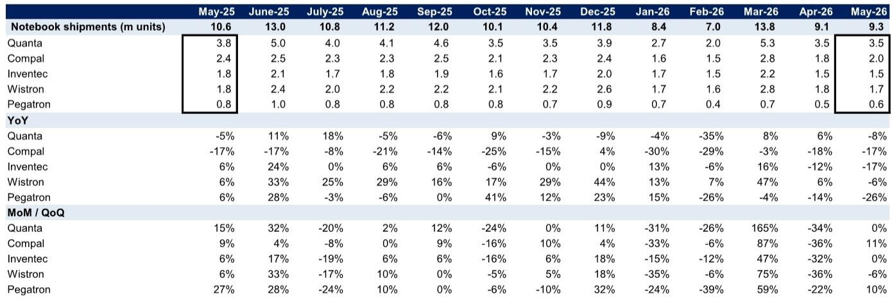
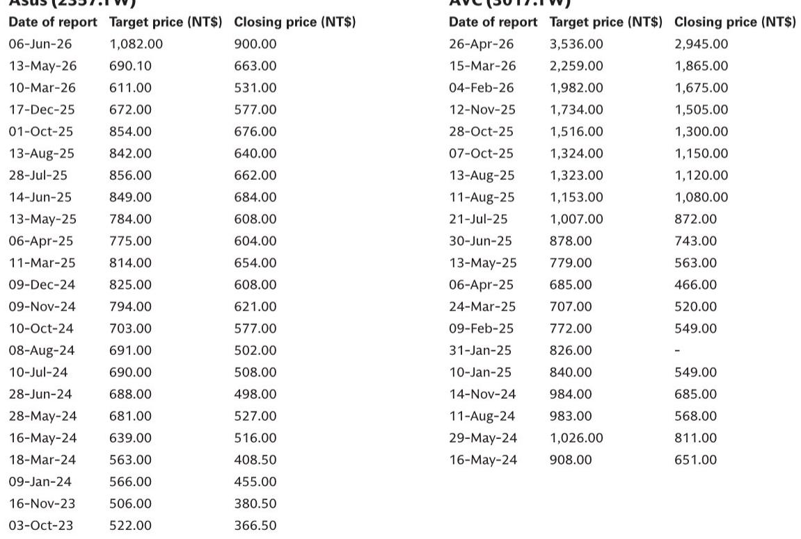
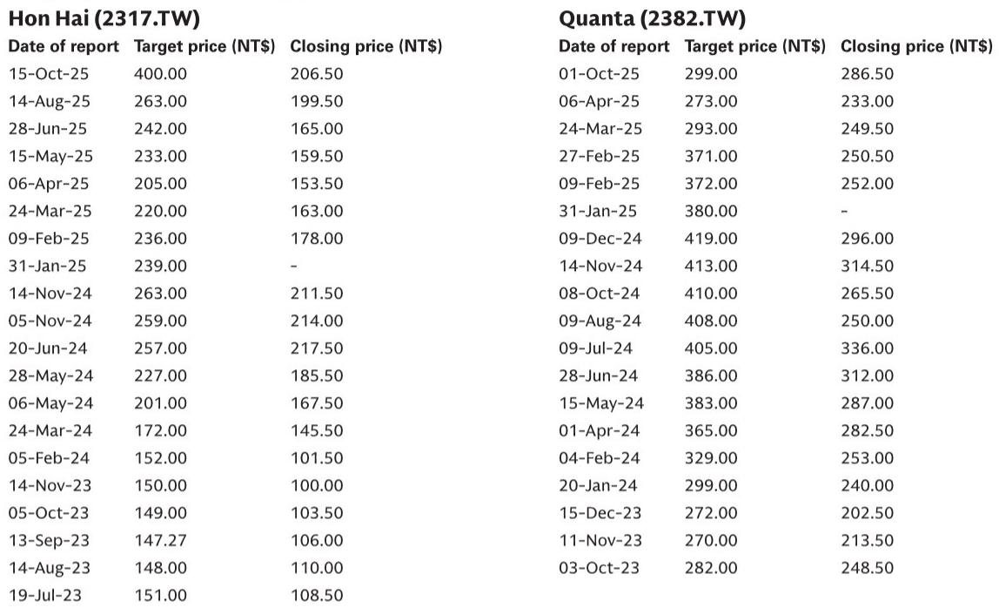

# GS：ASICAI服务器渗透率提升，纬颖领跑供应链赢家格局

市场对AI服务器的关注，过去一年几乎全部集中在“需求是否见顶”这一个问题上。但GS最新一份覆盖台湾ODM/品牌厂的月度营收前瞻报告，给出了一个更精细、也更具操作意义的判断：**未来三个月营收环比基本持平，但同比仍保持30%-40%的高速增长。** 这意味着，AI服务器供应链已经进入一个“模型过渡期”——不是需求消失，而是产品代际切换带来的短期扰动。谁能在过渡期之后更快、更高效地交付新一代AI服务器机架，谁就能在2026年下半年和2027年拿到更大的份额。

这份报告覆盖鸿海、纬颖、奇鋐、广达、英业达、华硕、仁宝七家公司，给出了明确的买入和中性评级。但真正值得深读的，不是评级本身，而是GS如何拆解“模型过渡”对不同环节的影响：哪些公司的营收在过渡期被暂时压制，哪些公司反而受益于规格升级和渗透率提升。以下是我们提炼出的五个核心洞察。

> **KC评论：** GS这篇报告的含金量在于，它把“AI服务器”这个笼统概念拆成了三个层次——GPU服务器、ASIC服务器、液冷组件。三个层次的增长节奏完全不同。完整报告里还有详细的月度营收拆分和每家公司与GS预期的对比，能帮你判断哪些公司正在跑赢、哪些低于预期。

---

## 1. 这轮营收环比持平不是需求疲软，而是AI服务器ODM正在进行产品代际切换

GS预测七家公司6月/7月/8月平均营收环比增速分别为+6%/-5%/0%，几乎原地踏步。但同比增速依然高达39%/37%/29%。环比无增长而同比强劲，最合理的解释就是：**旧机型出货高峰已过，新机型尚未完全放量。**

报告明确指出，环比增长乏力“reflects AI server ODMs undergoing model transition”。这不是需求端出了问题，而是供给端在切换产线。对于投资者而言，这意味着三季度营收数据可能暂时“不好看”，但那些能够快速完成过渡的公司，四季度和明年一季度会迎来更陡峭的增长曲线。

以广达为例，GS预计其5月营收低于预期11%，原因是“AI服务器模型过渡和PC消费提前”。但6月环比预计增长21%，说明过渡正在完成。这种“先抑后扬”的节奏，恰恰是布局窗口。

## 2. 手机端才是真正的“增量惊喜”：形态变化驱动换机周期，2026年折叠屏、2027年iPhone 20成为关键催化剂

在AI服务器之外，GS特别强调了苹果供应链的机会，理由是“new models with form factor changes”。具体来说，2026年的折叠屏手机和2027年的iPhone 20，将带来物理形态的变化，从而驱动换机需求。**这不是简单的规格升级，而是产品形态的重新定义。**

对于鸿海这样的苹果核心组装厂，这意味着一波确定性较高的营收增量。GS预测鸿海6月营收同比+22%，虽然环比因高基数下降23%，但三季度营收环比预计增长26%。手机新机型拉货叠加AI服务器机架持续出货，是鸿海下半年最核心的驱动力。

> **KC评论：** 折叠屏手机和iPhone 20的“form factor change”是一个容易被低估的变量。过去几年，智能手机创新更多集中在摄像头、芯片等内部组件，外部形态变化很小。一旦折叠屏成为主流，整个供应链的BOM成本、组装难度、良率曲线都会发生结构性变化。GS在完整报告里对鸿海的营收拆分，值得仔细看。

---

## 3. ASIC AI服务器渗透率提升，正在改变供应链的赢家格局

GS在报告摘要中明确将“ASIC AI servers' rising penetration rate”列为三大积极信号之一。这与市场主流叙事——GPU AI服务器主导一切——形成微妙对比。**ASIC服务器的崛起，意味着AI算力市场正在从“通用芯片”向“定制芯片”分流。**

纬颖是GS最看好的ASIC AI服务器标的。报告指出，纬颖在ASIC AI服务器领域拥有领先市场地位，并且正在向GPU AI服务器机架拓展。虽然5月营收因转向寄售模式低于预期12%，但毛利率预计改善，长期营运资金压力也会减轻。GS预计纬颖三季度营收环比增长23%，主要由ASIC AI服务器拉货驱动。

奇鋐同样受益于ASIC服务器。报告提到，ASIC AI服务器的液冷渗透率正在提升，而奇鋐的液冷组件正在为新的ASIC AI服务器机架供货。这意味着，**ASIC服务器不仅改变了芯片格局，也改变了散热方案的竞争格局。**

## 4. 液冷不再是“远期故事”，奇鋐的营收曲线已经给出了答案

奇鋐5月营收环比持平，符合GS预期。但6月到9月，GS预计其营收将连续环比增长，驱动因素包括：新AI服务器机架的液冷组件拉货、ASIC AI服务器液冷渗透率提升、以及新的ASIC AI服务器液冷组件开始出货。**奇鋐的营收曲线正在从“概念验证”进入“规模化兑现”。**

GS对奇鋐给出买入评级，目标价新台币3,536元，基于26.7倍2027年预期市盈率。这一估值倍数高于大多数PC/服务器硬件公司，反映了市场对液冷渗透率持续提升的预期。但报告也指出了风险：液冷采用速度慢于预期、AI服务器需求低于预期、竞争加剧。

> **KC评论：** 奇鋐的案例说明，在AI供应链里，真正的超额收益往往来自“渗透率提升”而非“总量增长”。GPU服务器总量增长是确定性高的，但竞争也激烈；液冷渗透率提升是确定性相对较低、但弹性更大的变量。GS完整报告里对奇鋐的营收拆分和液冷业务占比，是判断这个弹性到底有多大的关键。

---

## 5. 报告尚未完全回答的关键问题：PC端的“提前拉货”到底会透支多少下半年需求

GS在多个地方提到PC行业的“consumption pull-in”——即消费者和企业在内存成本上涨的背景下，将原本下半年才有的采购需求提前到了上半年。这直接导致广达、华硕等公司二季度营收超预期，但也意味着三季度可能面临“需求真空”。

报告对广达的预测最典型：6月环比增长21%之后，7月和8月环比分别下降20%和15%。GS的解释是“AI服务器机架模型过渡和PC出货放缓，因为上半年消费已提前”。但问题在于：**这种透支的幅度到底有多大？** 如果提前拉货的力度超出预期，三季度PC供应链的营收可能比GS预测的更低。

华硕的情况类似。虽然AI PC产品组合升级和机架级AI服务器拉货支撑了二季度和三季度增长，但GS预计华硕三季度营收环比下降5%，部分原因也是PC消费提前。报告没有给出具体的“透支量”估算，这或许是读者在读完完整报告后需要自己判断的变量。

---

## 6. 给读者的观察框架：关注三个“过渡期指标”

基于GS这份报告，我们建议读者用以下三个指标来跟踪AI服务器供应链的边际变化：

第一，**ODM的月度营收与实际对比**。GS在每个公司分析中都给出了“GS estimates”与“Actual”的对比。如果某家公司连续2-3个月跑赢GS预期，说明其过渡期执行效率高于同行；反之，则需要警惕。

第二，**液冷渗透率的微观信号**。奇鋐的营收增长是液冷渗透率最直接的代理变量。如果奇鋐的月度营收连续超预期，说明液冷不是概念，而是在真实放量。

第三，**PC出货量的同比变化**。GS给出的笔记本出货数据显示，广达、仁宝、英业达等公司的PC出货同比增速在2026年4-5月已经转负。如果三季度PC出货继续同比下滑，那么“提前拉货”的透支效应可能比预想更严重。

---

以上只是GS这份报告的一部分洞察。完整报告包含七家公司的月度营收预测、与GS预期的对比、以及每家公司详细的估值方法和风险分析。**单篇报告只是一个切片。** 在每天的国际信源汇编中，我们会把GS、MS、UBS、Citi等机构的报告放在当天的主线里，整理成中文摘要、KC评论和图表合集。你可以直接喂给AI追问细节，也可以人工快速扫描市场dynamics。目前社群已经汇聚了头部券商、PE/VC、投行、并购、hedge fund、资管机构、战略咨询、智库等朋友，期待交流。如果你对AI供应链的“模型过渡期”和下半年投资框架感兴趣，欢迎扫码加入，每天更新国际主流叙事与数据。

Personal reading notes and learning share only. Not investment advice.

