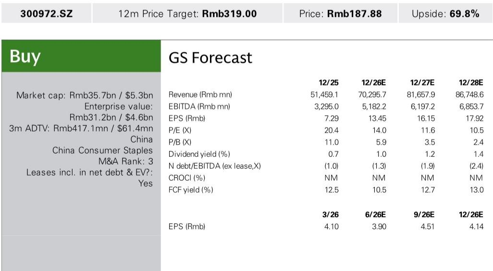
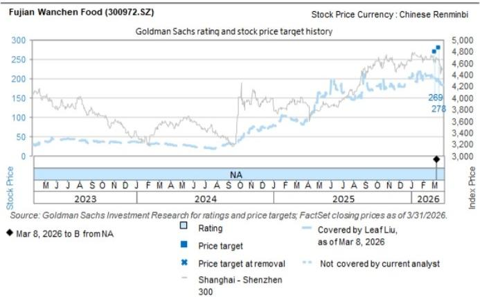

# GS：万辰新店投资回收期控制在2年内，GS称增长可见度正在增强

中国零食折扣零售赛道正在经历一场从“跑马圈地”到“精耕细作”的转折。当市场还在争论门店数量天花板时，GS近期与万辰集团（300972.SZ）管理层交流后释放了一个关键信号：这家公司2026年的增长叙事，已经从“开多少店”转向了“店开得多好”。上半年净增门店已超过2025年全年，但管理层依然将单店GMV健康和加盟商盈利放在首位。这份研报的核心判断是：在行业补贴趋于理性、消费情绪偏弱的背景下，万辰的增长可见度正在增强，而支撑这一判断的，并非简单的规模扩张，而是一套从品类拓展、自有品牌到新业态试水的精细化运营体系。

## 1. 上半年开店速度已超去年全年，但管理层没有选择继续加速

这是研报中最引人注目的数据之一：万辰在2026年上半年完成的新开门店数量，已经超过了2025年全年的净增和总开张数（2025年净增4100家、总开张4700家）。如果只看速度，这似乎是一个典型的“加速扩张”故事。但GS与管理层的交流揭示了一个更微妙的平衡：公司有意将开店节奏与单店经济模型（UE）的健康度动态挂钩，目前新店投资回收期仍控制在2年以内。

管理层明确表示，未来不一定会比上半年开得更快。这种克制，源于对单店GMV的持续监控。虽然上半年面临不利天气和疲弱的消费情绪，万辰的平均单店月GMV仍实现了正增长，并正在向全年约39万元的目标靠拢——这一数字与2025年下半年的水平相当。更值得关注的是，同店销售增长（SSSG）趋势优于整体单店GMV，因为前者不受新店稀释效应的影响。这意味着，现有门店的运营效率在提升，而新店也预计将在下半年逐步进入产能爬坡期。

> **KC评论：** 这里的关键不在于“开店多快”，而在于“开店质量是否同步提升”。管理层主动平衡节奏，说明公司内部对单店模型有严格的监控体系。对于读者而言，与其盯着季度开店数量，不如关注单店GMV趋势和回收期是否稳定。研报中关于门店扩张指标（月度/日度销售、回收期、租售比）的内部监控细节，是理解这一平衡机制的核心。

继续看原文，真正有价值的是图表、假设和验证路径；完整报告与KC评论在每日汇编。

## 2. 品类扩张和自有品牌，正在成为单店GMV的新引擎

单店GMV的增长并非来自简单的提价或客流自然恢复，而是有明确的结构性驱动力。GS报告详细拆解了两个关键方向：品类扩张和自有品牌（PL）。

新品类目前约占万辰总GMV的5%，其中冷链食品贡献约3%，IP商品和日用品等贡献约2%。这个比例看似不高，但其战略意义在于：它验证了零食折扣店从“休闲零食”向“社区便利”延伸的可能性。冷链品类的引入，意味着万辰正在试探更高客单价、更高复购频率的品类，同时也在测试供应链的温控能力。

自有品牌则是另一个增长支点。万辰的PL SKU数量已从2025年的30多个弹性较高增长，目标是在2026年底实现全品类覆盖。值得注意的是，管理层目前将PL定位为“提升顾客价值和产品差异化”的工具，而非直接追求毛利率提升。这意味着，自有品牌短期内的作用是引流和增强用户粘性，而非直接贡献利润。这种策略在零售行业并不罕见，但万辰的执行节奏——从饮料类起步，向全品类扩展——值得跟踪。

> **KC评论：** 冷链路和自有品牌是零售业两个难度较高的动作。万辰同时推进，说明其供应链能力和商品运营能力在升级。但冷链带来的高损耗率和配送成本，是研报没有完全展开的风险。完整报告中对物流费用率改善的假设和验证路径，是判断这一战略能否持续的关键。

## 3. 竞争格局趋于理性，补贴战不再是主旋律

过去两年，零食折扣行业的补贴竞争是市场最大的担忧之一。GS管理层交流给出了一个积极的信号：两大行业头部企业——万辰和鸣鸣——在门店补贴上均保持理性与克制。特殊补贴仅在特定位置或区域获批，且2026年上半年的总补贴水平同比有所下降。

这一点尤为重要。在行业高速扩张期，补贴战往往侵蚀加盟商利润和公司现金流。如果头部企业能够维持补贴纪律，行业整体的盈利模型将更加健康。万辰上半年70%的新开门店集中在长三角和山河四省等优势市场，而非盲目进入竞争激烈的非核心区域，也印证了其“聚焦深耕”而非“全面铺开”的策略。

对于行业格局，GS报告还提到了一个新变量：万辰正在谨慎测试新业态，包括便利店（CVS）和全品类硬折扣店（惠省嘉）。虽然目前门店数量极少（便利店仅1家试点，惠省嘉约10家），但这表明公司正在为长期增长寻找第二曲线。便利店在中国约有32万家存量市场，是一个巨大的潜在空间，但运营逻辑与零食折扣店截然不同。这一探索的成败，可能需要更长时间验证。

## 4. 盈利能力改善的路径：毛利率扩张与费用杠杆

万辰2025年零售业务（含少数股东权益）的净利润率约为5%，管理层维持2026年小幅扩张的目标。支撑这一目标的，是毛利率扩张和运营费用率下降的双重驱动。

毛利率方面，规模效应和采购优化是长期驱动力。随着门店网络扩大，万辰对上游供应商的议价能力在增强，同时自有品牌占比的提升也有助于改善综合毛利率。费用端，物流效率的优化是主要看点。公司正在投资更多仓库以支持更快的补货需求，但管理层预计，得益于配送效率的提升，整体物流费用率反而会同比下降。这是一个典型的“规模杠杆”逻辑：固定成本被更多门店分摊，同时单位配送成本因密度提升而下降。

值得注意的是，GS对万辰2026-2027年的盈利预测相当乐观：预计2026年销售额增长约37%，净利润增长约84%。这意味着，利润增速显著快于收入增速，盈利杠杆效应正在释放。

## 5. 报告尚未完全回答的关键问题：新业态能否成为真正的增长极？

研报提供了丰富的信息，但有几个关键问题仍然悬而未决。首先是新业态的规模化前景。惠省嘉和便利店目前处于极早期测试阶段，其单店模型、商品组合和供应链要求与万辰的核心零食折扣业务有显著差异。这些新业态能否跑通UE、何时进入复制阶段，报告没有给出明确答案。

其次是自有品牌对毛利率的实际贡献。管理层目前强调PL的引流功能，但长期来看，PL的利润率提升空间有多大？是否会因为追求全品类覆盖而增加库存风险？这些都需要更多数据验证。

最后是行业竞争格局的演变。虽然头部企业目前保持理性，但新进入者（如区域性折扣店、社区生鲜店）是否会打破平衡？万辰在优势市场之外的扩张策略是什么？这些问题的答案，可能需要在后续的季度数据中寻找。

## 6. 给读者的观察框架：三个关键指标

基于GS这份研报的逻辑，我们建议读者在跟踪万辰时，重点关注以下三个指标，而非仅仅关注门店数量。

第一，单店月GMV和回收期。这是衡量扩张质量的核心。如果单店GMV能够维持在39万元附近，且回收期保持在2年以内，说明新店质量可控。

第二，新品类和自有品牌的GMV占比。这两个指标的提升，意味着公司正在从“卖零食”向“运营社区零售”转型，同时也是毛利率改善的前瞻信号。

第三，同店销售增长（SSSG）与整体单店GMV的差距。如果SSSG持续优于整体单店GMV，说明现有门店运营效率在提升，而新店稀释效应在减弱。

这三个指标，比任何季度开店数字都更能反映万辰的长期价值。

---

这份GS研报的价值，不仅在于它给出了对万辰2026年增长可见度的正面判断，更在于它提供了一个观察中国零食折扣零售行业从“规模驱动”转向“质量驱动”的微观视角。关于新业态的测试数据、自有品牌的全品类覆盖路径、以及物流费用率的改善假设，都值得在完整报告中进一步深挖。

更多国际信源汇编与评论，扫码交流，每日更新，汇总国际主流叙事、数据与图表，观测边际变化。每日汇编将单篇报告放回当天主线，整理为中文摘要、KC评论和图表合集，便于喂给AI，也便于人工快速扫描市场动态。已汇聚头部券商、PE/VC、投行、并购、hedge fund、资管机构、战略咨询、智库等朋友，期待交流。

Personal reading notes and learning share only. Not investment advice.

