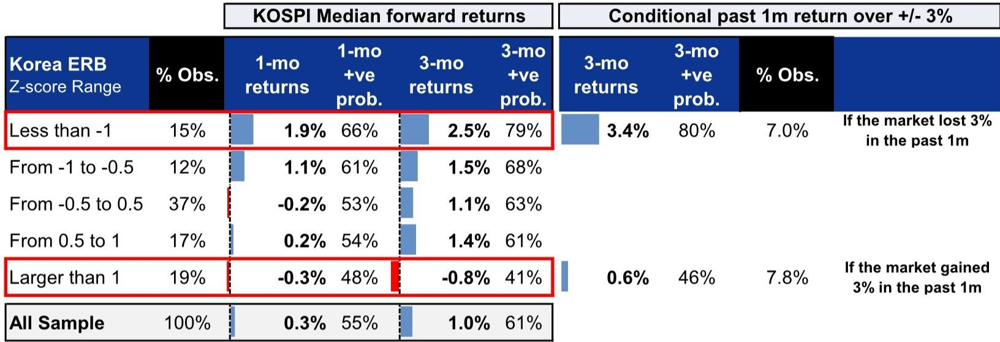
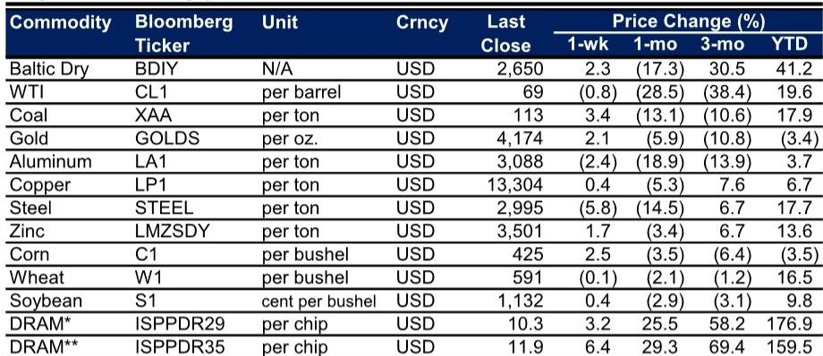
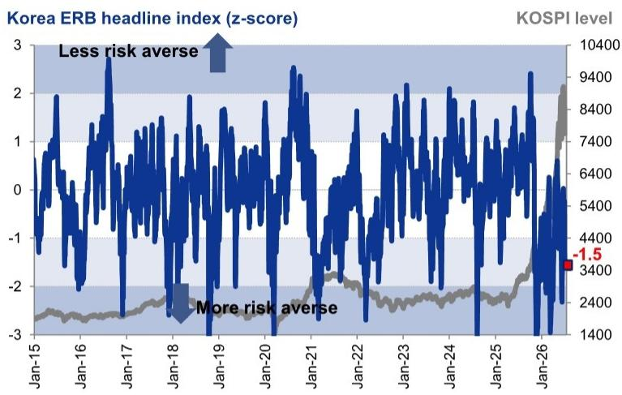

# GS：韩国股市跌至金融危机以来最低估值，市场关注反弹信号

韩国股市近期经历一轮明显调整。过去一周，KOSPI指数下跌4%，12个月前瞻市盈率（fP/E）跌至2008年全球金融危机以来的最低水平。外资持续流出，科技板块领跌，市场情绪转向谨慎。

然而，GS在这份最新的韩国市场周报中，提出了一个值得关注的分析视角：即便假设盈利大幅下调33%，并采用历史盈利低谷期的估值倍数，KOSPI当前点位仍存在一定上行空间。这不是简单的“底部观察”叙事，而是一个建立在历史数据、盈利趋势和风险指标三重验证基础上的结构性判断。

这份报告的核心观点是：韩国市场正在经历一次由外部冲击和情绪驱动而非基本面恶化的估值压缩。当估值和情绪指标同时触及极端区间时，市场往往孕育着均值回归的机会。但这一判断能否成立，取决于几个关键变量：盈利下修的节奏、外资流动的拐点，以及韩国经济自身修复的动能。

> **KC评论：** GS这份周报的价值不在于它给出了一个具体的点位预测，而在于它提供了一个“市场恐慌时如何建立分析框架”的范本。对于关注韩国市场的读者，真正值得细读的是报告中的图表、假设路径和风险指标的历史回测数据。完整报告与KC评论在每日汇编中持续更新。

## 1. 估值已跌入历史极端区间，但盈利修正仍在向上

KOSPI的12个月前瞻市盈率已经触及2008年金融危机以来的最低点。这不是一个简单的技术指标，而是一个经过历史多次验证的“极端定价”信号。GS通过对比过去五次盈利周期峰值到谷底的跌幅发现，即便采用中位数33%的盈利下调幅度，并取历史盈利低谷期的中位数市盈率11.4倍，测算出的潜在KOSPI点位仍高于当前水平。

更值得关注的是，与估值大幅收缩形成鲜明对比的是，盈利修正仍在向上。过去一周，尽管市场整体走弱，KOSPI的12个月前瞻每股收益（EPS）却被上调了4.8%。休闲板块的盈利上修最为强劲，而化工板块则被下调最多。这种“估值收缩但盈利上调”的组合，在历史上往往预示着市场底部正在形成。

**这一组合意味着什么？** 市场当前的调整并非源于企业盈利的恶化，而是由外部冲击和情绪驱动的估值压缩。如果盈利继续上修，当前的估值水平将变得更加不合理。

## 2. 外资流出集中在科技板块，结构性问题而非系统性危机

过去一周，外资净卖出KOSPI市场约2万亿韩元，是导致指数下跌的主要力量。但GS的数据显示，这一流出高度集中在KOSPI科技板块。科技板块当周下跌7.6%，成为表现最差的行业，而银行、证券和休闲板块却分别逆势上涨13.7%、10.2%和9.7%。

这种板块间的剧烈分化，指向一个关键判断：当前市场的调整并非系统性危机，而是由特定板块（尤其是科技）受到外部冲击（报告中提及Meta的新闻）引发的连锁反应。韩国科技板块与全球半导体周期和AI主题高度相关，当全球科技股出现波动时，韩国市场首当其冲。

但与此同时，银行和证券板块的强势表现，反映出市场对韩国国内利率环境和金融体系韧性的信心并未动摇。这种“内需板块抗跌、出口科技板块承压”的分化格局，恰恰是韩国经济结构特征的映射。

> **KC评论：** 外资流出集中于科技板块，意味着如果全球科技叙事修复，韩国市场可能迅速反弹。但报告没有完全展开的是，这些外资是短期交易资金还是长期配置资金？不同性质的资金对市场的影响持续期完全不同。完整报告中的流量数据和图表提供了更细致的拆解。

## 3. 韩国股权风险指标进入“反向信号”区域，历史胜率较高

GS构建的韩国股权风险指标（Korea Equity Risk Barometer）目前已降至-1.5，进入风险规避（risk-adverse）区间。这是一个基于多因子构建的综合性指标，包括估值、情绪、资金流和技术面等因素。

关键在于，GS明确指出，这一指标是一个反向指标（contrarian indicator），尤其是在市场已经经历了大幅波动之后。历史回测数据显示，当该指标低于-1时（约占全部观测值的15%），KOSPI未来1个月的中位数回报率为1.9%，正向概率为66%；未来3个月的中位数回报率为2.5%，正向概率为79%。如果市场在过去一个月内下跌超过3%，未来3个月的中位数回报率更是升至3.4%，正向概率高达80%。

这些数据并非预测，而是提供了一个概率框架。当市场情绪极度悲观时，继续做空的性价比正在快速下降。

## 4. 技术面进一步确认超卖，但反弹需要催化剂

从技术面看，KOSPI的相对强弱指数（RSI）已经跌至2026年3月底以来的最低水平，同时指数已经跌破50日均线。RSI进入超卖区域通常被视为短期反弹的前兆，但GS并未简单给出方向性判断。

报告同时指出，韩国宏观基本面仍在改善。2025年GDP增速预测为1.1%，2026年将回升至2.6%。出口增速从2025年的4.3%加速至2026年的7.2%。韩国央行政策利率预计从当前的2.50%逐步上调至2026年底的3.00%。这些宏观数据为市场提供了基本面支撑，但短期内难以成为反弹的直接催化剂。

**反弹的真正催化剂可能来自哪里？** 可能是全球科技叙事的修复，也可能是韩国国内政策的变化，或是外资流动的边际改善。报告没有给出明确的催化剂预测，而是提供了一个“等待信号”的框架。

## 5. 报告尚未完全回答的关键问题：盈利下修的节奏

GS的分析基于“即便盈利下调33%”的极端假设，但报告没有完全展开的是：盈利下调将以多快的速度发生？如果盈利在短期内快速下修，市场可能在估值修复之前先经历一轮盈利驱动的下跌。

当前盈利仍在被上调，但科技板块的盈利下修风险尚未充分释放。韩国出口数据虽然强劲（5月出口同比增长54.9%），但GS对2026年出口增速的预测仅为7.2%，这意味着增速将从当前高位显著放缓。如果全球经济走弱或半导体周期见顶，盈利下修的幅度可能超出中位数假设。

这也是为什么GS虽然给出了“上行空间”的判断，但并未给出具体的短期操作建议。对于希望深度理解韩国市场的读者，关键在于厘清盈利周期、估值周期和情绪周期三者之间的互动关系。

## 6. 给读者的观察框架：三个信号比一个预测更重要

与其试图判断KOSPI的准确底部，不如建立一套信号追踪框架：

**第一，外资流动是否出现边际改善。** 当前外资流出集中在科技板块，如果流出量开始萎缩，或者出现板块轮动（外资从科技转向银行等内需板块），将是市场企稳的早期信号。

**第二，盈利修正的广度。** 当前盈利上修集中在少数板块，如果修正广度扩大，意味着企业盈利基本面改善正在扩散，而非仅由个别板块驱动。

**第三，韩国股权风险指标的走势。** 该指标已经进入反向信号区域，但如果进一步恶化（比如跌破-2），则意味着市场可能面临更严重的压力。反之，如果指标开始回升，将是情绪修复的确认信号。

这三个信号组合在一起，比任何单一指标都更能帮助判断市场是否真正见底。

---

韩国市场的这轮下跌，与其说是韩国自身的问题，不如说是全球科技叙事波动在韩国市场的放大反映。当估值、情绪和技术面同时进入极端区间，市场往往孕育着均值回归的机会。但均值回归需要催化剂，而催化剂的出现时间无法预测。

更多国际信源汇编与评论，每日更新。每日汇编将单篇报告放回当天全球市场的主线中，整理为中文摘要、KC评论和图表合集，便于快速扫描市场动态，也便于进行深度分析。

Personal reading notes and learning share only. Not investment advice.

