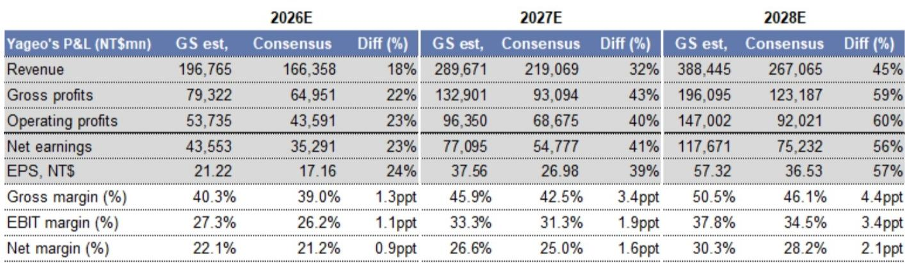
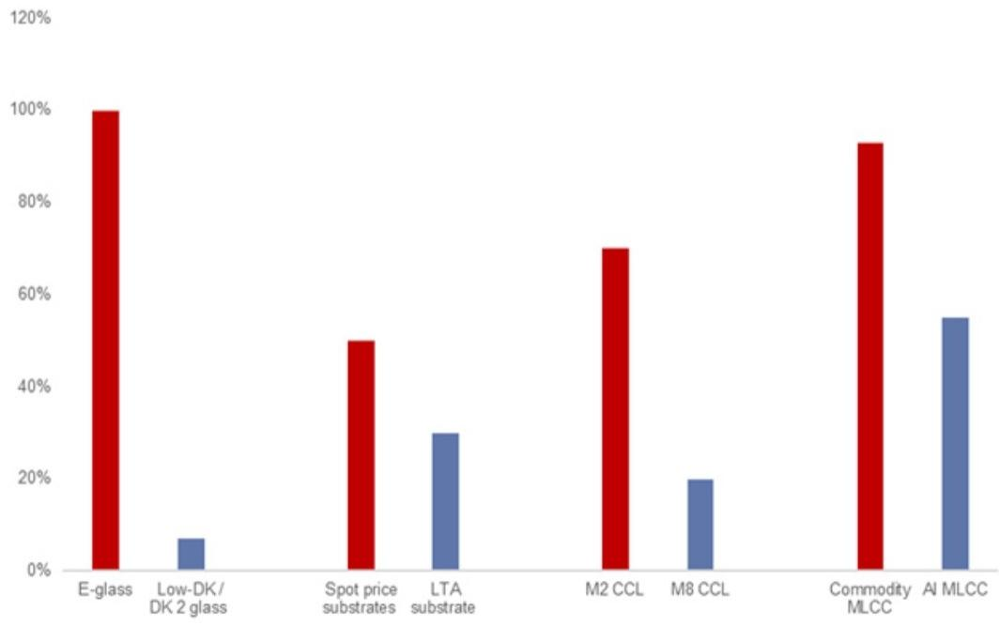
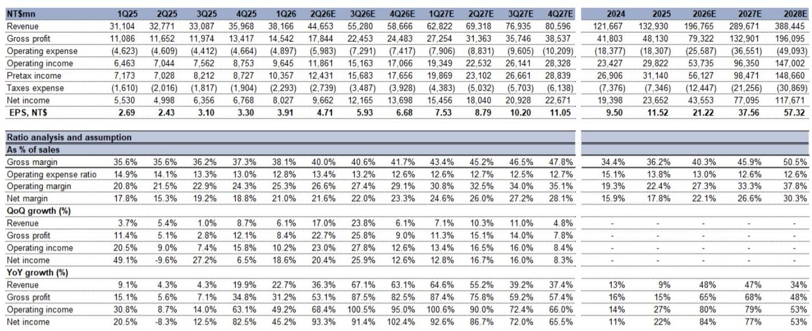

# GS：汽车和手机撑起非AIMLCC，9%复合增长稳定

当市场持续关注AI算力芯片的迭代时，一个更隐蔽的供应链信号正在浮现。GS最新发布的一份覆盖国巨的深度报告，其核心判断并非关于这家台湾被动元件龙头的单一公司故事，而是指向整个MLCC行业正在经历的结构性转变：普通品MLCC的涨价周期已经启动，且其价格弹性可能远超高端品。

这份报告最值得关注的洞察在于，它不仅看到了AI对MLCC需求的拉动，更敏锐地捕捉到一个反直觉的推论——当全球主要MLCC供应商纷纷将产能转向AI级产品时，普通消费级MLCC的供给正在被系统性压缩，从而触发一轮罕见的定价上行周期。GS预计，2027至2028年全球非AI MLCC行业产能利用率将回升至97%至100%，接近2017至2018年上一轮周期峰值水平。

对于产业决策者和读者而言，这意味着一个关键判断：MLCC行业正在从“供给过剩、价格承压”的叙事切换为“供给结构性收紧、定价权回归”的新框架。而真正决定这一轮周期高度的，不是AI MLCC本身，而是被AI挤出产能的普通品市场。

---

## 1. AI对MLCC的拉动不仅是量，更是对供给结构的重塑

GS预计2025至2028年全球MLCC市场规模复合年增长率将达到33%，其中AI MLCC的复合年增长率高达93%，到2028年将占全球MLCC市场的19%，而2025年这一比例仅为6%。这组数字本身并不令人意外——AI服务器对MLCC的需求量级确实惊人：一台GB300服务器需要超过30万颗MLCC，VR200更需超过50万颗，而普通服务器仅需约1.2万颗。

但真正关键的不是AI带来的增量需求，而是它对供给端的结构性影响。报告明确指出，日本和韩国的主要MLCC供应商正在持续将产能转向AI应用。这不是一个短期的产能调配，而是一个战略性的资源重分配。AI级MLCC享有更高的利润率，且主要服务于大客户的长约订单，供应商有强烈动机优先保障这部分产能。

> **KC评论：** 这里的核心逻辑是，AI对MLCC行业的影响不是简单的“需求增加”，而是通过挤压普通品供给来重塑整个行业的供需平衡。读完整份报告你会发现，真正驱动这轮周期的关键变量不是AI MLCC的价格，而是非AI MLCC的产能利用率。报告中的产能利用率图表和分品类价格假设，是理解这一逻辑的核心材料。

继续看原文，真正有价值的是图表、假设和验证路径；完整报告与KC评论在每日汇编。

---

## 2. 非AI MLCC并非衰退市场，而是稳定增长的基本盘

在AI的光环下，非AI MLCC市场容易被低估。但GS预计2025至2028年非AI MLCC出货量仍将保持9%的复合年增长率，其中汽车和智能手机是两大支柱，复合年增长率分别为8%和7%。

汽车MLCC是尤其值得关注的细分领域。报告指出，汽车MLCC占非AI MLCC总量的20%以上，且单车MLCC用量远高于其他消费电子——平均每辆车超过2万颗，而智能手机仅约2000颗，台式PC约2500颗。这意味着即使汽车销量增速放缓，单车MLCC含量的持续提升仍能为市场提供稳定的需求增量。

智能手机虽然出货量受高内存成本等因素压制，但单机MLCC用量的提升已经基本抵消了出货量下滑的负面影响。PC和服务器领域也在经历类似的内容升级。

这里的隐含结论是：非AI MLCC不是一个在萎缩的市场，而是一个有稳定增长、且供给正在被系统性收紧的市场。这种“需求稳定+供给收缩”的组合，正是定价权回归的经典前提。

---

## 3. 普通品MLCC的涨价弹性可能超出市场预期

这是整份报告最核心的洞察。GS预计，普通品MLCC的涨价幅度将超过高端品。原因并不复杂：高端AI MLCC已经享有较高利润率，且主要面向大客户的长约订单，供应商缺乏大幅提价的动力和灵活性。而普通品MLCC利润率较低、客户群更分散，提价空间反而更大。

报告预计国巨的普通品MLCC定价在2027年和2028年将分别上涨93%和84%，带动毛利率在2027年和2028年分别达到46%和51%，创下历史新高。这一预测的根基在于，全球非AI MLCC产能利用率将在2027年和2028年回升至97%和100%，接近2017至2018年周期峰值时的94%和99%。

> **KC评论：** 这里有一个容易被忽略的细节。报告提到，2025年的行业库存水平比过去十年峰值低36%。这意味着即使需求不出现爆发式增长，补库需求本身就能为产能利用率的提升提供额外动力。完整报告中对库存周期的拆解和分品类价格假设，是判断这一逻辑能否兑现的关键。

---

## 4. 国巨的竞争优势在于规模与AI之间的平衡

在主要MLCC供应商中，国巨处于一个独特的位置。GS估计，国巨在2026至2028年将占据全球普通品MLCC约25%的产能份额。这意味着当普通品MLCC进入涨价周期时，国巨是最大的受益者之一。

但国巨并非只押注普通品。报告显示，公司也在将部分产能转向AI MLCC，但策略上与日韩供应商有所不同。日韩供应商更激进地将产能转向AI，而国巨在普通品市场保留了更大的敞口。这种“两头下注”的策略，使国巨既能享受AI MLCC的增长，又能在普通品涨价周期中获得超额收益。

报告对国巨的营收预测大幅上调：2026至2028年营收分别为1968亿、2897亿和3884亿新台币，较此前预测分别上调6%、26%和54%。盈利上调幅度更大，2026至2028年每股收益预测分别上调11%、49%和106%。这一上调幅度本身就说明，市场此前对这一轮周期的定价弹性存在系统性低估。

---

## 5. 报告尚未完全回答的关键问题：这轮周期能持续多久？

尽管报告逻辑严密，但仍有几个关键问题值得进一步探讨。

第一个问题是，AI对普通品MLCC的产能挤出效应是否可持续。如果日韩供应商的AI产能扩张速度足够快，最终可能缓解普通品的供给压力。报告没有给出AI产能扩张的具体时间表，这是需要持续跟踪的变量。

第二个问题是，普通品MLCC的涨价是否会引发下游客户的抵触或替代。2017至2018年的MLCC涨价周期最终因下游客户转向替代方案和需求回落而结束。这一轮周期的下游客户结构已经发生变化，但终端需求的韧性仍有待验证。

第三个问题是，国巨的产能扩张节奏是否会被竞争对手跟进。如果其他供应商看到普通品MLCC的利润率大幅提升，可能会重新调整产能分配，从而削弱国巨的定价权。

> **KC评论：** 这些未解问题恰恰是完整报告最有价值的部分。报告中的敏感性分析、不同情景假设下的盈利预测，以及产能利用率的详细拆解，为读者提供了自己判断这些问题的框架。每日汇编会把这份报告放回当天的主线中，整理成中文摘要、KC评论和图表合集，便于喂给AI，也便于人工快速扫描市场动态。

---

## 6. 给读者的观察框架：三个需要持续跟踪的信号

基于这份报告的逻辑，产业决策者和读者可以建立一个简单的跟踪框架，来验证或证伪这轮MLCC涨价周期的可持续性。

第一个信号是主要供应商的产能分配公告。如果日韩供应商继续将更多产能转向AI，且没有大规模扩产普通品MLCC的计划，则涨价逻辑得到强化。反之，如果出现产能回流的迹象，则需要重新评估。

第二个信号是下游客户的库存行为。报告提到当前库存水平处于历史低位，但如果下游客户开始恐慌性补库，可能会透支未来的需求，缩短涨价周期的持续时间。跟踪MLCC渠道库存和交货周期是判断周期位置的有效方法。

第三个信号是国巨自身的毛利率走势。报告预测2027年毛利率达到46%，2028年达到51%。如果实际毛利率在2026年就接近甚至超过这一水平，说明涨价速度可能快于预期，但也可能意味着周期见顶的时间点会提前到来。

---

这份GS报告的核心贡献，是为理解MLCC行业正在发生的变化提供了一个清晰的逻辑框架。AI对供应链的影响远不止于算力芯片，它在被动元件领域的传导效应才刚刚开始被市场关注。

更多国际信源汇编与评论，每日更新，汇总国际主流叙事、数据和图表，观测边际变化。每日汇编会把单篇报告放回当天的主线，整理成中文摘要、KC评论和图表合集，便于喂给AI，也便于人工快速扫描市场动态。

Personal reading notes and learning share only. Not investment advice.

