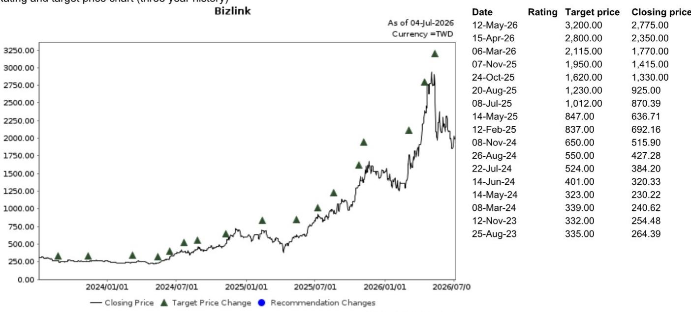

# NOM：槟城工厂揭示AI供应链被低估的制造能力升级

AI基础设施的竞争，正在从芯片设计、算力规模，向一个更隐秘但同样关键的环节迁移：制造能力本身。当市场还在争论GPU短缺何时缓解时，NOM一份关于Bizlink槟城工厂的实地调研报告，揭示了AI供应链中一个被低估的结构性变化——连接与配电产品的制造，正在从标准化量产转向高度定制化的工程整合。这不是一个简单的产能扩张故事，而是一场关于制造能力护城河的重新定义。

这份报告的价值不在于给出某个公司的短期交易信号，而在于它提供了一个观察AI基础设施供应链的微观透镜。当一家原本被视为线缆和连接器供应商的企业，其工厂内部开始出现3D打印、自动化产线、Class 10000级洁净室和UV粒子检测时，这意味着AI基础设施的制造门槛正在系统性抬升。对于关注AI产业链的决策者而言，理解这种变化，比追逐任何一个季度的业绩数字更为重要。

## 1. 槟城工厂的核心信号：产品正在从“可替代”走向“不可替代”

NOM分析师在实地调研中捕捉到一个关键细节：Bizlink槟城工厂生产的电源产品，正在变得越来越定制化。不同配置的电源线束——包括连接器朝向、接线盒设计、多种连接器布局——都反映出客户特定的部署需求正在驱动更高的工程含量。这不是一个成本竞争的故事，而是一个技术粘性提升的故事。

当产品从标准化走向定制化，供应商的议价能力和客户切换成本都会发生质变。定制化意味着供应商深度参与了客户系统的设计阶段，形成了事实上的技术锁定。对于AI数据中心运营商而言，更换一个连接器供应商可能意味着重新设计整个电源分配架构，这种代价远超采购成本本身。

> **KC评论：** 这是报告中最值得关注的判断之一。市场往往把连接器和线缆视为AI基础设施中的“配角”，认为其技术门槛低、可替代性强。但NOM在槟城工厂看到的现实恰恰相反：随着液冷、高功率密度等新架构的普及，电源和信号传输产品的定制化程度正在急剧上升。这意味着，能够提供定制化解决方案的供应商，其护城河比市场想象的更深。完整报告中包含了对这些定制化产品具体配置的拆解和客户验证路径的讨论，这些细节对于理解护城河的强度至关重要。

继续看原文，真正有价值的是图表、假设和验证路径；完整报告与KC评论在每日汇编。

## 2. 制造能力的升级：从“成本中心”到“工程中心”

报告中最具洞察力的观察，是Bizlink槟城工厂的制造能力升级路径。管理层强调的“持续流程改进、工程驱动的制造、卓越运营”不是空话，而是通过具体的技术手段实现的：无纸化流程、自动化、机器人、快速原型制造（3D打印）、标准化制造流程。这些措施共同指向一个方向——这家公司正在把制造过程本身变成一种核心竞争力。

更值得关注的是，某些内部开发的工装、装配辅助工具和快速原型制造能力，已经被客户采纳。这意味着供应商的制造创新正在反向输出给客户，形成了一种技术互锁关系。这不是传统的“代工”关系，而是更像是联合研发。当制造能力本身成为客户系统设计的一部分时，供应商的地位就从“可替换”变成了“不可或缺”。

## 3. 产能扩张背后的资本逻辑：稀释与增长的权衡

报告在工厂参观之后，紧接着披露了一条重要信息：公司宣布发行GDR/ECB以支持潜在的资本需求。GDR最大发行450-600万股（占现有股本的2.3%-3.0%），ECB最大金额为5亿美元（若全额转股，按当前股价溢价20%的转换价计算，将增加600-700万股）。NOM分析师判断，如果后续有银行贷款公告，稀释效应可能会降低。

这个信息点值得单独拉出来分析。在AI基础设施投资热潮中，企业普遍面临资本需求激增的问题。但融资方式的选择，直接反映了管理层对股权稀释的态度。GDR/ECB的组合表明，公司试图在股权融资和债务融资之间寻找平衡，避免过度稀释现有股东。NOM的判断——如果获得银行贷款，稀释效应将降低——实际上是在提示：这条融资路径尚未封闭，后续可能有更优方案。

> **KC评论：** 融资结构是理解公司战略意图的重要窗口。GDR/ECB的条款设计——尤其是转换价格溢价20%——表明管理层认为当前股价被低估。但更关键的问题是：这笔钱要投到哪里？报告提到了材料/组件采购的资本需求，但并未详细展开。如果这笔资金用于扩大定制化生产能力或研发投入，那么短期的稀释可能换来长期的竞争力提升。完整报告中对资本用途的假设和验证路径，是判断这笔融资“值不值”的核心。

## 4. 报告尚未完全回答的关键问题：规模效应能否转化为持续的竞争优势？

尽管NOM的调研提供了丰富的细节，但有一个核心问题报告并未完全回答：这种制造能力的升级，是否真的能构成持续的竞争优势？或者说，当竞争对手也开始投资自动化、洁净室和3D打印时，Bizlink的领先优势能维持多久？

报告提到了几个值得深挖的线索。第一，槟城工厂的员工人数从三年前的2,000人增加到现在的约5,000人。这种高速扩张是否带来了管理效率的挑战？第二，公司的新加坡工厂（Speedy）专注于更高端的子系统集成和数字制造，而槟城工厂展示的是规模化制造能力。两者之间的协同效应如何量化？第三，报告提到“某些制造改进已被客户采纳”，但未说明这些改进是否具有排他性，或者是否会被客户推广到其他供应商。

这些未解问题，恰恰是判断这家公司长期价值的关键。制造能力的升级可以创造短期优势，但能否转化为持久的护城河，取决于这些能力是否具备“不可复制性”或“规模壁垒”。

## 5. 给决策者的观察框架：如何跟踪AI基础设施制造环节的竞争动态

基于这份报告，我们可以提炼出一个观察AI基础设施制造环节的框架。这个框架包含三个维度：

第一，**定制化程度**。跟踪供应商产品的标准化率——定制化产品占比越高，客户粘性越强。可以从产品配置数量、客户定制需求频率、非标产品占比等指标入手。

第二，**制造能力密度**。不仅仅看产能规模，更要看制造过程中所嵌入的技术含量。自动化率、3D打印使用频率、洁净室等级、检测精度等，都是衡量制造能力密度的关键指标。这些指标决定了供应商是否具备“工程整合”能力。

第三，**资本效率**。在AI基础设施投资热潮中，资本开支的回报率是区分“好公司”和“故事公司”的关键。跟踪单位资本开支带来的营收增长、产能利用率、以及融资结构的优化方向，可以帮助判断一家公司是否在有效利用资本。

这三个维度结合起来，可以形成一个比单纯看营收增速更立体的判断框架。对于关注AI基础设施产业链的决策者而言，理解制造环节的竞争动态，比追逐任何一个季度的业绩数字更为重要。

---

这份NOM报告的核心价值，不在于它提供了一个具体的研究交流，而在于它提供了一个观察AI基础设施供应链的微观透镜。当一家线缆和连接器供应商的工厂开始出现3D打印、自动化产线和洁净室时，这意味着整个行业的制造门槛正在系统性抬升。对于试图理解AI基础设施竞争格局的决策者来说，这种制造能力的变化，可能比任何宏观预测都更具信号意义。

更多国际信源汇编与评论，每日更新，汇总国际主流叙事、数据与图表，帮助观测市场边际变化。每日汇编将单篇报告放回当天主线，整理为中文摘要、KC评论和图表合集，既便于喂给AI进行批量分析，也便于人工快速扫描市场动态。这里汇聚了头部券商、PE/VC、投行、并购、对冲基金、资管机构、战略咨询和智库的朋友，期待交流。

Personal reading notes and learning share only. Not investment advice.

