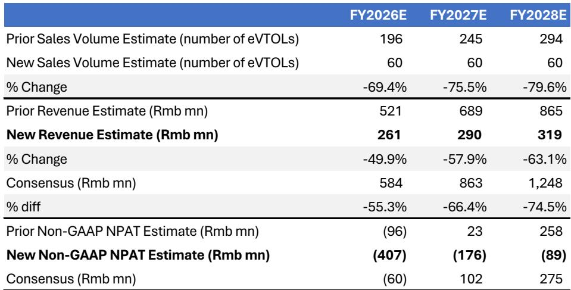
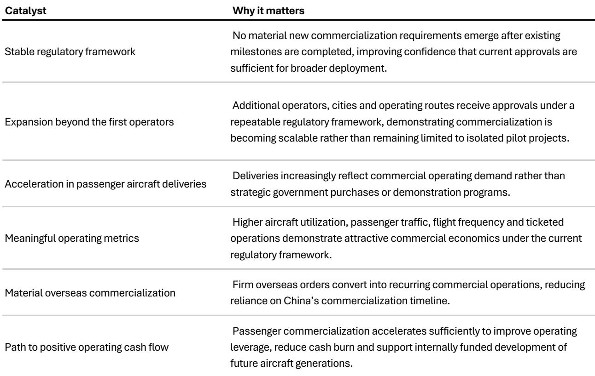
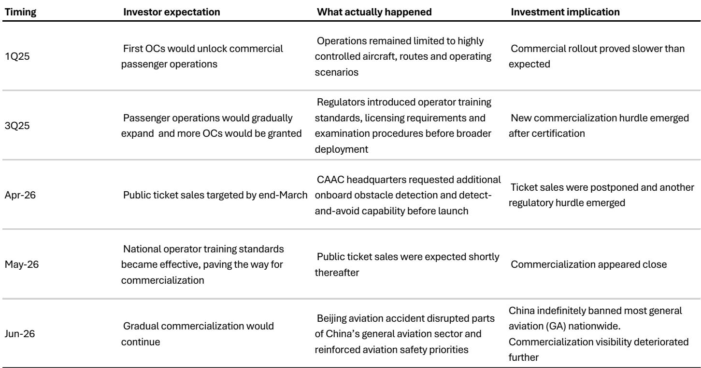

# 仅有认证已无法创造商业价值：亿航先发优势为何瓦解

在新兴技术研究中，最危险的假设是认为监管里程碑会直接转化为商业现实。对亿航而言，这一假设如今已动摇了原有的投研逻辑。某全球投行报告下调了该公司的评级，原因在于其载客eVTOL商业化时间线存在不确定性。核心问题并非亿航失去了认证领先地位——它并未失去。问题在于，认证已被证明是实现规模化收入的必要但不充分条件，而两者之间的差距正在扩大而非缩小。

该报告最初的逻辑很直接：亿航在获得型号认证、生产认证、适航认证以及首批运营许可证方面的先发优势，将使其能够远早于竞争对手实现载客飞行商业化。这将产生经营现金流，用于资助下一代飞行器研发，并形成自我强化的竞争壁垒。然而，监管机构不断将商业化的目标后移。每一个重大认证里程碑之后，都会出现新的运营要求——操作员培训框架、许可标准、标准化程序，以及最近增加的、在公开售票运营开始前需具备的机载障碍物探测与规避能力。六月北京航空事故后，全国大部分通用航空活动暂停，进一步降低了商业化何时真正规模化实现的可预见性。

这一点之所以重要，是因为市场仍在将亿航作为商业化故事来定价，而它实际上已退回到认证故事。尽管该股年初至今下跌52%——表现落后于西方eVTOL同行22个百分点，落后于纳斯达克63个百分点——其估值仍包含监管环境已不再支持的商业规模化假设。该报告将FY26E/FY27E/FY28E营收预测下调至人民币2.61亿/2.9亿/3.19亿元，分别比市场共识低55%/66%/75%，并预测非GAAP净亏损分别为人民币4.07亿/1.76亿/0.89亿元。这些并非渐进式调整，而是对业务的重新评估。

## 监管阶梯已取代认证终点线

这一投研案例的根本变化在于，载客eVTOL商业化已从一个有限的认证过程，转变为一个没有明确终点的迭代监管过程。该报告记录了一个令人担忧的模式：在每个重大监管里程碑之后，都会出现新的要求，将商业运营进一步推向未来。

在首批运营许可证之后，监管机构在更广泛部署之前引入了操作员培训框架、许可标准和标准化操作程序。这些要求刚被解决，中国民用航空局又要求在批准公开售票运营之前，具备机载障碍物探测与规避能力。当全国性操作员培训标准于2026年5月生效时，公开售票似乎近在眼前。随后，北京航空事故引发了全国大部分通用航空活动的无限期暂停。

这一模式显而易见。每一个监管步骤的推进都带来了商业化的预期，但下一步总会揭示市场未曾预料到的额外要求。这不是亿航执行层面的失败，而是航空监管机构在面对新型飞行器时处理乘客安全问题的结构性特征。对研究者而言，其结果是，有意义的商业收入的时间线已变得根本不可预测。

该报告的关键见解是，投研讨论已从“谁能先获得认证？”转向“监管机构何时会允许规模化商业化？”这一转变对估值有深远影响。认证领先不再是主要的价值驱动因素，因为仅凭认证无法解锁商业收入。先发优势的价值随着每一次延迟而减少，因为竞争对手获得了更多时间来缩小认证差距，而亿航则继续消耗现金，无法产生原本用于资助下一代飞行器研发的经营现金流。

## 为何亿航承受监管不确定性的主要冲击

并非每个eVTOL开发商都同样受到这种监管动态的影响。亿航的竞争策略建立在率先商业化一个经过刻意限制的飞行器设计之上。EH216-S针对有限运行包线下的快速认证进行了优化——短航程、低空、受控环境。其投研逻辑是，率先进入市场将产生现金流，用于资助后续具有更长航程、更高载荷和更广泛城市空中交通应用场景的飞行器研发。

这一策略只有在商业化实际发生时才能奏效。没有商业化，亿航仍处于现金消耗阶段，无法资助下一代飞行器的内部研发，而竞争对手则带着更新、更先进的设计向认证迈进。该报告指出，管理层已承认，涉及电池、推进系统、飞控软件或机载障碍物探测的重大升级，都需要额外的中国民航局测试和认证。这造成了一个两难困境：亿航无法在没有监管延迟的情况下升级其飞行器，但在监管机构允许更广泛的商业运营之前，它也无法用现有飞行器实现规模化收入。

竞争层面的影响十分明显。每一年的延迟都会降低亿航认证领先地位的经济价值。竞争对手获得了缩小认证差距的时间，同时有可能在更先进的飞行器设计上实现超越。该报告修订后的交付预测——到2028年每年60架，低于此前估计的196/245/294架——反映了这一评估。以每年60架的规模，亿航本质上是一个演示和利基商业参与者，而非一个规模化的交通公司。

研究者应自问，当将认证领先地位转化为商业收入的时间线日益不确定时，仅凭认证领先地位是否足以支撑溢价估值。该报告的答案很明确：不能，这就是为何估值倍数已降至FY27E市销率的7.7倍，回到了2023年底和2024年初的水平，即商业化溢价出现之前。

## 盈利轨迹已根本性恶化

该报告修订后的财务预测描绘了一幅长期现金消耗、在预测期内无明显盈利路径的图景。预计FY26E营收将下降37.5%，FY27E和FY28E仅有温和增长。非GAAP净亏损预测为FY26E人民币4.07亿元、FY27E人民币1.76亿元、FY28E人民币0.89亿元——而市场共识预期从FY27起实现盈利。

2026年第二季度预计将显示出相对有韧性的报告营收，为人民币1.13亿元，同比持平但环比增长340%。然而，该报告提醒，这主要是由于2025年第四季度递延收入的确认（因审计师对可收回性的要求更严格），以及非载客业务的贡献增强。这并非基础载客飞行器需求的改善，而是一种会计上的追赶，加上收入结构的暂时性转变。

更重要的信号是该报告对2026年下半年的预期。预计载客飞行器交付将大幅放缓，因为客户越来越多地推迟交付，直到商业化变得更加可预测。全国通用航空活动的暂停以及持续的监管变化，为潜在买家创造了一个“观望”环境。如果无法在可预测的时间线上进行商业运营，为何要购买飞行器？

管理层目前FY26年营收指引为人民币6亿元，现在看来不切实际。该报告预测的人民币2.61亿元比该目标低56%，并且该报告明确预期管理层将下调指引。这形成了一个负面催化剂循环：指引修正可能会进一步给股价带来压力，可能迫使公司以不利条件寻求外部融资以弥补现金消耗缺口。

## 该报告未完全解答的问题

尽管分析严谨，该报告仍留下几个重要问题未解。首先，它没有充分分析非载客业务板块。该报告承认非载客业务对第二季度营收韧性有所贡献，但未详细分析这些板块——如货运、航空测绘或工业巡检——是否能在独立于载客商业化的情况下成为有意义的收入驱动力。如果非载客应用面临的监管障碍较少，它们可能部分抵消载客运营的延迟。

其次，该报告未深入探讨国际市场的机会。亿航已在多个中国以外的国家获得认证并进行了演示。国际市场能否提供更快的商业收入路径，尤其是在监管态度不那么谨慎的地区？该报告指出，海外市场仍是长期机会，但预计在预测期内无法抵消国内载客商业化的疲软。然而，它未提供对国际监管时间线的具体分析，也未讨论亿航是否会优先考虑非中国市场。

第三，该报告未明确说明什么样的“稳定监管框架”会改变其看法。它列出了转为更积极看法的条件——一个没有进一步重大要求的稳定监管框架，在可重复框架下批准更多运营商和城市，由商业需求而非演示驱动的加速交付，以及运营产生足够现金流以支持研发的证据。但它未量化这些条件，也未提供它们可能合理实现的时间线。

这些空白并非该报告的弱点。它们是在快速演变的监管环境中分析确定性的自然边界。希望形成自己对亿航看法的研究者，需要对这些问题进行独立评估。

## eVTOL研究者的决策框架

该报告的分析提出了一个结构化的框架，用于评估eVTOL研究机会，其适用范围远超亿航。研究者在评估任何eVTOL开发商时，应考虑四个因素。

第一，区分认证里程碑和商业化催化剂。认证是商业运营的必要条件，但并非充分条件。关键问题不是“何时能获得认证？”而是“认证后还会施加哪些额外监管要求，以及通向规模化商业运营的路径有多可预测？”

第二，评估现金跑道相对于商业化时间线的状况。需要商业收入来维持运营的公司，如果商业化被延迟，将面临生存风险。该报告的分析显示，亿航的现金消耗期将比此前预期更长，可能需要外部融资。研究者应在多种商业化情景下对现金流预测进行压力测试，包括有意义的商业收入可能在三到五年后而非一两年后实现的可能性。

第三，评估延迟的竞争动态。先发优势只有在竞争对手缩小差距之前实现商业化才能创造价值。每一年的延迟都会降低先发优势的价值。研究者应评估一家公司的飞行器设计和认证策略是优化于快速商业化，还是优化于长期性能优势，以及监管环境是否更倾向于某一种方法。

第四，考虑监管司法管辖区。该报告的分析针对中国的航空监管环境，这可能与其他主要市场的监管方法有显著差异。研究者应了解公司计划商业化的每个司法管辖区的具体监管动态，包括监管机构如何处理新航空技术的历史，以及影响监管决策的政治和社会因素。

该报告对亿航的评级下调，并非对载客eVTOL交通长期可行性的判断。它是对商业化时机和可预测性的判断，也是对在一个以不可预测方式持续演变的监管环境中，先发优势经济价值的判断。对于考虑更广泛eVTOL领域的研究者而言，这个框架比任何单一公司的具体结论都更重要。

*本文仅供学习讨论，不构成任何建议。*

个人学习笔记与分享，仅供参考。

