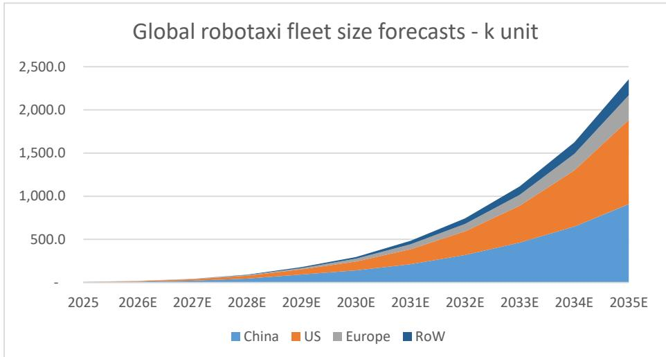
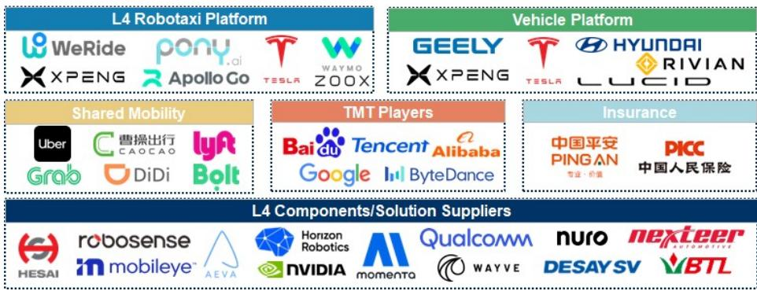
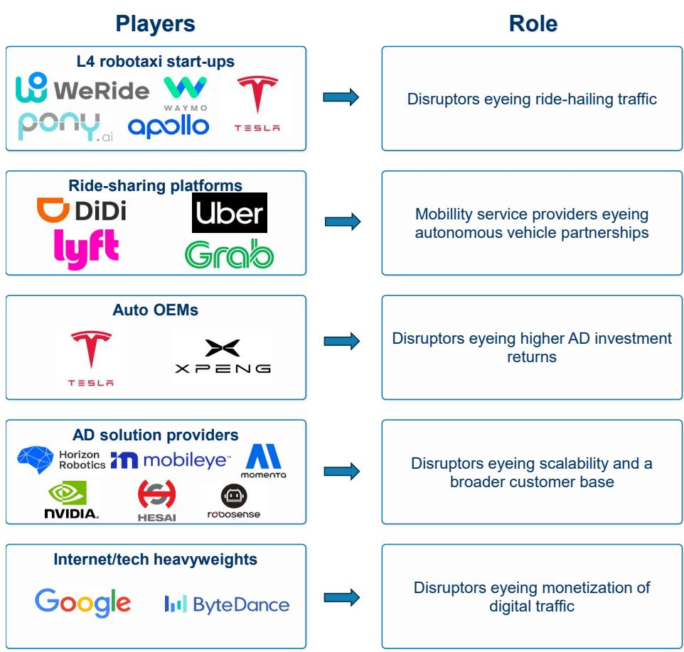
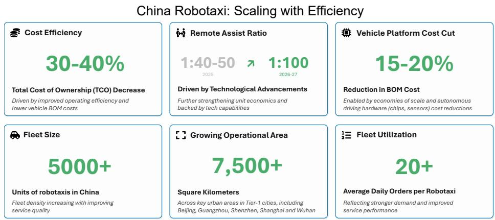

# Robotaxi Diffusion – Robots, Taxis and the Trillion-Dollar Traffic Portal

July 3, 2026 10:23 AM GMT

Global Autos & Shared Mobility

## Executive Summary

The global robotaxi industry is entering a decisive phase, shifting from limited pilots to early commercialization. Advances in artificial intelligence, falling hardware costs, and improving regulatory clarity are enabling real-world deployment, with several operators already running fully driverless services around the clock in select cities. As a result, the key question for observers has moved beyond technological feasibility toward identifying which players can scale most efficiently. This transition mirrors the early days of ride-hailing and sets up a potentially large first-mover advantage.

## New Analysis: A Significant Opportunity with Improving Economics

This report builds a differentiated, bottom-up view of the robotaxi ecosystem, estimating a total addressable market of roughly US\$1 trillion across mobility services, vehicles, software, and adjacent industries. We forecast a global fleet of approximately 2.5 million robotaxis by 2035, with the US and China accounting for the majority of adoption. Crucially, detailed unit economics analysis shows that costs are already below US\$0.50 per kilometer in some cities in China and trending lower globally, supporting the potential for 30–40% margins at scale. We also introduce a “Robotaxi 30” framework to map the competitive landscape and business models across regions and value chains.

Industry restructuring: AV gleaming, EV dim, ICEV's outlook turning grim
Robotaxi diffusion is structurally positive for technology enablers/operators and related components (sensors, compute, by-wire systems, and software), more neutral-to-mixed for NEVs, and potentially another push for the ICEV-to-NEV transition on a broader global basis. In addition, broader robotaxi availability could also have longer-term implication on the ownership of private passenger vehicles, shifting value from traditional vehicle sales toward autonomous fleets, mobility platforms, and service-based models.

## Core Insight: A Platform Shift with Emerging Winners

Robotaxis represent a structural platform shift rather than just an extension of the auto sector, with value creation spanning OEMs, ride-hailing platforms, AI leaders, and semiconductor companies. Cost deflation – particularly driven by China's supply chain – acts as a key catalyst for adoption and intensifies competitive pressure globally. At the same time, early signs of winner-takes-most dynamics are emerging, as scaled operators benefit from data advantages and cost efficiencies. Market leadership is beginning to concentrate among a small group of companies, while the broader ecosystem evolves toward partnership-driven “co-opetition.”

## Catalysts: Scaling, Cost Parity, and AI Progress

Near-term catalysts include the expansion of driverless operations into new cities and the scaling of partnerships between autonomous technology providers and ride-hailing platforms. Over the medium term, further declines in hardware costs and improving utilization rates should drive robotaxis toward cost parity with traditional ride-hailing globally. At the same time, advances in end-to-end AI models and data accumulation are likely to strengthen the competitive positioning of early leaders, establishing barriers to entry and pushing industry consolidation.

## Risks: Regulation, Execution, and Adoption Curve

Despite the strong long-term outlook, several risks remain. Regulatory progress may be uneven across regions, particularly outside the US and China, potentially delaying deployment. Safety concerns or adverse incidents could slow consumer adoption and invite stricter oversight. There is also a risk that unit economics improve more slowly than expected due to lower utilization or higher costs, while the capital intensity of scaling fleets may weigh on near-term returns. Finally, global expansion could prove more complex than anticipated, given differences in infrastructure, policy, and consumer behavior.

# Research Thesis – Robotaxi Ecosystem has Arrived; the Real Race Can Begin

## Setting the Scene

A decade in the making. Try launching Uber or Didi in 2009. No smartphones, no mobile payments, no GPS, no app store. Even with flawless vehicles and drivers, it would have failed on arrival. For the past decade, robotaxis faced a similar reality. The vehicles were not capable, the tech wasn't ready, and the world around them remained deeply circumspect of the prospect.

That ecosystem has finally materialized. Robotaxis are moving from pilot programme to prime time, propelled by four converging forces: 1) A flood of well-capitalized, diverse players. 2) End-to-end AI breakthroughs. 3) Collapsing hardware/training costs. 4) Clearer, more constructive regulations amid intensifying global competition.

The journey is just beginning and substantial hurdles remain, but we are at an inflection point. Consumer skepticism towards robotaxis still runs high, but perception is shifting as autonomous ride-hailing moves from concept to commercial reality. The gap between public perception and industry momentum is narrowing - driven by "first ride effect", continuous tech advancement, and the accelerating pace of real world deployment, in scale.

From 2026, the race stops being about proving it can be done, and becomes about who can move the furthest, the fastest, and the cheapest. Credible players, such as Waymo (covered by Brian Nowak), Baidu Apollo (covered by Gary Yu), WeRide (covered by Tim Hsiao), and Pony.ai (NC), are already running 24/7 fully driverless fleets across a growing list of cities.

Is regulation holding back robotaxi commercialization? Conflicts between consumer demand for autonomous mobility and regulators' focus on safety, liability, data governance, and urban traffic management are creating challenges for OEMs and robotaxi operators in major markets like China. While robotaxi technology may advance faster than regulatory frameworks at times, we believe enforceable standards are essential for scaling the industry responsibly. Clear rules should help build public trust, reduce operational uncertainty, and support the emergence of global leaders.

The Autonomy Inflection. MS Auto and Internet teams have jointly developed a proprietary global robotaxi model with high conviction – we expect unit economics (UE) breakeven by 2028, scaled commercial operations by 2030. By 2035, we see a 2.5mn-vehicle global fleet, serving daily demand at the scale of the population of S. Korea, France or Germany.

In our view, this is the transition that matters – from proof-of-concept to a genuine transportation utility. In the next decade, the robotaxi fleet will be no longer a collection of pilot programs but a distributed mobility grid. The US and China are gaining an upper hand in the near-term with respect to technological advances and fleet rollout, while Europe and broader Asia will play an increasingly important role in shaping the industry landscape over the longer term.

Exhibit 6: Global robotaxis forecasts  
  
Source: MS estimates (E).

## Behind The Scenes

Unit cost of operation is set to decrease 20% in 3 years...: We expect operational leverage to continue kicking in for the next 3 years, and a 20% or more significant cost decrease over the period. This, together with the rise of fare rate for robotaxi to catchup with ordinary taxis and shared mobilities, leads to a modest profit margin of \~10% by 2028 at the robotaxi vehicle level. At that level, robotaxis don't just compete with human drivers; they undercut private car ownership. Once scaled, these fleets can meaningfully alter the cost structure of current mobility industry, unlocking vehicle-level net margins north of 30% globally – and above 40% in developed markets.

… driven by two strong global leaders and multiple emerging regional players: We expect Waymo (covered by Brian Nowak) and Tesla (covered by Andrew Percoco) to be global leaders, anchored by installed base and tech advancement. Al-driven tech breakthroughs/deflation are democratizing capability and four distinct challenger archetypes are building credible positions: 1) L4 robotaxi start-ups with city-specific depth (Zoox [covered by Brian Nowak], WeRide [covered by Tim Hsiao], Pony.ai); 2) ride-sharing platforms (Uber [covered by Brian Nowak], DiDi); 3) auto OEMs with autonomous driving capabilities (XPeng [covered by Tim Hsiao]); and 4) internet and tech heavyweights with compute, mapping, and consumer access at scale (Baidu [covered by Gary Yu]).

Turning the focus to cross-border... The spotlight on US/China as key robotaxi markets, but we see momentum is also building in a handful of strategically important markets beyond them – Europe, the Middle East, and Southeast Asia. These regions are set to play a meaningful role in shaping the global robotaxi competitive landscape. And the playbook is shifting fast: Chinese players can optimize the cost structure of the vehicle (thanks to their head-start in NEV production), while local ride-sharing champions unlock utilization and market access.

… and partnerships across ride-sharing platforms, robotaxi operators, and tech/hardware suppliers. For example, Uber (covered by Brian Nowak) is emerging as a key distribution platform, partnering with Waymo (covered by Brian Nowak) in the US, WeRide (covered by Tim Hsiao) across the Middle East and Europe, as well as Pony.ai, Momenta, and Wayve in international markets. Meanwhile, Baidu's Apollo Go (covered by Gary Yu) has aligned with Lyft to deploy autonomous ride-hailing services across Europe, and Mobileye partners with MOIA in Oslo. WeRide is also expanding into Southeast Asia through its partnership with Grab, while Pony.ai is extending its international footprint through collaborations with ComfortDelGro in Singapore, Bolt in Europe, and Mowasalat in Qatar.

## Partnerships Are Likely to Be Central to Global Robotaxi Scaling

Could ADAS-led OEMs and L4 fleet operators converge over time? We believe OEMs could pave an evolutionary path from ADAS up to L4 robotaxi. However, it would likely take much greater effort and time to ramp up a scaled autonomous ride-hailing network that demands intricate fleet logistics, regulatory savvy, and operational efficiencies. Those criteria will stay as an economic moat to incumbent fleet operators as scaling L4 fleets is a completely different operating model vs. ADAS commercialized today for passenger vehicles.

Key risks to commercialization: Regulatory fragmentation, safety skepticism, unit economics that disappoint, and high upfront R&D requirements still keep execution risk elevated.

Second-order implications are beginning to emerge across adjacent sectors: As L3/L4 liability shifts from drivers to OEMs and software stacks, insurers face a major reset with personal auto lines shrinking while new specialty coverage emerges. High-utilization electric fleets could accelerate gasoline-demand displacement beyond private EV adoption alone. Across the supply chain, x-by-wire, centralized DCUs, and perception hardware are entering volume ramp up, while steering-free cabins turn in-car space into monetizable real estate for displays, HMI, and immersive experiences. Mobility is being repriced from ownership to outcomes, shifting value toward platforms, content, and data. At the silicon layer, surging vehicle compute needs could support a meaningful semiconductor content upgrade cycle.

Rather than focusing on a single winner, focus on the factors that scale – Robotaxi 30: To better capture the opportunities throughout the journey, we have created a Robotaxi 30 list that we believe is well positioned for the L4 future. The real alpha right now isn't in picking the one winner, we believe; it's in backing the trio that determines who scales first: cost advantage, cross-border tie-ups, and direct consumer access. We think observers should focus on who owns the ride.

Exhibit 7: Robotaxi 30 – Who are the key players in the global robotaxi market?  
  
Source: MS.

The conclusions and robotaxi value-chain mapping in this report are supported by supply chain checks, our global robotaxi model, and the insights of MS auto, Internet and tech analysts around the world, underpinning our bottom-up analysis of local competitive dynamics for individual stocks.

In response to investor feedback, we place greater emphasis on first-order 'enablers and explorers' that we believe will be most consequential to the development and scaling of the robotaxi ecosystem.

This framework is intended as a starting point for observers to identify public and private companies shaping the next phase of robotaxi development, with an emphasis on global industry landscape and commercialization potential. It is not intended to be exhaustive; rather, we welcome ongoing dialogue as the ecosystem continues to evolve.

The robotaxi industry is a fast-evolving vertical of embodied AI, where cross-sector collaboration is accelerating both innovation and opportunities. We segment the robotaxi value chain, as part of the broader autonomous driving ecosystem, into six key groups that capture the interaction among technology enablers, OEMs, and mobility service providers.

Robotaxi cases will largely depend on adoption speed, monetization and competitive moats. Observers are focused on credible deployment curves rather than isolated demonstrations, and keen to strip away the “mobility-as-a-service” buzzword to expose the unit economics and revenue levers that will make or break the robotaxi case. Separately, robotaxi isn't just competing technologies but business models, so spotting the commercially durable players is crucial to separate market calls from noise.

To verify the narrative, we address five key questions in this report:

- How Quickly Could Global Robotaxis Ramp up?
- What Are The Different Revenue Models?
- How Do Robotaxi Players Differ in Their Routes to Scale?
- Is Motor Insurance on the Brink of Structural Transformation?
- What's The Potential Impact on Job Markets?

## Key Milestones and Catalysts

## Setting the Stage for 2026 Commercialization

Over the past five years, automotive OEMs, ride-hailing platforms, tech start-ups, and autonomous driving suppliers have methodically constructed the commercial foundations to enable a global robotaxi market.

We see 2026 as the industry's inflection year – evidenced by Waymo, Baidu Apollo, WeRide, Pony.ai and a growing cohort of global players, each operating 24/7 unsupervised commercial fleets across an expanding base of cities with an increasing focus on commercial operations rather than pilot demonstrations.

## Our Central Projections

Supported by 1) a growing number of players, 2) rapid technology maturation, 3) falling costs, and 4) more constructive regulatory backing amid global competition, we project the global robotaxi fleet size to reach around 2.5mn units by 2035, driven by large-scale robotaxi deployment across the US, China and other developed markets. We expect significant valuation dispersion during these early adoption cycles as observers increasingly distinguish between companies that scale early and those that move more gradually.

From 2026 to 2035, we expect the US and China to function as early enablers of L4+ adoption, underpinned by favorable autonomous-vehicle policy frameworks, advanced technology expertise from tech and EV players, and mature ride-sharing networks that provide immediate demand channels. Simultaneously – and perhaps underappreciated by consensus – we see substantial potential emerging in Europe, the Middle East, and ASEAN, which could play a meaningful role in global fleet penetration and, in aggregate, represent an opportunity comparable to China's.

By 2035, we look for the global L4+ robotaxi fleet to reach 2.5mn units, serving daily demand equivalent in size to the population of S. Korea, France or Germany. The US and China would likely account for roughly 70% of fleet size with Europe alongside the Middle East and ASEAN capturing the remaining 30% – an absolute unit count large enough to accommodate multiple local winners.

Exhibit 8: Global robotaxi fleet size forecasts  
  
Source: MS (E) estimates.

## After years of cautious pilot trials, robotaxi adoption is approaching a steeper adoption phase, driven in our view by converging trends that self-reinforce:

- EV momentum is slowing while AV momentum is building: Major economies are becoming more engaged in shaping the development of L4 autonomous driving, supporting a more active policy backdrop that was largely absent over the past two years.
- Expanding operational design domains (ODD) generate more training data, which improves safety, which unlocks more permits, which expands ODDs further.
- Commercial rollout is accelerating, fuelled by a sharp increase in participants across automotive, technology, utilities, and beyond.
- These cross-sector players are pursuing distinct long-term strategies but share a near-term priority: scaling L4 ridership and data.
- A richer ecosystem and broader applications have shifted L4 autonomous driving from localized pilots toward broader commercial deployment.
- The network effects in data, where miles driven at L4 generate proprietary training signals, and enhance the competitive advantages for leading players who can scale fast.
- Early movers that remove drivers from just the first 1% of the 10mn vehicles on global taxi and ride-hailing platforms could see meaningful valuation upside; later entrants risk commoditization.

## Four Powerful Catalysts Shifting Robotaxi Rollout into High Gear

## Catalyst 1: Diverse Players Accelerated by Al Breakthroughs

End-to-end AI architectures are simultaneously lowering barriers to entry and raising performance ceilings. The transition from modular, rule-based autonomy stacks toward unified neural networks trained through world-model simulation - complemented by closed-loop reinforcement learning that exposes systems to the consequences of their own decisions - is dramatically compressing development timelines. The result is a broader competitive field entering the space with commercially viable capabilities, accelerating both fleet deployment and the data flywheel upon which autonomous performance depends.

Globally, this Al wave has democratized access to L4-competitive technology in a way that pure hardware cost deflation alone never could. In the US, Waymo's (covered by Brian Nowak) hybrid Al-plus-rule-based stack and Tesla's (covered by Andrew Percoco) vision-only neural network approach represent two distinct approaches to long-run architecture - and both are maturing simultaneously. In China, WeRide (covered by Tim Hsiao), Pony.ai, and Baidu Apollo (covered by Gary Yu) have each crossed meaningful competency thresholds enabled by scale, with Chinese players benefiting from a regulatory environment that, unlike Europe, allows much broader testing permissions. In the Middle East, where operational design domains are less topographically complex and weather windows are broad, the Al maturity bar to commercial deployment has proven meaningfully lower – one reason WeRide was able to achieve unit economics breakeven in Abu Dhabi ahead of most other markets globally.

We highlight five categories of players: L4 pure-plays, OEM adjacents, ride-sharing platforms, solution providers, and tech heavyweights. Each are applying AI in ways that reflect their underlying competitive positioning.

L4 pure-plays have the deepest algorithmic investment and the longest track record in driverless miles.

OEM adjacents have the broadest data corpus from consumer vehicle fleets, providing training signal diversity that purpose-built robotaxi operators cannot easily replicate.

Internet/tech heavyweights bring compute infrastructure and consumer distribution at scale.

We believe convergence of these capabilities is why 2026 feels categorically different from the hype cycles seen in both 2018 and 2021.

Exhibit 9: Key global robotaxi players  
  
Source: MS.

Catalyst 2: Technology Maturation Meeting Commercial Scalability

Technological maturation is colliding with commercial scalability, driven by a fundamental shift toward end-to-end AI architectures. Leading robotaxi operators are demonstrating performance improvements measured in miles-per-intervention that would have seemed implausible two years ago. This evolution is complemented by advanced reinforcement learning techniques. Robotaxi players are exploring closed-loop training methods that more easily generalize, rather than relying solely on traditional behavior cloning methods. These improvements are directly reflected in MPI enhancements across major players.

Fleet operational data from Waymo's cumulative L4+ miles globally, Pony.ai's city-wide deployments across China's four megacities, and WeRide's multi-continent operations are now generating the training signal volumes necessary for genuine generalization beyond geofenced competence. The distinction matters significantly for the medium-term competitive picture in our view – a system that can generalise can handle novel-edge cases without explicit programming, which is the prerequisite for expanding into new cities and geographies without proportional safety engineering investment.

In the US, Waymo's (covered by Brian Nowak) expansion to Washington DC and other snow markets represents geographic generalization corridors into markets with meaningfully different driving environments.

In China, the maturation is particularly visible in the metrics that matter commercially. Pony.ai's 7th-generation robotaxi deployed to Guangzhou in late 2025 has hit the city-level unit economics breakeven threshold that the company had targeted for years. Baidu Apollo's system has cleared the same threshold in Wuhan. These are not demo metrics – they are production KPis from fleets generating tens of thousands of rides monthly.

In Europe and the rest of the world, maturation is arriving at a lag but the pace is accelerating. For example, Uber (covered by Brian Nowak) is partnering with WeRide, Pony.ai, Momenta and Wayve across Europe, the Middle East, and several other regions. Baidu's Apollo Go and Lyft will deploy autonomous ride-hailing services across Europe while WeRide and Pony.ai are both expanding in SEA as well.

## Catalyst 3: A Structural Change in Total Cost of Operation

Robotaxi total cost of ownership has declined sharply over the past three years, driven by operating leverage and continuous optimization of robotaxi vehicle BoMs. We project a further 20% reduction in operating cost per kilometer over the next three years, supported by ongoing sensor and hardware cost deflation, AI-driven software efficiencies, improving remote-assistance productivity ratios, and higher utilization as operational design domains expand.

The profitability implications are transformative. L4+ robotaxi deployment can meaningfully reshape the ride-hailing cost structure, unlocking vehicle-level net margins of more than 30% globally at scale and more than 40% in developed markets, where comparable taxi fares are significantly higher.

In China, operating cost improvements have been particularly pronounced. Chinese OEM partners can manufacture purpose-built robotaxi platforms for US\$35–40k per vehicle in 2026, representing a meaningful discount to Western equivalents and a fraction of the US \$150k+ unit costs that characterized many early robotaxi deployments in the 2018-20 period. In several Chinese cities, operators have already demonstrated pathways to operating breakeven, supported by a highly competitive cost base, low electricity prices, and a relatively favorable insurance framework for autonomous vehicles.

Globally, the total cost of ownership equation is evolving along a different trajectory. Labor costs are higher, but so is revenue per ride. The key variable remains hardware cost deflation. As fleet sizes expand from several thousand vehicles to tens of thousands, LiDAR, compute, and sensor costs should decline along manufacturing learning curves, narrowing the operating cost gap with Chinese operators. We believe global operators could see more meaningful hardware cost inflection over the next five years.

For emerging robotaxi markets, particularly developed markets such as Europe, operating economics are more complex. Higher vehicle acquisition and registration costs, stricter data localization requirements that increase cloud and compute capex, and a fragmented regulatory landscape all raise the cost of scaling across multiple cities. That said, the revenue side of the equation is also more attractive, as taxi fares in cities such as London, Paris, and Munich rank among the highest globally. As a result, while European robotaxi economics may structurally lag China by three to five years, they offer some of the strongest long-term margin potential globally once the market reaches maturity.

Exhibit 10: China robotaxi cost of ownership decline  
  
Source: MS.

## Catalyst 4: A Strategic Priority – Constructive Regulatory Progress as Global Competition Intensifies

The major economies are increasingly engaged. Tesla is advancing Cybercab, while Waymo continues to strengthen its position in the US. This momentum is encouraging ride-hailing platforms globally to explore and formalize partnerships. The immediate beneficiaries are Chinese L4 players, such as WeRide and Pony.ai, whose cost structures make partnership economics compelling. At the same time, US competitive momentum is spurring policy attention in Beijing, where autonomous vehicles, including L4 robotaxis, are now viewed as the next strategic priority after EVs.

The market has focused heavily on US–China dynamics, but less on the regions in between. Europe, the Middle East, and ASEAN together represent a taxi and ride-hailing fleet of roughly 4 million units. Even 25% penetration implies around 1 million incremental L4 vehicles – an opportunity large enough to define competitive positioning for the next decade. While scaling will take time, governments across these regions increasingly recognize the importance of shaping the supply chain early. As a result, regulatory frameworks, permitting regimes, and local procurement policies are accelerating out of strategic necessity rather than enthusiasm.

Global collaboration is the new competition. Beyond technological advancement, the pursuit of cost-effective solutions and scalable operations is key. Consistent BoM reduction and rapid scaling will rely significantly on Chinese vehicle solutions, which should cost around US\$35–40k per vehicle in 2026. Higher vehicle utilization and lower operating costs, in turn, depend heavily on strategic tie-ups with local ride-sharing partners that provide demand aggregation, consumer trust, and regulatory relationships.

Consequently, we expect a growing number of partnerships, such as WeRide–Uber in the Middle East and WeRide–Grab in Southeast Asia, to form over the next two to three years. Recent examples include Pony.ai's collaboration with Qatar's Mowasalat to begin L4 robotaxi testing in Doha, Momenta's partnership with Uber to roll out L4 robotaxis in Munich in 2026, and Ant Group-backed Hello's plan to launch its HR1 robotaxi in 2026, teaming up with Horizon Robotics and targeting a fleet of 50,000 units across 10 or more cities by 2027.

Across these developments, a consistent structure is emerging. Chinese technology and cost discipline paired with local platform reach and regulatory credibility. This is not a transitional model, but the foundation of the global robotaxi supply chain. The pace of deal formation over the next two to three years will be critical in establishing competitive advantages.

## The Path to Sustained Profitability: A Scale Game

Unit economics analysis divorced from operational context is analytically meaningless. Robotaxi profitability depends on three interdependent variables – fleet utilization, operational domain coverage, and order frequency – each of which improves non-linearly with scale. The compounding nature of this relationship explains why early-mover advantages in this industry are so durable and why observers should weigh demonstrated operational scale as heavily as technology metrics when assessing competitive positioning.

We believe L4+ robotaxi players can achieve vehicle-level net margins of 30% or more at scale. In developed markets, where labor and other operating costs account for a larger share of the total, we estimate robotaxis could unlock net margins exceeding 40% by 2030. The profit margin will then be distributed among different participants – fleet owners, shared mobility platforms, and technology enablers – to fund hardware and software R&D, operating licenses, and potentially taxation. Our projections point to a restructuring of both the cost stack of the traditional taxi business and the profit redistribution channel.

In the US, the unit economics trajectory of bellwethers such as Waymo is the key metric to watch, as early adopters are willing to pay for novelty and reliability. As volume scales, pricing power may moderate, but the structural elimination of labor costs in the US should more than offset any yield compression at reasonable utilization rates. The critical near-term metric is rides per vehicle per day, as each additional ride beyond the initial utilization threshold flows through at near-100% incremental margin, given the predominantly fixed cost structure of a robotaxi fleet.

In China, Pony.ai has disclosed that it achieved city-level vehicle breakeven in Guangzhou and Shenzhen in late 2025, while Baidu Apollo reached the same threshold in Wuhan. Our modeling indicates that average daily revenue of Rmb450–500 (\~US\$75) per vehicle represents the breakeven threshold on a broader operational basis. This translates to approximately 23–25 orders per day at prevailing Guangzhou fare levels – a target that is achievable under current operational area coverage and increasingly routine as ODDs expand.

Globally, WeRide has achieved unit economics breakeven for its robotaxi fleet in Abu Dhabi by removing safety drivers from vehicles and targets expansion to 300+ vehicles by year-end. The Abu Dhabi achievement is instructive because it demonstrates breakeven in a market with genuinely different operating characteristics – wider roads, lower traffic complexity, and higher average fares driven by affluent expatriate and tourist demographics – at a smaller fleet size than China's Tier 1 deployments. This has important implications for Middle East expansion economics and suggests the region may reach sustainable profitability faster than consensus assumes.

L2+ and L4 - two parallel universes or a single destination? Upgrading from L2+ to L4 will not be easy. Players have followed an evolutionary path from ADAS toward L3 and later L4, with numerous iterations in both hardware and algorithms. While L2+ players could theoretically evolve into L4 operators, running an autonomous ride-hailing fleet involves much more than offering an L4 technical solution. The sophisticated ride-hailing ecosystem – complex fleet logistics, regulatory relationships, fleet maintenance operations, dynamic dispatching, and consumer acquisition – gives incumbent robotaxi operators a significant economic moat that pure technology players are likely to underestimate.

Where could we be wrong? Regulatory hurdles remain a primary concern, as robotaxi services are subject to evolving, jurisdiction-specific regimes governing testing, deployment, data privacy, cybersecurity, and insurance. Safety concerns persist, with many consumers still questioning the reliability of autonomous systems in complex scenarios. Unit economics may not materialize as quickly as expected due to uncertainties in robotaxi pricing, vehicle utilization, and hardware costs. High upfront R&D capital requirements and prolonged development cycles could also erode profitability for players that lack the balance sheet depth to absorb extended pre-scale periods.

Broader Ecosystem Impact

Building on our prior research, the Bluepaper From Horsepower to Brainpower – AI Takes the Wheel, we delve deeper into the dynamics of the L4 robotaxi ecosystem, and examine the broader cross-sector and regional implications. Growing adoption of robotaxis not only opens a wealth of direct opportunities but also presents intriguing second-derivative plays tied to insurance, transportation, utilities, manufacturing, and semiconductors.

## Auto Insurance: A Business Model in Transition

The robotaxi's impact on insurance is one of the most underappreciated second-order stories in the sector. Chinese insurers are developing L3/L4-specific products to meet new demands from robotaxi companies, and the current pricing models – built on actuarial tables derived from human-driven vehicle accident rates – are fundamentally inadequate for autonomous fleet underwriting. Current robotaxi insurance in China is typically structured as a commercial vehicle product with manual underwriting adjustments, reflecting the absence of actuarial data for autonomous fleet risk. As Waymo's 200mn L4 miles by year end, Pony.ai's Guangzhou deployment data, and WeRide's Abu Dhabi operations generate the statistical base for proper actuarial modelling, we expect the insurance market will reprice dramatically.

If L4 robotaxis demonstrate superior safety performance relative to human-driven vehicles, which the available evidence suggests they do in their operational design domains, the current pure risk premium is expected to sustain a downward trend over the long-term in a non-linear pattern, along with potential new risk exposures and insurance demand. This deflation benefits robotaxi operators directly by reducing one of their material fixed costs per vehicle. It may also impact incumbent auto insurers that face the prospect of an accelerating business structure transformation of their premium base as consumers shift from privately owned vehicles to robotaxi services. The European insurance market, where per-vehicle premiums are highest and profit pools are most concentrated among incumbent carriers, faces the most significant structural impact from this dynamic.

## Car Ownership and Oil Consumption – Longer-Term but Real

Widespread L4 deployment could meaningfully reduce consumer appetite for private vehicle ownership, particularly if autonomous services prove more cost-effective and convenient at the price points we project for 2030. The car ownership impact is most plausible in dense urban environments, precisely the markets where robotaxi penetration will be highest. A household that currently owns two vehicles primarily for commuting and errand-running has a credible economic alternative to car ownership if robotaxi fares fall below the marginal cost of driving and owning a personal vehicle.

## Oil Demand Implications are Twofold

The shift from private ownership reduces the total vehicle fleet over time, and the robotaxi fleet is predominantly electric, meaning each vehicle-mile that migrates from human-driven petrol or diesel to autonomous electric represents a permanent oil demand reduction. The timeline of this impact is long – operating over decades rather than years – but the directional signal is unambiguous and relevant for energy sector observers thinking about the 2030+ demand picture. The Middle East markets most aggressively adopting robotaxis are also the world's largest oil producers, an irony that has not been lost on sovereign wealth funds from Abu Dhabi and Riyadh that are simultaneously investing in autonomous mobility and managing national oil company revenues.

## Auto Manufacturing – Platform Disruption

The rise of robotaxis will have significant implications for manufacturing volumes, vehicle design philosophy, and supply chain dynamics across the global auto industry. Robotaxi platforms require meaningfully different design specifications than consumer vehicles: commercial-grade durability for higher utilization cycles; interior configurations optimized for passenger comfort without a driver seat; sensor mounting infrastructure integrated into body panels; and compute chassis capable of supporting 2,000+ TOPS of processing power. These specifications do not map cleanly to existing consumer vehicle platforms, requiring either purpose-built robotaxi vehicles or extensive modification of existing platforms.

Chinese OEM manufacturers, e.g. BAIC-Bluepark, GAC, XPeng, and emerging robotaxi-specialist manufacturers are best positioned to capture the purpose-built robotaxi vehicle market given their cost structures and their existing supply relationships with robotaxi operators. Western OEM manufacturers, with higher labour costs and less flexible production systems, are more likely to participate through modified existing platforms or through licensing manufacturing capacity to technology-led robotaxi operators. The manufacturing winner in robotaxis will ultimately be determined by cost and delivery speed rather than brand prestige, which will be a fundamentally different competitive framework than consumer automotive.

## Automotive Semi – A Meaningful Upgrade Cycle

Mainstream L4 robotaxis currently run on 2,000+ TOPS of computing power, typically implemented through dual Thor configurations from Nvidia (covered by Joseph Moore). This represents a meaningful upgrade from the approximately 500 TOPS average that characterises L2+ passenger vehicles – a four-to-one improvement that flows directly to Nvidia's automotive revenue line and to the compute-adjacent supply chain, including memory, power management ICs, and thermal management systems. Looking forward, we expect robotaxi compute requirements to double to 4,000+ TOPS by 2030, if not earlier, as autonomous systems incorporate more complex sensor fusion, longer planning horizons, and higher-fidelity simulation loops. The semiconductor content per robotaxi vehicle at 4,000 TOPS is several multiples of the content per conventional passenger vehicle, making robotaxi fleet proliferation a meaningful revenue driver for auto semiconductor suppliers at scale.

## Key Question 1: How Quickly Could Global Robotaxis Ramp Up?

Global robotaxi penetration is not a single curve but four distinct adoption trajectories that diverge meaningfully on timing, speed, and ultimate endpoint. Treating them as a monolith risks substantial forecasting error. The US and China are the sprint markets; Europe is the marathon; the rest of the world – anchored by the Middle East and ASEAN – is the wildcard that could outperform expectations if regulatory hospitality proves durable and Chinese vehicle cost structures are deployed effectively.

Our global forecast assumes a 2.5mn unit fleet size by 2035, with US and China accounting for approximately 70% – the remainder distributed across Europe, the Middle East, and RoW. This growth is supported by expanding operational design domains (ODDs) in each region, improving MPI metrics, and the continued entry of credible robotaxi makers/fleet operators in markets beyond China and the US. Average daily orders per vehicle reach 16-25 globally in relatively mature markets such as China, European and the US by 2035, consistent with current ride-sharing utilization benchmarks that robotaxi operators are targeting.

## The US – Regulatory Clarity Meets Premium Economics (Brian Nowak/Andrew Percoco)

We look for total fleet size of 977k units in the US by 2035 supported by expanding ODDs in each region and improving MPI metrics. Average daily orders per vehicle reach 16 by 2035, consistent with current ride-sharing utilization benchmarks that robotaxi operators are targeting as their commercial proving ground.

The US robotaxi market is meaningfully more mature than most market participants appreciated two years ago. The regulatory environment is the most important variable determining the US ramp trajectory, and here the trend is meaningfully positive. The current administration's stance toward autonomous vehicles is broadly permissive, with an emphasis on maintaining the US's global pole position. Among major robotaxi players, Waymo's presence across major cities represents a genuine commercial footprint, not a perpetual pilot programme. Meanwhile, Tesla's entry is the variable that could significantly accelerate the US ramp up. MS US auto team projects Tesla to own and operate 30k robotaxis by 2030, scaling to 1mn by 2035.

## China – The Industrial-Scale Lab (Tim Hsiao/Gary Yu)

We expect the fleet size of robotaxis in China to reach 907k units by 2035, largely comparable to that of the US. This is driven by expanding ODDs in each region, improving MPI metrics, and the continued entry of credible robotaxi makers/fleet operators. Average daily orders per vehicle reach 25 by 2030, and stabilize thereafter, consistent with current ride-sharing utilization benchmarks that robotaxi operators are targeting as their commercial proving ground.

China is the market where robotaxi deployment has advanced the fastest, operated at the largest scale, and demonstrated the most commercially relevant unit economics. We think the combination of policy support, manufacturing cost structure, ride-hailing platform maturity, and a regulatory framework has produced a competitive environment, as Beijing has an explicit goal of enabling commercially autonomous operations.

Given regulatory permit concentration, we believe the data-dependence of autonomous driving algorithms, and the network effects inherent in fleet scale, mean the market will likely support three to four credible scaled operators rather than the dozens of EV brands that characterize China's automotive market. The cost structure advantage of Chinese OEM vehicle platforms (XPeng, Geely, BAIC-Bluepark, GAC as preferred robotaxi body manufacturers) is a shared resource that distributes vehicle cost benefits across all operators, meaning vehicle cost will not be the primary differentiator. Instead, the competitive levers are algorithm performance, regulatory relationships, operational efficiency and partnership quality.

We believe the driver
