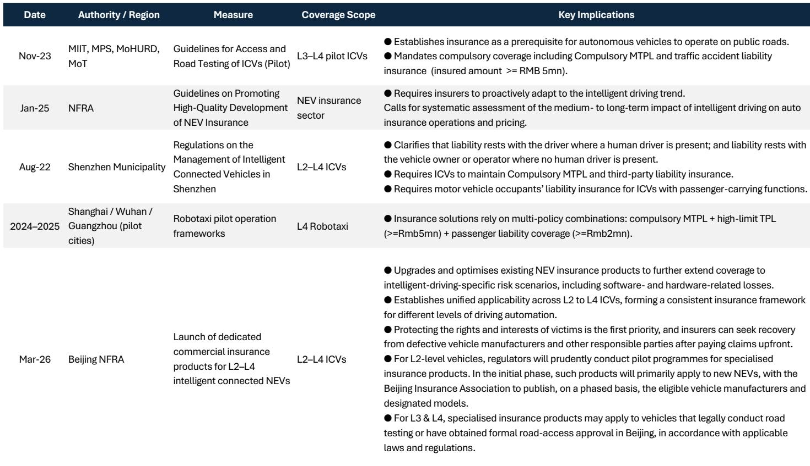
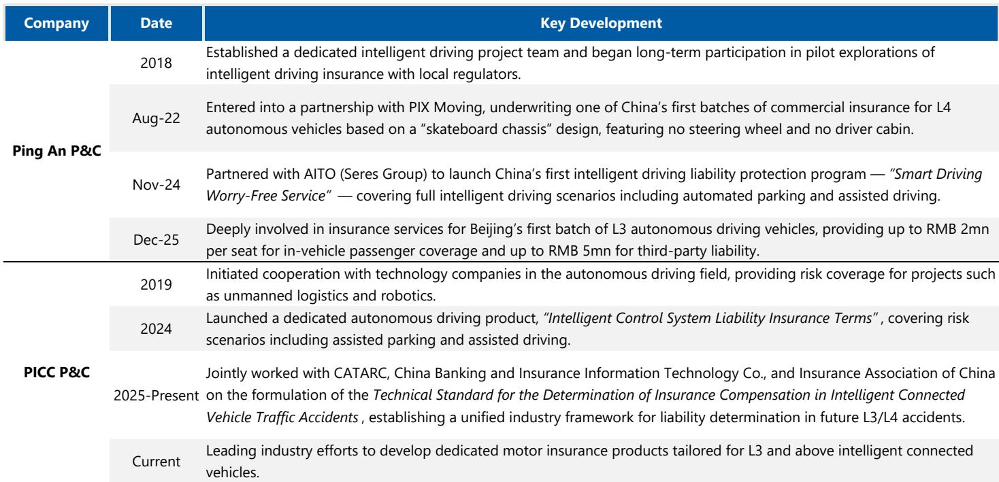
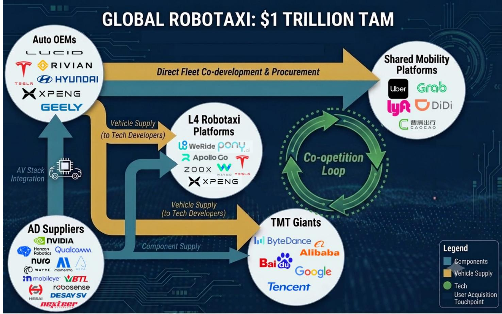

# MS：中国供应链通缩被低估，Robotaxi成本2027年降至4万美元

当全球出租车队中只有1%转化为无人驾驶时，这不再是试验，而是一个杠杆。MS最新发布的全球自动驾驶共享出行深度报告，给出了一个核心判断：Robotaxi已经从技术试点正式进入商业规模化阶段，而谁能率先完成第一个百分点的渗透，谁就将获得不成比例的市场价值。

这份由MS汽车与互联网团队联合构建的全球模型显示，到2040年，Robotaxi将创造一个约1万亿美元的总可寻址市场。更关键的是，单位经济模型预计将在2028年左右达到盈亏平衡，2030年进入规模化运营。到2035年，全球Robotaxi车队规模将达到约250万辆，从集中部署演变为分布式出行网络，每日客运量可媲美韩国、法国或德国等国家的人口规模。

这不是一个遥远的愿景。报告指出，Waymo、百度Apollo、文远知行、小马智行等玩家已经在多个城市实现7x24小时全无人驾驶运营。成本下降的速度比多数人预想的更快——在中国某些城市，每公里成本已经低于0.50美元，且仍在下降。

## 1. 中国供应链通缩，是市场最被低估的加速器

MS明确指出，一个被市场严重低估的关键变量是中国供应链带来的成本通缩。报告认为，中国制造的Robotaxi解决方案物料成本将在2027年降至35,000-40,000美元，随后以3-5%的年复合降幅持续下降至2030年。

这意味着什么？过去被认为成本高企的L4技术，正在被压缩为大众市场可承受的组件。中国在新能源汽车生产中积累的供应链优势，正在向自动驾驶领域溢出。这不是渐进式的成本优化，而是一种结构性通缩——将原本只有高端测试车辆才能搭载的传感器、计算平台和线控系统，变成可规模化的标准化组件。

> **KC评论：** 中国供应链通缩是这份报告最值得深挖的洞见之一。它意味着Robotaxi的成本曲线可能比多数全球模型预测的更陡峭。报告中的成本分解图表、各城市单位经济模型对比，以及中国供应商的定价逻辑，是完整报告中最有价值的部分。继续看原文，真正有价值的是图表、假设和验证路径；完整报告与KC评论在每日汇编。

## 2. 赢家不会来自传统OEM的通用组装，而是科技平台与低成本方案商

报告提出了一个“Robotaxi 30”框架，将全球竞争者按四种原型分类：拥有城市级深度的L4初创公司（Zoox、文远知行、小马智行）、出行平台（Uber、滴滴）、具备自动驾驶能力的电动汽车制造商（小鹏），以及拥有计算和消费触达能力的科技巨头（百度）。

但最值得关注的判断是：价值创造不太可能流向传统OEM的通用组装业务，而是集中在科技和消费者访问权的拥有者（如Waymo通过Alphabet、Tesla），以及低成本自动驾驶技术栈的赋能者（如百度、文远知行、禾赛、小鹏）。

这意味着，Robotaxi的价值链正在发生结构性重组。传统汽车制造商如果只做“硬件代工”，将很难分到最大的一块蛋糕。真正的价值在于拥有出行服务的入口、数据闭环和算法能力。对于区域受限的读者来说，美国市场主要通过上市平台和母公司的形式参与，中国/香港市场提供更直接的自动驾驶/电动汽车技术栈标的，而欧洲和亚洲除中国外的市场，仍以合作伙伴关系为主。

## 3. 美国和中国领先，但格局远未定型

报告预测，到2035年，美国和中国的Robotaxi车队将占全球总量的约70%。这个判断基于两个国家在技术、资本和政策三个维度的综合优势。

但MS也指出，欧洲、中东和东南亚正在成为战略上重要的市场。这些地区的打法正在快速演变：中国企业可以优化车辆成本结构（得益于在新能源汽车生产中的先发优势），而本地出行平台则负责解锁利用率和市场准入。

合作模式正在成为主流。Uber正在成为关键的出行分发平台，在美国与Waymo合作，在中东和欧洲与文远知行合作，在全球市场与小马智行、Momenta、Wayve合作。百度Apollo Go与Lyft合作在欧洲部署自动驾驶出行服务。文远知行通过与Grab合作进入东南亚。小马智行也在积极拓展海外市场。

> **KC评论：** 这揭示了一个重要趋势：Robotaxi的竞争格局不是零和博弈，而是“竞合”模式。技术方、平台方、硬件供应商之间的合作关系，可能比单一公司的技术突破更能决定市场格局。报告中的合作伙伴关系图谱和区域布局图，是理解这一动态的关键素材。

## 4. 单位经济模型：从亏损到30-40%净利率的路径

MS对Robotaxi的单位经济模型进行了详细拆解。核心结论是：未来三年运营成本将下降20%以上，加上Robotaxi定价向传统出租车和共享出行靠拢，预计到2028年单车层面可实现约10%的利润率。

一旦规模化，这些车队将从根本上改变当前出行行业的成本结构。报告预测，全球范围内单车净利率可达30%以上，在发达市场甚至超过40%。这个数字意味着什么？当Robotaxi的单位经济模型跑通后，它不仅与人类司机竞争，更将直接挑战私家车拥有权的经济性。

> **KC评论：** 30-40%的净利率假设是这份报告最激进的判断之一。支撑这一判断的关键在于：利用率提升、硬件成本下降、以及软件和服务的附加收入。报告中的单位经济模型敏感性分析、不同场景下的成本分解，以及达到盈亏平衡的关键假设，是读者必须仔细审视的部分。这些细节在完整报告中有更充分的展开。

## 5. 报告尚未完全回答的关键问题：安全事件的尾部风险与监管的不对称性

尽管MS对Robotaxi的前景持积极态度，但报告也坦诚指出了几个尚未完全回答的关键问题。

首先是安全事件的尾部风险。报告提到，安全事件或不利事件可能冷却消费者需求，并引发更严格的监管审查。但问题在于：这种尾部风险如何定价？如果发生重大事故，对行业渗透率曲线和公司估值的影响有多大？报告给出了情景分析，但并未完全量化这种风险的定价机制。

其次是监管的不对称性。报告指出，监管进展在不同地区可能不均衡，尤其是在美国和中国以外的市场。但更深层的问题是：监管框架的差异是否会形成“监管套利”机会，还是会导致市场碎片化？中国和美国在监管思路上的差异——中国更强调标准化和规模化，美国更依赖地方试验和联邦框架——将如何影响全球竞争格局？

最后是资本密集度问题。报告提到，规模化车队的资本密集度可能拖累近期回报。但具体到不同玩家：特斯拉的硬件利润率能否支撑其车队扩张？Waymo背靠Alphabet的资本支持，其烧钱速度是否可持续？中国玩家在资本市场的融资能力如何？这些问题的答案将决定谁能真正跑完这场马拉松。

## 6. 读者的观察框架：从四个维度判断谁是真正的赢家

基于MS的分析框架，我们提炼出四个观察维度，帮助读者跟踪这个万亿市场的演变。

第一，成本曲线的斜率。谁能在保持技术领先的同时，将单车成本降至最低？中国供应链通缩是一个变量，但算法效率、传感器配置和计算平台的选择同样关键。

第二，数据飞轮的转速。自动驾驶的核心竞争力来自数据。谁的车队规模最大、运营里程最长、数据闭环最完整，谁就能在算法迭代上持续领先。这是一个自我强化的循环。

第三，合作伙伴网络的质量。单一玩家很难覆盖所有环节。谁能在技术、平台、硬件、运营等环节建立最有效的合作关系，谁就能在扩张速度上占优。

第四，监管适应的灵活性。不同市场的监管要求差异巨大。谁能最快适应不同地区的法规要求，同时保持技术栈的统一性，谁就能实现真正的全球化部署。

这些维度不是孤立的，而是相互影响的。例如，中国供应链优势可以帮助降低硬件成本，但数据飞轮的速度取决于车队规模和运营范围，而这又受到监管框架的制约。

---

Robotaxi的万亿机会已经不再是一个概念，而是一个正在展开的产业现实。但正如MS所强调的，这场竞争的核心不是技术验证，而是规模化的速度、成本的控制和生态系统的构建。第一个百分点的渗透率，将决定谁能拥有未来的出行市场。

对于希望深入理解这个主题的读者，这篇报告的价值不仅在于它的结论，更在于它的分析框架、假设条件和验证路径。更多的国际信源汇编和评论，包括对报告图表的详细拆解、关键假设的敏感性分析、以及不同区域和玩家的竞争态势对比，欢迎扫码交流。每日更新，汇总国际主流叙事、数据和图表，观测边际变化。这里汇聚了头部券商、PE/VC、投行、并购、对冲基金、资管机构、战略咨询、智库等朋友，期待交流。

Personal reading notes and learning share only. Not investment advice.

