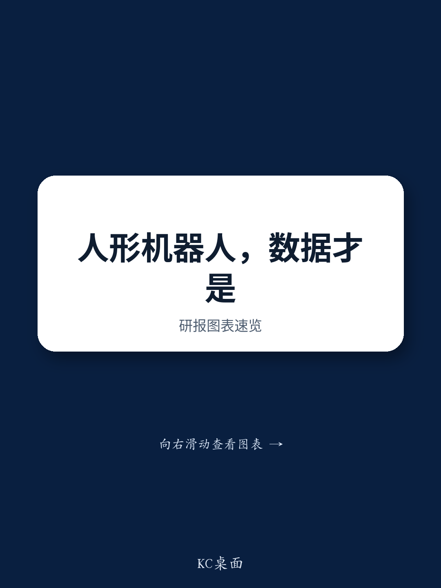

# NOM：2026年人形机器人数据成稀缺资源，遥操作数据最贵

当市场还在为特斯拉Optimus的产能爬坡和成本曲线讨论时，一份来自NOM的研报，将行业最关键的瓶颈从“硬件制造”拉回到了“数据采集”。这份报告的核心判断是：2026年，数据已成为人形机器人产业最稀缺的资源，而不同数据类型的量价分化，正在重塑整个供应商的竞争版图。其中，价值最高的并非规模最大的数据池，而是那些难以规模化、却对模型性能至关重要的部分。

报告指出，基于约10万台的出货量假设，行业年度数据需求将达到约1000万小时。这个数字本身并不令人意外，真正有价值的是其背后精细化的分层定价逻辑。四种主要数据类型——无具身数据、真实机器遥操作数据、故障恢复数据以及仿真数据——呈现出显著的量价背离。其中，遥操作数据以约30%的时长占比，贡献了约22-25亿元的最大单一子市场，单价高达每小时500-1000元人民币，成为当前价值最高的数据层。

> **KC评论：** 这组数据直接回答了读者最关心的问题：机器人数据这条赛道，哪块最值得关注？答案不是规模最大的视频数据，而是最“贵”的遥操作数据。但这份报告的价值远不止于此，它进一步揭示了为什么这种分层结构会持续，以及什么样的商业模式才能抓住这个价值池。完整报告中的图表和假设拆解，才是理解这个判断的关键。

继续看原文，真正有价值的是图表、假设和验证路径。完整报告与KC评论在每日汇编。

## 1. 软硬件闭环是数据供应商的结构性护城河

面对这种量价分层的市场结构，纯数据即服务（DaaS）模式虽然能快速变现，但其护城河在客户数据规模扩大后将面临严峻挑战。下游人形机器人整机厂商的垂直整合风险，会不断侵蚀单纯依赖数据采集的供应商的生存空间。

NOM认为，结构上更可持续的商业模式是“软硬件闭环”——覆盖数据采集、传输、评估、训练、部署和调试的全链路。这种模式的核心优势在于，它能够捕获第一手场景数据、故障样本、评估输出和部署遥测数据，这些正是构建真正数据飞轮和产生经常性收入的前提条件。

虽然前期在工具链、硬件和现场部署上的投入巨大，但其长期天花板也相应更高。报告基于行业调研判断，工业场景（搬运、分拣、机床上下料、装配）有望在2027-2028年实现质变突破，而家庭部署则要等到2030年之后，酒店和公寓清洁可能是更早的应用切口。

## 2. 仿真数据是加速器，但无法替代真实机器数据

一个常见的误区是，随着仿真技术的进步，真实机器数据的需求会大幅下降。NOM的结论恰好相反：仿真是力量倍增器，而非真实机器数据的替代品。

报告中引用了三家公司的公开数据来支撑这一观点：Physical Intelligence的π0.5模型在多步骤家务子任务上成功率达94%，但在长周期家务任务类别上降至75-80%；NVIDIA的合成运动管线使GR00T N1真实机器人性能相比纯真实训练提升约40%；Lightwheel则报告了最优的10:1合成与真实训练比例，能带来约30%的平均模型性能提升。

这些数据共同指向一个结论：仿真可以覆盖大部分搬运/分拣场景，但精密装配、接触丰富或柔性物体操控，仍然依赖真实机器的微调。家庭场景在未来3-5年内，单靠仿真仍远远不够。

> **KC评论：** 这个判断对读者而言，意味着“仿真降本”的故事并不完整。真正需要关注的，是哪些环节的仿真能力已经足够，哪些环节仍然依赖昂贵的真实数据。报告中对不同应用场景的仿真覆盖度拆解，是理解这一点的关键。

## 3. 灵巧手是通往具身智能的关键瓶颈，也是价值保护器

为什么精密装配和接触丰富的任务难以被仿真替代？为什么家庭部署是一个2030年之后的故事？答案在“手”上。

NOM指出，灵巧手的竞争格局由“尺寸与传感器”的权衡定义。越接近人手的尺寸，训练数据采集与下游操作之间的映射关系越好，但缩小的体积又无法容纳足够的传感器。目前国内厂商中，只有一家被描述为真正的人手尺寸，而其他领先的触觉聚焦型手和高自由度设计，在体积上仍明显偏大，这损害了数据到执行的一致性。

触觉技术本身也有天花板：点压力传感器无法感知侧向力或滑移，现有的电子皮肤在侧向力曲线上的保真度较差，即使是尺寸领先的整手方案，也仅承载约80个压力点。在手臂侧，市场已经出现分化：采用谐波减速器加力矩传感器的方案，正滑向工业机械臂的范畴，仿生特性有限。

NOM的核心结论是：高精度手臂只能解决中间运动问题，而一个足够灵巧的手可以补偿精度较低的手臂。因此，他们倾向于省略力矩传感器和谐波减速器，将能力集中在末端执行器上的架构。在灵巧手的灵巧度和触觉保真度达到临界点之前，真实机器遥操作数据的价值池——以及拥有捕获该数据闭环能力的供应商——在结构上仍然是受到保护的。

## 4. 报告尚未完全回答的关键问题：闭环模式的回报周期与可复制性

尽管NOM对闭环模式的前景给予了高度评价，但报告并未充分展开两个关键问题：其一，这种前期重投入的商业模式，其回报周期究竟有多长？报告仅提到与具身智能的拐点密切相关，但并未给出具体的财务模型测算。其二，这种闭环能力是否可以被头部整机厂商内部化？如果下游厂商自行构建闭环，独立数据供应商的生存空间将受到挤压。

这两个问题直接关系到该赛道中不同玩家的估值逻辑和研究时机。对于产业决策者而言，需要密切跟踪的是：哪些数据供应商正在与整机厂商签订长期、排他性的合作协议，以此验证其闭环模式的不可替代性。

## 5. 给读者的观察框架：三个维度跟踪数据赛道的演进

基于这份报告的逻辑，读者和产业观察者可以从以下三个维度构建自己的跟踪框架

第一，看数据类型的量价变化。遥操作数据的单价能否维持或提升？故障恢复数据是否开始放量？仿真数据是否在更多场景中替代了真实数据？这些价格信号直接反映了数据的稀缺性和供应商的议价能力。

第二，看闭环模式的落地进展。哪些公司不仅提供数据采集，还开始提供评估、训练和部署工具？哪些整机厂商选择与外部数据供应商合作，而非自建？这决定了数据供应商的商业模式能否从项目制转向经常性收入。

第三，看灵巧手的技术突破。当某家公司的灵巧手在尺寸、自由度、触觉精度上同时接近人手时，整个数据价值链的定价逻辑和竞争格局都可能被重塑。这是最具颠覆性的变量，也是最值得长期跟踪的信号。

> **KC评论：** 这份报告的价值，不仅在于它给出了一个清晰的分层定价框架，更在于它揭示了数据、硬件和商业模式之间的深层耦合关系。完整报告中的行业调研数据、图表以及分析师对关键假设的讨论，才是真正值得反复研读的部分。

---

更多国际信源汇编与评论，每日更新，汇总国际主流叙事、数据与图表，观测边际变化。每日汇编会将单篇报告放回当天主线，整理成中文摘要、KC评论和图表合集，便于喂给AI，也便于人工快速扫描市场动态。这里汇聚了头部券商、PE/VC、投行、并购、对冲基金、资管机构、战略咨询、智库等领域的从业者，期待交流。

Personal reading notes and learning share only. Not investment advice.

