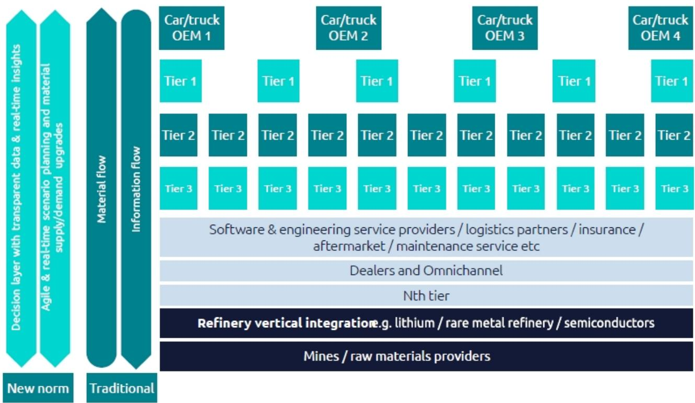
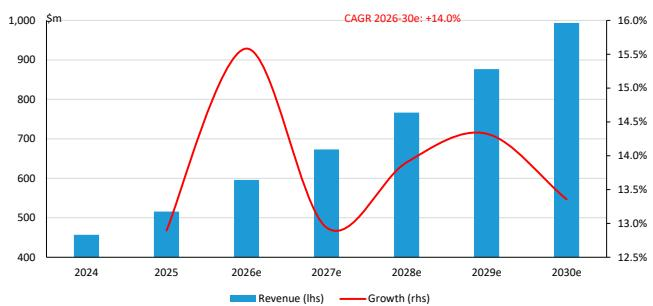
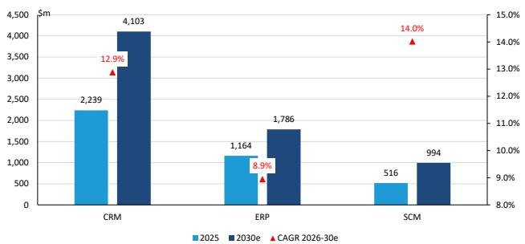

# European Technology/Software

# Electric Revolution: Resilience - Software and IT Services: Strategic enablers of automotive supply chain transformation

Richard Nguyen
+33 1 42 13 54 22
richard.nguyen@bernsteinsg.com

Derric Marcon
+33 1 58 98 06 30
derric.marcon@bernsteinsg.com

Mark L. Moerdler, Ph.D.
+1 917 344 8506
mark.moerdler@bernsteinsg.com

Firoz Valliji, CFA
+1 917 344 8316
firoz.valliji@bernsteinsg.com

Shelly Tang, CFA
+1 917 344 8342
shelly.tang@bernsteinsg.com

Specialist Sales

Kiran Shah, CFA

+44 20 3547 1533

kiran.shah@bernsteinsg.com

Welcome to the 2026 edition of Bernstein's Electric Revolution series - our annual cross-sector look at the transformation of the EV landscape. This year, we focus on supply chain resilience, a theme rising in importance as EV adoption diverges by region and geopolitical dynamics evolve. OEMs and suppliers face growing attention to anticipate, navigate, and recover from disruptions across sourcing, production and logistics.

Automotive supply-chain resilience is emerging as one of the sector's most durable technology spending themes. Repeated disruptions across semiconductors, batteries, critical minerals, software and logistics are pushing OEMs away from purely cost-optimized supply chains toward resilience-driven operating models. We observe that resilience spending is becoming a distinct and increasingly non-discretionary budget category, underpinning demand for AI-enabled risk management, digital twins, control towers, traceability and collaboration platforms. In this note, we assess the implications for the automotive technology ecosystem and identify SAP and Capgemini as among the clearest structural beneficiaries of this multi-year shift.

Resilience is no longer just an operational concern - it is a boardroom priority. Electrification, software-defined vehicles, geopolitical fragmentation and tighter regulation are increasing supply-chain complexity and raising the cost of disruption. As a result, OEMs are prioritizing visibility, continuity and risk management over pure efficiency, creating a more resilient technology spending outlook.

The industry is also moving from reactive crisis management to predictive resilience. Investments in multi-tier supplier visibility, AI-powered risk monitoring and digital twins are helping companies identify vulnerabilities and model disruptions before production is affected. At the same time, resilience now extends beyond physical supply chains to battery traceability, cybersecurity, software governance and ESG compliance, broadening the scope of future technology investment.

This shift is elevating software and services providers into strategic partners. SAP is evolving from a traditional ERP vendor into a supply-chain control-tower platform combining visibility, planning, collaboration and compliance, while Capgemini helps clients redesign operating models, integrate fragmented systems and execute large-scale resilience programs. Gartner forecasts automotive SCM software spending growth of c.14% CAGR through 2030, equivalent to a cumulative revenue opportunity of roughly \$4bn.

Bottom line: we view supply-chain resilience as a structural growth theme rather than a cyclical one. While project timing may fluctuate with automotive demand, the key drivers - electrification, regulatory complexity, geopolitical risk, rising software content and supply-chain digitalization - are unlikely to reverse. With around 8% of revenue exposed to automotive, both SAP and Capgemini appear well positioned to benefit. However, the scale and durability of the opportunity remain debated, and we therefore assess the key perspectives for both companies later in the report.

## INVESTMENT IMPLICATIONS

The resilience theme is relevant across our wider European software and IT services coverage, albeit with varying degrees of exposure. Automotive accounts for an estimated 23% of revenue at Dassault Systèmes, 15% at Alten, 9% at Reply, and around 8% at both SAP and Capgemini, while exposure is limited to the low-single digits at Sopra Steria and Indra.

However, not all automotive exposure is equally leveraged to the supply-chain resilience opportunity. Dassault Systèmes and Alten are primarily positioned in vehicle design, engineering and R&D activities, benefiting more directly from trends such as electrification, software-defined vehicles and product development cycles than from investments in core supply-chain IT systems. Capgemini occupies a more balanced position following the Altran acquisition, combining significant exposure to automotive engineering and R&D with a leading presence in traditional IT, enterprise transformation and supply-chain digitization. Meanwhile, SAP and, to a lesser extent, Reply are more directly exposed to investments in supply-chain management, risk monitoring, control towers and broader operational resilience programs, making them among the purest beneficiaries of the resilience spending theme discussed in this report.

We reiterate our ratings and price targets.

## Outperform:

Alten (PT €135)

Aubay (PT €66)

Capgemini (PT €208)

Dassault Systèmes (PT €29)

Indra (PT €66)

SAP (PT €276 / \$323)

Sopra Steria (PT €242)

## Market-Perform:

Reply (PT €120)

TeamViewer (PT €5.7)

## Underperform:

Atos (PT €43)

CGI (PT C\$141)

List of recent reports on the Supply Chain theme:

\- Global Software: The coming AI supercycle in Supply Chain Software

\- SAP: Why SAP should lead the AI supply chain modernization wave

\- Capgemini: Riding the supply chain AI supercycle

In this report, we mention multiple companies for an overview of the sector:

\- Public companies covered by Bernstein: BMW, Mercedes-Benz, and Volkswagen covered by S. Reitman; Maersk by A. Irving; BASF by J. Hooper; Amazon (AWS) and Alphabet (Google) by M. Shmulik; and Microsoft by M. Moerdler

• Public companies not covered by Bernstein: Bosch, ZF

## Table Of Contents

Investment summary....4
The automotive supply chain is entering a new era of complexity and resilience....6
Automotive OEMs are moving from reactive risk management to predictive resilience....8
Software and services providers are becoming strategic enablers....10
SAP: From ERP to Supply Chain Control Tower....12
Capgemini: Turning supply chain resilience strategies into operational reality....13
Bull vs Bear debates for SAP and Capgemini in the automotive sector....14

## DETAILS

## INVESTMENT SUMMARY

The automotive industry is shifting from cost-optimized supply chains to resilience-optimized supply chains. For decades, automotive supply chains were designed around lean inventories (just-in-time), global sourcing, and procurement efficiency. However, a series of disruptions - including the COVID-19 pandemic, semiconductor shortages, geopolitical tensions, export controls, regulatory changes, and the transition toward electric vehicles (EVs) and software-defined vehicles (SDVs) - has exposed vulnerabilities across semiconductors, batteries, critical minerals, software, and data infrastructure. As a result, the industry's objective is no longer simply to minimize costs. Automotive manufacturers and suppliers are increasingly prioritizing supply continuity, operational flexibility, and risk management in a more fragmented and uncertain environment.

Supply chain resilience has become a board-level strategic priority. OEMs (Original Equipment Manufacturers) and suppliers are investing in technologies that provide end-to-end visibility, predictive risk management, digital twins, scenario planning, traceability, regulatory compliance, and ecosystem-wide collaboration. The ability to anticipate, absorb, and respond to disruptions is increasingly becoming a source of competitive advantage. What was once viewed as an operational issue is now being treated as a critical component of corporate strategy and long-term value creation.

We observe that this shift is creating a multi-year growth opportunity for software and IT services providers. The growing complexity of automotive supply chains - driven by electrification, software content, sustainability requirements, cybersecurity concerns, and geopolitical fragmentation - is increasing demand for digital platforms capable of monitoring, managing, and orchestrating increasingly interconnected supply ecosystems. As a result, we believe that supply chain resilience is evolving from a traditional IT modernization initiative into a distinct strategic technology spending category.

The most important implication is that resilience spending is becoming increasingly non-discretionary. Production disruptions, critical-material dependencies, semiconductor shortages, regulatory requirements, and growing software complexity can directly affect vehicle output, profitability, and compliance. Consequently, investments that improve visibility, risk detection, traceability, compliance, and operational continuity are increasingly receiving executive and board-level sponsorship, even during periods of weaker automotive demand.

We believe that the economic benefits of resilient supply chains further strengthen the case. Technologies such as AI-enabled planning systems, supply chain control towers, digital twins, and advanced analytics can improve logistics efficiency, optimize inventory levels, enhance service performance, and reduce the financial impact of disruptions. As a result, resilience investments offer both defensive benefits through risk reduction and offensive benefits through productivity and operational efficiency improvements.

Software vendors such as SAP are becoming increasingly strategic, in our view, because resilience requirements continue to expand. The opportunity now extends well beyond traditional supply chain visibility solutions into AI-driven risk management, digital twins, ESG (Environment, Social, and Governance) reporting, traceability, cybersecurity, software supply chain governance, and ecosystem collaboration. As resilience capabilities become embedded within procurement, manufacturing, logistics, planning, compliance, and supplier-management workflows, software platforms benefit from high switching costs, recurring revenues, and potentially attractive network effects.

IT services providers such as Capgemini are also well positioned, in our view, to benefit from the complexity of resilience transformations. Building resilient supply chains requires more than deploying software. Manufacturers must redesign operating models, integrate fragmented systems, improve supplier collaboration, establish governance frameworks, and manage organizational change. These requirements support sustained demand for consulting, systems integration, implementation, engineering, and managed services, particularly for providers capable of delivering large-scale transformation programs.

Despite the attractive structural opportunity, observers should remain mindful of several considerations. Automotive manufacturers remain cyclical businesses exposed to fluctuations in vehicle demand, profitability, and capital spending. Consequently, software deployments and transformation programs can still be delayed, phased, or reprioritized during periods of industry adjustment, even when their strategic importance remains intact.

The return on investment for resilience initiatives can also be difficult to quantify. Unlike traditional cost-reduction projects, the value of resilience is often demonstrated by disruptions that never occur. This can complicate business cases, increase spending scrutiny, lengthen sales cycles, and slow decision-making processes. In addition, the success of resilience programs depends heavily on data quality, supplier participation, process redesign, and effective change management, creating meaningful execution considerations.

Competitive intensity is likely to increase as the addressable market expands. ERP providers, supply chain software specialists, hyperscalers, consulting firms, and AI-native vendors are all targeting the same opportunity. As competition grows, vendors offering only basic visibility, workflow automation, or analytics capabilities could face pricing pressure and commoditization risk, while differentiated platforms with broader capabilities should be better positioned.

Overall, we view automotive supply chain resilience as a secular rather than cyclical technology theme. While spending patterns may fluctuate with automotive investment cycles, the underlying drivers - including electrification, software-defined vehicles, geopolitical fragmentation, regulatory complexity, critical-material dependencies, and supply chain digitalization - are unlikely to reverse. In our view, the most attractive opportunities will be found among providers that combine end-to-end visibility, AI-driven risk intelligence, digital twins, traceability, compliance capabilities, and ecosystem collaboration within integrated platforms. Companies that can help automotive manufacturers move from reactive disruption management to predictive resilience should increasingly become strategic partners in the industry's long-term transformation.

Bottom line: Automotive supply chain resilience is a structural theme with cyclical budget exposure, and the best-positioned beneficiaries are likely to be software and services providers that become embedded in customers' day-to-day operational and risk-management workflows.

SAP: Perspectives. Roughly 8% of SAP's revenues are exposed to the automotive sector, making the industry's shift toward resilience-oriented supply chains an increasingly important growth driver. One perspective is that SAP can leverage its dominant ERP footprint to evolve into the central orchestration layer for automotive supply chains through control towers, supplier collaboration networks, AI-enabled risk management, traceability, sustainability, and industry platforms such as Catena-X. In this scenario, resilience spending becomes increasingly non-discretionary and SAP captures a growing share of customers' operational and decision-making workflows. An alternative perspective is that the opportunity may be nuanced as automotive technology stacks become more fragmented, with specialized planning, AI, and supply-chain applications capturing a larger share of value. This view also highlights the continued cyclicality of automotive IT spending and the risk that SAP remains primarily a system of record rather than the industry's core intelligence layer.

Capgemini: Perspectives. With approximately 8% of revenue generated from automotive clients, Capgemini is also highly exposed to the supply-chain resilience theme. One perspective is that resilient supply chains are ultimately transformation programs rather than software deployments, requiring consulting, systems integration, operating-model redesign, data modernization, change management, and managed services - all areas where Capgemini is well positioned. As supply chains become more complex due to electrification, software-defined vehicles, regulatory requirements, and geopolitical fragmentation, demand for large-scale transformation expertise could remain durable. An alternative perspective is that a significant portion of the long-term economics may accrue to software vendors and cloud platform providers rather than services firms. This view also points to consulting budget cyclicality, increasing competitive pressure, the potential for AI to reduce service intensity, and the possibility that automotive manufacturers internalize more digital capabilities over time.

## THE AUTOMOTIVE SUPPLY CHAIN IS ENTERING A NEW ERA OF COMPLEXITY AND RESILIENCE

The automotive supply chain is undergoing a profound transformation, driven by electrification, geopolitical fragmentation, digitalization, and increasing regulatory requirements. Historically, automotive supply chains were built around relatively predictable sourcing networks and just-in-time manufacturing models focused on efficiency and cost optimization. However, the COVID-19 pandemic, semiconductor shortages, geopolitical tensions, and economic shifts exposed significant vulnerabilities across global supply networks, revealing that many OEMs (Original Equipment Manufacturers) lacked visibility beyond their Tier-1 suppliers and had limited understanding of risks further upstream.

Supply chain complexity is increasing as vehicles become more dependent on batteries, semiconductors, software, and critical raw materials. The transition to electric vehicles (EVs) is reshaping supplier ecosystems and creating new dependencies on lithium, nickel, cobalt, rare earth elements, battery cells, power electronics, and semiconductors. Compared with traditional internal combustion engine (ICE) vehicles, EV supply chains are longer, more geographically concentrated, and often more exposed to geopolitical dynamics. At the same time, the rise of software-defined vehicles (SDV) is making software, connectivity, cloud infrastructure, cybersecurity, and data governance as strategically important as physical components.

Geopolitical and regulatory developments are further increasing supply chain considerations. Governments are reshaping industrial supply chains through tariffs, export controls, investment restrictions, localization requirements, and industrial policies aimed at strengthening domestic manufacturing capabilities. Critical mineral processing and battery material refining remain highly concentrated, with China playing a dominant role across several strategic segments of the EV value chain. As a result, disruptions affecting critical minerals, rare earths, or battery materials can have significant consequences for global vehicle production.

EXHIBIT 1: Vertical integration for supply chain resilience in the automotive industry  
  
Source: Capgemini Research Institute (February 2026)

Three categories of risk have become structurally more important for automotive manufacturers. First, the concentration of critical minerals and rare earth processing creates supply security concerns and increases exposure to geopolitical tensions. Second, the growing semiconductor and electronics content of modern vehicles increases vulnerability to shortages and disruptions across highly specialized global supply chains. Third, software, connectivity, cybersecurity, and data sovereignty considerations are emerging as major supply chain challenges, reflecting the increasing digitalization of vehicles and mobility services.

Regulation is expanding the scope of supply chain management far beyond traditional procurement activities. Automotive supply chains are increasingly becoming compliance networks. OEMs must address a growing range of requirements related to ESG (Environment, Social and Governance) reporting, sustainability disclosures, carbon emissions, battery traceability, critical mineral sourcing transparency, cybersecurity, software provenance, and data governance. These obligations require visibility not only into direct suppliers but also into multiple upstream tiers of the supply chain.

Traditional supply chain management tools are no longer sufficient to address these emerging challenges. Most automotive companies still lack end-to-end visibility across their supplier ecosystems, with limited insight beyond Tier-1 suppliers. Yet the next major disruption is increasingly likely to originate at the Tier-2, Tier-3, or raw-material level. Risks may arise from rare earth processing facilities, battery precursor chemical suppliers, semiconductor packaging operations, cloud infrastructure providers, software vendors, or embedded software libraries that are several layers removed from direct supplier relationships.

The increasing importance of software within vehicles is fundamentally changing the definition of supply chain resilience. Recent connected vehicle regulations have demonstrated that automakers must now trace software origin, technology ownership, and digital dependencies across multiple supplier layers. As software becomes a critical component of vehicle functionality, resilience extends beyond physical parts and logistics to include software dependencies, cybersecurity vulnerabilities, data flows, cloud infrastructure, and digital ecosystem considerations.

Customer expectations are also contributing to greater supply chain complexity. Consumers increasingly expect seamless omnichannel experiences, online vehicle configuration, transparent delivery processes, personalized services, and continuous software-enabled upgrades. Meeting these expectations requires tighter integration across manufacturing, logistics, digital platforms, and supplier networks.

As a result, supply chain resilience has become a board-level strategic priority rather than a purely operational concern. Management teams must now understand where vulnerabilities exist, assess the probability and potential impact of disruptions, define mitigation strategies, and determine how quickly operations can recover. These requirements extend beyond the capabilities of many legacy ERP systems, which typically provide visibility into internal operations but offer limited insight into multi-tier supplier networks, geopolitical exposure, material traceability, and emerging external risks.

Ultimately, automotive companies must transform their supply chains from efficiency-focused networks into intelligent, resilient, and transparent ecosystems. Achieving this transformation requires end-to-end visibility, multi-tier traceability, advanced analytics, ecosystem-wide data sharing, and closer collaboration across suppliers, technology providers, and regulatory stakeholders. In an environment defined by electrification, digitalization, geopolitical uncertainty, and expanding regulation, resilience increasingly depends on the ability to understand and manage risks across the entire value chain.

## AUTOMOTIVE OEMS ARE MOVING FROM REACTIVE RISK MANAGEMENT TO PREDICTIVE RESILIENCE

Automotive companies are undertaking a profound transformation of their supply chains, with the objective of building more resilient, intelligent, connected, and sustainable networks that can anticipate and respond to disruptions before they affect operations. Across the industry, manufacturers and suppliers are moving beyond traditional crisis management approaches toward predictive risk management supported by advanced digital technologies, data-sharing ecosystems, and regionalized sourcing strategies.

A central priority is achieving end-to-end visibility across increasingly complex, multi-tier supply networks. Rather than focusing solely on direct Tier-1 suppliers, automotive companies are mapping supply chains from raw material extraction through component production, logistics networks, and final assembly operations. This broader visibility helps identify single-source dependencies, geographic concentration risks, critical mineral exposure, bottlenecks in battery and semiconductor supply chains, and potential regulatory vulnerabilities. As recent disruptions have demonstrated, supply chain resilience increasingly depends on understanding and managing the entire ecosystem rather than only direct supplier relationships.

To complement greater visibility, automotive companies are investing heavily in predictive risk management capabilities powered by artificial intelligence (AI) and advanced analytics. These solutions continuously monitor a wide range of internal and external risk factors, including supplier financial health, geopolitical developments, trade restrictions, export controls, weather events, logistics disruptions, and regulatory changes. The objective is not only to detect emerging threats but also to assess their potential impact and recommend mitigation actions before business operations are significantly affected.

Digital twins and scenario-planning tools have become another key pillar of supply chain transformation. Manufacturers are creating virtual representations of their supply networks that allow them to simulate the effects of disruptions such as semiconductor shortages, battery material constraints, supplier failures, tariff increases, export restrictions, and transportation bottlenecks. By testing alternative sourcing strategies, inventory policies, manufacturing allocations, and logistics routes in a virtual environment, companies can evaluate resilience options and prepare contingency plans before risks materialize.

Traceability, sustainability, and regulatory compliance are also becoming strategic priorities, particularly in electric vehicle supply chains. Automotive companies increasingly require mine-to-battery traceability, supplier transparency, carbon footprint monitoring, and ESG compliance reporting. The growing importance of critical minerals and evolving sustainability regulations is driving demand for solutions capable of tracking components and materials across complex global supply chains while enabling compliant and responsible sourcing practices.

At the same time, manufacturers and suppliers are reassessing their sourcing and manufacturing footprints to reduce concentration risks and improve resilience. Many organizations are expanding multi-sourcing arrangements, diversifying suppliers, and adopting regional or "local-for-local" production strategies. These decisions are increasingly supported by advanced analytics, digital twins, and optimization tools that help balance cost, resilience, regulatory compliance, and operational flexibility.

Automotive companies also recognize that resilience cannot be achieved by individual organizations acting alone and are therefore increasing investment in ecosystem-wide collaboration. Industry participants are joining data-sharing networks, collaborative planning initiatives, and integrated logistics platforms that improve multi-tier visibility, demand forecasting, capacity planning, quality management, sustainability reporting, and supply chain coordination. This trend is reinforcing the role of digital platforms capable of facilitating trusted data exchange across large supplier networks.

Several large-scale industry initiatives illustrate this shift toward collaborative and digitally connected supply chains. European OEMs and suppliers are participating in Catena-X, an open automotive data ecosystem that enables the sharing of product, carbon footprint, quality, and traceability information across the value chain. SAP, as a core technology partner, supports capabilities such as sustainability data exchange, collaborative quality management, and demand-capacity planning. Similarly, logistics providers such as Maersk are working with global automotive manufacturers on integrated visibility and control-tower programs that combine ocean, rail, and road transportation data with predictive analytics to improve resilience, compliance, and routing flexibility. In parallel, suppliers such as Bosch are expanding localized manufacturing capacity in regions such as India in alignment with broader regionalization and resilience objectives.

OEMs and Tier-1 suppliers are increasingly translating resilience goals into large-scale control tower and network optimization programs. Many manufacturers are deploying digital command centers that integrate supply, production, inventory, and logistics data into a unified view supported by machine learning and predictive analytics. In parallel, companies are redesigning supply networks to address trade tensions, tariffs, and geopolitical uncertainties, using scenario-planning and optimization tools to evaluate alternative regional footprints and sourcing models.

Component suppliers are pursuing similar objectives through investments in digital manufacturing and AI. To improve operational resilience and competitiveness, suppliers are deploying intelligent manufacturing technologies, industrial IoT (Internet of Things) platforms, manufacturing execution systems, and AI-enabled production analytics. These initiatives are particularly relevant in high-growth segments such as batteries, semiconductors, and advanced electronic components, where demand volatility and supply constraints remain significant challenges.

Electric vehicle, sustainability, and circular economy initiatives are increasingly integrated with supply chain resilience strategies. Automotive companies are investing in battery material traceability, carbon footprint management, recycling programs, and circular sourcing models designed to reduce dependence on scarce resources while meeting environmental objectives. ESG scorecards, sustainability disclosures, and regulatory frameworks are further accelerating investment in digital platforms that support responsible sourcing, emissions reporting, and closed-loop supply chain management.

Overall, the automotive industry is reshaping supply chain management around a common objective: creating predictive, transparent, and collaborative supply networks capable of balancing resilience, sustainability, and cost efficiency in an increasingly uncertain operating environment. Rather than relying on reactive responses to disruptions, companies are building digitally enabled ecosystems that combine visibility, risk intelligence, traceability, advanced planning, and cross-industry collaboration to strengthen long-term supply chain performance.

EXHIBIT 2: Five levers to transform the automotive supply chain  
  
Source: Capgemini Research Institute (February 2026)

## SOFTWARE AND SERVICES PROVIDERS ARE BECOMING STRATEGIC ENABLERS

Software and IT services providers are moving from operational vendors to strategic partners because they sit at the intersection of visibility, prediction, orchestration, and compliance in increasingly complex automotive supply chains. The growing complexity and volatility of automotive supply chains has turned resilience into a board-level priority, not just an operational concern. Automotive manufacturers now need continuous end-to-end visibility, predictive risk detection, coordinated response capabilities, and reliable compliance and traceability, and software and services providers are embedded in each of these pillars. Platforms from major vendors integrate data across ERP, manufacturing, supplier networks, logistics, IoT, and external risk feeds, enabling real-time monitoring, scenario planning, and automated interventions across sourcing, planning, logistics, and production.

Software platforms provide the digital backbone for resilient automotive supply chains by creating unified, real-time views of multi-tier networks and operational flows. Software vendors are building supply chain control towers, multi-tier supplier graph models, real-time logistics visibility solutions, and inventory and production monitoring systems that together create a digital representation of the network. These platforms ingest data from ERP, MES (Manufacturing Execution Systems), PLM (Product Lifecycle Management), logistics providers, IoT devices, and external risk feeds to map Tier-1 to Tier-N relationships, track flows of critical components such as batteries and semiconductors, and highlight geographic concentration and single-source dependencies. By enabling faster detection of emerging risks and a more granular understanding of vulnerabilities, these systems help OEMs shift from retrospective reporting to proactive risk management, reducing the revenue impact of disruptions that have historically affected automotive more than many other sectors.

AI and advanced analytics are turning software vendors into predictive risk managers rather than just providers of planning tools. AI-enabled solutions - ranging from machine learning forecasting to risk-sensing platforms and AI-driven alerting - allow continuous monitoring of trade restrictions, export controls, tariffs, supplier financial health, weather events, and geopolitical developments, linking these signals to specific suppliers and nodes. These systems can simulate shocks such as rare-earth export adjustments, semiconductor outages, or port closures through digital twins of battery, semiconductor, and logistics networks, and then evaluate alternative sourcing, routing, and inventory strategies in advance. As a result, automotive supply chains gradually move from reactive firefighting to predictive interventions, with empirical evidence indicating that AI-enabled supply chains can reduce logistics costs by around 15%, lower inventories by roughly a third, and materially improve service levels, reinforcing the economic case for resilience-oriented software.

IoT, edge computing, and AIoT (AI of Things) solutions extend this digital backbone into real-time operations, making physical networks more responsive and adaptable. Combining IoT sensors with AI enables continuous monitoring of battery shipments, inventory levels, production equipment, and logistics conditions, as well as vehicle and battery health in the field. Edge analytics on factories, warehouses, and yards can trigger rapid rerouting, resequencing of loads, or changes in replenishment plans when disruptions arise, reducing downtime from stock-outs or bottlenecks. This AIoT layer shortens decision-making latency and supports predictive maintenance and dynamic reprioritization, making the physical network more adaptive under stress and reinforcing the role of software vendors as operational orchestrators rather than passive data providers.

Compliance, traceability, and governance requirements are transforming supply chain software into core regulatory infrastructure for automotive OEMs. Battery and critical mineral sourcing, ESG scrutiny, and evolving trade and export-control regimes have made traceability and compliance central to resilience. Software platforms increasingly offer mine-to-battery traceability, ESG and human-rights due-diligence modules, origin certification, and supplier risk scoring tools that cover environmental, social, geopolitical, and sanctions exposure dimensions. These capabilities support "China+1" and localization strategies by quantifying concentration risks, evaluating alternative regional footprints, and integrating compliance metrics into sourcing decisions and governance workflows, effectively turning supply chain software from a pure planning tool into a compliance and governance backbone.

As vehicles become software-defined, software supply chain management and cybersecurity elevate vendors into strategic guardians of digital resilience. Connected and software-defined vehicles rely on complex stacks of firmware, middleware, open-source libraries, and cloud services, all of which introduce cybersecurity, provenance, and regulatory considerations. Software bill-of-materials (SBOM) and provenance solutions can track software origin, open-source dependencies, exposure to restricted jurisdictions, and security vulnerabilities across vehicle ECUs (engine control unit) and supporting cloud infrastructures, aligning with tightening export controls and data-security rules. Data-governance tools further manage where telemetry and operational data is stored and processed, while incident-response orchestration platforms connect security operations centers with production, logistics, and dealer systems to coordinate recalls, patches, and contingency plans, expanding the scope of "resilience" beyond physical parts to software and data pipelines.

IT services providers become strategic because resilience transformations demand operating-model redesign, complex integration, and sustained change management. Resilience initiatives typically span multiple functions - procurement, planning, logistics, manufacturing, IT, and risk - and multiple organizations across OEMs, Tier-1 suppliers, logistics providers, and technology vendors. Services firms step in as strategic partners by delivering end-to-end resilience diagnostics, mapping multi-tier supplier dependencies, assessing geopolitical and cyber exposure, and redesigning planning and sourcing processes to embed resilience metrics such as time-to-recover and revenue-at-risk into standard KPIs (key performance indicator). They also define governance structures, decision rights, and escalation paths for crisis response linked to control-tower tooling, ensuring that technological capabilities are matched with clear organizational mechanisms for acting on risk signals.

Integration, implementation, and "lighthouse" projects allow services partners to monetize complexity while de-risking adoption for automotive clients. Integrating AI, IoT, ERP, MES, PLM, and logistics systems into coherent control towers and digital twins is technically and organizationally demanding, creating recurring opportunities for consulting and IT services firms. These firms build and scale "lighthouse" projects in logistics optimization, inventory reduction, and battery lifecycle management that demonstrate ROI and serve as templates for broader rollouts, while establishing data-engineering pipelines and MLOps (machine learning operations) practices to keep predictive models accurate as EV mixes, regulations, and demand patterns evolve. Because many automotive companies prefer modular, targeted AI deployments over wholesale IT overhauls, services providers that can execute pragmatically and integrate new tools into existing workflows become long-term partners rather than one-off implementers.

People, culture, and collaboration needs ensure that services providers remain central to unlocking the full value of resilience technologies. Resilience gains depend on how teams use tools, interpret risk dashboards, and make trade-offs between cost and robustness, so services firms focus heavily on training, change management, and collaboration facilitation. They help upskill supply chain teams in scenario planning and AI tool usage, design data-sharing and collaboration agreements across OEMs, suppliers, logistics providers, and technology vendors, and support cultural shifts from pure cost minimization to decisions that explicitly balance unit cost against systemic risk. Because digital tools are often underused without aligned processes and incentives, this human-centric work creates recurring advisory and managed-services revenue streams and cements services providers as ongoing strategic partners in resilience, not just implementation contractors.

For software and services vendors, the convergence of visibility, AI, IoT, compliance, cybersecurity, and operating-model change creates a durable, high-value opportunity to offer integrated resilience platforms and services to automotive OEMs. Vendors capable of combining software platforms, integration skills, advisory expertise, and managed services into unified offerings can position themselves at the heart of automotive resilience strategies. As supply chain visibility becomes a strategic necessity rather than discretionary IT spend, and AI-enabled risk sensing and digital twins move management from reactive to predictive, software and services providers that address both technology and organizational dimensions are likely to become long-term strategic partners for OEMs, tier suppliers, and logistics players.

The opportunity is supported by robust software spending growth. Gartner forecasts automotive SCM software spending to grow at c.14% CAGR through 2030 (Exhibit 3), outpacing ERP and CRM spending (Exhibit 4) and confirming that resilience is becoming a distinct technology investment priority for automotive groups.

EXHIBIT 3: Supply chain management (SCM) software spending forecasts for the automotive industry  
  
Source: Gartner Group (April 2026), Bernstein analysis

EXHIBIT 4: Comparison of software spending between SCM, ERP, and CRM for the automotive industry  
  
Source: Gartner Group (April 2026), Bernstein analysis

## SAP: FROM ERP TO SUPPLY CHAIN CONTROL TOWER

SAP illustrates how enterprise software is evolving into a core enabler of supply chain resilience in the automotive sector. Through its long-standing collaboration with BMW and its involvement in industry-wide platforms such as Catena-X, SAP illustrates the evolution of enterprise software from traditional ERP systems toward integrated platforms that enhance visibility, responsiveness, collaboration, and end-to-end supply chain orchestration.

A key example is the joint development of BMW's cloud-based production logistics platform, built on SAP S/4. The platform digitizes the entire flow of components, from supplier ordering and warehousing to delivery at production lines. BMW has highlighted improved transparency, process standardization, and greater responsiveness to supply shortages as core objectives of the initiative. The solution is being deployed across the company's global manufacturing footprint, including facilities supporting its electric vehicle and battery production activities.

The strategic importance of this project extends beyond logistics digitalization. It demonstrates how ERP platforms are evolving into operational control towers capable of providing real-time visibility across supply networks, standardizing processes across global operations, accelerating responses to disruptions, and supporting the growing complexity of EV and battery supply chains. By creating a unified data foundation, the platform also enables more advanced analytics and AI-driven planning capabilities.

BMW has complemented this effort through its connected Procurement initiative, which leverages SAP solutions to modernize procurement processes and strengthen supplier collaboration. The program addresses challenges associated with fragmented supplier information, legacy systems, and manual workflows across BMW's extensive global supplier network. By consolidating supplier data and improving information sharing, the initiative enhances visibility into procurement risks and supports more agile sourcing decisions when disruptions occur.

The resilience benefits of procurement modernization are becoming increasingly strategic. Better supplier visibility, improved collaboration, faster sourcing decisions, and more consistent supplier data management allow BMW to strengthen its ability to monitor risks and maintain continuity across highly interconnected supply networks. This reflects a broader industry trend in which procurement visibility is becoming as important as factory and logistics visibility.

BMW's broader cloud transformation, including its adoption of RISE with SAP, further reinforces this resilience agenda. The company has identified supply chain management, warehousing, production, and parts supply as key target areas for digital transformation. The migration supports global process harmonization, a scalable cloud architecture, faster deployment of analytics and AI capabilities, and tighter integration across end-to-end supply chain operations.

Beyond individual company initiatives, SAP is also playing a central role in enabling ecosystem-wide resilience through its participation in Catena-X. This automotive data-sharing ecosystem brings together major manufacturers and suppliers, including BMW, Mercedes-Benz, Volkswagen Group, Bosch, ZF, and BASF. The initiative is designed to facilitate secure exchange of supply chain information, sustainability metrics, quality management data, traceability records, and demand and capacity planning information across the automotive value chain.

Catena-X highlights a broader shift in how resilience is being approached across the industry. Rather than relying solely on internal optimization, automotive companies are increasingly seeking visibility and coordination across entire supply networks. The platform aims to improve multi-tier supplier visibility, accelerate disruption detection, enhance battery and component traceability, and support more effective cross-company planning.

From an observer perspective, SAP demonstrates how supply chain software is becoming a mission-critical resilience enabler. Its solutions increasingly combine logistics, procurement, production planning, traceability, sustainability management, and ecosystem collaboration within a single digital architecture. The emergence of platforms such as Catena-X further suggests that future competitive advantage may depend not only on internal operational excellence but also on the ability to participate in connected industry networks that enable visibility and collaboration across the broader supply ecosystem.

## CAPGEMINI: TURNING SUPPLY CHAIN RESILIENCE STRATEGIES INTO OPERATIONAL REALITY

Capgemini plays a critical role in automotive resilience by helping manufacturers translate technology investments into practical operating models that improve visibility, risk management, traceability, and supply chain adaptability. Unlike software providers such as SAP, which primarily monetize digital platforms, Capgemini positions itself as a transformation and integration partner. Its value proposition lies in helping OEMs redesign processes, implement technologies, integrate data across functions, and manage organizational change. By bridging strategy and execution, the company helps manufacturers build resilient supply chain capabilities that extend beyond technology deployment alone.

A central pillar of Capgemini's offering is its Automotive Supply Chain Resiliency Services framework, which focuses on improving end-to-end visibility, supplier transparency, and risk management. The company supports manufacturers in redesigning planning, procurement, and supplier collaboration processes through a combination of AI-enabled planning, supply chain orchestration, and data-driven decision-making. This approach reflects the reality that many automotive companies already possess significant technology investments but continue to face challenges in converting those investments into measurable operational resilience. By integrating processes, data, and technology into a coherent operating model, Capgemini aims to strengthen the agility and responsiveness of automotive supply networks.

Capgemini has also developed Digital Supply Chain Twin capabilities that enable manufacturers to model disruptions, test mitigation strategies, and improve strategic planning. These digital twin frameworks allow OEMs to simulate various supply chain scenarios and evaluate potential responses before disruptions occur. Key applications include semiconductor shortages, battery supply disruptions, logistics bottlenecks, and supplier capacity constraints. By supporting scenario analysis and network redesign initiatives, digital twins help organizations shift from reactive crisis management toward proactive resilience planning and optimization.

Another strategic area of focus is product traceability and battery passport readiness, which are becoming increasingly important as regulatory requirements intensify. Capgemini helps manufacturers track components, materials, and critical minerals throughout complex supply chains, enhancing transparency across the value chain. These capabilities support compliance with emerging battery passport regulations, strengthen supplier
