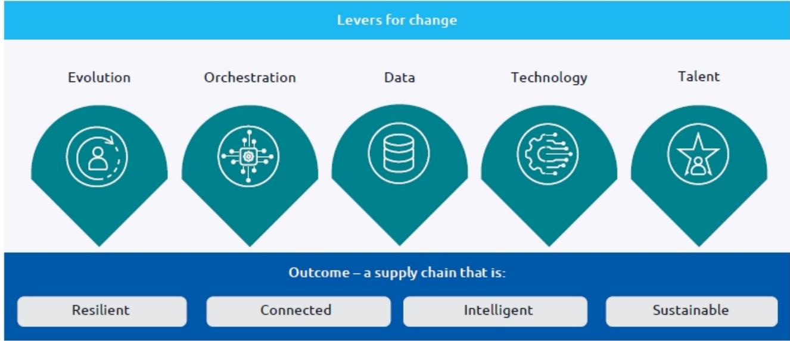
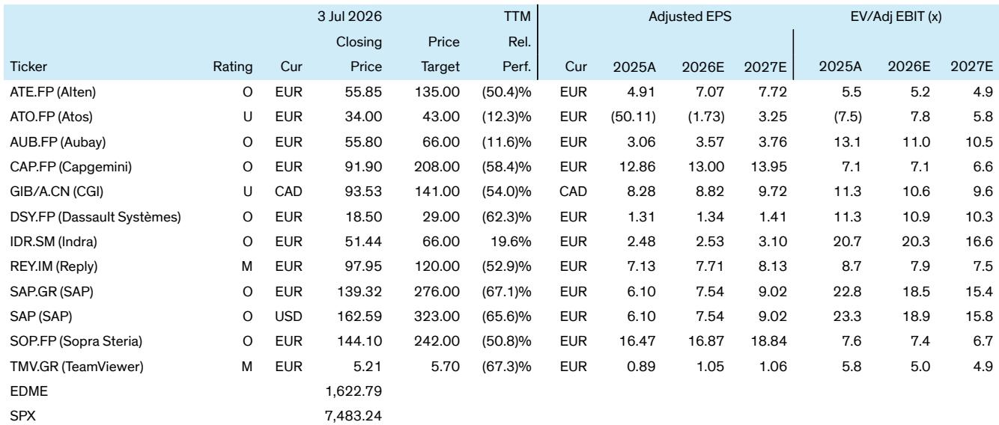

# Bernstein：汽车供应链韧性正成为最确定的软件支出主题

汽车行业正在经历一场从“成本最优”到“韧性优先”的供应链范式转换。Bernstein最新发布的年度《电动革命》系列报告指出，这一转变并非周期性的IT支出波动，而是一个结构性的、且越来越不可自由支配的预算科目。报告的核心判断是：供应链韧性研究正在成为汽车行业技术支出的独立增长引擎，而SAP和凯捷（Capgemini）是这一多年趋势中最清晰的受益者。

过去五年，半导体短缺、电池材料集中、地缘政治扰动和软件定义汽车的兴起，反复冲击了传统以“准时制”为核心的供应链模型。汽车制造商发现，仅优化成本已无法保证生产连续性。Bernstein认为，韧性已从运营议题上升为董事会战略优先级。由此催生的技术需求，正从单一环节的可见性工具，演变为覆盖多级供应商、AI不确定性监测、数字孪生、合规追溯和生态系统协作的综合性平台支出。

报告估算，Gartner预测汽车供应链管理软件支出到2030年的复合年增长率约为14%，对应累计约40亿美元的收入机会。更重要的是，这些研究在行业需求仍在调整时也难以被大幅削减——因为一旦中断，直接后果是停产和合规不确定性，其代价远高于软件订阅成本。

> **KC评论：** Bernstein的核心逻辑不是“汽车行业多花钱”，而是“花钱的结构变了”。传统IT预算中，供应链相关支出常被归类为运营优化，易被压缩。但韧性支出挂钩的是“避免停产”和“满足法规”，预算优先级正在从“可延迟”变为“不可延迟”。这份报告最有价值的部分，是它论证了这种优先级变化如何重塑软件和服务的采购逻辑。

## 1. 这轮变化真正考验的是企业能否把规模转化为议价权

报告明确指出，并非所有汽车行业技术供应商都能平等受益。Bernstein估计，汽车业务在达索系统（Dassault Systèmes）和Alten的收入占比分别约为23%和15%，但这些公司的主要定位在车辆设计、工程和研发领域，其驱动力更多来自电动化和软件定义汽车的产品开发周期，而非供应链IT系统的核心研究。

真正的韧性受益者，是那些能够嵌入客户日常运营和不确定性管理流程的软件平台和服务商。SAP正在从传统的ERP供应商演变为供应链控制塔平台，整合可见性、规划、协作和合规功能。凯捷则帮助客户重新设计运营模式、整合碎片化系统并执行大规模韧性转型项目。两者的共同点是：它们提供的不是单一工具，而是生态级的解决方案，这种嵌入深度带来了高转换成本和持续性收入。

## 2. 报告尚未完全回答的关键问题：韧性研究的回报如何量化

尽管Bernstein对韧性主题的长期前景持乐观态度，但报告坦率地讨论了这一逻辑中的关键不确定性。其中最核心的未解问题是：韧性研究的回报很难被量化。传统成本削减项目可以通过明确的节省金额来证明价值，但韧性的价值往往体现在“从未发生的 disruption”上——这种“看不见的收益”在预算审批中天然处于劣势。

此外，竞争格局正在快速演变。ERP供应商、供应链软件专业厂商、云平台巨头和AI原生初创公司都在瞄准同一机会。Bernstein认为，只有提供端到端可见性、AI驱动的不确定性智能、数字孪生和合规能力的综合性平台才能避免商品化不确定性。这意味着，对于SAP和凯捷而言，真正的挑战不是市场空间的大小，而是能否持续证明自己是不可替代的“系统级”合作伙伴，而非可被替换的“应用层”工具。

## 3. 对产业观察者的框架：区分“韧性支出”与“传统IT现代化”

这份报告为读者提供了一个实用的分析框架：不要将所有汽车行业的技术研究都视为同一类。Bernstein建议将“韧性驱动”的支出与“效率驱动”或“产品开发驱动”的支出区分开来。

韧性支出的典型特征包括：预算归属从CIO办公室向CEO或董事会层面转移；采购决策更强调“避免不确定性”而非“提升效率”；项目周期更长，且通常涉及跨部门、跨企业的流程再造。如果一家供应商的主要收入来自后者，其周期性和可替代性不确定性就更高；如果其产品能够嵌入前者的决策流程，其增长则更具结构性。

> **KC评论：** 这个框架对追踪其他行业也有启发。例如，资金、能源和医疗行业的供应链韧性需求也在上升。Bernstein的逻辑——即“韧性支出成为非自由支配科目”——可能是一个跨行业的通用叙事。读者可以带着这个框架去观察其他垂直领域的软件和服务供应商，看看哪些公司的产品正在从“可选”变为“必需”。

---

Bernstein这份报告的完整版包含了更详细的SAP和凯捷的“多空辩论”分析、行业支出模型拆解以及关键图表。这些内容在中文摘要和KC评论的合集中有更完整的呈现，适合放在当天国际主线的语境下继续阅读和横向比较。

For informational purposes only. Portions may be generated,translated,summarized,or edited with AI assistance based on source materials and may contain omissions or errors. Please verify independently. This is not investment,legal,tax,accounting,or other professional advice.

For informational purposes only. Portions may be generated,translated,summarized,or edited with AI assistance based on source materials and may contain omissions or errors. Please verify independently. This is not investment,legal,tax,accounting,or other professional advice.

