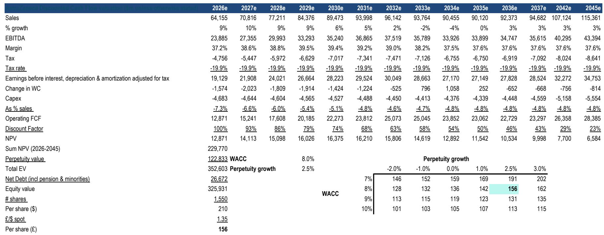
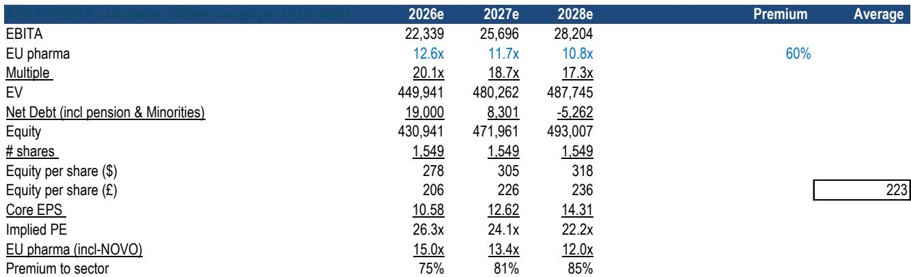
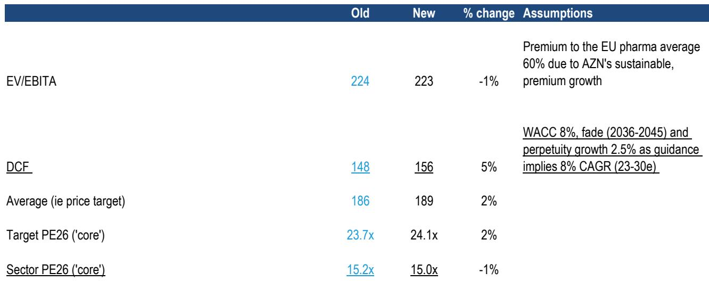

# Bernstein：市场误判，阿斯利康非肿瘤管线贡献65%增长，定价明显不足

市场对阿斯利康的讨论几乎都围绕肿瘤药展开。但这份Bernstein研报提出了一个反直觉的判断：真正驱动公司未来五年增长的，恰恰是非肿瘤业务。非肿瘤管线贡献了公司2026-2031年8%销售复合增长率的65%，以及全部的上行空间。而市场对这一块的定价，明显不够充分。

报告的核心增量来自对ATTR淀粉样变性心肌病（ATTR-CM）市场的深度拆解。这是一种由错误折叠的蛋白质在心脏中沉积、导致器官衰竭的疾病，G8国家约有80万患者，但美国诊断率仅为25%。Bernstein估算该市场峰值可达200亿美元，而阿斯利康有望在其中占据领导地位。

## 1. 阿斯利康在ATTR赛道拥有其他对手不具备的组合优势

Bernstein上调了阿斯利康在ATTR领域的2036年营收预测60%，至100亿美元。理由不是单一产品，而是组合策略。阿斯利康是相对少见一家同时拥有三种已验证作用机制药物的公司：基因沉默药物Wainua、首创的淀粉样蛋白清除剂cliramitug，以及在日本商业化的稳定剂Attruby。

关键意见领袖向Bernstein强调，联合用药将是ATTR-CM最有效的治疗路径。单一药物无法覆盖所有患者亚群，而拥有完整组合的公司将占据处方优势。此外，阿斯利康旗下Alexion在罕见病领域的商业化能力，被视为重要的竞争壁垒——这一领域的医生教育、患者筛查和医保准入，远非普通药企所能复制。

> **KC评论：** 这份报告最重要的分析框架，不是单个药物的峰值销售预测，而是“组合市占率”思维。当市场共识还在分别估值Wainua、Amvuttra、Attruby时，Bernstein认为竞争终局是“谁拥有完整工具箱，谁就拿到最大份额”。这张图值得仔细看：Bernstein预测阿斯利康在ATTR市场的价值份额将达约40%，而共识隐含的份额要低得多。

## 2. 关键催化剂在2026年下半年：CardioTTRansform数据将决定市场格局

Wainua的III期研究CardioTTRansform预计在2026年下半年读出数据。Bernstein认为，如果该试验证明Wainua在经治患者中同样有效，将直接侵蚀Alnylam的Amvuttra份额。后者目前缺乏这类数据。

一个被市场忽视的结构性变化在于：Alnylam的下一代基因沉默药物nuresiran（每半年一次）即将登场，但Bernstein判断，nuresiran的上市不会带来市场整体扩张，而是会严重蚕食Amvuttra的销售。因为nuresiran获批后，Alnylam不再需要向赛诺菲支付特许权使用费，其最优策略就是牺牲Amvuttra来推广利润率更高的nuresiran。共识目前假设nuresiran的销售完全叠加于Amvuttra之上，这一假设很可能被证伪。

## 3. 估值框架：当前报价没有反映ATTR的上行空间

Bernstein将目标报价上调2%至189英镑，主要来自DCF部分的提升（从148英镑升至156英镑）。DCF提升完全由ATTR管线预测上调驱动。当前阿斯利康的远期PE约为21倍，略高于其15年均值，但报告认为，在5年远期销售回归分析中，阿斯利康相对于全球同行仍被低估。

报告尚未完全回答的一个关键问题是：如果CardioTTRansform数据不及预期，Wainua和cliramitug的峰值假设需要下调多少？Bernstein的熊市情形显示节奏变化空间为97%，其中获批药物贡献了51%的节奏变化不确定性，而Wainua是前三大不确定性敞口之一。这意味着，2026年下半年将是验证这一研究逻辑的试金石。

---

顺着这些未解问题继续读完整报告，你会看到Bernstein对ATTR市场患者流建模、各药物市场份额的逐年拆解，以及DCF中每一条假设的敏感性分析。这些细节在每日国际信源汇编中也会同步跟进，方便横向对比。完整报告、中文摘要和KC评论，会放入当天市场主线的讨论中。

For informational purposes only. Portions may be generated,translated,summarized,or edited with AI assistance based on source materials and may contain omissions or errors. Please verify independently. This is not investment,legal,tax,accounting,or other professional advice.

For informational purposes only. Portions may be generated,translated,summarized,or edited with AI assistance based on source materials and may contain omissions or errors. Please verify independently. This is not investment,legal,tax,accounting,or other professional advice.

