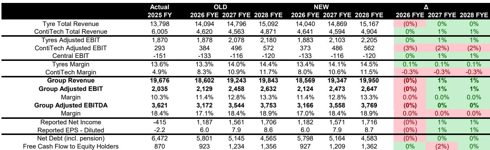
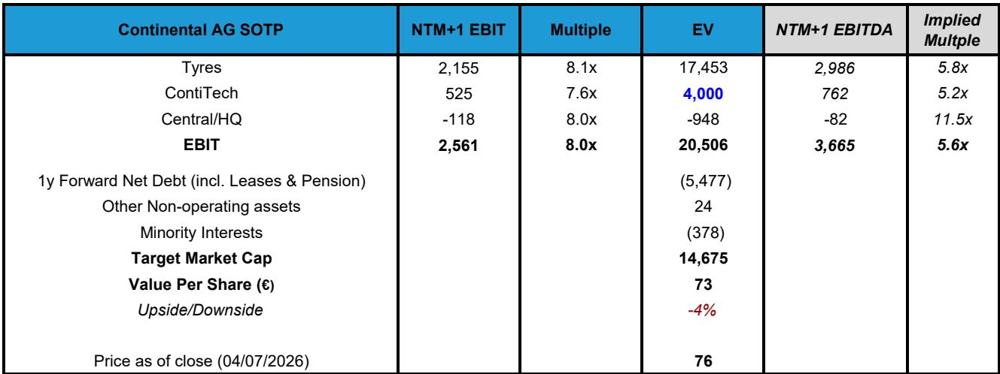
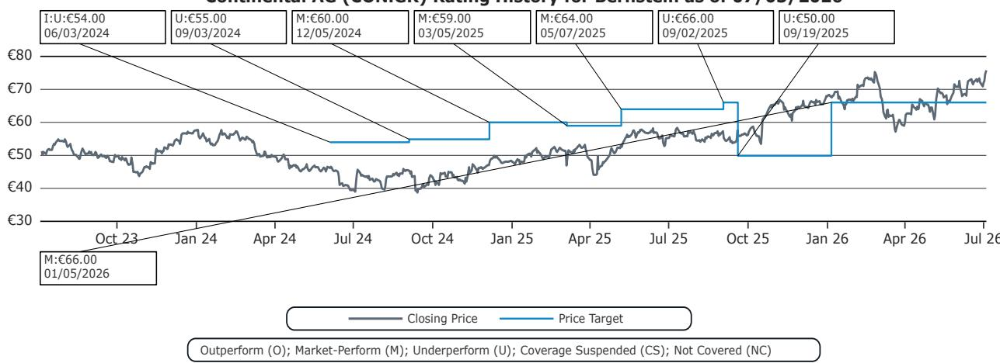

# Continental's Tyre Pureplay Is Nearly Complete, But The Valuation Already Reflects The Transformation

The sale of ContiTech to Lone Star Funds for a €4 billion enterprise value marks the final major step in Continental's long-awaited transformation into a focused tyre manufacturer. The deal, announced last Friday, delivers a price meaningfully above the sum-of-the-parts valuation of €3.3 billion that analysts had previously assigned to the industrial rubber business. Yet the market's immediate reaction tells a more nuanced story: Continental's shares closed at €75.76, already trading in a range that reflects both the transformation narrative and the valuation reality. This tension is the central point that observers must now consider.

The transaction structure is straightforward but carries important timing implications. Continental will receive initial cash proceeds of approximately €3.1 billion at closing, after accounting for the lease and pension liabilities embedded in the ContiTech entity. There is also a potential additional €250 million if performance earnouts are achieved. Management has committed to returning roughly €2.5 billion to shareholders through a combination of a special dividend and share buybacks, representing about 16% of the current market capitalisation. However, with the deal expected to close around year-end 2026 subject to regulatory approvals, and board approval required for a cash return of this magnitude, shareholders should not expect to see the proceeds until the second half of 2027 at the earliest.

The strategic logic of this divestiture has been clear for some time, but the execution raises a fundamental question: has the market already priced in the benefits of the pureplay structure, leaving limited upside for new participants?

## The ContiTech Sale Price Exceeds Conservative Estimates But Falls Short of Initial Investor Hopes

The €4 billion enterprise value for ContiTech represents a meaningful premium to the SOTP valuation that had been widely used by the analyst community. The research team had previously valued the segment at €3.3 billion, implying that the agreed price is roughly 21% above their estimate. This outperformance relative to conservative modelling is a genuine positive for Continental's management and for shareholders who had been waiting for the conglomerate discount to narrow.

However, context matters. Initial investor expectations for the ContiTech sale had extended as high as €5 billion, reflecting optimism about the quality of the business and the potential for a competitive auction process. The final price of €4 billion, while better than the cautious base case, sits close to the buyside consensus that had developed in recent months. The deal therefore validates existing expectations rather than exceeding them in a way that would drive significant rerating.

The sale multiple also warrants scrutiny. At 7.6 times forward EBIT, ContiTech is being sold at a discount to the tyre business which the research team values at 8.1 times EBIT. This differential reflects the structural differences between the two businesses: ContiTech has historically generated lower margins and faces a more cyclical industrial demand profile, while the tyre business benefits from a more stable replacement demand base and stronger brand positioning. The multiple gap is reasonable but not generous, and it suggests that Lone Star is acquiring the business at a price that leaves room for operational improvement and multiple expansion under private ownership.

For Continental shareholders, the key question is whether the proceeds are being deployed optimally. The commitment to return €2.5 billion to shareholders is a clear positive, but it also signals that management does not see more attractive opportunities within the remaining tyre business or through external acquisitions. This is a defensible position given the mature nature of the tyre industry, but it also limits the potential for value creation beyond the initial cash return.

## The RemainCo Tyre Business Trades at a Premium to Peers Despite Structural Margin Headwinds

With ContiTech sold, Continental becomes a pureplay tyre manufacturer with approximately 80% exposure to the consumer tyre segment. On the surface, this is an attractive asset: it has above-average margins within the industry, strong cash generation, and a very efficient production footprint that has historically delivered solid returns on invested capital. The European exposure is notable, with the region accounting for roughly half of revenues, compared to Michelin which has a more balanced geographic mix including a larger US presence.

Yet the investment thesis must confront an uncomfortable reality. Continental's margins have experienced a material decline since 2017, a period during which industry volumes have shrunk and raw material inflation has accelerated. The research team attributes this decline to the company's lower premium mix and its historically volume-focused expansion model, which has resulted in weaker pricing power compared to competitors. A tyre company that cannot pass through cost increases to customers faces a structural competitive disadvantage, and Continental's margin trajectory suggests this is not a temporary cyclical issue.

At the current share price, the RemainCo is valued at approximately 8 times EBIT, which represents a small premium to Michelin. The research team considers this valuation fair, and their analysis supports the view that there is limited upside from current levels. The premium is justified by Continental's pureplay status and its operational efficiency, but it also leaves little room for error. If the company fails to stabilise or improve its margins, the multiple could contract, creating downside risk for those considering entry at today's prices.

The cash return of €2.5 billion does provide a floor for the stock, but it is a one-time event that will not recur. Once the special dividend and buybacks are completed, investors will be left holding a tyre company that faces the same competitive dynamics and margin pressures that existed before the ContiTech sale. The transformation narrative has been executed, but the underlying business challenges remain.

## What the Report Does Not Fully Answer: The Sustainability of Margin Recovery and Competitive Positioning

The research report provides a detailed financial model and valuation framework, but it leaves several critical questions unresolved. The most important of these concerns the trajectory of tyre margins. The model forecasts that tyre segment margins will improve from 13.6% in 2025 to 14.5% by 2028, a gradual recovery that assumes the company can stabilise its competitive position and benefit from operational leverage as volumes grow. However, the report also documents a decade-long decline in margins driven by structural factors like weaker pricing power and a lower premium mix. The tension between these two narratives is not resolved.

Observers need to understand whether the margin decline since 2017 is primarily cyclical or structural. If it is cyclical, then the recovery forecast is reasonable and the current valuation may be attractive. If it is structural, then the margin improvement embedded in the model may prove optimistic, and the stock could face further adjustment as the market reassesses its expectations.

A second unresolved question relates to Continental's competitive positioning versus Michelin and other premium tyre manufacturers. The report notes that Continental is more exposed to Europe and has a less premium mix, but it does not fully explore the implications of this positioning for long-term growth and profitability. In a world where electrification and autonomous driving are changing the performance requirements for tyres, companies with stronger R&D capabilities and brand equity in the premium segment may be better positioned to capture value. Continental's historical focus on volume and mid-market positioning could become a liability in this evolving landscape.

The report also does not address the potential for further portfolio optimisation. With ContiTech sold and the tyre business as the sole remaining operating segment, Continental's corporate structure is simplified. But there may be additional opportunities to unlock value within the tyre business itself, such as spinning off the specialty tyre operations or pursuing strategic partnerships in specific geographic markets. These possibilities are not explored, leaving observers to wonder whether the transformation is truly complete or merely at an intermediate stage.

## A Decision Framework for Evaluating Continental Post-ContiTech

For those considering Continental at current levels, the analytical challenge is to separate the transformation story from the underlying business reality. A structured decision framework can help clarify the key variables that will determine the outcome.

The first dimension is valuation. At 8 times EBIT with a small premium to Michelin, Continental is not obviously cheap. The cash return provides a near-term catalyst, but it is a one-time event that does not change the long-term earnings power of the business. Observers should calculate the pro-forma valuation after the cash return is completed, adjusting for the reduction in equity value and the lower net debt. This adjusted multiple will reveal whether the stock offers a margin of safety or is fully priced for the expected improvements.

The second dimension is margin trajectory. The research model assumes tyre margins will recover to 14.5% by 2028, but this forecast depends on several assumptions about volume growth, raw material costs, and competitive dynamics. Observers should stress-test these assumptions by considering scenarios where margins remain flat or decline further. A sensitivity analysis that shows the implied valuation at different margin levels will indicate whether the current price already reflects optimistic assumptions.

The third dimension is capital allocation. Management's decision to return virtually all of the ContiTech proceeds to shareholders signals a lack of attractive reinvestment opportunities within the tyre business. This is not necessarily negative, but it does limit the potential for organic value creation. Observers should evaluate whether the tyre business can generate sufficient free cash flow to support both the regular dividend and organic investment, or whether the company will need to rely on debt or equity issuance to fund growth initiatives.

The fourth dimension is competitive positioning. Continental's European exposure and mid-market focus create specific risks and opportunities. Observers should assess whether the company can defend its market share against lower-cost Asian competitors while also investing in the premium technologies needed to serve the electric vehicle market. The report provides some data on regional exposure but does not offer a detailed competitive analysis that would allow for this assessment with confidence.

By working through these four dimensions, observers can develop a clear view of whether Continental at €75.76 offers a compelling risk-reward profile or whether the transformation story has already been fully priced in.

## The Open Questions That Should Drive Further Research

The ContiTech sale is a significant milestone, but it does not resolve the fundamental questions about Continental's long-term value proposition. Those who want to make an informed decision will need to dig deeper into several areas that the report touches on but does not fully explore.

One area is the competitive dynamics within the European tyre market, where Continental generates the majority of its revenue. The European market is mature and highly competitive, with strong incumbents like Michelin and Bridgestone competing for share alongside lower-cost Asian manufacturers. Continental's position in this market is not clearly superior, and the company's historical margin decline suggests it has been losing ground. Understanding whether this trend can be reversed requires a more granular analysis of market share trends, product mix shifts, and pricing power in each major segment.

Another area is the potential for Continental to benefit from the growth of electric vehicles. EVs place different demands on tyres, with higher torque requirements and a need for lower rolling resistance to maximise range. Companies that can develop tyres specifically optimised for EVs may capture premium pricing and market share. Continental's R&D capabilities and product pipeline in this area are not discussed in the report, leaving observers to make their own assessments about the company's competitive position in this important growth market.

The report also does not address the regulatory and environmental risks facing the tyre industry. European regulations on tyre labelling, recycling, and end-of-life management are becoming more stringent, and companies that are not prepared for these changes could face significant compliance costs. Continental's sustainability strategy and its positioning relative to regulatory trends would be important inputs for a long-term assessment.

Join the community to read the full report and review the original charts.

*For informational purposes only. Portions may be generated, translated, summarized, or edited with AI assistance based on source materials and may contain omissions or errors. Please verify independently. This is not professional advice.*

For informational purposes only. Portions may be generated, translated, summarized, or edited with AI assistance based on source materials and may contain omissions or errors. Please verify independently. This is not professional advice.

