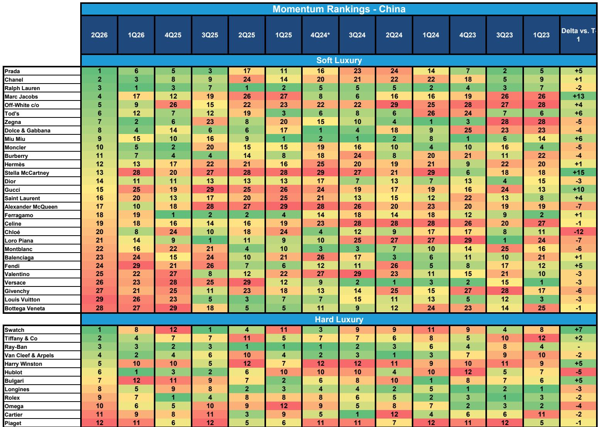
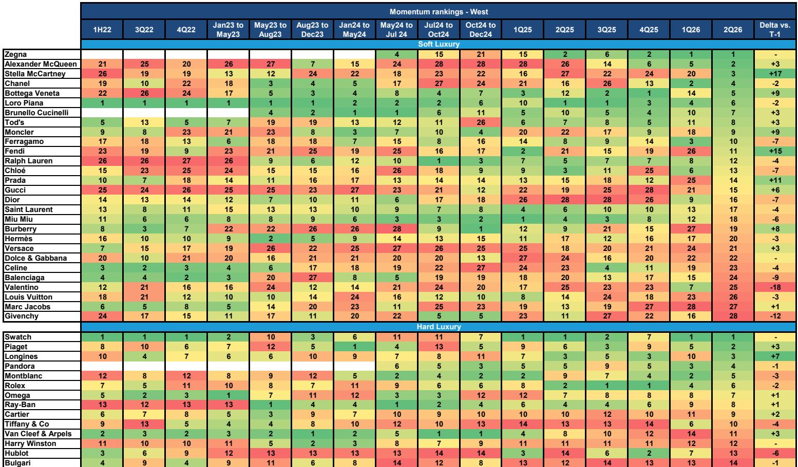
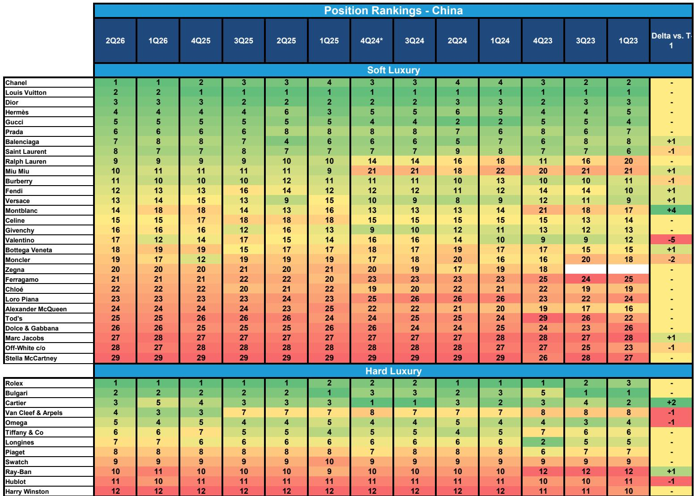

# 社交媒体热度揭示奢侈品市场的三种速度：香奈儿重生、古驰炼狱，以及将定义下一周期的两极分化

奢侈品行业并未经历统一的复苏。它正在分裂为三种截然不同的轨迹，这需要同样不同的研究思路。根据一项涵盖2026年第二季度西方和中国平台的详细社交媒体热度分析，数据并不支持品牌广泛复兴的说法。相反，它揭示了一个市场：香奈儿实现了病毒式的重生，其光芒盖过了古驰和迪奥的复苏；普拉达集团在其两个旗舰品牌之间表现出鲜明的对比；而像杰尼亚这样的高端专业品牌，在日益分化的消费格局中继续构建持久的优势。来自这一数据的信号是明确的：奢侈品增长的下一阶段不会由“水涨船高”驱动，而是由那些成功重新定义其文化相关性的品牌与仍在应对“静奢”时代后遗症的品牌之间的结构性分化所驱动。

为什么现在很重要，这很直接。2026年第二季度代表了一个关键的转折点。该行业在疫情后需求正常化之后，经历了大约18个月的调整周期。观察者一直在等待迹象，看哪些品牌拥有定价能力、文化共鸣和运营纪律，能够以更强的姿态出现。社交媒体数据提供了一个早期、高频的品牌热度读数，至少比财务数据提前一个季度。对于那些愿意从噪音中解析信号的人来说，2026年第二季度可见的模式，为进入下半年时的配置构建提供了可操作的启示。

接下来的论述并非排名摘要。它是对这些排名对于重塑奢侈品需求的结构性力量意味着什么的解读，以及一个用于判断哪些品牌有望在一个由消费者分化而非趋同所定义的市场中胜出的框架。

## 香奈儿的热度飙升并非偶然；它反映了传统主导品牌力量的结构性重振

2026年第二季度数据中最引人注目的发现是香奈儿在西方和中国社交媒体上的持续热度。该品牌目前在西方排名第四，在中国排名第二。这并非一个季度的异常现象。自2025年年中以来，香奈儿在热度排名中稳步攀升，其当前位置标志着与它在“静奢”趋势高峰期所表现出的较平静状态的决定性决裂。与古驰和迪奥的对比具有启发性。古驰在西方排名第十五，在中国排名第十三。迪奥分别排在第十六和第十四位。两者都从2025年的低谷有所改善，但都远未达到香奈儿病毒式复苏的水平。

这里的关键在于，香奈儿的热度不仅仅是营销支出或单一病毒式传播活动的结果。它反映了一种更深层次的结构性优势。在消费者对快速创意更替和品牌重新定位感到疲惫的时刻，香奈儿成功地重新确立了传统、稀缺性和一致品牌标识的力量。相比之下，古驰在“静奢”主导时尚潮流期间，经历了十二到十五个季度的低迷期。这些逆风正在减弱，但数据表明它们依然存在。迪奥的复兴，根据公司评论虽在正轨上，但却是渐进而非爆发式的。香奈儿之所以能超越两者，是因为它在“静奢”时代从未失去其核心身份。它只是等待周期回归到其优势领域。

对于观察者而言，这意味着在短期内，香奈儿很可能比古驰或迪奥享有更显著的财务表现加速。社交媒体数据是收入动量的领先指标，而香奈儿与其复苏同行之间的差距足够大，具有实质性意义。一个悬而未决的问题——该报告并未完全回答——是香奈儿当前的热度能否在这些高位上持续，还是该品牌正在经历一个周期性高峰，会随着其近期活动的新鲜感消退而趋于平稳。

## 普拉达集团的对比表现揭示了过度依赖单一品牌动量周期的风险

普拉达集团在2026年第二季度的数据中提供了最微妙的案例之一。主品牌普拉达在中国夺得了第一的位置，这是一项了不起的成就，表明与中国消费者产生了强烈共鸣。在西方，普拉达处于较为温和的第十四位，表明热度一般，并非特别突出。然而，缪缪讲述了一个不同的故事。该品牌在西方下降了六位至第十八位，而在中国，尽管攀升了六个名次，也仅排在第九位。

这种分化在分析上很重要，因为它挑战了普拉达集团的成功主要由缪缪的非凡表现驱动的说法。缪缪在过去两年中一直是奢侈品界讨论最多的品牌之一，但其热度现在正因面临更艰难的同比基数和高于平均水平的中东地区敞口而减速，中东地区的地缘政治逆风正在造成增量需求压力。与此同时，主品牌普拉达似乎在缪缪挣扎之际，实现了增量品牌加速。

这里的主导思想是，普拉达集团内部正变成一家双速公司，观察者需要评估主品牌在中国的热度是否足以抵消缪缪的正常化。数据表明可能如此，但容错空间正在缩小。报告估计，缪缪的减速，加上外汇逆风、更高的营销成本以及范思哲的整合，将使集团2026财年的息税前利润率压缩至18.2%，比市场共识低约190个基点。这是一个市场尚未完全定价的显著差距。

报告留给读者的一个悬而未决的问题是，普拉达在中国的热度是持久的，还是反映了消费者注意力的暂时转移，这种转移可能像出现时一样迅速逆转。该品牌在中国排名第一令人印象深刻，但社交媒体数据本身具有波动性，一个季度的领先地位并不构成趋势。

## 像杰尼亚这样的高端专业品牌正受益于男装的结构性转变和可能持续存在的消费者分化

杰尼亚在2026年第二季度数据中的表现，是一个关于利基定位如何能在分化市场中产生超常热度的案例研究。该品牌在西方保持第一的位置，这是它在过去几个季度中持续保持或接近的位置。这不是一次性的峰值。杰尼亚已连续多个时期位列西方社交媒体热度的前五名。

报告指出了驱动这一表现的三个潜在因素，每个都值得仔细考量。首先，杰尼亚受益于较低的基数。与大型品牌相比，它仍然是一个相对小众的品牌，因此增量的兴趣会在热度得分上产生更大的百分比变动。其次，男装潮流似乎已转向对杰尼亚有利。消费者正转向稍微更正式的着装风格，尤其是在鞋履方面，这可能会提振对杰尼亚标志性Triple Stitch鞋的需求。第三，消费者分化和强劲的高端需求提供了另一个顺风。最富有的消费者仍在消费，他们倾向于那些提供独特性、工艺和清晰身份的品牌。

对观察者而言，关键在于杰尼亚的热度并非纯粹的特异性。它与报告所描述的奢侈品市场两种可能情景之一——高端专业化的更广泛结构性趋势——是一致的。如果收入和财富不平等继续加剧，最富有的消费者将推动全球奢侈品市场增长，使较小、更高端的品牌处于优势。杰尼亚、布鲁内罗·库奇内利、法拉利，以及斯特凡诺·里奇和格拉夫等私营公司，是这一情景的自然受益者。相反，如果中国重新为更广泛的渴望型消费者群体创造财富，那么像路易威登、爱马仕和卡地亚这样的巨型品牌将引领增长。

报告并未就哪种情景会占上风给出明确立场，但它确实指出历峰集团最有能力在两种情景下都蓬勃发展，因为它具有服务于高端和渴望型消费者的灵活性。对于关注高端情景的观察者来说，杰尼亚和布鲁内罗·库奇内利被视为有吸引力的长期关注对象。

## 关于复苏叙事持久性，数据提出的问题多于答案

这份报告最有价值的贡献之一，是它迫使读者直面嵌入在复苏叙事中的不确定性。古驰和迪奥的社交媒体数据显示出改善，但改善的幅度相对于已计入其报价的预期而言是温和的。古驰在中国的热度得分已从2025年的低点有所改善，但仍远低于香奈儿或普拉达达到的水平。迪奥的轨迹同样渐进。

报告对开云集团的模型更新具有启发性。分析师已将古驰2026年第二季度零售固定汇率预测下调了300个基点至负4%。他们继续看到从第一季度负9%的环比改善，但他们明确表示，品牌重新点燃尚未实现。他们现在预计古驰将在2026年底恢复增长，而非全年基础上。这导致2026年全年零售固定汇率预测下降250个基点至负2.9%。

报告未完全解决的一个悬而未决的问题是，古驰的渐进改善是否足以证明开云集团交易所在的倍数是合理的。该公司已警告称，VisibleAlpha的共识估计可能不可靠，而分析师的预测现在比2026财年每股收益的共识低8%，比2027财年低3%。这一差距表明，市场可能正在定价一个比数据所支持的更快的复苏。

对于迪奥，报告更为建设性但仍持谨慎态度。该品牌的复兴被描述为在正轨上，可能逐步回归正增长。但社交媒体数据并未表明那种会推动财务表现快速加速的爆炸性热度。对于观察者来说，问题在于，在一个香奈儿已为品牌热度设定新基准的市场中，“渐进”是否足够。

## 驾驭三种速度奢侈品市场的决策框架

对于希望将这一分析转化为可操作决策的读者，以下框架可能有用。这不是对任何特定证券的建议。这是一种评估哪些品牌与最可能的需求情景相一致的结构化方式。

第一个维度是品牌热度的可持续性。香奈儿在两个地区拥有较强劲的持续热度证据。普拉达在中国热度强劲，但在西方较弱。杰尼亚在西方热度持续，但在中国表现更不稳定。古驰和迪奥的热度正在改善，但仍然温和。观察者应询问每个品牌当前的热度是由将持续的结构性因素驱动，还是由会消退的一次性事件驱动。

第二个维度是对消费者分化的敞口。服务于市场高端领域的品牌，如杰尼亚、布鲁内罗·库奇内利和历峰集团的珠宝品牌，在财富不平等继续推动顶层需求的情景下处于更有利位置。依赖渴望型消费者的品牌，如古驰，以及某种程度上迪奥，在中国中产阶级需求复苏的情景下敞口更大。观察者需要决定他们押注于哪种情景。

第三个维度是相对于共识的估值。报告的模型更新表明，对开云集团和普拉达集团的共识估计可能过于乐观。观察者应将分析师的预测与共识进行比较，并评估这一差距是否由社交媒体数据证明合理。如果数据支持更保守的估计，那么当前估值可能没有提供足够的安全边际。

第四个维度是复苏执行的质量。香奈儿的复兴不需要复苏。它只需要品牌在周期回归时忠于其身份。古驰和迪奥正在尝试真正的复苏，这本质上风险更高、更耗时。社交媒体数据表明，古驰的复苏进展比迪奥慢，但两者都面临来自复苏的香奈儿的逆风。

这个框架并非详尽无遗，但它提供了一种结构化的方式来评估2026年第二季度数据所揭示的权衡。报告包含关于个别品牌轨迹的更多细节，包括在亚历山大·麦昆、斯特拉·麦卡特尼和马克·雅各布推动热度峰值的特定事件，以及对这些峰值是否可能持续的分析。

加入社区阅读完整报告并查看原始图表。关于随时间变化的热度得分数据、西方和中国社交媒体的详细排名，以及对开云集团和普拉达集团的模型更新，对于任何在奢侈品领域做出积极决策的人来说都是必不可少的。报告还包括社交媒体分析。

*仅供参考。部分内容可能基于源材料通过AI辅助生成、翻译、总结或编辑，可能存在遗漏或错误。请独立核实。这不构成专业建议。*

仅供参考。部分内容可能基于源材料通过AI辅助生成、翻译、总结或编辑，可能存在遗漏或错误。请独立核实。这不构成专业建议。

