Global Semis

# ASML: High-NA EUV成本深度分析——光刻强度提升，目标价上调至€2300

David Dai, CFA
+852 2918 5704
david.dai@bernsteinsg.com

Mark Li
+852 2123 2645
mark.li@bernsteinsg.com

Stacy A. Rasgon, Ph.D.
+1 213 559 5917
stacy.rasgon@bernsteinsg.com

Carmine Milano, CFA

+44 20 7762 1857

carmine.milano@bernsteinsg.com

Juho Hwang

+81 3 6777 6980

juho.hwang@bernsteinsg.com

Jack Lin
+852 2123 2683
jack.lin@bernsteinsg.com

HNA EUV可能首先在DRAM中被采用，而非逻辑芯片，原因是DRAM的曝光成本更低。市场普遍担心HNA过于昂贵（如台积电所言）且短期内不会被采用。然而，一个较少被讨论的关键差异在于DRAM和逻辑芯片：DRAM的芯片尺寸远小于逻辑芯片，因此仅需使用1块掩模版，而逻辑芯片由于芯片尺寸较大（需要拼接），通常需要2块掩模版。掩模版更换会使吞吐量降低23%（135片/小时 vs. 175片/小时），而DRAM的HNA曝光成本更低，更容易被证明其合理性。因此，我们认为DRAM很可能在2027年的1d节点采用HNA，届时LNA EUV需要双重曝光，这比逻辑芯片更早。

逻辑芯片对HNA的采用也已提上日程。HNA曝光的高成本主要与目前80-85%的低设备可用率有关，而LNA的可用率接近95%。然而，HNA的设备可用率正在快速提升，目标是到2030年达到约95%。即使使用2块掩模版，每小时晶圆产量也有望从135片提升至175片。虽然目前逻辑芯片的HNA曝光光刻设备成本约为LNA的3倍，但到2030年这一差距将缩小至约2倍。考虑到双重曝光的其他成本和复杂性，逻辑芯片在此时间点之前转向HNA是合理的。我们预计英特尔将在2028年率先采用HNA，而台积电的进度会较慢，但仍可能在2030年采用。

光刻强度预计从2025年的24%上升至2028年的26%。当HNA取代LNA的多重曝光时，双重曝光（刻蚀、沉积、清洗等）的其他成本可以大幅降低。因此，光刻强度有望随着HNA的采用而上升，正如当年LNA EUV取代DUV（ArFi）多重曝光时光刻强度增加一样。我们预测DRAM的光刻强度将从1z节点的约20%增加到1d节点的约30%，原因是EUV层数增加以及1d节点采用HNA。而逻辑芯片的光刻强度在N2和A14节点因HNA采用有限而稳定在约32%，我们预计在A10节点会有所上升。主要受DRAM驱动，我们预测光刻强度将从2025年的24%增加到2028年的26%，ASML的市场份额将随之提升。

在AI驱动的先进逻辑和DRAM产能空前扩张的背景下，我们大幅上调了ASML的收入预测。我们将2027年EUV（包括HNA）出货量预测上调至91套（此前为86套），2028年上调至113套（此前为87套），并预计ASML将扩大EUV产能。这建立在吞吐量提升所支撑的强劲平均售价扩张之上。因此，我们现在预计EUV收入将以30%的复合年增长率增长，到2030年达到427亿欧元，比市场预期高出30%以上。我们还上调了DUV的预测，尤其是在本十年末，现在预计DUV收入将从2026年的130亿欧元增长到2030年的200亿欧元。

首选标的，基于产能周期和光刻强度上调目标价。更高的收入和运营杠杆也支撑了更强的盈利能力，我们预测2028年每股收益为67欧元，比市场共识高出35%。我们也不认为产能支出会达到顶峰，预计ASML到2030年收入将达到800亿欧元（20%复合年增长率），每股收益达到97欧元（31%复合年增长率）。ASML目前相对于同行处于估值低谷。鉴于产能周期的明显加速和同行估值的上升，我们将目标市盈率从35倍上调至40倍（高于均值1个标准差），将目标价上调至2300欧元。

## BERNSTEIN 代码表

<table><tr><td rowspan="2">代码</td><td rowspan="2">评级</td><td rowspan="2">货币</td><td rowspan="2">2026年7月3日收盘价</td><td rowspan="2">目标价</td><td rowspan="2">过去12个月相对表现</td><td colspan="4">报告每股收益</td><td colspan="3">报告市盈率（倍）</td></tr><tr><td>当前</td><td>2025A</td><td>2026E</td><td>2027E</td><td>2025A</td><td>2026E</td><td>2027E</td></tr><tr><td>ASML.NA (ASML)</td><td>O</td><td>欧元</td><td>1,634.40</td><td>2,300.00</td><td>120.2%</td><td>欧元</td><td>24.72</td><td>32.73</td><td>48.68</td><td>66.1</td><td>49.9</td><td>33.6</td></tr><tr><td>旧</td><td></td><td></td><td></td><td>1,700.00</td><td></td><td></td><td></td><td>32.69</td><td>46.98</td><td></td><td></td><td></td></tr><tr><td>ASML (ASML)</td><td>O</td><td>美元</td><td>1,769.32</td><td>2,623.00</td><td>103.5%</td><td>美元</td><td>27.95</td><td>37.01</td><td>55.05</td><td>55.4</td><td>41.8</td><td>28.1</td></tr><tr><td>旧</td><td></td><td></td><td></td><td>1,971.00</td><td></td><td></td><td></td><td>36.96</td><td>53.13</td><td></td><td></td><td></td></tr><tr><td>INTC (英特尔)</td><td>M</td><td>美元</td><td>120.35</td><td>100.00</td><td>416.0%</td><td>美元</td><td>0.43</td><td>1.07</td><td>1.50</td><td>282.3</td><td>112.4</td><td>80.0</td></tr><tr><td>005930.KS (三星电子)</td><td>O</td><td>韩元</td><td>314,500</td><td>440,000</td><td>359.0%</td><td>韩元</td><td>6,611.53</td><td>48,393</td><td>77,273</td><td>47.6</td><td>6.5</td><td>4.1</td></tr><tr><td>005935.KS (三星优先股)</td><td>O</td><td>韩元</td><td>208,000</td><td>374,000</td><td>256.9%</td><td>韩元</td><td>6,611.53</td><td>48,393</td><td>77,273</td><td>31.5</td><td>4.3</td><td>2.7</td></tr><tr><td>SMSN.LI (三星)</td><td>O</td><td>美元</td><td>5,040.00</td><td>7,350.00</td><td>298.8%</td><td>美元</td><td>116.15</td><td>812.39</td><td>1,290.80</td><td>43.4</td><td>6.2</td><td>3.9</td></tr><tr><td>000660.KS (SK海力士)</td><td>O</td><td>韩元</td><td>2,424,000</td><td>3,300,000</td><td>758.3%</td><td>韩元</td><td>60,341</td><td>395,677</td><td>568,862</td><td>40.2</td><td>6.1</td><td>4.3</td></tr><tr><td>MU (美光)</td><td>O</td><td>美元</td><td>975.56</td><td>1,300.00</td><td>678.6%</td><td>美元</td><td>8.29</td><td>67.39</td><td>158.99</td><td>117.7</td><td>14.5</td><td>6.1</td></tr><tr><td>2330.TT (台积电)</td><td>O</td><td>新台币</td><td>2,445.00</td><td>2,780.00</td><td>87.5%</td><td>新台币</td><td>66.25</td><td>101.62</td><td>124.63</td><td>11.7</td><td>8.6</td><td>6.6</td></tr><tr><td>TSM (台积电)</td><td>O</td><td>美元</td><td>434.16</td><td>430.00</td><td>65.7%</td><td>美元</td><td>10.48</td><td>16.07</td><td>19.70</td><td>13.1</td><td>9.7</td><td>7.4</td></tr><tr><td>EDME</td><td></td><td></td><td>1,622.79</td><td></td><td></td><td></td><td></td><td></td><td></td><td></td><td></td><td></td></tr><tr><td>SPX</td><td></td><td></td><td>7,483.24</td><td></td><td></td><td></td><td></td><td></td><td></td><td></td><td></td><td></td></tr><tr><td>ASIAX</td><td></td><td></td><td>1,977.84</td><td></td><td></td><td></td><td></td><td></td><td></td><td></td><td></td><td></td></tr><tr><td>EM</td><td></td><td></td><td>1,835.33</td><td></td><td></td><td></td><td></td><td></td><td></td><td></td><td></td><td></td></tr></table>

## 目标价变动 / 预测变动以粗体显示

O - 跑赢大盘，M - 与大市同步，U - 跑输大盘，NR - 未评级，CS - 暂停覆盖
INTC, MU 预测为调整后每股收益；INTC, MU 估值为调整后市盈率（倍）；2330.TT, TSM 估值为市净率（倍）；
来源：彭博，Bernstein 预测与分析。

## 投资启示

我们对ASML的评级为跑赢大盘，目标价=2,300欧元；台积电跑赢大盘，目标价=430美元；英特尔跑赢大盘，目标价=100美元；三星跑赢大盘，目标价=440,000韩元；SK海力士跑赢大盘，目标价=3,300,000韩元；美光跑赢大盘，目标价=1,300美元。

## 详细分析

我们的ASML模型和行业模型可在此处下载（ASML.NA / ASML Holding NV；EUV模型；DUV模型）。

读者对我们看多ASML的一个担忧是High-NA（HNA）采用的延迟，尤其是台积电（ASML - High-NA EUV采用推迟？）。读者经常问为什么HNA没有被采用，如果台积电不想采用它，是否意味着光刻相对于刻蚀和沉积等其他工艺的放缓。本报告分析了HNA与Low-NA（LNA）EUV的成本，并得出结论：HNA很可能首先被存储芯片采用，其次是逻辑芯片，这将推动光刻强度的提升。我们重申看多ASML，并将目标价上调至2300欧元。

HNA EUV极大地简化了工艺，并将取代LNA EUV成为领先的边缘光刻工具。

\- HNA EUV已展示出约8纳米的解析度，而LNA EUV约为13纳米，这得益于从0.33数值孔径到0.55 NA光学系统的升级。在光刻中，解析度大致与波长除以数值孔径成正比，因此在保持EUV波长13.5纳米不变的同时将NA提高约67%，使得ASML能够印制显著更小的特征。

\- 这种解析度的提升转化为约2.8-2.9倍的理论图案密度提升。简单的直觉是面积缩放：如果可印制的半节距从约13纳米改善到约8纳米，则密度增益约为2.8倍，或特征尺寸缩小约1.7倍，相对于0.33 NA EUV。关键变化是更大的投影光学孔径，从NA 0.33到NA 0.55。更高的NA以更宽的角度收集和投射光线，从而在更小的节距下提高图像清晰度和对比度。ASML还强调，HNA提供了更高的成像对比度，这改善了局部临界尺寸均匀性，减少了变异性，并可以降低所需的曝光剂量（图表1）。

\- 其优势不仅在于更小的线条，还在于更简单的图案化。在非常紧密的节距下，LNA EUV越来越需要双重或三重曝光：多个掩模版、多个光刻-刻蚀循环以及额外的切割/通孔步骤。HNA可以将其中一些关键层转换回单次曝光，从而减少掩模版数量、工艺复杂性、边缘放置误差累积、周期时间和缺陷机会。

HNA曝光的成本目前较高，但随着可用率的提高，预计将显著下降。我们估计，在95%可用率下，HNA曝光成本可降低23%。

\- 当前设备可用率较低：在现阶段，HNA工具面临较低的可用率，这是新光刻工具的常见问题。虽然HNA已经沿着预期的成熟度曲线推进，2025年运行在约80%的可用率，但仍显著低于接近95%可用率的LNA。ASML早在2014年就开始了HNA的研发，在2023年系统集成后，在HNA实验室实现了首批良好曝光晶圆。到2025年9月，EXE系统已曝光超过50万片晶圆，提供了更大的数据集来推动可靠性学习和量产准备。

\- 可用率提升在望：ASML披露，HNA可用率在2025年首次超过80%，机队可用率正朝着2026年90%的目标成熟。可用率较低的主要来源仍然是较长的非计划停机，尤其是超过12小时的事件，而计划停机也部分由监控、配置更新和平台学习驱动。ASML的成熟度曲线显示，EXE的可用率在可比阶段优于LNA/NXE，目标是在未来3-4年内达到约95%（图表2，图表3）。

\- 每次曝光成本下降：随着可用率的提高，我们估计HNA曝光的光刻设备成本在2025-2030年间可下降23%。更高的可用率是一个重要杠杆，但不是HNA成本降低的相对少见驱动因素。每次曝光成本也随着吞吐量的提高而改善：EXE:5200B在AA模式下已达到175片/小时，高于EXE:5000的110片/小时，ASML的路线图正朝着190+片/小时迈进（图表4）。

图表1: HNA EUV采用0.55 NA光学系统，同时保持13.5纳米波长不变，将已展示的解析度从约13纳米提升至约8纳米。这种更高的光学孔径增加了图像对比度，并允许以更少的图案化步骤印制更小的节距。

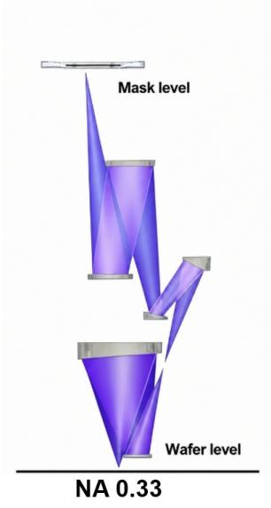

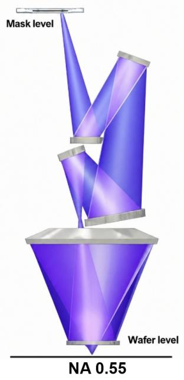  
来源：公司报告，Bernstein分析

图表2: 非计划停机是EXE不可用的主要原因，减少非计划停机是实现90%可用率目标的关键路径。  
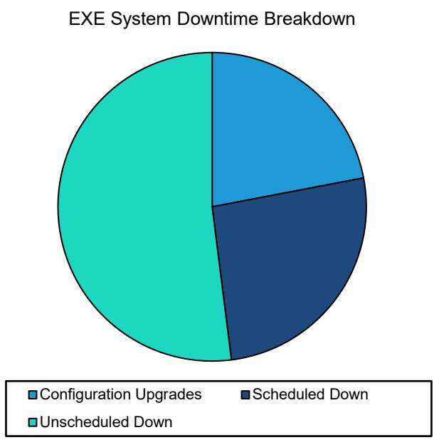  
来源：公司报告，Bernstein分析  
图表3: EXE可用率目标是在2026年第四季度达到90%，并在五年内与成熟的NXE:3600机队性能（95%）趋同。

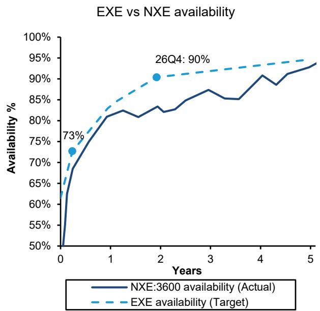  
图表4: 当HNA可用率达到95%时，一次HNA曝光的设备成本下降23%。  
HNA每次曝光成本（1块掩模版） vs 可用率  
来源：公司报告，Bernstein分析。

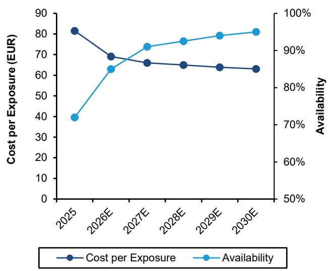  
来源：公司报告，Bernstein分析与预测。

然而，HNA曝光成本并非对所有产品都一样。HNA EUV的吞吐量（以及成本）会受到半场拼接的影响，这导致较大芯片的吞吐量较慢、成本较高。

\- HNA EUV的主要权衡在于场尺寸。标准LNA NXE系统使用4×/4×的缩小倍率，这意味着掩模版图像在晶圆上的x和y方向均缩小4倍，保留了传统的全尺寸EUV曝光场。HNA EXE使用变形4×/8×光学设计：一个方向缩小4倍，另一个方向缩小8倍。这有助于容纳更大的0.55 NA投影光学系统并控制掩模版侧角度，但同时也使曝光场在一个维度上减半。因此，EXE印制的是半场，在缩小的方向上约为16.5毫米，而不是经典的约33毫米全场高度（图表5，图表6）。

\- 对于包含许多小芯片的产品，例如某些DRAM或较小的逻辑芯片，这是可以管理的：扫描仪可以使用同一块掩模版曝光两倍的半场，无需拼接单个大芯片。然而，对于单个大型逻辑芯片，例如GPU芯片，芯片尺寸可能超过一个EXE半场。在这种情况下，就需要进行拼接。拼接意味着将一个大芯片分割到两个EXE半场曝光（掩模版A和掩模版B）上，并设计一个重叠/拼接区域，使两个曝光区域连接起来。芯片的布局和布线需要针对拼接进行设计，以便在控制重叠和对位误差的同时，连接跨越边界的布局特征（图表7）。

图表5: H100/B100 GPU芯片尺寸已接近33 x 26 mm²的物理掩模版极限。采用HNA后，此极限降至16.5 x 26 mm²。因此，大型逻辑芯片需要拼接。

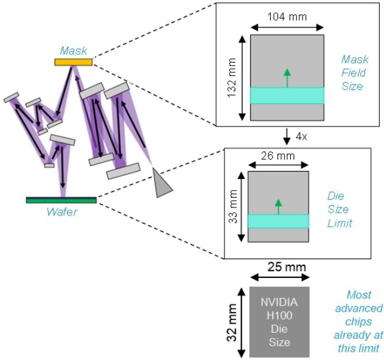  
来源：ASML，英伟达，Bernstein分析。

图表6: 在HNA中，变形光学系统在一个轴上使用4倍缩小，在另一个轴上使用8倍缩小，因此0.55 NA扫描仪仅在晶圆上印制半场。较大的逻辑芯片必须分割到两个掩模版场中。

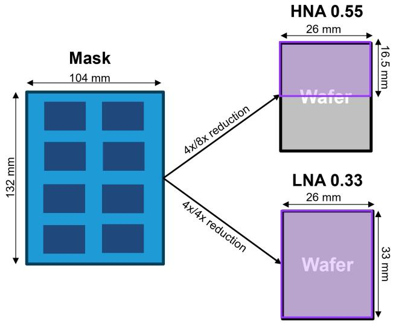  
来源：ASML，Bernstein分析

图表7: ASML HNA EUV拼接过程，使用AB掩模版重叠来重建超出掩模版限制的全场逻辑芯片，突出显示了在16.5毫米曝光边界上的精确重叠控制，用于先进芯片制造。  
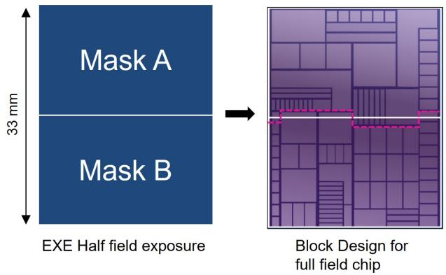

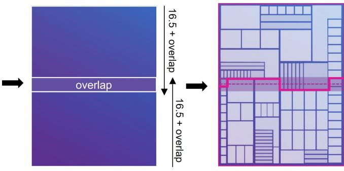  
扫描仪支持在16.5毫米之上进行AB重叠  
来源：ASML，IMEC，英特尔，Bernstein分析

我们的模拟显示，由于拼接的存在，HNA对小芯片的成本显著低于大芯片，尤其是在最初几年。

\- 对于大芯片，HNA的半场曝光需要两块掩模版（AB）和芯片拼接，这降低了有效吞吐量，而AA曝光可以重复使用同一块掩模版。ASML的路线图清晰地显示了这一点：当前的EXE:5200B在AA模式下运行速度为175片/小时，但在AB模式下为135片/小时，下降了约23%。

\- 这导致了HNA曝光成本的巨大差异；根据我们的计算，2025年，使用1块掩模版（AA）的每次HNA曝光光刻设备成本是LNA的2.4倍，而使用2块掩模版（AB）则是LNA的3.1倍。

\- AA和AB之间的差距正在缩小。下一代EXE:5200C将AA模式提升至190片/小时，AB模式提升至160片/小时，差距缩小至约16%。路线图进一步指向更高的生产力，EXE:5200D达到≥195片/小时（AA）/ ≥175片/小时（AB），EXE:5400E达到≥210片/小时（AA）/ ≥180片/小时（AB）（图表8）。

\- 这意味着HNA的光刻设备成本整体降低，大芯片和小芯片之间的成本差距也在缩小。到2030年，随着预期可用率的提高，我们预计HNA AA的成本差距将缩小至1.9倍，HNA AB为2.1倍，但HNA AA和AB之间仍存在显著差距（图表9）。

\- 这意味着对于小芯片（最典型的例子是DRAM），HNA光刻设备曝光成本较低，更容易被证明其合理性，而对于大芯片则不然。对于大芯片，HNA光刻设备成本仅低于复杂的EUV双重曝光或三重曝光，或者随着时间推移当HNA成本进一步下降时才具有优势。然而，向HNA迁移的趋势不会改变。

图表8: 由于需要双掩模版和拼接，AB HNA的吞吐量预计在未来十年内仍将显著低于AA。

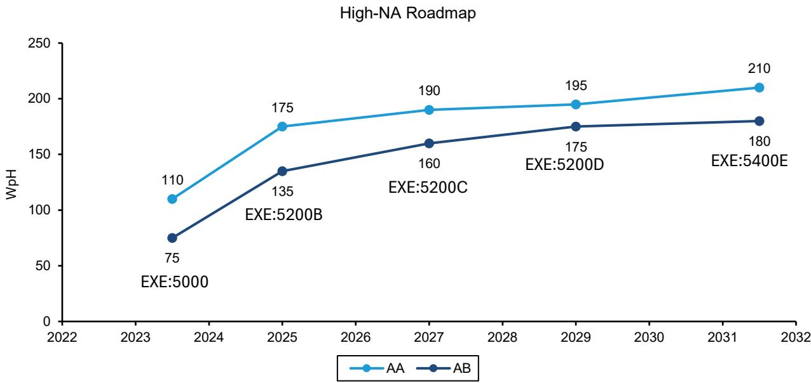  
来源：公司报告，Bernstein分析

图表9: 由于AB HNA的吞吐量较低，其每次曝光的光刻设备成本约为LNA曝光的3倍，而AA HNA的成本仅为LNA的约2.4倍。我们预计到2030年，这些成本将分别下降至约2.1倍和1.9倍。

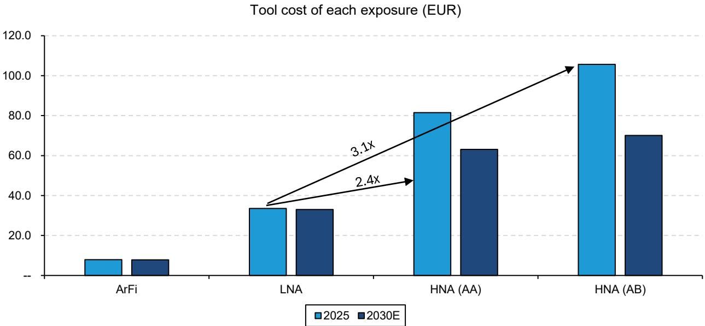  
来源：公司报告，Bernstein分析与预测。

我们得出结论，DRAM很可能比逻辑芯片更早采用HNA，原因在于无需更换掩模版。

\- 根据逻辑芯片和DRAM的路线图，HNA在逻辑芯片A14节点（2028年）和DRAM D1d节点（2027/28年）的采用变得可行。然而，如上所述，DRAM芯片尺寸本质上较小，因此不需要拼接。逻辑芯片，尤其是高性能GPU/CPU芯片，尺寸达到掩模版尺寸，需要两块掩模版进行HNA，这会减慢工艺速度（图表5）。

\- 我们的模拟显示，对于DRAM，HNA几乎肯定比LNA LELE双重曝光更便宜。当考虑更复杂的SALELE（4次曝光：2次LNA EUV和2次ArFi）或LNA EUV LELELE（3次LNA EUV）时，成本优势更加明显（图表10）。

\- 然而，对于需要拼接（AB）的大型逻辑芯片，随着时间的推移，用HNA单次曝光替代SALELE（2次EUV + 2次ArFi或3次EUV）才具有经济合理性。事实上，尽管HNA SE与2次LNA之间的光刻设备成本比率显著下降，从2025年的1.6倍下降约50%至1.1倍，但在未来五年内，使用双重曝光LNA仍比使用单次曝光HNA更便宜（图表11）。

上述分析仅考虑了光刻工具本身的成本。还有其他因素需要考虑。考虑到总成本，我们认为随着可用率的提高，HNA将更具成本竞争力，即使对于大型逻辑芯片也是如此。

\- HNA还推动了整体工艺简化、非光刻成本削减和良率提升，因此应能推动光刻强度上升。HNA实现了工艺简化，因为其更高的解析度和对比度允许原本需要LNA EUV多重曝光（例如，线/切割分离流程如SALELE）的关键层通过单次HNA曝光完成。这减少了掩模版数量、光刻-刻蚀循环、切割步骤以及相关的非光刻处理，同时提高了图案保真度、局部CDU和缺陷率（图表12）。

\- 这种简化将价值从非光刻处理转移到光刻：即使HNA曝光本身更昂贵，整个工艺流程也可能变得更便宜、更具生产力。随着可用率、吞吐量和生态系统成本路线图的改善，HNA应能支持更高的光刻强度，因为客户用更多以光刻为基础的单次曝光解决方案取代复杂的、非光刻密集型的图案化方案，包括存在拼接解决方案的大型逻辑芯片。ASML估计，从LELE LNA过渡到单次曝光HNA时，光刻强度将显著增加。光刻资本支出和运营支出预计将增加约1.2倍，而非光刻成本预计将下降（图表13，图表14）。

\- 考虑到总成本，我们认为随着可用率的提高，HNA将更具成本竞争力，即使对于大型逻辑芯片也是如此。

图表10: 我们估计，对于DRAM，HNA比LNA LELE双重曝光更具成本效益。当考虑更复杂的方案，如SALELE（4次曝光：2次LNA和2次ArFi）或LNA LELELE（3次LNA）时，优势更加明显。

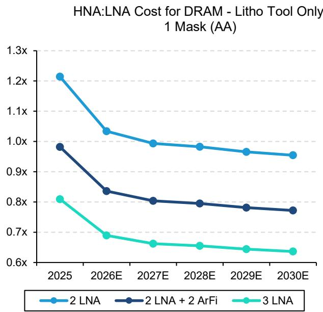  
来源：公司报告，Bernstein分析与预测

图表11: 然而，对于逻辑芯片，我们估计HNA在经济上仅适用于随着时间的推移替代SALELE（2次EUV + 2次ArFi或3次EUV）。  
逻辑芯片HNA:LNA成本 - 仅光刻工具，1块掩模版（AB）  
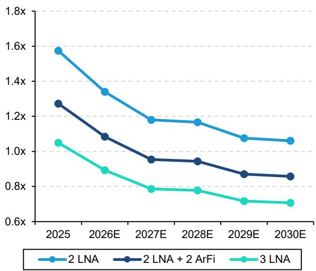  
来源：公司报告，Bernstein分析与预测

图表12: HNA通过用单次曝光替代低NA SALELE线/切割多重曝光，简化了关键层图案化，减少了掩模版、光刻-刻蚀循环、工艺步骤和非光刻成本，同时显著提高了光刻强度。

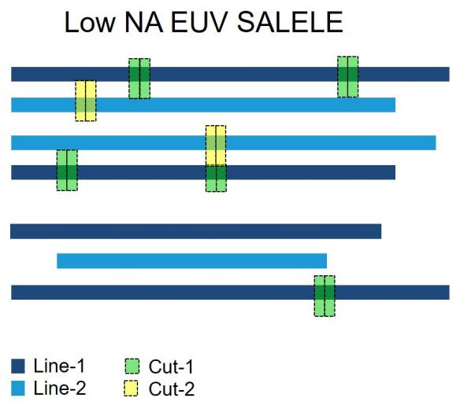  
来源：IEEE VLSI研讨会2026，Bernstein分析

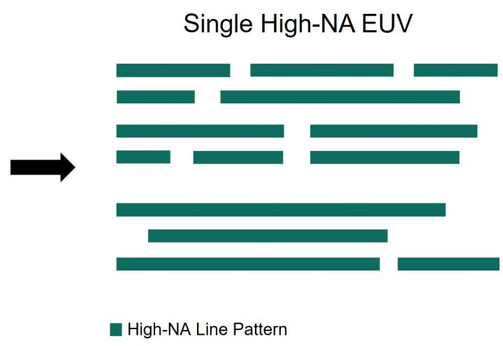  
图表13: HNA EUV相比SALELE降低了工艺复杂性和光刻曝光次数，实现了更高效的图案化、更低的成本和更高的吞吐量。  
工艺步骤和光刻曝光次数 SALELE vs HNA SE

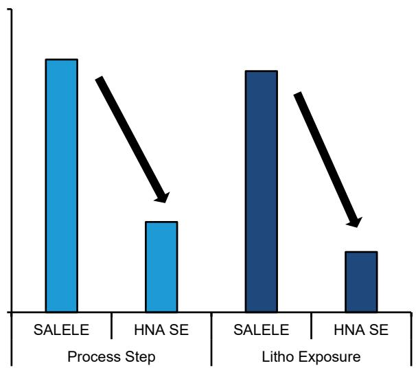  
图表14: ASML估计，从LELE LNA过渡到单次曝光HNA时，光刻强度将显著增加。光刻资本支出和运营支出预计将增加约1.2倍，而非光刻成本预计将下降。  
来源：IEEE VLSI研讨会2026，Bernstein分析  
LELE LNA vs SE HNA 光刻强度

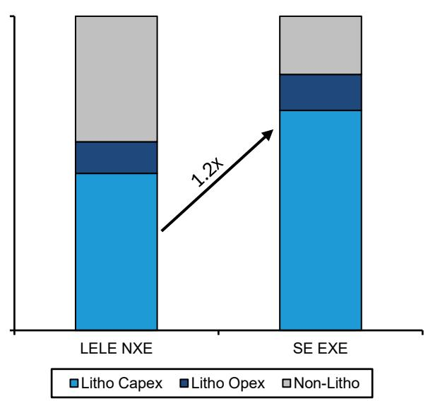  
来源：ASML，Bernstein分析

因此，DRAM很可能在2027年（1d节点）采用HNA，略早于逻辑芯片（2028-2030年）。

\- 我们对HNA采用的最佳猜测是：三星/海力士DRAM在2027年（D1d），英特尔在2028年（A14），三星逻辑芯片在2029年（SF1.4），台积电在2030年（A10）。SK海力士有最明确的早期信号：该公司在2025年9月宣布，已在其M16工厂组装了ASML的TWINSCAN EXE:5200B，这是首台面向生产的HNA系统，用于下一代DRAM开发。三星也在快速推进，行业报告显示其订购了两台ASML EXE:5200B工具，第一台预计在2025年底交付，第二台在2026年上半年。美光尚未有官方HNA披露，但他们可能会稍晚采用HNA，这与其在DRAM中更为保守的EUV LNA策略一致。在逻辑芯片领域，英特尔很可能是第一个采用者，已于2023年第四季度接收并组装了来自ASML的业界首台商用HNA EUV工具，可能用于A14的制造。三星逻辑芯片应紧随其后，而台积电似乎可能将广泛的HNA插入推迟到10A左右，优先进行研发并在早期节点上延长LNA的使用（图表15，图表16，图表17）。

\- 台积电宣布比英特尔和三星更慢地采用HNA，这并不改变HNA更优的观点。这可能反映了：1. 台积电在采用新技术与优化现有技术方面的谨慎和保守态度；2. 从经济角度看，等待HNA进一步提高可用率和吞吐量（从而降低每次曝光成本）是更好的选择（但代价是无法立即从HNA中受益）。

从财务角度看，较慢的HNA采用对ASML来说可能甚至更好……至少在短期内如此。

\- 如上所示，从光刻工具的角度来看，销售更多LNA EUV机器比销售更少的HNA机器在经济上更有利。考虑到LNA EUV的利润率远高于HNA EUV，情况尤其如此。

\- 另一方面，HNA的采用将进一步增加光刻强度，从而提升ASML在WFE中的市场份额，因为当1次HNA取代多次LNA/ArFi步骤时，更多价值从非光刻步骤（刻蚀、沉积、清洗等）转移到光刻。

图表15: DRAM厂商可能在2027年至2028年左右的1d节点开始采用HNA，届时特征尺寸F预计将降至约10纳米或以下。

HNA DRAM采用  
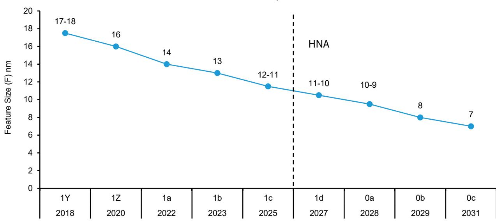  
来源：TEL，ASM International，Bernstein分析

图表16: 我们估计逻辑芯片将在A14节点左右采用HNA，可能在2028年至2030年期间，届时金属节距预计将降至约21纳米。

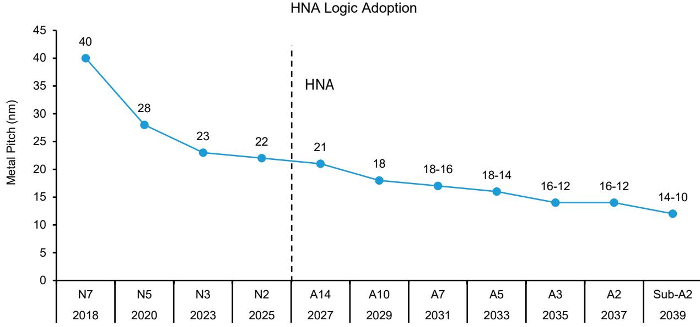  
来源：公司报告，Imec，Bernstein分析与预测

图表17: DRAM的HNA采用可能从SK海力士和三星的1d节点开始。逻辑芯片的引入应从英特尔的A14开始，然后是三星的SF1.4，最后台积电将在本十年末的10A节点左右采用HNA。

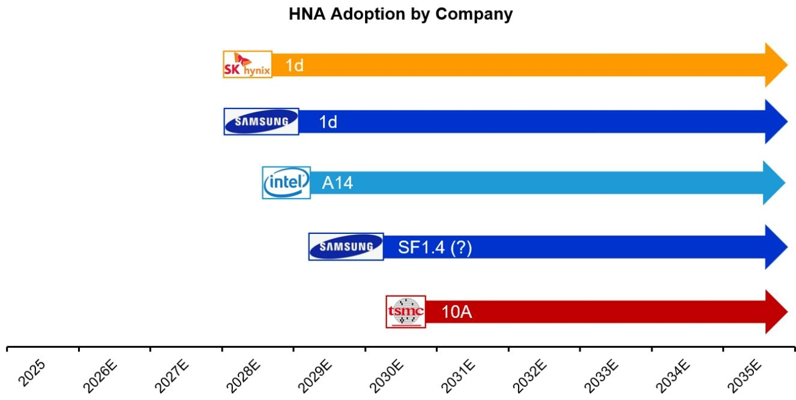  
来源：公司报告，Bernstein分析与预测

我们预计DRAM的光刻强度将增加，而逻辑芯片的光刻强度将保持高位。整体光刻强度将从24%上升至26%。

\- 我们估计光刻强度从1Y和1Z节点的约20%增加到1c节点的28%。这一显著增长是由EUV曝光次数的增加驱动的，从1a节点的3到4次曝光，增加到1b节点的4到6次，再到1c节点的6到7次。随着1c节点渗透率在未来几年预计将大幅提升，我们预计DRAM总光刻强度将显著增长。此外，随着1d节点引入双重曝光EUV或HNA，我们预计光刻强度将进一步上升至约30%（图表18）。

\- 类似地，逻辑芯片光刻强度从10nm节点的约20%显著增加，由EUV曝光次数的急剧上升驱动，在5nm和3nm节点达到超过35%的峰值。虽然逻辑芯片光刻强度从3nm下降到2nm，原因是采用GAA需要更多非光刻步骤，但仍保持在约32%的高位。我们预计在1.4nm节点采用HNA后，光刻强度将保持在相似水平或更高，并在1nm节点进一步增加（图表19）。

\- ASML的综合光刻强度正在增加，并预计将继续其上升趋势，这得益于DRAM和先进逻辑相对于整个半导体市场的更快增长。这两个细分市场的光刻强度都显著高于成熟逻辑和NAND，从而随着时间的推移支持结构性更高的综合光刻强度（图表20）。

图表18: 我们预计DRAM的光刻强度将增加。在1d节点引入双重曝光EUV（或HNA）预计将推动光刻强度达到约30%。

DRAM光刻强度  
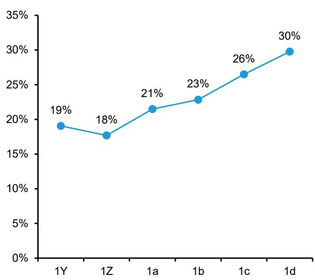  
来源：公司报告，Bernstein分析与预测  
图表19: 逻辑芯片光刻
