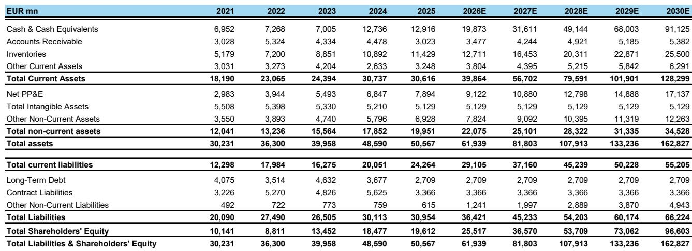
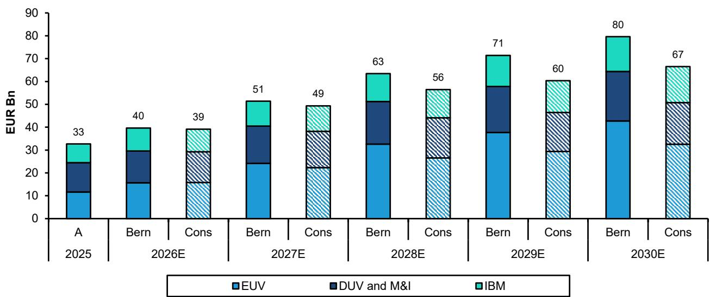

# High-NA EUV Adoption Will Reshape Semiconductor Lithography Faster Than the Market Expects — and ASML Is the Primary Beneficiary

The semiconductor industry stands at a critical inflection point where the economics of next-generation lithography are shifting beneath the feet of most observers. The prevailing narrative holds that High-NA EUV is too expensive, adoption will be delayed, and ASML's growth trajectory faces structural headwinds. This view is incomplete and increasingly risky for portfolio positioning.

A careful analysis of the cost structure, die-size dynamics, and adoption timelines reveals a fundamentally different story. High-NA EUV will enter volume production sooner than consensus expects, but the entry point will not be where most analysts are looking. The first wave of adoption will come from DRAM manufacturers, not logic foundries, because the economics are dramatically more favorable for smaller die sizes that avoid the throughput penalty of mask stitching.

The implications extend beyond ASML's revenue trajectory. Rising litho intensity — the share of total wafer fabrication costs attributable to lithography equipment — will accelerate as High-NA replaces complex multi-patterning schemes. This structural shift benefits ASML disproportionately and creates a multi-year earnings upgrade cycle that current valuations fail to discount.

This report unpacks the cost mechanics that drive this thesis, identifies where the market's assumptions are most vulnerable, and provides a decision framework for those navigating the transition.

## The Cost of High-NA EUV Is Not Uniform — Die Size Determines Adoption Economics, and DRAM Wins First

The most common observer mistake is treating High-NA EUV as a single technology with a single cost equation. In reality, the cost per exposure varies dramatically depending on whether the tool runs in single-mask mode or dual-mask stitching mode. This distinction is the key to understanding adoption timing.

High-NA EUV uses an anamorphic optical design with 4x reduction in one axis and 8x in the other. This produces a half-field exposure area — roughly 16.5 mm in one dimension instead of the standard 33 mm. For products with many small die, such as DRAM, this is not a problem. The scanner can expose twice as many half-fields using the same mask, achieving throughput of approximately 175 wafers per hour in single-mask mode.

For large logic die — the GPU and CPU designs that dominate headlines — the situation is fundamentally different. A single large die exceeds the half-field limit, requiring two separate masks and a stitching process to reconstruct the full pattern. This dual-mask approach reduces throughput to approximately 135 wafers per hour, a 23 percent penalty that directly increases cost per exposure.

The arithmetic is clear. In 2025, a High-NA exposure in single-mask mode costs roughly 2.4 times a Low-NA EUV exposure. In dual-mask stitching mode, that multiple rises to 3.1 times. For DRAM manufacturers, the cost premium is manageable and declining. For logic foundries producing reticle-scale die, the premium is prohibitive at current availability levels.

This cost asymmetry explains why DRAM will adopt High-NA first. Samsung and SK Hynix are likely to introduce High-NA in their 1d node around 2027, when Low-NA double patterning becomes necessary. At that point, High-NA's single-exposure capability actually simplifies the process flow, reducing the need for multiple etch and deposition steps that add cost and complexity.

The strategic implication is that observers should watch DRAM capex cycles, not just logic foundry announcements, for the earliest signals of High-NA adoption acceleration.

## Tool Availability Is Improving Faster Than the Market Recognizes, Driving a 23 Percent Cost Reduction by 2030

The second pillar of the bear case — that High-NA tools remain unreliable and therefore uneconomical — is based on outdated data. Current fleet availability stands at approximately 80 percent, which is typical for a new lithography platform at this stage of maturity. The relevant question is not where availability is today, but how quickly it is improving.

ASML's disclosed roadmap shows High-NA availability reaching 90 percent by late 2026, with a trajectory converging toward 95 percent over the subsequent three to four years. This pace of improvement is consistent with the maturity curve of previous generations. The Low-NA NXE platform followed a similar path, achieving 95 percent availability after approximately five years of production experience.

The cost impact of this improvement is substantial. Our analysis indicates that moving from 80 percent to 95 percent availability reduces the equipment cost per High-NA exposure by approximately 23 percent. This is not a speculative projection — it reflects the direct relationship between uptime and cost amortization.

Furthermore, throughput is improving concurrently. The current EXE:5200B achieves 175 wafers per hour in single-mask mode, up from 110 on the previous generation. The next-generation EXE:5200C targets 190 wafers per hour, and the roadmap extends beyond 210 wafers per hour by the end of the decade.

The combination of higher availability and faster throughput means that by 2030, the cost premium for High-NA over Low-NA will narrow to approximately 1.9x for single-mask applications and 2.1x for stitching. At these levels, the economic case for adoption becomes compelling even for logic manufacturers.

The market is underestimating the pace of this cost convergence because it extrapolates current tool performance linearly. The correct framework is an S-curve, where early learning rates are high and improvement accelerates before plateauing.

## Rising Litho Intensity Creates a Structural Revenue Growth Engine for ASML That Peers Cannot Match

The most underappreciated consequence of High-NA adoption is its impact on lithography intensity — the share of total wafer fabrication equipment spending allocated to lithography systems. When High-NA replaces Low-NA multi-patterning, it eliminates multiple etch, deposition, and cleaning steps that were required for complex double and triple patterning schemes.

This substitution effect is not new. The industry experienced a similar shift when Low-NA EUV replaced ArFi immersion multi-patterning. Lithography intensity increased from approximately 18 percent to 24 percent during that transition. The High-NA transition will produce a comparable, if not larger, effect.

Our analysis projects that DRAM lithography intensity will rise from approximately 20 percent at the 1z node to approximately 30 percent at the 1d node, driven by both an increase in EUV layer count and the adoption of High-NA. Logic lithography intensity will stabilize at roughly 32 percent through the N2 and A14 nodes, then begin rising again with High-NA adoption at A10.

The aggregate effect is that overall semiconductor lithography intensity will increase from 24 percent in 2025 to 26 percent by 2028, with further upside beyond. For ASML, this means that its addressable market is growing faster than overall wafer fabrication equipment spending.

This structural tailwind is distinct from the cyclical capex expansion driven by AI demand. It represents a permanent shift in the composition of semiconductor manufacturing costs, one that benefits ASML directly and durably.

## What the Report Does Not Fully Answer — Three Open Questions That Define the Risk and Opportunity

No analysis can resolve every uncertainty, and observers should be aware of the questions that remain open. First, the precise timing of TSMC's High-NA adoption is unclear. TSMC has publicly expressed skepticism about the technology's cost-effectiveness, and our analysis suggests adoption around 2030. However, TSMC's competitive position relative to Intel and Samsung may force an earlier transition if customers demand the density improvements that only High-NA can deliver.

Second, the impact of High-NA on ASML's pricing power over multiple generations is uncertain. As tool availability improves and competition from alternative patterning technologies evolves, ASML may face pressure on ASP growth. Our forecasts assume continued ASP expansion supported by throughput improvements, but this assumption deserves scrutiny as the technology matures.

Third, the potential for alternative lithography approaches — such as directed self-assembly or nanoimprint — to capture share in specific applications is not fully addressed. While these technologies face significant technical hurdles, the history of semiconductor manufacturing suggests that no company's competitive position is permanent.

These open questions do not undermine the thesis, but they define the range of outcomes that observers should consider when sizing positions.

## A Decision Framework for Those Navigating the High-NA Transition

For portfolio construction purposes, the High-NA transition creates three distinct opportunities, each with different risk-reward profiles.

The first is direct exposure to ASML, which offers the most leveraged play on rising litho intensity and EUV shipment growth. Our analysis projects EUV revenue growing at a 30 percent compound annual rate, reaching €42.7 billion by 2030 — more than 30 percent above street estimates. Combined with DUV revenue growth, we expect total ASML revenue to reach €80 billion by 2030, with earnings per share of €97.

The second opportunity is indirect exposure through DRAM manufacturers who adopt High-NA early. Samsung and SK Hynix stand to benefit from improved patterning economics and reduced process complexity, which should translate into better margin profiles relative to competitors who delay adoption.

The third opportunity is in the semiconductor equipment supply chain. Companies providing components and subsystems for High-NA tools will benefit from both the initial build-out and the ongoing upgrade cycle as ASML increases production capacity.

The key risk to monitor is the pace of TSMC's adoption. A faster-than-expected transition by the industry leader would accelerate the entire timeline and pull forward revenue. A slower transition would delay the inflection but not eliminate it, given the compelling economics for DRAM and Intel's stated commitment to early adoption.

## Join the Community to Read the Full Report and Review the Original Charts

The analysis presented here captures the strategic logic of High-NA adoption, but the full report contains detailed cost models, adoption timelines by node and manufacturer, and sensitivity analyses that are essential for precise portfolio positioning. The original charts provide granular data on throughput trajectories, availability curves, and cost convergence scenarios that cannot be fully conveyed in a summary format.

For those who want to move beyond the consensus narrative and build conviction around this thesis, the complete report is available to community members. Join the community to read the full report and review the original charts.

*For informational purposes only. Portions may be generated, translated, summarized, or edited with AI assistance based on source materials and may contain omissions or errors. Please verify independently. This is not professional advice.*

For informational purposes only. Portions may be generated, translated, summarized, or edited with AI assistance based on source materials and may contain omissions or errors. Please verify independently. This is not professional advice.

