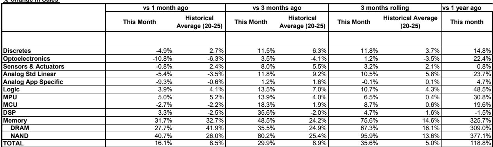
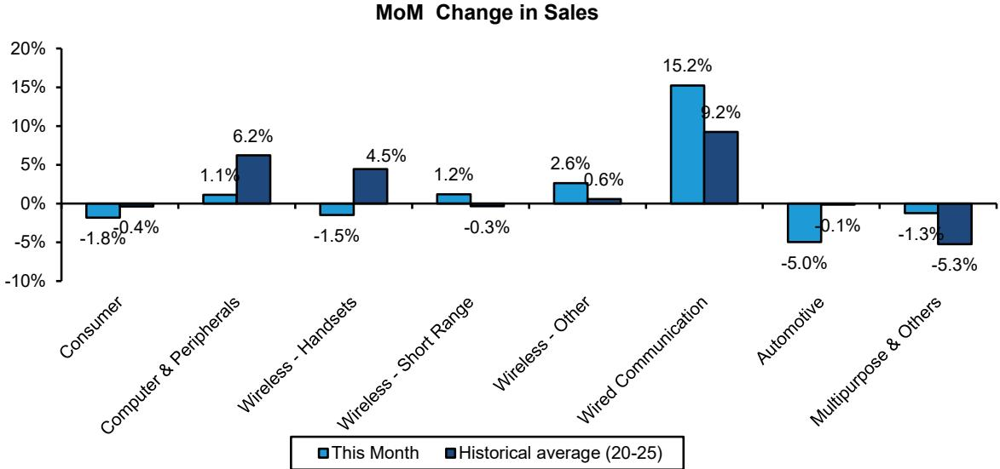
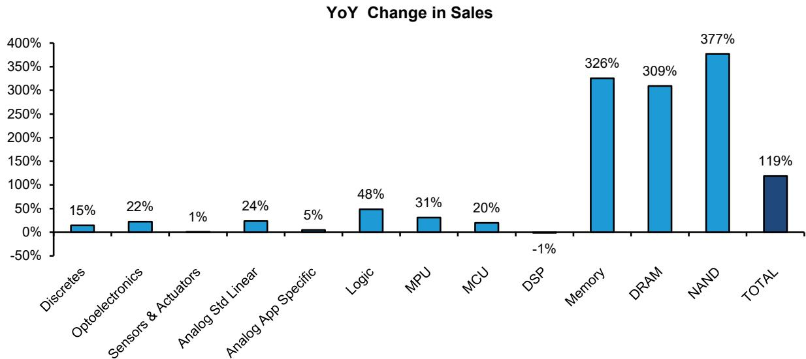

# 全球半导体销售数据观察：行业竞争格局正在重塑

全球半导体行业近期公布了近年来较为突出的月度销售数据。2026年5月，半导体总销售额同比增长118.8%，4月同比增长106.4%。这并非简单的周期性波动，而是需求结构、定价能力与竞争优势的重新调整，或将影响未来十年哪些公司占据主导地位。整体数字引人注目，但更值得关注的是其背后的细节：自年初以来，仅存储类产品就贡献了约三分之二的行业增长，而存储定价因素在今年迄今已带来约2000亿美元的增量收入。对于观察者和策略制定者而言，问题不在于这一趋势是否真实，而在于当前的估值框架是否充分反映了这些变化的持续性，抑或仍停留在过时的周期性模型上。

5月的数据明显打破了历史季节性模式。总销售额环比增长16.1%，几乎是5月历史平均增幅8.5%的两倍。这不是温和的加速，而是一种显著的推进。然而，增长的结构揭示了需要仔细解读的分化。芯片出货量环比实际下降2.7%，而平均销售价格却跃升19.3%。行业并非销售了更多芯片，而是销售了价格更高的产品。这一区别是理解当前市场估值中机会与风险的关键分析线索。

从战略角度看，当前时刻的重要性在于不同产品类别和终端市场之间的增长不对称性。存储类产品，尤其是NAND和DRAM，主导了叙事。但非存储类产品销售仍同比增长34%，这一数字在以往任何周期中都足以成为头条新闻。各细分领域表现优于或逊于季节性常态的分化，揭示了一个更微妙的图景：哪些需求是真实的，哪些可能来自对未来季度的透支。数据要求我们在下一次库存调整改写格局之前，建立一个能够区分结构性赢家与周期性受益者的分析框架。

## 存储成为行业重心，这改变了观察风险的方式

5月的WSTS数据揭示了一个不可回避的事实：存储已不仅仅是半导体行业的一个大板块，它已成为整体增长和盈利能力的主要驱动力。存储类产品销售同比增长325.7%，增幅超过四倍。具体来看，仅存储一项在2026年前五个月就创造了约2000亿美元的增量收入。整个非存储半导体行业，包括逻辑、模拟、分立器件、光电子、传感器和微组件，同比增长34%，虽然强劲但远低于存储的增幅。

这种增长集中于存储，为整个行业带来了新的风险特征。当一个单一产品类别占据约三分之二的行业扩张时，存储定价或需求的任何放缓，都将对半导体总收入、盈利和市场情绪产生不成比例的影响。当前周期由存储平均销售价格（ASP）的扩张驱动，而非出货量的增长。在ASP飙升的同时，出货量环比却在下降。这是一个定价周期，而非数量周期。定价周期本质上更脆弱，因为它依赖于少数生产商之间的供应纪律。

这对组合构建有直接影响：将半导体敞口视为对AI或计算需求的单一押注，会忽略当前数据中蕴含的结构性集中风险。一个未明确考虑存储对行业盈利不成比例权重的多元化半导体头寸，实际上并非真正的多元化。一个悬而未决的问题是，随着未来12至18个月内产能增加，存储生产商能否维持定价纪律。历史经验表明它们难以做到，但本轮周期已多次打破历史模式。

## 非存储增长真实存在，但掩盖了终端市场健康状况的分化

在存储类产品的头条数据之下，非存储半导体数据揭示了一个更复杂的图景，这应让任何假设需求全面强劲的人保持谨慎。非存储总销售额同比增长34%，客观上表现强劲。但与历史季节性相比的环比模式则讲述了不同的故事。几个关键产品类别的表现逊于其典型的5月模式：模拟专用电路环比下降9.3%，而典型降幅仅为0.6%；汽车半导体环比下降4.7%，而典型增幅为0.5%；无线通信环比下降3.2%，而典型增幅为1.5%。

这些并非随机偏差。它们指向了那些曾被视作结构性增长领域的终端市场出现真实疲软。长期以来被视为由电气化和高级驾驶辅助系统驱动的长期增长故事的汽车半导体需求，在行业整体强劲的时期却出现环比收缩。包括智能手机供应链在内的无线通信也在走弱。只有有线通信表现优于季节性模式，环比增长12.7%，而典型增幅为6.9%，这可能反映了数据中心和网络基础设施领域的持续投入。

战略要点在于，非存储半导体需求正在分化。数据中心和AI相关基础设施继续推动超常增长，而汽车、消费和无线等传统终端市场则显示出需求疲软的迹象。这不是一次同步复苏，而是一种需求集中，在产品层面与存储的动态相呼应。那些认为强劲的行业整体销售数据意味着终端市场全面健康的观察者，可能误读了数据。真正的问题是，汽车和无线领域的疲软是暂时的库存调整，还是这些领域更长期需求放缓的开始。

## 环比模式显示季节性规律正在被打破，有利于拥有定价权的现有企业

5月WSTS报告中最具启发性的数据并非受存储周期影响的同比增长率，而是与历史季节性平均值的环比比较。这种比较剥离了基数效应，揭示了每个产品类别的潜在动能。结果引人注目且具有战略意义。

NAND闪存环比增长40.7%，而典型增幅为26.0%，表现明显优于常态，表明存在供应限制或需求加速超出正常模式。数字信号处理器环比增长3.3%，而典型降幅为2.5%，是另一个明显的正向异常值。但另一主要存储类别DRAM仅环比增长27.7%，而典型增幅为41.9%，这意味着尽管同比增长数据巨大，但其实际表现逊于自身的历史季节性模式。这是一个关键细节。即使相对价格仍处高位，DRAM的定价动能相对于其季节性常态可能正在放缓。

表现不佳的名单更长且更令人担忧。分立器件环比下降4.9%，而典型增幅为2.7%。光电子环比下降10.8%，而典型降幅为6.3%，意味着下降幅度比正常情况更严重。传感器和执行器环比下降0.8%，而典型增幅为2.4%。模拟标准线性环比下降5.4%，而典型降幅为3.5%。模拟专用环比下降9.3%，而典型降幅为0.6%。这些并非季节性调整，而是服务于广泛工业和消费终端市场的类别出现了需求恶化。

模式清晰：定价权和需求动能正集中在存储和面向数据中心的逻辑产品上，而传统的模拟、分立器件和传感器类别正在走弱。涉足后者的公司面临比整体行业数据所显示的更具挑战性的需求环境。对于战略性观察者而言，这意味着在半导体领域内的个股选择比过去几年任何时候都更为重要。水涨船高并非对所有船只都一视同仁，有些船只正在进水。

## 报告留下一个关键分析缺口：当前需求有多少是真实的，又有多少是提前透支的

尽管数据详尽，但5月WSTS报告并未回答当前半导体观察者面临的最重要的战略问题：当前需求激增中有多少是终端消费，又有多少是库存建立？数据显示的是进入分销渠道的销售情况，而非最终用户的最终消费。当出货量下降而ASP上升时，这引发了行业可能正在将更高价格的产品销售到某些细分领域可能已经饱和的渠道中的可能性。

这并非理论上的担忧。汽车和无线半导体在环比数据上的表现不佳，可能反映了原始设备制造商（OEM）在早期供应限制期间建立过多库存后正在进行的去库存。存储的强劲可能反映了超大规模企业在预期产能增加之前提前进行的采购。数据并未区分这些情景，而这一区别对于预测周期轨迹至关重要。

观察者需要一个能够区分由AI基础设施和数据中心建设驱动的结构性需求与由库存补充和价格投机驱动的周期性需求的分析框架。当前报告提供了进行这种分析的原始材料，但并未完成分析。悬而未决的问题是，存储定价周期在相对意义上是否已见顶，以及非存储领域的疲软在改善之前是否会进一步加深。这些问题将决定当前估值是否合理，或者市场是否正在定价一种尚未存在的需求的持久性。

## 2026年中期的半导体周期决策框架

鉴于数据及其模糊性，观察者需要一种结构化的决策方法，既要考虑当前周期的显著强势，也要考虑新出现的分化和潜在脆弱性信号。以下框架旨在将5月WSTS数据转化为可操作的策略选择。

第一，将存储敞口视为风险因素，而不仅仅是回报驱动因素。存储收入敞口较大的公司已从定价周期中获益良多，但其盈利现在对存储ASP的任何放缓都更为敏感。DRAM相对于季节性常态的表现不佳是一个警示信号。观察者应针对DRAM定价增长放缓至历史季节性模式或以下的情景，对其重仓存储的头寸进行压力测试。

第二，评估非存储组合的终端市场集中度。对汽车、无线和消费终端市场敞口较大的公司，其环比表现弱于季节性常态。这尚未构成危机，但这是一个值得密切关注的趋势。对有线通信和数据中心基础设施敞口较大的公司则处于更有利的位置。这些终端市场之间的分化在收窄之前可能会进一步扩大。

第三，区分由定价驱动和由出货量驱动的收入增长。出货量下降而ASP飙升的事实意味着，当前大部分收入增长来自定价，而非数量。由定价驱动的增长本质上可持续性较低，因为它依赖于少数生产商之间的供应纪律。相比之下，由数量驱动的增长反映了真实的终端用户需求扩张。观察者应倾向于收入增长得到出货量增加支持的公司，而不仅仅是价格上涨。

第四，关注未来几个月的库存数据。5月报告未提供渠道库存数据，但后续报告将会提供。如果库存水平开始上升，同时环比销售增长放缓，这将表明渠道正在饱和。这将是周期见顶的领先指标。如果库存保持低位而销售继续增长，则周期还有进一步发展的空间。

## 本轮周期的下一阶段将取决于哪些公司能在没有数量增长的情况下维持定价权

本分析所依据的完整报告包含详细的产品级数据、地区细分以及全面的公司列表，并附有本文讨论的季节性比较和同比增长趋势的原始图表。对于希望深入了解具体公司影响及评级背后专有分析框架的观察者，原始材料至关重要。

加入社区阅读完整报告并查看原始图表。

*仅供参考。部分内容可能基于源材料通过AI辅助生成、翻译、总结或编辑，可能存在遗漏或错误。请独立核实。本文不构成任何专业建议。*

仅供参考。部分内容可能基于源材料通过AI辅助生成、翻译、总结或编辑，可能存在遗漏或错误。请独立核实。本文不构成任何专业建议。

