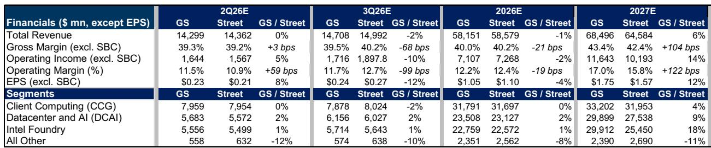
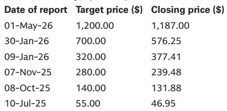
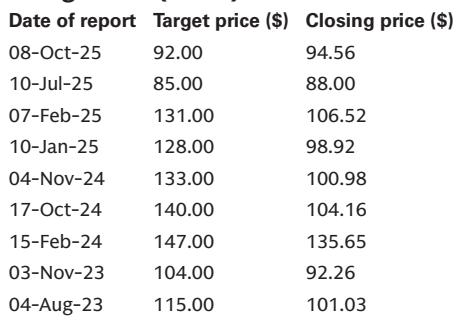

# GS：云厂商支出持续向上，服务器CPU和ASIC成最大受益者

这份GS在2026年7月发布的半导体行业二季报预览，传递了一个清晰但微妙的信号：大部分细分赛道的业绩和指引都会好于市场预期，但板块在二季度已经跑赢标普500指数88个百分点，这个涨幅本身就让财报季的交易环境变得更复杂。报告的核心判断不是“买什么”，而是“在什么位置关注、关注什么类型的公司”。

GS覆盖的半导体子板块——计算、存储、设备、模拟——几乎全线存在上调预期的空间。但报告真正值得关注的，是它如何在“普遍看多”的共识中，通过不确定性回报框架区分出哪些公司仍有上行空间，哪些已经提前定价。这不是一份简单的乐观清单，而是一张需要结合持仓成本来读的战术地图。

> **KC评论：** 这份报告最有价值的不是“哪些公司会超预期”，而是“超预期之后报价还能不能涨”。GS用不确定性回报而非单纯的基本面强弱来排序，对机构读者来说，这比盈利预测本身更关键。完整报告里对每家公司的假设拆解和情景分析，值得仔细对比当前报价。

## 1. 计算与设备：上修空间最大，但交易难度也最高

GS对超大规模云厂商资本支出的判断是“持续向上”，这直接支撑了服务器CPU和定制ASIC两大方向的业绩上修。AMD是这一逻辑的典型代表：GS预计其数据中心收入在2027年将达到667亿美元，较市场共识高出18%，EPS预期也高出13%。但AMD报价在二季度已经大幅跑赢，报告真正想说的是：如果7月23日的Advancing AI活动不能提供MI450量产的具体客户和时间表，报价的进一步上涨就需要新的催化剂。

设备端的逻辑类似。GS看好应用材料（AMAT），认为DRAM研究强度将带来2026年最好的增长，且2028年之前的可见度很高。但同期对科磊（KLAC）却持更谨慎的态度——因为WFE支出正转向DRAM，而DRAM环节的检测与量测强度低于逻辑芯片。同样的行业趋势，落到不同公司的产品组合上，结论截然不同。

> **KC评论：** 设备股的分化是这份报告最值得细读的部分之一。GS没有笼统地说“设备受益于扩产”，而是拆出了DRAM vs. 逻辑的结构性差异。对持有或关注设备板块的读者，完整报告里关于各公司WFE敞口的表格，是判断相对强弱的核心依据。

## 2. 存储与模拟：基本面改善确定，但市场定价已趋于充分

存储板块的基本面改善最为清晰。HDD和NAND在GS看来优于DRAM，核心原因是“缺乏新增供应的边际增量”——供给约束意味着定价权更稳固。希捷（STX）被列为关注，逻辑是HDD定价和利润率的上行空间仍是关键变量。

模拟芯片方面，GS认为整个板块的盈利预测都有上修空间，但优先选择那些工业、航空航天与国防、数据中心敞口最大的公司。安森美（ON）被列为中性，但报告认为其不确定性回报在财报前相对有利——因为市场对其收购后的预期已经有所下修，实际业绩反而可能带来惊喜。

## 3. 报告尚未完全回答的关键问题：AI支出的可持续性与供给瓶颈

尽管GS对多数子板块给出了正面判断，但报告中有两个问题没有完全展开。第一，AI相关资本支出的可持续性。报告假设“超大规模云厂商的资本支出持续上行”，但这个假设本身依赖于AI应用的商业回报能否在2027年前后得到验证。第二，ARM面临的供给瓶颈。ARM的AGI CPU业务需求明确，但管理层的指引显示，约10亿美元的增量需求受制于供应链。GS对ARM给出公司观点，核心担忧正是“供给约束限制了收入上行，而市场预期已经过高”。

这两个问题本质上指向同一个矛盾：需求端的故事很清晰，但供给端的兑现节奏和成本结构，还没有被市场充分定价。

## 4. 一个值得跟踪的观察框架：从“超预期”到“定价充分”的转换

对读者来说，这份报告提供了一个可操作的观察框架。不是所有超预期的财报都会带来报价上涨。GS的做法是：先判断基本面是否有上修空间，再判断当前报价是否已经反映了这些上修。只有当“上修空间”大于“已定价程度”时，财报才可能成为正向催化剂。

AMD和应用材料属于前者——上修空间大，市场尚未完全定价。ARM和科磊属于后者——基本面不差，但报价已经跑得太远。这个框架在AI研究从“讲故事”转向“兑现期”的阶段，尤其值得反复使用。

---

完整报告包含GS对每家公司2Q/3Q的详细预测、与市场共识的逐项对比、以及每只公司的核心不确定性与催化剂。中文摘要、KC评论和图表合集，会放进当天的国际信源汇编中，适合快速对照当前报价和持仓。

For informational purposes only. Portions may be generated,translated,summarized,or edited with AI assistance based on source materials and may contain omissions or errors. Please verify independently. This is not investment,legal,tax,accounting,or other professional advice.

For informational purposes only. Portions may be generated,translated,summarized,or edited with AI assistance based on source materials and may contain omissions or errors. Please verify independently. This is not investment,legal,tax,accounting,or other professional advice.

