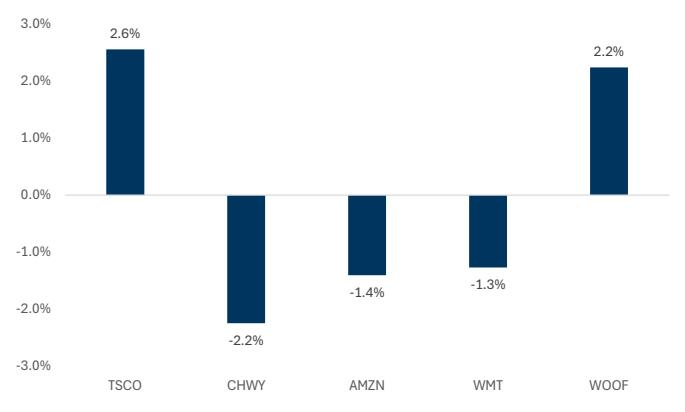
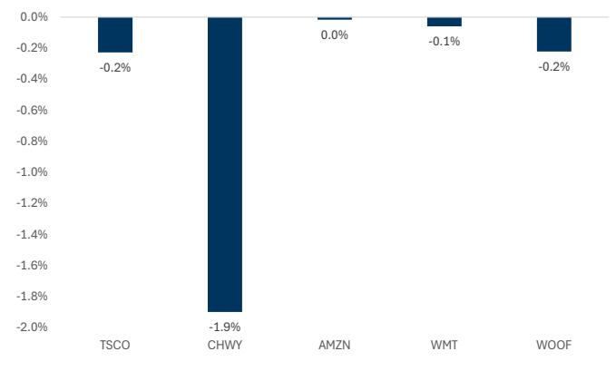
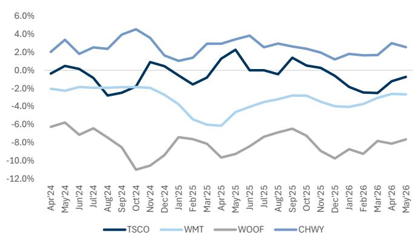
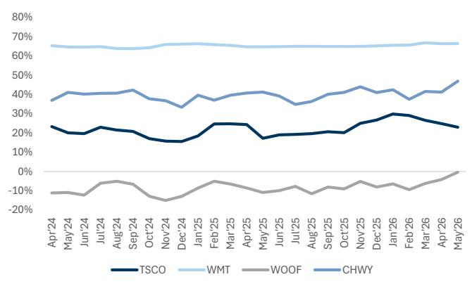
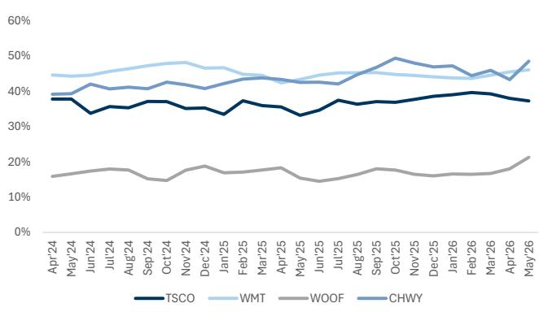
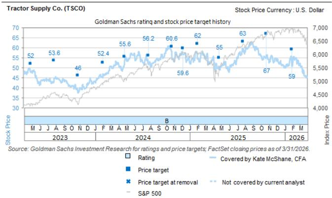
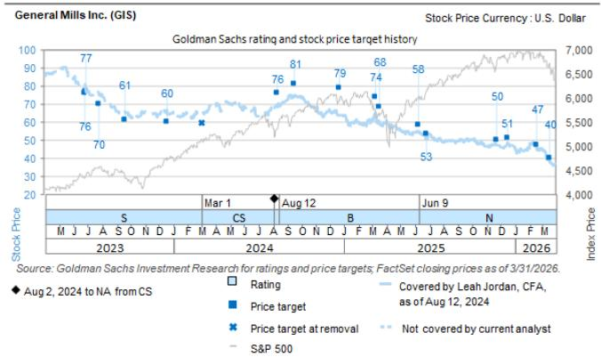

# Americas Retail: Analyzing Tractor Supply's competitive positioning in Pet; Prices remain higher than the average but assortment is improving

Given the company's recent performance and industry observations around the pet space, we continue to monitor pricing and product variety analysis across the pet category. We highlight our recent note analyzing these dynamics on 6/8, linked here.

Since our last note, we observe that overall pricing trended slightly lower for all retailers except Amazon, which was roughly flat vs. the June analysis. However, we note that product variety counts for Tractor Supply have increased for cat food and treats relative to the prior month, while they decreased for cat toys, dog food, dog treats, and dog toys. Further, our Hundredx analysis suggests a similar trend as our last publication in June, wherein Tractor Supply ranks above Petco but falls below its peers (Walmart and Chewy) in terms of price and value perception. We note Tractor Supply is actively addressing its assortment; however, management guides that we will likely not see an improvement until the second half of 2026, and the pet space remains highly competitive. Additionally, in this note, we preview Tractor Supply's upcoming quarterly results and highlight commentary from General Mills on the pet industry. (Please see within).

We have maintained our positive view on the name given the current pricing environment appears to reflect this more intense competitive landscape and also conditions from a drought that may be influencing near-term results. We would become more cautious if we didn't see the company's changes in the pet category result in any improvement.

## Pricing analysis

Our most recent pricing survey (7/1/26) suggests Tractor Supply's overall prices remain above the competitive set average. We updated our pet pricing survey, which analyzes prices across 20 pet products (10 dog products and 10 cat products), comparing prices between Tractor Supply and four competitors, including mass retailers (Amazon and Walmart) and pet-specialty stores Petco and Chewy (covered by Eric Sheridan). Tractor Supply maintained a competitive edge in its dog category for the last two months; however, in July, the prices for the 10 dog products analyzed trended above most of the peer average (at -0.2% vs. -2.4% for Chewy, -1.1% for Walmart, -0.7% for Amazon, and +5.3% for Petco). Additionally, we note higher prices in the cat category, with Tractor Supply's cat product pricing above the competitive set at +5.3% (vs. -0.8% for Petco, -1.4% for Walmart, -2.0% for Chewy, and -2.2% for Amazon), contributing to an overall price position that sits above the peer average.

Comparing our recent pricing survey to the June pricing study, we observe that overall pricing trended slightly lower for all retailers except Amazon, which was roughly flat vs. the June analysis. We note that Chewy saw the highest pricing gap in July vs. a month prior.

Exhibit 1: Tractor Supply overall price position sits above the peer average Prices as on 7/1/26

<table><tr><td></td><td colspan="6">Pricing study as of 7/1/26</td><td colspan="5"></td></tr><tr><td>Pricing study of pet products</td><td>TSCO</td><td>CHWY</td><td>AMZN</td><td>WMT</td><td>WOOF</td><td>Average</td><td>TSCO</td><td>CHWY</td><td>AMZN</td><td>WMT</td><td>WOOF</td></tr><tr><td>Dog products</td><td></td><td></td><td></td><td></td><td></td><td></td><td></td><td></td><td></td><td></td><td></td></tr><tr><td>Blue Buffalo Blue Wilderness Trail Treats Salmon Biscuits Dog Treats, 10 oz.</td><td>$6.99</td><td>$6.98</td><td>$6.98</td><td>$6.98</td><td>$6.98</td><td>$6.98</td><td>0.1%</td><td>0.0%</td><td>0.0%</td><td>0.0%</td><td>0.0%</td></tr><tr><td>Merrick Fresh Kisses Double-Brush Mint Breath Strip Large, 16 count</td><td>$29.99</td><td>$29.98</td><td>$28.90</td><td>NA</td><td>$29.99</td><td>$29.72</td><td>0.9%</td><td>0.9%</td><td>-2.7%</td><td>NA</td><td>0.9%</td></tr><tr><td>Dogswell Hip &amp; Joint Soft Strips Grain-Free Chicken for Dogs, 12 oz.</td><td>$21.99</td><td>$17.99</td><td>NA</td><td>NA</td><td>$26.99</td><td>$22.32</td><td>-1.5%</td><td>-19.4%</td><td>NA</td><td>NA</td><td>20.9%</td></tr><tr><td>Purina Pro Plan Adult Sensitive Skin+Stomach Lamb and Oatmeal Formula Dry Dog Food, 24-lb</td><td>$77.99</td><td>$77.48</td><td>$77.48</td><td>$77.48</td><td>$77.48</td><td>$77.58</td><td>0.5%</td><td>-0.1%</td><td>-0.1%</td><td>-0.1%</td><td>-0.1%</td></tr><tr><td>Hill&#x27;s Science Diet Adult Sensitive Stomach+Skin Chicken Recipe Dry Dog Food, 30-lb</td><td>$89.99</td><td>$89.99</td><td>$89.99</td><td>$89.99</td><td>$104.99</td><td>$92.99</td><td>-3.2%</td><td>-3.2%</td><td>-3.2%</td><td>-3.2%</td><td>12.9%</td></tr><tr><td>Taste of the Wild High Prairie Grain-Free Dry Dog Food, 28-lb</td><td>$58.99</td><td>$58.99</td><td>$58.99</td><td>NA</td><td>$58.99</td><td>$58.99</td><td>0.0%</td><td>0.0%</td><td>0.0%</td><td>NA</td><td>0.0%</td></tr><tr><td>Gentle Giants with Real Beef and Real Bacon Dry Dog Food, 24-lb. bag</td><td>$50.99</td><td>$43.99</td><td>$49.99</td><td>NA</td><td>$49.99</td><td>$48.74</td><td>4.6%</td><td>-9.7%</td><td>2.6%</td><td>NA</td><td>2.6%</td></tr><tr><td>Benebone Bacon Flavor Wishbone Tough Dog Chew Toy, Large</td><td>$19.99</td><td>$19.43</td><td>$19.43</td><td>$19.43</td><td>NA</td><td>$19.57</td><td>2.1%</td><td>-0.7%</td><td>-0.7%</td><td>-0.7%</td><td>NA</td></tr><tr><td>Purina Dog Chow Complete Adult Chicken Formula Dry Dog Food Kibble, 32lb</td><td>$24.99</td><td>$26.99</td><td>NA</td><td>Out</td><td>NA</td><td>$25.99</td><td>-3.8%</td><td>3.8%</td><td>NA</td><td>NA</td><td>NA</td></tr><tr><td>Dog Chow Complete Adult with Real Chicken Dry Dog Food, 44-lb bag</td><td>$28.88</td><td>$30.49</td><td>$28.88</td><td>$28.88</td><td>NA</td><td>$29.28</td><td>-1.4%</td><td>4.1%</td><td>-1.4%</td><td>-1.4%</td><td>NA</td></tr><tr><td>Simple average for dog products</td><td></td><td></td><td></td><td></td><td></td><td></td><td>-0.2%</td><td>-2.4%</td><td>-0.7%</td><td>-1.1%</td><td>5.3%</td></tr><tr><td>Cat products</td><td></td><td></td><td></td><td></td><td></td><td></td><td></td><td></td><td></td><td></td><td></td></tr><tr><td>Fancy Feast Gourmet Naturals Pate Variety Pack Canned Cat Food, 3 oz. 12-count</td><td>$14.99</td><td>$14.69</td><td>NA</td><td>$15.53</td><td>$14.69</td><td>$14.98</td><td>0.1%</td><td>-1.9%</td><td>NA</td><td>3.7%</td><td>-1.9%</td></tr><tr><td>Royal Canin Feline Health Nutrition Thin Slices in Gravy Wet Kitten Food, 3 oz. 12-count</td><td>$27.99</td><td>$27.49</td><td>$27.49</td><td>NA</td><td>NA</td><td>$27.66</td><td>1.2%</td><td>-0.6%</td><td>-0.6%</td><td>NA</td><td>NA</td></tr><tr><td>Temptations Tasty Chicken Flavor Cat Treats, 16 oz. tub</td><td>$9.49</td><td>$7.49</td><td>$7.49</td><td>$8.48</td><td>$8.48</td><td>$8.29</td><td>14.5%</td><td>-9.6%</td><td>-9.6%</td><td>2.3%</td><td>2.3%</td></tr><tr><td>Greenies Feline Tempting Tuna Flavor Adult Dental Cat Treats, 4.6 oz.</td><td>$6.99</td><td>$5.48</td><td>$5.41</td><td>$5.41</td><td>$5.41</td><td>$5.74</td><td>21.8%</td><td>-4.5%</td><td>-5.7%</td><td>-5.7%</td><td>-5.7%</td></tr><tr><td>Hill&#x27;s Science Diet Adult Indoor/Outdoor Sensitive Stomach and Skin Chicken and Rice Recipe Dry Cat Food, 15.5lb</td><td>$67.99</td><td>$67.99</td><td>$67.99</td><td>$67.99</td><td>$67.99</td><td>$67.99</td><td>0.0%</td><td>0.0%</td><td>0.0%</td><td>0.0%</td><td>0.0%</td></tr><tr><td>Purina Cat Chow Naturals Chicken &amp; Salmon Original Dry Cat Food, 18lb</td><td>$25.79</td><td>$25.79</td><td>$26.40</td><td>$25.78</td><td>NA</td><td>$25.94</td><td>-0.6%</td><td>-0.6%</td><td>1.8%</td><td>-0.6%</td><td>NA</td></tr><tr><td>Temptations Adult Indoor/Outdoor Tasty Chicken Recipe Dry Cat Food, 20lb</td><td>$20.99</td><td>$20.97</td><td>NA</td><td>$20.97</td><td>NA</td><td>$20.98</td><td>0.1%</td><td>0.0%</td><td>NA</td><td>0.0%</td><td>NA</td></tr><tr><td>Purina Friskies Party Mix Chicken Flavor Crunchy Cat Treats, 30 oz.</td><td>$15.99</td><td>$13.45</td><td>$13.39</td><td>$12.44</td><td>$12.49</td><td>$13.55</td><td>18.0%</td><td>-0.8%</td><td>-1.2%</td><td>-8.2%</td><td>-7.8%</td></tr><tr><td>Taste of the Wild Rocky Mountain Roasted Venison &amp; Smoke-Flavored Salmon Grain-Free Dry Cat Food, 14-lb bag</td><td>$39.99</td><td>$39.99</td><td>$39.99</td><td>NA</td><td>$39.99</td><td>$39.99</td><td>0.0%</td><td>0.0%</td><td>0.0%</td><td>NA</td><td>0.0%</td></tr><tr><td>Meow Mix Original Choice Cat Food, 30lb</td><td>$29.99</td><td>$29.97</td><td>NA</td><td>$29.97</td><td>$32.99</td><td>$30.73</td><td>-2.4%</td><td>-2.5%</td><td>NA</td><td>-2.5%</td><td>7.4%</td></tr><tr><td>Simple average for cat products</td><td></td><td></td><td></td><td></td><td></td><td></td><td>5.3%</td><td>-2.0%</td><td>-2.2%</td><td>-1.4%</td><td>-0.8%</td></tr><tr><td>Simple average overall</td><td></td><td></td><td></td><td></td><td></td><td></td><td>2.6%</td><td>-2.2%</td><td>-1.4%</td><td>-1.3%</td><td>2.2%</td></tr></table>

Source: Company data, GS Global Investment Research

Exhibit 2: Prices at Tractor Supply tracked 2.6% higher than the group average (on a simple average basis)
Pricing survey results from 7/1/26  
  
Source: GS Global Investment Research

Exhibit 3: Overall pricing trended slightly lower for all the retailers vs. June's analysis; Chewy saw the highest dip in pricing vs. last month  
  
Source: GS Global Investment Research

## Product variety analysis

Our analysis of product variety counts across the dog and cat food, treats, and toys categories reveals a notable difference for Tractor Supply relative to its primary competitors: Chewy, Amazon, Walmart, and Petco. Tractor Supply maintains the lowest product variety count in cat food, cat treats, and cat toys vs. peers. However, we observe that product variety counts for Tractor Supply have increased for cat food and treats relative to the prior month, while they decreased for cat toys, dog food, dog treats, and dog toys.

AMZN and WMT product variety count is an approximate figure derived from the website and both AMZN and WMT product varieties include first-party and third-party products.

Source: Company data, GS Global Investment Research

Exhibit 6: We observe that product variety counts for Tractor Supply have increased for cat food and treats  
% change in product variety count vs. June's product variety count

<table><tr><td>Product variety % change</td><td>Jun vs. Apr</td><td>Jul vs. Apr</td></tr><tr><td>Dog food</td><td>7.1%</td><td>6.2%</td></tr><tr><td>Dog treats</td><td>4.8%</td><td>3.0%</td></tr><tr><td>Dog toys</td><td>2.2%</td><td>0.0%</td></tr><tr><td>Cat food</td><td>3.4%</td><td>5.7%</td></tr><tr><td>Cat treats</td><td>13.6%</td><td>17.0%</td></tr><tr><td>Cat toys</td><td>3.0%</td><td>0.6%</td></tr></table>

Source: GS Global Investment Research

## Insights from Hundredx

We supplement our survey work with data from HundredX, a mission-based data and insights company that takes an innovative approach to monitoring consumer perceptions and gathering consumer feedback to understand trends across 80+ industries and 3,000+ brands. HundredX analyzes collective opinions of everyday customers and evaluates how their priorities influence purchasing decisions and attitudes toward businesses and brands.

Exhibit 7: The Net Purchase Intent for Tractor Supply has improved recently, similar to Petco
T3M through May'26  
  
Source: Hundredx

## Customers' views across key KPIs

The charts below analyze customers' views among Tractor Supply, Walmart, Petco, and Chewy across key KPIs including price and value. Tractor Supply has always tracked below Walmart and Chewy on price perception; however, we would note that the gap, which had narrowed for a few months, is now widening again between Tractor Supply and Chewy. When analyzing value perception, Tractor Supply is still behind that of Chewy and Walmart, with the gap widening slightly between the top two (Chewy and Walmart) and Tractor Supply.

Exhibit 8: Price perception trends have stayed relatively consistent between the four retailers, with Tractor Supply's price perception narrowing for a few months earlier this year but widening against Chewy and Walmart more recently
T3M through May'26  
  
Source: Hundredx

Exhibit 9: Value perception trends have widened recently between Tractor Supply and the top two, Walmart and Chewy
T3M through May'26  
  
Source: Hundredx

## Tractor Supply 2Q26 preview

On the company's Q1 call, management reiterated FY26 guidance (1% to 3% comparable sales range), but anticipated companion animal will remain under modest pressure, likely finishing the year at roughly flat to slightly negative same-store sales. Management noted that Q1 typically represents a seasonal over-index for pet (by approximately 5 points), suggesting the headwind might moderate in Q2 and expects a gradual recovery as new assortment initiatives take hold in the second half of the year. We adjusted our estimates for Q2 on 6/22, based on incremental demand factors from a severe drought and still think consensus estimates may be too high (we estimate 2Q same-store sales at +0.5% vs. LSEG Data & Analytics consensus at +1.1%) due to conditions in their pet category, as well as current drought conditions. Our FY26/27/28 EPS estimate is at $2.10/$2.32/$2.57, respectively (vs. consensus at $2.12/$2.30/$2.58, respectively), remains unchanged. However, we think there could be risk to the company adjusting the EPS guidance range both for comparable sales and EPS ($2.13-$2.23), given drought conditions which may persist into Q3 and any kind of margin considerations that could result if Tractor Supply has to become more promotional with their pet offering.

## General Mills read through

General Mills Inc. (GIS; Covered by Leah Jordan): Reported F4Q26 results (for the three months ended May 31, 2026) on July 1st, 2026.

F4Q26 results: In F4Q, organic sales for Pet decreased -3% (in line with last quarter), which lagged retail sales by approximately 2 points due to changes in retailer inventory and unfavorable customer mix, with volumes down -6% in the quarter while price/mix tracked at +3%. Segment operating profit grew +14%, driven by favorable net price realization and mix, and lower input costs, despite a double-digit increase in media investment.

Industry trends: Management noted that the pet category continues to experience slower volume growth as consumers remain cautious. However, the segment held dollar share in dog feeding and cat feeding, which represent approximately 80% of its retail sales. By product type, cat food net sales grew double digits, dog food grew low-single digits, and pet treats declined low-single digits.

- Consumer trends: Consumers are increasingly seeking value, buying more on promotion and less at everyday prices, which has driven a less profitable mix of volume. Despite these factors, the company saw positive momentum in premium offerings, with Blue Buffalo's Love Made Fresh, fresh pet food accelerating, supported by expanded distribution. However, dog food, particularly the Wilderness brand, remained a consideration, and the company is taking corrective actions on Wilderness.

FY27 outlook: For FY27, General Mills expects pet category growth to remain consistent with FY26 levels and below its long-term historical growth rate, reflecting a continued evolving consumer environment. The company plans to drive growth through product innovation focused on pet humanization trends.

Implications: We view GIS's pet segment results as a mixed read-through for the pet industry. While the 14% operating profit growth and double-digit gains in cat food highlight pockets of resilience and strong execution, the 3% decline in organic net sales underscore persistent volume considerations and a highly promotional, value-conscious consumer environment.

## Valuation & Risks

## TSCO

We maintain a positive view on TSCO. Our 12-month price target is at $43 based on our downside/base/upside case relative P/E multiples of 80%/85%/90% (unchanged).

Downside risks include an unexpected change in demand; higher-than-expected investment spend and cost deleverage as the company builds out its new strategic initiatives; execution issues, including delays in opening Side Lots and completing remodels; higher distribution and transportation costs leading to margin considerations; greater-than-expected pressure from e-commerce; and acquisition integration and execution challenges.

## GIS

We maintain a neutral view on GIS. Our 12-month price target to $35 is based on our risk-reward framework with a 50/50 blend of target P/E with downside/base/upside cases of 10x/11x/12x and target EV/EBITDA with downside/base/upside cases of 9.5x/10x/10.5.

Key upside risks include an improvement in economic activity which could result in greater-than-expected consumer spending, resulting in higher demand; consumer shifts toward food-at-home; better-than-expected share improvements in its categories; greater-than-expected engagement with its innovation efforts; better-than-expected promotional environment; higher-than-expected cost savings; and lower input cost inflation across commodities, labor, and/or transportation.

Key downside risks include a change in economic activity which could lead to a reduction of consumer spending, resulting in lower demand and/or potential trade-down to lower priced products (e.g., private label); consumer shifts away from food-at-home; incremental promotional pressure across the industry which could limit top line growth and influence margins; low consumer receptivity to innovation efforts which could lead to market share changes and/or incremental marketing spending; lower-than-expected execution on its cost savings efforts; and higher input cost inflation across commodities, labor, and/or transportation which could influence margins if the company is not able to pass along through various pricing actions.

## Disclosure Appendix

## Reg AC

We, Kate McShane, CFA, Nishi Agarwal, Mark Jordan, CFA, Emily Ghosh and Grace Chee, hereby certify that all of the views expressed in this report accurately reflect our personal views about the subject company or companies and its or their securities. We also certify that no part of our compensation was, is or will be, directly or indirectly, related to the specific recommendations or views expressed in this report.

Unless otherwise stated, the individuals listed on the cover page of this report are analysts in GS' Global Investment Research division.

Contributing Authors: Kate McShane, CFA GS & Co. LLC, Nishi Agarwal GS India SPL, Mark Jordan, CFA GS & Co. LLC, Emily Ghosh GS & Co. LLC, Grace Chee GS & Co. LLC.

Unless otherwise stated, the individuals listed in the Contributing Authors disclosure of this report are analysts in GS' Global Investment Research division.

## GS Factor Profile

The GS Factor Profile provides investment context for a stock by comparing key attributes to the market (i.e. our universe of rated stocks) and its sector peers. The four key attributes depicted are: Growth, Financial Returns, Multiple (e.g. valuation) and Integrated (a composite of Growth, Financial Returns and Multiple). Growth, Financial Returns and Multiple are calculated by using normalized ranks for specific metrics for each stock. The normalized ranks for the metrics are then averaged and converted into percentiles for the relevant attribute. The precise calculation of each metric may vary depending on the fiscal year, industry and region, but the standard approach is as follows:

Growth is based on a stock's forward-looking sales growth, EBITDA growth and EPS growth (for financial stocks, only EPS and sales growth), with a higher percentile indicating a higher growth company. Financial Returns is based on a stock's forward-looking ROE, ROCE and CROCI (for financial stocks, only ROE), with a higher percentile indicating a company with higher financial returns. Multiple is based on a stock's forward-looking P/E, P/B, price/dividend (P/D), EV/EBITDA, EV/FCF and EV/Debt Adjusted Cash Flow (DACF) (for financial stocks, only P/E, P/B and P/D), with a higher percentile indicating a stock trading at a higher multiple. The Integrated percentile is calculated as the average of the Growth percentile, Financial Returns percentile and (100% - Multiple percentile).

Financial Returns and Multiple use the GS analyst forecasts at the fiscal year-end at least three quarters in the future. Growth uses inputs for the fiscal year at least seven quarters in the future compared with the year at least three quarters in the future (on a per-share basis for all metrics).

For a more detailed description of how we calculate the GS Factor Profile, please contact your GS representative.

## M&A Rank

Across our global coverage, we examine stocks using an M&A framework, considering both qualitative factors and quantitative factors (which may vary across sectors and regions) to incorporate the potential that certain companies could be acquired. We then assign a M&A rank as a means of scoring companies under our rated coverage from 1 to 3, with 1 representing high (30%-50%) probability of the company becoming an acquisition target, 2 representing medium (15%-30%) probability and 3 representing low (0%-15%) probability. For companies ranked 1 or 2, in line with our standard departmental guidelines we incorporate an M&A component into our target price. M&A rank of 3 is considered immaterial and therefore does not factor into our price target, and may or may not be discussed in research.

## Quantum

Quantum is GS' proprietary database providing access to detailed financial statement histories, forecasts and ratios. It can be used for in-depth analysis of a single company, or to make comparisons between companies in different sectors and markets.

## Disclosures

## Rating and pricing information

General Mills Inc. (Neutral, $37.57) and Tractor Supply Co. (Buy, $31.76)

The rating(s) for General Mills Inc. is/are relative to the other companies in its/their coverage universe: Albertsons Cos., Cal-Maine Foods Inc., Conagra Brands Inc., General Mills Inc., Grocery Outlet Holding, Hershey Co., Hormel Foods Corp., Kraft Heinz Co., Kroger Co., Mondelez International Inc., Once Upon a Farm, Pilgrim's Pride Corp., Smithfield Foods Inc., Sprouts Farmers Market Inc., Tyson Foods Inc., United Natural Foods Inc.

The rating(s) for Tractor Supply Co. is/are relative to the other companies in its/their coverage universe: Academy Sports & Outdoors Inc., Advance Auto Parts Inc., AutoZone Inc., BJ's Wholesale Club Holdings, Bath & Body Works Inc., Best Buy Co., Bob's Discount Furniture Inc., Boyd Group, Costco Wholesale, Dick's Sporting Goods, Dollar General Corp., Dollar Tree Stores Inc., Driven Brands Holdings, Five Below Inc., Floor & Decor Holdings, Genuine Parts Co., Home Depot Inc., Life Time Group Holdings, Lithia Motors Inc., Lowe's Cos., National Vision Holdings, O'Reilly Automotive Inc., Ollie's Bargain Outlet Inc., Petco Health and Wellness Co., RH, Target Corp., Tractor Supply Co., Ulta Beauty Inc., Valvoline Inc., Walmart Inc., Williams-Sonoma Inc.

## Company-specific regulatory disclosures

The following disclosures relate to relationships between The GS Group, Inc. (with its affiliates, "GS") and companies covered by GS Global Investment Research and referred to in this research.

GS has received compensation for investment banking services in the past 12 months: General Mills Inc. ($37.57)

GS expects to receive or intends to seek compensation for investment banking services in the next 3 months: General Mills Inc. ($37.57) and Tractor Supply Co. ($31.76)

GS has received compensation for non-investment banking services during the past 12 months: General Mills Inc. ($37.57)

GS had an investment banking services client relationship during the past 12 months with: General Mills Inc. ($37.57) and Tractor Supply Co. ($31.76)

GS had a non-investment banking securities-related services client relationship during the past 12 months with: General Mills Inc. ($37.57)

GS had a non-securities services client relationship during the past 12 months with: General Mills Inc. ($37.57)

GS makes a market in the securities or derivatives thereof: General Mills Inc. ($37.57) and Tractor Supply Co. ($31.76)

## Distribution of ratings/investment banking relationships

GS Investment Research global Equity coverage universe

<table><tr><td rowspan="2"></td><td colspan="3">Rating Distribution</td><td colspan="3">Investment Banking Relationships</td></tr><tr><td>Buy</td><td>Hold</td><td>Sell</td><td>Buy</td><td>Hold</td><td>Sell</td></tr><tr><td>Global</td><td>50%</td><td>34%</td><td>16%</td><td>65%</td><td>60%</td><td>45%</td></tr></table>

As of April 1, 2026, GS Global Investment Research had investment ratings on 3,074 equity securities. GS assigns stocks as Buys and Sells on various regional Investment Lists; stocks not so assigned are deemed Neutral. Such assignments equate to Buy, Hold and Sell for the purposes of the above disclosure required by the FINRA Rules. See 'Ratings, Coverage universe and related definitions' below. The Investment Banking Relationships chart reflects the percentage of subject companies within each rating category for whom GS has provided investment banking services within the previous twelve months.

## Price target and rating history chart(s)

  
The price targets shown should be considered in the context of all prior published GS, which may or may not have included price targets, as well as developments relating to the company, its industry and financial markets.

  
The price targets shown should be considered in the context of all prior published GS, which may or may not have included price targets, as well as developments relating to the company, its industry and financial markets.

## Target price history table(s)

## Tractor Supply Co. (TSCO)

## General Mills Inc. (GIS)

<table><tr><td>Date of report</td><td>Target price ($)</td><td>Closing price ($)</td><td>Date of report</td><td>Target price ($)</td><td>Closing price ($)</td></tr><tr><td>22-Jun-26</td><td>43.00</td><td>29.81</td><td>02-Jul-26</td><td>35.00</td><td>37.57</td></tr><tr><td>08-Jun-26</td><td>45.00</td><td>30.14</td><td>02-Jun-26</td><td>36.00</td><td>33.07</td></tr><tr><td>22-Apr-26</td><td>55.00</td><td>38.96</td><td>18-Mar-26</td><td>40.00</td><td>37.59</td></tr><tr><td>29-Jan-26</td><td>59.00</td><td>50.96</td><td>18-Feb-26</td><td>47.00</td><td>45.36</td></tr><tr><td>23-Oct-25</td><td>67.00</td><td>56.35</td><td>18-Dec-25</td><td>51.00</td><td>48.71</td></tr><tr><td>25-Jul-25</td><td>63.00</td><td>59.33</td><td>24-Nov-25</td><td>50.00</td><td>46.95</td></tr><tr><td>24-Apr-25</td><td>55.00</td><td>49.00</td><td>26-Jun-25</td><td>53.00</td><td>50.37</td></tr><tr><td>30-Jan-25</td><td>62.00</td><td>54.29</td><td>09-Jun-25</td><td>58.00</td><td>54.80</td></tr><tr><td>06-Dec-24</td><td>298.00</td><td>56.49</td><td>20-Mar-25</td><td>68.00</td><td>58.31</td></tr><tr><td>24-Oct-24</td><td>303.00</td><td>54.86</td><td>10-Mar-25</td><td>74.00</td><td>65.30</td></tr><tr><td>25-Jul-24</td><td>281.00</td><td>51.49</td><td>23-Dec-24</td><td>79.00</td><td>63.55</td></tr><tr><td>25-Apr-24</td><td>278.00</td><td>53.05</td><td>18-Sep-24</td><td>81.00</td><td>75.01</td
