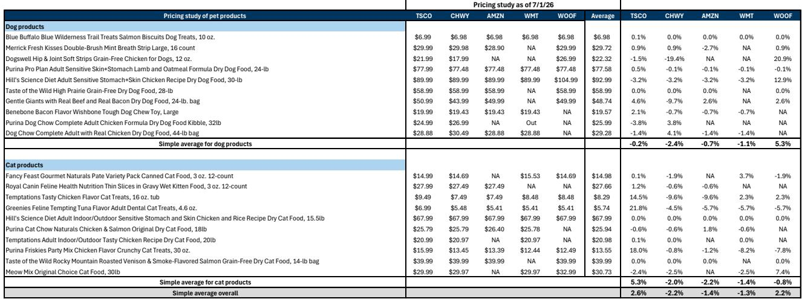
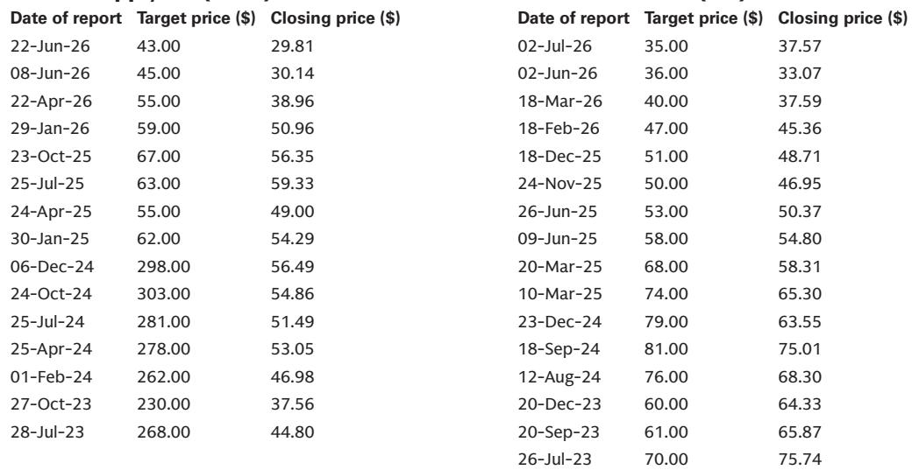
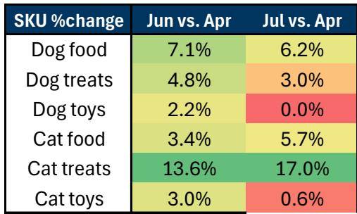

# Tractor Supply的宠物业务：定价与品类之间的结构性挑战

Tractor Supply长期以来被视为防御型零售的代表，拥有忠诚的农村客户基础和以耐用品、牲畜饲料及季节性必需品为主的产品组合。然而近几个季度，其宠物品类——一个高利润、高频率的流量驱动业务——正成为战略上的薄弱环节。自2026年第一季度财报发布以来，公司股价表现相对平淡，市场对宠物业务的关注度有所上升。核心问题并非周期性，而是结构性的。

宠物行业并未放缓，而是变得更加严苛。消费者在降级消费，促销活动不断升级，而由Walmart、Chewy和Amazon领衔的竞争格局，在价格感知和品类深度上正拉大差距。Tractor Supply处于中间位置：其价格仍高于同行平均水平，SKU数量落后于主要竞争对手，消费者对其价值的感知也在下滑。管理层已承认这一问题，并指出宠物品类的改善要到2026年下半年才能实现。这一时间表意味着公司将在多个财报周期内持续面临挑战。

本文并非单一研究报告的摘要，而是围绕特定竞争弱点、管理层可选的战略方向以及市场应关注的未解问题展开的分析性讨论。分析数据来源于近期一项全球投资银行对Tractor Supply、Chewy、Amazon、Walmart和Petco的宠物定价、SKU数量及消费者感知趋势的调查。该报告对Tractor Supply维持某一观点，该观点尚未得到验证。

## Tractor Supply的定价溢价并非定价能力的体现——在价值驱动的市场中，这是一种结构性劣势

2026年7月1日进行的最新定价调查显示，Tractor Supply的宠物整体价格比竞争组合平均水平高出2.6%。这一溢价在不同品类中并不均匀。在犬类产品中，Tractor Supply与同行大致持平，比平均水平低0.2%。但在猫类产品中，差距显著扩大至+5.3%。相比之下，Chewy为-2.0%，Amazon为-2.2%，Walmart为-1.4%。即便是自身面临结构性挑战的Petco，也仅为-0.8%。

通常，价格溢价被解读为品牌实力、产品差异化或消费者愿意支付的体现。但在Tractor Supply的案例中，这种解读并不成立。溢价并未得到优越价值感知的支持。根据HundredX的消费者感知数据，Tractor Supply在价格感知上一直低于Walmart和Chewy，且近几个月差距在扩大。价值感知——一个更全面的衡量指标，涵盖质量、选择和整体满意度——也呈现相同趋势。Tractor Supply落后于Walmart和Chewy，且差距在扩大。

这意味着Tractor Supply在收费更高的情况下，并未提供相应的消费体验。在一个消费者对价格日益敏感、愿意更换零售商的品类中，这不是一个可持续的定位。促销环境正在加剧。General Mills在最近的财报评论中指出，消费者更多在促销时购买，日常价格购买减少，导致销量组合的利润降低。Tractor Supply正面临这一趋势，却缺乏大型竞争对手所拥有的品类广度或定价灵活性。

对观察者而言，结论是清晰的：Tractor Supply的定价溢价并非护城河，而是一个弱点。它要么需要降价——这将挤压利润——要么需要显著提升感知价值，而这取决于品类、营销和店内体验。

## 品类短板比定价问题更严重，且集中在增长最快的宠物子品类

定价只是故事的一半。报告中的SKU分析揭示了一个更根本的结构性差距。在分析的六个宠物子品类中——狗粮、狗零食、狗玩具、猫粮、猫零食和猫玩具——Tractor Supply在猫粮、猫零食和猫玩具三个品类中SKU数量最低。在狗粮、狗零食和狗玩具中，它在五家零售商中排名第四，仅高于Petco。

这不是一个小差距。例如，在猫零食中，Tractor Supply的SKU数量仅为Amazon和Chewy的一小部分。猫玩具的情况类似。虽然自上次调查以来，Tractor Supply在猫粮和猫零食上的SKU数量略有增加，但在猫玩具、狗粮、狗零食和狗玩具上却有所减少。这一趋势不一致，表明公司仍处于品类调整的早期阶段，而非全面改革的后期。

管理层已表示，宠物品类的改善要到2026年下半年才能显现。这一时间表意味着当前季度和下一季度将继续反映同样的竞争劣势。在一个消费者每周做出购买决策的品类中，六到十二个月的滞后是相当长的周期。竞争对手并未停滞不前。Amazon和Walmart正在扩大选择范围，Chewy则在深化自有品牌和自动配送服务。

战略上的含义是，Tractor Supply不仅是在失去份额，更是在错过宠物市场中增长最快的部分。正如General Mills的业绩所证实，在当前环境下，猫粮和猫零食的增长速度快于狗粮。General Mills最近一个季度猫粮净销售额实现两位数增长，而狗粮仅为低个位数增长。Tractor Supply最弱的SKU位置恰恰集中在增长最快的子品类中。

## 消费者感知数据显示差距在扩大而非缩小——净购买意向尚未出现拐点

HundredX的数据提供了一个实时检验，看改善的叙事是否得到消费者行为的验证。到目前为止，答案最多是喜忧参半。Tractor Supply的净购买意向近期有所改善，趋势与Petco相似。这是一个积极信号，但需谨慎解读。净购买意向衡量的是陈述的兴趣，而非实际购买行为。而且这一改善来自较低的基数。

更令人关注的是价格和价值感知趋势。在价格感知上，Tractor Supply今年早些时候曾连续几个月缩小了与Chewy和Walmart的差距，但此后差距再次扩大。在价值感知上，Tractor Supply与排名前两位的零售商Chewy和Walmart之间的差距也在扩大。这一切正在实时发生，即便管理层在讨论品类改善和品类投资。

这一模式表明，Tractor Supply的竞争对手并未等待。Chewy和Walmart正在积极改善其价值主张，消费者也在响应。Tractor Supply的努力虽然真实，但尚未在消费者中产生足以改变感知的影响。风险在于，等到品类改善在2026年底到来时，竞争格局可能已经再次变化，差距将变得更大。

## 报告未完全解答的问题：Tractor Supply能否在不破坏利润的情况下缩小差距？干旱是否会加剧宠物业务的不利因素？

报告提供了定价、SKU数量和消费者感知的详细快照，但留下了几个关键问题未解。最重要的是，Tractor Supply能否在不严重损害利润的情况下缩小品类和价格感知差距？公司的宠物品类已面临压力。如果管理层被迫加大促销力度——General Mills的评论表明这是行业趋势——利润率可能进一步压缩。报告明确指出了这一风险，称如果Tractor Supply不得不对其宠物产品进行更多促销，利润率可能面临压力。

第二个未解问题是宠物业务不利因素与影响Tractor Supply更广泛业务的干旱条件之间的相互作用。报告估计第二季度同店销售增长为+0.5%，低于市场预期的+1.1%，并将干旱列为增量需求的不利因素。如果干旱持续到第三季度，可能会加剧宠物品类的疲软，对同店销售造成双重拖累。报告指出，如果干旱持续且促销强度增加，公司2026财年每股收益指引区间2.13至2.23美元可能面临风险。

第三个问题是宠物品类的修复本身是否足够。Tractor Supply不仅仅是一家宠物零售商。它是一家农村生活方式零售商，涉及牲畜、五金、季节性商品和服装。宠物品类很重要，但并非全部。如果核心客户受到通胀、干旱或消费模式变化的压力，仅修复宠物品类可能不足以推动估值重估。

## 观察者的决策框架：从现在到2026年底需关注的三个信号

对于试图评估Tractor Supply发展轨迹的观察者，报告提供了足够的数据来构建一个简单的决策框架。该框架包含三个领先指标。

第一个是相对于同行的定价。如果Tractor Supply的整体宠物价格溢价从当前的2.6%收窄至竞争平均水平，这将表明公司要么在价格上变得更具竞争力，要么竞争对手在提价。如果溢价扩大，则表明Tractor Supply在定价竞争中失利，价值感知将继续恶化。

第二个是猫粮和猫零食的SKU数量。这些是Tractor Supply最弱且增长最快的子品类。未来两到三个季度SKU数量的持续增加将是品类改革步入正轨的具体迹象。停滞或下降则是一个警示信号。

第三个是HundredX的价值感知趋势。如果Tractor Supply与排名前两位零售商之间的差距开始缩小，表明消费者正在注意到变化。如果差距继续扩大，则表明Chewy和Walmart的竞争反应正在超越Tractor Supply的努力。

这三个信号是可衡量的、公开可观察的，并且与公司自身的既定战略直接相关。它们并非保证，但提供了一种有纪律的方式来追踪改善叙事是否正在转化为现实。

## 完整报告包含支持本分析的电子版图表和详细数据

电子版报告中的定价调查、SKU表格和HundredX图表提供了本文每项主张背后的原始数据。这些图表显示了所调查的20种产品的精确价格比较、SKU数量的月度变化以及过去三个月的价格和价值感知趋势线。对于希望构建自己模型或进行敏感性分析的观察者，电子版图表是重要的资源。

报告还包括Tractor Supply 2026年第二季度财报的详细预览、General Mills宠物业务结果的解读，以及完整的估值和风险框架。报告指出了不利因素，但也透明地说明了在何种条件下这一观点会发生变化。

加入社区阅读完整报告并查看电子版图表。

*仅供参考。部分内容可能基于源材料通过AI辅助生成、翻译、总结或编辑，可能存在遗漏或错误。请独立核实。本文不构成任何专业建议。*

仅供参考。部分内容可能基于源材料通过AI辅助生成、翻译、总结或编辑，可能存在遗漏或错误。请独立核实。本文不构成任何专业建议。

