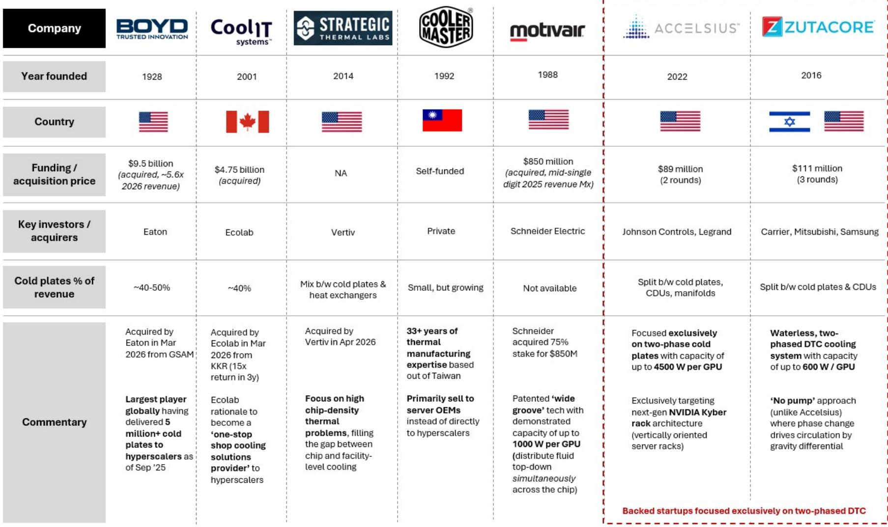
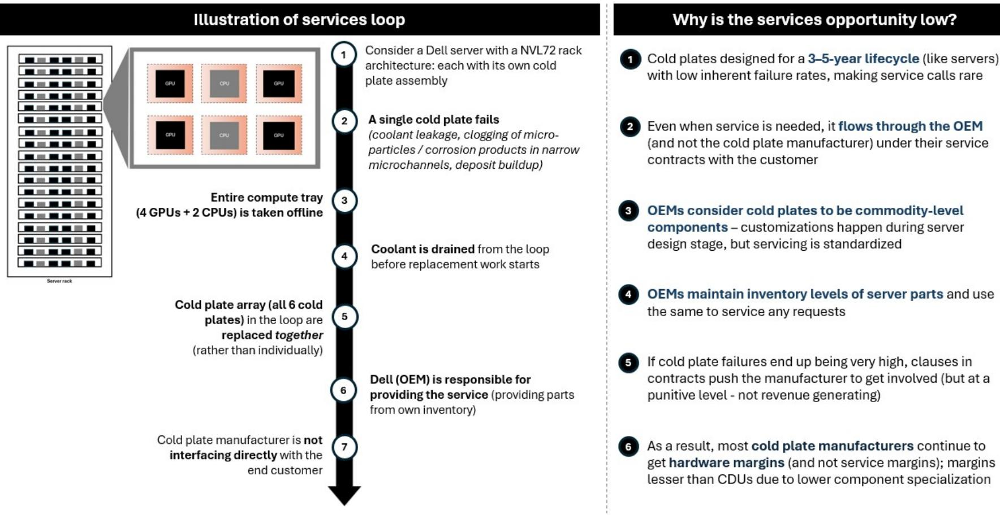
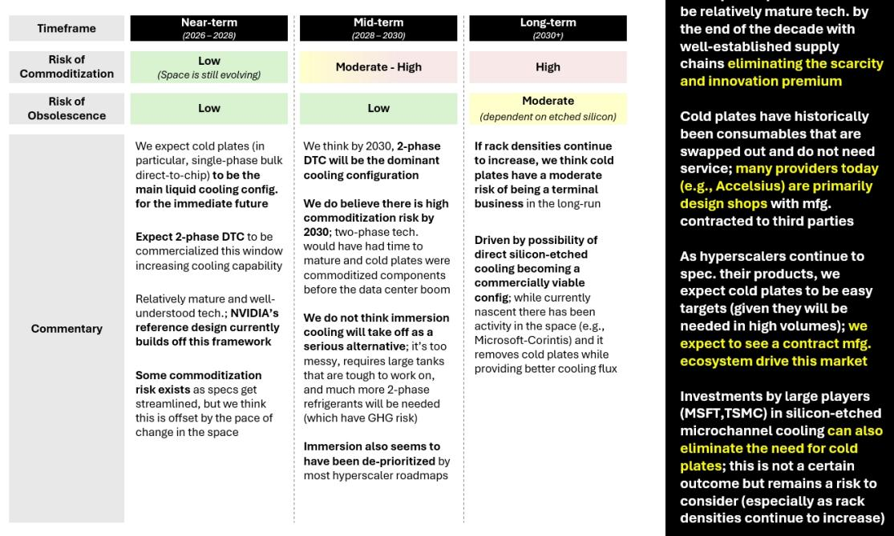

# Cold Plates Are a Near-Term AI Infrastructure Opportunity, but Their Business Model Faces Structural Commoditization and Obsolescence Risk

The data center industry is crossing a thermal threshold. For decades, air cooling was sufficient. Fans pushed cold air across server racks, heat rose, and operations continued. That era is ending. As AI workloads scale and GPU power densities climb toward multi-thousand watt levels, air cooling can no longer extract heat fast enough to maintain reliable performance. The industry is now transitioning to liquid cooling, and at the center of that transition sits a deceptively simple component: the cold plate.

Cold plates are the physical interface between a chip and the cooling system. They are machined blocks of copper or aluminum, clamped directly onto GPUs and CPUs, with internal microchannels through which coolant flows to absorb heat. In a single NVIDIA GB200 NVL72 rack, there are over 100 individual cold plates, one for every GPU and CPU. They are not optional in direct-to-chip liquid cooling architectures. They are the primary mechanism that transfers heat from silicon to liquid. Without them, the entire liquid cooling loop has no starting point.

Yet despite this critical role, cold plates present a strategic paradox that observers and operators must understand. The near-term outlook is clearly favorable: liquid cooling adoption is accelerating, hyperscalers are committing to fully liquid-cooled architectures, and cold plates are a non-optional component within those designs. Volume tailwinds are strong, and the market is projected to grow from roughly $2-3 billion today to $6-7 billion by 2030. But beneath that growth lies a more complex story. Cold plates are inherently simpler components than coolant distribution units. Their value is concentrated in design rather than system-level complexity. Service attach rates are low. And as manufacturing scales and designs standardize, the innovation premium that early players enjoy will erode. Over a longer time horizon, the risk is not just commoditization but outright obsolescence, as emerging technologies such as direct-to-die silicon-etched cooling could eliminate cold plates entirely.

This is not a straightforward observation. It is a timeline-dependent one. The potential is real, but it is concentrated in the near to medium term. Understanding where cold plates fit in the liquid cooling stack, how the economics work, and where the disruption risks lie is essential for anyone building a position in AI infrastructure.

## The Cold Plate Market Is Driven by Volume, Not Complexity, and That Changes the Economic Model

Cold plates are not like coolant distribution units. CDUs are complex electromechanical systems that manage flow, pressure, temperature, and redundancy across entire rows of racks. They require ongoing service, software integration, and replacement parts. That creates a recurring revenue stream and defensible margins. Cold plates, by contrast, are consumables. They are swapped out during server upgrades or maintenance. They do not require significant service attach. The margin is captured at the point of hardware sale, and that margin is harder to defend over time.

The economic model is straightforward: cold plate manufacturers provide a physical product at a price per kilowatt of cooling capacity. As volumes scale, unit costs decline. But unlike CDUs, where the system integrator can bundle hardware with service contracts and software, cold plate OEMs are largely design and manufacturing shops. The value lies in the thermal design: the geometry of internal channels, the choice of materials, the precision of machining. Once a design is proven and standardized, the barrier to entry drops. Contract manufacturers can replicate it. Hyperscalers, who are increasingly specifying their own cooling architectures, can commoditize the component.

This is already visible in the competitive landscape. Several large cold plate players have been acquired at significant multiples. Eaton acquired Boyd. Ecolab acquired CoolIT. Schneider acquired a stake in Motivair. These acquisitions reflect the near-term growth opportunity, but they also signal a consolidation trend that typically accompanies commoditization. When the largest players in industrial cooling and water treatment enter a component, they are betting on volume, not on sustained premium pricing.

The base case market size of $6-7 billion by 2030 assumes declining price per kilowatt, which the report explicitly builds into its model. That is a conservative and realistic assumption. It implies that even as volumes grow, revenue per unit will compress. The question for observers is whether the volume growth is enough to offset margin compression, and whether any player can build a defensible moat through proprietary design, manufacturing scale, or customer relationships.

## Two-Phase Cooling Will Reshape the Competitive Landscape, but It Also Accelerates Standardization

The current generation of cold plates uses single-phase cooling. Coolant remains in liquid form throughout the loop. It enters the cold plate cool, absorbs heat, and exits warm. This is well understood, relatively mature, and is the basis for NVIDIA's reference designs. But single-phase cooling has a theoretical limit on how much heat it can extract per unit area. As next-generation GPUs approach thermal design power levels of 2000 to 3000 watts and beyond, single-phase cold plates will struggle to keep junction temperatures within acceptable ranges.

This is driving the commercialization of two-phase direct-to-chip cooling. In two-phase systems, the coolant changes state from liquid to vapor as it absorbs heat. The phase change absorbs significantly more energy per unit volume, enabling higher heat flux removal. Several startups, including Accelsius and ZutaCore, are focused exclusively on two-phase cold plates. Accelsius, backed by Johnson Controls and Legrand, claims capacity up to 4500 watts per GPU. ZutaCore uses a waterless, pump-free approach where phase change drives circulation by gravity differential.

The report expects two-phase DTC to become the dominant cooling configuration by 2028 to 2030. That matters for the cold plate market in two ways. First, it creates a window of differentiation. Early two-phase players can command premium pricing while the technology is new and supply chains are immature. Second, it accelerates standardization. Once two-phase designs mature and hyperscalers adopt them at scale, the same commoditization dynamics that affect single-phase today will apply. The innovation premium will shrink. The contract manufacturing ecosystem will scale.

The strategic implication is clear: the window for outsized margins in cold plates is finite. It is longer for two-phase specialists who can lock in design wins with next-generation GPU architectures, but it is not permanent. The report's timeline framework captures this well. Near-term commoditization risk is low because the technology is still evolving. By 2030, it becomes moderate to high because two-phase will have matured and supply chains will be established.

## The Most Underappreciated Risk Is Not Commoditization but Obsolescence from Direct Silicon-Etched Cooling

Commoditization is a manageable risk. It compresses margins, but volume growth can compensate. The more existential risk is obsolescence. If a cooling technology emerges that eliminates the need for cold plates entirely, the entire market thesis collapses.

That technology exists in concept and is gaining traction. Direct silicon-etched microchannel cooling involves etching cooling channels directly into the silicon substrate of the chip. Coolant flows through these microchannels, absorbing heat at the source without any intermediate metal block. This approach removes the thermal interface material, the cold plate, and the associated thermal resistance. It provides superior heat flux removal because the coolant is in direct contact with the silicon. It also eliminates a mechanical component that requires precision machining, assembly, and replacement.

The report notes that investments by major players, including Microsoft and TSMC, in silicon-etched microchannel cooling are underway. This is not a speculative research project. It is an active area of development with serious capital behind it. The technology is still nascent and faces significant challenges in manufacturing, reliability, and integration with existing server architectures. But if it becomes commercially viable, it would render cold plates unnecessary for new deployments.

The timeline for this risk is longer. The report places it in the long-term, post-2030 horizon. That is reasonable. Even with accelerated development, silicon-etched cooling would need to prove itself at scale, gain hyperscaler qualification, and be integrated into GPU packaging. That takes years. But for observers with multi-decade horizons, or for companies building cold plate businesses today, this is a risk that cannot be ignored. The cold plate market may be a ten-year opportunity, not a permanent one.

## What the Report Does Not Fully Answer: Who Captures the Value as the Ecosystem Matures

The report provides a thorough primer on cold plate technology, market sizing, and competitive dynamics. But it leaves several meaningful open questions that the full report likely addresses in greater depth.

First, the role of hyperscalers in driving commoditization is acknowledged but not fully explored. Hyperscalers are increasingly specifying their own cooling architectures and sourcing components directly. They have the scale to force price compression and the engineering resources to develop proprietary designs. If hyperscalers bring cold plate design in-house and outsource only manufacturing, the OEMs become contract manufacturers with thin margins. The report notes that "hyperscalers continue to spec their products" and that "cold plates to be easy targets," but the full implications for the value chain are not spelled out.

Second, the service revenue opportunity is described as low, but the report does not quantify what service attach could look like in a two-phase world. Two-phase systems require more careful management of refrigerant charge, pressure, and phase change dynamics. That could create a service opportunity that single-phase cold plates lack. The report notes that "cold plates have historically been consumables that are swapped out and do not need service," but two-phase may change that calculus.

Third, the interaction between cold plate design and GPU architecture is an area where the report provides useful detail but leaves room for further analysis. As GPU packaging evolves, with chiplets, stacked memory, and interposers, the thermal management challenge becomes more complex. Cold plates must accommodate non-uniform heat distribution across the die. The report mentions hotspots and thermal interface material but does not fully explore how cold plate design must adapt to heterogeneous chip architectures.

## A Decision Framework for Evaluating Cold Plate Investments

For observers and operators evaluating exposure to the cold plate market, the following framework synthesizes the report's analysis into actionable questions.

First, assess the timeline. The cold plate opportunity is strongest in the near term, from 2026 to 2028. Single-phase DTC is the dominant configuration, volumes are growing rapidly, and commoditization has not yet compressed margins significantly. Companies with established manufacturing scale and customer relationships with hyperscalers are well positioned. In the medium term, 2028 to 2030, two-phase DTC becomes dominant, and the competitive landscape shifts. Early movers in two-phase may capture premium pricing, but the window is narrowing. Beyond 2030, the risk of obsolescence from direct silicon-etched cooling becomes material.

Second, evaluate the business model. Cold plate companies that rely solely on hardware margins face structural compression. Those that can bundle cold plates with CDUs, manifolds, and service contracts create a more defensible revenue stream. The report's exhibit on service attach shows that cold plates have significantly lower service revenue potential than CDUs. Companies that are purely cold plate specialists need to demonstrate how they will maintain margins as volumes scale.

Third, track the hyperscaler procurement strategy. If hyperscalers continue to specify and design their own cold plates, the OEM role shifts to contract manufacturing. If they rely on third-party designers and manufacturers, the innovation premium can persist. The report notes that some cold plate players provide primarily to server OEMs rather than directly to hyperscalers. That distribution channel matters for margin retention.

Fourth, monitor the development of direct silicon-etched cooling. This is the most disruptive risk on the horizon. Investments by Microsoft and TSMC are leading indicators. If commercial deployments emerge before 2030, the cold plate market timeline shortens. If the technology remains in R&D, the window extends.

## The Full Report Contains the Data and Charts That Support This Analysis

This article has synthesized the key strategic insights from a detailed research report on cold plates in the liquid cooling ecosystem. But the full report contains the underlying data, market sizing models, competitive landscape analysis, and original charts that enable deeper due diligence. The exhibit on cold plate top-down market sizing, the competitive overview table, and the timeline framework for commoditization and obsolescence risk are essential tools for building a research perspective.

Join the community to read the full report and review the original charts.

*For informational purposes only. Portions may be generated, translated, summarized, or edited with AI assistance based on source materials and may contain omissions or errors. Please verify independently. This is not professional advice.*

For informational purposes only. Portions may be generated, translated, summarized, or edited with AI assistance based on source materials and may contain omissions or errors. Please verify independently. This is not professional advice.

